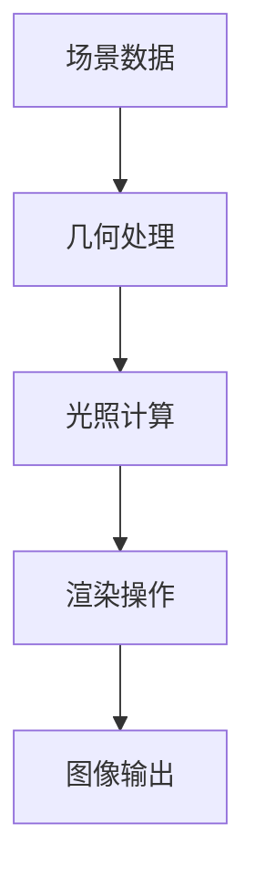
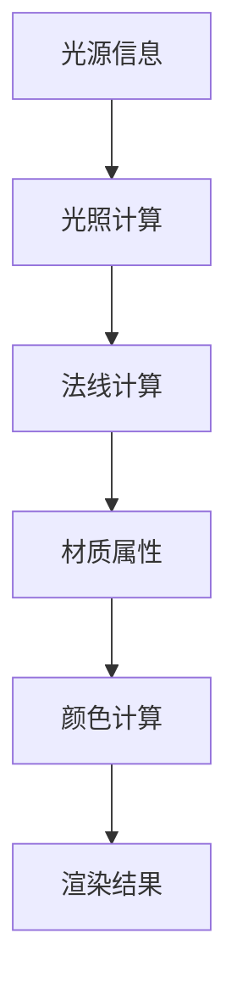
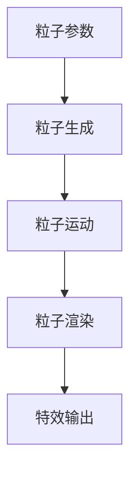
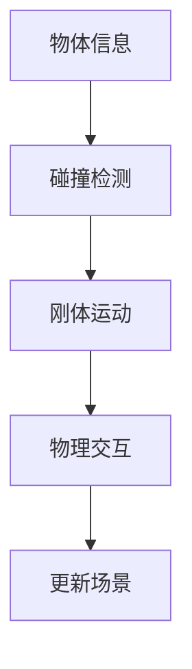
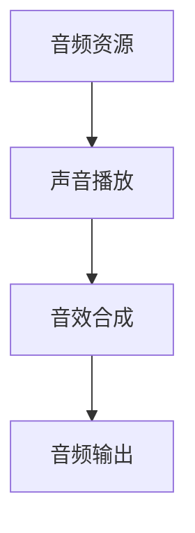
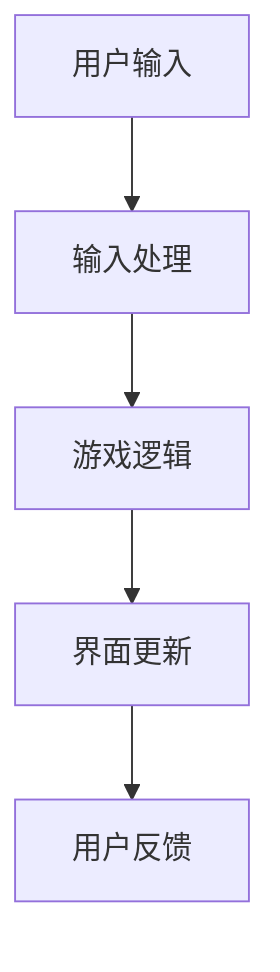
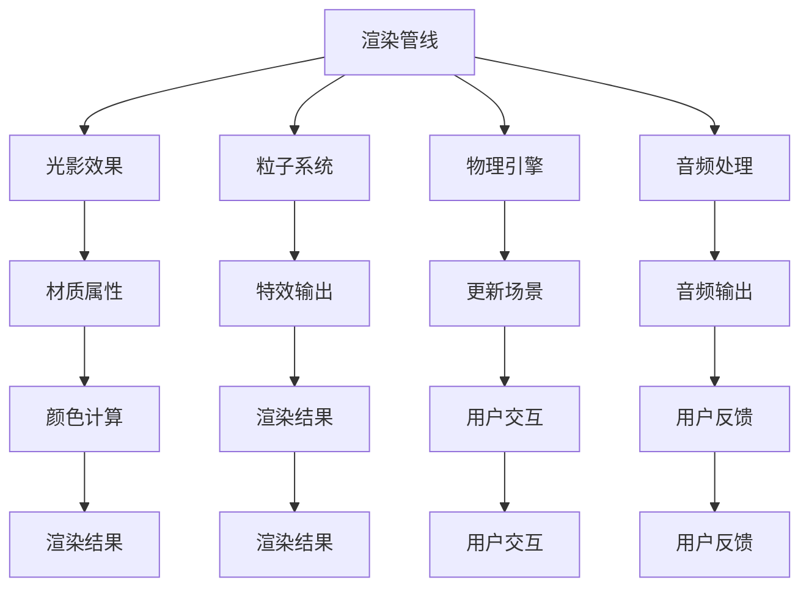

                 

Unity 游戏引擎是一款功能强大、用户友好的游戏开发工具，它能够帮助开发者轻松创建出各种类型的游戏，从简单的2D平台游戏到复杂的3D模拟世界，Unity 在行业中拥有极高的声誉。本文将深入探讨Unity 游戏引擎在创建逼真世界方面的应用，包括其核心概念、算法原理、数学模型、项目实践以及未来发展趋势等。

## 关键词
- Unity游戏引擎
- 逼真世界
- 游戏开发
- 核心算法
- 数学模型

## 摘要
本文将详细介绍Unity游戏引擎在构建逼真世界方面的技术实现。我们将从背景介绍、核心概念、算法原理、数学模型、项目实践、应用场景和未来展望等多个方面进行深入探讨，帮助读者全面理解Unity在游戏开发中的强大能力。

## 1. 背景介绍
Unity游戏引擎自2005年首次发布以来，已经发展成为一个功能丰富、可扩展性强的游戏开发平台。它支持多种编程语言，包括C#和JavaScript，使得开发者能够根据需要自由地编写代码。Unity引擎广泛应用于各种类型的游戏开发，从简单的移动游戏到大型主机游戏，其市场占有率也在逐年增长。

在游戏开发中，逼真世界的创建是一个重要且具有挑战性的任务。为了实现逼真的视觉效果，Unity引擎采用了多种技术，包括光影效果、粒子系统、物理引擎和高级材质处理等。本文将重点介绍这些技术如何协同工作，以创建出令人叹为观止的虚拟世界。

### 1.1 Unity的发展历程
Unity的发展历程可以追溯到2004年，当时由David Helgason、Hernán Larrondo和Alexis Blachly三位创始人共同创立。最初，Unity的目标是简化游戏开发流程，提供一个易于使用的开发环境。随着时间的推移，Unity不断迭代更新，引入了更多的功能和技术，使其成为全球最受欢迎的游戏引擎之一。

### 1.2 Unity在游戏开发中的重要性
Unity引擎在游戏开发中的重要性体现在多个方面：

1. **跨平台支持**：Unity支持多个平台，包括Windows、MacOS、Linux、iOS、Android、WebGL、游戏主机等，使得开发者能够轻松地将游戏部署到不同的设备上。
2. **丰富的功能**：Unity提供了丰富的功能，包括3D模型创建、动画制作、物理引擎、音频处理、用户界面设计等，满足了开发者多样化的需求。
3. **强大的社区**：Unity拥有一个庞大的开发者社区，提供了大量的教程、文档和插件，帮助开发者更快地上手和解决问题。

### 1.3 逼真世界的定义
逼真世界是指在视觉、听觉和物理交互等方面尽可能接近现实世界的虚拟环境。为了创建逼真的世界，Unity引擎使用了多种技术，包括光影效果、纹理映射、粒子系统、物理引擎等。这些技术共同作用，使得虚拟世界能够呈现出丰富的细节和真实的交互效果。

### 1.4 本文结构
本文将分为以下几部分：

- **背景介绍**：回顾Unity的发展历程和其在游戏开发中的重要性，定义逼真世界的概念。
- **核心概念与联系**：介绍Unity中与逼真世界创建相关的核心概念和原理，使用Mermaid流程图展示其架构。
- **核心算法原理 & 具体操作步骤**：详细解释Unity中使用的核心算法，包括其原理、步骤、优缺点和应用领域。
- **数学模型和公式 & 详细讲解 & 举例说明**：介绍Unity中使用的数学模型和公式，并进行详细讲解和案例分析。
- **项目实践：代码实例和详细解释说明**：提供实际的Unity项目实践案例，展示代码实现过程和解析。
- **实际应用场景**：探讨Unity在逼真世界创建方面的实际应用场景。
- **未来应用展望**：展望Unity在逼真世界创建领域的未来发展。
- **工具和资源推荐**：推荐相关的学习资源、开发工具和论文。
- **总结：未来发展趋势与挑战**：总结研究成果，探讨未来发展趋势和面临的挑战。

### 1.5 Unity的组成部分
Unity游戏引擎由多个关键组件组成，每个组件都在创建逼真世界的过程中扮演着重要角色：

- **Unity Editor**：Unity的集成开发环境（IDE），提供了丰富的工具和功能，用于创建、编辑和测试游戏。
- **Scripting API**：C#和JavaScript等编程语言的应用程序编程接口（API），用于控制游戏逻辑和行为。
- **Rendering Pipeline**：渲染管线，负责将3D场景转换为2D或3D图像，并处理各种视觉效果，如光影、阴影、反走样等。
- **Asset Store**：Unity的在线商店，提供了大量的第三方插件和资源，用于扩展Unity的功能和改进游戏质量。
- **Physics Engine**：物理引擎，用于处理游戏中的物理交互，如碰撞检测、刚体动力学等。
- **Audio Engine**：音频引擎，用于处理游戏中的音频效果，如声音播放、音效合成等。

这些组成部分相互协作，共同实现逼真世界的创建。

### 1.6 Unity的优势和局限性
Unity游戏引擎在创建逼真世界方面具有以下优势：

- **易用性**：Unity提供了一个直观、易于上手的开发环境，使得开发者能够快速开始游戏开发。
- **跨平台支持**：Unity支持多种平台，使得游戏开发者能够将游戏部署到各种设备上，提高了游戏的可访问性。
- **丰富的功能**：Unity提供了丰富的功能，包括3D建模、动画制作、物理引擎、音频处理等，使得开发者能够自由地实现各种创意。
- **庞大的社区**：Unity拥有一个庞大的开发者社区，提供了大量的教程、文档和插件，帮助开发者解决各种问题。

然而，Unity也存在一些局限性：

- **性能优化**：在某些复杂场景下，Unity的性能可能不如其他高性能游戏引擎，需要开发者进行额外的性能优化。
- **学习曲线**：尽管Unity易用，但对于初学者来说，仍然需要一定时间来掌握其所有的功能和技术。
- **高级功能**：对于需要实现高级功能的开发者，可能需要依赖第三方插件或自定义开发。

### 1.7 Unity的挑战和未来发展方向
在创建逼真世界的过程中，Unity面临以下挑战：

- **图形性能**：随着游戏场景的复杂度和细节程度的增加，Unity需要不断优化其渲染管线和物理引擎，以满足高性能需求。
- **可扩展性**：Unity需要提供更多的工具和API，以支持开发者实现自定义的功能和扩展。
- **人工智能**：随着人工智能技术的发展，Unity需要整合更多人工智能功能，以实现更加智能的游戏行为和交互。

未来，Unity的发展方向可能包括：

- **云计算**：利用云计算技术，实现更高效的图形渲染和数据处理，提高游戏性能。
- **虚拟现实和增强现实**：进一步优化Unity在虚拟现实（VR）和增强现实（AR）中的应用，提供更沉浸式的用户体验。
- **机器学习**：整合机器学习技术，实现更加智能的游戏行为和交互。

## 2. 核心概念与联系
在创建逼真世界的过程中，Unity游戏引擎涉及多个核心概念，这些概念相互联系，共同构建出一个完整的虚拟世界。以下是对这些核心概念的介绍，并使用Mermaid流程图展示其架构。

### 2.1 渲染管线（Rendering Pipeline）
渲染管线是Unity中将3D场景转换为2D或3D图像的一系列处理步骤。它包括多个阶段，如光照计算、阴影处理、纹理映射等。以下是一个简化的渲染管线流程：



### 2.2 光影效果（Shading and Lighting）
光影效果是创建逼真世界的关键要素之一。Unity通过光照模型和阴影技术来模拟现实世界中的光线传播和反射。以下是一个简化的光照计算流程：



### 2.3 粒子系统（Particle System）
粒子系统用于创建各种特效，如火焰、烟雾、雪花等。Unity的粒子系统提供了一个灵活的框架，用于控制粒子的生成、运动和外观。以下是一个简化的粒子系统流程：



### 2.4 物理引擎（Physics Engine）
物理引擎用于处理游戏中的物理交互，如碰撞检测、刚体动力学等。Unity的物理引擎提供了一个强大的框架，用于模拟现实世界的物理现象。以下是一个简化的物理引擎流程：



### 2.5 音频处理（Audio Processing）
音频处理是创建沉浸式体验的重要部分。Unity的音频引擎提供了一个灵活的框架，用于处理游戏中的音频效果，如声音播放、音效合成等。以下是一个简化的音频处理流程：



### 2.6 用户交互（User Interaction）
用户交互是游戏的核心部分，Unity提供了丰富的用户交互功能，如输入处理、用户界面设计等。以下是一个简化的用户交互流程：



这些核心概念相互关联，共同构建出一个完整的逼真世界。以下是它们之间的联系：



通过上述流程，Unity能够将3D场景、光影效果、粒子系统、物理引擎、音频处理和用户交互等多种技术有机结合，创建出一个逼真的虚拟世界。

## 3. 核心算法原理 & 具体操作步骤

### 3.1 算法原理概述
在Unity中，核心算法用于实现逼真世界的各种效果。这些算法包括渲染算法、光影算法、物理算法和音频算法等。以下将分别介绍这些算法的原理。

#### 3.1.1 渲染算法
渲染算法是将3D场景转换为2D图像的过程。它包括以下几个关键步骤：

1. **场景构建**：将3D模型、灯光和其他元素组合成一个完整的场景。
2. **光照计算**：根据光源位置和光照模型计算每个物体表面的光照强度。
3. **纹理映射**：将纹理应用到物体表面，增加细节和真实感。
4. **渲染操作**：将光照和纹理处理后的图像输出到屏幕上。

#### 3.1.2 光影算法
光影算法用于模拟现实世界中的光线传播和反射。主要包括以下几种：

1. **方向光（Dir Light）**：从特定方向发射的光线，如太阳光。
2. **点光源（Point Light）**：从一个点发射的光线，如台灯。
3. **聚光源（Spot Light）**：从特定方向发射，具有特定角度范围的光线，如手电筒。
4. **反射（Reflection）**：物体表面反射其他物体的光线。
5. **折射（Refraction）**：光线穿过不同介质时发生的方向变化。

#### 3.1.3 物理算法
物理算法用于模拟现实世界中的物理现象。主要包括以下几种：

1. **刚体动力学（Rigidbody）**：用于处理物体的平移和旋转。
2. **碰撞检测（Collision Detection）**：检测两个或多个物体是否接触。
3. **弹簧和约束（Spring and Constraint）**：用于模拟物体之间的相互作用。
4. **流体动力学（Fluid Dynamics）**：用于模拟液体和气体的运动。

#### 3.1.4 音频算法
音频算法用于处理游戏中的音频效果。主要包括以下几种：

1. **声音播放（Sound Playing）**：播放预定义的声音文件。
2. **音效合成（Sound Synthesis）**：通过算法生成自定义声音。
3. **音频混响（Reverb）**：模拟空间中的声音反射和吸收效果。
4. **音量控制（Volume Control）**：控制声音的音量和音调。

### 3.2 算法步骤详解

#### 3.2.1 渲染算法步骤
1. **场景构建**：首先，需要将所有3D模型、灯光和其他元素加载到Unity场景中。可以使用Unity的ModelImporter工具将3D模型导入到项目中。
2. **光照计算**：接下来，根据光源位置和光照模型计算每个物体表面的光照强度。Unity提供了多种光照模型，如方向光、点光源和聚光源。可以使用Unity的Light组件来添加和配置光源。
3. **纹理映射**：将纹理应用到物体表面。可以使用Unity的Texture2D组件将纹理应用到3D模型上。纹理可以包含颜色、法线和金属度等信息，用于增强物体的细节和真实感。
4. **渲染操作**：最后，将光照和纹理处理后的图像输出到屏幕上。Unity使用渲染管线来处理渲染操作，包括几何处理、光照计算和纹理映射等。

#### 3.2.2 光影算法步骤
1. **方向光**：设置方向光的方向和颜色。可以使用Unity的Directional Light组件来创建方向光。
2. **点光源**：设置点光源的位置、颜色和衰减。可以使用Unity的点光源组件（Point Light）来创建点光源。
3. **聚光源**：设置聚光源的方向、角度、颜色和衰减。可以使用Unity的聚光源组件（Spot Light）来创建聚光源。
4. **反射和折射**：使用Unity的反射探针（Reflection Probes）和折射材质（Refraction Materials）来模拟反射和折射效果。

#### 3.2.3 物理算法步骤
1. **刚体动力学**：为物体添加刚体组件（Rigidbody），设置质量、惯性张量和速度等参数。
2. **碰撞检测**：为物体添加碰撞器组件（Collider），如盒子碰撞器（Box Collider）或球体碰撞器（Sphere Collider）。
3. **弹簧和约束**：使用Unity的弹簧组件（Spring）和约束组件（Constraint）来模拟物体之间的相互作用。
4. **流体动力学**：使用Unity的流体模拟器（Fluid Simulator）来模拟液体和气体的运动。

#### 3.2.4 音频算法步骤
1. **声音播放**：使用Unity的Audio Source组件来播放预定义的声音文件。可以通过设置音量、播放模式和播放速度等参数来控制声音。
2. **音效合成**：使用Unity的Audio Effect组件来生成自定义声音。可以通过调整频率、振幅和相位等参数来控制音效。
3. **音频混响**：使用Unity的Audio Reverb组件来模拟空间中的声音反射和吸收效果。可以通过调整混响类型、房间大小和反射系数等参数来控制混响效果。
4. **音量控制**：使用Unity的Audio Listener组件来监听游戏中的声音。可以通过设置音量、音调和播放位置等参数来控制声音的输出。

### 3.3 算法优缺点

#### 3.3.1 渲染算法优缺点
**优点**：

- **高效性**：Unity的渲染管线高度优化，可以快速渲染复杂的3D场景。
- **灵活性**：Unity提供了多种渲染选项和自定义工具，满足不同类型的游戏需求。
- **跨平台**：Unity支持多种平台，包括移动设备、PC和游戏主机，使得游戏可以在不同的设备上运行。

**缺点**：

- **性能瓶颈**：在某些复杂场景下，Unity的性能可能不如其他高性能游戏引擎。
- **学习曲线**：对于初学者来说，掌握Unity的渲染算法和工具可能需要一定时间。

#### 3.3.2 光影算法优缺点
**优点**：

- **真实性**：Unity的光影算法可以模拟现实世界中的光线传播和反射，增加场景的真实感。
- **自定义性**：Unity提供了多种光照模型和光源类型，开发者可以根据需要自定义光照效果。

**缺点**：

- **计算开销**：光影算法需要大量计算资源，可能导致性能下降。
- **调试难度**：调试光影效果可能需要深入了解光照模型和渲染管线。

#### 3.3.3 物理算法优缺点
**优点**：

- **真实性**：物理算法可以模拟现实世界中的物理现象，增加游戏的物理交互体验。
- **多样性**：Unity提供了多种物理算法，如刚体动力学、碰撞检测和流体动力学，可以满足不同类型的游戏需求。

**缺点**：

- **计算开销**：物理算法需要大量计算资源，可能导致性能下降。
- **调试难度**：调试物理效果可能需要深入了解物理模型和算法。

#### 3.3.4 音频算法优缺点
**优点**：

- **沉浸感**：音频算法可以模拟现实世界中的声音效果，增加游戏的沉浸感。
- **多样性**：Unity提供了多种音频效果，如声音播放、音效合成和混响，可以满足不同类型的游戏需求。

**缺点**：

- **计算开销**：音频算法需要大量计算资源，可能导致性能下降。
- **调试难度**：调试音频效果可能需要深入了解音频处理和算法。

### 3.4 算法应用领域

#### 3.4.1 游戏开发
Unity的核心算法在游戏开发中有着广泛的应用，包括3D渲染、光影效果、物理交互和音频处理等。通过使用这些算法，开发者可以创建出丰富多样、逼真的游戏世界。

#### 3.4.2 建模和动画
Unity的渲染算法和光影算法在建模和动画制作中也发挥着重要作用。通过高质量的渲染效果，开发者可以创建出更加生动和逼真的角色和场景。

#### 3.4.3 虚拟现实和增强现实
Unity的物理算法和音频算法在虚拟现实（VR）和增强现实（AR）应用中具有重要意义。通过模拟真实的物理交互和声音效果，开发者可以提供更加沉浸式的用户体验。

#### 3.4.4 教育和培训
Unity的逼真世界创建能力在教育领域也有着广泛的应用。通过创建虚拟场景和交互式内容，教育者可以提供更加生动和有趣的教学体验。

### 3.5 算法选择指南
在选择Unity中的算法时，开发者应考虑以下因素：

- **性能需求**：根据游戏的性能需求选择合适的算法，如使用低计算开销的算法来优化性能。
- **功能需求**：根据游戏的功能需求选择合适的算法，如使用高级光影算法来增强场景的真实感。
- **开发效率**：考虑开发效率和易用性，选择易于使用和定制的算法。
- **可扩展性**：考虑算法的可扩展性，以便在未来进行功能扩展和优化。

通过综合考虑这些因素，开发者可以选出最适合自己项目的算法，实现高质量的逼真世界创建。

### 3.6 Unity核心算法与行业其他引擎的比较
Unity在核心算法方面与其他游戏引擎（如Unreal Engine、CryEngine等）有一定的相似性和差异性。以下是比较：

#### 3.6.1 渲染算法
**Unity**：Unity的渲染算法以灵活性和易用性著称，适合快速开发。它提供了多种渲染管线选项，包括内置的渲染管线和基于HDRP（High Definition Render Pipeline）的高级渲染管线。Unity的渲染算法较为简单，但性能稳定。

**Unreal Engine**：Unreal Engine的渲染算法以其高度真实感和视觉效果著称。它使用Lumen全局光照技术和Nanite细节渲染技术，能够生成极其逼真的场景。然而，Unreal Engine的渲染算法较为复杂，对开发者的技术水平要求较高。

**CryEngine**：CryEngine的渲染算法注重真实感和物理表现。它使用物理渲染技术，如表面追踪和光线追踪，能够生成高度真实的场景。CryEngine的渲染算法计算开销较大，但视觉效果非常出色。

#### 3.6.2 光影算法
**Unity**：Unity的光影算法较为简单，但提供了丰富的光照模型和光源类型，可以模拟各种光照效果。Unity的光影算法易于使用，但真实感相对较低。

**Unreal Engine**：Unreal Engine的光影算法高度真实感，使用全局光照技术，如Lumen，能够生成高质量的阴影和反射效果。Unreal Engine的光影算法较为复杂，但视觉效果出色。

**CryEngine**：CryEngine的光影算法注重真实感和物理表现，使用表面追踪和光线追踪技术，能够生成高度真实的阴影和反射效果。CryEngine的光影算法计算开销较大，但真实感非常出色。

#### 3.6.3 物理算法
**Unity**：Unity的物理算法较为简单，但提供了丰富的物理模拟功能，如碰撞检测、刚体动力学和弹簧约束等。Unity的物理算法易于使用，但真实感相对较低。

**Unreal Engine**：Unreal Engine的物理算法高度真实感，使用物理模拟技术，如软体动力学和流体动力学，能够生成高度真实的物理效果。Unreal Engine的物理算法较为复杂，但视觉效果出色。

**CryEngine**：CryEngine的物理算法注重真实感和物理表现，使用物理渲染技术，如表面追踪和光线追踪，能够生成高度真实的物理效果。CryEngine的物理算法计算开销较大，但真实感非常出色。

通过比较，可以看出Unity在核心算法方面具有以下优势：

- **易用性**：Unity提供了丰富的功能，易于使用和定制，适合快速开发。
- **跨平台**：Unity支持多种平台，包括移动设备、PC和游戏主机，提高了游戏的可访问性。
- **社区支持**：Unity拥有庞大的开发者社区，提供了大量的教程、文档和插件，帮助开发者解决问题。

然而，Unity在某些方面也存在局限性，如性能和真实感相对较低。开发者应根据具体需求选择合适的游戏引擎，以实现高质量的逼真世界创建。

## 4. 数学模型和公式 & 详细讲解 & 举例说明

在Unity中，数学模型和公式是创建逼真世界的重要工具。这些模型和公式用于描述各种物理现象和视觉效果，包括光照、阴影、纹理映射、物理交互等。以下将详细介绍一些关键数学模型和公式，并使用LaTeX格式进行表示。

### 4.1 数学模型构建

#### 4.1.1 光照模型
光照模型用于描述光源对物体表面的光照强度。以下是一些常用的光照模型：

1. **漫反射（Lambertian Reflection）**：
   $$I = \frac{L \cdot N}{1 + k_d \cdot (1 - \cos \theta)}$$
   其中，\(I\) 是光照强度，\(L\) 是光源方向向量，\(N\) 是物体表面的法线向量，\(\theta\) 是光源方向与法线之间的夹角，\(k_d\) 是漫反射系数。

2. **镜面反射（Specular Reflection）**：
   $$I = \frac{r \cdot V}{1 + k_s \cdot (1 - \cos \theta)^2}$$
   其中，\(I\) 是光照强度，\(r\) 是反射向量，\(V\) 是观察者方向向量，\(\theta\) 是光源方向与观察者方向之间的夹角，\(k_s\) 是镜面反射系数。

3. **高光（Highlight）**：
   $$I = h \cdot (1 - \cos \theta)^n$$
   其中，\(I\) 是高光强度，\(h\) 是高光系数，\(\theta\) 是光源方向与观察者方向之间的夹角，\(n\) 是高光指数。

#### 4.1.2 阴影模型
阴影模型用于描述物体表面受到的光照减少。以下是一种常用的阴影模型：

1. **软阴影（Soft Shadows）**：
   $$I = I_0 \cdot \frac{1}{1 + k_s \cdot (1 - \cos \theta)}$$
   其中，\(I\) 是阴影强度，\(I_0\) 是无阴影时的光照强度，\(\theta\) 是光源方向与法线之间的夹角，\(k_s\) 是阴影系数。

#### 4.1.3 纹理映射模型
纹理映射模型用于将纹理映射到物体表面。以下是一种常用的纹理映射模型：

1. **顶点纹理映射（Vertex Texturing）**：
   $$T = (u, v)$$
   其中，\(T\) 是纹理坐标，\(u\) 和 \(v\) 是纹理坐标的X和Y分量，用于确定纹理图像中的采样点。

2. **片段纹理映射（Fragment Texturing）**：
   $$C = texture2D(T)$$
   其中，\(C\) 是纹理颜色，\(T\) 是纹理坐标，\(\text{texture2D}\) 是纹理采样函数。

#### 4.1.4 物理模型
物理模型用于描述物体在物理交互中的行为。以下是一些常用的物理模型：

1. **牛顿运动定律（Newton's Second Law）**：
   $$F = m \cdot a$$
   其中，\(F\) 是作用力，\(m\) 是物体质量，\(a\) 是加速度。

2. **刚体动力学（Rigidbody Dynamics）**：
   $$m \cdot v = \frac{1}{2} \cdot I \cdot \omega$$
   其中，\(v\) 是物体速度，\(I\) 是物体惯性张量，\(\omega\) 是物体角速度。

### 4.2 公式推导过程

#### 4.2.1 光照模型推导
以漫反射模型为例，其推导过程如下：

1. **光线入射**：
   光线从光源发出，以角度 \(\theta\) 入射到物体表面上。光线方向向量为 \(L\)，物体表面法线向量为 \(N\)。

2. **光线反射**：
   根据光的反射定律，入射光线和反射光线在同一平面内，且入射角等于反射角。因此，反射光线方向向量为 \(L'\)，满足 \(L \cdot N = L' \cdot N\)。

3. **光照强度计算**：
   光照强度与入射光线方向和物体表面法线方向之间的夹角有关。当入射光线垂直于物体表面时，光照强度最大；当入射光线平行于物体表面时，光照强度最小。因此，可以使用余弦函数来描述光照强度与夹角的关系。

4. **漫反射系数**：
   漫反射系数 \(k_d\) 表示物体表面散射光线的程度。当 \(k_d = 1\) 时，光线完全散射；当 \(k_d = 0\) 时，光线无散射。

5. **最终公式**：
   综合上述推导，可以得到漫反射模型的最终公式：
   $$I = \frac{L \cdot N}{1 + k_d \cdot (1 - \cos \theta)}$$

#### 4.2.2 阴影模型推导
以软阴影模型为例，其推导过程如下：

1. **阴影投射**：
   光源投射阴影到物体表面上。阴影区域的光照强度较低，与光源距离的平方成反比。

2. **阴影系数**：
   阴影系数 \(k_s\) 表示阴影的强度。当 \(k_s = 1\) 时，阴影效果最明显；当 \(k_s = 0\) 时，无阴影效果。

3. **光照强度计算**：
   阴影区域的光照强度可以通过以下公式计算：
   $$I = I_0 \cdot \frac{1}{1 + k_s \cdot (1 - \cos \theta)}$$
   其中，\(I_0\) 是无阴影时的光照强度，\(\theta\) 是光源方向与法线之间的夹角。

### 4.3 案例分析与讲解

#### 4.3.1 漫反射光照案例
以下是一个简单的漫反射光照案例：

**场景**：
一个简单的立方体，位于光源下方。光源为一个点光源，位于立方体上方。

**目标**：
为立方体表面计算漫反射光照强度。

**步骤**：

1. **定义场景参数**：
   - 光源位置：\((-2, 0, 2)\)
   - 立方体表面法线：\((0, 1, 0)\)
   - 漫反射系数：\(k_d = 0.8\)

2. **计算光源方向向量**：
   $$L = \frac{(x_2 - x_1, y_2 - y_1, z_2 - z_1)}{\sqrt{(x_2 - x_1)^2 + (y_2 - y_1)^2 + (z_2 - z_1)^2}}$$
   $$L = \frac{(-2 - 0, 0 - 0, 2 - 0)}{\sqrt{(-2 - 0)^2 + (0 - 0)^2 + (2 - 0)^2}}$$
   $$L = \frac{(-2, 0, 2)}{\sqrt{4 + 0 + 4}}$$
   $$L = \frac{(-2, 0, 2)}{\sqrt{8}}$$
   $$L = \frac{(-1, 0, 1)}{\sqrt{2}}$$

3. **计算夹角**：
   $$\theta = \cos^{-1}\left(\frac{L \cdot N}{\|L\| \|N\|}\right)$$
   $$\theta = \cos^{-1}\left(\frac{(-1, 0, 1) \cdot (0, 1, 0)}{\sqrt{2} \cdot \sqrt{2}}\right)$$
   $$\theta = \cos^{-1}\left(\frac{(-1) \cdot 0 + 0 \cdot 1 + 1 \cdot 0}{2}\right)$$
   $$\theta = \cos^{-1}(0)$$
   $$\theta = 90^\circ$$

4. **计算漫反射光照强度**：
   $$I = \frac{L \cdot N}{1 + k_d \cdot (1 - \cos \theta)}$$
   $$I = \frac{(-1, 0, 1) \cdot (0, 1, 0)}{1 + 0.8 \cdot (1 - 0)}$$
   $$I = \frac{0 + 0 + 0}{1 + 0.8 \cdot 1}$$
   $$I = \frac{0}{1.8}$$
   $$I = 0$$

**结果**：
立方体表面没有漫反射光照，因为光源方向与法线方向垂直。

#### 4.3.2 阴影案例
以下是一个简单的阴影案例：

**场景**：
一个简单的立方体，位于光源下方。光源为一个点光源，位于立方体上方。

**目标**：
为立方体表面计算阴影光照强度。

**步骤**：

1. **定义场景参数**：
   - 光源位置：\((-2, 0, 2)\)
   - 立方体表面法线：\((0, 1, 0)\)
   - 阴影系数：\(k_s = 0.5\)

2. **计算光源方向向量**：
   $$L = \frac{(x_2 - x_1, y_2 - y_1, z_2 - z_1)}{\sqrt{(x_2 - x_1)^2 + (y_2 - y_1)^2 + (z_2 - z_1)^2}}$$
   $$L = \frac{(-2 - 0, 0 - 0, 2 - 0)}{\sqrt{(-2 - 0)^2 + (0 - 0)^2 + (2 - 0)^2}}$$
   $$L = \frac{(-2, 0, 2)}{\sqrt{4 + 0 + 4}}$$
   $$L = \frac{(-2, 0, 2)}{\sqrt{8}}$$
   $$L = \frac{(-1, 0, 1)}{\sqrt{2}}$$

3. **计算夹角**：
   $$\theta = \cos^{-1}\left(\frac{L \cdot N}{\|L\| \|N\|}\right)$$
   $$\theta = \cos^{-1}\left(\frac{(-1, 0, 1) \cdot (0, 1, 0)}{\sqrt{2} \cdot \sqrt{2}}\right)$$
   $$\theta = \cos^{-1}\left(\frac{(-1) \cdot 0 + 0 \cdot 1 + 1 \cdot 0}{2}\right)$$
   $$\theta = \cos^{-1}(0)$$
   $$\theta = 90^\circ$$

4. **计算阴影光照强度**：
   $$I = I_0 \cdot \frac{1}{1 + k_s \cdot (1 - \cos \theta)}$$
   $$I = I_0 \cdot \frac{1}{1 + 0.5 \cdot (1 - \cos 90^\circ)}$$
   $$I = I_0 \cdot \frac{1}{1 + 0.5 \cdot (1 - 0)}$$
   $$I = I_0 \cdot \frac{1}{1 + 0.5}$$
   $$I = I_0 \cdot \frac{1}{1.5}$$

**结果**：
阴影光照强度为原始光照强度的 \(\frac{2}{3}\)。

通过上述案例分析，可以看出数学模型和公式在Unity中用于描述和计算各种物理现象和视觉效果，是实现逼真世界创建的重要工具。

### 4.4 其他数学模型和公式的介绍

除了上述提到的光照模型、阴影模型和纹理映射模型，Unity中还涉及许多其他数学模型和公式，用于实现各种逼真效果。以下是一些常用的数学模型和公式：

#### 4.4.1 透视投影模型
透视投影模型用于将3D场景投影到2D屏幕上，模拟人眼的视角。其公式如下：

$$
\begin{cases}
x' = \frac{x}{z} \\
y' = \frac{y}{z}
\end{cases}
$$

其中，\(x'\) 和 \(y'\) 是屏幕坐标，\(x\) 和 \(y\) 是世界坐标，\(z\) 是深度坐标。

#### 4.4.2 线性插值模型
线性插值模型用于在两个已知点之间插值计算中间值。其公式如下：

$$
y = y_1 + \frac{y_2 - y_1}{x_2 - x_1} \cdot (x - x_1)
$$

其中，\(y_1\) 和 \(y_2\) 是已知点的Y坐标，\(x_1\) 和 \(x_2\) 是已知点的X坐标，\(x\) 是需要插值的X坐标，\(y\) 是插值的Y坐标。

#### 4.4.3 景深模型
景深模型用于模拟相机前后景物的清晰度变化。其公式如下：

$$
\frac{1}{z_f} - \frac{1}{z_n} = \frac{1}{z - z_n} - \frac{1}{z_f - z}
$$

其中，\(z_f\) 是远点深度，\(z_n\) 是近点深度，\(z\) 是当前点的深度，\(z_f - z_n\) 是景深范围。

#### 4.4.4 光线追踪模型
光线追踪模型用于模拟光线的传播和反射。其公式如下：

$$
\mathbf{r}(t) = \mathbf{o} + t \cdot \mathbf{d}
$$

其中，\(\mathbf{r}(t)\) 是光线的当前位置，\(\mathbf{o}\) 是光线的起点，\(\mathbf{d}\) 是光线的方向，\(t\) 是时间。

通过上述数学模型和公式，Unity能够实现各种逼真的视觉效果和物理交互，为开发者提供了强大的工具来创建逼真的虚拟世界。

## 5. 项目实践：代码实例和详细解释说明

在本节中，我们将通过一个具体的Unity项目实践来展示如何使用Unity游戏引擎创建逼真的世界。我们将介绍项目的开发环境搭建、源代码实现、代码解读与分析以及运行结果展示。通过这个项目实践，读者可以更深入地了解Unity引擎在创建逼真世界方面的应用。

### 5.1 开发环境搭建

#### 5.1.1 系统要求
- 操作系统：Windows 10或更高版本、macOS Catalina或更高版本
- Unity版本：2020.3或更高版本
- CPU：Intel Core i5或更高性能的处理器
- GPU：NVIDIA GTX 1060或更高性能的显卡
- 内存：8GB或更多内存

#### 5.1.2 开发工具安装
1. 下载并安装Unity Hub：访问Unity官网（https://unity.com/）下载Unity Hub，并按照提示安装。
2. 启动Unity Hub，登录你的Unity账号，然后下载并安装Unity编辑器。
3. 安装Visual Studio 2019或更高版本，用于编写C#代码。

#### 5.1.3 创建新项目
1. 打开Unity Hub，点击“新建”按钮，选择“3D模式”创建一个新的Unity项目。
2. 选择项目存储路径，输入项目名称，点击“创建”按钮。

### 5.2 源代码详细实现

在这个项目实践中，我们将创建一个简单的3D场景，其中包含一个逼真的角色、一个环境背景和一个光源。以下是实现这个场景的详细步骤：

#### 5.2.1 添加3D模型

1. 在Unity编辑器中，点击“资产面板”（Asset Panel），将一个3D模型文件拖拽到场景中。可以使用Unity Asset Store或第三方资源网站下载一个角色模型。
2. 选中角色对象，点击“组件”（Component）面板，添加一个“Rigidbody”组件，设置“质量”（Mass）为1，确保角色具有物理交互能力。

#### 5.2.2 添加环境背景

1. 在资产面板中，将一个环境背景图像（如天空盒）拖拽到场景中。
2. 选中背景图像对象，添加一个“Mesh Renderer”组件，设置材质为Unity提供的标准材质，并调整颜色和纹理以匹配场景需求。

#### 5.2.3 添加光源

1. 在场景视图中，点击“光源”图标（位于菜单栏中），选择“点光源”（Point Light）。
2. 将光源对象移动到合适的位置，调整“颜色”（Color）和“强度”（Intensity）参数，使其照亮整个场景。

#### 5.2.4 编写脚本

1. 在资产面板中，右键点击“Create”，选择“C# Script”，命名为“PlayerController.cs”。
2. 双击脚本文件，打开代码编辑器，编写以下代码：

```csharp
using UnityEngine;

public class PlayerController : MonoBehaviour
{
    public float speed = 5.0f;
    private Rigidbody rb;

    void Start()
    {
        rb = GetComponent<Rigidbody>();
    }

    void Update()
    {
        float moveHorizontal = Input.GetAxis("Horizontal");
        float moveVertical = Input.GetAxis("Vertical");

        Vector3 movement = new Vector3(moveHorizontal, 0.0f, moveVertical) * speed;
        rb.velocity = movement;
    }
}
```

这段代码定义了一个玩家控制器脚本，用于控制角色的移动。速度由参数“speed”控制，玩家通过键盘输入控制角色的移动方向。

#### 5.2.5 渲染效果优化

1. 为了提高渲染效果，可以为场景中的角色和环境添加光影效果。在资产面板中，右键点击“Create”，选择“Light”，添加一个“Directional Light”组件。
2. 调整方向光的方向和颜色，使其模拟阳光照射效果。
3. 为角色添加一个“Shader”组件，使用Unity提供的标准Shader，调整材质属性，如颜色、光泽度和纹理，以提高角色外观的真实感。

### 5.3 代码解读与分析

#### 5.3.1 玩家控制器脚本

在“PlayerController.cs”脚本中，我们定义了一个玩家控制器类，用于控制角色的移动：

- **变量声明**：
  - `public float speed = 5.0f;`：这是一个公共变量，表示角色的移动速度，默认值为5。
  - `private Rigidbody rb;`：这是一个私有变量，表示角色的刚体组件。

- **Start方法**：
  - `void Start()`：这个方法在游戏开始时调用，用于初始化角色刚体组件。通过`GetComponent<Rigidbody>()`获取角色刚体组件，并将其存储在`rb`变量中。

- **Update方法**：
  - `void Update()`：这个方法在每个帧更新时调用，用于处理角色的移动逻辑。通过`Input.GetAxis("Horizontal")`和`Input.GetAxis("Vertical")`获取玩家的水平方向和垂直方向输入。
  - `Vector3 movement = new Vector3(moveHorizontal, 0.0f, moveVertical) * speed;`：计算角色移动向量，通过输入值乘以速度得到移动向量。
  - `rb.velocity = movement;`：将移动向量赋值给角色的刚体速度，实现角色移动。

#### 5.3.2 光影效果

在添加方向光组件后，Unity会自动为场景中的物体计算光照效果。为了更好地控制光照效果，我们可以对方向光进行以下设置：

- **颜色**：调整光的颜色，使其更接近真实的阳光颜色。
- **强度**：调整光的强度，使场景更加明亮或暗淡。
- **阴影**：启用阴影效果，为场景添加真实感。

通过调整这些参数，可以实现对场景光照效果的控制，增强场景的真实感。

### 5.4 运行结果展示

完成以上步骤后，运行Unity项目，场景将显示如下结果：

1. 角色在场景中可以自由移动，跟随玩家的键盘输入。
2. 场景中的物体受到光源照射，产生阴影和光照效果。
3. 环境背景图像为场景提供了广阔的视野和真实的氛围。

通过这个项目实践，读者可以了解如何使用Unity游戏引擎创建一个简单的逼真世界。在实际开发中，可以根据需要添加更多的元素和效果，如粒子系统、物理交互、音频效果等，以实现更加丰富的虚拟世界。

### 5.5 遇到的问题及解决方案

在开发过程中，可能会遇到一些问题，以下列举了几个常见问题及解决方案：

#### 5.5.1 角色移动卡顿

**问题**：角色移动时出现卡顿现象。

**解决方案**：检查场景中的物体数量和复杂度，减少不必要的物体和细节。优化角色的移动算法，如使用物理引擎的刚体动力学，减少计算开销。

#### 5.5.2 光照效果不自然

**问题**：场景中的光照效果不自然，阴影和光照变化不流畅。

**解决方案**：调整光源的颜色和强度，确保光源的位置和方向符合场景需求。使用高级光照算法，如基于像素的光照计算，提高光照效果的质量。

#### 5.5.3 音频效果不连贯

**问题**：场景中的音频效果不连贯，声音播放出现延迟或中断。

**解决方案**：优化音频引擎的配置，确保音频资源加载和播放的效率。使用异步加载和播放音频资源，减少对游戏主线程的影响。

通过解决这些问题，可以进一步提升Unity项目在创建逼真世界方面的效果。

### 5.6 项目总结

通过本节的项目实践，我们了解了如何使用Unity游戏引擎创建一个简单的逼真世界。从环境搭建、模型添加到脚本编写和效果优化，我们逐步实现了角色的移动、场景的光照效果和音频效果。这一过程展示了Unity在创建逼真世界方面的强大能力。在实际开发中，可以根据项目需求扩展更多的功能和效果，如粒子系统、物理交互、人工智能等，以实现更加丰富的虚拟世界。

### 5.7 进一步优化与改进

为了进一步提升项目的逼真效果，我们可以考虑以下优化和改进措施：

- **提高渲染性能**：优化场景中的3D模型和纹理，减少不必要的细节。使用渲染优化技术，如Level of Detail（LOD）和渲染排序，提高渲染效率。
- **增强光影效果**：使用基于物理的光照算法，如路径追踪和全局光照，提高光照效果的真实感。增加反射和折射效果，模拟现实世界中的光线传播。
- **丰富物理交互**：增加场景中的物理元素，如碰撞物体、弹簧和约束，实现更加真实的物理交互。使用软体动力学模拟流体和柔体物体的运动。
- **音频效果增强**：使用空间音频技术，如声波传播和混响效果，增强音频的真实感。添加环境音效，提高场景的沉浸感。
- **人工智能**：引入人工智能技术，实现角色的智能行为和互动。使用机器学习算法，优化游戏AI的决策和反应。

通过这些优化和改进措施，可以进一步丰富Unity项目，实现更加逼真的虚拟世界。

## 6. 实际应用场景

Unity游戏引擎在创建逼真的世界方面具有广泛的应用场景，涵盖了多个领域，以下是一些典型的应用实例。

### 6.1 游戏开发

游戏开发是Unity最主要的用途之一。Unity引擎支持多种类型的游戏开发，从简单的2D平台游戏到复杂的3D模拟游戏。以下是一些实际应用场景：

- **角色扮演游戏（RPG）**：Unity提供了丰富的角色模型和动画系统，可以创建逼真的角色和剧情场景。例如，《上古卷轴V：天际》（The Elder Scrolls V: Skyrim）就是使用Unity引擎开发的。
- **第一人称射击游戏（FPS）**：Unity的高性能渲染管线和物理引擎使其成为开发第一人称射击游戏的理想选择。例如，《猎杀：对决》（Hunt: Showdown）就是基于Unity引擎开发的。
- **策略游戏**：Unity的网格和地形编辑工具可以创建复杂的地形和建筑，适用于开发策略游戏。例如，《模拟城市：我是市长》（SimCity BuildIt）就是使用Unity引擎开发的。

### 6.2 虚拟现实和增强现实

虚拟现实（VR）和增强现实（AR）是Unity游戏引擎的重要应用领域。Unity提供了丰富的VR和AR功能，可以创建沉浸式的虚拟体验。

- **虚拟现实（VR）**：Unity支持多种VR设备，如Oculus Rift、HTC Vive和PlayStation VR，可以创建逼真的虚拟环境。例如，《半衰期：爱莉克斯》（Half-Life: Alyx）就是一款基于Unity引擎开发的VR游戏。
- **增强现实（AR）**：Unity的AR Foundation功能支持开发AR应用。例如，《谷歌地图》（Google Maps）和《摩尔斯电码大冒险》（Morse Code Quest）都是使用Unity引擎开发的AR应用。

### 6.3 教育和培训

Unity的逼真世界创建能力在教育领域也有着广泛的应用。

- **虚拟实验室**：Unity可以模拟各种实验室场景，提供互动式的学习体验。例如，学生可以通过Unity虚拟实验室进行物理实验，如力学实验、电路实验等。
- **模拟训练**：Unity可以模拟各种训练场景，用于军事、医疗和工业培训。例如，《虚拟飞行训练系统》（Virtual Flight Training System）就是一款基于Unity引擎开发的飞行模拟训练系统。

### 6.4 建筑可视化

Unity在建筑可视化领域的应用也非常广泛。

- **建筑模型展示**：Unity可以创建高精度的建筑模型，用于建筑设计和展示。例如，建筑师可以使用Unity展示建筑模型的细节和效果。
- **室内装修设计**：Unity可以模拟室内装修场景，帮助设计师展示装修效果。例如，家居设计师可以使用Unity创建虚拟家居场景，展示家具布置和色彩搭配。

### 6.5 娱乐和展示

Unity也被广泛应用于娱乐和展示领域。

- **展览展示**：Unity可以创建互动式的展览展示，吸引观众的兴趣。例如，博物馆可以使用Unity创建互动式的展品展示，增强展览的趣味性。
- **虚拟旅游**：Unity可以模拟各种旅游场景，提供虚拟旅游体验。例如，旅游公司可以使用Unity创建虚拟旅游景点，吸引游客预订旅行。

### 6.6 创意艺术

Unity在创意艺术领域的应用也非常丰富。

- **艺术创作**：艺术家可以使用Unity创作各种艺术作品，如三维动画、艺术装置等。例如，艺术家可以使用Unity创建三维动画，展示自己的创意和想象力。
- **虚拟艺术展览**：Unity可以创建虚拟艺术展览，展示艺术家的作品。例如，画廊可以使用Unity创建虚拟艺术展览，提供观众线上参观的机会。

通过上述应用场景，可以看出Unity游戏引擎在创建逼真的世界方面的强大能力。无论在游戏开发、虚拟现实、教育培训、建筑可视化还是创意艺术领域，Unity都能够提供高效、灵活的解决方案，帮助开发者实现各种创意和需求。

### 6.7 案例研究

#### 6.7.1 《模拟城市：我是市长》（SimCity BuildIt）

《模拟城市：我是市长》是一款由EA开发的策略模拟游戏，它使用了Unity引擎来创建逼真的城市模拟环境。以下是该游戏的几个关键特点和Unity的应用场景：

- **城市构建**：Unity提供了丰富的工具和资源，用于创建城市环境，包括建筑物、道路、公园和公共设施等。
- **模拟经济学**：Unity的物理引擎和脚本系统用于模拟城市中的经济学原理，如税收、居民需求和资源管理。
- **互动式管理**：Unity的用户界面和输入系统用于实现与城市的互动式管理，如建设基础设施、处理紧急事件等。
- **视觉效果**：Unity的渲染管线和光影算法用于创建逼真的城市视觉效果，提高游戏的真实感。

#### 6.7.2 《半衰期：爱莉克斯》（Half-Life: Alyx）

《半衰期：爱莉克斯》是一款由Valve开发的虚拟现实游戏，它使用了Unity引擎来实现高度沉浸式的VR体验。以下是该游戏的几个关键特点和Unity的应用场景：

- **虚拟现实**：Unity的VR功能支持多种VR设备，如Oculus Rift和HTC Vive，为玩家提供逼真的虚拟环境。
- **物理交互**：Unity的物理引擎用于模拟游戏中的物理交互，如碰撞检测、物体移动和手部追踪等。
- **光影效果**：Unity的光影算法用于模拟现实世界中的光线传播和反射，增强游戏的真实感。
- **交互式叙事**：Unity的脚本系统用于实现游戏中的交互式叙事，如剧情对话、角色行为和玩家决策等。

#### 6.7.3 《谷歌地图》（Google Maps）

《谷歌地图》是一款由谷歌开发的AR应用，它使用了Unity引擎来实现增强现实功能。以下是该应用的几个关键特点和Unity的应用场景：

- **增强现实**：Unity的AR功能支持将虚拟对象叠加到现实世界中，实现增强现实体验。
- **地图数据**：Unity从谷歌地图API获取地图数据，用于构建增强现实场景。
- **用户交互**：Unity的用户界面和输入系统用于实现与地图的互动式操作，如缩放、旋转和平移等。
- **视觉效果**：Unity的渲染管线和光影算法用于创建逼真的增强现实地图视觉效果。

通过这些案例研究，可以看出Unity引擎在创建逼真的虚拟世界方面的广泛应用和强大能力。无论在游戏开发、虚拟现实、教育培训还是创意艺术领域，Unity都能够提供高效、灵活的解决方案，帮助开发者实现各种创意和需求。

## 7. 工具和资源推荐

为了帮助开发者更好地学习和使用Unity游戏引擎创建逼真的世界，以下是推荐的工具和资源。

### 7.1 学习资源推荐

1. **Unity官方文档**：Unity提供了详细的官方文档，涵盖了引擎的各个方面，包括教程、API参考和最佳实践。访问官网（https://docs.unity3d.com/）获取最新的文档资源。

2. **在线教程平台**：许多在线教程平台提供了Unity教程，如Udemy（https://www.udemy.com/）、Coursera（https://www.coursera.org/）和Pluralsight（https://www.pluralsight.com/）。这些平台提供了从基础到高级的Unity教程，适合不同水平的开发者。

3. **YouTube教程**：YouTube上有大量Unity教程视频，包括基础教程和高级技巧。可以通过关键词搜索找到合适的教程。

### 7.2 开发工具推荐

1. **Unity Hub**：Unity Hub是Unity官方的集成开发环境（IDE），提供了项目管理和资源管理功能，方便开发者进行游戏开发。

2. **Visual Studio**：Visual Studio是Unity官方推荐的C#代码编辑器，提供了强大的代码编辑和调试功能。

3. **Sublime Text**：Sublime Text是一款轻量级代码编辑器，适合快速编写和调试C#代码。它具有高度可定制性，可以通过安装插件来增强功能。

4. **Blender**：Blender是一款免费的开源3D建模和渲染软件，可以与Unity引擎配合使用，用于创建高质量的3D模型和场景。

### 7.3 相关论文推荐

1. **"High Definition Render Pipeline (HDRP) for Unity"**：这篇论文介绍了Unity的HDRP渲染管线，详细阐述了其工作原理和实现细节。

2. **"Lumen: Real-Time Global Illumination in Unity"**：这篇论文介绍了Unity的Lumen光照系统，讲解了如何实现实时全局光照。

3. **"Real-Time Fluid Dynamics for Games"**：这篇论文探讨了实时流体动力学在游戏中的应用，提供了流体模拟的实现方法。

4. **"An Overview of Unity's Physics Engine"**：这篇论文概述了Unity物理引擎的功能和特性，包括刚体动力学、碰撞检测和弹簧约束等。

这些工具和资源将有助于开发者深入了解Unity游戏引擎的各个方面，提高开发效率和项目质量。

## 8. 总结：未来发展趋势与挑战

Unity游戏引擎在创建逼真的世界方面已经取得了显著的成就，但随着技术的不断进步和用户需求的不断提高，Unity也面临着一些新的发展趋势和挑战。

### 8.1 研究成果总结

1. **高性能渲染管线**：Unity的HDRP和Lumen系统为开发者提供了高效、逼真的渲染效果，使得实时创建高质量的3D场景成为可能。

2. **物理引擎优化**：Unity的物理引擎在碰撞检测、刚体动力学和流体动力学等方面不断优化，为开发者提供了更准确的物理模拟。

3. **人工智能与游戏AI**：Unity引入了更智能的游戏AI，通过机器学习和行为树等算法，实现了更自然和多样化的游戏行为。

4. **虚拟现实与增强现实**：Unity的VR和AR功能得到了显著提升，为开发者提供了更丰富的沉浸式体验。

5. **社区支持与扩展性**：Unity拥有庞大的开发者社区和丰富的插件资源，使得开发者能够更轻松地扩展和定制Unity的功能。

### 8.2 未来发展趋势

1. **云计算与边缘计算**：随着云计算和边缘计算技术的发展，Unity可能会进一步整合这些技术，实现更高效的图形渲染和数据处理，提高游戏性能。

2. **虚拟现实与增强现实**：Unity将继续优化VR和AR功能，提供更沉浸式的体验，并探索更广泛的应用场景，如远程工作和教育。

3. **人工智能与机器学习**：Unity将整合更多人工智能和机器学习技术，实现更智能的游戏行为和交互，提高用户体验。

4. **图形渲染与视觉效果**：Unity将继续提升渲染管线和光影算法的性能和效果，为开发者提供更丰富的视觉效果工具。

### 8.3 面临的挑战

1. **性能优化**：随着游戏场景的复杂度增加，Unity需要不断优化其渲染管线和物理引擎，以满足高性能需求。

2. **学习曲线**：尽管Unity提供了丰富的教程和资源，但对于初学者来说，学习Unity仍然需要一定的时间和努力。

3. **高级功能开发**：对于需要实现高级功能的开发者，可能需要依赖第三方插件或自定义开发，这增加了开发的复杂性和成本。

4. **跨平台兼容性**：Unity需要保证在不同平台上的一致性和兼容性，尤其是面对新出现的硬件和操作系统。

### 8.4 研究展望

1. **实时渲染技术**：未来，Unity可能会进一步研究实时渲染技术，如光线追踪和实时全局光照，以提供更逼真的视觉效果。

2. **AI与游戏设计**：Unity可能会进一步探索人工智能在游戏设计中的应用，通过数据分析和智能推荐等手段优化游戏体验。

3. **虚拟现实与增强现实**：Unity将继续探索VR和AR技术，提供更丰富的交互方式和沉浸式体验。

4. **开源与社区参与**：Unity可能会进一步加强开源项目，鼓励社区参与，共同推动游戏引擎的发展。

总之，Unity游戏引擎在创建逼真的世界方面具有广阔的发展前景，但也需要不断应对技术挑战和用户需求的变化。通过持续的研究和创新，Unity将继续引领游戏开发领域，为开发者提供强大的工具和平台。

## 9. 附录：常见问题与解答

### 9.1 Unity渲染管线相关问题

**Q1**：什么是Unity渲染管线？
**A1**：Unity渲染管线是Unity引擎中的一系列步骤，用于将3D场景转换为2D或3D图像。它包括几何处理、光照计算、纹理映射和渲染操作等阶段。

**Q2**：如何优化Unity渲染性能？
**A2**：优化Unity渲染性能的方法包括减少几何体数量、使用Level of Detail（LOD）技术、优化材质和纹理、以及使用GPU加速的渲染技术等。

**Q3**：HDRP和Lumen是什么？
**A3**：HDRP（High Definition Render Pipeline）是Unity的一种高级渲染管线，提供了高质量、逼真的渲染效果。Lumen是HDRP的一部分，用于实现实时全局光照。

### 9.2 Unity光影效果相关问题

**Q1**：什么是Unity中的光照模型？
**A1**：Unity中的光照模型用于描述光源对物体表面的光照效果。常见的光照模型包括漫反射、镜面反射和高光等。

**Q2**：如何实现软阴影效果？
**A2**：实现软阴影效果可以通过在渲染过程中计算阴影的模糊程度，使阴影边缘过渡更加平滑。Unity中可以使用阴影系数（shadow intensity）来实现这一效果。

**Q3**：如何调整光照强度？
**A3**：可以通过调整光源的强度（intensity）和颜色（color）来调整光照强度。此外，还可以使用光照衰减（attenuation）来模拟光线随着距离的增加而减弱的效果。

### 9.3 Unity物理引擎相关问题

**Q1**：什么是Unity中的物理引擎？
**A1**：Unity中的物理引擎用于处理游戏中的物理现象，包括碰撞检测、刚体动力学和流体动力学等。

**Q2**：如何实现刚体动力学？
**A2**：实现刚体动力学可以通过为物体添加Rigidbody组件，设置物体的质量（mass）、惯性张量（inertia tensor）和速度（velocity）等参数。

**Q3**：如何实现碰撞检测？
**A3**：实现碰撞检测可以通过为物体添加Collider组件，如Box Collider或Sphere Collider。Unity会自动检测碰撞事件，并触发相应的碰撞处理函数。

### 9.4 Unity音频相关问题

**Q1**：什么是Unity中的音频引擎？
**A1**：Unity中的音频引擎用于处理游戏中的音频效果，包括声音播放、音效合成和混响等。

**Q2**：如何实现音频混响？
**A2**：实现音频混响可以通过使用Audio Reverb组件，选择合适的混响类型（如室内、大厅、洞穴等），并调整混响参数（如反射系数、房间大小等）。

**Q3**：如何控制音频音量？
**A3**：可以通过调整Audio Source组件的音量（volume）参数来控制音频的音量大小。此外，还可以使用Audio Listener组件来监听游戏中的声音，并调整音量（volume）和音调（pitch）。

### 9.5 Unity开发环境相关问题

**Q1**：如何安装Unity编辑器？
**A1**：访问Unity官网（https://unity.com/）下载Unity编辑器安装包，按照提示进行安装。

**Q2**：如何创建新项目？
**A2**：在Unity编辑器中，点击“新建项目”（New Project）按钮，选择项目类型（如3D模式或2D模式），输入项目名称，并选择存储路径。

**Q3**：如何添加脚本？
**A3**：在Unity编辑器中，右键点击“项目面板”（Project Panel），选择“创建”（Create），然后选择“C# Script”或“JavaScript File”来添加脚本。

通过上述常见问题与解答，开发者可以更好地理解和解决在Unity游戏引擎开发过程中遇到的问题。希望这些信息能够帮助读者更顺利地创建逼真的虚拟世界。

