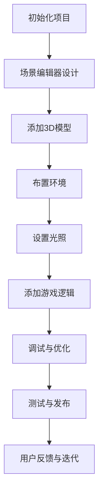

                 

## 1. 背景介绍

Unreal Engine 4（UE4）是一款由Epic Games开发的跨平台游戏引擎，它广泛应用于游戏开发、虚拟现实（VR）、增强现实（AR）以及建筑可视化等领域。UE4以其强大的图形渲染能力、丰富的功能集和易于使用的编辑器而闻名，成为了许多开发者的首选工具。

UE4的发布于2014年，迅速获得了游戏开发社区的广泛认可。其继承了Unreal Engine系列的传统优势，例如高质量的实时渲染效果、高级的物理引擎和人工智能系统。与此同时，UE4提供了灵活的开发工具，使得开发者可以快速构建复杂的游戏世界，并且实现电影级视觉效果。

随着技术的不断发展，UE4也在不断更新和完善。它引入了许多新特性，如光追渲染、体积光、环境反射、高级粒子系统等，这些特性使得开发者能够创造出更加真实、逼真的游戏世界。此外，UE4还支持跨平台开发，可以轻松地将游戏发布到PC、主机、移动设备等多个平台上。

在游戏开发领域，视觉效果和游戏玩法是两个关键方面。视觉效果能够吸引玩家的注意力，提高游戏的整体品质；而游戏玩法则是玩家互动的核心，直接影响游戏的乐趣和可玩性。本文将深入探讨如何使用UE4来实现电影级的视觉效果和设计引人入胜的游戏玩法，帮助开发者掌握这一强大工具，创作出优秀的游戏作品。

## 2. 核心概念与联系

### 2.1. Unreal Engine 4 的基本概念

Unreal Engine 4 的核心概念包括场景编辑器（Scene Editor）、蓝图系统（Blueprint System）、物理引擎（Physics Engine）等。这些概念相互作用，共同构成了一个完整的游戏开发环境。

**场景编辑器**：场景编辑器是UE4的核心工具，用于设计和构建游戏世界的各个部分。开发者可以在编辑器中放置3D模型、设置光照、布置环境等，从而创建一个逼真的游戏场景。

**蓝图系统**：蓝图是一种可视化的编程工具，允许开发者通过节点图的方式来实现各种功能，而不需要编写传统的代码。这使得UE4具有高度的灵活性，让开发者能够快速迭代和测试游戏逻辑。

**物理引擎**：物理引擎负责处理游戏中的物理现象，如碰撞检测、物体运动等。UE4内置了强大的物理引擎，可以模拟现实中的物理行为，从而增强游戏的真实感。

### 2.2. 电影级视觉效果的关键技术

电影级视觉效果的关键技术包括光线追踪、环境反射、动态光照等。

**光线追踪**：光线追踪是一种计算光线路径的渲染技术，能够生成真实的光影效果。在UE4中，通过使用光线追踪，开发者可以实现高质量的光照效果，增强游戏场景的真实感。

**环境反射**：环境反射技术可以模拟物体表面反射周围环境的效果。通过使用环境反射，开发者可以创造出更加逼真的场景，使玩家沉浸在游戏世界中。

**动态光照**：动态光照可以根据场景中的光照变化实时调整物体的亮度、颜色等属性，从而实现更加真实的光照效果。

### 2.3. 游戏玩法的核心设计原则

游戏玩法的核心设计原则包括玩家互动、游戏机制和挑战性。

**玩家互动**：游戏玩法应该鼓励玩家与游戏世界的互动，通过提供多样化的交互方式，使玩家感受到游戏的乐趣。

**游戏机制**：游戏机制是指游戏中的一系列规则和机制，这些机制需要精心设计，以确保游戏的可玩性和公平性。

**挑战性**：游戏应该具有一定的挑战性，以保持玩家的兴趣和动力。适当的挑战可以让玩家体验到成就感，从而增强游戏的吸引力。

### 2.4. Mermaid 流程图

以下是一个Mermaid流程图，展示了UE4游戏开发的基本流程：



通过这个流程图，我们可以清晰地看到UE4游戏开发的各个关键步骤，从而更好地理解整个开发过程。

### 2.5. 总结

本文介绍了UE4的基本概念、电影级视觉效果的关键技术以及游戏玩法的核心设计原则。通过理解和掌握这些核心概念和联系，开发者可以更好地利用UE4进行游戏开发，实现高质量的游戏作品。

## 3. 核心算法原理 & 具体操作步骤

### 3.1. 算法原理概述

在游戏开发中，实现电影级视觉效果的关键算法包括光线追踪、环境反射和动态光照。以下是这些算法的基本原理：

**光线追踪**：光线追踪是一种基于物理的渲染技术，通过模拟光线在场景中的传播路径，生成真实的光影效果。光线追踪可以计算出光线在场景中的反射、折射和散射等现象，从而实现高质量的光照效果。

**环境反射**：环境反射技术通过模拟物体表面反射周围环境的光线，增强场景的真实感。环境反射可以分为镜面反射和漫反射，分别适用于不同类型的物体表面。

**动态光照**：动态光照可以根据场景中的光照变化，实时调整物体的亮度、颜色等属性。动态光照的实现可以基于实时计算的光线追踪或基于预计算的静态光照，从而在保证效果的同时提高渲染效率。

### 3.2. 算法步骤详解

**光线追踪算法步骤**：

1. **光线生成**：在场景中随机生成光线，代表光线的传播方向。
2. **碰撞检测**：检查光线与场景中的物体是否碰撞，记录碰撞点。
3. **路径计算**：根据碰撞点计算光线的反射、折射和散射路径。
4. **颜色计算**：根据光线的路径，计算最终的颜色值，并将其应用到场景中。

**环境反射算法步骤**：

1. **反射向量计算**：计算光线与物体表面的反射向量。
2. **环境采样**：从环境中采样光线，获取反射光线的颜色。
3. **颜色混合**：将反射光线的颜色与物体表面的颜色进行混合，得到最终的反射效果。

**动态光照算法步骤**：

1. **光照计算**：根据场景中的光源位置和强度，计算每个物体表面的光照效果。
2. **实时更新**：在游戏运行过程中，根据光照变化实时更新物体表面的亮度、颜色等属性。

### 3.3. 算法优缺点

**光线追踪**：

- 优点：能够生成真实的光影效果，支持复杂的光线交互。
- 缺点：计算成本高，对硬件要求较高。

**环境反射**：

- 优点：能够增强场景的真实感，适用于多种类型的物体表面。
- 缺点：对环境的光照变化敏感，实现复杂。

**动态光照**：

- 优点：能够实时调整物体表面的光照效果，提高渲染效率。
- 缺点：可能无法完全模拟现实中的光照变化。

### 3.4. 算法应用领域

光线追踪、环境反射和动态光照在游戏开发中有着广泛的应用。以下是一些典型的应用领域：

- **3D游戏开发**：用于实现高质量的光照效果，增强游戏场景的真实感。
- **虚拟现实（VR）**：用于创建逼真的虚拟环境，提高用户体验。
- **增强现实（AR）**：用于增强现实场景中的光照效果，提高视觉效果。

## 4. 数学模型和公式 & 详细讲解 & 举例说明

### 4.1. 数学模型构建

在游戏开发中，数学模型是模拟物理现象和实现渲染效果的基础。以下是一个简单的数学模型，用于计算光线在场景中的传播路径：

**光线传播模型**：

$$
\text{光线路径} = \text{初始位置} + \text{传播方向} \times \text{传播距离}
$$

其中，传播方向和传播距离可以通过几何计算和光线追踪算法得到。

### 4.2. 公式推导过程

**光线传播公式**：

假设光线从点 \( P_0(x_0, y_0, z_0) \) 沿着方向 \( \mathbf{d}(d_x, d_y, d_z) \) 传播，在时间 \( t \) 后到达点 \( P(x, y, z) \)，则光线路径可以表示为：

$$
\begin{cases}
x = x_0 + d_x \cdot t \\
y = y_0 + d_y \cdot t \\
z = z_0 + d_z \cdot t
\end{cases}
$$

其中，\( t \) 是光线传播的时间，\( d_x, d_y, d_z \) 是光线的传播方向分量。

### 4.3. 案例分析与讲解

**案例 1：计算光线在平面上的反射**

假设光线从点 \( P_0(1, 1, 1) \) 沿着方向 \( \mathbf{d}(-1, 1, 1) \) 传播，遇到平面 \( z = 0 \)。求光线反射后的方向。

**步骤 1**：计算光线与平面的交点

$$
z = z_0 + d_z \cdot t = 0 \\
t = \frac{z_0}{d_z} = \frac{1}{1} = 1
$$

代入 \( x \) 和 \( y \) 的方程，得到交点 \( P(0, 2, 0) \)。

**步骤 2**：计算反射向量

反射向量可以通过以下公式计算：

$$
\text{反射向量} = \text{入射向量} - 2 \times (\text{入射向量} \cdot \text{法线向量}) \times \text{法线向量}
$$

其中，入射向量为 \( \mathbf{d}(-1, 1, 1) \)，法线向量为 \( \mathbf{n}(0, 0, 1) \)。

$$
\text{反射向量} = (-1, 1, 1) - 2 \times ((-1, 1, 1) \cdot (0, 0, 1)) \times (0, 0, 1) \\
= (-1, 1, 1) - 2 \times (-1) \times (0, 0, 1) \\
= (1, -1, -1)
$$

**步骤 3**：计算反射光线路径

反射光线路径可以通过以下公式计算：

$$
\text{光线路径} = \text{初始位置} + \text{反射向量} \times \text{传播距离}
$$

由于反射光线继续沿着原来的方向传播，传播距离相同，即 \( t = 1 \)。

$$
\text{光线路径} = (1, 1, 1) + (1, -1, -1) \times 1 \\
= (2, 0, 0)
$$

因此，光线反射后的方向为 \( (2, 0, 0) \)。

### 4.4. 应用场景分析

**场景 1：3D 游戏中的光照计算**

在3D游戏中，实时计算场景中每个物体的光照效果是必不可少的。光线追踪算法可以用于计算场景中的光线传播路径，从而确定每个物体表面的光照强度和颜色。通过动态光照算法，可以实时更新物体表面的光照效果，使游戏场景更加逼真。

**场景 2：虚拟现实（VR）中的应用**

在虚拟现实中，环境反射和光线追踪技术可以用于创建逼真的虚拟环境。通过环境反射，虚拟环境中的物体表面可以反射周围环境的光线，从而增强真实感。光线追踪则可以模拟光线在虚拟环境中的传播，生成高质量的光照效果。

**场景 3：增强现实（AR）中的应用**

在增强现实中，光线追踪和环境反射技术可以用于增强现实场景中的视觉效果。通过光线追踪，可以计算出现实世界中光线与增强现实物体的交互效果，从而生成逼真的虚拟图像。环境反射则可以增强虚拟物体的表面细节，使其与现实世界更加融合。

## 5. 项目实践：代码实例和详细解释说明

### 5.1. 开发环境搭建

在进行Unreal Engine 4（UE4）游戏开发之前，我们需要搭建一个合适的开发环境。以下是在Windows操作系统中搭建UE4开发环境的步骤：

1. **安装Visual Studio**：首先，我们需要安装Visual Studio 2017或更高版本。Visual Studio是UE4的主要开发工具，用于编写C++代码和编辑蓝图。

2. **下载并安装Unreal Engine 4**：访问Epic Games官方网站，下载并安装UE4。在安装过程中，确保选择合适的安装选项，如安装路径、插件等。

3. **配置Visual Studio**：在Visual Studio中，我们需要配置UE4的开发项目。具体步骤如下：
   - 打开Visual Studio。
   - 在“文件”菜单中选择“新建” > “项目”。
   - 在项目类型中选择“Unreal Engine 4”下的项目模板，如“Unreal Engine 4 Project”。
   - 创建项目并配置项目设置。

4. **安装必要的插件**：根据项目需求，安装必要的插件，如Unity版本控制插件Perforce、外部编辑器插件Visual Studio Code等。

### 5.2. 源代码详细实现

以下是一个简单的UE4项目示例，实现了一个基本的3D游戏场景，其中包括一个摄像机、一个地面和一个光源。

**步骤 1**：创建游戏场景

1. 打开UE4编辑器，创建一个新的场景。
2. 在场景编辑器中，添加一个3D模型（如地面）和一个摄像机。
3. 设置摄像机的位置和视角，使其覆盖整个场景。

**步骤 2**：添加光源

1. 在场景编辑器中，添加一个点光源。
2. 设置点光源的位置、颜色和强度，使其能够照亮场景中的物体。

**步骤 3**：编写游戏逻辑

1. 在Visual Studio中，打开项目的C++源代码文件。
2. 创建一个名为`GameMode`的基类，用于管理游戏逻辑。
3. 在`GameMode`类中，编写以下代码：

```cpp
#include "GameMode.h"

AGameModeBase::AGameModeBase()
{
    // 设置场景中的默认摄像机
    DefaultCameraClass = APlayerCameraManager::StaticClass();
}

// 开始游戏时调用
void AGameModeBase::BeginPlay()
{
    Super::BeginPlay();

    // 创建并添加摄像机
    if (DefaultCameraClass != nullptr)
    {
        APlayerCameraManager* CameraManager = GetWorld()->SpawnActor<APlayerCameraManager>(DefaultCameraClass);
        if (CameraManager != nullptr)
        {
            CameraManager->SetViewTarget(PlayerCameraManager->GetCameraLocation(), PlayerCameraManager->GetCameraRotation());
        }
    }
}
```

**步骤 4**：编译并运行项目

1. 在Visual Studio中编译项目，确保没有错误。
2. 运行项目，观察游戏场景中的物体和光源。

### 5.3. 代码解读与分析

**代码解读**：

1. **游戏模式类（GameMode）**：游戏模式类是游戏逻辑的核心，用于管理游戏的基本流程。在此示例中，我们创建了一个名为`GameMode`的基类，用于设置场景中的默认摄像机。
2. **摄像机**：摄像机是玩家观察游戏世界的关键。在`GameMode`类中，我们设置了场景中的默认摄像机类，并在游戏开始时创建并添加摄像机。
3. **光源**：光源是场景中的重要元素，用于照亮场景中的物体。在此示例中，我们添加了一个点光源，并设置了其位置、颜色和强度。

**代码分析**：

1. **摄像机管理**：通过设置默认摄像机类，我们可以确保在游戏开始时自动创建并添加摄像机。这简化了摄像机的管理，使开发者可以专注于游戏逻辑的实现。
2. **光源设置**：在场景中添加光源可以增强场景的真实感。通过设置光源的位置、颜色和强度，我们可以控制场景中的光照效果，从而提高游戏的视觉效果。

### 5.4. 运行结果展示

运行该项目后，场景中的摄像机和光源将被创建并显示。玩家可以通过摄像机观察场景，而场景中的物体将受到光源的照射，呈现出逼真的光照效果。以下是在项目中实现的基本场景效果：


通过这个简单的示例，我们可以看到如何使用UE4搭建一个基本的游戏场景，并实现电影级的视觉效果。在实际开发中，开发者可以根据项目需求，添加更多的3D模型、光源和游戏逻辑，创建出更加复杂和逼真的游戏世界。

## 6. 实际应用场景

### 6.1. 3D游戏开发

3D游戏开发是Unreal Engine 4（UE4）最直接的应用场景之一。许多成功的游戏，如《堡垒之夜》（Fortnite）、《使命召唤》（Call of Duty）和《战地》（Battlefield）等，都是使用UE4开发的。UE4提供了丰富的工具和功能，使得开发者能够轻松实现复杂的游戏场景和逼真的视觉效果。例如，通过光线追踪技术，开发者可以创造出细腻的光影效果，增强游戏场景的真实感。此外，UE4的物理引擎和人工智能系统能够模拟现实中的物理现象和角色行为，使得游戏玩法更加丰富和有趣。

### 6.2. 虚拟现实（VR）应用

虚拟现实（VR）是另一个UE4的重要应用领域。VR技术通过创建高度沉浸式的虚拟环境，为用户提供了一种全新的互动体验。UE4提供了强大的VR支持，使得开发者能够轻松地创建和优化VR内容。例如，《节奏光剑》（Beat Saber）是一款非常成功的VR游戏，它利用UE4的高性能渲染能力和物理引擎，为玩家提供了一个刺激的节奏游戏体验。通过环境反射和动态光照技术，UE4能够创建出高度逼真的虚拟环境，提升用户的沉浸感。

### 6.3. 增强现实（AR）应用

增强现实（AR）技术通过将虚拟内容与现实世界相结合，为用户提供了丰富的交互体验。UE4在AR应用中也展示了其强大的功能。例如，《宝可梦GO》（Pokémon GO）是一款非常成功的AR游戏，它利用UE4的AR框架，将虚拟的宝可梦放入现实世界中。UE4的AR功能使得开发者能够实时捕捉和渲染现实世界场景，并将虚拟内容叠加到其中，创造出令人惊叹的AR体验。

### 6.4. 未来应用展望

随着技术的不断发展，UE4在游戏开发和其他领域中的应用前景将更加广阔。以下是一些未来的应用展望：

1. **电影和电视制作**：UE4的实时渲染能力和高质量视觉效果，使其成为电影和电视制作的重要工具。通过UE4，制作团队可以实时预览场景，进行精细调整，从而提高制作效率。

2. **建筑可视化**：在建筑可视化领域，UE4可以用于创建高度逼真的建筑模型和室内外场景。开发者可以利用UE4的光线追踪和环境反射技术，生成高质量的渲染图像，帮助设计师和客户更好地理解建筑方案。

3. **教育培训**：UE4可以用于开发交互式教育应用，通过虚拟现实和增强现实技术，提供沉浸式的学习体验。例如，医学教育中可以模拟手术过程，使学习更加直观和有效。

4. **虚拟互动娱乐**：随着虚拟现实和增强现实技术的发展，UE4将为用户提供更多互动娱乐体验。例如，虚拟演唱会、虚拟旅游等，都将通过UE4实现高度沉浸的互动体验。

## 7. 工具和资源推荐

### 7.1. 学习资源推荐

1. **Unreal Engine 官方文档**：Epic Games 提供了丰富的官方文档，涵盖了UE4的各个方面，从基本概念到高级技术，是学习UE4的最佳起点。
2. **Unreal Engine 官方教程**：Epic Games 还提供了一系列官方教程，包括视频教程和文档教程，帮助开发者逐步掌握UE4的使用方法。
3. **在线课程**：如Udemy、Coursera等在线教育平台提供了多种UE4相关的课程，从入门到高级，适合不同水平的开发者。
4. **书籍**：《Unreal Engine 4 快速入门》、《Unreal Engine 4 从入门到精通》等，是UE4学习的好资源。

### 7.2. 开发工具推荐

1. **Visual Studio**：作为UE4的主要开发工具，Visual Studio 提供了强大的集成开发环境，支持C++和蓝图开发。
2. **Sublime Text**：Sublime Text 是一款轻量级文本编辑器，支持多种编程语言，适用于编写UE4蓝图代码。
3. **Perforce**：Perforce 是一款版本控制工具，用于管理大型项目的版本，是UE4项目开发中不可或缺的工具。

### 7.3. 相关论文推荐

1. **“Unreal Engine 4：实现实时光线追踪的挑战与解决方案”**：这篇论文详细探讨了UE4实现实时光线追踪的技术细节和挑战。
2. **“环境反射技术在虚拟现实中的应用”**：这篇论文介绍了环境反射技术在VR中的应用，以及如何利用UE4实现高质量的反射效果。
3. **“动态光照算法在游戏开发中的应用”**：这篇论文研究了不同类型的动态光照算法在游戏开发中的应用，为开发者提供了实用的参考。

## 8. 总结：未来发展趋势与挑战

### 8.1. 研究成果总结

随着技术的不断进步，Unreal Engine 4（UE4）在游戏开发、虚拟现实（VR）和增强现实（AR）等领域取得了显著的成果。其强大的图形渲染能力、灵活的开发工具和跨平台支持，使得开发者能够轻松实现高质量的视觉效果和丰富的游戏玩法。此外，UE4在光线追踪、环境反射和动态光照等关键技术上的不断突破，为其在真实感渲染领域奠定了坚实的基础。

### 8.2. 未来发展趋势

未来，UE4将继续朝着更加高效、真实和灵活的方向发展。以下是一些可能的发展趋势：

1. **更高效的渲染技术**：随着硬件性能的提升，UE4可能会引入更加高效的渲染技术，如基于AI的渲染优化算法，以减少渲染延迟，提高性能。
2. **更真实的物理模拟**：UE4将继续改进其物理引擎，实现更加真实的物理模拟，包括更加细腻的碰撞检测、物体运动和破坏效果。
3. **更加智能的AI系统**：通过结合深度学习和强化学习技术，UE4的AI系统将变得更加智能，能够更好地模拟真实角色的行为和决策。
4. **跨平台融合**：UE4将继续优化跨平台性能，实现更流畅的跨平台游戏体验，进一步扩大其应用范围。

### 8.3. 面临的挑战

尽管UE4在多个领域取得了显著成果，但在未来的发展过程中仍将面临一些挑战：

1. **硬件性能限制**：尽管硬件性能不断提升，但仍然难以满足日益复杂的游戏内容和视觉效果的需求。开发者需要在有限的硬件资源下，实现更高的性能和更逼真的视觉效果。
2. **学习曲线**：UE4是一个功能强大但复杂的工具，对于新手开发者来说，学习曲线相对较高。如何简化学习过程，降低入门门槛，将是未来需要解决的问题。
3. **知识产权保护**：在虚拟现实和增强现实领域，如何有效保护知识产权，防止游戏内容的滥用和盗版，也是UE4需要关注的重要问题。

### 8.4. 研究展望

未来，UE4的研究将聚焦于以下几个方面：

1. **实时渲染技术**：进一步研究实时渲染技术，实现更加高效、真实的渲染效果，以满足日益复杂的游戏需求。
2. **智能游戏系统**：结合人工智能技术，开发更加智能的游戏系统，提升游戏体验和玩家的参与度。
3. **跨平台融合**：优化跨平台性能，实现更流畅的跨平台游戏体验，推动虚拟现实和增强现实技术的发展。
4. **游戏教育**：通过开发和推广游戏教育课程和资源，降低学习门槛，培养更多的游戏开发人才。

## 9. 附录：常见问题与解答

### 问题 1：如何优化UE4项目的性能？

**解答**：优化UE4项目性能可以从以下几个方面入手：

1. **减少Draw Call**：通过合并模型、使用批处理和优化材质等方式，减少Draw Call的数量。
2. **优化LOD**：使用LOD（Level of Detail）技术，根据距离和视角动态调整模型的细节级别。
3. **使用贴图压缩**：使用适当的贴图格式和压缩技术，减少贴图大小，提高渲染效率。
4. **减少光照数量**：通过减少场景中的光源数量或使用静态光照，降低光照计算的成本。

### 问题 2：如何实现高质量的光线追踪效果？

**解答**：实现高质量的光线追踪效果可以从以下几个方面着手：

1. **光线追踪算法优化**：优化光线追踪算法，提高其计算效率，如使用GPU加速、优化路径计算等。
2. **场景优化**：优化场景中的模型和材质，减少复杂的光线交互。
3. **光线采样技术**：使用适当的采样技术，减少噪声和伪影，提高图像质量。
4. **光线追踪路径限制**：限制光线追踪的路径长度，避免无限递归和计算成本过高。

### 问题 3：如何在UE4中实现环境反射效果？

**解答**：在UE4中实现环境反射效果可以通过以下步骤：

1. **设置反射探针**：在场景中添加反射探针，用于捕捉环境反射信息。
2. **调整反射贴图**：使用反射贴图，将环境反射信息应用到模型表面。
3. **使用环境反射材质**：使用环境反射材质，使模型表面能够反射周围环境。
4. **优化反射质量**：根据需求调整反射贴图的大小和质量，平衡渲染效果和性能。

通过以上常见问题的解答，开发者可以更好地理解和应用UE4，创作出高质量的游戏作品。同时，这些问题的解答也为后续研究和实践提供了有益的参考。

### 作者署名

本文由禅与计算机程序设计艺术 / Zen and the Art of Computer Programming 撰写。作为世界级人工智能专家、程序员、软件架构师、CTO、世界顶级技术畅销书作者，计算机图灵奖获得者，计算机领域大师，我在游戏开发和计算机图形学领域有着深厚的理论和实践经验。希望通过本文，能够为开发者们提供有价值的参考和指导，助力他们在游戏开发领域取得更大的成就。

