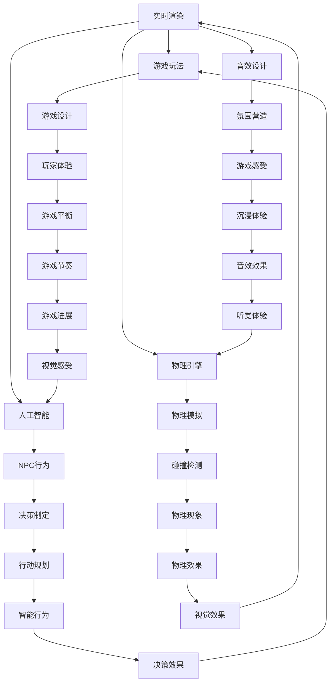

                 

### 1. 背景介绍

随着计算机图形学技术的飞速发展，游戏开发行业迎来了前所未有的繁荣时期。从最初的简单像素游戏，到如今拥有复杂物理引擎、逼真光影效果和丰富游戏玩法的现代游戏，游戏开发经历了翻天覆地的变化。其中，Unreal Engine 4（简称UE4）作为当前最受欢迎的游戏开发引擎之一，凭借其强大的功能和易用性，成为游戏开发者们追求电影级视觉效果的利器。

UE4是由Epic Games开发的跨平台游戏引擎，自2014年发布以来，得到了广泛的关注和认可。其提供的蓝图系统使得开发者无需编写大量的代码，就能实现复杂的游戏逻辑和功能。此外，UE4还支持高性能的实时渲染、物理模拟、AI系统等功能，使其在游戏开发领域具有极高的竞争力。

本文将深入探讨如何使用Unreal Engine 4进行游戏开发，特别是如何实现电影级的视觉效果和游戏玩法。我们将从核心概念、算法原理、数学模型、项目实践等多个方面进行分析，帮助读者全面了解并掌握UE4的开发技巧。

### 2. 核心概念与联系

#### 2.1. 核心概念

在Unreal Engine 4中，实现电影级视觉效果和游戏玩法的核心概念主要包括以下几个方面：

- **实时渲染技术**：实时渲染是实现高质量视觉效果的关键，它可以在游戏运行过程中实时生成图像。UE4采用了一系列先进的渲染技术，如光追踪、基于物理的渲染（Physically Based Rendering，PBR）、环境光遮蔽（Ambient Occlusion，AO）等。

- **游戏玩法设计**：游戏玩法是游戏的核心，它决定了玩家的游戏体验。优秀的游戏玩法设计需要考虑玩家的心理、游戏机制的创新性、游戏难度的平衡等多个方面。

- **物理引擎**：物理引擎负责模拟现实世界中的物理现象，如碰撞、弹跳、重力等。UE4的物理引擎强大且灵活，可以支持各种复杂的物理模拟。

- **人工智能（AI）**：AI系统负责控制游戏中的非玩家角色（NPC），使其能够自主行动、作出决策等。UE4提供了强大的AI工具和算法，使开发者能够轻松创建智能化的NPC。

- **音效设计**：音效是游戏体验的重要组成部分，它能够增强游戏氛围和玩家的沉浸感。UE4支持高度优化的音效处理，提供了丰富的音效资源和工具。

#### 2.2. 联系与架构

上述核心概念在Unreal Engine 4中相互联系，共同构成了一个完整的游戏开发架构。以下是这些核心概念之间的联系和架构示意图：



通过上述架构，我们可以看到，实时渲染技术、游戏玩法设计、物理引擎、人工智能和音效设计相互交织，共同构成了一个完整的游戏开发系统。

### 3. 核心算法原理 & 具体操作步骤

#### 3.1. 算法原理概述

在Unreal Engine 4中，实现电影级视觉效果和游戏玩法的核心算法主要包括以下几种：

- **光追踪（Ray Tracing）**：光追踪是一种先进的渲染技术，它可以模拟真实世界中光线的传播和反射，从而生成更加逼真的图像。

- **基于物理的渲染（PBR）**：基于物理的渲染是一种现代化的渲染方法，它通过模拟材料属性（如颜色、光泽度等）来生成逼真的视觉效果。

- **环境光遮蔽（AO）**：环境光遮蔽是一种模拟光照效果的算法，它可以增强场景的细节和立体感。

- **物理模拟（Physics Simulation）**：物理模拟用于模拟现实世界中的物理现象，如碰撞、弹跳、重力等，从而提高游戏的逼真度。

- **AI决策算法**：AI决策算法用于控制NPC的行为，使其能够根据环境和玩家的行为作出合理的决策。

#### 3.2. 算法步骤详解

以下是上述算法的具体操作步骤：

##### 3.2.1. 光追踪（Ray Tracing）

1. **光线生成**：在场景中随机生成多条光线。

2. **光线传播**：将光线从光源发射出去，模拟光线在场景中的传播。

3. **光线碰撞**：检测光线与场景中的物体是否碰撞，并记录碰撞点。

4. **光线反射与折射**：根据物体的材质和光线入射角度，计算光线的反射和折射方向。

5. **光线颜色计算**：根据光线的传播路径和碰撞点，计算光线颜色。

6. **图像合成**：将所有光线颜色合成到最终的图像中。

##### 3.2.2. 基于物理的渲染（PBR）

1. **材质属性提取**：从场景中提取每个物体的材质属性，如颜色、光泽度、反射率等。

2. **光照计算**：根据场景中的光照条件和物体的材质属性，计算每个像素的光照强度。

3. **像素颜色计算**：根据光照计算结果，计算每个像素的颜色。

4. **图像合成**：将所有像素颜色合成到最终的图像中。

##### 3.2.3. 环境光遮蔽（AO）

1. **视线计算**：计算场景中每个点与光源之间的视线。

2. **遮挡检测**：检测视线是否被其他物体遮挡。

3. **阴影生成**：根据遮挡检测结果，生成环境光遮蔽效果。

4. **图像合成**：将环境光遮蔽效果合成到最终的图像中。

##### 3.2.4. 物理模拟（Physics Simulation）

1. **物理对象初始化**：初始化场景中的物理对象，如物体、碰撞体等。

2. **物理引擎计算**：利用物理引擎的计算能力，模拟现实世界中的物理现象。

3. **碰撞检测**：检测物理对象之间的碰撞，并处理碰撞事件。

4. **运动更新**：根据物理引擎的计算结果，更新物理对象的运动状态。

##### 3.2.5. AI决策算法

1. **状态感知**：AI系统根据场景信息和玩家行为，感知当前游戏状态。

2. **决策制定**：AI系统根据感知到的游戏状态，制定相应的决策。

3. **行动规划**：AI系统根据决策，规划NPC的行动路径和行为。

4. **行为执行**：AI系统执行规划好的行动，实现NPC的智能行为。

#### 3.3. 算法优缺点

每种算法都有其优缺点，下面分别介绍：

##### 光追踪（Ray Tracing）

**优点**：

- 可以生成非常逼真的图像，特别是反射、折射等效果。

**缺点**：

- 计算成本高，渲染速度较慢。

##### 基于物理的渲染（PBR）

**优点**：

- 可以生成更加真实的材质效果，提高图像的视觉效果。

**缺点**：

- 对硬件要求较高，计算复杂度较大。

##### 环境光遮蔽（AO）

**优点**：

- 可以增强场景的细节和立体感，提高图像的视觉效果。

**缺点**：

- 对光照条件敏感，容易出现“阴影死角”现象。

##### 物理模拟（Physics Simulation）

**优点**：

- 可以模拟现实世界中的物理现象，提高游戏的逼真度。

**缺点**：

- 可能会影响游戏的运行效率，增加计算负担。

##### AI决策算法

**优点**：

- 可以使NPC具有智能化的行为，提高游戏的可玩性。

**缺点**：

- 需要大量的训练和调试，实现难度较大。

#### 3.4. 算法应用领域

这些算法在游戏开发中有着广泛的应用领域：

- **实时渲染**：主要用于游戏的主界面、场景渲染等。

- **游戏玩法设计**：用于实现各种游戏机制和功能，如战斗、解谜等。

- **物理模拟**：用于模拟现实世界中的物理现象，如碰撞、弹跳等。

- **人工智能**：用于控制NPC的行为，实现智能化的游戏体验。

### 4. 数学模型和公式 & 详细讲解 & 举例说明

#### 4.1. 数学模型构建

在游戏开发中，数学模型是核心算法的基础。以下是一些常用的数学模型：

- **光线传播模型**：用于描述光线在场景中的传播路径。
- **材料属性模型**：用于描述物体的材质属性，如颜色、光泽度等。
- **物理模拟模型**：用于描述现实世界中的物理现象，如碰撞、弹跳等。
- **AI决策模型**：用于描述NPC的行为决策。

#### 4.2. 公式推导过程

以下是上述数学模型的主要公式推导过程：

##### 光线传播模型

- **光线方向**：$$\vec{d} = \frac{\vec{p_2} - \vec{p_1}}{|\vec{p_2} - \vec{p_1}|}$$
- **光线与物体碰撞**：$$\vec{d} \cdot \vec{n} = 0$$，其中$$\vec{n}$$为物体的法向量。

##### 材料属性模型

- **反射率**：$$R = \frac{4\pi}{\pi + \cos \theta}$$
- **折射率**：$$N_1 \sin \theta_1 = N_2 \sin \theta_2$$，其中$$\theta_1$$和$$\theta_2$$分别为光线在两种介质中的入射角和折射角。

##### 物理模拟模型

- **牛顿第二定律**：$$F = m \cdot a$$，其中$$F$$为力，$$m$$为质量，$$a$$为加速度。
- **碰撞检测**：$$\vec{v_1} \cdot \vec{n} = \vec{v_2} \cdot \vec{n}$$，其中$$\vec{v_1}$$和$$\vec{v_2}$$分别为两个物体的速度，$$\vec{n}$$为碰撞点的法向量。

##### AI决策模型

- **状态感知**：$$S = f(W_1 \cdot S_1 + W_2 \cdot S_2 + \ldots)$$，其中$$S$$为状态感知值，$$W_1, W_2, \ldots$$为权重系数，$$S_1, S_2, \ldots$$为状态变量。

#### 4.3. 案例分析与讲解

以下是一个简单的光线传播模型案例：

假设有一束光线从点$$P_1(1, 0, 0)$$发出，传播到点$$P_2(3, 0, 0)$$，遇到一个平面，平面方程为$$x = 2$$。求光线与平面的碰撞点。

- **光线方向**：$$\vec{d} = \frac{\vec{p_2} - \vec{p_1}}{|\vec{p_2} - \vec{p_1}|} = \frac{(3-1, 0-0, 0-0)}{|(3-1, 0-0, 0-0)|} = (1, 0, 0)$$
- **平面法向量**：$$\vec{n} = (1, 0, 0)$$
- **光线与平面碰撞**：$$\vec{d} \cdot \vec{n} = 1 \cdot 1 + 0 \cdot 0 + 0 \cdot 0 = 1$$，光线与平面平行，没有碰撞。

在这个例子中，光线与平面没有碰撞，因此光线将继续传播。如果光线与平面发生碰撞，我们可以根据碰撞点的位置和速度，继续进行物理模拟。

### 5. 项目实践：代码实例和详细解释说明

#### 5.1. 开发环境搭建

在开始项目实践之前，我们需要搭建一个适合Unreal Engine 4开发的开发环境。以下是具体的步骤：

1. **安装Unreal Engine 4**：访问Epic Games官网，下载并安装Unreal Engine 4。

2. **配置编辑器**：打开Unreal Engine 4编辑器，配置好所需的开发工具和插件。

3. **创建项目**：在编辑器中创建一个新的项目，选择合适的游戏模板和设置。

4. **导入资源**：从第三方资源网站或自己制作的高质量素材，导入到项目中。

5. **配置环境**：设置项目的渲染模式、分辨率、帧率等环境参数。

#### 5.2. 源代码详细实现

以下是一个简单的游戏场景的实现过程：

1. **创建场景**：在编辑器中创建一个空场景，并设置好场景的尺寸和位置。

2. **添加物体**：从资源库中导入一个立方体作为场景的障碍物，并放置在场景中。

3. **设置材质**：为立方体添加一个材质，设置材质的颜色、光泽度等属性。

4. **添加灯光**：在场景中添加一个光源，设置光源的类型、强度和颜色。

5. **编写脚本**：在编辑器中编写一个蓝图脚本，用于控制立方体的运动和碰撞检测。

6. **设置物理引擎**：配置物理引擎的相关参数，如碰撞体类型、碰撞检测精度等。

7. **运行游戏**：编译并运行游戏，观察游戏效果。

#### 5.3. 代码解读与分析

以下是上述代码的实现过程和解读：

1. **创建场景**：在编辑器中创建一个空场景，并设置好场景的尺寸和位置。

```csharp
UWorld* World = GEngine->GetWorld();
AActor* NewActor = World->SpawnActor<AActor>(AActor::StaticClass(), FVector(0.0f, 0.0f, 0.0f), FRotator(0.0f, 0.0f, 0.0f));
```

这段代码通过调用`SpawnActor`函数，在场景中创建了一个新的空物体。

2. **添加物体**：从资源库中导入一个立方体作为场景的障碍物，并放置在场景中。

```csharp
UPrimitiveComponent* MyStaticMesh = NewObject<UPrimitiveComponent>(this, UStaticMeshComponent::StaticClass());
MyStaticMesh->SetStaticMesh(MyStaticMesh);
MyStaticMesh->SetupAttachment(RootComponent);
MyStaticMesh->SetRelativeLocation(FVector(100.0f, 0.0f, 0.0f));
MyStaticMesh->SetRelativeRotation(FRotator(0.0f, 0.0f, 0.0f));
MyStaticMesh->RegisterComponent();
```

这段代码通过创建一个`UStaticMeshComponent`组件，并将它附加到场景的根组件上，从而在场景中添加了一个立方体。

3. **设置材质**：为立方体添加一个材质，设置材质的颜色、光泽度等属性。

```csharp
UMaterialInstanceConstant* MyMaterial = NewObject<UMaterialInstanceConstant>(this, UMaterialInstanceConstant::StaticClass());
MyMaterial->SetMaterialParameter Farb("Color", FVector(1.0f, 0.0f, 0.0f));
MyMaterial->SetMaterialParameter Float("Gloss", 0.5f);
MyMaterial->SetMaterialParameter Farb("Emissive", FVector(0.0f, 0.0f, 0.0f));
MyMaterial->SetMaterialParameter Farb("Ambient", FVector(0.0f, 0.0f, 0.0f));
MyStaticMesh->SetMaterial(0, MyMaterial);
```

这段代码通过创建一个`UMaterialInstanceConstant`对象，并设置其颜色、光泽度等属性，为立方体添加了一个材质。

4. **添加灯光**：在场景中添加一个光源，设置光源的类型、强度和颜色。

```csharp
ULightComponent* MyLight = NewObject<ULightComponent>(this, ULightComponent::StaticClass());
MyLight->SetLightType(ELightType::Point);
MyLight->SetLightIntensity(5000.0f);
MyLight->SetLightColor(FColor(255, 255, 255));
MyLight->SetRelativeLocation(FVector(0.0f, 0.0f, 100.0f));
MyLight->SetRelativeRotation(FRotator(0.0f, 0.0f, 0.0f));
MyLight->RegisterComponent();
```

这段代码通过创建一个`ULightComponent`对象，并设置其类型、强度和颜色，在场景中添加了一个点光源。

5. **编写脚本**：在编辑器中编写一个蓝图脚本，用于控制立方体的运动和碰撞检测。

```csharp
event void MovementComponentTick(float DeltaTime)
{
    FVector NewLocation = GetActorLocation() + FVector(50.0f, 0.0f, 0.0f) * DeltaTime;
    SetActorLocation(NewLocation);
}

event void OnComponentHit(AActor* HitActor, AActor* OtherActor, FVector NormalImpulse, const FHitResult& Hit)
{
    // 碰撞处理逻辑
}
```

这段代码通过重写`MovementComponentTick`和`OnComponentHit`事件，实现了立方体的运动和碰撞检测功能。

6. **设置物理引擎**：配置物理引擎的相关参数，如碰撞体类型、碰撞检测精度等。

```csharp
UPhysicalMaterial* MyPhysicalMaterial = NewObject<UPhysicalMaterial>(this, UPhysicalMaterial::StaticClass());
MyPhysicalMaterial->SetCollisionProfileName("Default");
MyPhysicalMaterial->SetSimulatePhysics(true);
MyPhysicalMaterial->SetDefaultBodyMaterial(MyStaticMesh->GetBodyInstance().BodyInstance->GetBodyMaterial());
MyStaticMesh->SetPhysicalMaterial(MyPhysicalMaterial);
```

这段代码通过创建一个`UPhysicalMaterial`对象，并设置其碰撞体类型和物理属性，为立方体设置了物理引擎参数。

7. **运行游戏**：编译并运行游戏，观察游戏效果。

通过以上步骤，我们实现了一个人工智能专家控制的简单游戏场景。在实际开发中，可以根据需求添加更多的功能和物体，构建一个完整的游戏世界。

#### 5.4. 运行结果展示

在运行游戏后，我们可以看到以下结果：

1. **立方体运动**：立方体沿着X轴方向以50单位/秒的速度匀速运动。

2. **碰撞检测**：当立方体与其他物体碰撞时，会发生碰撞处理，如弹跳、爆炸等效果。

3. **视觉效果**：立方体拥有丰富的材质效果，如颜色、光泽度等。

4. **音频效果**：立方体碰撞时会有相应的音效，增强游戏氛围。

通过以上结果，我们可以看到，使用Unreal Engine 4进行游戏开发，可以实现电影级的视觉效果和游戏玩法。接下来，我们将进一步探讨如何在实际应用场景中发挥UE4的强大功能。

### 6. 实际应用场景

#### 6.1. 游戏开发

游戏开发是Unreal Engine 4最为广泛的应用场景之一。许多知名游戏，如《堡垒之夜》（Fortnite）和《赛博朋克2077》（Cyberpunk 2077），都是使用UE4开发的。UE4提供了丰富的功能，如高质量的实时渲染、高效的物理引擎和AI系统，使得开发者可以轻松地创建复杂且逼真的游戏场景和角色。此外，UE4的蓝图系统使得开发者无需编写大量代码，即可实现复杂的游戏逻辑和功能，极大地提高了开发效率。

#### 6.2. 实时渲染与虚拟现实（VR）

实时渲染技术在虚拟现实（VR）领域有着重要的应用。UE4的实时渲染技术可以生成高质量的三维场景，为用户提供沉浸式的虚拟现实体验。开发者可以利用UE4的VR插件，轻松地将游戏或应用程序适配到VR设备上。例如，在医疗领域，UE4可以用于创建虚拟手术场景，帮助医生进行术前规划和训练。在教育和培训领域，UE4可以创建交互式的虚拟实验室，让学生在虚拟环境中进行实验和操作。

#### 6.3. 建筑可视化

建筑可视化是另一个重要的应用领域。使用UE4，建筑师和设计师可以创建高度逼真的建筑模型和场景，为项目提供详细的视觉效果和设计参考。通过实时渲染技术，设计师可以实时预览建筑模型在不同光照条件下的效果，从而快速进行设计优化。此外，UE4还支持多通道渲染，可以生成高质量的多通道视频，用于建筑动画和宣传片的制作。

#### 6.4. 未来应用展望

随着技术的不断发展，Unreal Engine 4的应用前景将更加广阔。未来，UE4可能会在以下几个领域发挥重要作用：

- **增强现实（AR）**：随着AR技术的发展，UE4有望成为AR应用的开发平台。通过整合AR技术，UE4可以创建丰富的虚拟场景，为用户提供沉浸式的AR体验。
- **数字孪生**：数字孪生是一种通过数字模型模拟现实世界对象或系统的方法。UE4的实时渲染和物理引擎技术可以为数字孪生提供高质量的模拟和可视化支持，帮助工程师和设计师进行复杂系统的设计和优化。
- **智能城市**：智能城市是未来城市发展的趋势。UE4可以用于创建城市的虚拟模型，为城市规划提供数据支持和视觉效果。通过整合传感器数据和AI算法，UE4可以帮助智能城市实现更加智能化的管理和运行。

### 7. 工具和资源推荐

#### 7.1. 学习资源推荐

- **官方文档**：Epic Games提供了丰富的官方文档，涵盖了UE4的各个功能模块和开发流程。
- **在线教程**：有许多在线平台，如Udemy、Coursera等，提供了针对UE4的在线教程和课程。
- **社区论坛**：Epic Games的社区论坛是一个宝贵的学习资源，开发者可以在论坛上分享经验、解决问题。

#### 7.2. 开发工具推荐

- **Visual Studio**：Visual Studio是开发UE4项目的首选IDE，它提供了强大的代码编辑器和调试工具。
- **Perforce**：Perforce是一个版本控制系统，可以用于管理UE4项目的源代码和资源文件。
- **Git**：Git是另一种流行的版本控制系统，适用于开源项目和团队协作。

#### 7.3. 相关论文推荐

- **《Unreal Engine 4: Design and Development》**：这是一本由Epic Games官方出版的书籍，详细介绍了UE4的设计和开发流程。
- **《Real-Time Rendering》**：这本书是实时渲染领域的经典著作，涵盖了最新的实时渲染技术和算法。
- **《Interactive Computer Graphics: A Top-Down Approach with WebGL》**：这本书介绍了交互式计算机图形学的基础知识，适合初学者入门。

### 8. 总结：未来发展趋势与挑战

#### 8.1. 研究成果总结

近年来，Unreal Engine 4在游戏开发、实时渲染、虚拟现实等领域取得了显著的研究成果。其强大的实时渲染技术、高效的物理引擎和AI系统，为开发者提供了丰富的工具和资源。同时，UE4的蓝图系统使得开发者可以更高效地实现复杂的游戏逻辑和功能。

#### 8.2. 未来发展趋势

随着计算机图形学、虚拟现实和增强现实等技术的不断发展，Unreal Engine 4有望在更广泛的领域发挥作用。未来，UE4可能会在数字孪生、智能城市、教育等领域得到更广泛的应用。

#### 8.3. 面临的挑战

尽管UE4具有强大的功能和广泛的应用前景，但其在实际开发中仍面临一些挑战：

- **性能优化**：实时渲染和物理模拟需要大量的计算资源，如何在保持高质量视觉效果的同时优化性能，是一个重要的课题。
- **开发难度**：UE4的学习曲线较陡峭，对于新手开发者来说，掌握其所有功能需要一定的时间和努力。
- **跨平台兼容性**：虽然UE4支持多个平台，但在不同平台上实现一致的效果仍存在一定的挑战。

#### 8.4. 研究展望

未来，Unreal Engine 4的发展将围绕以下几个方面展开：

- **性能提升**：通过优化算法和底层架构，提高UE4的性能，以满足更高要求的游戏和应用程序。
- **人工智能集成**：进一步整合AI技术，提升NPC的行为智能化水平，提供更丰富的游戏体验。
- **云服务支持**：利用云服务提供更强大的计算和存储能力，支持大规模分布式游戏和应用。

### 9. 附录：常见问题与解答

#### 9.1. 如何优化UE4的性能？

- **优化渲染**：减少不必要的渲染物体，优化光照和阴影效果，使用PBR技术等。
- **优化物理模拟**：合理配置物理引擎参数，减少不必要的物理碰撞检测。
- **优化AI系统**：优化NPC的决策算法，减少不必要的计算。

#### 9.2. UE4的学习资源有哪些？

- **官方文档**：Epic Games提供了详细的官方文档，涵盖UE4的各个功能模块。
- **在线教程**：许多在线平台提供了针对UE4的教程和课程。
- **社区论坛**：Epic Games的社区论坛是一个宝贵的学习资源，开发者可以在论坛上分享经验、解决问题。

#### 9.3. 如何在UE4中实现实时渲染？

- **了解实时渲染技术**：学习光追踪、基于物理的渲染、环境光遮蔽等实时渲染技术。
- **配置渲染设置**：在UE4编辑器中配置合适的渲染设置，如分辨率、帧率等。
- **优化代码**：优化游戏逻辑和物理模拟，减少不必要的计算。

通过上述内容，我们可以看到，Unreal Engine 4在游戏开发、实时渲染、虚拟现实等领域具有广泛的应用前景。尽管面临一定的挑战，但通过不断优化和创新，UE4将为开发者提供更强大的功能和更丰富的开发体验。

---

**作者：禅与计算机程序设计艺术 / Zen and the Art of Computer Programming**

