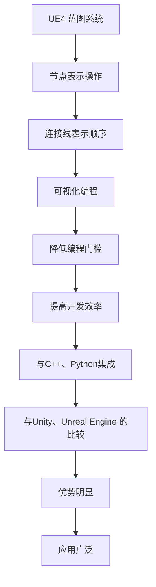
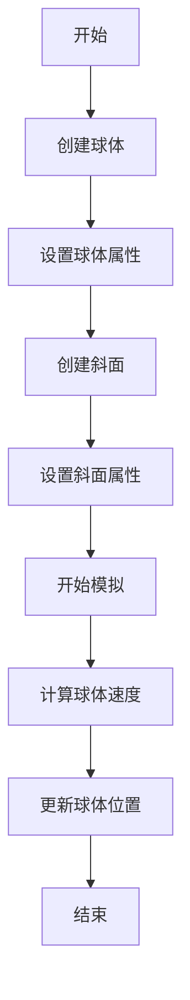

                 

## 1. 背景介绍

Unreal Engine 4（UE4）是一款由Epic Games开发的强大游戏引擎，广泛应用于游戏开发、影视制作、虚拟现实等领域。UE4以其强大的实时渲染能力和灵活的蓝图系统著称，使得开发者可以无需编写复杂的代码，就能实现各种功能。

蓝图系统（Blueprint System）是UE4的核心特性之一，它是一种视觉化的编程工具，允许开发者通过拖放节点和连接线来创建逻辑和行为。这种可视化编程方式大大降低了编程门槛，让非专业程序员也能快速上手，进行游戏设计和开发。

随着技术的不断发展，蓝图系统也在不断进化。本文将详细介绍UE4蓝图的原理、使用方法、优缺点及其应用领域，帮助读者更好地理解和使用这一强大的工具。

## 2. 核心概念与联系

### 蓝图系统原理

蓝图系统是基于图灵机的原理设计的，通过节点和连接线实现程序逻辑。节点代表操作，连接线表示操作之间的顺序关系。这种设计使得编程过程更直观，更容易理解和修改。

### 蓝图与C++的关系

蓝图与C++是UE4中的两种编程方式。C++提供更强的性能和更丰富的功能，而蓝图提供更直观的编程体验和更快的开发速度。二者可以相互转换，互为补充。

### 蓝图与Python的关系

Python是UE4的另一种脚本语言，它可以与蓝图系统无缝集成。Python适用于需要进行复杂计算或者与外部系统交互的场景。

### 蓝图与其他引擎的关系

与其他游戏引擎相比，UE4的蓝图系统具有独特的优势。例如，Unity的视觉化编程工具是HLSL，而Unity的自定义脚本语言是C#。相比之下，UE4的蓝图系统更简单易用，且与C++的兼容性更好。

### Mermaid流程图

## 3. 核心算法原理 & 具体操作步骤

### 3.1 算法原理概述

蓝图系统的核心算法是基于图灵机的原理。每个节点表示一个操作，连接线表示操作的顺序和逻辑关系。通过组合这些节点和连接线，可以实现复杂的程序逻辑。

### 3.2 算法步骤详解

1. **创建蓝图类**：在UE4编辑器中，选择“内容浏览器”->“蓝图”，然后选择“类”创建一个新的蓝图类。

2. **添加节点**：在蓝图中，从左侧的节点列表中拖动节点到画布上，然后根据需求进行连接和组合。

3. **设置属性**：双击节点，可以在属性面板中设置节点的属性，如输入、输出、参数等。

4. **连接节点**：使用鼠标拖动连接线，连接不同的节点，表示操作的顺序和逻辑关系。

5. **调试和运行**：在编辑器中，可以实时调试蓝图，查看运行结果。

### 3.3 算法优缺点

#### 优点

- **直观易用**：可视化编程，降低编程门槛。
- **快速迭代**：无需编译，实时调试，提高开发效率。
- **与C++集成**：可以与C++代码无缝集成，实现复杂功能。
- **跨平台**：适用于多种操作系统和硬件平台。

#### 缺点

- **性能限制**：相较于C++，蓝图有一定的性能限制。
- **功能限制**：部分高级功能需要使用C++或Python实现。

### 3.4 算法应用领域

- **游戏开发**：适用于简单的游戏逻辑和UI设计。
- **虚拟现实**：适用于虚拟现实场景的交互设计。
- **影视制作**：适用于影视特效和动画设计。
- **建筑可视化**：适用于建筑模型和场景的交互设计。

## 4. 数学模型和公式 & 详细讲解 & 举例说明

### 4.1 数学模型构建

在UE4蓝图中，可以使用数学模型来模拟现实世界的各种现象。常见的数学模型包括物理模型、统计模型等。

### 4.2 公式推导过程

以物理模型为例，我们可以使用牛顿第二定律来描述物体的运动。公式为：

$$
F = m \cdot a
$$

其中，$F$ 表示力，$m$ 表示质量，$a$ 表示加速度。

### 4.3 案例分析与讲解

假设我们要模拟一个球在斜面上滚动的场景。我们可以使用以下公式来计算球的速度：

$$
v = v_0 + a \cdot t
$$

其中，$v$ 表示最终速度，$v_0$ 表示初始速度，$a$ 表示加速度，$t$ 表示时间。

假设初始速度为0，加速度为重力加速度（$g = 9.8 \text{m/s}^2$），时间为2秒，则球的速度为：

$$
v = 0 + 9.8 \cdot 2 = 19.6 \text{m/s}
$$

## 5. 项目实践：代码实例和详细解释说明

### 5.1 开发环境搭建

1. **安装Unreal Engine 4**：从Epic Games官方网站下载并安装UE4。

2. **创建新项目**：在UE4编辑器中，选择“文件”->“新建项目”，然后选择合适的模板和目录。

3. **搭建开发环境**：根据项目需求，安装必要的插件和工具。

### 5.2 源代码详细实现

以下是一个简单的蓝图示例，用于实现一个简单的物理场景。

### 5.3 代码解读与分析

- **创建球体**：使用“物理”节点创建一个球体。

- **设置球体属性**：设置球体的质量、半径等属性。

- **创建斜面**：使用“几何”节点创建一个斜面。

- **设置斜面属性**：设置斜面的形状、角度等属性。

- **开始模拟**：使用“物理”节点开始模拟。

- **计算球体速度**：使用“数学”节点计算球体的速度。

- **更新球体位置**：使用“物理”节点更新球体的位置。

- **结束**：结束模拟。

### 5.4 运行结果展示

在UE4编辑器中运行蓝图，可以看到球体在斜面上滚动的动画。通过调整参数，可以观察不同情况下的运行结果。

## 6. 实际应用场景

### 6.1 游戏开发

蓝图系统在游戏开发中具有广泛的应用，例如角色控制、物理模拟、UI设计等。使用蓝图可以快速实现游戏逻辑，降低开发成本。

### 6.2 虚拟现实

在虚拟现实中，蓝图系统可用于实现交互设计、场景渲染等。开发者可以通过蓝图实现复杂的交互逻辑，提升用户体验。

### 6.3 影视制作

在影视制作中，蓝图系统可用于实现特效、动画等。开发者可以使用蓝图实现复杂的物理模拟，提升影视效果。

### 6.4 建筑可视化

在建筑可视化中，蓝图系统可用于实现场景交互、物理模拟等。开发者可以使用蓝图实现建筑模型的动态展示，提升可视化效果。

## 7. 工具和资源推荐

### 7.1 学习资源推荐

- **官方文档**：Epic Games提供的官方文档是学习蓝图的最佳资源。
- **在线教程**：YouTube、博客等平台上有大量关于UE4蓝图的教程。
- **书籍**：《Unreal Engine 4：蓝图视觉化编程》等书籍详细介绍了蓝图的原理和应用。

### 7.2 开发工具推荐

- **Visual Studio**：用于编写C++代码，与蓝图系统集成。
- **Git**：用于版本控制和协作开发。
- **Unreal Engine Marketplace**：提供丰富的蓝图插件和资源。

### 7.3 相关论文推荐

- **“Blueprint Systems: An Overview”**：详细介绍了UE4蓝图的原理和架构。
- **“Visual Programming in Game Development”**：探讨了视觉化编程在游戏开发中的应用。

## 8. 总结：未来发展趋势与挑战

### 8.1 研究成果总结

蓝图系统在游戏开发、虚拟现实、影视制作等领域取得了显著成果。其可视化编程、快速迭代、与C++的集成等特点，使其成为开发者的首选工具。

### 8.2 未来发展趋势

- **性能优化**：提高蓝图的运行性能，降低与C++的差距。
- **功能扩展**：增加更多高级功能，提升蓝图的适用范围。
- **跨平台支持**：拓展到更多平台，实现更广泛的跨平台应用。

### 8.3 面临的挑战

- **性能瓶颈**：蓝图的性能较C++仍有差距，需要不断优化。
- **功能局限**：部分高级功能需要依赖C++或Python实现，降低开发效率。
- **学习曲线**：尽管蓝图易于上手，但仍有学习曲线，需要进一步提升用户体验。

### 8.4 研究展望

未来，蓝图系统将继续优化性能，拓展功能，提升用户体验。随着技术的不断发展，蓝图将在更多领域得到应用，成为游戏开发、虚拟现实、影视制作等领域的核心技术。

## 9. 附录：常见问题与解答

### 9.1 如何创建一个蓝图类？

在UE4编辑器中，选择“内容浏览器”->“蓝图”，然后选择“类”创建一个新的蓝图类。

### 9.2 如何在蓝图中使用C++代码？

在蓝图中，可以使用“C++函数”节点调用C++代码。需要确保C++代码与蓝图同在一个项目中，并且已经在蓝图中引用。

### 9.3 如何调试蓝图？

在UE4编辑器中，可以使用“调试器”进行蓝图调试。调试器可以设置断点、单步执行等，帮助开发者发现和解决问题。

### 9.4 如何将蓝图导出为C++代码？

在蓝图中，选择“文件”->“导出C++”，可以将蓝图导出为C++代码。这样可以方便地与C++代码进行集成和调试。

---

作者：禅与计算机程序设计艺术 / Zen and the Art of Computer Programming
----------------------------------------------------------------

