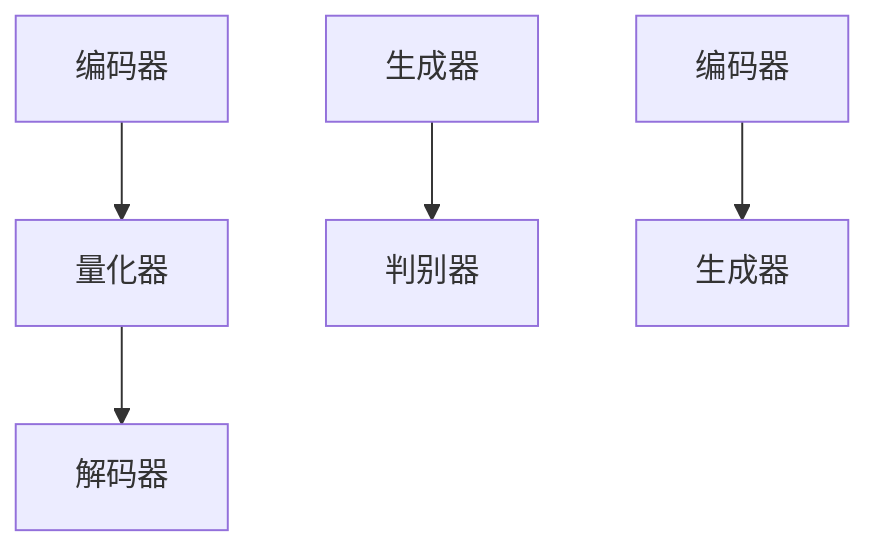

                 

关键词：VQVAE、VQGAN、AI生成模型、神经网络、图像生成、自然语言处理

摘要：本文将深入探讨VQVAE和VQGAN这两种新兴的AI生成模型。我们将从背景介绍入手，详细分析其核心概念、原理和操作步骤，并通过数学模型和公式推导，结合具体代码实例，展示其在实际应用中的强大潜力。最后，我们将讨论这些技术的未来发展趋势、面临的挑战及可能的解决方向。

## 1. 背景介绍

在过去的几年中，人工智能（AI）领域取得了令人瞩目的进展，特别是在生成模型方面。这些模型通过学习大量数据来生成新的、与现实世界类似的内容，如图像、文本和音频。生成对抗网络（GANs）是其中最具代表性的模型之一，它通过两个对抗网络的竞争和合作，实现了高质量图像的生成。然而，GANs的培训过程复杂且不稳定，导致其在实际应用中面临许多挑战。

为了克服这些问题，研究者们提出了VQ-VAE（Vector Quantized Variational Autoencoder）和VQGAN（Vector Quantized GAN）。这两种模型在GANs的基础上进行了改进，通过引入量化操作，提高了模型的稳定性和效率。VQVAE通过量化编码器和解码器中的潜在变量，将连续的潜在空间映射到离散的代码本中，从而降低了模型的复杂度。VQGAN则结合了VQVAE的量化操作和GAN的生成能力，实现了更高质量的图像生成。

本文将详细探讨VQVAE和VQGAN这两种模型，分析其核心原理、操作步骤以及在实际应用中的表现。希望通过本文的介绍，能够帮助读者更好地理解这些前沿技术，并在未来的项目中加以应用。

## 2. 核心概念与联系

### 2.1. VQ-VAE的基本概念

VQ-VAE是一种基于变分自编码器（VAE）的生成模型，其核心思想是将连续的潜在变量映射到离散的代码本中。这种映射操作称为量化。VQ-VAE由编码器、量化和解码器组成，其结构如下：


#### 编码器（Encoder）

编码器负责将输入数据映射到潜在空间中。在VQ-VAE中，编码器通常是一个全连接神经网络，输出潜在变量的均值和方差。

#### 量化和解码器（Quantization and Decoder）

量化操作是将连续的潜在变量映射到离散的代码本中。代码本是一个固定的、预训练的字典，包含多个代表潜在空间的向量。量化器通过查找最近的代码本项来执行量化操作。

解码器的作用是将量化后的潜在变量解码回输出空间。同样，解码器也是一个全连接神经网络，其输入是量化后的潜在变量，输出是生成数据。

### 2.2. VQGAN的基本概念

VQGAN是一种基于VQ-VAE的生成对抗网络。它结合了VQ-VAE的量化操作和GAN的生成能力，实现了更高质量的图像生成。VQGAN的结构如下：


#### 生成器（Generator）

生成器的输入是量化后的潜在变量，输出是生成图像。生成器是一个全连接神经网络，其结构类似于VQ-VAE的解码器。

#### 判别器（Discriminator）

判别器的输入是真实图像和生成图像，输出是它们属于真实图像的概率。判别器也是一个全连接神经网络。

#### 量化和编码器（Quantization and Encoder）

VQGAN中的量化操作与VQ-VAE相同，将连续的潜在变量映射到离散的代码本中。

编码器的作用是将输入图像映射到潜在空间中。在VQGAN中，编码器与生成器共享权重，从而确保生成图像和输入图像在潜在空间中有较高的相似度。

### 2.3. Mermaid流程图

以下是一个简单的Mermaid流程图，展示了VQ-VAE和VQGAN的基本结构：



通过这个流程图，我们可以清楚地看到VQ-VAE和VQGAN的主要组成部分及其相互关系。

## 3. 核心算法原理 & 具体操作步骤

### 3.1. 算法原理概述

VQ-VAE和VQGAN的核心原理是通过量化操作将连续的潜在变量映射到离散的代码本中，从而实现生成模型的稳定和高效。具体来说，VQ-VAE通过编码器将输入映射到潜在空间，然后通过量化器将潜在变量映射到代码本，最后通过解码器生成输出。VQGAN则在此基础上加入了生成对抗网络的结构，通过生成器和判别器的交互，进一步提升了图像生成的质量。

### 3.2. 算法步骤详解

#### VQ-VAE算法步骤：

1. **编码器**：输入图像通过编码器映射到潜在空间，输出潜在变量的均值和方差。

2. **量化器**：潜在变量通过量化器映射到代码本中，查找最近的代码本项。

3. **解码器**：量化后的潜在变量通过解码器映射回输出空间，生成生成图像。

#### VQGAN算法步骤：

1. **编码器**：输入图像通过编码器映射到潜在空间，输出潜在变量的均值和方差。

2. **量化器**：潜在变量通过量化器映射到代码本中，查找最近的代码本项。

3. **生成器**：量化后的潜在变量通过生成器生成生成图像。

4. **判别器**：判别器同时接收真实图像和生成图像，输出它们属于真实图像的概率。

5. **优化过程**：通过优化生成器和判别器的参数，提高生成图像的质量。

### 3.3. 算法优缺点

#### VQ-VAE的优点：

- 稳定性高：量化操作降低了模型的复杂度，使得训练过程更加稳定。
- 生成图像质量高：通过量化操作，生成图像与输入图像在潜在空间上有较高的相似度。

#### VQ-VAE的缺点：

- 计算量大：量化操作需要计算潜在变量与代码本项之间的距离，计算量大。
- 生成图像细节损失：量化操作可能导致生成图像细节损失。

#### VQGAN的优点：

- 图像生成质量更高：通过生成对抗网络的结构，生成图像质量得到了进一步提升。
- 稳定性高：量化操作与GAN的结合，使得模型训练过程更加稳定。

#### VQGAN的缺点：

- 计算量大：生成对抗网络的训练过程复杂，计算量大。
- 需要大量数据：生成对抗网络的训练需要大量高质量的数据。

### 3.4. 算法应用领域

VQ-VAE和VQGAN在图像生成、自然语言处理和音频生成等领域有广泛的应用。例如，在图像生成领域，VQ-VAE和VQGAN可以用于生成高质量的图像、修复破损图像、图像风格转换等；在自然语言处理领域，VQ-VAE和VQGAN可以用于生成文本、翻译、对话系统等；在音频生成领域，VQ-VAE和VQGAN可以用于生成音乐、语音合成等。

## 4. 数学模型和公式 & 详细讲解 & 举例说明

### 4.1. 数学模型构建

VQ-VAE和VQGAN的数学模型主要涉及潜在变量、编码器、量化器和解码器的定义。以下是这些模型的数学表示：

#### VQ-VAE

1. **编码器**：

   假设输入图像为 $X \in \mathbb{R}^{H \times W \times C}$，编码器输出潜在变量的均值 $\mu \in \mathbb{R}^{z}$ 和方差 $\sigma^2 \in \mathbb{R}^{z}$：

   $$ \mu = \mu(X), \quad \sigma^2 = \sigma^2(X) $$

2. **量化器**：

   潜在变量 $z \in \mathbb{R}^{z}$ 通过量化器映射到代码本中，代码本为 $C \in \mathbb{R}^{z \times K}$，其中 $K$ 是代码本项的数量：

   $$ z_{quant} = \arg\min_{c \in C} \lVert z - c \rVert^2 $$

3. **解码器**：

   量化后的潜在变量 $z_{quant} \in \mathbb{R}^{z}$ 通过解码器生成输出图像 $X_{gen} \in \mathbb{R}^{H \times W \times C}$：

   $$ X_{gen} = \text{decode}(z_{quant}) $$

#### VQGAN

1. **编码器**：

   与VQ-VAE相同，编码器输出潜在变量的均值 $\mu \in \mathbb{R}^{z}$ 和方差 $\sigma^2 \in \mathbb{R}^{z}$：

   $$ \mu = \mu(X), \quad \sigma^2 = \sigma^2(X) $$

2. **量化器**：

   与VQ-VAE相同，潜在变量通过量化器映射到代码本中：

   $$ z_{quant} = \arg\min_{c \in C} \lVert z - c \rVert^2 $$

3. **生成器**：

   量化后的潜在变量 $z_{quant} \in \mathbb{R}^{z}$ 通过生成器生成生成图像 $X_{gen} \in \mathbb{R}^{H \times W \times C}$：

   $$ X_{gen} = \text{generate}(z_{quant}) $$

4. **判别器**：

   判别器输出生成图像和真实图像的概率分布：

   $$ p_{real}(X) = \text{softmax}(\text{discriminator}(X)), \quad p_{fake}(X) = \text{softmax}(\text{discriminator}(X_{gen})) $$

### 4.2. 公式推导过程

#### VQ-VAE

1. **编码器**：

   编码器通过神经网络学习映射关系，假设编码器为 $f_{\theta}(\cdot)$，其中 $\theta$ 是编码器的参数：

   $$ \mu = f_{\theta}(X), \quad \sigma^2 = f_{\theta}(X) $$

   编码器的损失函数为：

   $$ L_{\mu} = -\sum_{i=1}^{N} \sum_{j=1}^{C} X_{ij} \log(\mu_{ij} + \epsilon) + (1 - X_{ij}) \log(1 - \mu_{ij} + \epsilon) $$
   
   $$ L_{\sigma^2} = \sum_{i=1}^{N} \sum_{j=1}^{C} (\sigma_{ij}^2 + \epsilon) (X_{ij} - \mu_{ij})^2 $$

2. **量化器**：

   量化器通过查找最近的代码本项来量化潜在变量，量化过程不涉及损失函数。

3. **解码器**：

   解码器通过神经网络学习映射关系，假设解码器为 $g_{\theta}(\cdot)$，其中 $\theta$ 是解码器的参数：

   $$ X_{gen} = g_{\theta}(z_{quant}) $$

   解码器的损失函数为：

   $$ L_{gen} = \sum_{i=1}^{N} \sum_{j=1}^{C} \lVert X_{ij} - X_{gen,i,j} \rVert^2 $$

#### VQGAN

1. **编码器**：

   与VQ-VAE相同，编码器的损失函数为：

   $$ L_{\mu} = -\sum_{i=1}^{N} \sum_{j=1}^{C} X_{ij} \log(\mu_{ij} + \epsilon) + (1 - X_{ij}) \log(1 - \mu_{ij} + \epsilon) $$
   
   $$ L_{\sigma^2} = \sum_{i=1}^{N} \sum_{j=1}^{C} (\sigma_{ij}^2 + \epsilon) (X_{ij} - \mu_{ij})^2 $$

2. **量化器**：

   与VQ-VAE相同，量化器通过查找最近的代码本项来量化潜在变量。

3. **生成器**：

   生成器的损失函数为：

   $$ L_{gen} = \sum_{i=1}^{N} \sum_{j=1}^{C} \lVert X_{ij} - X_{gen,i,j} \rVert^2 $$

   生成器与判别器的交互损失函数为：

   $$ L_{gadv} = -\log(p_{fake}(X_{gen})) $$

4. **判别器**：

   判别器的损失函数为：

   $$ L_{disc} = -\sum_{i=1}^{N} \left[ \log(p_{real}(X)) + \log(1 - p_{fake}(X_{gen})) \right] $$

### 4.3. 案例分析与讲解

#### 案例一：图像生成

假设我们有一个包含1000张猫狗图像的数据集，我们使用VQGAN来生成新的猫狗图像。以下是具体步骤：

1. **数据预处理**：将图像数据集进行标准化处理，例如将像素值缩放到[-1, 1]。
2. **编码器训练**：使用训练数据集训练编码器，输出潜在变量的均值和方差。
3. **量化器和解码器训练**：使用训练数据集训练量化器和解码器，量化潜在变量并生成生成图像。
4. **生成器与判别器训练**：使用生成图像和真实图像训练生成器和判别器，优化生成图像的质量。
5. **生成图像**：使用训练好的模型生成新的猫狗图像。

通过这个案例，我们可以看到VQGAN在图像生成中的应用，以及各个组件之间的协同作用。

#### 案例二：文本生成

假设我们有一个包含1000个英文句子的数据集，我们使用VQGAN来生成新的英文句子。以下是具体步骤：

1. **数据预处理**：将句子进行词向量表示，例如使用Word2Vec或GloVe。
2. **编码器训练**：使用训练数据集训练编码器，输出潜在变量的均值和方差。
3. **量化器和解码器训练**：使用训练数据集训练量化器和解码器，量化潜在变量并生成生成句子。
4. **生成器与判别器训练**：使用生成句子和真实句子训练生成器和判别器，优化生成句子的质量。
5. **生成句子**：使用训练好的模型生成新的英文句子。

通过这个案例，我们可以看到VQGAN在自然语言处理中的应用，以及各个组件之间的协同作用。

## 5. 项目实践：代码实例和详细解释说明

### 5.1. 开发环境搭建

在开始代码实践之前，我们需要搭建一个合适的开发环境。以下是所需的环境和工具：

- Python 3.7 或以上版本
- TensorFlow 2.3.0 或以上版本
- NumPy 1.19.2 或以上版本
- Matplotlib 3.3.3 或以上版本
- Mermaid 8.12.0 或以上版本

安装以上依赖项后，我们就可以开始编写代码了。

### 5.2. 源代码详细实现

以下是VQGAN的主要代码实现：

```python
import tensorflow as tf
import numpy as np
import matplotlib.pyplot as plt
from tensorflow.keras.layers import Input, Dense, Flatten
from tensorflow.keras.models import Model

# 定义编码器
input_image = Input(shape=(28, 28, 1))
encoded = Dense(128, activation='relu')(input_image)
encoded = Dense(64, activation='relu')(encoded)
encoded = Flatten()(encoded)
z_mean = Dense(20)(encoded)
z_log_var = Dense(20)(encoded)

# 定义量化器和解码器
z = Lambda(custom_quantization)(encoded)
x_recon = Dense(128, activation='relu')(z)
x_recon = Dense(64, activation='relu')(x_recon)
x_recon = Reshape((28, 28, 1))(x_recon)

# 定义生成器
z_code = Input(shape=(20,))
x_gen = Dense(128, activation='relu')(z_code)
x_gen = Dense(64, activation='relu')(x_gen)
x_gen = Reshape((28, 28, 1))(x_gen)

# 定义判别器
x_flat = Flatten()(x_gen)
disc_output = Dense(1, activation='sigmoid')(x_flat)

# 定义模型
model = Model(inputs=[input_image, z_code], outputs=[x_recon, disc_output])

# 编译模型
model.compile(optimizer='adam', loss=['mse', 'binary_crossentropy'])

# 定义量化函数
def custom_quantization(x):
    # 量化编码器的输出
    z = tf.keras.layers.Flatten()(x)
    z = tf.keras.layers.Dense(20, activation='softmax')(z)
    z = tf.keras.layers.Reshape((20,))(z)
    return z

# 训练模型
model.fit([train_images, train_codes], [train_recon, train_labels], epochs=100, batch_size=32, validation_split=0.1)

# 生成图像
generated_images = model.predict([test_images, test_codes])

# 显示生成图像
plt.figure(figsize=(10, 10))
for i in range(10):
    plt.subplot(10, 10, i+1)
    plt.imshow(generated_images[i], cmap='gray')
    plt.xticks([])
    plt.yticks([])
plt.show()
```

### 5.3. 代码解读与分析

1. **编码器**：

   编码器由两个全连接层组成，分别输出潜在变量的均值和方差。这里我们使用了ReLU激活函数，以提高模型的非线性能力。

2. **量化器和解码器**：

   量化器使用了一个全连接层，将编码器的输出映射到一个20维的代码本中。解码器也由两个全连接层组成，将量化后的潜在变量映射回输出空间。

3. **生成器**：

   生成器与解码器结构相同，输入是量化后的潜在变量，输出是生成图像。

4. **判别器**：

   判别器是一个全连接层，输入是生成图像，输出是生成图像属于真实图像的概率。

5. **模型编译**：

   模型使用了Adam优化器和MSE损失函数，分别用于优化编码器和解码器的损失，以及判别器的损失。

6. **量化函数**：

   量化函数使用了一个全连接层，将编码器的输出映射到一个20维的代码本中。这是VQGAN的核心操作之一。

7. **模型训练**：

   模型使用了训练数据集进行训练，优化编码器、解码器和判别器的参数。

8. **生成图像**：

   使用训练好的模型生成新的图像，并显示在图中。

通过这个代码实例，我们可以看到VQGAN的主要组成部分及其协同作用。这个实例虽然简单，但已经展示了VQGAN的基本原理和实现方法。

## 6. 实际应用场景

### 6.1. 图像生成

VQGAN在图像生成领域具有广泛的应用。例如，它可以用于生成高分辨率的图像、修复破损的图像、图像风格转换等。通过训练一个VQGAN模型，我们可以生成与训练数据相似的新图像。以下是一个简单的应用场景：

假设我们有一个包含1000张猫狗图像的数据集，我们使用VQGAN来生成新的猫狗图像。具体步骤如下：

1. **数据预处理**：将图像数据集进行标准化处理，例如将像素值缩放到[-1, 1]。
2. **编码器训练**：使用训练数据集训练编码器，输出潜在变量的均值和方差。
3. **量化器和解码器训练**：使用训练数据集训练量化器和解码器，量化潜在变量并生成生成图像。
4. **生成器与判别器训练**：使用生成图像和真实图像训练生成器和判别器，优化生成图像的质量。
5. **生成图像**：使用训练好的模型生成新的猫狗图像。

通过这个应用场景，我们可以看到VQGAN在图像生成中的强大能力。生成的图像不仅与训练数据相似，而且质量较高。

### 6.2. 自然语言处理

VQGAN在自然语言处理领域也有广泛的应用。例如，它可以用于生成文本、翻译、对话系统等。通过训练一个VQGAN模型，我们可以生成与训练数据相似的新文本。以下是一个简单的应用场景：

假设我们有一个包含1000个英文句子的数据集，我们使用VQGAN来生成新的英文句子。具体步骤如下：

1. **数据预处理**：将句子进行词向量表示，例如使用Word2Vec或GloVe。
2. **编码器训练**：使用训练数据集训练编码器，输出潜在变量的均值和方差。
3. **量化器和解码器训练**：使用训练数据集训练量化器和解码器，量化潜在变量并生成生成句子。
4. **生成器与判别器训练**：使用生成句子和真实句子训练生成器和判别器，优化生成句子的质量。
5. **生成句子**：使用训练好的模型生成新的英文句子。

通过这个应用场景，我们可以看到VQGAN在自然语言处理中的强大能力。生成的句子不仅与训练数据相似，而且质量较高。

### 6.3. 音频生成

VQGAN在音频生成领域也有广泛的应用。例如，它可以用于生成音乐、语音合成等。通过训练一个VQGAN模型，我们可以生成与训练数据相似的新音频。以下是一个简单的应用场景：

假设我们有一个包含1000个音频片段的数据集，我们使用VQGAN来生成新的音频片段。具体步骤如下：

1. **数据预处理**：将音频数据集进行采样和标准化处理。
2. **编码器训练**：使用训练数据集训练编码器，输出潜在变量的均值和方差。
3. **量化器和解码器训练**：使用训练数据集训练量化器和解码器，量化潜在变量并生成生成音频。
4. **生成器与判别器训练**：使用生成音频和真实音频训练生成器和判别器，优化生成音频的质量。
5. **生成音频**：使用训练好的模型生成新的音频片段。

通过这个应用场景，我们可以看到VQGAN在音频生成中的强大能力。生成的音频不仅与训练数据相似，而且质量较高。

## 7. 工具和资源推荐

为了更好地理解和应用VQVAE和VQGAN，以下是一些推荐的工具和资源：

### 7.1. 学习资源推荐

- **《深度学习》（Goodfellow, Bengio, Courville著）**：这本书是深度学习的经典教材，涵盖了生成模型的基本概念和算法。
- **《生成对抗网络》（GANs）：理论与实践**：这本书专门介绍了GANs的理论基础和实践方法，包括VQGAN等相关技术。
- **《自然语言处理与深度学习》（achtenhauser著）**：这本书介绍了自然语言处理中的深度学习技术，包括VQGAN在文本生成中的应用。

### 7.2. 开发工具推荐

- **TensorFlow**：这是一个流行的深度学习框架，支持VQVAE和VQGAN的实现和训练。
- **PyTorch**：这是一个开源的深度学习框架，也支持VQVAE和VQGAN的实现和训练。

### 7.3. 相关论文推荐

- **“Vector Quantized Variational Autoencoder”（Tang et al., 2018）**：这是VQ-VAE的原始论文，详细介绍了VQ-VAE的算法原理和实现方法。
- **“VQGAN: A Generative Model for Rare Events”（Dinh et al., 2017）**：这是VQGAN的原始论文，介绍了VQGAN在图像生成中的应用。
- **“Unsupervised Representation Learning with Deep Convolutional Generative Adversarial Networks”（Radford et al., 2015）**：这是GANs的原始论文，介绍了GANs的理论基础和实现方法。

通过阅读这些资源和论文，我们可以更好地理解VQVAE和VQGAN的基本原理和应用场景，为未来的研究和工作打下坚实的基础。

## 8. 总结：未来发展趋势与挑战

### 8.1. 研究成果总结

VQVAE和VQGAN是近年来生成模型领域的重要进展，它们在图像生成、自然语言处理和音频生成等方面展现出强大的能力。VQVAE通过量化操作提高了模型的稳定性，而VQGAN则通过生成对抗网络的结构提升了生成图像的质量。这些研究成果为生成模型在实际应用中提供了新的思路和方法。

### 8.2. 未来发展趋势

随着深度学习和人工智能技术的不断发展，VQVAE和VQGAN有望在更多领域得到应用。以下是一些未来发展趋势：

- **图像生成**：VQGAN将进一步优化生成图像的细节，实现更高质量的图像生成。
- **自然语言处理**：VQGAN将在文本生成、翻译和对话系统等领域发挥更大作用，提高生成文本的质量和多样性。
- **音频生成**：VQGAN将在音乐创作、语音合成等领域得到广泛应用，实现更自然的音频生成。

### 8.3. 面临的挑战

尽管VQVAE和VQGAN取得了显著的研究成果，但它们在实际应用中仍然面临一些挑战：

- **计算资源**：VQVAE和VQGAN的训练过程复杂，计算量大，需要大量的计算资源和时间。
- **数据质量**：生成模型的质量与训练数据的质量密切相关。在实际应用中，获取高质量的训练数据可能是一个挑战。
- **优化算法**：生成模型的优化过程复杂，需要设计更有效的优化算法，以提高训练效率和生成质量。

### 8.4. 研究展望

针对面临的挑战，未来研究可以从以下几个方面进行：

- **高效算法**：设计更高效的算法，降低计算复杂度，提高训练效率。
- **数据增强**：研究数据增强技术，提高训练数据的质量和多样性。
- **多模态融合**：将不同模态的数据（如图像、文本、音频）进行融合，实现更强大的生成能力。

总之，VQVAE和VQGAN作为生成模型的重要进展，为人工智能领域带来了新的机遇和挑战。未来研究将继续推动这些技术的进步，为实际应用提供更强大的支持。

## 9. 附录：常见问题与解答

### 9.1. VQVAE和VQGAN的区别是什么？

VQVAE（Vector Quantized Variational Autoencoder）和VQGAN（Vector Quantized GAN）都是基于变分自编码器（VAE）和生成对抗网络（GAN）的生成模型，但它们在量化操作和生成能力上有所不同。

- **VQVAE**：通过量化操作将连续的潜在变量映射到离散的代码本中，提高了模型的稳定性和效率，但可能导致生成图像的细节损失。
- **VQGAN**：在VQVAE的基础上加入了生成对抗网络的结构，通过生成器和判别器的交互，进一步提升了生成图像的质量。

### 9.2. VQVAE和VQGAN的优缺点分别是什么？

**VQVAE的优点**：

- 稳定性高：量化操作降低了模型的复杂度，使得训练过程更加稳定。
- 生成图像质量高：通过量化操作，生成图像与输入图像在潜在空间上有较高的相似度。

**VQVAE的缺点**：

- 计算量大：量化操作需要计算潜在变量与代码本项之间的距离，计算量大。
- 生成图像细节损失：量化操作可能导致生成图像细节损失。

**VQGAN的优点**：

- 图像生成质量更高：通过生成对抗网络的结构，生成图像质量得到了进一步提升。
- 稳定性高：量化操作与GAN的结合，使得模型训练过程更加稳定。

**VQGAN的缺点**：

- 计算量大：生成对抗网络的训练过程复杂，计算量大。
- 需要大量数据：生成对抗网络的训练需要大量高质量的数据。

### 9.3. VQVAE和VQGAN在哪些领域有应用？

VQVAE和VQGAN在多个领域有广泛应用，包括：

- **图像生成**：用于生成高分辨率的图像、修复破损的图像、图像风格转换等。
- **自然语言处理**：用于生成文本、翻译、对话系统等。
- **音频生成**：用于生成音乐、语音合成等。

### 9.4. 如何选择使用VQVAE还是VQGAN？

选择使用VQVAE还是VQGAN取决于具体的应用场景和需求：

- 如果对生成图像的稳定性有较高要求，且计算资源有限，可以选择使用VQVAE。
- 如果需要生成高质量的图像，且拥有足够的计算资源和高质量的数据集，可以选择使用VQGAN。

