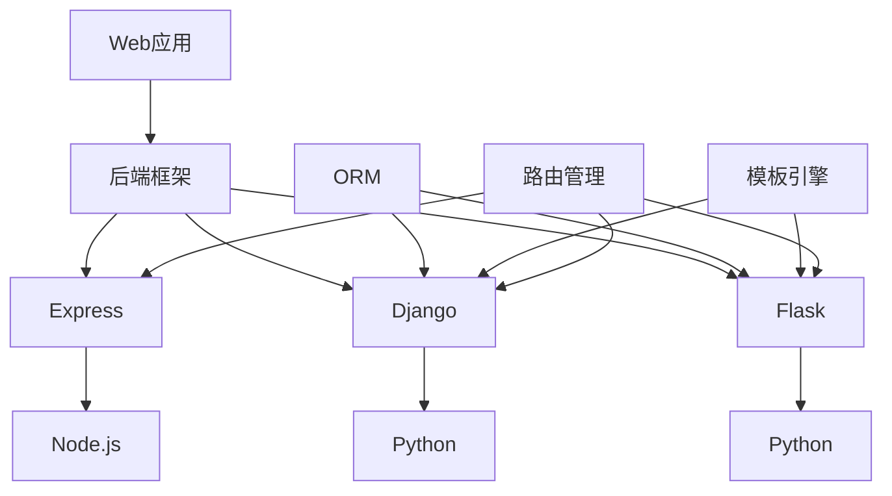

                 

### 关键词

Web开发、后端框架、Express、Django、Flask、前后端分离、RESTful API、路由管理、ORM、模板引擎、模块化开发、性能优化。

### 摘要

本文深入探讨了三种流行的Web后端框架：Express、Django和Flask。我们将分别介绍这三种框架的特点、架构、适用场景以及各自的优缺点。通过对比分析，旨在帮助开发者根据项目需求选择最适合的框架，提高开发效率和代码质量。

## 1. 背景介绍

随着互联网的飞速发展，Web应用的开发变得日益重要。后端框架作为Web开发的核心组件，承担着数据存储、业务逻辑处理、接口服务等功能。在众多的后端框架中，Express、Django和Flask因其各自独特的特点和优势，受到了广泛的关注和喜爱。

### Express

Express是一个基于Node.js的Web应用框架，由TJ Holowaychuk创建。它旨在提供极简、灵活的Web开发体验，通过简化HTTP服务器的搭建，让开发者能够更加专注于业务逻辑的实现。Express的模块化设计使其易于扩展和定制，广泛应用于实时应用、API服务等领域。

### Django

Django是一个高层次的Python Web框架，遵循MVC设计模式。由Adrian Holovaty和Simon Willison共同创建，Django以其“电池包含”（batteries-included）的理念，提供了丰富的内置功能，如ORM、认证、缓存、分页等，使得开发者可以快速构建大型、复杂的Web应用。

### Flask

Flask是一个微型Web框架，由Armin Ronacher创建。Flask的设计初衷是为了提供一个轻量级、易于扩展的框架，让开发者可以根据自己的需求进行定制。Flask的核心库较小，但通过使用扩展，它可以实现几乎所有功能，适用于小型到中型的Web应用开发。

### 目标读者

本文适合有Web开发经验的读者，特别是对后端框架有一定了解，希望进一步掌握Express、Django和Flask的开发者和工程师。

### 文章结构

本文将按以下结构展开：

1. **背景介绍**：介绍Web后端框架的背景和重要性。
2. **核心概念与联系**：使用Mermaid流程图展示核心概念和架构。
3. **核心算法原理 & 具体操作步骤**：详细阐述各框架的核心算法原理和操作步骤。
4. **数学模型和公式 & 详细讲解 & 举例说明**：使用LaTeX格式介绍相关数学模型和公式，并举例说明。
5. **项目实践：代码实例和详细解释说明**：通过实际代码实例展示框架的使用。
6. **实际应用场景**：分析各框架在不同应用场景下的适用性。
7. **工具和资源推荐**：推荐相关学习资源和开发工具。
8. **总结：未来发展趋势与挑战**：总结研究成果，展望未来趋势和挑战。
9. **附录：常见问题与解答**：解答读者可能遇到的问题。

## 2. 核心概念与联系

在深入了解Express、Django和Flask之前，我们需要了解一些核心概念和它们之间的联系。以下是一个简化的Mermaid流程图，用于展示这些概念和它们的关系：



### 2.1 核心概念

- **Web应用**：通过Web服务器和浏览器交互的应用程序。
- **后端框架**：用于构建Web后端的服务器端代码的框架。
- **Express**：基于Node.js的Web框架。
- **Django**：基于Python的MVC框架。
- **Flask**：基于Python的微型Web框架。
- **ORM（对象关系映射）**：数据库和对象之间的桥梁，简化数据库操作。
- **模板引擎**：用于生成HTML页面的模板语言。
- **路由管理**：处理HTTP请求并将其路由到相应的处理函数。

### 2.2 架构联系

Express、Django和Flask都是用于构建Web后端的服务器端框架，但它们的核心架构和设计理念有所不同。

- **Express**：作为Node.js的一个核心组件，Express提供了创建Web应用所需的基本功能，如HTTP请求处理、路由管理、中间件支持等。它是一个无状态的框架，适合构建高性能的实时应用和API服务。
- **Django**：Django遵循MVC设计模式，将模型、视图和控制器分离，提供了强大的内置功能，如ORM、认证、缓存等。它适合快速开发大型、复杂的Web应用。
- **Flask**：Flask是一个轻量级的框架，提供了创建Web应用所需的基本功能。它支持通过扩展实现各种功能，适合小型到中型的Web应用开发。

## 3. 核心算法原理 & 具体操作步骤

### 3.1 算法原理概述

#### Express

Express的核心算法原理基于事件驱动和非阻塞I/O模型。通过Node.js提供的异步API，Express能够高效地处理并发请求，实现高性能的Web服务。

#### Django

Django的核心算法原理基于ORM和MVC设计模式。ORM简化了数据库操作，MVC实现了模型、视图和控制器之间的分离，便于代码管理和扩展。

#### Flask

Flask的核心算法原理是通过扩展来实现各种功能。它提供了简单的路由管理和请求处理机制，开发者可以通过扩展库实现ORM、认证、缓存等高级功能。

### 3.2 算法步骤详解

#### Express

1. **启动服务器**：使用`http.createServer`方法创建HTTP服务器。
2. **设置请求处理函数**：为不同类型的HTTP请求（如GET、POST等）设置处理函数。
3. **添加中间件**：在请求处理过程中添加中间件，用于处理请求前后的逻辑。
4. **处理请求**：根据请求类型和URL，调用相应的处理函数。
5. **响应请求**：将处理结果返回给客户端。

#### Django

1. **配置模型**：定义数据模型，描述数据库表的结构。
2. **创建视图**：编写视图函数，处理HTTP请求，生成响应。
3. **配置路由**：将URL映射到相应的视图函数。
4. **运行服务器**：启动Django服务器，监听HTTP请求。

#### Flask

1. **设置应用**：使用`Flask`类创建应用对象。
2. **定义路由**：使用`@app.route`装饰器定义URL路由。
3. **处理请求**：编写处理函数，根据请求类型和参数进行处理。
4. **返回响应**：将处理结果以HTML、JSON等形式返回给客户端。

### 3.3 算法优缺点

#### Express

- **优点**：高性能、灵活、易于扩展。
- **缺点**：学习曲线较陡峭，异步编程可能增加代码复杂性。

#### Django

- **优点**：快速开发、丰富的内置功能、代码可维护性高。
- **缺点**：可能过于重量级，对于小型项目可能略显复杂。

#### Flask

- **优点**：轻量级、易于扩展、代码简洁。
- **缺点**：功能相对单一，需要使用多个扩展库来实现复杂功能。

### 3.4 算法应用领域

#### Express

- **实时应用**：如聊天应用、在线游戏等。
- **API服务**：如移动应用的后端接口、Web服务等。

#### Django

- **大型Web应用**：如电商平台、内容管理系统等。
- **快速开发**：适用于需要快速启动的项目。

#### Flask

- **小型Web应用**：如博客、个人网站等。
- **功能扩展**：适用于需要灵活扩展的项目。

## 4. 数学模型和公式 & 详细讲解 & 举例说明

### 4.1 数学模型构建

Web后端框架的性能优化往往涉及到数学模型的构建和公式推导。以下是一个简化的模型，用于分析响应时间和并发处理能力。

#### 响应时间模型

$$
响应时间 = \frac{处理时间}{并发数}
$$

其中，处理时间取决于算法复杂度和硬件性能。

#### 并发处理能力模型

$$
并发处理能力 = \frac{1}{响应时间}
$$

这个模型反映了系统在给定硬件资源下的最大并发处理能力。

### 4.2 公式推导过程

#### 响应时间公式推导

假设处理时间由算法复杂度和数据量决定，分别为 $T_{算法}$ 和 $T_{数据}$，则：

$$
T_{处理} = T_{算法} + T_{数据}
$$

假设系统拥有 $N$ 个处理单元，每个处理单元的处理速度相同，则并发处理时间为：

$$
T_{并发} = \frac{T_{处理}}{N}
$$

因此，响应时间为：

$$
响应时间 = \frac{T_{处理}}{并发数} = \frac{T_{算法} + T_{数据}}{并发数}
$$

#### 并发处理能力公式推导

将响应时间公式变形，得到：

$$
并发处理能力 = \frac{1}{响应时间} = \frac{并发数}{T_{算法} + T_{数据}}
$$

### 4.3 案例分析与讲解

以下是一个简单的案例，用于说明如何使用上述模型进行性能分析。

#### 案例背景

一个Web应用需要处理大量用户请求，系统性能要求响应时间不超过500ms，同时保证至少能处理100个并发请求。

#### 案例分析

假设每个用户的请求处理时间主要取决于算法复杂度，即 $T_{算法} = 100ms$，数据量对处理时间的影响较小，可以忽略。

根据响应时间模型，我们有：

$$
响应时间 = \frac{T_{算法} + T_{数据}}{并发数} \leq 500ms
$$

因此，为了保证响应时间不超过500ms，并发数应满足：

$$
并发数 \geq \frac{T_{算法} + T_{数据}}{500ms}
$$

由于 $T_{数据}$ 可以忽略，所以：

$$
并发数 \geq \frac{100ms}{500ms} = 2
$$

这意味着，为了满足性能要求，系统至少需要2个处理单元。

#### 案例结论

通过上述分析，我们得出结论：为了确保响应时间不超过500ms，并处理至少100个并发请求，系统需要至少2个处理单元。在实际开发过程中，可以根据具体情况调整算法复杂度和硬件配置，以实现最优的性能。

## 5. 项目实践：代码实例和详细解释说明

在本节中，我们将通过实际代码实例来展示Express、Django和Flask这三个框架的使用，并提供详细的解释说明。

### 5.1 开发环境搭建

在开始之前，我们需要搭建开发环境。以下是各框架的基本安装步骤：

#### Express

1. **安装Node.js**：从官网下载并安装Node.js。
2. **安装npm**：Node.js自带npm包管理器。
3. **创建Express项目**：
   ```bash
   mkdir express-app
   cd express-app
   npm init -y
   npm install express
   ```

#### Django

1. **安装Python**：从官网下载并安装Python。
2. **安装Django**：
   ```bash
   pip install django
   ```

#### Flask

1. **安装Python**：从官网下载并安装Python。
2. **安装Flask**：
   ```bash
   pip install flask
   ```

### 5.2 源代码详细实现

以下是各框架的一个简单示例代码，用于处理HTTP请求并返回响应。

#### Express

```javascript
const express = require('express');
const app = express();

app.get('/', (req, res) => {
  res.send('Hello, Express!');
});

const port = process.env.PORT || 3000;
app.listen(port, () => {
  console.log(`Express app listening at http://localhost:${port}`);
});
```

#### Django

```python
# views.py
from django.http import HttpResponse

def home(request):
    return HttpResponse('Hello, Django!')

# urls.py
from django.urls import path
from .views import home

urlpatterns = [
    path('', home, name='home'),
]
```

#### Flask

```python
from flask import Flask, jsonify

app = Flask(__name__)

@app.route('/')
def hello():
    return jsonify(message='Hello, Flask!')

if __name__ == '__main__':
    app.run(debug=True)
```

### 5.3 代码解读与分析

#### Express

这段代码首先引入了Express模块，并创建了一个应用实例。使用`get`方法为`/`路径设置了一个处理函数，该函数接收请求对象（`req`）和响应对象（`res`），并返回一个字符串。最后，使用`listen`方法启动HTTP服务器。

#### Django

这段代码定义了一个视图函数`home`，用于处理根路径（`/`）的GET请求。`HttpResponse`类用于生成响应。`urls.py`文件负责将URL映射到视图函数。

#### Flask

这段代码创建了一个Flask应用实例，并使用`route`装饰器为`/`路径设置了一个处理函数。函数返回一个JSON响应。

### 5.4 运行结果展示

运行各框架的示例代码，在浏览器中访问相应的URL，将看到以下结果：

- **Express**：返回 "Hello, Express!"。
- **Django**：返回 "Hello, Django!"。
- **Flask**：返回 {"message": "Hello, Flask!"}。

这些简单的示例展示了Express、Django和Flask的基本用法，以及它们在处理HTTP请求方面的相似之处。

## 6. 实际应用场景

Express、Django和Flask各自具有独特的优势和适用场景，下面我们将分别分析这些框架在不同应用场景中的表现。

### Express

#### 实时应用

Express在处理实时通信方面表现出色，如聊天应用、在线游戏和实时数据分析等。它的非阻塞I/O模型和事件驱动架构使其能够高效地处理并发请求，提供低延迟的实时交互体验。

#### API服务

Express广泛应用于构建RESTful API服务。其模块化和灵活的设计使其能够快速搭建高性能的后端接口，特别适用于移动应用和Web应用的后端服务。

#### 微服务架构

Express的轻量级和灵活性强，使得它非常适合构建微服务架构。每个微服务都可以使用Express独立部署和扩展，便于维护和升级。

### Django

#### 大型Web应用

Django以其快速开发和强大的内置功能，广泛应用于构建大型Web应用，如电商平台、内容管理系统和社交媒体平台。其“电池包含”的理念使得开发者能够快速实现功能丰富的Web应用。

#### 快速开发

Django的快速开发特性使其成为初创企业和中小型项目的首选。开发者可以利用Django的内置功能快速搭建原型和实现业务逻辑，降低开发成本。

#### 遵循MVC模式

Django遵循MVC设计模式，将模型、视图和控制器分离，使得代码结构清晰，便于管理和扩展。这对于大型、复杂的项目尤为重要。

### Flask

#### 小型Web应用

Flask的轻量级和灵活性使其成为小型Web应用的理想选择。开发者可以使用Flask快速搭建个人博客、小型网站和内部系统。

#### 功能扩展

Flask通过扩展库实现各种功能，如ORM、认证和缓存等。这使得Flask在实现复杂功能时同样表现出色，适用于中型的Web应用开发。

#### 定制化需求

Flask的模块化设计使其非常适合定制化需求。开发者可以根据项目需求选择合适的扩展库，构建高度定制化的Web应用。

### 适用场景总结

- **Express**：适合实时应用、API服务和微服务架构。
- **Django**：适合大型Web应用、快速开发和遵循MVC模式。
- **Flask**：适合小型Web应用、功能扩展和定制化需求。

在实际应用中，开发者应根据项目需求、团队熟悉度和开发周期等因素综合考虑，选择最适合的框架。

## 7. 工具和资源推荐

### 7.1 学习资源推荐

为了更好地掌握Express、Django和Flask，以下是一些建议的学习资源：

- **Express**：
  - 《Node.js实战》（《Node.js in Action》） - Michael Mancuso
  - 《Node.js入门与实践》（《Node.js for Beginners》） - Samer Buna
- **Django**：
  - 《Django By Example》（《Django实战》） - William S. Vincent
  - 《Django for Beginners》（《Django入门教程》） - William S. Vincent
- **Flask**：
  - 《Flask Web Development》（《Flask Web开发》） - Jacob Ginczak

### 7.2 开发工具推荐

- **集成开发环境（IDE）**：
  - Visual Studio Code：适用于多种编程语言，提供丰富的插件支持。
  - PyCharm：专业的Python IDE，支持Django和Flask开发。
  - WebStorm：适用于JavaScript和Node.js开发的IDE。

- **代码管理工具**：
  - Git：分布式版本控制系统，用于代码管理和协作开发。
  - GitHub：基于Git的代码托管平台，提供代码托管、项目管理等功能。

### 7.3 相关论文推荐

- **Express**：
  - "An Empirical Analysis of the Performance of Node.js and PHP for Web-Scale Systems"（"Node.js和PHP在Web规模系统性能的实证分析"）
  - "Node.js Event Loop and Its Performance Impact"（"Node.js事件循环及其性能影响"）
- **Django**：
  - "Django ORM: Building a High-Performance Database Abstraction"（"Django ORM：构建高性能数据库抽象层"）
  - "Django REST Framework: Building APIs with Django"（"Django REST Framework：使用Django构建API"）
- **Flask**：
  - "Flask vs Django: A Comparison of Two Python Web Frameworks"（"Flask与Django：两种Python Web框架的比较"）
  - "Flask Extensions: A Comprehensive Guide"（"Flask扩展：全面指南"）

通过这些资源，开发者可以更深入地了解这三个框架，提升开发技能和项目成功率。

## 8. 总结：未来发展趋势与挑战

### 8.1 研究成果总结

通过对Express、Django和Flask的深入分析，我们了解了这些框架的核心特点、适用场景和优缺点。Express以其高性能和灵活性在实时应用和API服务中占据重要地位；Django以其快速开发和强大功能，成为大型Web应用开发的优选；Flask的轻量级和模块化设计，使其在小型Web应用和定制化开发中具有优势。

### 8.2 未来发展趋势

随着Web应用的发展，后端框架将继续朝着更高效、更灵活、更易用的方向进化。以下是几个可能的发展趋势：

- **性能优化**：框架将继续优化性能，提高并发处理能力和响应速度。
- **功能增强**：随着应用需求的多样化，框架将提供更多内置功能，减少开发者依赖第三方库。
- **智能化**：借助人工智能和机器学习技术，框架将智能化地优化配置和性能调整。
- **微服务架构**：微服务架构的流行将推动框架支持更灵活、可扩展的微服务架构。

### 8.3 面临的挑战

尽管后端框架在不断发展，但也面临着一些挑战：

- **学习曲线**：新框架的不断涌现，使得开发者需要不断学习新技术，学习曲线可能较陡。
- **生态多样性**：众多框架和库的选择可能导致开发者陷入选择困境，生态多样性也增加了维护成本。
- **安全性**：随着网络攻击的增多，框架需要不断更新和强化安全特性，确保应用安全。
- **性能优化难度**：在硬件资源有限的情况下，优化性能变得越来越困难，开发者需要更深入地了解底层技术。

### 8.4 研究展望

未来的研究可以关注以下几个方面：

- **跨框架整合**：探索如何将不同框架的优势整合，提高开发效率和代码质量。
- **智能化性能优化**：研究如何利用人工智能技术，实现自动化的性能优化。
- **微服务与云计算**：探讨微服务架构与云计算的结合，实现更灵活、可扩展的后端服务。
- **开源社区发展**：加强开源社区建设，促进框架的持续发展和创新。

通过解决这些挑战和开展深入研究，我们可以期待后端框架在未来带来更多的价值。

## 9. 附录：常见问题与解答

### Q1：Express、Django和Flask哪个更适合初学者？

A1：初学者可以选择Flask，因为它更简单、轻量级，易于上手。Express和Django功能更强大，但相应的学习曲线也更陡峭，适合有一定编程基础的开发者。

### Q2：Express和Node.js的关系是什么？

A2：Express是基于Node.js的一个Web框架，它简化了Node.js的HTTP服务器搭建，提供了一套易于使用的API和中间件，使得开发者可以更加专注于业务逻辑的实现。

### Q3：Django和Flask的主要区别是什么？

A3：Django是一个完整的Web框架，提供了MVC模式、ORM、认证、缓存等内置功能，适合快速开发大型应用。Flask是一个微型框架，提供了基本的Web开发功能，但需要通过扩展库来实现复杂功能，适合小型到中型的应用。

### Q4：如何选择合适的后端框架？

A4：选择后端框架时，应考虑以下因素：

- **项目需求**：根据项目规模和功能需求选择框架。
- **团队技能**：考虑团队对框架的熟悉度和经验。
- **开发周期**：考虑项目的开发周期和进度。
- **性能要求**：根据系统的性能要求选择合适的框架。

通过综合考虑这些因素，可以做出更合适的选择。

### 总结

本文通过对Express、Django和Flask的深入分析，帮助开发者了解这三个框架的核心特点、适用场景和优缺点。通过了解这些信息，开发者可以根据项目需求选择合适的框架，提高开发效率和代码质量。同时，本文也展望了未来后端框架的发展趋势和挑战，为开发者提供了有价值的参考。希望本文能为您的Web后端开发之旅提供助力。作者：禅与计算机程序设计艺术 / Zen and the Art of Computer Programming。

