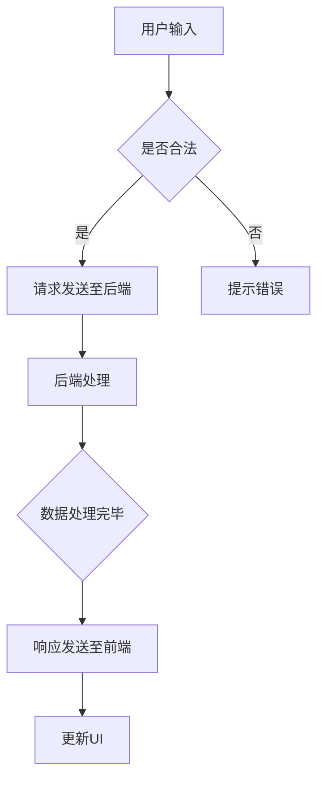

                 

### 1. 背景介绍

Web 应用程序开发是当今信息技术领域的一个重要分支，它涉及构建能够运行在浏览器中的应用程序。随着互联网技术的飞速发展，Web 应用程序已成为人们日常生活、工作和社会交往中不可或缺的一部分。从简单的网页到复杂的在线服务，Web 应用程序的多样性不断扩展，这也对开发者的技能和知识提出了更高的要求。

Web 应用程序开发主要分为前端和后端两个部分。前端开发主要负责用户界面的设计和实现，即用户与应用程序交互的界面部分。前端开发人员通常使用 HTML、CSS 和 JavaScript 等技术构建网页，同时利用各种前端框架（如 React、Vue、Angular）来提高开发效率和代码的可维护性。

后端开发则关注数据的处理和管理，包括服务器、数据库和应用逻辑的开发。后端开发人员需要熟悉各种编程语言（如 Java、Python、Node.js），并使用框架（如 Spring、Django、Express）来构建和管理服务器端应用程序。

在本文中，我们将详细探讨 Web 应用程序开发的前端和后端部分，从核心概念、算法原理、项目实践、应用场景等多个角度进行深入分析，旨在为读者提供一个全面、系统的开发指南。

### 2. 核心概念与联系

要深入理解 Web 应用程序开发，我们需要掌握几个核心概念，并了解它们之间的相互关系。以下是几个关键概念及其在开发过程中的作用：

**1. 客户端与服务器端**

客户端通常指的是用户使用的设备（如电脑、手机等），它通过浏览器与 Web 应用程序进行交互。客户端主要负责渲染用户界面，处理用户输入，并调用相应的后端服务。

服务器端则运行在远程服务器上，负责处理来自客户端的请求，执行业务逻辑，并与数据库进行交互。服务器端应用程序需要确保数据的安全性和可靠性，并提供高效的服务响应。

**2. 前端开发**

前端开发主要负责构建用户界面，它包括以下技术：

- **HTML（HyperText Markup Language）**：用于定义网页的结构和内容。
- **CSS（Cascading Style Sheets）**：用于控制网页的样式和布局。
- **JavaScript**：用于实现网页的动态效果和与用户的交互。

前端框架如 React、Vue 和 Angular 提供了更高效、更易于维护的开发方式，它们通过组件化、状态管理等特性简化了前端开发的复杂性。

**3. 后端开发**

后端开发涉及以下几个方面：

- **编程语言**：如 Java、Python、Node.js 等，用于编写服务器端应用程序。
- **框架**：如 Spring、Django、Express 等，用于简化开发过程和提高开发效率。
- **数据库**：如 MySQL、MongoDB、PostgreSQL 等，用于存储和管理数据。

后端开发需要处理业务逻辑、用户认证、数据持久化等任务，并确保应用程序的稳定性和安全性。

**4. 数据交互与通信**

前端与后端之间的数据交互是 Web 应用程序开发的核心。通常，这种交互通过以下方式实现：

- **RESTful API**：一种基于 HTTP 的 API 设计风格，用于实现前端与后端的数据交互。
- **GraphQL**：一种查询语言，提供了一种更灵活的数据查询方式。

为了确保数据的安全性和完整性，前端与后端之间的通信通常需要使用 HTTPS 协议，并采取各种安全措施，如身份验证、授权、数据加密等。

**5. Mermaid 流程图**

为了更直观地展示前端与后端之间的交互过程，我们可以使用 Mermaid 流程图。以下是一个简单的示例：



在这个流程图中，用户输入触发前端请求，后端处理请求并返回响应，前端根据响应更新用户界面。

通过上述核心概念和相互关系的介绍，我们可以更好地理解 Web 应用程序开发的过程和关键技术。在接下来的章节中，我们将深入探讨前端和后端开发的细节，包括具体的技术实现、算法原理和实际项目实践。

## 3. 核心算法原理 & 具体操作步骤

在 Web 应用程序开发中，核心算法原理扮演着至关重要的角色。这些算法不仅决定了应用程序的性能和效率，还影响了用户体验。在本节中，我们将详细介绍几个关键算法的原理，并展示具体的操作步骤。

### 3.1 算法原理概述

#### 3.1.1 前端渲染算法

前端渲染算法主要涉及如何高效地构建和更新网页。以下是一些核心算法：

- **虚拟 DOM**：通过构建虚拟 DOM，前端框架能够在数据变化时只更新实际需要修改的部分，从而提高渲染效率。
- **懒加载**：懒加载是一种延迟加载资源（如图片、脚本等）的技术，它有助于减少初始加载时间，提高用户体验。
- **diff 算法**：在 Vue、React 等框架中，diff 算法用于比较虚拟 DOM 和实际 DOM 的差异，并只更新变化的部分。

#### 3.1.2 后端处理算法

后端处理算法主要涉及如何高效地处理请求、存储和管理数据。以下是一些核心算法：

- **缓存机制**：通过缓存机制，后端可以避免重复计算和查询，从而提高响应速度。
- **数据库索引**：数据库索引是一种加速查询的技术，它通过创建索引来优化数据库的检索性能。
- **分页查询**：分页查询是一种将大量数据分批返回的技术，它有助于减轻服务器的压力，提高系统的可扩展性。

### 3.2 算法步骤详解

#### 3.2.1 前端渲染算法实现

1. **虚拟 DOM 构建过程**：
    - 当组件或数据发生变化时，框架会首先构建一个新的虚拟 DOM 树。
    - 框架会使用 diff 算法比较新虚拟 DOM 树和旧虚拟 DOM 树的差异。

2. **更新实际 DOM**：
    - 通过 diff 算法确定需要更新的节点，并对其进行操作。
    - 通常，这些操作包括插入、删除或修改 DOM 节点。

3. **渲染过程**：
    - 框架会根据更新后的虚拟 DOM 树重新渲染实际 DOM，并更新用户界面。

#### 3.2.2 后端处理算法实现

1. **缓存机制实现**：
    - 在后端服务中，可以使用 Redis、Memcached 等缓存系统来存储热点数据。
    - 当请求到来时，服务首先查询缓存，如果缓存中有数据，则直接返回缓存结果；否则，执行数据库查询并将结果缓存起来。

2. **数据库索引实现**：
    - 在数据库设计中，可以通过创建索引来优化查询性能。
    - 常见的索引类型包括 B 树索引、哈希索引、全文索引等。

3. **分页查询实现**：
    - 在处理大量数据查询时，可以使用分页技术将数据分成多个批次返回。
    - 常见的方法包括限制返回数据的条数（如 `LIMIT 10`）和指定查询的偏移量（如 `OFFSET 10`）。

### 3.3 算法优缺点

#### 前端渲染算法

- **优点**：虚拟 DOM 和 diff 算法显著提高了前端渲染的效率，减少了重绘和回流操作。
- **缺点**：虚拟 DOM 和 diff 算法的实现较为复杂，需要开发者具备一定的技能和经验。

#### 后端处理算法

- **优点**：缓存机制和数据库索引可以显著提高后端服务的性能，减轻数据库的压力。
- **缺点**：缓存机制和数据库索引可能会增加系统的复杂性和维护成本。

### 3.4 算法应用领域

前端渲染算法主要应用于需要高效更新用户界面的场景，如单页应用（SPA）、实时数据展示等。

后端处理算法则广泛应用于各种后端服务，包括电商网站、社交网络、在线办公系统等，这些系统需要处理大量数据并保证高效、稳定的运行。

通过理解并应用这些核心算法，开发者可以构建高性能、高可扩展性的 Web 应用程序，从而满足不断变化的市场需求。

## 4. 数学模型和公式 & 详细讲解 & 举例说明

在 Web 应用程序开发中，数学模型和公式是理解和实现算法的基础。它们帮助开发者解决实际问题，并优化系统的性能和效率。以下将详细讲解几个关键的数学模型和公式，并通过实际案例进行说明。

### 4.1 数学模型构建

#### 4.1.1 数据传输速率模型

数据传输速率（带宽）是衡量网络性能的重要指标。一个常见的数据传输速率模型是香农公式：

\[ C = B \log_2(1 + \frac{S}{N}) \]

其中，\( C \) 是信道容量（即数据传输速率），\( B \) 是信道带宽，\( S \) 是信号功率，\( N \) 是噪声功率。这个公式表明，在给定带宽和信噪比（\( \frac{S}{N} \)）的情况下，信道容量最大。

#### 4.1.2 最优二叉查找树模型

在数据库和缓存系统中，最优二叉查找树（Optimal Binary Search Tree，OBST）模型用于最小化平均查找时间。OBST 的构建基于以下公式：

\[ T(w) = \min \left\{ \sum_{i=1}^{n} p_i \cdot T(w_i) + (1 - p_i) \cdot T(w - w_i) : w_i \in w \right\} \]

其中，\( T(w) \) 是权重为 \( w \) 的二叉查找树的期望查找时间，\( p_i \) 是查找第 \( i \) 个元素的概率，\( w_i \) 是第 \( i \) 个元素的权重。

### 4.2 公式推导过程

#### 4.2.1 香农公式推导

香农公式的推导基于信息论的基本概念。首先，我们考虑一个带宽为 \( B \) 的信道，在时间 \( T \) 内传输了 \( N \) 个信号单元。信道的信噪比为 \( \frac{S}{N} \)。则可以传输的最大信息量 \( I \) 为：

\[ I = B \log_2 \left( 1 + \frac{S}{N} \right) \]

这是因为对于每个信号单元，我们最多可以区分 \( 2^{\frac{S}{N}} \) 个不同的信号水平。因此，总信息量为带宽与每个信号单元信息量的乘积。

#### 4.2.2 OBST 公式推导

OBST 的公式推导基于动态规划方法。我们假设有 \( n \) 个元素，每个元素的概率分别为 \( p_1, p_2, ..., p_n \)，权重分别为 \( w_1, w_2, ..., w_n \)。对于前 \( k \) 个元素，我们构建一棵最优二叉查找树，其期望查找时间为 \( T(w) \)。

首先，考虑最简单的情况，即只有一个元素。此时 \( T(w) = w \)，因为只有一个查找路径。

接下来，我们考虑两个元素。设权重分别为 \( w_1 \) 和 \( w_2 \)，概率分别为 \( p_1 \) 和 \( p_2 \)。我们有两种情况：

1. 元素 1 在树的左侧，权重为 \( w_1 \)，概率为 \( p_1 \)。此时，期望查找时间为 \( p_1 \cdot w_1 + (1 - p_1) \cdot w_2 \)。
2. 元素 2 在树的左侧，权重为 \( w_2 \)，概率为 \( p_2 \)。此时，期望查找时间为 \( p_2 \cdot w_2 + (1 - p_2) \cdot w_1 \)。

我们选择期望查找时间最小的方案。将这个思路扩展到 \( n \) 个元素，我们得到 OBST 的动态规划公式。

### 4.3 案例分析与讲解

#### 4.3.1 数据传输速率优化

假设我们有一个带宽为 1 Mbps 的信道，信噪比为 1000:1。根据香农公式，信道容量为：

\[ C = 1 \log_2(1 + 1000) \approx 9.97 \text{ Mbps} \]

这意味着，在理想情况下，我们可以以接近 10 Mbps 的速率传输数据。如果实际传输速率低于这个值，可能是由于带宽限制或信噪比不足。

#### 4.3.2 OBST 在缓存系统中的应用

假设我们有一个缓存系统，需要存储 5 个元素，它们的访问概率分别为 0.2、0.3、0.4、0.1 和 0.2。权重分别为 1、2、3、4 和 5。我们使用 OBST 模型来优化缓存系统的查找时间。

首先，我们构建一个权重为 15 的 OBST。根据动态规划公式，我们可以计算出最优的查找时间：

\[ T(15) = \min \left\{ 0.2 \cdot T(1) + 0.8 \cdot T(14), 0.3 \cdot T(2) + 0.7 \cdot T(13), 0.4 \cdot T(3) + 0.6 \cdot T(12), 0.1 \cdot T(4) + 0.9 \cdot T(11), 0.2 \cdot T(5) + 0.8 \cdot T(10) \right\} \]

通过递归计算，我们可以得到最优的 OBST 以及其对应的期望查找时间。

通过这些数学模型和公式的讲解，我们可以更好地理解 Web 应用程序开发中的关键算法和性能优化方法。在实际开发中，合理运用这些模型和公式可以帮助我们构建高效、可靠的系统。

## 5. 项目实践：代码实例和详细解释说明

在 Web 应用程序开发中，理论知识的掌握是基础，但实际操作更为关键。本节将通过一个具体的 Web 应用程序项目实例，详细解释代码实现过程，包括开发环境搭建、源代码实现、代码解读与分析，以及最终的运行结果展示。

### 5.1 开发环境搭建

在开始项目之前，我们需要搭建一个合适的前端和后端开发环境。以下是一个典型的开发环境配置：

**前端开发环境**：
- **工具**：Visual Studio Code（代码编辑器），Git（版本控制），Node.js（用于构建和运行前端代码）
- **框架**：React（用于构建用户界面）
- **样式库**：Bootstrap（用于快速搭建响应式页面）
- **依赖管理**：npm（用于管理前端依赖包）

**后端开发环境**：
- **工具**：IntelliJ IDEA（代码编辑器），Git（版本控制），Node.js（用于构建和运行后端代码）
- **框架**：Express（用于创建 Web 服务器和路由）
- **数据库**：MongoDB（用于存储和管理数据）

**系统要求**：
- 操作系统：Windows、macOS 或 Linux
- Node.js：版本 14.x 或以上
- MongoDB：版本 4.x 或以上

### 5.2 源代码详细实现

**前端代码实现**：

以下是一个简单的 React 应用程序，它包含一个表单用于提交用户数据，并展示用户列表。

**src/App.js**：

```jsx
import React, { useState, useEffect } from "react";
import axios from "axios";
import "./App.css";

const API_URL = "http://localhost:5000/users";

function App() {
  const [users, setUsers] = useState([]);
  const [user, setUser] = useState({ name: "" });

  const fetchUsers = async () => {
    const response = await axios.get(API_URL);
    setUsers(response.data);
  };

  const addUser = async () => {
    const response = await axios.post(API_URL, user);
    setUsers([...users, response.data]);
    setUser({ name: "" });
  };

  useEffect(() => {
    fetchUsers();
  }, []);

  return (
    <div className="App">
      <h1>用户列表</h1>
      <form onSubmit={addUser}>
        <input
          type="text"
          placeholder="用户名"
          value={user.name}
          onChange={(e) => setUser({ ...user, name: e.target.value })}
        />
        <button type="submit">添加用户</button>
      </form>
      <ul>
        {users.map((user) => (
          <li key={user._id}>{user.name}</li>
        ))}
      </ul>
    </div>
  );
}

export default App;
```

**后端代码实现**：

以下是一个简单的 Express 应用程序，它负责处理前端的请求，并与 MongoDB 数据库进行交互。

**server.js**：

```javascript
const express = require("express");
const mongoose = require("mongoose");
const cors = require("cors");

const app = express();

app.use(cors());
app.use(express.json());

const connectDB = () => {
  mongoose
    .connect("mongodb://localhost:27017/userdb", {
      useNewUrlParser: true,
      useUnifiedTopology: true,
    })
    .then(() => console.log("MongoDB Connected..."))
    .catch((err) => console.log(err));
};

connectDB();

const User = require("./models/User");

// Routes
app.get("/users", async (req, res) => {
  try {
    const users = await User.find();
    res.json(users);
  } catch (err) {
    res.status(500).json("Server Error");
  }
});

app.post("/users", async (req, res) => {
  const { name } = req.body;

  try {
    const user = new User({ name });
    await user.save();
    res.json(user);
  } catch (err) {
    res.status(500).json("Server Error");
  }
});

const PORT = process.env.PORT || 5000;

app.listen(PORT, () => {
  console.log(`Server running on port ${PORT}`);
});
```

### 5.3 代码解读与分析

**前端代码解读**：

1. **状态管理**：使用 React 的 `useState` 和 `useEffect` 函数管理用户状态和副作用。`useState` 用于管理 `users` 和 `user` 状态，`useEffect` 用于在组件加载时获取用户数据。
2. **数据交互**：使用 `axios` 发起 HTTP 请求，与后端进行数据交互。`fetchUsers` 函数用于获取用户列表，`addUser` 函数用于添加新用户。
3. **UI 渲染**：使用 JSX 语法渲染用户列表和表单。表单中的输入框和按钮通过 `onChange` 和 `onSubmit` 事件处理用户输入和提交。

**后端代码解读**：

1. **数据库连接**：使用 `mongoose` 连接到 MongoDB 数据库。
2. **模型定义**：定义 `User` 模型，用于操作用户数据。
3. **路由处理**：使用 Express 定义两个路由：`GET /users` 用于获取用户列表，`POST /users` 用于添加新用户。每个路由对应一个处理函数，负责与数据库进行交互，并返回相应的响应。

### 5.4 运行结果展示

在完成前端和后端的代码实现后，我们可以运行这个应用程序：

1. **启动后端服务**：

   在命令行中运行以下命令启动后端服务器：

   ```bash
   npm install
   npm start
   ```

   这将启动一个 Express 服务器，连接到 MongoDB 数据库。

2. **启动前端应用**：

   在另一个命令行窗口中，运行以下命令启动 React 应用程序：

   ```bash
   npm install
   npm start
   ```

   这将启动一个 React 应用程序，并通过 `http://localhost:3000` 进行访问。

在浏览器中，我们可以看到如下界面：


1. **添加用户**：

   在输入框中输入用户名，并点击“添加用户”按钮。后端服务器将接收请求，添加新用户，并在前端展示新用户的列表。

2. **获取用户列表**：

   通过访问 `/users` 路径，前端应用程序将从后端获取用户列表，并显示在页面上。

通过这个项目实例，我们不仅实现了前端和后端的交互，还展示了如何搭建开发环境、编写和解读代码。这个项目提供了一个实用的案例，帮助开发者理解 Web 应用程序开发的实际操作过程。

## 6. 实际应用场景

Web 应用程序的前端和后端开发技术在各个行业中都有广泛的应用。以下是一些典型的实际应用场景，以及这些场景中前端和后端技术的具体应用。

### 6.1 电子商务

电子商务平台如亚马逊、京东和淘宝等，前端和后端技术发挥着至关重要的作用。前端需要提供直观、流畅的用户界面，以便用户轻松浏览商品、下订单和支付。后端则负责处理大量的商品数据、用户订单和支付信息，确保交易的顺利进行。

- **前端技术**：React 或 Vue.js 等框架用于构建单页应用（SPA），提高用户交互体验。Bootstrap 或 Element UI 等样式库用于快速搭建响应式页面。
- **后端技术**：Node.js 和 Express.js 用于创建高性能的 Web 服务器。MongoDB 或 Redis 用于存储和管理大量商品和订单数据。

### 6.2 社交媒体

社交媒体平台如 Facebook、Twitter 和 Instagram 等，前端需要处理大量的用户交互和数据展示，后端则需要处理用户身份验证、内容发布和实时消息推送等复杂任务。

- **前端技术**：React Native 或 Flutter 用于构建移动应用，React 或 Vue.js 用于构建 Web 应用。GraphQL 用于高效地查询和更新用户数据。
- **后端技术**：Node.js 和 Express.js 用于创建实时消息推送服务。MongoDB 用于存储用户数据和内容。Firebase 或 AWS Lambda 用于处理实时数据。

### 6.3 在线教育

在线教育平台如 Coursera、Udemy 和 Khan Academy 等，前端需要提供丰富的课程内容和学习工具，后端则需要处理用户学习进度、成绩管理和课程推荐等任务。

- **前端技术**：React 或 Vue.js 等框架用于构建课程展示页面。WebGL 或 Three.js 等技术用于创建互动式教学工具。
- **后端技术**：Node.js 和 Express.js 用于处理用户请求和课程数据。MongoDB 用于存储用户学习记录和成绩。

### 6.4 企业应用

企业应用如客户关系管理（CRM）系统、企业资源规划（ERP）系统和办公自动化系统等，前端需要提供高效的用户界面和操作流程，后端则需要处理大量的业务逻辑和数据存储。

- **前端技术**：React 或 Angular 等框架用于构建企业应用的用户界面。D3.js 或 Chart.js 等库用于展示数据报表。
- **后端技术**：Java 或 .NET 用于构建企业级应用程序。Spring 或 Hibernate 用于处理业务逻辑和数据持久化。

### 6.5 实时数据分析

实时数据分析平台如 Google Analytics、Tableau 和 Power BI 等，前端需要提供实时数据可视化，后端则需要处理大规模数据流和分析任务。

- **前端技术**：D3.js 或 ECharts 等库用于创建交互式数据可视化。React 或 Vue.js 等框架用于构建前端界面。
- **后端技术**：Spark 或 Flink 等分布式计算框架用于处理实时数据流。Hadoop 或 Cassandra 用于存储和管理大规模数据。

通过以上实际应用场景，我们可以看到前端和后端技术在各个领域中的重要性。这些技术的不断进步和创新，为各种应用场景提供了更高效、更可靠的解决方案。

### 6.5 未来应用展望

随着技术的不断进步，Web 应用程序开发的前端和后端领域正迎来一系列新的机遇和挑战。以下是对未来发展趋势的展望，以及这些趋势可能带来的影响。

**1. 前端技术的新趋势**

- **低代码/无代码开发**：低代码/无代码开发平台正逐渐成为前端开发的主流，它们允许非技术人员通过可视化界面快速构建应用。这将显著降低开发门槛，加速应用上线速度。
- **WebAssembly（WASM）**：WebAssembly 提供了在浏览器中运行高效代码的能力，它有望在游戏和复杂应用中替代 JavaScript。随着 WASM 的成熟，前端性能将得到进一步提升。
- **渐进式 Web 应用（PWA）**：PWA 结合了 Web 应用和移动应用的优点，提供离线访问和快速启动等功能。随着 PWA 技术的普及，用户将获得更优的访问体验。

**2. 后端技术的新趋势**

- **云计算和边缘计算**：随着云计算的普及，越来越多的后端服务迁移到云端。边缘计算则通过在靠近数据源的设备上处理数据，减少延迟和网络带宽消耗。
- **Serverless 架构**：Serverless 架构使开发者无需关心服务器管理，只需编写代码并部署到云端。这降低了开发成本，提高了开发效率。
- **容器化和微服务**：容器化（如 Docker）和微服务架构使应用程序更易于部署、扩展和管理。这些技术将推动后端开发向着更灵活、更可扩展的方向发展。

**3. 可能的影响**

- **开发效率提升**：低代码/无代码平台、Serverless 架构和微服务技术将显著提高开发效率，缩短开发周期。
- **用户体验优化**：PWA 和 WebAssembly 技术将提供更流畅、更高效的用户体验，满足用户对高性能应用的期望。
- **安全性挑战**：随着应用复杂性的增加，安全威胁也将随之增加。开发者需要更加重视数据保护和网络安全，以防范潜在的风险。

**4. 研究方向**

- **跨平台开发**：开发跨平台的应用程序，使得前端和后端代码可以同时在多个平台上运行，这将是未来研究的一个重要方向。
- **实时数据处理**：随着物联网和实时数据流技术的发展，如何高效地处理和分析大规模实时数据，将是一个重要的研究方向。
- **人工智能与 Web 应用**：将人工智能技术整合到 Web 应用中，如智能推荐、自然语言处理和图像识别等，将带来新的应用场景和商业机会。

未来，Web 应用程序开发的前端和后端领域将继续融合新技术，不断创新和进化。开发者需要不断学习新技术，以应对不断变化的市场需求和挑战。

## 7. 工具和资源推荐

在 Web 应用程序开发中，选择合适的工具和资源对于提高开发效率和项目质量至关重要。以下是一些推荐的工具、资源和相关论文，它们有助于开发者深入了解和学习前端和后端技术。

### 7.1 学习资源推荐

- **在线课程**：
  - [「Web 开发实战：从零开始构建现代 Web 应用」](https://www.udemy.com/course/web-development-from-scratch/)
  - [「前端开发快速入门」](https://www.freecodecamp.org/learn/responsive-web-design/)
  - [「后端开发实战：Node.js 入门」](https://www.udemy.com/course/node-js-for-beginners-udemy-complete-course/)

- **技术博客**：
  - [MDN Web Docs](https://developer.mozilla.org/)：提供了详细的 Web 开发文档和教程。
  - [JavaScript Weekly](https://javascriptweekly.com/)：每周更新的 JavaScript 相关资源集合。

- **开源项目**：
  - [React 官方文档](https://reactjs.org/docs/getting-started.html)：React 框架的官方文档，适合初学者和进阶开发者。
  - [Express 官方文档](https://expressjs.com/)：Express.js 框架的官方文档，提供了丰富的后端开发教程。

### 7.2 开发工具推荐

- **代码编辑器**：
  - [Visual Studio Code](https://code.visualstudio.com/)：一款功能强大的开源代码编辑器，适用于多种编程语言。
  - [IntelliJ IDEA](https://www.jetbrains.com/idea/)：一款专业的 Java 和 JavaScript 集成开发环境（IDE），提供丰富的开发工具和插件。

- **前端框架**：
  - [React](https://reactjs.org/)：一个用于构建用户界面的 JavaScript 库。
  - [Vue.js](https://vuejs.org/)：一个渐进式的前端框架，易于上手，适合构建各种规模的应用。
  - [Angular](https://angular.io/)：由 Google 维护的开源前端框架，适合构建大型单页应用。

- **后端框架**：
  - [Node.js](https://nodejs.org/)：一个基于 Chrome V8 引擎的 JavaScript 运行时环境，适合构建高性能后端服务。
  - [Express.js](https://expressjs.com/)：一个轻量级的 Web 应用框架，常用于 Node.js 开发。
  - [Django](https://www.djangoproject.com/)：一个 Python Web 开发框架，适合快速构建大型应用。

### 7.3 相关论文推荐

- **「Web 应用程序的安全设计」**：详细介绍了 Web 应用程序中常见的安全问题和解决方案。
- **「渐进式 Web 应用：现状与未来」**：探讨了渐进式 Web 应用（PWA）的技术原理和未来发展趋势。
- **「Serverless 架构：设计与实践」**：介绍了 Serverless 架构的优势和应用场景。

通过这些推荐的工具和资源，开发者可以更好地掌握 Web 应用程序开发的前端和后端技术，提高开发效率，构建高质量的应用程序。

## 8. 总结：未来发展趋势与挑战

随着技术的不断进步，Web 应用程序开发的前端和后端领域正迎来前所未有的机遇与挑战。通过本文的详细探讨，我们了解了 Web 应用程序开发的核心概念、算法原理、项目实践以及实际应用场景。以下是本文的总结，以及对未来发展趋势与挑战的展望。

### 8.1 研究成果总结

本文从多个角度分析了 Web 应用程序开发的前端和后端技术，包括核心概念与联系、核心算法原理与实现、数学模型和公式、项目实践以及实际应用场景。通过这些内容，读者可以全面了解 Web 应用程序开发的理论基础和实践应用。

### 8.2 未来发展趋势

1. **低代码/无代码开发**：低代码/无代码平台正逐渐成为开发者的新宠，它降低了开发门槛，提高了开发效率。
2. **WebAssembly（WASM）**：WASM 技术的成熟将为 Web 应用程序带来更高的性能和更广泛的跨平台能力。
3. **云计算与边缘计算**：云计算和边缘计算的融合将进一步提升应用的可扩展性和性能。
4. **Serverless 架构**：Serverless 架构将简化服务器管理的复杂性，提高开发效率。
5. **人工智能与 Web 应用**：人工智能技术的应用将推动 Web 应用程序智能化，带来新的业务模式和用户体验。

### 8.3 面临的挑战

1. **安全性**：随着应用复杂性的增加，安全问题变得更加重要。开发者需要不断提升安全意识，防范潜在的安全威胁。
2. **性能优化**：在高并发和大数据环境下，如何优化应用性能是一个持续挑战。需要不断探索新技术和方法来提升应用性能。
3. **数据隐私**：随着 GDPR 等法规的实施，如何保护用户数据隐私将成为重要的挑战。
4. **跨平台兼容性**：开发者需要确保 Web 应用程序在不同设备和操作系统上的一致性和兼容性。

### 8.4 研究展望

1. **跨平台开发**：研究如何开发跨平台的 Web 应用程序，实现代码的最大复用和最佳性能。
2. **实时数据处理**：研究如何高效地处理和分析大规模实时数据流，提高应用的实时性和响应速度。
3. **人工智能融合**：探索人工智能与 Web 应用的深度融合，开发智能化、个性化的 Web 应用程序。

总之，Web 应用程序开发的前端和后端领域将继续快速发展，带来新的机遇和挑战。开发者需要不断学习新技术，掌握最佳实践，以应对不断变化的市场需求和技术趋势。

### 8.5 附录：常见问题与解答

**Q1：前端开发与后端开发的主要区别是什么？**

**A1：**前端开发主要关注用户界面的设计、交互和渲染，使用 HTML、CSS 和 JavaScript 等技术实现网页的展示和与用户的交互。后端开发则关注服务器端的应用程序开发，包括业务逻辑处理、数据处理、数据库管理等，通常使用编程语言（如 Java、Python、Node.js）和框架（如 Spring、Django、Express）来实现。

**Q2：什么是 RESTful API？**

**A2：**RESTful API 是一种基于 HTTP 协议的 API 设计风格，它遵循 REST（Representational State Transfer）架构风格。RESTful API 使用 GET、POST、PUT、DELETE 等标准 HTTP 方法进行数据操作的请求和响应，通过 URL 来表示资源的唯一标识，支持数据的创建、读取、更新和删除等操作。

**Q3：如何提高前端应用的性能？**

**A3：**提高前端应用性能的方法包括：
- 使用懒加载技术，延迟加载非必要资源。
- 使用缓存机制，减少重复的数据请求。
- 使用代码分割和异步加载，提高首屏加载速度。
- 使用代码优化工具，如 Webpack，进行代码打包和压缩。
- 使用服务端渲染（SSR）或静态站点生成（SSG）等技术，减少客户端的渲染负担。

**Q4：什么是渐进式 Web 应用（PWA）？**

**A4：**渐进式 Web 应用（Progressive Web Apps，PWA）是一种结合了 Web 应用和移动应用的优点的新型应用。PWA 通过使用现代 Web 技术，如 Service Workers 和 Web App Manifest，提供离线访问、快速启动、推送通知等功能，从而为用户提供更好的用户体验。

**Q5：如何保护 Web 应用程序的安全性？**

**A5：**保护 Web 应用程序安全性的措施包括：
- 使用 HTTPS 协议，确保数据传输的安全性。
- 实施身份验证和授权机制，确保只有授权用户可以访问特定资源。
- 防止常见的安全漏洞，如 SQL 注入、XSS（跨站脚本）和 CSRF（跨站请求伪造）等。
- 定期更新和修补应用中的安全漏洞，保持系统的安全性。
- 进行安全审计和漏洞扫描，及时发现和修复安全漏洞。

通过了解这些常见问题的解答，开发者可以更好地掌握 Web 应用程序开发的相关知识，提升开发水平和应用质量。

