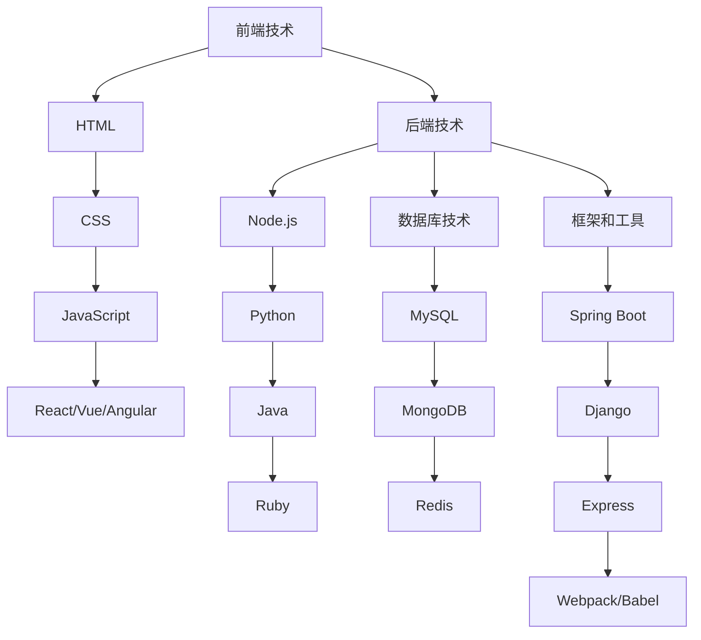

                 

关键词：Web开发、前后端技术、全栈开发、框架、算法、数学模型、项目实践、工具推荐、未来展望

摘要：本文将深入探讨Web全栈开发的核心技术，包括前后端的架构、核心算法、数学模型、项目实践以及未来的发展趋势。通过详细的讲解和案例分析，读者将全面掌握Web全栈开发的知识，为成为一名优秀的全栈开发者打下坚实的基础。

## 1. 背景介绍

随着互联网技术的飞速发展，Web开发已经成为当今计算机领域中最热门的领域之一。Web全栈开发，顾名思义，就是指在Web应用程序开发中，既涉及前端开发也涉及后端开发，从而实现一个完整的应用程序。全栈开发者需要掌握多种技术，包括前端技术（如HTML、CSS、JavaScript）、后端技术（如Node.js、Python、Java）、数据库技术（如MySQL、MongoDB）以及各种框架和工具。

在过去的几年里，前后端分离的开发模式变得越来越流行。这种模式将前端和后端的开发分离，使得开发人员可以更加专注于各自的领域，提高了开发效率和代码质量。同时，前后端分离也为微服务架构的兴起提供了基础，使得大型复杂的应用程序能够更加灵活和可扩展。

本文将首先介绍Web全栈开发的基本概念和核心技术，然后深入探讨前后端的架构和实现方式，接着介绍一些核心算法和数学模型，并通过一个实际项目实践来讲解开发过程。最后，我们将展望Web全栈开发未来的发展趋势和面临的挑战。

## 2. 核心概念与联系

### 2.1 前端技术

前端技术主要涉及用户界面和用户体验的设计和实现。HTML（HyperText Markup Language）是构建网页结构的基础，CSS（Cascading Style Sheets）用于美化网页，而JavaScript则是实现网页交互的核心。近年来，React、Vue和Angular等前端框架的兴起，极大地提升了前端开发的效率和质量。

### 2.2 后端技术

后端技术主要负责处理服务器端的逻辑和数据操作。常见的后端技术包括Node.js、Python、Java、Ruby等。这些技术不仅可以处理静态资源，还可以处理复杂的业务逻辑，提供API接口供前端调用。

### 2.3 数据库技术

数据库技术用于存储和管理应用程序的数据。MySQL、MongoDB、Redis等是常用的数据库技术，它们各自适用于不同的场景。数据库的设计和优化是后端开发中至关重要的一环。

### 2.4 框架和工具

框架和工具是Web全栈开发的基石。如Spring Boot、Django、Express等框架，提供了丰富的功能和工具，使得开发过程更加高效。Webpack、Babel等工具则用于模块化和代码转换，提升了开发体验。

### 2.5 Mermaid 流程图

以下是Web全栈开发的核心概念和联系的Mermaid流程图：



## 3. 核心算法原理 & 具体操作步骤

### 3.1 算法原理概述

在Web全栈开发中，算法和数据结构是核心组成部分。常见的算法包括排序算法、查找算法、加密算法等。以下是一些常用的算法原理：

- 排序算法：冒泡排序、选择排序、插入排序、快速排序、归并排序等。
- 查找算法：二分查找、线性查找等。
- 加密算法：MD5、SHA-256等。

### 3.2 算法步骤详解

#### 3.2.1 冒泡排序

冒泡排序是一种简单的排序算法，它重复地遍历要排序的数列，一次比较两个元素，如果它们的顺序错误就把它们交换过来。遍历数列的工作是重复地进行直到没有再需要交换，也就是说该数列已经排序完成。

算法步骤如下：

1. 比较相邻的元素。如果第一个比第二个大（升序排序），就交换它们两个。
2. 对每一对相邻元素做同样的工作，从开始第一对到结尾的最后一对。这步做完后，最后的元素会是最大的数。
3. 针对所有的元素重复以上的步骤，除了最后一个。
4. 重复步骤1~3，直到排序完成。

#### 3.2.2 二分查找

二分查找是一种在有序数组中查找某一特定元素的搜索算法。算法的核心思想是将待搜索的数组从中间分割成两部分，然后根据目标值与中间值的大小关系，决定下一步在数组的前半部分或后半部分进行搜索。算法步骤如下：

1. 设定搜索区间为low和high，初始时low为0，high为数组的长度减1。
2. 计算中间值mid = (low + high) / 2。
3. 如果mid处的元素值等于目标值，则返回mid。
4. 如果目标值小于mid处的元素值，则将high更新为mid - 1，继续步骤2。
5. 如果目标值大于mid处的元素值，则将low更新为mid + 1，继续步骤2。
6. 如果low > high，说明目标值不存在于数组中，返回-1。

### 3.3 算法优缺点

#### 3.3.1 冒泡排序

- 优点：实现简单，易于理解。
- 缺点：效率较低，不适合大规模数据的排序。

#### 3.3.2 二分查找

- 优点：时间复杂度为O(log n)，效率高。
- 缺点：需要预先对数据进行排序，不适用于动态数据集。

### 3.4 算法应用领域

排序算法和查找算法在Web全栈开发中有着广泛的应用，如用户数据的排序、搜索功能、数据处理等。加密算法则在保障数据安全方面发挥着重要作用。

## 4. 数学模型和公式 & 详细讲解 & 举例说明

### 4.1 数学模型构建

在Web全栈开发中，数学模型广泛应用于算法设计、数据分析和性能优化等领域。以下是一个常见的数学模型——线性回归。

线性回归模型的基本公式为：

$$y = w_0 + w_1 \cdot x$$

其中，$y$ 是因变量，$x$ 是自变量，$w_0$ 和 $w_1$ 是模型参数。

### 4.2 公式推导过程

线性回归模型的推导过程主要基于最小二乘法。目标是最小化预测值与实际值之间的误差平方和。

1. 设定预测值 $y' = w_0 + w_1 \cdot x$。
2. 计算误差平方和：$S = \sum (y - y')^2$。
3. 对 $w_0$ 和 $w_1$ 分别求偏导数并令其等于0，得到以下方程组：

$$
\begin{cases}
\frac{\partial S}{\partial w_0} = -2 \sum (y - y') = 0 \\
\frac{\partial S}{\partial w_1} = -2 \sum (y - y') \cdot x = 0
\end{cases}
$$

4. 解方程组，得到 $w_0$ 和 $w_1$ 的最优值。

### 4.3 案例分析与讲解

以下是一个使用线性回归模型进行股票预测的案例。

#### 数据集：

| 日期 | 股票价格（美元） |
| ---- | -------------- |
| 2021-01-01 | 100            |
| 2021-01-02 | 102            |
| 2021-01-03 | 105            |
| ...  | ...            |

#### 模型构建：

1. 选择日期作为自变量$x$，股票价格作为因变量$y$。
2. 使用最小二乘法求解线性回归模型参数。
3. 得到模型公式：$y = w_0 + w_1 \cdot x$。

#### 预测：

使用训练好的模型对未来的股票价格进行预测。

1. 输入日期（自变量$x$），得到预测的股票价格（因变量$y$）。
2. 根据预测结果，对股票价格进行投资决策。

### 4.4 数学公式嵌入

在文中嵌入数学公式时，可以使用LaTeX格式。例如：

$$
E = mc^2
$$

这将输出著名的质能方程。

## 5. 项目实践：代码实例和详细解释说明

### 5.1 开发环境搭建

为了更好地展示Web全栈开发的过程，我们将使用以下开发环境：

- 前端：HTML + CSS + JavaScript + React
- 后端：Node.js + Express
- 数据库：MySQL
- 开发工具：Visual Studio Code、Webpack、Babel

### 5.2 源代码详细实现

以下是项目的基本结构：

```plaintext
my-web-app/
|-- public/
|   |-- index.html
|-- src/
|   |-- components/
|   |   |-- Header.js
|   |   |-- Footer.js
|   |-- index.js
|-- server/
|   |-- app.js
|-- package.json
```

#### 前端部分

**index.html**

```html
<!DOCTYPE html>
<html lang="en">
<head>
  <meta charset="UTF-8">
  <meta name="viewport" content="width=device-width, initial-scale=1.0">
  <title>My Web App</title>
</head>
<body>
  <div id="app"></div>
</body>
</html>
```

**Header.js**

```javascript
import React from 'react';

const Header = () => {
  return (
    <header>
      <h1>My Web App</h1>
    </header>
  );
};

export default Header;
```

**Footer.js**

```javascript
import React from 'react';

const Footer = () => {
  return (
    <footer>
      &copy; 2022 My Web App
    </footer>
  );
};

export default Footer;
```

**index.js**

```javascript
import React from 'react';
import ReactDOM from 'react-dom';
import { Header, Footer } from './components';

const App = () => {
  return (
    <div>
      <Header />
      <main>
        {/* 应用内容 */}
      </main>
      <Footer />
    </div>
  );
};

ReactDOM.render(<App />, document.getElementById('app'));
```

#### 后端部分

**app.js**

```javascript
const express = require('express');
const app = express();

app.use(express.json());

app.get('/', (req, res) => {
  res.send('Hello, World!');
});

// 其他路由和API

app.listen(3000, () => {
  console.log('Server is running on port 3000');
});
```

### 5.3 代码解读与分析

在前端部分，我们使用了React框架来构建用户界面。通过组件化开发，我们将UI拆分成多个可复用的组件，如Header和Footer。在index.js中，我们使用ReactDOM将组件渲染到DOM元素上。

后端部分，我们使用了Express框架来搭建服务器。通过定义路由和处理函数，我们可以响应对特定URL的HTTP请求。这里我们定义了一个简单的GET路由，用于返回欢迎信息。

### 5.4 运行结果展示

1. 启动后端服务器：

```bash
$ node server/app.js
```

2. 访问前端页面：

```bash
$ open http://localhost:3000
```

在浏览器中，我们将看到如下显示：

```
<!DOCTYPE html>
<html lang="en">
<head>
  <meta charset="UTF-8">
  <meta name="viewport" content="width=device-width, initial-scale=1.0">
  <title>My Web App</title>
</head>
<body>
  <div id="app"></div>
</body>
</html>
```

点击浏览器中的按钮，将看到“Hello, World!”的显示。

## 6. 实际应用场景

### 6.1 电子商务平台

电子商务平台需要实现商品展示、用户注册、购物车管理、订单处理等功能。前端负责用户界面的展示和交互，后端则处理业务逻辑和数据处理。

### 6.2 内容管理系统（CMS）

内容管理系统用于管理网站的内容，如文章、图片、视频等。前端负责编辑和展示内容，后端负责内容存储和权限管理。

### 6.3 社交媒体平台

社交媒体平台需要实现用户注册、登录、发布动态、评论、私信等功能。前端负责用户界面的展示和交互，后端则处理用户数据存储和社交关系管理。

## 6.4 未来应用展望

随着人工智能、物联网和大数据等技术的发展，Web全栈开发将面临更多的机遇和挑战。以下是未来应用的一些展望：

### 6.4.1 人工智能与Web全栈开发

人工智能技术将深入融合到Web全栈开发中，如自然语言处理、图像识别、推荐系统等。这将极大地提升用户体验和业务效率。

### 6.4.2 物联网与Web全栈开发

物联网技术的普及将推动Web全栈开发向边缘计算和实时数据处理方向发展。智能家居、智能城市等应用场景将为Web全栈开发带来新的挑战和机遇。

### 6.4.3 大数据与Web全栈开发

大数据技术的应用将使Web全栈开发更加注重数据处理和分析。数据可视化、数据挖掘等技术在Web全栈开发中的应用将变得更加广泛。

## 7. 工具和资源推荐

### 7.1 学习资源推荐

- 《你不知道的JavaScript》
- 《深入理解计算机系统》
- 《算法导论》
- 《Web全栈开发：前后端技术全面掌握》

### 7.2 开发工具推荐

- Visual Studio Code
- WebStorm
- Git

### 7.3 相关论文推荐

- 《前端工程化：处理前端开发中的复杂性问题》
- 《深度学习在Web开发中的应用》
- 《边缘计算与Web全栈开发》

## 8. 总结：未来发展趋势与挑战

### 8.1 研究成果总结

本文系统地介绍了Web全栈开发的核心技术，包括前端技术、后端技术、数据库技术、框架和工具，以及核心算法和数学模型。通过实际项目实践，读者可以更好地理解和掌握这些技术。

### 8.2 未来发展趋势

未来，Web全栈开发将更加注重人工智能、物联网和大数据等新兴技术的融合应用。前端技术将不断进化，后端技术将更加注重性能和可扩展性。微服务架构和容器技术将进一步普及。

### 8.3 面临的挑战

Web全栈开发面临的挑战主要包括：

- 技术栈的复杂性和多样性，如何快速适应和学习新技术。
- 性能和可扩展性，如何在高并发场景下保持系统的稳定运行。
- 安全性问题，如何防范数据泄露和黑客攻击。

### 8.4 研究展望

未来，Web全栈开发的研究将更加关注以下几个方面：

- 前端与后端的融合，如Serverless架构的推广。
- 实时数据处理和边缘计算的应用。
- 基于人工智能和机器学习的智能Web应用开发。

## 9. 附录：常见问题与解答

### 9.1 前端技术有哪些常见的框架？

- React
- Vue
- Angular

### 9.2 后端技术有哪些常见的框架？

- Spring Boot
- Django
- Express

### 9.3 如何优化Web应用的性能？

- 使用缓存技术，如Redis。
- 使用CDN加速静态资源加载。
- 优化数据库查询，如使用索引。
- 实施代码分割和懒加载。

### 9.4 如何保障Web应用的安全？

- 使用HTTPS协议。
- 实施输入验证和过滤，防范XSS攻击。
- 定期更新和维护系统依赖库。

作者：禅与计算机程序设计艺术 / Zen and the Art of Computer Programming

