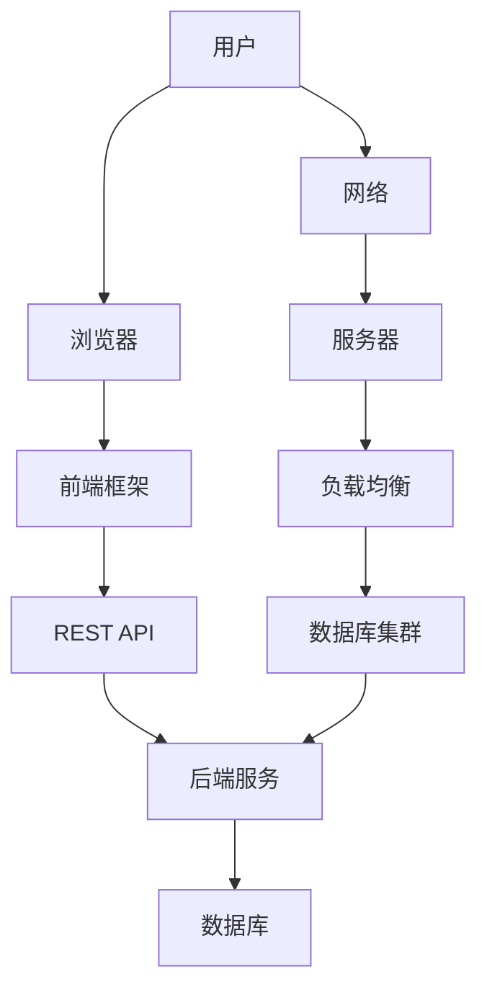

                 

 在今天的数字化时代，Web全栈开发成为了信息技术领域中的核心技能。无论是初创公司还是大企业，都依赖Web应用来提供他们的产品和服务。本文旨在为开发者提供一个全面的技术栈指南，涵盖从前端到后端的所有关键知识点。

> **关键词**：Web全栈开发、前端、后端、技术栈、全栈工程师

> **摘要**：本文将探讨Web全栈开发的核心概念、技术工具、开发流程以及未来趋势。通过详细的案例分析，我们将帮助读者更好地理解并掌握现代Web全栈开发的各项技能。

## 1. 背景介绍

随着互联网的迅速发展，Web应用已经成为企业和个人不可或缺的组成部分。Web全栈开发涉及前端和后端技术的整合，这使得开发人员能够从头到尾负责一个项目的所有方面。这不仅是技能的全面性，更是对系统性和问题解决能力的挑战。

前端开发主要关注用户界面和用户体验，包括HTML、CSS、JavaScript以及现代化的前端框架如React、Vue和Angular。后端开发则侧重于服务器、数据库、业务逻辑等，通常使用语言如Node.js、Python、Java或Ruby。一个成功的Web全栈工程师需要在这两个领域都有深入的了解和实践经验。

## 2. 核心概念与联系

为了更好地理解Web全栈开发的复杂性和多样性，我们首先需要了解其核心概念和各部分之间的联系。以下是一个使用Mermaid绘制的流程图，展示了Web全栈开发的主要组件和它们之间的交互关系。



### 2.1 前端

前端是用户直接交互的部分，主要包括：

- **HTML**：构建网页结构的基础。
- **CSS**：美化网页，控制布局和样式。
- **JavaScript**：实现动态交互和复杂功能。

现代前端开发广泛使用框架和库，如：

- **React**：用于构建用户界面的JavaScript库。
- **Vue**：渐进式框架，易于上手和扩展。
- **Angular**：由Google开发的强大框架。

### 2.2 后端

后端负责处理业务逻辑、数据存储和服务器端交互。关键组件包括：

- **Node.js**：基于Chrome V8引擎的JavaScript运行环境。
- **Python**：灵活且功能强大的编程语言，适合快速开发和科学计算。
- **Java**：企业级语言，适用于大型、复杂的应用。
- **Ruby**：优雅的语言，特别适合Web开发。

### 2.3 数据库

数据库用于存储和管理数据，常见类型包括：

- **关系型数据库（RDBMS）**：如MySQL、PostgreSQL。
- **非关系型数据库（NoSQL）**：如MongoDB、Cassandra。

### 2.4 服务器和网络

服务器和网络基础设施是Web应用的基础，包括：

- **Web服务器**：如Apache、Nginx。
- **负载均衡**：确保流量均衡分布，提高系统可用性。
- **容器化技术**：如Docker，用于快速部署和扩展应用。

## 3. 核心算法原理 & 具体操作步骤

### 3.1 算法原理概述

Web全栈开发中，算法是数据处理和优化的重要工具。以下是几个常见的算法原理：

- **排序算法**：如快速排序、归并排序。
- **查找算法**：如二分查找。
- **图算法**：如最短路径算法、图遍历。

### 3.2 算法步骤详解

以快速排序算法为例，其基本步骤如下：

1. 选择一个基准元素。
2. 将比基准小的元素放在其左侧，比其大的元素放在右侧。
3. 对左侧和右侧子序列递归执行步骤1-2。

### 3.3 算法优缺点

快速排序的优点是平均时间复杂度为O(n log n)，但缺点是最坏情况下的时间复杂度为O(n^2)。

### 3.4 算法应用领域

快速排序广泛应用于各种数据处理场景，如数据库索引和搜索算法。

## 4. 数学模型和公式 & 详细讲解 & 举例说明

### 4.1 数学模型构建

Web全栈开发中，数学模型常用于优化和预测。例如，线性回归模型可以用于预测用户行为。

### 4.2 公式推导过程

线性回归模型的公式为：

$$ y = ax + b $$

其中，$y$ 是因变量，$x$ 是自变量，$a$ 和 $b$ 是模型的参数。

### 4.3 案例分析与讲解

假设我们想要预测某个网站的用户访问量，可以使用线性回归模型来构建预测模型。

## 5. 项目实践：代码实例和详细解释说明

### 5.1 开发环境搭建

在本地环境中搭建一个简单的Web全栈开发环境，需要安装Node.js、MySQL、Docker等工具。

### 5.2 源代码详细实现

以下是一个简单的Node.js服务器代码示例：

```javascript
const http = require('http');

const server = http.createServer((req, res) => {
  res.end('Hello, World!');
});

server.listen(3000, () => {
  console.log('Server is running on port 3000');
});
```

### 5.3 代码解读与分析

这个简单的服务器代码使用了Node.js的http模块创建了一个HTTP服务器，监听3000端口，并在收到请求时返回“Hello, World!”字符串。

### 5.4 运行结果展示

在命令行中运行`node server.js`，然后在浏览器中访问`http://localhost:3000`，可以看到返回的“Hello, World!”。

## 6. 实际应用场景

Web全栈开发在电子商务、社交媒体、在线教育等领域有广泛的应用。例如，一个电子商务平台需要前端展示商品、用户界面和购物车功能，后端处理订单和库存管理，数据库存储用户数据和商品信息。

## 7. 工具和资源推荐

### 7.1 学习资源推荐

- 《You Don’t Know JS》系列书籍
- 《Head First Web Design》

### 7.2 开发工具推荐

- Visual Studio Code
- Postman

### 7.3 相关论文推荐

- "A Standard for Internet Message Encodings"
- "The Web Platform Developer Experience"

## 8. 总结：未来发展趋势与挑战

Web全栈开发将继续发展，随着新技术的不断涌现，开发人员需要不断学习以适应变化。同时，隐私保护、安全性以及性能优化将成为重要的挑战。

## 9. 附录：常见问题与解答

### Q：如何选择前端框架？

A：选择框架时，考虑团队的技术栈、项目的规模和需求。React适合大型项目，Vue适合快速开发，Angular适用于企业级应用。

### Q：如何优化数据库查询？

A：使用索引、查询缓存、分库分表等技术可以优化数据库查询性能。

---

作者：禅与计算机程序设计艺术 / Zen and the Art of Computer Programming

本文旨在为Web全栈开发者提供一套系统的技术栈指南，帮助他们更好地理解和应用现代Web全栈开发的各项技能。随着技术的不断进步，持续学习和实践是成为优秀开发者的关键。希望本文能为您的Web全栈开发之旅提供一些启示和帮助。

