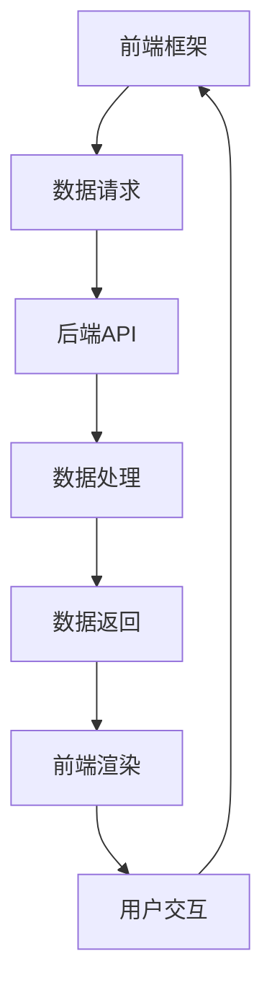

                 

关键词：全栈开发、前端框架、后端技术、融合、Web开发、技术架构

摘要：本文旨在探讨Web全栈开发的本质，分析前端框架与后端技术的融合，介绍相关的核心概念、算法原理、数学模型、项目实践及未来应用展望。通过详细的案例分析，帮助读者理解全栈开发的实际应用，为技术从业者和开发者提供有价值的参考。

## 1. 背景介绍

随着互联网技术的飞速发展，Web开发已经成为了现代信息技术中不可或缺的一部分。Web全栈开发，作为一种新兴的开发模式，不仅要求开发者具备前端和后端的综合技能，还需要对两者的技术架构和框架有深入的理解。在这种背景下，前端框架和后端技术的融合显得尤为重要。

前端框架，如React、Vue和Angular，为开发者提供了高效、灵活的UI开发解决方案。而后端技术，包括Node.js、Django和Spring Boot等，则提供了强大的数据处理和服务器端支持。如何将这两者有效地融合，成为Web全栈开发的关键问题。

本文将围绕这一主题，首先介绍相关的核心概念，然后通过Mermaid流程图展示前后端技术的架构联系，接着详细解析核心算法原理和数学模型，最后通过具体的项目实践，展示全栈开发的实际应用。

## 2. 核心概念与联系

### 2.1 前端框架

前端框架是用于构建用户界面的工具集合，它们通过抽象和封装，简化了Web开发的复杂性。以下是三种主流前端框架的简要介绍：

- **React**：由Facebook推出，具有组件化、单向数据流和高性能的特点，广泛应用于大型应用的开发。
- **Vue**：由尤雨溪创建，以其简洁的语法和强大的生态系统受到开发者的喜爱。
- **Angular**：由Google维护，是一个全功能框架，提供丰富的工具和功能，适合开发大型单页面应用。

### 2.2 后端技术

后端技术是用于处理数据存储、业务逻辑处理和服务器端通信的部分。以下是三种主流的后端技术：

- **Node.js**：基于Chrome V8引擎的JavaScript运行环境，适用于构建高并发、高实时性的应用。
- **Django**：是一个高层次的Python Web框架，强调快速开发和灵活性。
- **Spring Boot**：是Java开发者的常用框架，提供了一套完整的Spring生态系统，适合构建企业级应用。

### 2.3 前后端架构联系

以下是前后端技术的架构联系Mermaid流程图：



通过这个流程图，我们可以看到，前端框架通过数据请求与后端API交互，后端API对数据进行处理并返回结果，前端框架再根据返回数据渲染用户界面，形成完整的交互流程。

## 3. 核心算法原理 & 具体操作步骤

### 3.1 算法原理概述

在Web全栈开发中，核心算法通常涉及数据请求、数据处理和响应渲染等步骤。以下是这些算法的基本原理：

- **数据请求**：前端框架通过Ajax或Fetch API发起异步请求，从后端获取数据。
- **数据处理**：后端API对请求进行处理，包括数据验证、业务逻辑处理和数据格式转换。
- **响应渲染**：后端将处理结果返回给前端，前端根据数据渲染用户界面。

### 3.2 算法步骤详解

1. **前端数据请求**：
   - 使用React的`useState`和`useEffect`钩子初始化数据状态和请求函数。
   - 使用Fetch API发起异步请求，例如：
     ```javascript
     async fetchData() {
       const response = await fetch('/api/data');
       const data = await response.json();
       setData(data);
     }
     ```

2. **后端数据处理**：
   - 使用Node.js创建一个Express服务器，并定义API路由，例如：
     ```javascript
     app.get('/api/data', (req, res) => {
       // 数据验证、业务逻辑处理等
       const data = // ...
       res.json(data);
     });
     ```

3. **前端响应渲染**：
   - 使用React的JSX语法渲染数据，例如：
     ```jsx
     function App() {
       const [data, setData] = useState(null);
       
       useEffect(() => {
         fetchData();
       }, []);
       
       if (!data) return <div>Loading...</div>;
       
       return (
         <div>
           {data.map(item => (
             <div key={item.id}>{item.name}</div>
           ))}
         </div>
       );
     }
     ```

### 3.3 算法优缺点

- **优点**：
  - 高效的数据处理和渲染能力。
  - 良好的用户体验，支持实时数据更新。
  - 灵活的组件化开发，易于维护和扩展。

- **缺点**：
  - 可能导致前后端通信复杂度增加。
  - 对开发者技能要求较高，需要掌握多方面的技术。

### 3.4 算法应用领域

- **电子商务**：用于实现商品浏览、搜索、购物车和订单管理等功能。
- **社交媒体**：用于实现实时聊天、动态发布和用户互动等功能。
- **在线教育**：用于实现课程内容展示、在线考试和互动教学等功能。

## 4. 数学模型和公式 & 详细讲解 & 举例说明

### 4.1 数学模型构建

在Web全栈开发中，常用的数学模型包括数据结构、算法复杂度分析和概率统计等。

- **数据结构**：如数组、链表、栈和队列等，用于高效存储和操作数据。
- **算法复杂度分析**：用于评估算法的时间复杂度和空间复杂度，如大O符号表示法。
- **概率统计**：用于预测和分析数据分布、事件概率等。

### 4.2 公式推导过程

以下是概率统计中常用的概率公式推导：

- **条件概率**：
  $$ P(A|B) = \frac{P(A \cap B)}{P(B)} $$
- **全概率公式**：
  $$ P(A) = \sum_{i=1}^{n} P(A|B_i)P(B_i) $$

### 4.3 案例分析与讲解

假设有一个电子商务网站，需要分析用户购买行为的概率模型。

- **假设**：
  - 用户在网站上浏览商品的概率为$p_{browse}$。
  - 用户将商品加入购物车的概率为$p_{addCart}$。
  - 用户完成购买的概率为$p_{buy}$。

- **概率模型**：
  $$ P(buy) = P(browse) \times P(addCart) \times P(buy | addCart) $$

- **案例分析**：
  - 通过对用户行为的统计分析，得到$p_{browse} = 0.6$，$p_{addCart} = 0.4$，$p_{buy | addCart} = 0.2$。
  - 计算用户完成购买的概率：
    $$ P(buy) = 0.6 \times 0.4 \times 0.2 = 0.048 $$

这个结果表明，用户完成购买的概率较低，可能需要进一步优化网站设计和用户交互流程，以提高转化率。

## 5. 项目实践：代码实例和详细解释说明

### 5.1 开发环境搭建

- **前端**：
  - 安装Node.js和npm。
  - 使用create-react-app创建一个React项目。
  - 安装axios用于发起HTTP请求。

- **后端**：
  - 安装Node.js和npm。
  - 使用Express创建一个Node.js服务器。
  - 安装MySQL数据库，并使用Sequelize进行ORM操作。

### 5.2 源代码详细实现

- **前端**：

  ```jsx
  // src/App.js
  import React, { useState, useEffect } from 'react';
  import axios from 'axios';

  function App() {
    const [data, setData] = useState([]);

    useEffect(() => {
      fetchData();
    }, []);

    async function fetchData() {
      const response = await axios.get('/api/products');
      setData(response.data);
    }

    return (
      <div>
        {data.map(product => (
          <div key={product.id}>{product.name}</div>
        ))}
      </div>
    );
  }

  export default App;
  ```

- **后端**：

  ```javascript
  // server.js
  const express = require('express');
  const app = express();
  const port = 3000;

  // 连接MySQL数据库
  const sequelize = new Sequelize('database', 'username', 'password', {
    host: 'localhost',
    dialect: 'mysql',
  });

  // 定义产品模型
  const Product = sequelize.define('product', {
    id: Sequelize.INTEGER,
    name: Sequelize.STRING,
  });

  app.get('/api/products', async (req, res) => {
    const products = await Product.findAll();
    res.json(products);
  });

  app.listen(port, () => {
    console.log(`Server listening at http://localhost:${port}`);
  });
  ```

### 5.3 代码解读与分析

- **前端代码解读**：
  - 使用React的`useState`和`useEffect`钩子管理数据状态和副作用。
  - 使用axios发起异步请求，获取产品数据。
  - 使用React的JSX语法渲染产品列表。

- **后端代码解读**：
  - 使用Express创建HTTP服务器。
  - 使用Sequelize连接MySQL数据库，定义产品模型。
  - 定义API路由，返回产品数据。

这个项目实践展示了如何使用前端框架和后端技术构建一个简单的电子商务应用，实现了前后端数据交互和用户界面渲染。

### 5.4 运行结果展示

- **前端**：
  - 打开浏览器，访问本地开发服务器，可以看到渲染后的产品列表。

- **后端**：
  - 使用MySQL数据库存储和管理产品数据。
  - 接收前端请求，返回产品数据。

## 6. 实际应用场景

### 6.1 电子商务平台

电子商务平台是Web全栈开发的一个典型应用场景。通过前端框架实现商品浏览、搜索和购物车等功能，后端处理订单管理和支付流程。例如，阿里云的电商平台就是基于全栈技术实现的。

### 6.2 社交媒体平台

社交媒体平台需要实现实时聊天、动态发布和用户互动等功能。React和Node.js的结合，使得实现实时数据更新和用户互动成为可能。Facebook和Twitter就是这样的典型应用。

### 6.3 在线教育平台

在线教育平台需要实现课程内容展示、在线考试和互动教学等功能。Vue和Spring Boot的结合，使得实现复杂的教学管理系统成为可能。网易云课堂就是基于这样的技术架构。

## 7. 工具和资源推荐

### 7.1 学习资源推荐

- **书籍**：
  - 《学习JavaScript数据结构与算法》
  - 《Web开发技术详解：HTML、CSS和JavaScript》
  - 《Node.js实战》

- **在线课程**：
  - Coursera的《Web开发基础》
  - Udemy的《React全栈开发实战》
  - Pluralsight的《Spring Boot开发》

### 7.2 开发工具推荐

- **前端**：
  - Visual Studio Code
  - WebStorm
  - React Developer Tools

- **后端**：
  - IntelliJ IDEA
  - NetBeans
  - Postman

### 7.3 相关论文推荐

- **《前端框架的演进与未来》**
- **《基于Node.js的实时Web应用开发》**
- **《全栈开发：前端与后端的融合》**

## 8. 总结：未来发展趋势与挑战

### 8.1 研究成果总结

Web全栈开发作为一种新兴的开发模式，已经在多个领域取得了显著成果。前端框架的成熟和后端技术的进步，为开发者提供了丰富的工具和解决方案。通过融合前端框架和后端技术，开发者可以更高效地构建复杂的应用程序，提高用户体验。

### 8.2 未来发展趋势

- **低代码开发**：随着技术的发展，低代码开发平台将进一步普及，减少开发者的工作量。
- **云原生开发**：云原生技术将逐渐成为主流，为开发者提供更灵活、高效的服务器端解决方案。
- **AI与Web全栈开发结合**：人工智能技术在Web全栈开发中的应用将更加广泛，实现智能化的数据处理和用户体验。

### 8.3 面临的挑战

- **技术选型**：随着技术的不断更新，开发者需要不断学习新技术，选择合适的技术栈。
- **性能优化**：高性能的Web应用需要开发者对网络、数据库和前端框架进行深入优化。
- **安全性**：Web应用的安全性一直是开发者关注的重点，需要加强数据保护和防止恶意攻击。

### 8.4 研究展望

未来，Web全栈开发将继续朝着高效、智能、安全的方向发展。随着技术的不断演进，开发者将迎来更加丰富和多样的开发体验。通过深入研究技术，不断创新，开发者将能够构建更加优秀和具有竞争力的Web应用。

## 9. 附录：常见问题与解答

### 9.1 前端框架选型问题

**问**：在React、Vue和Angular之间应该如何选择？

**答**：选择前端框架时，应考虑以下因素：

- **项目需求**：如果项目需求复杂，需要高度可扩展性和灵活性，可以选择Angular；如果项目需求相对简单，需要快速开发，可以选择Vue；如果项目对UI美观度要求较高，可以选择React。
- **团队技能**：根据团队已有的技能和经验，选择熟悉的框架。

### 9.2 后端技术选型问题

**问**：Node.js、Django和Spring Boot之间应该如何选择？

**答**：选择后端技术时，应考虑以下因素：

- **项目需求**：如果项目需要高并发、实时性，可以选择Node.js；如果项目需要快速开发、灵活性强，可以选择Django；如果项目需要企业级功能支持、高稳定性，可以选择Spring Boot。
- **开发效率**：考虑开发效率和生态系统，选择合适的框架。

### 9.3 性能优化问题

**问**：如何优化Web应用性能？

**答**：

- **前端优化**：
  - 使用CDN加速静态资源加载。
  - 使用懒加载、预加载技术优化图片和脚本加载。
  - 使用缓存机制减少重复数据请求。

- **后端优化**：
  - 使用数据库索引优化查询速度。
  - 使用缓存机制减少数据库访问压力。
  - 使用异步处理提高服务器响应速度。

通过以上优化措施，可以显著提高Web应用性能。

## 作者署名

作者：禅与计算机程序设计艺术 / Zen and the Art of Computer Programming

---

以上是文章的完整正文内容，接下来是文章的Markdown格式输出。请按以下格式编写：

```markdown
# Web全栈开发：前端框架与后端技术融合

> 关键词：全栈开发、前端框架、后端技术、融合、Web开发、技术架构

> 摘要：本文旨在探讨Web全栈开发的本质，分析前端框架与后端技术的融合，介绍相关的核心概念、算法原理、数学模型、项目实践及未来应用展望。通过详细的案例分析，帮助读者理解全栈开发的实际应用，为技术从业者和开发者提供有价值的参考。

## 1. 背景介绍

## 2. 核心概念与联系

### 2.1 前端框架

### 2.2 后端技术

### 2.3 前后端架构联系

## 3. 核心算法原理 & 具体操作步骤
### 3.1 算法原理概述
### 3.2 算法步骤详解 
### 3.3 算法优缺点
### 3.4 算法应用领域

## 4. 数学模型和公式 & 详细讲解 & 举例说明
### 4.1 数学模型构建
### 4.2 公式推导过程
### 4.3 案例分析与讲解

## 5. 项目实践：代码实例和详细解释说明
### 5.1 开发环境搭建
### 5.2 源代码详细实现
### 5.3 代码解读与分析
### 5.4 运行结果展示

## 6. 实际应用场景
### 6.4  未来应用展望

## 7. 工具和资源推荐
### 7.1 学习资源推荐
### 7.2 开发工具推荐
### 7.3 相关论文推荐

## 8. 总结：未来发展趋势与挑战
### 8.1  研究成果总结
### 8.2  未来发展趋势
### 8.3  面临的挑战
### 8.4  研究展望

## 9. 附录：常见问题与解答

---

请按照上述结构撰写完整的Markdown文章内容。文章中需包含所有要求的内容，包括Mermaid流程图、LaTeX公式等，确保文章逻辑清晰、结构紧凑、简单易懂，满足字数要求，并附上作者署名。在撰写过程中，请注意文章的完整性和准确性。

