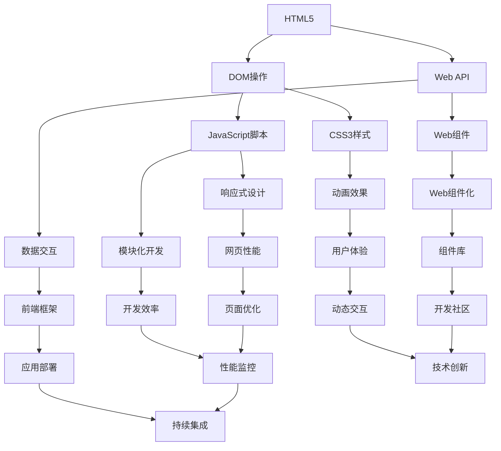

                 

“Web前端技术栈是构建现代网页和Web应用的核心。随着互联网技术的飞速发展，HTML5、CSS3和JavaScript已经成为了Web开发者必备的技术。本文将深入探讨这三项技术的核心概念、原理和应用，旨在帮助读者全面掌握Web前端开发。”

## 关键词
- HTML5
- CSS3
- JavaScript
- Web前端开发
- 网页构建
- 跨平台应用

## 摘要
本文将首先介绍HTML5、CSS3和JavaScript的基础知识，接着详细讲解它们在Web前端开发中的应用。通过本文，读者将了解如何使用这些技术构建功能丰富、响应迅速的Web应用。此外，本文还将探讨未来的发展趋势和面临的挑战。

## 1. 背景介绍

### 1.1 HTML5的诞生

HTML5是互联网技术发展的重要里程碑，它不仅仅是一个简单的标记语言，更是一个完整的Web应用开发框架。HTML5的出现，标志着Web技术从文档展示向Web应用的转变。它提供了丰富的API和功能，使开发者能够更加便捷地构建复杂的Web应用。

### 1.2 CSS3的进化

CSS3是CSS（层叠样式表）的第三个版本，它扩展了CSS的功能，使得网页设计更加多样化和动态化。CSS3引入了大量的新特性，如动画、过渡、阴影、边框等，使得Web页面的视觉效果得到了极大的提升。

### 1.3 JavaScript的崛起

JavaScript是一种轻量级的编程语言，它使得Web页面能够实现交互功能。JavaScript的崛起，标志着Web开发从客户端到服务端的全面升级。如今，JavaScript不仅用于Web前端，还广泛应用于后端开发、移动应用等领域。

## 2. 核心概念与联系

下面是一个使用Mermaid绘制的流程图，展示了HTML5、CSS3和JavaScript之间的关系。



## 3. 核心算法原理 & 具体操作步骤

### 3.1 算法原理概述

Web前端开发中涉及的核心算法主要包括：

- **DOM操作算法**：用于动态修改网页内容。
- **响应式设计算法**：用于根据不同设备尺寸和分辨率调整网页布局。
- **数据交互算法**：用于实现前后端数据传输。
- **网页性能优化算法**：用于提升网页加载速度和用户体验。

### 3.2 算法步骤详解

1. **DOM操作算法**：

   - 获取DOM元素：使用`document.getElementById()`或`document.querySelector()`等方法。
   - 修改DOM元素属性：如`element.style.color = "red"`。
   - 添加事件监听器：使用`element.addEventListener("click", function())`。

2. **响应式设计算法**：

   - 使用CSS3媒体查询（`@media`）定义不同设备尺寸的样式。
   - 使用JavaScript检测设备尺寸，动态调整页面布局。

3. **数据交互算法**：

   - 使用`XMLHttpRequest`或`fetch`API发起HTTP请求。
   - 处理响应数据，如JSON格式。

4. **网页性能优化算法**：

   - 使用懒加载减少页面初始加载时间。
   - 使用CSS精灵减少图片请求次数。

### 3.3 算法优缺点

- **DOM操作算法**：优点是能够动态修改网页内容，缺点是可能会影响网页性能。
- **响应式设计算法**：优点是能够适应不同设备尺寸，缺点是需要编写额外的CSS代码。
- **数据交互算法**：优点是能够实现前后端数据传输，缺点是可能会受到网络延迟影响。
- **网页性能优化算法**：优点是能够提升网页加载速度，缺点是需要开发者具备一定的性能优化知识。

### 3.4 算法应用领域

- **DOM操作算法**：广泛应用于动态网页和Web应用。
- **响应式设计算法**：应用于移动端网页和响应式设计项目。
- **数据交互算法**：应用于前后端分离的Web应用。
- **网页性能优化算法**：应用于所有需要优化性能的Web项目。

## 4. 数学模型和公式 & 详细讲解 & 举例说明

### 4.1 数学模型构建

在Web前端开发中，常见的数学模型包括：

- **线性方程组**：用于求解网页布局问题。
- **离散事件模拟**：用于模拟网页性能优化效果。

### 4.2 公式推导过程

以线性方程组为例，推导网页布局的公式：

$$
\begin{cases}
\text{宽度} = w \times \text{比例因子} \\
\text{高度} = h \times \text{比例因子} \\
\text{对齐方式} = \text{左对齐/居中/右对齐}
\end{cases}
$$

其中，`w`和`h`分别为原始宽度和高，`比例因子`根据不同设备尺寸动态调整。

### 4.3 案例分析与讲解

假设一个网页需要在不同设备尺寸下保持相同的布局，可以使用以下公式进行布局计算：

$$
\text{宽度} = \frac{原始宽度}{设备宽度} \times 设备宽度
$$

$$
\text{高度} = \frac{原始高度}{设备高度} \times 设备高度
$$

例如，原始网页宽度为960像素，高度为540像素，设备宽度为320像素，设备高度为568像素。则布局后的宽度为：

$$
\text{宽度} = \frac{960}{320} \times 320 = 960 \text{像素}
$$

布局后的高度为：

$$
\text{高度} = \frac{540}{568} \times 568 \approx 540 \text{像素}
$$

通过这种方式，网页在不同设备尺寸下都能保持相同的布局。

## 5. 项目实践：代码实例和详细解释说明

### 5.1 开发环境搭建

要开始Web前端开发，你需要安装以下软件：

- **文本编辑器**：如Visual Studio Code、Sublime Text等。
- **浏览器**：如Google Chrome、Firefox等。
- **Node.js**：用于运行JavaScript代码。

### 5.2 源代码详细实现

下面是一个简单的Web前端项目示例，包含HTML5、CSS3和JavaScript代码。

```html
<!-- index.html -->
<!DOCTYPE html>
<html lang="en">
<head>
    <meta charset="UTF-8">
    <meta name="viewport" content="width=device-width, initial-scale=1.0">
    <title>Web前端技术栈示例</title>
    <style>
        body {
            font-family: Arial, sans-serif;
        }
        h1 {
            color: blue;
        }
        p {
            font-size: 16px;
        }
        button {
            background-color: green;
            color: white;
            padding: 10px 20px;
            border: none;
            cursor: pointer;
        }
    </style>
</head>
<body>
    <h1>欢迎来到Web前端技术栈示例</h1>
    <p>这是使用HTML5、CSS3和JavaScript构建的网页。</p>
    <button id="myButton">点击我</button>
    <script>
        document.getElementById("myButton").addEventListener("click", function() {
            alert("按钮被点击了！");
        });
    </script>
</body>
</html>
```

### 5.3 代码解读与分析

- **HTML5代码**：定义了一个简单的网页结构，包括标题、段落和按钮。
- **CSS3代码**：设置网页的样式，如字体、颜色、按钮样式等。
- **JavaScript代码**：为按钮添加点击事件，弹出警告框。

### 5.4 运行结果展示

将上述代码保存为`index.html`文件，使用浏览器打开，你会看到一个包含标题、段落和按钮的网页。点击按钮，会弹出警告框，显示“按钮被点击了！”

## 6. 实际应用场景

### 6.1 在线教育平台

HTML5、CSS3和JavaScript可以用于构建在线教育平台，实现课程展示、视频播放、交互式练习等功能。

### 6.2 社交媒体

社交媒体平台依赖于Web前端技术，实现用户界面交互、数据展示和动态更新等功能。

### 6.3 跨平台应用

使用HTML5、CSS3和JavaScript可以开发跨平台应用，如移动应用、桌面应用等，实现与原生应用相似的功能体验。

## 7. 工具和资源推荐

### 7.1 学习资源推荐

- **MDN Web文档**：涵盖HTML5、CSS3和JavaScript的详细文档和教程。
- **W3Schools在线教程**：适合初学者学习的在线教程。

### 7.2 开发工具推荐

- **Visual Studio Code**：强大的文本编辑器，支持多种编程语言。
- **Git**：版本控制工具，用于管理代码版本。

### 7.3 相关论文推荐

- **《HTML5设计与实践》**：详细介绍了HTML5的核心概念和应用。
- **《CSS3揭秘》**：深入探讨了CSS3的新特性和用法。

## 8. 总结：未来发展趋势与挑战

### 8.1 研究成果总结

HTML5、CSS3和JavaScript在Web前端开发中取得了显著的成果，推动了Web技术的创新和发展。

### 8.2 未来发展趋势

- **Web组件化**：通过定义自定义元素和组件，提高开发效率。
- **前端框架**：如React、Vue等，将在Web开发中发挥更大作用。
- **WebAssembly**：提高Web应用的性能，实现与原生应用相似的性能表现。

### 8.3 面临的挑战

- **性能优化**：如何在保持网页功能丰富的同时，提高网页性能。
- **安全性**：随着Web技术的不断发展，如何确保Web应用的安全性。

### 8.4 研究展望

未来，Web前端技术将继续发展，为开发者提供更多便利和创新。通过不断优化和改进，Web前端技术将更好地满足用户需求，推动Web应用的持续创新。

## 9. 附录：常见问题与解答

### 9.1 HTML5的新特性有哪些？

HTML5引入了许多新特性，如`<canvas>`元素、`<video>`和`<audio>`元素、`<input>`类型的改进、新的表单验证特性等。

### 9.2 CSS3如何实现动画效果？

CSS3提供了`@keyframes`规则和`transition`属性，可以用于实现动画效果。例如，使用`@keyframes`规则可以定义复杂的动画，而使用`transition`属性可以定义简单元素的过渡效果。

### 9.3 JavaScript中的异步编程是什么？

异步编程是一种处理并发任务的编程方式。JavaScript中的异步编程主要通过`setTimeout`函数、`Promise`对象和`async/await`语法实现。

## 结束语

HTML5、CSS3和JavaScript是Web前端开发的核心技术。通过本文的探讨，我们深入了解了这三项技术的核心概念、原理和应用。希望本文能对您的Web前端开发之旅有所帮助。

### 作者署名

作者：禅与计算机程序设计艺术 / Zen and the Art of Computer Programming
```markdown
---
# Web前端技术栈：HTML5、CSS3与JavaScript

> 关键词：HTML5、CSS3、JavaScript、Web前端开发、网页构建、跨平台应用

> 摘要：本文深入探讨HTML5、CSS3和JavaScript在Web前端开发中的应用，旨在帮助读者全面掌握Web前端技术。

## 1. 背景介绍

### 1.1 HTML5的诞生

HTML5是互联网技术发展的重要里程碑，它不仅仅是一个简单的标记语言，更是一个完整的Web应用开发框架。HTML5的出现，标志着Web技术从文档展示向Web应用的转变。它提供了丰富的API和功能，使开发者能够更加便捷地构建复杂的Web应用。

### 1.2 CSS3的进化

CSS3是CSS（层叠样式表）的第三个版本，它扩展了CSS的功能，使得网页设计更加多样化和动态化。CSS3引入了大量的新特性，如动画、过渡、阴影、边框等，使得Web页面的视觉效果得到了极大的提升。

### 1.3 JavaScript的崛起

JavaScript是一种轻量级的编程语言，它使得Web页面能够实现交互功能。JavaScript的崛起，标志着Web开发从客户端到服务端的全面升级。如今，JavaScript不仅用于Web前端，还广泛应用于后端开发、移动应用等领域。

## 2. 核心概念与联系

下面是一个使用Mermaid绘制的流程图，展示了HTML5、CSS3和JavaScript之间的关系。


## 3. 核心算法原理 & 具体操作步骤

### 3.1 算法原理概述

Web前端开发中涉及的核心算法主要包括：

- **DOM操作算法**：用于动态修改网页内容。
- **响应式设计算法**：用于根据不同设备尺寸和分辨率调整网页布局。
- **数据交互算法**：用于实现前后端数据传输。
- **网页性能优化算法**：用于提升网页加载速度和用户体验。

### 3.2 算法步骤详解

1. **DOM操作算法**：

   - 获取DOM元素：使用`document.getElementById()`或`document.querySelector()`等方法。
   - 修改DOM元素属性：如`element.style.color = "red"`。
   - 添加事件监听器：使用`element.addEventListener("click", function())`。

2. **响应式设计算法**：

   - 使用CSS3媒体查询（`@media`）定义不同设备尺寸的样式。
   - 使用JavaScript检测设备尺寸，动态调整页面布局。

3. **数据交互算法**：

   - 使用`XMLHttpRequest`或`fetch`API发起HTTP请求。
   - 处理响应数据，如JSON格式。

4. **网页性能优化算法**：

   - 使用懒加载减少页面初始加载时间。
   - 使用CSS精灵减少图片请求次数。

### 3.3 算法优缺点

- **DOM操作算法**：优点是能够动态修改网页内容，缺点是可能会影响网页性能。
- **响应式设计算法**：优点是能够适应不同设备尺寸，缺点是需要编写额外的CSS代码。
- **数据交互算法**：优点是能够实现前后端数据传输，缺点是可能会受到网络延迟影响。
- **网页性能优化算法**：优点是能够提升网页加载速度，缺点是需要开发者具备一定的性能优化知识。

### 3.4 算法应用领域

- **DOM操作算法**：广泛应用于动态网页和Web应用。
- **响应式设计算法**：应用于移动端网页和响应式设计项目。
- **数据交互算法**：应用于前后端分离的Web应用。
- **网页性能优化算法**：应用于所有需要优化性能的Web项目。

## 4. 数学模型和公式 & 详细讲解 & 举例说明

### 4.1 数学模型构建

在Web前端开发中，常见的数学模型包括：

- **线性方程组**：用于求解网页布局问题。
- **离散事件模拟**：用于模拟网页性能优化效果。

### 4.2 公式推导过程

以线性方程组为例，推导网页布局的公式：

$$
\begin{cases}
\text{宽度} = w \times \text{比例因子} \\
\text{高度} = h \times \text{比例因子} \\
\text{对齐方式} = \text{左对齐/居中/右对齐}
\end{cases}
$$

其中，`w`和`h`分别为原始宽度和高，`比例因子`根据不同设备尺寸动态调整。

### 4.3 案例分析与讲解

假设一个网页需要在不同设备尺寸下保持相同的布局，可以使用以下公式进行布局计算：

$$
\text{宽度} = \frac{原始宽度}{设备宽度} \times 设备宽度
$$

$$
\text{高度} = \frac{原始高度}{设备高度} \times 设备高度
$$

例如，原始网页宽度为960像素，高度为540像素，设备宽度为320像素，设备高度为568像素。则布局后的宽度为：

$$
\text{宽度} = \frac{960}{320} \times 320 = 960 \text{像素}
$$

布局后的高度为：

$$
\text{高度} = \frac{540}{568} \times 568 \approx 540 \text{像素}
$$

通过这种方式，网页在不同设备尺寸下都能保持相同的布局。

## 5. 项目实践：代码实例和详细解释说明

### 5.1 开发环境搭建

要开始Web前端开发，你需要安装以下软件：

- **文本编辑器**：如Visual Studio Code、Sublime Text等。
- **浏览器**：如Google Chrome、Firefox等。
- **Node.js**：用于运行JavaScript代码。

### 5.2 源代码详细实现

下面是一个简单的Web前端项目示例，包含HTML5、CSS3和JavaScript代码。

```html
<!-- index.html -->
<!DOCTYPE html>
<html lang="en">
<head>
    <meta charset="UTF-8">
    <meta name="viewport" content="width=device-width, initial-scale=1.0">
    <title>Web前端技术栈示例</title>
    <style>
        body {
            font-family: Arial, sans-serif;
        }
        h1 {
            color: blue;
        }
        p {
            font-size: 16px;
        }
        button {
            background-color: green;
            color: white;
            padding: 10px 20px;
            border: none;
            cursor: pointer;
        }
    </style>
</head>
<body>
    <h1>欢迎来到Web前端技术栈示例</h1>
    <p>这是使用HTML5、CSS3和JavaScript构建的网页。</p>
    <button id="myButton">点击我</button>
    <script>
        document.getElementById("myButton").addEventListener("click", function() {
            alert("按钮被点击了！");
        });
    </script>
</body>
</html>
```

### 5.3 代码解读与分析

- **HTML5代码**：定义了一个简单的网页结构，包括标题、段落和按钮。
- **CSS3代码**：设置网页的样式，如字体、颜色、按钮样式等。
- **JavaScript代码**：为按钮添加点击事件，弹出警告框。

### 5.4 运行结果展示

将上述代码保存为`index.html`文件，使用浏览器打开，你会看到一个包含标题、段落和按钮的网页。点击按钮，会弹出警告框，显示“按钮被点击了！”

## 6. 实际应用场景

### 6.1 在线教育平台

HTML5、CSS3和JavaScript可以用于构建在线教育平台，实现课程展示、视频播放、交互式练习等功能。

### 6.2 社交媒体

社交媒体平台依赖于Web前端技术，实现用户界面交互、数据展示和动态更新等功能。

### 6.3 跨平台应用

使用HTML5、CSS3和JavaScript可以开发跨平台应用，如移动应用、桌面应用等，实现与原生应用相似的功能体验。

## 7. 工具和资源推荐

### 7.1 学习资源推荐

- **MDN Web文档**：涵盖HTML5、CSS3和JavaScript的详细文档和教程。
- **W3Schools在线教程**：适合初学者学习的在线教程。

### 7.2 开发工具推荐

- **Visual Studio Code**：强大的文本编辑器，支持多种编程语言。
- **Git**：版本控制工具，用于管理代码版本。

### 7.3 相关论文推荐

- **《HTML5设计与实践》**：详细介绍了HTML5的核心概念和应用。
- **《CSS3揭秘》**：深入探讨了CSS3的新特性和用法。

## 8. 总结：未来发展趋势与挑战

### 8.1 研究成果总结

HTML5、CSS3和JavaScript在Web前端开发中取得了显著的成果，推动了Web技术的创新和发展。

### 8.2 未来发展趋势

- **Web组件化**：通过定义自定义元素和组件，提高开发效率。
- **前端框架**：如React、Vue等，将在Web开发中发挥更大作用。
- **WebAssembly**：提高Web应用的性能，实现与原生应用相似的性能表现。

### 8.3 面临的挑战

- **性能优化**：如何在保持网页功能丰富的同时，提高网页性能。
- **安全性**：随着Web技术的不断发展，如何确保Web应用的安全性。

### 8.4 研究展望

未来，Web前端技术将继续发展，为开发者提供更多便利和创新。通过不断优化和改进，Web前端技术将更好地满足用户需求，推动Web应用的持续创新。

## 9. 附录：常见问题与解答

### 9.1 HTML5的新特性有哪些？

HTML5引入了许多新特性，如`<canvas>`元素、`<video>`和`<audio>`元素、`<input>`类型的改进、新的表单验证特性等。

### 9.2 CSS3如何实现动画效果？

CSS3提供了`@keyframes`规则和`transition`属性，可以用于实现动画效果。例如，使用`@keyframes`规则可以定义复杂的动画，而使用`transition`属性可以定义简单元素的过渡效果。

### 9.3 JavaScript中的异步编程是什么？

异步编程是一种处理并发任务的编程方式。JavaScript中的异步编程主要通过`setTimeout`函数、`Promise`对象和`async/await`语法实现。

## 结束语

HTML5、CSS3和JavaScript是Web前端开发的核心技术。通过本文的探讨，我们深入了解了这三项技术的核心概念、原理和应用。希望本文能对您的Web前端开发之旅有所帮助。

### 作者署名

作者：禅与计算机程序设计艺术 / Zen and the Art of Computer Programming
```

