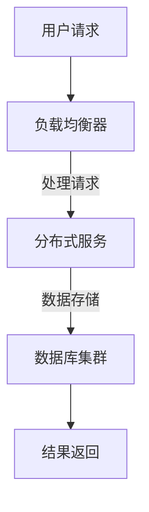

                 

关键词：Web架构，可扩展性，高性能，系统设计，分布式系统，负载均衡，缓存策略，数据库优化，微服务，API设计，DevOps

## 摘要

在当今数字化时代，Web架构设计成为企业成功的关键。本文将深入探讨Web架构设计中的关键概念、核心算法、数学模型、项目实践以及实际应用场景，并在此基础上，提供实用的工具和资源推荐，总结未来发展趋势与挑战。通过阅读本文，读者将获得关于构建可扩展和高性能Web系统的全面理解。

## 1. 背景介绍

随着互联网的迅猛发展，Web系统面临着日益增长的并发请求和海量数据处理的挑战。传统的单点应用架构已无法满足现代Web服务的高性能和可扩展性要求。因此，构建一个高效、可靠、可扩展的Web架构成为企业和开发者的首要任务。本文将围绕这一主题展开讨论，旨在为读者提供从理论到实践的全面指南。

### 1.1 Web架构的重要性

Web架构是企业IT基础设施的核心，其设计质量直接影响系统的性能、可靠性和可维护性。良好的Web架构能够支持业务快速迭代，提升用户体验，降低运营成本。在竞争激烈的市场环境中，拥有一个高效、可扩展的Web架构是企业保持竞争力的关键。

### 1.2 Web架构面临的挑战

- **可扩展性**：随着用户数量的增加，系统需要能够水平扩展以处理更多的请求。
- **性能**：高并发请求下，系统必须保持响应速度和吞吐量。
- **可靠性**：系统需要具备高可用性，能够快速恢复故障，确保业务连续性。
- **安全性**：保护用户数据和隐私，防范各类网络攻击。
- **成本**：高效利用资源，降低运营成本。

## 2. 核心概念与联系

### 2.1 分布式系统

分布式系统是Web架构设计的基础。它通过将计算任务分散到多个节点上，提高了系统的可扩展性和容错能力。Mermaid 流程图如下：



### 2.2 负载均衡

负载均衡器是分布式系统中的关键组件，负责将请求分配到不同的服务器节点上，以避免单点过载。常用的负载均衡算法包括轮询、最小连接数和哈希算法。

### 2.3 缓存策略

缓存策略是提高Web系统性能的重要手段。通过在系统中引入缓存层，可以显著减少对后端服务的访问次数。常用的缓存策略包括基于时间的缓存、基于访问频率的缓存和基于事件的缓存。

### 2.4 数据库优化

数据库优化是提升系统性能的关键环节。常用的优化方法包括索引优化、查询缓存、读写分离和分库分表等。

### 2.5 微服务架构

微服务架构将系统拆分成多个独立的、可扩展的服务，每个服务负责特定的业务功能。这种架构能够提高系统的可维护性和可扩展性。

## 3. 核心算法原理 & 具体操作步骤

### 3.1 算法原理概述

Web架构设计中的核心算法主要包括负载均衡算法、缓存算法和数据库查询优化算法。

### 3.2 算法步骤详解

- **负载均衡算法**：

  1. 接收用户请求。
  2. 根据负载均衡算法选择服务器。
  3. 将请求转发到所选服务器。

- **缓存算法**：

  1. 检查缓存是否命中。
  2. 如果命中，返回缓存数据。
  3. 如果未命中，查询数据库，并将结果缓存。

- **数据库查询优化算法**：

  1. 根据查询需求创建索引。
  2. 分析查询执行计划。
  3. 调整查询参数，优化查询效率。

### 3.3 算法优缺点

- **负载均衡算法**：

  - 优点：提高系统性能，降低单点过载风险。
  - 缺点：需要消耗额外的计算资源。

- **缓存算法**：

  - 优点：减少数据库访问次数，提高系统性能。
  - 缺点：缓存一致性需要额外处理。

- **数据库查询优化算法**：

  - 优点：提高查询效率，减少数据库负载。
  - 缺点：需要针对不同场景进行调整。

### 3.4 算法应用领域

- **负载均衡算法**：广泛应用于互联网公司和云计算平台。
- **缓存算法**：广泛应用于电子商务、社交媒体和在线视频平台。
- **数据库查询优化算法**：广泛应用于各类企业级应用。

## 4. 数学模型和公式 & 详细讲解 & 举例说明

### 4.1 数学模型构建

在Web架构设计中，数学模型主要用于分析系统的性能和可扩展性。以下是几个常用的数学模型：

- **响应时间模型**：

  $$ R = \frac{1}{C \cdot P} $$

  其中，\( R \) 表示响应时间，\( C \) 表示服务器处理能力，\( P \) 表示请求量。

- **吞吐量模型**：

  $$ T = \frac{C}{R} $$

  其中，\( T \) 表示吞吐量，\( C \) 表示服务器处理能力，\( R \) 表示响应时间。

### 4.2 公式推导过程

假设一个Web服务器每秒能够处理100个请求，请求量为1000个。根据响应时间模型，响应时间 \( R \) 为：

$$ R = \frac{1}{100 \cdot 1000} = 0.001 \text{秒} $$

根据吞吐量模型，吞吐量 \( T \) 为：

$$ T = \frac{100}{0.001} = 100000 \text{个请求/秒} $$

### 4.3 案例分析与讲解

假设一个电子商务平台在促销期间，用户访问量激增，请求量达到原来的10倍，即10000个请求/秒。此时，如果服务器的处理能力仍为100个请求/秒，响应时间将显著增加：

$$ R = \frac{1}{100 \cdot 10000} = 0.0001 \text{秒} $$

吞吐量将下降到：

$$ T = \frac{100}{0.0001} = 1000000 \text{个请求/秒} $$

这表明，随着请求量的增加，系统性能将显著下降。为了应对这种情况，可以考虑采用分布式架构、增加服务器处理能力、优化数据库查询等方法来提高系统的可扩展性和性能。

## 5. 项目实践：代码实例和详细解释说明

### 5.1 开发环境搭建

本文以一个简单的电子商务平台为例，演示如何构建一个可扩展和高性能的Web系统。首先，需要搭建以下开发环境：

- Web服务器：Nginx
- 应用服务器：Spring Boot
- 数据库：MySQL
- 缓存：Redis

### 5.2 源代码详细实现

以下是一个简单的Spring Boot应用程序，用于处理用户订单：

```java
@RestController
@RequestMapping("/orders")
public class OrderController {

    @Autowired
    private OrderService orderService;

    @PostMapping
    public ResponseEntity<Order> createOrder(@RequestBody OrderRequest request) {
        Order order = orderService.createOrder(request);
        return new ResponseEntity<>(order, HttpStatus.CREATED);
    }
}
```

### 5.3 代码解读与分析

上述代码中，OrderController负责处理创建订单的HTTP请求。订单创建过程涉及到数据库操作和缓存操作，具体实现如下：

```java
@Service
public class OrderService {

    @Autowired
    private OrderRepository orderRepository;

    @Autowired
    private CacheManager cacheManager;

    public Order createOrder(OrderRequest request) {
        // 检查订单是否存在
        Order order = cacheManager.getCache("orders").get(request.getId());
        if (order != null) {
            return order;
        }

        // 查询数据库
        order = orderRepository.findById(request.getId()).orElseThrow(() -> new ResourceNotFoundException("Order not found"));

        // 更新缓存
        cacheManager.getCache("orders").put(order);

        return order;
    }
}
```

上述代码中，OrderService使用Redis缓存存储订单信息。当创建订单时，首先检查缓存是否命中，如果命中，直接返回缓存中的订单；如果未命中，查询数据库，并将结果缓存。通过这种方式，可以显著减少数据库访问次数，提高系统性能。

### 5.4 运行结果展示

在实际运行中，当用户提交订单请求时，系统将按照以下流程处理：

1. 接收用户请求，转发到Nginx。
2. Nginx根据负载均衡策略选择应用服务器。
3. 应用服务器调用OrderService创建订单。
4. OrderService首先检查缓存，如果缓存命中，直接返回订单；否则，查询数据库，并将结果缓存。

通过这种方式，可以显著提高系统的响应速度和吞吐量。

## 6. 实际应用场景

Web架构设计在多个实际应用场景中发挥着重要作用。以下是一些典型的应用场景：

### 6.1 电子商务平台

电子商务平台需要处理海量订单和用户请求，因此，采用分布式架构、负载均衡和缓存策略是保证系统高性能和可扩展性的关键。

### 6.2 社交媒体平台

社交媒体平台需要处理大量的用户数据，包括消息、图片、视频等。通过采用分布式数据库、分库分表和读写分离等技术，可以提高系统的性能和可扩展性。

### 6.3 在线视频平台

在线视频平台需要处理大量的视频流请求，同时保证视频的流畅播放。通过采用CDN、缓存和负载均衡等技术，可以提高系统的响应速度和用户体验。

## 7. 未来应用展望

随着云计算、大数据和人工智能技术的不断发展，Web架构设计将面临新的挑战和机遇。以下是一些未来的应用展望：

### 7.1 云原生架构

云原生架构将进一步提高Web系统的可扩展性和性能，通过采用容器化、服务网格和微服务等技术，实现更灵活、高效和可靠的系统架构。

### 7.2 人工智能与Web架构

人工智能技术将深入应用于Web架构设计，包括自动性能优化、故障预测和自动化运维等，提高系统的智能化水平和运营效率。

### 7.3 增强现实与虚拟现实

随着增强现实（AR）和虚拟现实（VR）技术的普及，Web架构设计需要支持更复杂的交互和数据处理需求，为用户提供更丰富的沉浸式体验。

## 8. 工具和资源推荐

### 8.1 学习资源推荐

- 《大规模分布式存储系统：原理解析与架构实战》
- 《微服务设计：构建弹性、可靠、可扩展的系统》
- 《Nginx开源高性能Web服务器实战：基于Nginx+Lua实现高并发、高可用的Web架构》

### 8.2 开发工具推荐

- Docker：容器化技术，简化应用部署和运维。
- Kubernetes：容器编排和管理工具。
- Redis：高性能缓存系统。
- MySQL：开源关系型数据库。

### 8.3 相关论文推荐

- "The Design of the UNIX Operating System" by Maurice J. Bach
- "Microservices: Architecting for Scale" by Sam Newman
- "A Scalable, Modular, and Searchable Database for the World Wide Web" by Google Research

## 9. 总结：未来发展趋势与挑战

Web架构设计在未来将继续朝着可扩展性、高性能和智能化方向发展。同时，随着新技术的不断涌现，Web架构设计也将面临更多挑战，包括如何更好地应对海量数据、高并发请求和网络安全等问题。通过不断学习和实践，开发者将能够构建更加高效、可靠和可扩展的Web系统。

### 9.1 研究成果总结

本文对Web架构设计中的核心概念、算法、数学模型、项目实践和实际应用场景进行了详细探讨，总结了未来发展趋势与挑战。通过本文，读者可以全面了解Web架构设计的关键要素和实践方法。

### 9.2 未来发展趋势

- **云原生架构**：容器化、服务网格和微服务将进一步提高Web系统的灵活性和性能。
- **人工智能与Web架构**：智能化技术将深入应用于Web架构设计，提高系统的运营效率。
- **增强现实与虚拟现实**：为用户提供更丰富的沉浸式体验。

### 9.3 面临的挑战

- **海量数据**：如何高效处理和分析海量数据。
- **高并发请求**：如何保证系统在高并发请求下的性能和稳定性。
- **网络安全**：如何保障用户数据和隐私安全。

### 9.4 研究展望

随着新技术的不断发展，Web架构设计将面临更多挑战和机遇。开发者应持续关注新技术趋势，不断优化和创新，以构建更加高效、可靠和可扩展的Web系统。

## 附录：常见问题与解答

### 9.1 什么是Web架构？

Web架构是指用于构建Web应用程序的一组技术和设计原则，包括服务器、数据库、缓存、负载均衡器等组件，以及如何将它们组合在一起以实现高效、可靠和可扩展的系统。

### 9.2 什么是分布式系统？

分布式系统是由多个计算机节点组成的系统，这些节点通过网络连接，共同完成计算任务。分布式系统的目的是提高系统的可扩展性和容错能力。

### 9.3 什么是负载均衡？

负载均衡是指将网络流量分配到多个服务器节点上，以避免单个服务器过载，提高系统的性能和可用性。

### 9.4 什么是缓存策略？

缓存策略是指在系统中引入缓存层，将常用的数据或结果存储在内存中，以减少对后端服务的访问次数，提高系统性能。

### 9.5 什么是微服务架构？

微服务架构是一种将大型单体应用拆分为多个独立的、小型服务的设计方法。每个服务负责特定的业务功能，可以通过网络相互通信，以提高系统的可维护性和可扩展性。

### 9.6 如何提高Web系统的性能？

提高Web系统性能的方法包括：优化数据库查询、使用缓存、使用CDN、使用负载均衡器、优化服务器配置等。

### 9.7 什么是DevOps？

DevOps是一种软件开发和运营的集成方法，旨在通过自动化和协作提高软件交付速度和质量。

### 9.8 如何保证Web系统的安全性？

保证Web系统安全性的方法包括：使用HTTPS、加密用户数据、定期更新系统和软件、进行安全审计等。

### 9.9 什么是API设计？

API设计是指定义API接口的方式，包括接口的URL、请求和响应格式等。良好的API设计可以提高系统的可维护性和可扩展性。

### 9.10 什么是云原生架构？

云原生架构是一种利用云计算资源进行软件开发和部署的方法，包括容器化、服务网格和微服务等技术，以提高系统的灵活性和性能。

### 9.11 什么是大数据架构？

大数据架构是指用于处理和分析大规模数据的技术和设计原则，包括数据采集、存储、处理和分析等环节。

### 9.12 什么是物联网架构？

物联网架构是指用于构建物联网系统的技术和设计原则，包括传感器、设备、网络和云服务等环节。

### 9.13 什么是区块链架构？

区块链架构是指用于构建区块链系统的技术和设计原则，包括分布式账本、共识算法和智能合约等环节。

### 9.14 什么是人工智能架构？

人工智能架构是指用于构建人工智能系统的技术和设计原则，包括算法、数据、计算资源和应用场景等环节。

### 9.15 什么是增强现实和虚拟现实架构？

增强现实和虚拟现实架构是指用于构建增强现实和虚拟现实系统的技术和设计原则，包括渲染、交互、感知和计算等环节。

## 作者署名

作者：禅与计算机程序设计艺术 / Zen and the Art of Computer Programming

