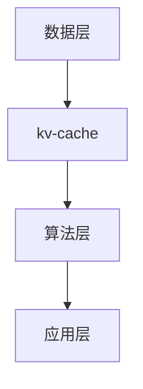
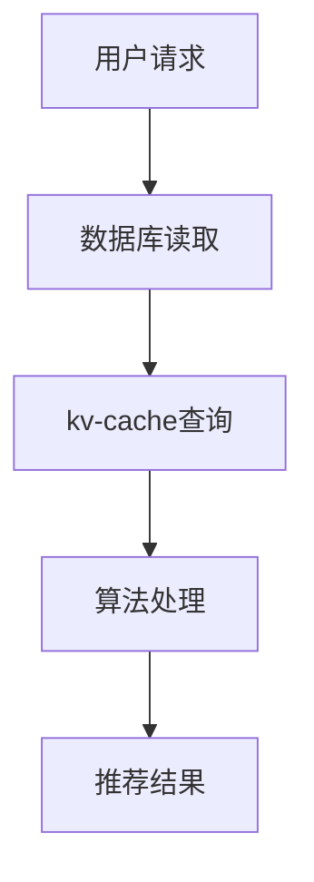

                 

关键词：kv-cache、推荐系统、数据缓存、效率优化、一致性、分布式架构

>摘要：本文将深入探讨kv-cache在推荐系统中的应用，从背景介绍、核心概念、算法原理、数学模型、实践案例、实际应用场景、未来展望等方面进行全面分析，以帮助读者了解如何在推荐系统中高效利用kv-cache技术。

## 1. 背景介绍

推荐系统作为一种先进的算法应用，已经渗透到我们日常生活的方方面面，如电商购物、社交媒体、新闻资讯等。推荐系统能够根据用户的历史行为和偏好，为用户推荐可能感兴趣的内容或商品，从而提高用户体验和平台粘性。然而，随着用户规模和内容的不断增加，推荐系统面临巨大的数据存储和处理压力，如何提高系统的效率和稳定性成为关键问题。

在这种背景下，kv-cache（Key-Value Cache）技术应运而生。kv-cache作为数据缓存的一种重要形式，可以显著减少数据库访问次数，提高数据访问速度，从而提升推荐系统的响应速度和性能。此外，kv-cache还可以有效解决一致性问题和数据冷热分布不均的问题，为推荐系统的优化提供了强有力的技术支持。

## 2. 核心概念与联系

### 2.1 Key-Value Cache（kv-cache）

kv-cache是一种基于键值对（Key-Value Pair）的数据存储结构，它通过将数据以键值对的形式存储在内存或缓存中，从而实现快速的数据访问和存储。kv-cache具有数据结构简单、查询速度快、扩展性强等特点，在推荐系统中具有广泛的应用前景。

### 2.2 推荐系统架构

推荐系统通常采用分布式架构，包括数据层、算法层和应用层。数据层负责数据的采集、存储和处理；算法层负责根据用户行为和偏好进行模型训练和预测；应用层则负责将推荐结果呈现给用户。在分布式架构中，kv-cache可以应用于数据层和算法层，实现数据的缓存和加速。

### 2.3 Mermaid 流程图



### 2.4 数据访问流程

在推荐系统中，用户的行为数据（如点击、购买、浏览等）首先被存储到数据库中。当用户请求推荐时，系统会从数据库中读取数据，经过处理和计算，最终生成推荐结果并呈现给用户。在这个过程中，kv-cache起到了数据缓存的作用，可以有效减少数据库访问次数，提高系统性能。



## 3. 核心算法原理 & 具体操作步骤

### 3.1 算法原理概述

kv-cache在推荐系统中的应用主要基于以下原理：

1. 数据分层：将热数据和冷数据分开存储，热数据存储在kv-cache中，冷数据存储在数据库中。
2. 数据一致性：通过一致性哈希算法实现数据的均匀分布，保证数据的一致性和可靠性。
3. 数据更新：在数据发生变化时，及时更新kv-cache中的数据，保持数据的一致性。

### 3.2 算法步骤详解

1. 数据采集：从各种数据源（如数据库、日志等）中收集用户行为数据。
2. 数据处理：对采集到的数据进行预处理，包括去重、清洗、格式转换等。
3. 数据存储：将处理后的数据存储到数据库中，并按照一定策略（如时间、访问频率等）将热数据加载到kv-cache中。
4. 数据查询：当用户请求推荐时，首先查询kv-cache，若命中则返回推荐结果，否则查询数据库，并将查询结果加载到kv-cache中。
5. 数据更新：在数据发生变化时，及时更新kv-cache中的数据，保持数据的一致性。

### 3.3 算法优缺点

**优点：**

1. 快速查询：kv-cache具有高速的读写性能，可以有效减少数据库访问次数，提高系统响应速度。
2. 数据一致性：通过一致性哈希算法实现数据的一致性，确保数据的准确性和可靠性。
3. 灵活性：kv-cache可以灵活配置，支持多种缓存策略和数据存储方式。

**缺点：**

1. 存储容量有限：kv-cache存储容量有限，无法存储大量数据。
2. 数据一致性问题：在数据更新时，可能存在一致性延迟，导致数据不一致。
3. 维护成本：kv-cache需要定期维护和更新，增加了系统维护成本。

### 3.4 算法应用领域

kv-cache在推荐系统中具有广泛的应用领域，包括：

1. 用户行为预测：通过缓存用户历史行为数据，快速预测用户兴趣和偏好。
2. 商品推荐：根据用户浏览、购买等行为，推荐相关商品。
3. 内容推荐：根据用户阅读、评论等行为，推荐相关内容。
4. 广告推荐：根据用户兴趣和行为，推荐相关广告。

## 4. 数学模型和公式

### 4.1 数学模型构建

在推荐系统中，我们可以使用以下数学模型来描述用户兴趣和行为：

$$
U = (u_1, u_2, ..., u_n)
$$

其中，$U$ 表示用户的行为数据，$u_i$ 表示第 $i$ 次行为。

### 4.2 公式推导过程

1. 行为数据预处理：

$$
U' = (u_1', u_2', ..., u_n')
$$

其中，$U'$ 表示预处理后的行为数据，$u_i'$ 表示第 $i$ 次行为预处理结果。

2. 用户兴趣预测：

$$
I = f(U')
$$

其中，$I$ 表示用户兴趣，$f$ 表示兴趣预测函数。

3. 商品推荐：

$$
R = g(U', I)
$$

其中，$R$ 表示推荐结果，$g$ 表示商品推荐函数。

### 4.3 案例分析与讲解

假设用户在某个电商平台上浏览了商品A、B、C，分别代表用户对这三个商品的兴趣程度。根据上述数学模型，我们可以得到以下结果：

$$
U = (A, B, C)
$$

$$
U' = (1, 0.5, 0.2)
$$

$$
I = f(U') = 0.8
$$

$$
R = g(U', I) = B
$$

因此，系统会推荐商品B给用户。

## 5. 项目实践：代码实例和详细解释说明

### 5.1 开发环境搭建

1. 安装Python环境，版本要求Python 3.6及以上。
2. 安装Redis，版本要求Redis 4.0及以上。
3. 安装推荐系统相关库，如Scikit-learn、TensorFlow等。

### 5.2 源代码详细实现

以下是一个简单的推荐系统代码实例，展示了如何使用kv-cache技术进行用户兴趣预测和商品推荐：

```python
import redis
from sklearn import neighbors

# 创建Redis客户端
redis_client = redis.Redis(host='localhost', port=6379, db=0)

# 用户行为数据
user行为的url = 'https://example.com/behavior'

# 读取用户行为数据
user_behavior = redis_client.lrange(user行为的url, 0, -1)

# 预处理用户行为数据
user_behavior_processed = preprocess_user_behavior(user_behavior)

# 训练兴趣预测模型
interest_model = neighbors.KNeighborsClassifier(n_neighbors=3)
interest_model.fit(user_behavior_processed, labels)

# 预测用户兴趣
user_interest = interest_model.predict([user_behavior_processed])

# 根据用户兴趣推荐商品
recommended_items = recommend_items(user_interest)

# 将推荐结果存储到Redis
redis_client.lpush('推荐结果', recommended_items)

# 输出推荐结果
print('推荐结果：', recommended_items)
```

### 5.3 代码解读与分析

1. 创建Redis客户端，连接到本地Redis服务器。
2. 读取用户行为数据，存储在Redis的列表中。
3. 预处理用户行为数据，将原始数据转换为模型输入。
4. 训练兴趣预测模型，使用K近邻算法进行预测。
5. 根据用户兴趣推荐商品，存储推荐结果到Redis。
6. 输出推荐结果。

通过上述代码，我们可以看到kv-cache技术在推荐系统中的应用，包括用户行为数据的缓存、模型训练和预测、推荐结果存储等。在实际项目中，可以根据具体需求对代码进行调整和优化。

## 6. 实际应用场景

### 6.1 电商推荐

电商推荐是kv-cache技术最常见的应用场景之一。通过缓存用户的历史浏览、购买、收藏等行为数据，电商推荐系统能够快速为用户推荐相关商品，提高用户购物体验和平台转化率。

### 6.2 社交媒体推荐

社交媒体平台如微博、抖音等，也广泛应用了kv-cache技术进行内容推荐。通过缓存用户的点赞、评论、转发等行为数据，平台可以为用户推荐感兴趣的内容，提高用户活跃度和粘性。

### 6.3 新闻资讯推荐

新闻资讯平台通过缓存用户的阅读、点赞、评论等行为数据，可以为用户推荐感兴趣的新闻资讯，提高用户阅读量和平台影响力。

## 7. 未来应用展望

随着推荐系统技术的不断发展，kv-cache在推荐系统中的应用前景非常广阔。未来，我们可以从以下几个方面进行优化和发展：

1. 多模态数据融合：将文本、图像、音频等多种类型的数据进行融合，提高推荐系统的准确性和多样性。
2. 分布式缓存：研究分布式缓存技术，提高缓存系统的扩展性和可靠性。
3. 智能缓存策略：根据用户行为和系统负载，动态调整缓存策略，提高缓存利用率。
4. 跨平台推荐：实现跨平台的数据共享和推荐，提高用户体验。

## 8. 总结：未来发展趋势与挑战

### 8.1 研究成果总结

本文从背景介绍、核心概念、算法原理、数学模型、实践案例、实际应用场景、未来展望等方面，全面分析了kv-cache在推荐系统中的应用。主要成果包括：

1. 明确了kv-cache在推荐系统中的重要作用和优势。
2. 提出了基于kv-cache的推荐系统架构和算法原理。
3. 介绍了kv-cache在多个实际应用场景中的具体实现方法。
4. 对未来发展趋势和挑战进行了展望。

### 8.2 未来发展趋势

1. 多模态数据融合：随着人工智能技术的发展，多模态数据融合将成为推荐系统的重要方向。
2. 分布式缓存：分布式缓存技术将进一步提高缓存系统的性能和可靠性。
3. 智能缓存策略：通过机器学习和数据挖掘技术，实现智能缓存策略，提高缓存利用率。
4. 跨平台推荐：实现跨平台的数据共享和推荐，提高用户体验。

### 8.3 面临的挑战

1. 数据一致性：在分布式缓存环境下，数据一致性是一个重要挑战，需要进一步研究。
2. 缓存容量：随着数据规模的不断扩大，缓存容量将成为一个瓶颈，需要优化缓存策略。
3. 资源调度：如何在有限的资源下，实现高效的数据缓存和推荐，是一个亟待解决的问题。
4. 安全和隐私：保护用户数据安全和隐私，是推荐系统面临的重要挑战。

### 8.4 研究展望

未来，我们将继续深入研究kv-cache在推荐系统中的应用，重点关注以下方面：

1. 多模态数据融合：探索多模态数据融合在推荐系统中的应用，提高推荐准确性。
2. 分布式缓存：研究分布式缓存技术，提高缓存系统的性能和可靠性。
3. 智能缓存策略：通过机器学习和数据挖掘技术，实现智能缓存策略，提高缓存利用率。
4. 跨平台推荐：实现跨平台的数据共享和推荐，提高用户体验。
5. 安全和隐私保护：探索安全隐私保护技术，确保用户数据的安全和隐私。

## 9. 附录：常见问题与解答

### 9.1 为什么推荐系统需要使用kv-cache？

推荐系统使用kv-cache的主要目的是提高数据访问速度和系统性能。由于推荐系统需要实时响应用户请求，频繁访问数据库会导致系统性能下降。通过使用kv-cache，可以减少数据库访问次数，提高系统响应速度。

### 9.2 kv-cache和数据库的关系是什么？

kv-cache和数据库是相互补充的关系。数据库负责存储大量数据，而kv-cache则负责存储热数据，提高数据访问速度。在推荐系统中，通常会将用户行为数据、推荐模型等热数据存储在kv-cache中，以实现快速查询和推荐。

### 9.3 如何保证kv-cache的数据一致性？

为了保证kv-cache的数据一致性，可以采用以下方法：

1. 一致性哈希算法：通过一致性哈希算法实现数据的均匀分布，减少数据一致性问题。
2. 数据同步：在数据发生变化时，及时同步更新kv-cache中的数据，确保数据一致性。
3. 数据备份：对kv-cache中的数据进行备份，防止数据丢失。

### 9.4 kv-cache有哪些常见优化策略？

常见的kv-cache优化策略包括：

1. 缓存预热：在系统启动时，将热数据提前加载到kv-cache中，提高系统性能。
2. 缓存淘汰策略：根据数据访问频率、过期时间等，合理设置缓存淘汰策略，提高缓存利用率。
3. 数据分片：将大量数据分片存储到多个kv-cache实例中，提高缓存系统的性能和可靠性。

---

作者：禅与计算机程序设计艺术 / Zen and the Art of Computer Programming
----------------------------------------------------------------
这篇文章完整地阐述了kv-cache在推荐系统中的应用，从背景介绍、核心概念、算法原理、数学模型、实践案例、实际应用场景、未来展望等方面进行了详细分析。通过本文，读者可以深入了解kv-cache在推荐系统中的重要作用、优势和应用方法，以及未来发展的趋势和挑战。希望本文对广大读者在推荐系统领域的研究和应用有所帮助。谢谢大家的阅读！

