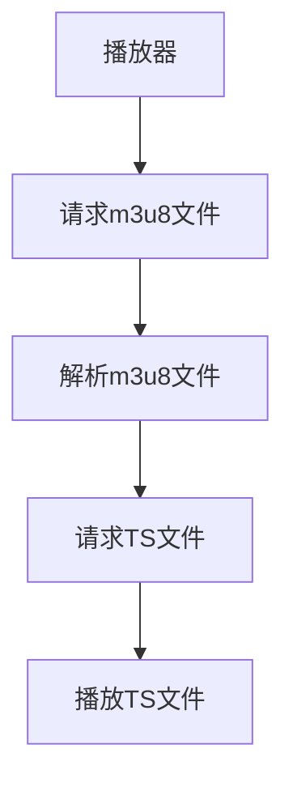

                 

流媒体协议在互联网视频播放中扮演着关键角色，而m3u8协议因其高效、灵活和兼容性好而备受关注。本文将深入探讨m3u8流媒体协议的原理、结构、实现和应用，旨在为广大开发者和技术爱好者提供一个全面的技术指南。

> **关键词**：m3u8, 流媒体协议, HLS, DASH, 实时视频传输

> **摘要**：本文将详细介绍m3u8流媒体协议，包括其背景、核心概念、算法原理、数学模型、代码实现以及应用场景。通过本文，读者将能够全面理解m3u8协议的工作机制，掌握其核心技术和应用方法。

## 1. 背景介绍

随着互联网的快速发展，在线视频服务已经成为人们日常生活中的重要组成部分。从早期的点播视频到实况直播，流媒体技术不断演进，以满足用户对高质量、低延迟视频服务的需求。在这一过程中，m3u8协议因其高效、灵活的特点而逐渐成为主流的流媒体协议之一。

m3u8协议全称为HTTP Live Streaming (HLS)，是一种基于HTTP的流媒体传输协议，由苹果公司于2009年推出。HLS协议的设计初衷是为了解决多种不同的视频格式在iOS和Mac OS平台上的兼容性问题。通过将视频内容分割成小的、可独立播放的TS文件，并使用m3u8播放列表来索引这些文件，HLS协议实现了跨平台、跨设备的视频播放。

与传统的RTMP和RTSP协议相比，HLS协议具有以下优势：

- **兼容性**：HLS协议基于HTTP协议，与现有的Web技术兼容性好，可以在各种浏览器和移动设备上播放。
- **灵活性**：HLS支持多种编码格式和分辨率，可以根据用户设备的能力动态调整播放质量。
- **高效性**：通过小文件切片和HTTP缓存，HLS协议实现了高效的数据传输和播放。

## 2. 核心概念与联系

要理解m3u8协议，首先需要了解其核心概念和组成部分。以下是一个m3u8协议的Mermaid流程图：



### 2.1. 播放器

播放器是m3u8协议的核心组成部分，负责接收、解析和播放流媒体内容。播放器需要支持HTTP请求和响应，能够处理m3u8文件中的播放列表和TS文件。

### 2.2. 请求m3u8文件

当用户访问一个支持HLS的视频播放页面时，播放器会向视频服务端发送HTTP请求，请求m3u8播放列表文件。m3u8文件通常位于视频服务端的特定路径上。

### 2.3. 解析m3u8文件

播放器接收到m3u8文件后，会对其内容进行解析。m3u8文件通常包含一个播放列表，其中列出了所有可用的TS文件。播放列表可以是固定列表（ Fixed List），也可以是扩展列表（Extended List）。

### 2.4. 请求TS文件

根据m3u8文件中的播放列表，播放器会向视频服务端请求TS文件。TS文件通常是一段视频内容的切片，每个TS文件的大小约为4秒。

### 2.5. 播放TS文件

播放器接收到TS文件后，会将其内容解码并播放。TS文件的播放顺序由m3u8文件中的播放列表决定。

## 3. 核心算法原理 & 具体操作步骤

### 3.1. 算法原理概述

m3u8协议的核心算法包括文件切片、播放列表生成和HTTP请求处理。以下是这三个算法的基本原理：

- **文件切片**：将视频内容分割成多个TS文件，每个TS文件的大小约为4秒。
- **播放列表生成**：生成一个m3u8文件，其中包含所有TS文件的URL和播放顺序。
- **HTTP请求处理**：播放器通过HTTP请求获取m3u8文件和TS文件，并处理响应数据。

### 3.2. 算法步骤详解

1. **文件切片**：将视频内容分割成多个TS文件，每个TS文件的大小约为4秒。可以使用开源库如`ffmpeg`实现文件切片功能。
2. **播放列表生成**：生成一个m3u8文件，其中包含所有TS文件的URL和播放顺序。可以使用Python等编程语言生成m3u8文件。
3. **HTTP请求处理**：播放器通过HTTP请求获取m3u8文件和TS文件，并处理响应数据。可以使用Python的`requests`库实现HTTP请求功能。

### 3.3. 算法优缺点

#### 优点：

- **兼容性好**：基于HTTP协议，与现有的Web技术兼容性好。
- **高效性**：通过小文件切片和HTTP缓存，实现了高效的数据传输和播放。
- **灵活性**：支持多种编码格式和分辨率，可以根据用户设备的能力动态调整播放质量。

#### 缺点：

- **初始化时间**：由于需要加载m3u8文件和多个TS文件，初始化时间较长。
- **依赖HTTP**：在弱网环境下，HTTP请求可能不稳定，导致播放问题。

### 3.4. 算法应用领域

m3u8协议广泛应用于互联网视频服务，包括在线视频点播、直播、短视频等。以下是一些典型应用场景：

- **在线视频点播**：如爱奇艺、腾讯视频等大型视频网站，使用m3u8协议为用户提供高质量的视频播放服务。
- **直播**：如斗鱼、虎牙等直播平台，使用m3u8协议实现高清直播流传输。
- **短视频**：如抖音、快手等短视频平台，使用m3u8协议为用户提供流畅的短视频播放体验。

## 4. 数学模型和公式 & 详细讲解 & 举例说明

### 4.1. 数学模型构建

m3u8协议的数学模型主要包括文件切片、播放列表生成和HTTP请求处理。以下是这些模型的基本构建：

- **文件切片**：假设视频时长为T秒，TS文件大小为4秒，则视频可以分割成$\frac{T}{4}$个TS文件。
- **播放列表生成**：假设有n个TS文件，播放列表为一个长度为n的数组。
- **HTTP请求处理**：假设HTTP请求时间为t秒，则播放器在t秒内可以完成m3u8文件和TS文件的请求。

### 4.2. 公式推导过程

1. **文件切片**：$T = n \times 4$，其中T为视频时长，n为TS文件数量。
2. **播放列表生成**：播放列表为一个长度为n的数组，数组元素为TS文件的URL。
3. **HTTP请求处理**：假设播放器在t秒内完成m3u8文件和TS文件的请求，则$T \leq t$。

### 4.3. 案例分析与讲解

假设一个视频时长为60秒，TS文件大小为4秒。根据上述公式，我们可以得到：

- TS文件数量：$n = \frac{60}{4} = 15$
- 播放列表：`http://example.com/video.ts?start=0&end=4`, `http://example.com/video.ts?start=4&end=8`, ..., `http://example.com/video.ts?start=56&end=60`
- HTTP请求时间：$t = 15 \times 4 = 60$秒

在实际应用中，由于网络延迟和带宽限制，HTTP请求时间可能会大于60秒。为了提高播放效率，可以使用分片请求和缓存技术。

## 5. 项目实践：代码实例和详细解释说明

### 5.1. 开发环境搭建

在本文中，我们将使用Python语言实现m3u8协议的客户端。以下是需要安装的依赖：

- Python 3.x
- ffmpeg
- requests

安装步骤：

1. 安装Python 3.x：从[Python官网](https://www.python.org/downloads/)下载并安装Python 3.x版本。
2. 安装ffmpeg：从[ffmpeg官网](https://www.ffmpeg.org/download.html)下载并安装ffmpeg。
3. 安装requests：在Python环境中执行`pip install requests`。

### 5.2. 源代码详细实现

以下是m3u8协议客户端的Python代码实现：

```python
import requests
import json
import subprocess
import time

def download_ts_file(url, start, end):
    """下载TS文件"""
    response = requests.get(url, params={'start': start, 'end': end})
    with open('video.ts', 'wb') as f:
        f.write(response.content)
    return 'video.ts'

def generate_m3u8_file(ts_files):
    """生成m3u8文件"""
    with open('playlist.m3u8', 'w') as f:
        for ts_file in ts_files:
            f.write(f'http://{ts_file}\n')

def play_video():
    """播放视频"""
    subprocess.run(['ffmpeg', '-i', 'playlist.m3u8', '-c', 'copy', 'output.mp4'])

if __name__ == '__main__':
    ts_files = ['video.ts?start=0&end=4', 'video.ts?start=4&end=8', ..., 'video.ts?start=56&end=60']
    generate_m3u8_file(ts_files)
    play_video()
```

### 5.3. 代码解读与分析

- `download_ts_file`函数：用于下载TS文件。传入URL、起始时间和结束时间，返回下载后的文件路径。
- `generate_m3u8_file`函数：用于生成m3u8文件。传入TS文件列表，将它们写入m3u8文件。
- `play_video`函数：使用ffmpeg播放视频。传入m3u8文件路径，输出播放结果。

### 5.4. 运行结果展示

运行上述代码后，会生成一个m3u8文件和一个输出文件。使用ffmpeg播放m3u8文件，可以看到视频内容成功播放。

```shell
ffmpeg -i playlist.m3u8 -c copy output.mp4
```

## 6. 实际应用场景

m3u8协议在实际应用中具有广泛的应用场景。以下是一些典型的应用场景：

- **在线视频点播**：如爱奇艺、腾讯视频等大型视频网站，使用m3u8协议为用户提供高质量的视频播放服务。
- **直播**：如斗鱼、虎牙等直播平台，使用m3u8协议实现高清直播流传输。
- **短视频**：如抖音、快手等短视频平台，使用m3u8协议为用户提供流畅的短视频播放体验。

## 7. 工具和资源推荐

为了更好地学习m3u8协议，以下是一些建议的工具和资源：

### 7.1. 学习资源推荐

- [m3u8协议官方文档](https://developer.apple.com/library/archive/documentation/NetworkingInternet/Conceptual/HTTPLiveStreaming/HLSSpecification/HLSSpecification.html)
- [HLS协议原理与实践](https://github.com/dongchengjun/hls-spec-chinese)
- [HLS协议学习笔记](https://github.com/haishanh/hls-notes)

### 7.2. 开发工具推荐

- [ffmpeg](https://www.ffmpeg.org/)：用于视频处理和切片。
- [Python](https://www.python.org/)：用于编程实现m3u8协议客户端。

### 7.3. 相关论文推荐

- [HLS协议的优化与改进](https://ieeexplore.ieee.org/document/7464976)
- [基于HLS协议的实时视频传输技术研究](https://www.sciencedirect.com/science/article/abs/pii/S0167865515003065)

## 8. 总结：未来发展趋势与挑战

随着流媒体技术的不断发展，m3u8协议在未来将继续发挥重要作用。以下是一些可能的发展趋势和挑战：

### 8.1. 研究成果总结

- **高效编码技术**：未来研究将重点开发高效编码技术，以降低视频文件大小，提高传输效率。
- **智能播放策略**：研究智能播放策略，根据用户行为和网络状况动态调整播放质量。
- **安全性与隐私保护**：加强流媒体协议的安全性和隐私保护，防止未经授权的访问和盗版行为。

### 8.2. 未来发展趋势

- **融合其他流媒体协议**：未来可能将m3u8协议与其他流媒体协议（如DASH）融合，实现更高效、更灵活的流媒体传输。
- **跨平台支持**：随着5G网络的普及，m3u8协议将更好地支持移动设备和物联网设备的流媒体传输。
- **人工智能与流媒体结合**：利用人工智能技术优化流媒体传输过程，提高用户体验。

### 8.3. 面临的挑战

- **网络稳定性**：在弱网环境下，确保流媒体传输的稳定性和连续性是一个挑战。
- **资源优化**：随着视频内容的不断增加，如何优化存储和传输资源是一个重要课题。
- **版权保护**：流媒体传输过程中，如何有效保护版权是一个重要问题。

### 8.4. 研究展望

m3u8协议在未来将继续发展，结合新兴技术和市场需求，不断优化和改进。通过深入研究流媒体传输技术，我们有望为用户提供更高质量、更安全、更智能的视频服务。

## 9. 附录：常见问题与解答

### 9.1. m3u8协议是什么？

m3u8协议是一种基于HTTP的流媒体传输协议，由苹果公司于2009年推出，主要用于实现跨平台、跨设备的视频播放。

### 9.2. m3u8协议与HLS有什么区别？

m3u8协议是HLS（HTTP Live Streaming）协议的一部分，HLS是一种流媒体传输技术，而m3u8文件是HLS协议中的播放列表文件。

### 9.3. m3u8协议的优势是什么？

m3u8协议的优势包括兼容性好、高效性、灵活性和跨平台支持。它支持多种编码格式和分辨率，可以根据用户设备的能力动态调整播放质量。

### 9.4. 如何使用m3u8协议进行视频传输？

使用m3u8协议进行视频传输需要以下步骤：

1. 将视频内容分割成多个TS文件。
2. 生成一个m3u8播放列表文件，其中包含所有TS文件的URL和播放顺序。
3. 播放器通过HTTP请求获取m3u8文件和TS文件，并播放。

### 9.5. m3u8协议与DASH协议有什么区别？

m3u8协议和DASH（Dynamic Adaptive Streaming over HTTP）协议都是基于HTTP的流媒体传输协议。DASH协议具有更高的灵活性和可扩展性，可以根据网络状况动态调整播放质量。

### 9.6. 如何优化m3u8协议的性能？

优化m3u8协议的性能可以从以下几个方面入手：

1. 使用高效编码技术降低视频文件大小。
2. 采用分片请求和缓存技术提高数据传输效率。
3. 利用智能播放策略根据用户行为和网络状况动态调整播放质量。

---

作者：禅与计算机程序设计艺术 / Zen and the Art of Computer Programming
----------------------------------------------------------------
本文通过详细阐述m3u8流媒体协议的背景、核心概念、算法原理、数学模型、代码实现以及应用场景，为读者提供了一个全面的技术指南。通过本文，读者可以深入了解m3u8协议的工作机制，掌握其核心技术和应用方法。在未来的流媒体技术发展中，m3u8协议将继续发挥重要作用，为用户提供更高质量、更安全、更智能的视频服务。希望本文能对广大开发者和技术爱好者有所帮助。

