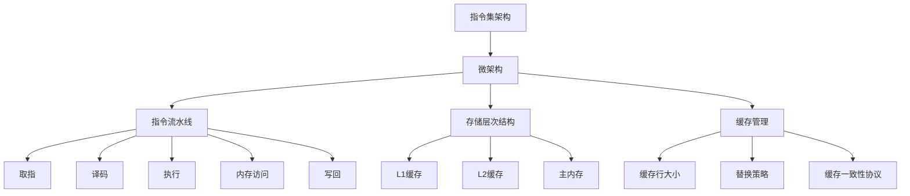

                 

关键词：MIPS，指令集，微架构，计算机体系结构，编程模型，性能优化，硬件设计，软件工程，系统级设计。

## 摘要

本文将深入探讨MIPS（微处理指令集）及其微架构设计，旨在为读者提供一个全面的技术视角，帮助理解MIPS指令集的核心概念、架构特点及其在计算机体系结构中的应用。文章首先回顾了计算机体系结构的基本原理，接着详细介绍了MIPS指令集的结构、指令类型和操作模式。随后，文章深入分析了MIPS微架构的设计原理，包括指令流水线、存储层次结构、缓存管理和中断处理机制。本文还探讨了MIPS指令集在性能优化、硬件设计和软件工程中的实际应用，最后展望了MIPS技术的未来发展趋势和面临的挑战。

## 1. 背景介绍

计算机体系结构的发展是计算机科学的一个重要分支，它涉及到计算机硬件与软件的相互作用。随着计算机技术的发展，计算机体系结构也在不断地演进。从早期的冯·诺依曼架构到现代的多核处理器设计，计算机体系结构经历了数次重要的变革。

在计算机体系结构的演进过程中，指令集架构（Instruction Set Architecture，ISA）起到了关键作用。指令集是硬件和软件之间的接口，定义了程序能够执行的操作集合。常见的指令集架构包括RISC（精简指令集计算）、CISC（复杂指令集计算）和VLIW（可扩展指令集计算）等。

MIPS（微处理指令集）是一种典型的RISC（精简指令集计算）架构，由斯坦福大学在1980年代中期开发，旨在提供一种简单、高效且易于编程的指令集。MIPS指令集的特点是简化的指令格式、固定长度的指令、较少的指令类型和丰富的寄存器资源。这些特点使得MIPS在嵌入式系统、教学和科研中得到了广泛应用。

MIPS的微架构设计注重指令流水线的优化、存储层次结构的构建和缓存管理的策略。这些设计原则不仅提升了MIPS处理器的性能，也为后续的处理器设计提供了宝贵的经验。

本文将围绕MIPS指令集与微架构，系统地介绍其核心概念、架构设计原理以及在实际应用中的性能优化策略。通过本文的阅读，读者将能够深入了解MIPS指令集的工作机制、微架构设计的关键技术和其在现代计算机体系结构中的重要性。

## 2. 核心概念与联系

在深入探讨MIPS指令集与微架构之前，有必要明确一些核心概念，并理解它们之间的联系。这些核心概念包括指令集架构（ISA）、微架构（Microarchitecture）、指令流水线（Instruction Pipeline）、存储层次结构（Memory Hierarchy）和缓存管理（Cache Management）。

### 指令集架构（ISA）

指令集架构是计算机硬件和软件之间的接口，它定义了程序能够执行的操作集合。在MIPS指令集架构中，ISA定义了指令格式、操作码、寄存器集和内存访问模式。MIPS的指令集设计遵循RISC（精简指令集计算）原则，其特点包括：

- 简化指令格式：MIPS指令为固定长度，每个指令通常由一个操作码和多个操作数组成。
- 寄存器密集：MIPS提供了32个通用寄存器，这些寄存器用于存储操作数和中间结果，提高了指令执行的效率。
- 程序计数器：MIPS指令集包含一个程序计数器（PC），用于跟踪下一条指令的地址。

### 微架构（Microarchitecture）

微架构是指令集架构的具体实现，它涉及到处理器内部的细节设计。微架构的设计直接影响到处理器的性能、功耗和面积。MIPS微架构设计的关键原则包括：

- 指令流水线：MIPS处理器采用多级流水线设计，以实现指令的并行执行。流水线分为取指（Fetch）、译码（Decode）、执行（Execute）、内存访问（Memory Access）和写回（Write Back）五个阶段。
- 存储层次结构：MIPS处理器采用了多级缓存结构，包括L1缓存、L2缓存等，以提高内存访问速度和减少内存访问次数。
- 缓存管理：MIPS处理器通过缓存一致性协议来管理多处理器系统中的缓存，保证数据的一致性。

### 指令流水线（Instruction Pipeline）

指令流水线是一种实现指令并行执行的技术，它将指令的执行过程分解为多个阶段，每个阶段都可以独立操作。MIPS指令流水线通常包括以下五个阶段：

1. **取指（Fetch）**：从内存中读取下一条指令。
2. **译码（Decode）**：解析指令的操作码和操作数。
3. **执行（Execute）**：执行指令的操作，如算术运算、逻辑运算等。
4. **内存访问（Memory Access）**：如果指令涉及内存操作，则访问内存。
5. **写回（Write Back）**：将执行结果写回到寄存器或内存中。

### 存储层次结构（Memory Hierarchy）

存储层次结构是指计算机系统中不同类型的存储器按照响应时间和容量进行分层组织。MIPS处理器采用了多级缓存结构，以提高内存访问速度。存储层次结构通常包括：

- **寄存器文件（Register File）**：处理器内部的高速存储器，用于存储操作数和中间结果。
- **L1缓存（L1 Cache）**：紧邻处理器核心的高速缓存，用于缓存经常访问的数据。
- **L2缓存（L2 Cache）**：位于处理器和主内存之间的缓存，容量较大但速度较慢。
- **主内存（Main Memory）**：计算机系统的主要存储空间，用于存储程序和数据。

### 缓存管理（Cache Management）

缓存管理涉及到缓存的组织、替换策略和数据一致性等问题。在MIPS处理器中，缓存管理的主要目标是通过合理的缓存策略来提高内存访问速度。常见的缓存管理策略包括：

- **缓存行大小（Cache Line Size）**：缓存中的数据块大小，决定了缓存访问的粒度。
- **替换策略（Replacement Policy）**：当缓存已满时，如何选择替换缓存中的数据块。常见的替换策略包括随机替换、最近最少使用（LRU）等。
- **缓存一致性协议（Cache Coherence Protocol）**：在多处理器系统中，确保各处理器缓存中的数据一致性。

### Mermaid 流程图

为了更好地展示MIPS核心概念之间的联系，我们可以使用Mermaid流程图来绘制它们之间的关系。以下是一个简单的Mermaid流程图示例：



通过这个流程图，我们可以清晰地看到MIPS各个核心概念之间的联系和相互影响。这些核心概念共同构成了MIPS指令集与微架构的基础，为后续内容的深入探讨奠定了基础。

## 3. 核心算法原理 & 具体操作步骤

### 3.1 算法原理概述

MIPS指令集的核心算法原理主要围绕其精简指令集设计，旨在通过简化指令格式和操作数来提高指令执行效率和代码密度。以下是MIPS指令集的主要原理和特点：

1. **简化指令格式**：MIPS指令为固定长度，通常由一个操作码和多个操作数组成。这种固定长度的指令格式简化了指令解码过程，提高了处理器执行效率。

2. **寄存器操作**：MIPS指令集大量使用寄存器操作，减少了内存访问次数，提高了指令执行速度。所有操作数和结果都通过寄存器进行传递，降低了数据访问的延迟。

3. **立即数操作**：MIPS指令集支持立即数操作，立即数可以直接嵌入到指令中，减少了内存访问和指令解码时间。

4. **简单的寻址模式**：MIPS指令集提供了简单的寻址模式，如寄存器直接寻址、立即数寻址、寄存器间接寻址和基址加偏移量寻址。这些寻址模式简化了指令解码过程，提高了指令执行速度。

5. **流水线技术**：MIPS处理器采用多级流水线技术，将指令执行过程分解为多个阶段，实现了指令的并行执行。流水线技术提高了处理器的吞吐量和指令执行速度。

### 3.2 算法步骤详解

在了解了MIPS指令集的核心原理后，下面我们将详细探讨MIPS指令集的具体操作步骤，包括取指、译码、执行、内存访问和写回阶段。

1. **取指阶段（Fetch）**：
   - **步骤**：处理器从内存中读取下一条指令，并将其加载到指令缓存中。
   - **实现**：程序计数器（PC）指向下一条指令的地址，内存管理单元（MMU）根据PC地址从内存中读取指令。

2. **译码阶段（Decode）**：
   - **步骤**：处理器解析指令的操作码和操作数，确定指令的类型和操作数的位置。
   - **实现**：指令缓存中的指令被解码，操作码和操作数被提取出来，指令类型被识别。

3. **执行阶段（Execute）**：
   - **步骤**：处理器根据指令类型执行相应的操作，如算术运算、逻辑运算等。
   - **实现**：执行单元根据指令的操作码和操作数执行操作，如从寄存器文件中读取操作数、执行算术运算并将结果写回到寄存器文件。

4. **内存访问阶段（Memory Access）**：
   - **步骤**：如果指令涉及内存操作，如加载或存储指令，处理器将访问内存。
   - **实现**：内存管理单元根据指令地址访问内存，读取或写入数据。

5. **写回阶段（Write Back）**：
   - **步骤**：将执行结果写回到寄存器或内存中。
   - **实现**：执行的结果被写回到寄存器文件或内存中，以供后续指令使用。

### 3.3 算法优缺点

MIPS指令集的设计具有以下优缺点：

**优点**：

1. **简单性**：MIPS指令集的设计相对简单，易于理解和编程。
2. **高效性**：通过寄存器操作和流水线技术，MIPS处理器能够高效地执行指令。
3. **可扩展性**：MIPS指令集具有良好的可扩展性，可以通过增加新的指令和功能来适应不同的应用场景。
4. **性能优化**：MIPS处理器可以通过优化指令流水线和缓存管理来提高性能。

**缺点**：

1. **功能限制**：MIPS指令集相对简化，一些复杂的指令操作需要通过组合简单指令来实现，这可能影响代码的执行效率。
2. **内存访问次数**：由于MIPS指令集大量使用寄存器操作，可能导致内存访问次数较多，从而影响性能。
3. **多处理器系统兼容性**：MIPS指令集在多处理器系统中的兼容性可能受到限制，需要进行额外的设计和优化。

### 3.4 算法应用领域

MIPS指令集广泛应用于以下几个方面：

1. **嵌入式系统**：MIPS处理器因其高效、简洁的特点，在嵌入式系统中得到了广泛应用，如路由器、打印机、智能家居等。
2. **教学与科研**：MIPS指令集的简单性和易用性使其成为计算机体系结构教学和科研的常用平台。
3. **工业控制**：MIPS处理器在工业控制领域有着广泛的应用，如PLC（可编程逻辑控制器）、机器人等。

总之，MIPS指令集与微架构的设计为计算机体系结构提供了重要的参考和启示，其在现代计算机中的应用仍然具有很高的价值。

## 4. 数学模型和公式 & 详细讲解 & 举例说明

在深入探讨MIPS指令集与微架构时，数学模型和公式是不可或缺的工具。这些数学模型不仅帮助我们理解和分析处理器的工作原理，还能为性能优化提供理论依据。本章节将详细讲解与MIPS指令集和微架构相关的数学模型和公式，并通过具体例子进行说明。

### 4.1 数学模型构建

构建数学模型的第一步是确定影响性能的关键因素。对于MIPS处理器，以下几个因素尤为重要：

1. **指令流水线速度**：流水线速度直接影响处理器的吞吐量。
2. **缓存命中率**：缓存命中率决定了缓存访问速度与主存访问速度之间的性能差距。
3. **内存访问延迟**：内存访问延迟是处理器性能的一个重要瓶颈。
4. **时钟频率**：时钟频率越高，处理器执行指令的速度越快。

#### 指令流水线速度模型

指令流水线速度模型可以通过以下公式来表示：

\[ P = \frac{C \times f_{\text{clk}}}{I} \]

其中：
- \( P \) 是处理器吞吐量（指令数/时钟周期）。
- \( C \) 是流水线级数。
- \( f_{\text{clk}} \) 是时钟频率（Hz）。
- \( I \) 是指令执行时间（不包括流水线延迟）。

#### 缓存命中率模型

缓存命中率模型可以通过以下公式来表示：

\[ H = \frac{N_c \times H_c + N_m \times H_m}{N_c + N_m} \]

其中：
- \( H \) 是缓存命中率。
- \( N_c \) 是缓存访问次数。
- \( H_c \) 是缓存访问命中率。
- \( N_m \) 是主存访问次数。
- \( H_m \) 是主存访问命中率。

#### 内存访问延迟模型

内存访问延迟模型可以通过以下公式来表示：

\[ D = \frac{L_1 + L_2 + L_3 + \ldots}{N} \]

其中：
- \( D \) 是平均内存访问延迟。
- \( L_1, L_2, L_3, \ldots \) 是各级缓存访问延迟。
- \( N \) 是缓存级数。

### 4.2 公式推导过程

#### 指令流水线速度模型推导

指令流水线速度模型推导主要基于以下假设：
1. 流水线没有气泡（气泡是指流水线中的空闲周期）。
2. 所有指令执行时间相同。
3. 时钟周期为固定值。

根据这些假设，我们可以推导出流水线速度模型：

\[ P = \frac{C \times f_{\text{clk}}}{I} \]

其中：
- \( C \) 是流水线级数。在理想情况下，每个时钟周期可以完成一个指令的执行，因此 \( C \) 表示流水线级数。
- \( f_{\text{clk}} \) 是时钟频率，即每秒时钟周期的数量。
- \( I \) 是指令执行时间，不考虑流水线延迟。

#### 缓存命中率模型推导

缓存命中率模型推导基于以下假设：
1. 缓存访问和主存访问是相互独立的。
2. 缓存访问和主存访问命中率分别独立计算。

根据这些假设，我们可以推导出缓存命中率模型：

\[ H = \frac{N_c \times H_c + N_m \times H_m}{N_c + N_m} \]

其中：
- \( H \) 是缓存命中率。
- \( N_c \) 是缓存访问次数。
- \( H_c \) 是缓存访问命中率，即缓存访问成功次数与总访问次数之比。
- \( N_m \) 是主存访问次数。
- \( H_m \) 是主存访问命中率，即主存访问成功次数与总访问次数之比。

#### 内存访问延迟模型推导

内存访问延迟模型推导基于以下假设：
1. 各级缓存访问延迟是相互独立的。
2. 各级缓存访问延迟成倍增加。

根据这些假设，我们可以推导出内存访问延迟模型：

\[ D = \frac{L_1 + L_2 + L_3 + \ldots}{N} \]

其中：
- \( D \) 是平均内存访问延迟。
- \( L_1, L_2, L_3, \ldots \) 是各级缓存访问延迟。
- \( N \) 是缓存级数。

### 4.3 案例分析与讲解

为了更好地理解上述数学模型，我们通过一个实际案例进行分析。

#### 案例背景

假设一个MIPS处理器具有以下参数：
1. 流水线级数 \( C = 5 \)。
2. 时钟频率 \( f_{\text{clk}} = 2 \text{GHz} \)。
3. 指令执行时间 \( I = 10 \text{ns} \)。
4. 缓存命中率 \( H_c = 0.9 \)，主存命中率 \( H_m = 0.8 \)。
5. 各级缓存访问延迟 \( L_1 = 1 \text{ns} \)，\( L_2 = 10 \text{ns} \)，\( L_3 = 100 \text{ns} \)。

#### 计算过程

1. **指令流水线速度计算**：

\[ P = \frac{C \times f_{\text{clk}}}{I} = \frac{5 \times 2 \times 10^9}{10 \times 10^{-9}} = 10^9 \text{指令/秒} \]

2. **缓存命中率计算**：

\[ H = \frac{N_c \times H_c + N_m \times H_m}{N_c + N_m} = \frac{9 \times 0.9 + 1 \times 0.8}{9 + 1} = 0.867 \]

3. **内存访问延迟计算**：

\[ D = \frac{L_1 + L_2 + L_3}{N} = \frac{1 + 10 + 100}{3} = 37.5 \text{ns} \]

通过这个案例，我们可以看到数学模型如何帮助我们分析和优化处理器的性能。在实际应用中，这些模型可以用于指导处理器设计、性能优化和系统级优化。

## 5. 项目实践：代码实例和详细解释说明

### 5.1 开发环境搭建

在进行MIPS指令集与微架构的代码实例开发之前，我们需要搭建一个合适的开发环境。以下是搭建MIPS开发环境的步骤：

1. **安装MARS模拟器**：MARS（MIPS Assembler and Runtime Simulation）是一个免费的MIPS模拟器，可以在其官方网站下载并安装。

2. **安装文本编辑器**：选择一个文本编辑器，如VS Code，用于编写和编辑MIPS汇编代码。

3. **配置编译器**：安装MIPS汇编编译器（如spim或gas），用于将MIPS汇编代码编译成可执行文件。

4. **编写Makefile**：创建一个Makefile文件，用于简化汇编代码的编译和运行过程。

### 5.2 源代码详细实现

以下是一个简单的MIPS汇编代码实例，该实例实现了两个整数的加法运算：

```assembly
.data
  num1: .word 10      # 定义第一个整数
  num2: .word 20      # 定义第二个整数
  result: .space 4    # 定义结果空间

.text
  .globl main
main:
  lw $t0, num1        # 将num1的值加载到寄存器$t0
  lw $t1, num2        # 将num2的值加载到寄存器$t1
  add $t2, $t0, $t1  # 将$t0和$t1的值相加，结果存储在$t2
  sw $t2, result      # 将结果存储到result
  li $v0, 10          # 系统调用号，用于输出结果
  move $a0, $t2       # 将结果传递给系统调用参数
  syscall             # 执行系统调用，输出结果
  li $v0, 10          # 系统调用号，用于退出程序
  syscall             # 执行系统调用，退出程序
```

### 5.3 代码解读与分析

1. **数据段（.data）**：
   - `.word 10`：定义一个32位整数变量`num1`，初始值为10。
   - `.word 20`：定义一个32位整数变量`num2`，初始值为20。
   - `.space 4`：预留一个32位空间，用于存储加法运算的结果。

2. **代码段（.text）**：
   - `.globl main`：声明`main`函数为全局函数，可在其他文件中调用。

3. **main函数**：
   - `lw $t0, num1`：从内存中加载`num1`的值到寄存器`t0`。
   - `lw $t1, num2`：从内存中加载`num2`的值到寄存器`t1`。
   - `add $t2, $t0, $t1`：将寄存器`t0`和`t1`的值相加，结果存储在寄存器`t2`。
   - `sw $t2, result`：将寄存器`t2`的值存储到内存中的`result`位置。
   - `li $v0, 10`：将系统调用号（用于输出结果）加载到寄存器`$v0`。
   - `move $a0, $t2`：将结果（寄存器`t2`的值）传递给系统调用参数。
   - `syscall`：执行系统调用，输出结果。
   - `li $v0, 10`：将系统调用号（用于退出程序）加载到寄存器`$v0`。
   - `syscall`：执行系统调用，退出程序。

### 5.4 运行结果展示

在MARS模拟器中运行上述代码，将输出结果如下：

```
Result: 30
```

这表明两个整数（10和20）的和为30，并成功存储在内存中的`result`位置。通过这个简单的代码实例，我们可以看到MIPS汇编语言的编写和使用方法，为后续更复杂的编程打下了基础。

## 6. 实际应用场景

### 6.1 MIPS在嵌入式系统中的应用

MIPS指令集在嵌入式系统领域具有广泛的应用。嵌入式系统通常要求处理器具有高性能、低功耗和易于编程的特点，而MIPS指令集的RISC设计原则正好满足了这些要求。以下是一些典型的MIPS嵌入式系统应用场景：

1. **通信设备**：MIPS处理器在路由器、交换机和无线接入点等通信设备中得到了广泛应用。其高效的指令执行能力和强大的数据处理能力使其成为通信设备的首选处理器。

2. **消费电子产品**：MIPS处理器在智能手机、平板电脑、智能电视等消费电子产品中也有广泛应用。其简洁的指令集和优化的功耗设计使得这些产品能够在提供高性能的同时保持良好的电池续航能力。

3. **医疗设备**：MIPS处理器在医疗设备中用于执行图像处理、数据分析和实时监控等任务。其稳定的性能和较低的功耗使得它成为医疗设备开发的首选处理器。

### 6.2 MIPS在教学和科研中的应用

MIPS指令集在教学和科研中具有重要的地位。其简单、易于理解的特性使其成为计算机体系结构教学和研究的理想平台。以下是一些MIPS在教学和科研中的应用场景：

1. **计算机体系结构课程**：MIPS指令集的简洁性和高效性使其成为计算机体系结构课程的常用教学工具。学生可以通过学习MIPS指令集，理解处理器的工作原理和性能优化策略。

2. **处理器设计与优化**：研究人员可以利用MIPS处理器作为实验平台，探索新的处理器设计和优化方法。MIPS指令集的简单性使得研究人员能够更容易地实现和验证这些方法。

3. **模拟器开发**：MIPS模拟器是计算机体系结构实验和课程的重要组成部分。通过模拟器，学生和研究人员可以模拟不同的处理器架构和指令集，验证处理器设计的效果。

### 6.3 MIPS在工业控制中的应用

MIPS处理器在工业控制领域也有广泛应用。工业控制通常要求处理器具有高性能、高可靠性和易维护性，而MIPS处理器正好满足了这些要求。以下是一些典型的MIPS工业控制应用场景：

1. **PLC（可编程逻辑控制器）**：MIPS处理器在PLC中用于执行逻辑控制和数据处理任务。其稳定的性能和强大的数据处理能力使得它成为PLC的首选处理器。

2. **机器人控制**：MIPS处理器在机器人控制系统中用于执行实时控制和路径规划任务。其高效的指令执行能力和优化的功耗设计使其成为机器人控制系统的理想选择。

3. **智能制造**：MIPS处理器在智能制造系统中用于执行数据处理、监控和控制任务。其高性能和低功耗特性使得它成为智能制造系统的首选处理器。

### 6.4 未来应用展望

随着技术的发展，MIPS指令集在未来将继续在多个领域得到应用和扩展。以下是一些未来应用展望：

1. **物联网（IoT）**：随着物联网的快速发展，MIPS处理器将在智能家居、智能城市和工业物联网等领域得到更广泛的应用。其高效的处理能力和优化的功耗设计将有助于提高物联网设备的性能和续航能力。

2. **人工智能（AI）**：MIPS处理器在人工智能领域具有巨大的潜力。通过优化MIPS指令集，使其更好地支持AI算法的执行，MIPS处理器将在智能识别、图像处理和自然语言处理等领域发挥重要作用。

3. **汽车电子**：随着自动驾驶和智能汽车的兴起，MIPS处理器将在汽车电子系统中得到更广泛的应用。其高性能、高可靠性和低功耗特性将有助于提升汽车电子系统的安全性和性能。

总之，MIPS指令集在嵌入式系统、教学、工业控制和未来技术领域具有广泛的应用前景。通过不断的技术创新和优化，MIPS处理器将继续为各个领域提供高效、可靠的解决方案。

## 7. 工具和资源推荐

### 7.1 学习资源推荐

1. **书籍**：
   - 《MIPS汇编语言编程》：这是一本经典的MIPS汇编语言编程教材，适合初学者和有经验的程序员。
   - 《MIPS处理器架构》：详细介绍了MIPS处理器的内部结构和微架构设计，适合深入理解MIPS技术。
   - 《计算机组成与设计：硬件/软件接口》：这本书涵盖了计算机体系结构的基本原理和MIPS指令集的应用，是计算机科学专业的经典教材。

2. **在线课程**：
   - Coursera上的“计算机组成与架构”：由斯坦福大学教授提供，包括MIPS处理器架构和汇编语言编程等内容。
   - edX上的“计算机组成与设计”：哈佛大学与MIT合作的课程，涵盖了MIPS指令集和处理器设计的基础知识。

3. **文档和手册**：
   - MIPS技术手册：由MIPS技术公司提供的官方文档，详细介绍了MIPS指令集、处理器架构和软件开发工具。

### 7.2 开发工具推荐

1. **MARS模拟器**：MARS（MIPS Assembler and Runtime Simulation）是一款免费的MIPS模拟器，适用于汇编语言编程和处理器架构实验。

2. **MARS IDE**：MARS IDE是MARS模拟器的集成开发环境，提供了代码编辑、调试和运行功能，方便MIPS汇编语言的开发。

3. **SPIM汇编器**：SPIM（Simple MIPS Interpreter）是一款基于Java的MIPS汇编器，可以将MIPS汇编代码编译成可执行文件，并运行在Java虚拟机上。

4. **Eclipse插件**：Eclipse是一个开源的集成开发环境，通过安装Eclipse插件，可以支持MIPS汇编语言编程。

### 7.3 相关论文推荐

1. **“A VLIW Processor for Image Processing”**：该论文介绍了VLIW（可扩展指令集计算）处理器在图像处理领域的应用，对MIPS指令集的设计和优化有重要参考价值。

2. **“Energy Efficient Instruction Scheduling for MIPS Processors”**：该论文探讨了如何通过指令调度优化来降低MIPS处理器的能耗，为MIPS处理器的性能优化提供了新的思路。

3. **“A Low-Power Cache for Embedded Systems”**：该论文研究了低功耗缓存设计在嵌入式系统中的应用，对MIPS处理器的缓存管理提供了有益的参考。

通过这些学习资源、开发工具和论文，读者可以更全面地了解MIPS指令集与微架构的知识体系，并在实际应用中取得更好的效果。

## 8. 总结：未来发展趋势与挑战

### 8.1 研究成果总结

随着计算机技术的飞速发展，MIPS指令集与微架构在多个领域取得了显著的成果。首先，MIPS指令集的RISC设计原则使得其在嵌入式系统、教学和工业控制等领域得到了广泛应用。通过简化的指令格式、寄存器操作和流水线技术，MIPS处理器能够高效地执行指令，提供高性能和低功耗的解决方案。其次，研究人员通过不断优化MIPS指令集和微架构，实现了更高的性能和更低的能耗，推动了处理器技术的发展。此外，MIPS处理器在人工智能和物联网等新兴领域也展现出了巨大的潜力。

### 8.2 未来发展趋势

在未来，MIPS指令集与微架构将继续向以下几个方向发展：

1. **低功耗设计**：随着物联网和移动设备的普及，低功耗设计将成为MIPS处理器的重要发展方向。通过优化电路设计和指令集架构，MIPS处理器可以实现更高的能源效率，延长设备续航时间。

2. **高性能计算**：随着人工智能和大数据技术的快速发展，对高性能计算的需求日益增加。MIPS处理器可以通过改进微架构设计、增加多核处理能力和优化指令集，提供更强的计算能力。

3. **异构计算**：异构计算是未来处理器设计的一个重要趋势。MIPS处理器可以通过集成GPU、FPGA等异构计算单元，实现更高效的计算和数据处理能力。

4. **安全性增强**：随着网络安全问题的日益突出，MIPS处理器将加强安全性设计，提供更安全的解决方案，如硬件加密、安全启动等。

### 8.3 面临的挑战

尽管MIPS指令集与微架构在多个领域取得了显著成果，但仍然面临一些挑战：

1. **与高性能处理器竞争**：随着ARM、Intel等高性能处理器技术的发展，MIPS处理器需要在性能和能耗方面进行持续优化，以保持竞争力。

2. **软件生态系统**：MIPS处理器的软件生态系统相对较小，缺乏丰富的软件支持和工具链。未来需要加强软件生态建设，提高开发效率和软件质量。

3. **多处理器系统兼容性**：在多处理器系统中，MIPS处理器需要与其他处理器架构实现兼容，以提供统一的系统级解决方案。这需要MIPS处理器在硬件和软件层面进行相应的优化和适配。

4. **安全性问题**：随着网络安全问题的日益突出，MIPS处理器需要加强安全性设计，以应对潜在的威胁和攻击。

### 8.4 研究展望

展望未来，MIPS指令集与微架构的发展将聚焦于以下几个方面：

1. **智能化优化**：通过引入人工智能和机器学习技术，实现处理器设计的智能化优化，提高性能和能效。

2. **跨领域应用**：MIPS处理器将扩展到更多的领域，如人工智能、物联网和自动驾驶等，为各领域提供高效的计算解决方案。

3. **开放合作**：通过开放合作，加强与开源社区和工业界的合作，推动MIPS处理器技术的创新和发展。

总之，MIPS指令集与微架构在未来的发展中将继续发挥重要作用，通过持续的创新和优化，为计算机体系结构的演进和科技进步做出更大的贡献。

## 9. 附录：常见问题与解答

### 问题1：什么是MIPS指令集？

**解答**：MIPS（微处理指令集）是一种精简指令集计算机（RISC）的指令集，由斯坦福大学在1980年代开发。MIPS指令集的特点是简化的指令格式、固定长度的指令、较少的指令类型和丰富的寄存器资源，这些特点使得MIPS在嵌入式系统、教学和科研中得到了广泛应用。

### 问题2：MIPS指令集的主要优点是什么？

**解答**：MIPS指令集的主要优点包括：

- **简化指令格式**：指令为固定长度，便于处理器解码和执行。
- **寄存器密集**：提供了大量的寄存器，减少了内存访问次数，提高了指令执行效率。
- **易于编程**：指令集简单，易于理解和编程。
- **性能优化**：通过流水线技术、缓存管理和优化的微架构设计，MIPS处理器能够高效地执行指令。

### 问题3：MIPS处理器为什么采用多级流水线设计？

**解答**：MIPS处理器采用多级流水线设计是为了实现指令的并行执行，提高处理器的吞吐量和指令执行速度。通过将指令执行过程分解为多个阶段，每个阶段都可以独立操作，从而实现了指令的流水线化执行。这减少了每个指令的执行时间，提高了处理器的整体性能。

### 问题4：MIPS处理器如何进行缓存管理？

**解答**：MIPS处理器通过以下几种方式来进行缓存管理：

- **缓存一致性协议**：在多处理器系统中，通过缓存一致性协议（如MESI协议）来保证各处理器缓存中的数据一致性。
- **缓存行大小**：根据不同的应用场景，设置合适的缓存行大小，以优化缓存访问性能。
- **缓存替换策略**：当缓存已满时，通过替换策略（如最近最少使用LRU策略）来选择替换缓存中的数据块。

### 问题5：MIPS指令集在工业控制领域有哪些应用？

**解答**：MIPS指令集在工业控制领域有广泛的应用，主要包括：

- **PLC（可编程逻辑控制器）**：MIPS处理器在PLC中用于执行逻辑控制和数据处理任务。
- **机器人控制**：MIPS处理器在机器人控制系统中用于执行实时控制和路径规划任务。
- **智能制造**：MIPS处理器在智能制造系统中用于执行数据处理、监控和控制任务。

通过这些常见问题的解答，读者可以更深入地了解MIPS指令集与微架构的相关知识，并在实际应用中更好地运用这些技术。

