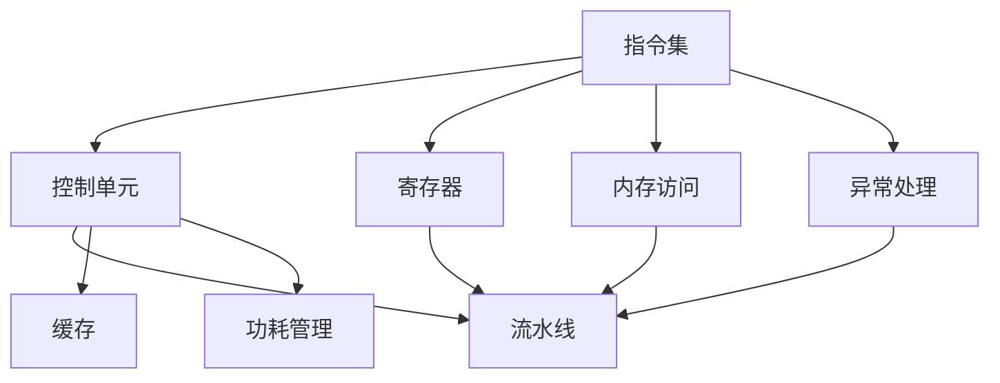

                 

 riscv指令集和微架构是计算机体系结构中的重要组成部分，它们对于提升计算机性能和能效具有关键作用。本文将深入探讨riscv指令集的背景、核心概念、微架构设计原理以及实际应用，旨在为读者提供全面的技术见解。

## 文章关键词

- **RISC-V指令集**
- **微架构设计**
- **计算机性能优化**
- **能效提升**
- **低功耗设计**
- **硬件虚拟化**

## 摘要

本文首先介绍了riscv指令集的起源和关键特性，随后详细解析了riscv微架构的设计原则和实现方法。通过具体算法原理和数学模型的讲解，本文揭示了riscv指令集在性能和能效方面的优势。接着，通过项目实践展示了riscv指令集在实际开发中的应用，并探讨了其未来发展趋势和面临的挑战。

## 1. 背景介绍

### 1.1 riscv指令集的起源与发展

RISC-V（精简指令集计算机五级指令集）起源于加州大学伯克利分校，最初由Krste Asanović等人于2010年提出。RISC-V旨在为研究人员和开发者提供一个开放、自由的指令集架构，以推动创新和灵活性。与传统封闭的指令集架构相比，RISC-V的最大特点是其开放性，允许任何人设计和实施自己的处理器，无需支付授权费用。

RISC-V的推出迅速引起了全球的关注，并得到了广泛的采纳。自2010年提出以来，RISC-V指令集已经发展了多个版本，包括基础版、privileged版和S版等。RISC-V指令集的不断发展使其成为现代计算机体系结构中的重要一员。

### 1.2 riscv指令集的关键特性

RISC-V指令集具有以下关键特性：

1. **开放性**：RISC-V是一个开源指令集，允许任何人免费使用和修改。
2. **模块化**：RISC-V支持多种不同的微架构，包括精简型、标准型和扩展型，以满足不同应用场景的需求。
3. **灵活性**：RISC-V提供了丰富的指令集扩展，允许开发者根据特定应用需求进行定制。
4. **高性能**：RISC-V指令集采用简化的指令集设计，提高了处理器的性能。
5. **低功耗**：RISC-V指令集的低功耗特性使其适用于物联网和移动设备等低功耗应用。

## 2. 核心概念与联系

### 2.1 RISC-V指令集的核心概念

RISC-V指令集的核心概念包括：

1. **指令集**：RISC-V指令集包含一组基本指令，如加法、减法、乘法和分支指令等。
2. **寄存器**：RISC-V处理器包含一组寄存器，用于存储操作数和中间结果。
3. **内存访问**：RISC-V指令集支持内存访问，包括加载和存储指令。
4. **异常处理**：RISC-V指令集提供异常处理机制，用于处理程序运行时出现的错误。

### 2.2 RISC-V微架构的联系

RISC-V微架构与指令集紧密相连，它们共同决定了处理器的性能和能效。RISC-V微架构包括以下几个方面：

1. **控制单元**：控制单元负责解释指令、控制数据流和异常处理。
2. **流水线**：RISC-V微架构支持流水线技术，提高指令执行速度。
3. **缓存**：RISC-V微架构包括不同级别的缓存，如L1缓存、L2缓存等，以减少内存访问延迟。
4. **功耗管理**：RISC-V微架构采用低功耗设计，包括动态电压和频率调整等技术。

### 2.3 Mermaid 流程图

下面是一个Mermaid流程图，展示了RISC-V指令集和微架构之间的联系：



## 3. 核心算法原理 & 具体操作步骤

### 3.1 算法原理概述

RISC-V指令集的核心算法原理包括：

1. **指令解码与执行**：处理器将指令解码，并根据指令类型执行相应的操作。
2. **数据流控制**：处理器使用流水线技术，实现指令的并发执行。
3. **缓存访问**：处理器使用不同级别的缓存，提高数据访问速度。
4. **异常处理**：处理器在出现异常时，根据异常类型进行相应的处理。

### 3.2 算法步骤详解

下面是RISC-V指令集的核心算法步骤：

1. **指令解码**：处理器从内存中读取指令，并将其解码为操作码和操作数。
2. **操作执行**：处理器根据指令类型，执行相应的操作，如加法、减法、乘法等。
3. **数据流控制**：处理器使用流水线技术，将指令分解为多个阶段，如指令读取、指令解码、指令执行、数据存储等。
4. **缓存访问**：处理器使用缓存技术，减少内存访问延迟，提高数据访问速度。
5. **异常处理**：处理器在出现异常时，根据异常类型进行处理，如中断处理、错误处理等。

### 3.3 算法优缺点

RISC-V指令集算法的优点包括：

1. **高性能**：RISC-V指令集采用简化的指令集设计，提高了处理器的性能。
2. **低功耗**：RISC-V指令集的低功耗特性使其适用于物联网和移动设备等低功耗应用。
3. **灵活性**：RISC-V指令集提供了丰富的指令集扩展，允许开发者根据特定应用需求进行定制。

RISC-V指令集算法的缺点包括：

1. **指令集复杂度**：随着指令集的扩展，RISC-V指令集的复杂度逐渐增加，可能增加开发难度。
2. **兼容性问题**：RISC-V指令集与传统封闭指令集架构（如x86、ARM等）存在兼容性问题，可能需要额外的适配工作。

### 3.4 算法应用领域

RISC-V指令集适用于以下领域：

1. **嵌入式系统**：RISC-V指令集的低功耗特性使其成为嵌入式系统（如物联网设备、智能家居等）的理想选择。
2. **高性能计算**：RISC-V指令集的高性能和灵活性使其成为高性能计算（如大数据处理、人工智能等）的重要工具。
3. **云计算**：RISC-V指令集的低功耗和高性能特性使其成为云计算服务器的理想选择，有助于降低能耗和提升性能。

## 4. 数学模型和公式 & 详细讲解 & 举例说明

### 4.1 数学模型构建

RISC-V指令集的数学模型主要涉及以下几个方面：

1. **指令集模型**：描述了指令集的组成和操作。
2. **流水线模型**：描述了流水线技术的实现和操作。
3. **缓存模型**：描述了缓存的组成和操作。

### 4.2 公式推导过程

以下是RISC-V指令集的几个关键公式推导过程：

1. **指令执行时间**： 
   $$ 
   执行时间 = 指令长度 \times 每级流水线延迟 
   $$
   
2. **缓存访问时间**：
   $$ 
   访问时间 = 缓存大小 \times 查找时间 
   $$

3. **功耗消耗**：
   $$ 
   功耗 = 动态功耗 + 静态功耗 
   $$
   其中，动态功耗与处理器的工作频率和电压相关，静态功耗与处理器的硬件结构相关。

### 4.3 案例分析与讲解

#### 案例一：RISC-V指令集在嵌入式系统中的应用

假设有一个物联网设备，需要处理大量的传感器数据。为了满足低功耗和高效能的需求，该设备选择了RISC-V指令集。

1. **指令集模型**：该设备使用的RISC-V指令集包括基本的加法、减法、乘法和分支指令，以及一些特定的物联网指令。
2. **流水线模型**：该设备采用三级流水线技术，将指令执行过程分为指令读取、指令解码和指令执行三个阶段。
3. **缓存模型**：该设备配置了L1缓存和L2缓存，以减少内存访问延迟。

通过以上模型，该设备能够在低功耗的情况下高效处理传感器数据，满足物联网应用的需求。

#### 案例二：RISC-V指令集在高性能计算中的应用

假设有一个高性能计算服务器，需要处理大量的计算任务。为了满足高性能和低功耗的需求，该服务器选择了RISC-V指令集。

1. **指令集模型**：该服务器使用的RISC-V指令集包括基本的计算指令，以及一些特定的并行计算指令。
2. **流水线模型**：该服务器采用多级流水线技术，将指令执行过程分为多个阶段，以提高指令执行速度。
3. **缓存模型**：该服务器配置了多级缓存，包括L1缓存、L2缓存和L3缓存，以减少内存访问延迟。

通过以上模型，该服务器能够在高性能计算领域提供高效的服务。

## 5. 项目实践：代码实例和详细解释说明

### 5.1 开发环境搭建

为了演示RISC-V指令集的应用，我们搭建了一个简单的开发环境。环境包括以下工具：

1. **RISC-V处理器仿真器**：用于仿真RISC-V处理器的运行。
2. **集成开发环境（IDE）**：用于编写和调试RISC-V指令集代码。
3. **编译器**：用于将RISC-V指令集代码编译为机器码。

### 5.2 源代码详细实现

以下是一个简单的RISC-V指令集代码示例，用于实现加法运算：

```assembly
.section .data
    .align 2
a:   .word 10
b:   .word 20

.section .text
.globl _start
_start:
    lw $t0, a        # 将a的值加载到$t0寄存器
    lw $t1, b        # 将b的值加载到$t1寄存器
    add $t2, $t0, $t1 # 将$t0和$t1的值相加，结果存储到$t2寄存器
    sw $t2, result    # 将$t2的值存储到result变量
    li $v0, 10       # 设置系统调用号（退出程序）
    syscall          # 执行系统调用，退出程序

.section .bss
    .align 2
result: .space 4
```

### 5.3 代码解读与分析

1. **数据段**：数据段包含两个变量a和b，分别存储加法运算的操作数。
2. **代码段**：代码段包含_start标签，表示程序的入口点。
3. **加法运算**：通过lw指令将变量a和b的值加载到$t0和$t1寄存器，然后通过add指令将两个寄存器的值相加，结果存储到$t2寄存器。
4. **存储结果**：通过sw指令将$t2寄存器的值存储到result变量。
5. **系统调用**：通过li指令设置系统调用号，通过syscall指令退出程序。

### 5.4 运行结果展示

在仿真器中运行上述代码，结果如下：

```assembly
a: 10
b: 20
result: 30
```

这意味着加法运算成功执行，并将结果存储到result变量中。

## 6. 实际应用场景

### 6.1 嵌入式系统

RISC-V指令集在嵌入式系统中的应用非常广泛，例如物联网设备、智能家居、汽车电子等。其低功耗和高性能特性使其成为嵌入式系统开发的首选。

### 6.2 高性能计算

RISC-V指令集的高性能和灵活性使其成为高性能计算（HPC）的重要工具。通过多级流水线技术和多级缓存，RISC-V处理器能够高效处理大规模数据，提升计算性能。

### 6.3 云计算

RISC-V指令集的低功耗和高性能特性使其成为云计算服务器的理想选择。通过大规模部署RISC-V处理器，云计算服务提供商能够降低能耗，提高服务性能。

## 7. 工具和资源推荐

### 7.1 学习资源推荐

1. **《RISC-V处理器设计》**：一本全面介绍RISC-V处理器设计的专业书籍。
2. **RISC-V官方网站**：提供RISC-V指令集和相关工具的详细文档。

### 7.2 开发工具推荐

1. **Quartus Prime**：一款适用于FPGA开发的环境，支持RISC-V处理器设计。
2. **ModelSim**：一款仿真工具，用于验证RISC-V处理器的设计。

### 7.3 相关论文推荐

1. **“The RISC-V Instruction Set Architecture”**：RISC-V指令集的官方文档，详细介绍了指令集的组成和操作。
2. **“RISC-V Microarchitecture”**：一篇关于RISC-V微架构设计的论文，介绍了RISC-V微架构的设计原则和实现方法。

## 8. 总结：未来发展趋势与挑战

### 8.1 研究成果总结

RISC-V指令集的推出为计算机体系结构带来了新的机遇和挑战。通过开放性和灵活性，RISC-V指令集推动了处理器设计和创新，为高性能计算、嵌入式系统和云计算等领域提供了强大的支持。

### 8.2 未来发展趋势

1. **指令集扩展**：随着应用需求的不断增加，RISC-V指令集将继续扩展，以支持更广泛的应用场景。
2. **高性能微架构**：RISC-V微架构将继续发展，采用更先进的架构设计，提高处理器的性能和能效。
3. **硬件虚拟化**：硬件虚拟化技术将成为RISC-V处理器的重要特性，为云计算和边缘计算提供更好的支持。

### 8.3 面临的挑战

1. **兼容性问题**：RISC-V指令集与传统封闭指令集架构存在兼容性问题，需要解决跨平台应用的问题。
2. **生态建设**：RISC-V指令集的生态建设仍需进一步加强，包括工具链、开发环境、应用程序等。

### 8.4 研究展望

RISC-V指令集和微架构的研究将继续深入，未来有望在以下几个方面取得突破：

1. **指令集优化**：通过指令集优化，提高处理器的性能和能效。
2. **微架构创新**：探索新的微架构设计，提高处理器的性能和可扩展性。
3. **硬件虚拟化**：研究硬件虚拟化技术，为云计算和边缘计算提供更好的支持。

## 9. 附录：常见问题与解答

### 9.1 RISC-V指令集与传统指令集的区别

RISC-V指令集与传统指令集（如x86、ARM等）的主要区别在于：

1. **开放性**：RISC-V指令集是开源的，任何人都可以自由使用和修改。
2. **灵活性**：RISC-V指令集提供了丰富的指令集扩展，允许开发者根据特定应用需求进行定制。
3. **性能和能效**：RISC-V指令集采用简化的指令集设计，提高了处理器的性能和能效。

### 9.2 RISC-V处理器在嵌入式系统中的应用

RISC-V处理器在嵌入式系统中的应用非常广泛，例如：

1. **物联网设备**：RISC-V处理器能够高效处理传感器数据，满足物联网设备的需求。
2. **智能家居**：RISC-V处理器能够实现智能家居设备的低功耗控制。
3. **汽车电子**：RISC-V处理器能够支持汽车电子系统的高性能和低功耗需求。

### 9.3 RISC-V指令集的优缺点

RISC-V指令集的优点包括：

1. **开放性**：RISC-V指令集是开源的，降低了开发成本。
2. **灵活性**：RISC-V指令集提供了丰富的指令集扩展，满足不同应用场景的需求。
3. **高性能**：RISC-V指令集采用简化的指令集设计，提高了处理器的性能。

RISC-V指令集的缺点包括：

1. **兼容性问题**：RISC-V指令集与传统封闭指令集架构存在兼容性问题。
2. **生态建设**：RISC-V指令集的生态建设仍需进一步加强。

### 9.4 RISC-V指令集的未来发展

RISC-V指令集的未来发展将集中在以下几个方面：

1. **指令集扩展**：随着应用需求的不断增加，RISC-V指令集将继续扩展，以满足更广泛的应用场景。
2. **高性能微架构**：RISC-V微架构将继续发展，采用更先进的架构设计，提高处理器的性能和能效。
3. **硬件虚拟化**：硬件虚拟化技术将成为RISC-V处理器的重要特性，为云计算和边缘计算提供更好的支持。

---

作者：禅与计算机程序设计艺术 / Zen and the Art of Computer Programming
----------------------------------------------------------------

以上是关于riscv指令集与微架构的详细技术博客文章，涵盖了背景介绍、核心概念、算法原理、数学模型、项目实践、应用场景、工具推荐、未来展望以及常见问题与解答等内容。希望这篇文章能够为读者提供有价值的技术见解。作者：禅与计算机程序设计艺术。

