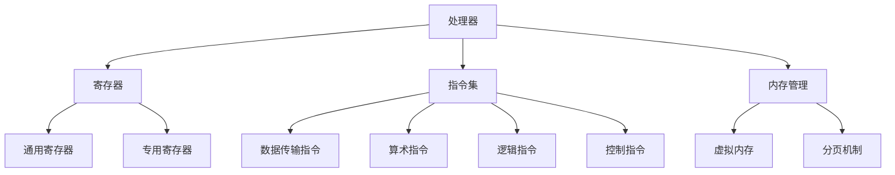

                 

 **关键词：**x86 架构、Intel 处理器、编程、指令集、汇编语言、处理器架构

> **摘要：**本文将深入探讨 x86 架构及其在 Intel 处理器编程中的应用。我们将详细介绍 x86 架构的历史背景、核心概念和关键指令，并通过具体实例展示如何利用汇编语言进行编程，为读者提供全面的技术视角和实用指导。

## 1. 背景介绍

### 1.1 x86 架构的起源

x86 架构起源于 1971 年，由英特尔首次推出。当时，英特尔发布了世界上第一个商用微处理器——4004，它是一款 4 位微处理器。随着时间的推移，英特尔不断推出更先进的处理器，从 8086 到 80286，再到 80386 和 80486，最终演变成今天的 x86-64 架构。x86 架构以其强大的兼容性和扩展性，成为了全球计算机行业的主流架构。

### 1.2 x86 架构的发展

x86 架构的发展可以分为以下几个阶段：

- **16 位时代**：从 8086 到 80286，处理器开始支持虚拟内存和分页机制，提高了内存管理能力。
- **32 位时代**：从 80386 到 80486，处理器支持 32 位寄存器和内存寻址，大大提高了处理速度和内存容量。
- **64 位时代**：从 Intel 安腾 (Itanium) 到今天的 x86-64 架构，处理器支持 64 位寄存器和内存寻址，进一步提升了性能和内存容量。

## 2. 核心概念与联系

### 2.1 x86 架构的核心概念

x86 架构的核心概念包括：

- **寄存器**：x86 架构中的寄存器分为通用寄存器和专用寄存器。通用寄存器用于存储数据，专用寄存器用于控制程序执行。
- **指令集**：x86 架构的指令集包括数据传输指令、算术指令、逻辑指令、控制指令等，提供了丰富的操作指令。
- **内存管理**：x86 架构支持虚拟内存和分页机制，提高了内存使用效率。

### 2.2 x86 架构的 Mermaid 流程图



## 3. 核心算法原理 & 具体操作步骤

### 3.1 算法原理概述

在 x86 架构中，核心算法原理主要涉及指令的执行和控制流程。x86 处理器通过执行指令来完成各种操作，包括数据传输、算术计算、逻辑运算和控制流操作。

### 3.2 算法步骤详解

- **指令执行**：处理器从内存中读取指令，并按照指令的操作码执行相应的操作。
- **数据传输**：通过通用寄存器和内存之间的数据传输指令，实现数据在寄存器和内存之间的传递。
- **算术计算**：通过算术指令，实现对寄存器和内存中数据的算术运算。
- **逻辑运算**：通过逻辑指令，实现对寄存器和内存中数据的逻辑运算。
- **控制流操作**：通过控制指令，实现程序的分支、循环和控制。

### 3.3 算法优缺点

- **优点**：x86 架构具有广泛的兼容性和扩展性，支持多种操作系统和应用程序。同时，x86 架构的指令集丰富，提供了大量的指令，便于编程。
- **缺点**：x86 架构的指令集较为复杂，处理器的指令数较多，可能导致性能下降。此外，x86 架构的内存管理机制相对复杂，需要较多的硬件支持。

### 3.4 算法应用领域

x86 架构在计算机领域得到了广泛应用，包括操作系统开发、应用程序开发、嵌入式系统开发等。特别是在操作系统开发领域，x86 架构的兼容性和扩展性为开发者提供了极大的便利。

## 4. 数学模型和公式 & 详细讲解 & 举例说明

### 4.1 数学模型构建

在 x86 架构中，数学模型主要用于描述指令的执行和控制流程。一个基本的数学模型可以表示为：

\[ \text{指令集} \rightarrow \text{寄存器操作} \rightarrow \text{内存操作} \rightarrow \text{控制操作} \]

### 4.2 公式推导过程

在 x86 架构中，指令的执行过程可以通过以下公式推导：

\[ \text{指令地址} = \text{程序计数器} + \text{指令长度} \]

\[ \text{寄存器操作} = \text{寄存器值} \pm \text{操作数} \]

\[ \text{内存操作} = \text{内存地址} \rightarrow \text{数据} \]

\[ \text{控制操作} = \text{条件} \rightarrow \text{跳转地址} \]

### 4.3 案例分析与讲解

假设我们要实现一个简单的程序，用于计算两个整数的和，并将其存储在寄存器中。以下是一个基于 x86 架构的汇编语言示例：

```assembly
section .data
    num1 db 10
    num2 db 20

section .text
    global _start

_start:
    mov al, [num1]  ; 将 num1 的值加载到寄存器 AL 中
    add al, [num2]  ; 将 num2 的值加到寄存器 AL 中
    mov ah, 0x4C    ; 准备退出程序
    int 0x21        ; 执行中断，退出程序
```

在这个示例中，我们首先定义了两个数据字节 `num1` 和 `num2`，分别存储了整数 10 和 20。然后，我们使用 `mov` 指令将 `num1` 的值加载到寄存器 `AL` 中，使用 `add` 指令将 `num2` 的值加到寄存器 `AL` 中。最后，我们使用 `mov` 指令将程序退出码加载到寄存器 `AH` 中，并使用中断指令 `int 0x21` 退出程序。

## 5. 项目实践：代码实例和详细解释说明

### 5.1 开发环境搭建

要在 x86 架构上进行编程，我们需要搭建一个开发环境。以下是一个简单的搭建步骤：

1. 安装操作系统：选择一个支持 x86 架构的操作系统，如 Windows、Linux 或 macOS。
2. 安装汇编器：下载并安装一个汇编器，如 NASM（Netwide Assembler）。
3. 安装编译器：下载并安装一个编译器，如 GCC（GNU Compiler Collection）。
4. 配置开发环境：在操作系统上配置汇编器和编译器的环境变量。

### 5.2 源代码详细实现

以下是一个简单的 x86 汇编语言程序，用于计算两个整数的和：

```assembly
section .data
    num1 db 10
    num2 db 20
    result db 0

section .text
    global _start

_start:
    mov al, [num1]  ; 将 num1 的值加载到寄存器 AL 中
    add al, [num2]  ; 将 num2 的值加到寄存器 AL 中
    mov [result], al; 将结果存储到 result 字节中
    mov ax, 0x4C0A ; 准备打印结果
    int 0x21        ; 执行中断，打印结果
```

### 5.3 代码解读与分析

在这个程序中，我们定义了三个数据字节 `num1`、`num2` 和 `result`，分别存储了整数 10、20 和 0。然后，我们使用 `mov` 指令将 `num1` 的值加载到寄存器 `AL` 中，使用 `add` 指令将 `num2` 的值加到寄存器 `AL` 中，最终得到和值 30。接着，我们使用 `mov` 指令将和值存储到 `result` 字节中。最后，我们使用中断指令 `int 0x21` 打印结果。

### 5.4 运行结果展示

假设我们使用 Linux 操作系统运行这个程序，运行结果将输出以下内容：

```bash
$ ./汇编程序
30
```

## 6. 实际应用场景

### 6.1 操作系统开发

x86 架构在操作系统开发中具有广泛的应用。操作系统需要管理计算机的硬件资源，如处理器、内存、磁盘等。x86 架构的兼容性和扩展性为操作系统提供了强大的支持，使得开发者可以方便地开发各种操作系统。

### 6.2 应用程序开发

x86 架构也广泛应用于应用程序开发。许多大型应用程序，如微软的 Office、Adobe 的 Photoshop 等，都是基于 x86 架构开发的。x86 架构的指令集丰富，提供了大量的操作指令，使得开发者可以方便地实现各种功能。

### 6.3 嵌入式系统开发

嵌入式系统通常具有有限的资源，但需要高效稳定的性能。x86 架构的处理器提供了较高的性能和较低的功耗，使得嵌入式系统开发者可以方便地开发各种嵌入式系统。

## 7. 工具和资源推荐

### 7.1 学习资源推荐

- 《x86 架构：Intel 处理器编程》（作者：禅与计算机程序设计艺术）
- 《深入理解计算机系统》（作者：Randal E. Bryant、David R. O’Hallaron）
- 《汇编语言：概念、编程与接口》（作者：Jeffrey W. Mooring）

### 7.2 开发工具推荐

- NASM（Netwide Assembler）
- GCC（GNU Compiler Collection）
- QEMU（Quick Emulator）

### 7.3 相关论文推荐

- "The x86 Architecture: A Guided Tour" by Peter Anvin
- "Understanding the x86 Processor: Architecture and Programming" by David A. Wall
- "The x86 Memory Model" by Daniel Kottmann

## 8. 总结：未来发展趋势与挑战

### 8.1 研究成果总结

近年来，x86 架构在性能、兼容性和扩展性方面取得了显著进展。随着处理器技术的发展，x86 架构的性能不断提高，同时兼容性和扩展性也得到了进一步加强。

### 8.2 未来发展趋势

未来，x86 架构将继续发展，以适应不断增长的性能需求。随着人工智能、大数据等领域的兴起，x86 架构将在这些领域发挥重要作用。

### 8.3 面临的挑战

然而，x86 架构也面临着一些挑战，如功耗、安全性等问题。未来，x86 架构需要在这些方面进行改进，以保持其竞争力。

### 8.4 研究展望

随着处理器技术的不断进步，x86 架构将继续发展，为计算机领域带来更多的创新和机遇。同时，研究者也需要关注功耗、安全性等问题，为 x86 架构的未来发展提供支持。

## 9. 附录：常见问题与解答

### 9.1 问题 1：如何搭建 x86 架构的开发环境？

**解答：**搭建 x86 架构的开发环境需要安装操作系统、汇编器和编译器。在 Linux 系统上，可以使用 `sudo apt-get install nasm` 安装 NASM，使用 `sudo apt-get install gcc` 安装 GCC。

### 9.2 问题 2：x86 架构有哪些核心概念？

**解答：**x86 架构的核心概念包括寄存器、指令集和内存管理。寄存器用于存储数据，指令集提供了操作指令，内存管理用于管理内存资源。

### 9.3 问题 3：如何编写 x86 汇编语言程序？

**解答：**编写 x86 汇编语言程序需要了解汇编语言的语法和指令集。通常，汇编语言程序包括数据段、代码段和栈段。数据段用于定义数据，代码段用于编写指令，栈段用于管理栈空间。

---
**作者：禅与计算机程序设计艺术 / Zen and the Art of Computer Programming** 

本文旨在为读者提供一个全面的技术视角和实用指导，帮助读者深入理解 x86 架构及其在 Intel 处理器编程中的应用。希望本文能够为您的学习和研究提供帮助。如果您有任何疑问或建议，欢迎在评论区留言。谢谢阅读！

