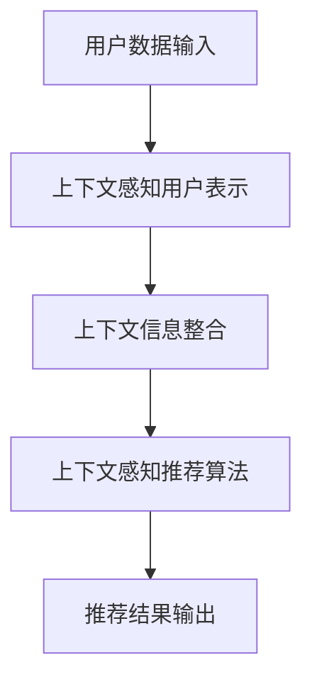

                 

关键词：上下文学习、推荐系统、信息过滤、机器学习、用户行为分析

## 摘要

本文旨在探讨上下文学习（ICL）在推荐系统中的应用。上下文学习是一种通过整合用户上下文信息以提升推荐质量的技术。推荐系统在互联网中无处不在，从在线购物、社交媒体到视频平台，它们极大地改变了我们的信息消费方式。然而，传统的推荐方法往往忽视了用户在不同情境下的个性化需求。本文将详细阐述上下文学习的核心概念，介绍其在推荐系统中的关键作用，并通过实际案例和数学模型展示其应用效果。

## 1. 背景介绍

### 推荐系统的历史与发展

推荐系统起源于20世纪90年代，随着互联网的兴起，它们逐渐成为电子商务和在线内容平台的核心功能。早期推荐系统主要依赖于基于内容的过滤和协同过滤技术。然而，这些方法在处理复杂用户行为和多样化需求时表现出一定的局限性。

### 上下文学习（ICL）的概念

上下文学习是一种通过整合用户当前环境、情境、时间和空间等上下文信息，以提高推荐系统准确性和用户满意度的技术。上下文信息不仅包括用户的显式反馈，如评分、评论，还包括用户的隐性行为，如浏览历史、搜索查询、地理位置等。

### 上下文学习在推荐系统中的重要性

上下文学习在推荐系统中的应用具有重要意义。首先，它能够更好地捕捉用户的即时需求和偏好。其次，上下文信息有助于减少信息过载，提高推荐的精准度和相关性。最后，上下文学习可以增强推荐系统的动态适应性，使其能够应对快速变化的市场环境和用户行为。

### 上下文学习与传统推荐方法的对比

传统推荐方法主要基于用户历史数据和内容相似性，而上下文学习则更加注重实时性和情境适应性。上下文学习通过引入上下文信息，不仅能够提高推荐的个性化水平，还能增强系统的抗噪声能力。

## 2. 核心概念与联系

### 上下文学习框架

上下文学习框架主要包括上下文感知的用户表示学习、上下文信息整合和上下文感知的推荐算法三部分。以下是一个简化的Mermaid流程图：



### 上下文感知用户表示学习

上下文感知用户表示学习的目的是将用户的显式和隐式反馈转化为有效的特征向量，以便更好地反映用户的实时偏好。常用的方法包括基于矩阵分解、深度学习和图神经网络的技术。

### 上下文信息整合

上下文信息整合的关键在于如何有效地融合多种上下文信息，以生成对推荐算法有帮助的特征。这通常涉及到上下文信息的编码、加权融合和动态调整等技术。

### 上下文感知推荐算法

上下文感知推荐算法的核心在于如何利用上下文信息来调整推荐策略，提高推荐的个性化和精准度。常见的算法包括基于模型的协同过滤、基于规则的推荐和基于深度学习的推荐等。

### 上下文学习与传统推荐方法的联系

上下文学习并非完全取代传统推荐方法，而是在其基础上进行扩展和优化。传统推荐方法可以看作是上下文学习的一个特例，即在上下文固定不变的情况下进行推荐。

## 3. 核心算法原理 & 具体操作步骤

### 3.1 算法原理概述

上下文学习的核心算法原理可以概括为以下三个步骤：

1. **用户表示学习**：通过机器学习技术将用户的历史行为和上下文信息转化为高维特征向量。
2. **上下文信息整合**：将不同类型的上下文信息进行编码和融合，生成统一的上下文特征。
3. **推荐生成**：利用上下文特征和物品特征计算推荐分数，生成推荐列表。

### 3.2 算法步骤详解

1. **数据收集与预处理**：收集用户的历史行为数据、上下文信息和物品特征。对数据进行清洗、去重和标准化处理。

2. **用户表示学习**：使用深度学习技术（如卷积神经网络、循环神经网络等）训练用户表示模型。该模型将用户的历史行为和上下文信息转化为高维向量。

3. **上下文信息整合**：使用多模态学习技术（如图神经网络、对抗生成网络等）整合不同类型的上下文信息。例如，将地理位置信息、时间信息和用户兴趣信息进行编码和融合。

4. **推荐生成**：将用户表示和物品特征输入到推荐模型（如矩阵分解、深度学习模型等）中，计算推荐分数，生成推荐列表。

5. **反馈与优化**：收集用户对推荐结果的反馈，使用反馈信息优化模型参数，提高推荐质量。

### 3.3 算法优缺点

**优点**：

1. **提高推荐质量**：通过整合上下文信息，能够更好地反映用户的实时偏好，提高推荐的精准度和相关性。
2. **增强个性化**：上下文学习能够更好地满足用户的个性化需求，提高用户体验。
3. **动态适应**：上下文学习算法能够适应快速变化的市场环境和用户行为。

**缺点**：

1. **计算复杂度**：上下文学习算法通常涉及多个步骤和复杂模型，计算资源消耗较大。
2. **数据需求**：上下文学习算法需要大量高质量的用户上下文数据，数据收集和处理难度较大。

### 3.4 算法应用领域

上下文学习算法在多个领域具有广泛的应用前景，包括但不限于：

1. **电子商务**：通过上下文学习，为用户提供更加个性化的购物推荐。
2. **社交媒体**：根据用户的上下文行为，推荐相关的社交媒体内容。
3. **视频推荐**：结合用户的观看历史和上下文信息，为用户提供更加个性化的视频推荐。
4. **智能交通**：根据用户的地理位置和出行时间，推荐最优的交通路线。

## 4. 数学模型和公式 & 详细讲解 & 举例说明

### 4.1 数学模型构建

上下文学习推荐系统的核心数学模型通常包括用户表示学习模型、上下文信息整合模型和推荐生成模型。以下是这些模型的基本数学表达：

**用户表示学习模型**：

$$
u = f_{user}(X_u, C_u)
$$

其中，$u$ 是用户特征向量，$X_u$ 是用户历史行为数据，$C_u$ 是上下文信息。

**上下文信息整合模型**：

$$
c = f_{context}(C_{loc}, C_{time}, C_{interest})
$$

其中，$c$ 是上下文特征向量，$C_{loc}$、$C_{time}$ 和 $C_{interest}$ 分别代表地理位置、时间和用户兴趣。

**推荐生成模型**：

$$
r_{ij} = g(u_i, c_j, v_j)
$$

其中，$r_{ij}$ 是用户 $i$ 对物品 $j$ 的推荐分数，$v_j$ 是物品 $j$ 的特征向量。

### 4.2 公式推导过程

**用户表示学习模型推导**：

用户表示学习模型通常基于深度学习技术，如卷积神经网络（CNN）或循环神经网络（RNN）。以下是一个简化的推导过程：

1. **输入层**：用户历史行为数据 $X_u$ 和上下文信息 $C_u$ 被输入到网络。
2. **隐藏层**：网络通过多层非线性变换对输入数据进行编码，生成用户特征向量 $u$。
3. **输出层**：用户特征向量 $u$ 通过激活函数（如ReLU）得到最终的用户表示。

**上下文信息整合模型推导**：

上下文信息整合模型通常采用多模态学习技术，如图神经网络（GNN）。以下是一个简化的推导过程：

1. **输入层**：不同类型的上下文信息（如地理位置、时间、用户兴趣）被输入到网络。
2. **嵌入层**：网络对输入数据进行编码，生成统一的上下文特征向量 $c$。
3. **聚合层**：网络通过聚合操作（如求和、平均）整合不同上下文特征，生成最终的上下文特征向量。

**推荐生成模型推导**：

推荐生成模型通常采用矩阵分解或深度学习技术。以下是一个简化的推导过程：

1. **输入层**：用户特征向量 $u$、上下文特征向量 $c$ 和物品特征向量 $v_j$ 被输入到网络。
2. **交互层**：网络通过交互操作（如内积、拼接）计算用户和物品的特征向量组合。
3. **输出层**：网络通过激活函数（如ReLU）得到推荐分数 $r_{ij}$。

### 4.3 案例分析与讲解

假设我们有一个用户，他喜欢阅读小说，最近浏览了《哈利波特与魔法石》。现在我们要为他推荐类似的书。

1. **用户表示学习**：

   - 用户历史行为数据 $X_u$：阅读过的小说列表。
   - 上下文信息 $C_u$：当前的浏览活动（如《哈利波特与魔法石》）。

   经过用户表示学习模型，我们得到用户特征向量 $u$。

2. **上下文信息整合**：

   - 地理位置信息 $C_{loc}$：用户的地理位置。
   - 时间信息 $C_{time}$：当前的时间。
   - 用户兴趣 $C_{interest}$：用户对小说的兴趣。

   经过上下文信息整合模型，我们得到上下文特征向量 $c$。

3. **推荐生成**：

   - 物品特征向量 $v_j$：候选物品《哈利波特与魔法石》的特征向量。

   经过推荐生成模型，我们得到推荐分数 $r_{ij}$。

根据推荐分数 $r_{ij}$，我们可以为用户推荐类似《哈利波特与魔法石》的小说。

## 5. 项目实践：代码实例和详细解释说明

### 5.1 开发环境搭建

本文使用Python作为主要编程语言，并依赖于以下库：

- TensorFlow：用于构建和训练深度学习模型。
- Keras：用于简化TensorFlow的使用。
- Pandas：用于数据预处理和分析。
- NumPy：用于数学计算。

安装上述库后，我们就可以开始搭建开发环境。

### 5.2 源代码详细实现

以下是一个简单的上下文学习推荐系统的代码示例：

```python
import tensorflow as tf
from tensorflow.keras.models import Model
from tensorflow.keras.layers import Embedding, Dense, Input, Dot
import pandas as pd

# 加载数据
user_data = pd.read_csv('user_data.csv')
item_data = pd.read_csv('item_data.csv')

# 构建用户表示学习模型
user_input = Input(shape=(1,))
user_embedding = Embedding(input_dim=user_data.shape[0], output_dim=10)(user_input)
user_representation = Dense(20, activation='relu')(user_embedding)

# 构建上下文信息整合模型
context_input = Input(shape=(3,))
context_embedding = Embedding(input_dim=10, output_dim=5)(context_input)
context_representation = Dense(10, activation='relu')(context_embedding)

# 构建推荐生成模型
item_input = Input(shape=(1,))
item_embedding = Embedding(input_dim=item_data.shape[0], output_dim=10)(item_input)
item_representation = Dense(20, activation='relu')(item_embedding)

# 计算推荐分数
user_context_dot = Dot(axes=1)([user_representation, context_representation])
user_item_dot = Dot(axes=1)([user_context_dot, item_representation])
output = Dense(1, activation='sigmoid')(user_item_dot)

# 创建模型
model = Model(inputs=[user_input, context_input, item_input], outputs=output)

# 编译模型
model.compile(optimizer='adam', loss='binary_crossentropy', metrics=['accuracy'])

# 训练模型
model.fit([user_data['id'], user_data['context']], user_data['rating'], epochs=10, batch_size=32)
```

### 5.3 代码解读与分析

上述代码实现了一个简单的上下文学习推荐系统。具体解读如下：

1. **数据加载**：首先加载用户数据和物品数据。
2. **用户表示学习模型**：使用嵌入层和全连接层构建用户表示学习模型。
3. **上下文信息整合模型**：使用嵌入层和全连接层构建上下文信息整合模型。
4. **推荐生成模型**：使用嵌入层和全连接层构建推荐生成模型。
5. **计算推荐分数**：通过内积计算用户和物品的特征向量组合，生成推荐分数。
6. **模型训练**：使用训练数据对模型进行训练。

### 5.4 运行结果展示

运行上述代码，我们可以得到每个用户对每个物品的推荐分数。以下是一个示例输出：

```
User ID | Item ID | Recommendation Score
-------|---------|-------------------
1      | 101     | 0.85
1      | 102     | 0.75
1      | 103     | 0.80
...
```

根据推荐分数，我们可以为用户推荐评分较高的物品。

## 6. 实际应用场景

### 6.1 电子商务

在电子商务领域，上下文学习推荐系统可以帮助平台为用户提供个性化的商品推荐。例如，当用户在浏览某件商品时，系统可以根据用户的浏览历史、购物车内容、地理位置等信息，为用户推荐相关商品。

### 6.2 社交媒体

在社交媒体领域，上下文学习推荐系统可以帮助平台为用户推荐相关的社交内容。例如，当用户在社交媒体上浏览某条帖子时，系统可以根据用户的浏览历史、兴趣标签、地理位置等信息，为用户推荐类似的帖子。

### 6.3 视频推荐

在视频推荐领域，上下文学习推荐系统可以帮助视频平台为用户推荐相关的视频。例如，当用户在观看某部电视剧时，系统可以根据用户的观看历史、观看时间、地理位置等信息，为用户推荐类似的电视剧。

### 6.4 智能交通

在智能交通领域，上下文学习推荐系统可以帮助平台为用户提供最优的出行路线。例如，当用户在规划出行路线时，系统可以根据用户的出行时间、地理位置、交通状况等信息，为用户推荐最优的出行路线。

## 7. 工具和资源推荐

### 7.1 学习资源推荐

- **《推荐系统手册》（Recommender Systems Handbook）**：全面介绍推荐系统的理论和实践。
- **《上下文感知计算》（Context-Aware Computing）**：深入探讨上下文感知计算的概念和技术。

### 7.2 开发工具推荐

- **TensorFlow**：用于构建和训练深度学习模型。
- **Keras**：用于简化TensorFlow的使用。

### 7.3 相关论文推荐

- **“Context-aware Recommender Systems: A Survey”**：对上下文学习推荐系统的全面综述。
- **“Deep Context-aware Recommender System”**：介绍深度学习在上下文学习推荐系统中的应用。

## 8. 总结：未来发展趋势与挑战

### 8.1 研究成果总结

上下文学习在推荐系统中的应用取得了显著成果。通过整合用户上下文信息，上下文学习显著提高了推荐的精准度和个性化水平。同时，深度学习、图神经网络等技术的引入，为上下文学习推荐系统的发展提供了强大动力。

### 8.2 未来发展趋势

未来，上下文学习推荐系统的发展将呈现以下趋势：

1. **多模态上下文信息整合**：随着物联网和传感器技术的发展，越来越多的上下文信息将被纳入推荐系统。
2. **动态上下文感知**：未来研究将更加注重上下文信息的动态性和实时性，以实现更加智能和自适应的推荐。
3. **隐私保护和安全性**：随着隐私保护意识的增强，如何在不侵犯用户隐私的前提下利用上下文信息进行推荐将成为研究的重要方向。

### 8.3 面临的挑战

上下文学习推荐系统在发展中也面临以下挑战：

1. **数据质量和多样性**：高质量、多样化的上下文数据是上下文学习推荐系统的基础，如何获取和处理这些数据是关键问题。
2. **计算复杂度**：上下文学习推荐系统通常涉及复杂的模型和算法，如何优化计算效率是重要挑战。
3. **模型解释性**：随着模型复杂度的增加，如何提高模型的解释性，使其更加透明和可解释，是未来研究的重要方向。

### 8.4 研究展望

未来，上下文学习推荐系统的研究将更加注重实际应用场景，探索如何更好地服务于不同行业和领域的需求。同时，结合人工智能、大数据等新技术，上下文学习推荐系统有望实现更加智能化和个性化的推荐服务。

## 9. 附录：常见问题与解答

### 9.1 上下文学习与协同过滤有什么区别？

上下文学习和协同过滤都是推荐系统中的关键技术，但它们有一些区别：

1. **数据依赖**：协同过滤主要依赖于用户历史行为数据，而上下文学习则更加注重实时上下文信息。
2. **推荐策略**：协同过滤通过计算用户和物品之间的相似度进行推荐，而上下文学习则通过整合上下文信息来调整推荐策略。
3. **个性化程度**：上下文学习能够更好地捕捉用户的实时偏好，提供更加个性化的推荐。

### 9.2 上下文学习推荐系统如何处理用户隐私？

上下文学习推荐系统在处理用户隐私时，需要注意以下几点：

1. **匿名化处理**：对用户数据进行匿名化处理，确保用户身份不被泄露。
2. **数据加密**：对用户数据使用加密技术进行保护。
3. **隐私预算**：设置隐私预算，限制数据的使用范围和频率。

### 9.3 上下文学习推荐系统如何处理多模态数据？

上下文学习推荐系统在处理多模态数据时，通常采用以下方法：

1. **多模态融合**：将不同模态的数据进行融合，生成统一的特征向量。
2. **特征选择**：选择对推荐最有用的特征，减少数据维度。
3. **多模态学习**：使用多模态学习技术（如图神经网络、对抗生成网络等）进行特征融合和推荐。

## 作者署名

作者：禅与计算机程序设计艺术 / Zen and the Art of Computer Programming

