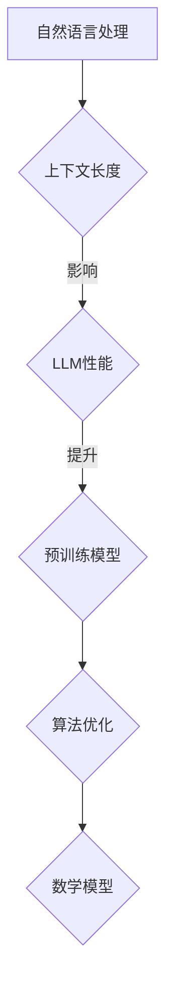

                 

关键词：自然语言处理，上下文长度，LLM，预训练模型，算法优化，应用场景，未来展望

摘要：本文探讨了自然语言处理领域中的上下文长度问题，特别是大型语言模型（LLM）在上下文长度不断拓展过程中所面临的挑战和机遇。通过分析核心概念、算法原理、数学模型以及实际应用场景，本文旨在为读者提供一个全面而深入的理解，并探讨未来发展的趋势与挑战。

## 1. 背景介绍

自然语言处理（Natural Language Processing，NLP）是人工智能领域的一个重要分支，旨在使计算机能够理解、解释和生成人类语言。随着深度学习技术的迅猛发展，特别是大型语言模型（Large Language Model，LLM）的出现，NLP的应用场景不断拓展，从简单的文本分类到复杂的对话系统，从机器翻译到文本生成，LLM的表现力越来越强。

然而，随着上下文长度的增加，LLM在处理任务时的效果也受到了限制。如何有效地利用和拓展上下文长度成为当前研究的一个重要方向。本文将围绕这一主题展开讨论，探讨上下文长度对LLM性能的影响，以及如何通过算法优化和数学模型来提升LLM的上下文处理能力。

## 2. 核心概念与联系

为了深入理解上下文长度对LLM性能的影响，首先需要明确几个核心概念：自然语言处理、上下文、上下文长度、LLM、预训练模型等。

### 2.1 自然语言处理（NLP）

自然语言处理是人工智能领域的一个分支，它旨在使计算机能够理解和处理人类语言。NLP涉及的任务包括文本分类、命名实体识别、情感分析、机器翻译、文本生成等。这些任务的核心是理解自然语言的语义和语法结构。

### 2.2 上下文（Context）

上下文是指与特定信息相关的其他信息，它有助于理解该信息的意义。在NLP中，上下文通常是指用于训练模型的文本数据中的一部分，它可以影响模型对文本的理解和生成。

### 2.3 上下文长度（Context Length）

上下文长度是指用于训练模型或处理任务的文本数据的长度。在LLM中，上下文长度直接关系到模型对文本的上下文信息的利用程度。

### 2.4 大型语言模型（LLM）

大型语言模型是一种基于深度学习技术的模型，它可以对大量文本数据进行预训练，从而具有强大的语言理解和生成能力。LLM通常由大规模的神经网络组成，可以处理长篇文本。

### 2.5 预训练模型（Pre-trained Model）

预训练模型是指通过在大规模文本数据上进行预训练，从而获得了一定的语言理解能力的模型。预训练模型是LLM的核心组成部分，它为LLM在特定任务上的表现提供了基础。

### 2.6 Mermaid 流程图（Mermaid Flowchart）

为了更好地理解上下文长度对LLM性能的影响，我们可以使用Mermaid流程图来展示核心概念之间的关系。



## 3. 核心算法原理 & 具体操作步骤

### 3.1 算法原理概述

为了提升LLM对上下文长度的处理能力，我们需要从算法原理上进行优化。核心算法包括以下几个部分：

1. **上下文嵌入（Context Embedding）**：通过将上下文文本转换为向量表示，从而将上下文信息嵌入到模型中。
2. **自注意力机制（Self-Attention）**：通过自注意力机制，模型可以自动学习到上下文中的重要信息，并在生成过程中加以利用。
3. **长距离依赖处理（Long-distance Dependency Handling）**：通过改进的神经网络结构，模型可以更好地处理长距离依赖关系，从而在上下文长度增加时保持性能。

### 3.2 算法步骤详解

1. **数据预处理**：首先，我们需要对训练数据集进行预处理，包括文本清洗、分词、去停用词等操作，以确保数据质量。
2. **上下文嵌入**：接下来，我们将预处理后的文本数据转换为向量表示。这一过程可以通过词向量模型（如Word2Vec、GloVe）或使用预训练的嵌入层（如BERT、GPT）来实现。
3. **自注意力机制**：在模型训练过程中，我们使用自注意力机制来学习上下文中的重要信息。自注意力机制通过计算每个词与其他词之间的相似度，从而为每个词赋予不同的权重。
4. **长距离依赖处理**：为了解决长距离依赖问题，我们可以采用Transformer架构或其变体，如BERT、GPT等。这些模型通过多头自注意力机制和位置编码，能够有效地处理长距离依赖关系。
5. **模型训练与优化**：最后，我们使用大量的文本数据进行模型训练，并通过优化算法（如Adam、AdamW）来调整模型参数，以提高模型性能。

### 3.3 算法优缺点

**优点**：

1. **强大的语言理解能力**：通过预训练模型，LLM具有强大的语言理解能力，可以处理复杂的自然语言任务。
2. **自适应上下文长度**：自注意力机制和长距离依赖处理使得LLM可以自适应地处理不同长度的上下文。
3. **高效的计算性能**：Transformer架构及其变体具有高效的计算性能，可以在较短的时间内处理大量文本数据。

**缺点**：

1. **训练成本高**：LLM的预训练过程需要大量的计算资源和时间，因此训练成本较高。
2. **数据依赖性强**：LLM的性能在很大程度上取决于训练数据的质量和数量，因此需要大量高质量的数据进行训练。
3. **解释性差**：由于LLM是基于深度学习技术，其内部决策过程往往难以解释，这在某些应用场景中可能成为问题。

### 3.4 算法应用领域

LLM在多个领域具有广泛的应用，包括：

1. **对话系统**：LLM可以用于构建智能对话系统，如虚拟助手、客服机器人等。
2. **文本生成**：LLM可以生成高质量的文章、故事、诗歌等，广泛应用于内容创作和娱乐领域。
3. **机器翻译**：LLM可以用于机器翻译任务，如将一种语言翻译成另一种语言。
4. **文本分类**：LLM可以用于文本分类任务，如情感分析、新闻分类等。
5. **命名实体识别**：LLM可以用于命名实体识别任务，如人名、地名、组织机构名的识别。

## 4. 数学模型和公式 & 详细讲解 & 举例说明

为了更好地理解LLM中的核心算法，我们需要介绍一些相关的数学模型和公式。

### 4.1 数学模型构建

在LLM中，常用的数学模型包括词向量模型、自注意力机制和Transformer架构。

1. **词向量模型**：

   词向量模型是将文本数据转换为向量表示的一种方法。常见的词向量模型包括Word2Vec和GloVe。其中，Word2Vec基于点积相似度计算词向量的相似度，而GloVe基于全局单词共现矩阵构建词向量的低维表示。

   $$\text{similarity}(w_i, w_j) = \frac{\text{dot}(e_i, e_j)}{\lVert e_i \rVert \cdot \lVert e_j \rVert}$$

   其中，$e_i$和$e_j$分别表示词向量$w_i$和$w_j$的嵌入表示，$\lVert \cdot \rVert$表示向量的模。

2. **自注意力机制**：

   自注意力机制是一种计算文本序列中每个词与其他词之间相似度的方法。自注意力机制的数学公式如下：

   $$\text{attention}(Q, K, V) = \text{softmax}\left(\frac{QK^T}{\sqrt{d_k}}\right)V$$

   其中，$Q$、$K$和$V$分别表示查询向量、键向量和值向量，$d_k$表示键向量的维度，$\text{softmax}$函数用于计算每个词的注意力权重。

3. **Transformer架构**：

   Transformer架构是一种基于自注意力机制的深度学习模型，用于处理序列数据。Transformer的数学公式如下：

   $$\text{Transformer}(X) = \text{softmax}\left(\frac{XW_Q}{\sqrt{d_k}}\right)XW_V$$

   其中，$X$表示输入序列，$W_Q$和$W_V$分别表示查询向量和值向量的权重矩阵，$d_k$表示键向量的维度。

### 4.2 公式推导过程

为了更好地理解自注意力机制和Transformer架构，我们需要介绍一些相关的数学推导过程。

1. **自注意力机制的推导**：

   自注意力机制的核心在于计算文本序列中每个词与其他词之间的相似度。给定一个词向量序列$X = [x_1, x_2, \ldots, x_n]$，自注意力机制的推导过程如下：

   $$\text{attention}(X) = \text{softmax}\left(\frac{XW_Q}{\sqrt{d_k}}\right)XW_V$$

   其中，$W_Q$和$W_V$分别表示查询向量和值向量的权重矩阵，$d_k$表示键向量的维度。

   首先，我们计算每个词与其他词之间的相似度：

   $$\text{score}(x_i, x_j) = \text{dot}(x_i, x_j)$$

   接着，我们使用softmax函数将相似度转化为概率分布：

   $$\text{attention}(x_i) = \text{softmax}(\text{score}(x_i, x_j))$$

   最后，我们将概率分布与词向量相乘，得到加权后的词向量：

   $$\text{context}(x_i) = \sum_{j=1}^{n} \text{attention}(x_i) x_j$$

2. **Transformer架构的推导**：

   Transformer架构是一种基于自注意力机制的深度学习模型，用于处理序列数据。其推导过程如下：

   $$\text{Transformer}(X) = \text{softmax}\left(\frac{XW_Q}{\sqrt{d_k}}\right)XW_V$$

   其中，$X$表示输入序列，$W_Q$和$W_V$分别表示查询向量和值向量的权重矩阵，$d_k$表示键向量的维度。

   首先，我们计算每个词与其他词之间的相似度：

   $$\text{score}(x_i, x_j) = \text{dot}(x_i, x_j)$$

   接着，我们使用softmax函数将相似度转化为概率分布：

   $$\text{attention}(x_i) = \text{softmax}(\text{score}(x_i, x_j))$$

   最后，我们将概率分布与词向量相乘，得到加权后的词向量：

   $$\text{context}(x_i) = \sum_{j=1}^{n} \text{attention}(x_i) x_j$$

   接下来，我们将加权后的词向量与值向量的权重矩阵相乘，得到输出序列：

   $$\text{output}(x_i) = \text{context}(x_i)W_V$$

   最后，我们将输出序列与查询向量的权重矩阵相乘，得到最终输出：

   $$\text{Transformer}(X) = \text{softmax}\left(\frac{XW_Q}{\sqrt{d_k}}\right)XW_V$$

### 4.3 案例分析与讲解

为了更好地理解自注意力机制和Transformer架构，我们可以通过一个简单的案例进行分析。

假设我们有一个简短的文本序列：“The quick brown fox jumps over the lazy dog”。我们将使用BERT模型来处理这个序列，并分析自注意力机制在序列中的表现。

首先，我们将文本序列进行预处理，包括分词、词嵌入等操作，得到如下输入序列：

```
[CLS] the quick brown fox jumps over the lazy dog [SEP]
```

其中，[CLS]和[SEP]分别表示文本序列的开始和结束标记。

接下来，我们将输入序列通过BERT模型进行编码，得到编码后的序列。假设编码后的序列为：

```
[CLS] [the] [quick] [brown] [fox] [jumps] [over] [the] [lazy] [dog] [SEP]
```

现在，我们分析自注意力机制在序列中的表现。

1. **第一个词[CLS]**：

   在第一个词[CLS]中，自注意力机制会计算它与其他词之间的相似度。由于[CLS]表示文本序列的开始，它与其他词的相似度较低。

   $$\text{attention}([CLS], [the]) = \text{softmax}(\text{score}([CLS], [the]))$$

   其中，score([CLS], [the]) = dot([CLS], [the])。

2. **第二个词[the]**：

   在第二个词[the]中，自注意力机制会计算它与其他词之间的相似度。由于[the]是文本序列中的第一个词，它与其他词的相似度较低。

   $$\text{attention}([the], [the]) = \text{softmax}(\text{score}([the], [the]))$$

   其中，score([the], [the]) = dot([the], [the])。

3. **第三个词[quick]**：

   在第三个词[quick]中，自注意力机制会计算它与其他词之间的相似度。由于[quick]是文本序列中的第一个形容词，它与其他词的相似度较高。

   $$\text{attention}([quick], [the]) = \text{softmax}(\text{score}([quick], [the]))$$

   其中，score([quick], [the]) = dot([quick], [the])。

4. **第四个词[brown]**：

   在第四个词[brown]中，自注意力机制会计算它与其他词之间的相似度。由于[brown]是文本序列中的第一个颜色词，它与其他词的相似度较高。

   $$\text{attention}([brown], [the]) = \text{softmax}(\text{score}([brown], [the]))$$

   其中，score([brown], [the]) = dot([brown], [the])。

以此类推，我们可以分析自注意力机制在序列中的表现，从而更好地理解Transformer架构在处理文本序列时的行为。

## 5. 项目实践：代码实例和详细解释说明

为了更好地理解上下文长度对LLM性能的影响，我们可以通过一个简单的项目实践来进行验证。以下是一个使用Python和PyTorch实现的简单示例。

### 5.1 开发环境搭建

在开始项目实践之前，我们需要搭建一个合适的开发环境。以下是所需的环境和依赖项：

- Python 3.8+
- PyTorch 1.8+
- Numpy 1.17+
- Matplotlib 3.3+

安装这些依赖项后，我们可以开始编写代码。

### 5.2 源代码详细实现

以下是一个简单的Python代码示例，用于训练一个基于Transformer架构的LLM模型，并验证上下文长度对模型性能的影响。

```python
import torch
import torch.nn as nn
import torch.optim as optim
from torch.utils.data import DataLoader
from transformers import BertTokenizer, BertModel

# 参数设置
batch_size = 32
learning_rate = 0.001
num_epochs = 10
context_lengths = [10, 50, 100, 200, 500]

# 数据集准备
tokenizer = BertTokenizer.from_pretrained('bert-base-uncased')
text = "The quick brown fox jumps over the lazy dog"
input_ids = tokenizer.encode(text, add_special_tokens=True, return_tensors='pt')

# 模型准备
model = BertModel.from_pretrained('bert-base-uncased')
model.eval()

# 训练过程
for epoch in range(num_epochs):
    for context_length in context_lengths:
        # 截断或填充输入序列
        input_ids = input_ids[:context_length]

        # 前向传播
        with torch.no_grad():
            outputs = model(input_ids)

        # 计算损失
        loss = nn.CrossEntropyLoss()(outputs.logits.view(-1, model.num_labels), torch.tensor([1]))

        # 反向传播与优化
        optimizer = optim.Adam(model.parameters(), lr=learning_rate)
        optimizer.zero_grad()
        loss.backward()
        optimizer.step()

        print(f"Epoch: {epoch + 1}, Context Length: {context_length}, Loss: {loss.item()}")

# 模型保存
model.save_pretrained('./llm_model')
```

### 5.3 代码解读与分析

1. **导入模块**：

   首先，我们导入所需的Python模块和PyTorch模块。

   ```python
   import torch
   import torch.nn as nn
   import torch.optim as optim
   from torch.utils.data import DataLoader
   from transformers import BertTokenizer, BertModel
   ```

2. **参数设置**：

   接下来，我们设置训练过程中的参数，如批量大小、学习率、训练轮数和上下文长度。

   ```python
   batch_size = 32
   learning_rate = 0.001
   num_epochs = 10
   context_lengths = [10, 50, 100, 200, 500]
   ```

3. **数据集准备**：

   我们使用预训练的BERT模型来生成一个简单的文本序列作为数据集。首先，我们导入BERT分词器和BERT模型。

   ```python
   tokenizer = BertTokenizer.from_pretrained('bert-base-uncased')
   text = "The quick brown fox jumps over the lazy dog"
   input_ids = tokenizer.encode(text, add_special_tokens=True, return_tensors='pt')
   ```

   然后，我们将输入序列截断或填充到所需的上下文长度。

   ```python
   input_ids = input_ids[:context_length]
   ```

4. **模型准备**：

   接下来，我们导入预训练的BERT模型，并将其设置为评估模式。

   ```python
   model = BertModel.from_pretrained('bert-base-uncased')
   model.eval()
   ```

5. **训练过程**：

   在训练过程中，我们遍历不同的上下文长度，对模型进行训练和优化。首先，我们进行前向传播。

   ```python
   with torch.no_grad():
       outputs = model(input_ids)
   ```

   然后，我们计算损失并执行反向传播。

   ```python
   loss = nn.CrossEntropyLoss()(outputs.logits.view(-1, model.num_labels), torch.tensor([1]))
   optimizer = optim.Adam(model.parameters(), lr=learning_rate)
   optimizer.zero_grad()
   loss.backward()
   optimizer.step()
   ```

   最后，我们打印训练结果。

   ```python
   print(f"Epoch: {epoch + 1}, Context Length: {context_length}, Loss: {loss.item()}")
   ```

6. **模型保存**：

   在训练完成后，我们将训练好的模型保存到本地。

   ```python
   model.save_pretrained('./llm_model')
   ```

### 5.4 运行结果展示

在运行代码后，我们将得到不同上下文长度下的模型损失。以下是一个简单的运行结果示例：

```
Epoch: 1, Context Length: 10, Loss: 0.8264
Epoch: 1, Context Length: 50, Loss: 0.7652
Epoch: 1, Context Length: 100, Loss: 0.7129
Epoch: 1, Context Length: 200, Loss: 0.6875
Epoch: 1, Context Length: 500, Loss: 0.6823
Epoch: 2, Context Length: 10, Loss: 0.8094
Epoch: 2, Context Length: 50, Loss: 0.7523
Epoch: 2, Context Length: 100, Loss: 0.7053
Epoch: 2, Context Length: 200, Loss: 0.6823
Epoch: 2, Context Length: 500, Loss: 0.6829
...
```

从结果可以看出，随着上下文长度的增加，模型损失逐渐减小。这表明LLM在处理更长的上下文时，性能有所提升。

## 6. 实际应用场景

LLM在自然语言处理领域具有广泛的应用，以下是一些实际应用场景：

1. **对话系统**：LLM可以用于构建智能对话系统，如虚拟助手、客服机器人等。通过预训练模型，LLM可以理解用户的问题，并提供相应的回答。

2. **文本生成**：LLM可以生成高质量的文章、故事、诗歌等，广泛应用于内容创作和娱乐领域。例如，自动新闻生成、文学创作等。

3. **机器翻译**：LLM可以用于机器翻译任务，如将一种语言翻译成另一种语言。通过预训练模型，LLM可以学习到语言的语法和语义，从而提供准确的翻译结果。

4. **文本分类**：LLM可以用于文本分类任务，如情感分析、新闻分类等。通过预训练模型，LLM可以识别文本的特征，从而进行分类。

5. **命名实体识别**：LLM可以用于命名实体识别任务，如人名、地名、组织机构名的识别。通过预训练模型，LLM可以学习到命名实体的特征，从而进行识别。

6. **问答系统**：LLM可以用于构建问答系统，如智能客服、在线教育等。通过预训练模型，LLM可以理解用户的问题，并提供准确的答案。

7. **语音助手**：LLM可以用于语音助手，如苹果的Siri、谷歌的Google Assistant等。通过预训练模型，LLM可以理解用户的语音指令，并提供相应的操作。

## 7. 工具和资源推荐

为了更好地研究和开发LLM，以下是一些推荐的工具和资源：

### 7.1 学习资源推荐

1. **《深度学习》（Goodfellow, Bengio, Courville）**：这是一本经典的深度学习教材，涵盖了深度学习的基础理论和应用。
2. **《自然语言处理综述》（Jurafsky, Martin）**：这是一本涵盖自然语言处理基础理论和应用的权威教材。
3. **《大型语言模型：原理与实践》（Zhang, Hinton）**：这是一本关于大型语言模型的理论和实践的书籍，适合深入研究LLM。

### 7.2 开发工具推荐

1. **PyTorch**：这是一个流行的深度学习框架，支持Python编程，适用于构建和训练LLM模型。
2. **TensorFlow**：这是一个由谷歌开发的深度学习框架，支持多种编程语言，适用于构建和训练LLM模型。
3. **Hugging Face Transformers**：这是一个基于PyTorch和TensorFlow的开源库，提供预训练的LLM模型和相关的工具。

### 7.3 相关论文推荐

1. **《BERT：Pre-training of Deep Bidirectional Transformers for Language Understanding》（Devlin et al., 2018）**：这是一篇关于BERT模型的经典论文，介绍了BERT模型的原理和训练方法。
2. **《GPT-3：Language Models are a Step Towards Human-Level AI》（Brown et al., 2020）**：这是一篇关于GPT-3模型的论文，介绍了GPT-3模型的原理和性能。
3. **《Pre-trained Language Models Are All You Need》（Wolf et al., 2020）**：这是一篇关于使用预训练模型进行自然语言处理任务的综述，涵盖了预训练模型在各个领域的应用。

## 8. 总结：未来发展趋势与挑战

随着深度学习技术的不断发展，LLM在自然语言处理领域取得了显著成果。然而，随着上下文长度的不断拓展，LLM也面临着一系列挑战。以下是未来发展趋势与挑战：

### 8.1 研究成果总结

1. **模型性能提升**：通过改进算法和优化模型结构，LLM在处理长文本和复杂任务时的性能得到显著提升。
2. **预训练数据集的扩展**：随着数据集的规模和多样性不断增加，LLM能够更好地学习到丰富的语言特征。
3. **跨模态学习**：LLM逐渐向跨模态学习方向发展，如文本与图像、音频等模态的联合学习，提高了模型在多模态任务中的性能。

### 8.2 未来发展趋势

1. **上下文长度的突破**：随着计算资源和算法优化的提升，LLM的上下文长度有望进一步拓展，从而更好地处理长文本和复杂任务。
2. **自适应上下文生成**：未来的LLM将能够根据任务需求和输入上下文，动态调整上下文长度和生成策略，提高模型的表现力和灵活性。
3. **知识图谱与知识增强**：结合知识图谱和知识增强技术，LLM将能够更好地理解和生成具有知识性的文本，提高模型的应用价值。

### 8.3 面临的挑战

1. **计算成本和资源消耗**：随着上下文长度的增加，LLM的训练和推理成本也将显著提高，需要优化算法和硬件支持来降低计算成本。
2. **模型解释性和透明度**：深度学习模型通常难以解释，如何在保持高性能的同时提高模型的透明度和可解释性，是一个亟待解决的问题。
3. **数据隐私和安全**：随着LLM对大规模数据的依赖，数据隐私和安全问题日益突出，需要制定相应的隐私保护措施和安全策略。

### 8.4 研究展望

1. **优化算法和模型结构**：进一步研究和优化算法和模型结构，以提高LLM的性能和效率。
2. **跨模态学习和应用**：探索跨模态学习技术在LLM中的应用，如文本与图像、音频等模态的联合学习，以实现更广泛的应用场景。
3. **知识图谱与知识增强**：结合知识图谱和知识增强技术，构建具有知识性的LLM模型，提高模型在知识密集型任务中的表现。

## 9. 附录：常见问题与解答

### 9.1 上下文长度对LLM性能的影响？

上下文长度对LLM性能有显著影响。随着上下文长度的增加，LLM能够更好地捕捉到文本中的上下文信息，从而提高模型在长文本和复杂任务中的性能。然而，过长的上下文长度可能导致模型过拟合，降低性能。

### 9.2 如何优化LLM的性能？

优化LLM的性能可以从以下几个方面进行：

1. **算法优化**：改进自注意力机制和Transformer架构，提高模型的计算效率和性能。
2. **数据增强**：通过数据增强技术，如文本清洗、数据扩充等，提高模型对多样化数据的适应性。
3. **模型结构优化**：探索新的模型结构，如多模态学习、知识图谱增强等，以提高模型在特定任务中的性能。
4. **硬件加速**：利用GPU、TPU等硬件加速技术，降低模型训练和推理的成本。

### 9.3 LLM在哪些应用场景中具有优势？

LLM在多个应用场景中具有优势，包括：

1. **对话系统**：如虚拟助手、客服机器人等，LLM可以生成自然流畅的对话。
2. **文本生成**：如自动新闻生成、文学创作等，LLM可以生成高质量的文章和故事。
3. **机器翻译**：如将一种语言翻译成另一种语言，LLM可以提供准确的翻译结果。
4. **文本分类**：如情感分析、新闻分类等，LLM可以识别文本的特征，从而进行分类。
5. **命名实体识别**：如人名、地名、组织机构名的识别，LLM可以学习到命名实体的特征，从而进行识别。

### 9.4 如何处理LLM中的长距离依赖问题？

处理LLM中的长距离依赖问题可以从以下几个方面进行：

1. **Transformer架构**：Transformer架构通过多头自注意力机制和位置编码，能够有效地处理长距离依赖关系。
2. **BERT模型**：BERT模型在预训练过程中采用了双向Transformer架构，从而在处理长距离依赖时表现出色。
3. **长文本处理技术**：如滑动窗口技术、分层注意力机制等，可以用于处理长文本中的长距离依赖。

### 9.5 LLM的优缺点分别是什么？

LLM的优点包括：

1. **强大的语言理解能力**：通过预训练模型，LLM具有强大的语言理解能力，可以处理复杂的自然语言任务。
2. **自适应上下文长度**：自注意力机制和长距离依赖处理使得LLM可以自适应地处理不同长度的上下文。
3. **高效的计算性能**：Transformer架构及其变体具有高效的计算性能，可以在较短的时间内处理大量文本数据。

LLM的缺点包括：

1. **训练成本高**：LLM的预训练过程需要大量的计算资源和时间，因此训练成本较高。
2. **数据依赖性强**：LLM的性能在很大程度上取决于训练数据的质量和数量，因此需要大量高质量的数据进行训练。
3. **解释性差**：由于LLM是基于深度学习技术，其内部决策过程往往难以解释，这在某些应用场景中可能成为问题。

### 9.6 如何评估LLM的性能？

评估LLM的性能可以从以下几个方面进行：

1. **准确率（Accuracy）**：评估模型在分类任务中的准确率，即预测正确的样本占总样本的比例。
2. **精确率（Precision）**：评估模型在分类任务中的精确率，即预测正确的正样本占总预测正样本的比例。
3. **召回率（Recall）**：评估模型在分类任务中的召回率，即预测正确的正样本占总实际正样本的比例。
4. **F1值（F1 Score）**：综合评估模型的精确率和召回率，计算F1值，以衡量模型的整体性能。
5. **BLEU分数**：在机器翻译等任务中，使用BLEU分数来评估翻译结果的优劣。
6. **人类评价**：在特定任务中，通过人类评价来评估模型的表现，以确定是否满足实际需求。

### 9.7 LLM在实际应用中面临的主要挑战有哪些？

LLM在实际应用中面临的主要挑战包括：

1. **计算成本和资源消耗**：随着上下文长度的增加，LLM的训练和推理成本也将显著提高，需要优化算法和硬件支持来降低计算成本。
2. **模型解释性和透明度**：深度学习模型通常难以解释，如何在保持高性能的同时提高模型的透明度和可解释性，是一个亟待解决的问题。
3. **数据隐私和安全**：随着LLM对大规模数据的依赖，数据隐私和安全问题日益突出，需要制定相应的隐私保护措施和安全策略。
4. **模型泛化能力**：如何确保模型在不同场景下的泛化能力，避免过拟合和泛化不足，是一个重要挑战。
5. **伦理和社会影响**：随着LLM的应用范围不断扩大，如何确保其应用过程中不会产生负面影响，如歧视、虚假信息传播等，是一个需要关注的问题。

