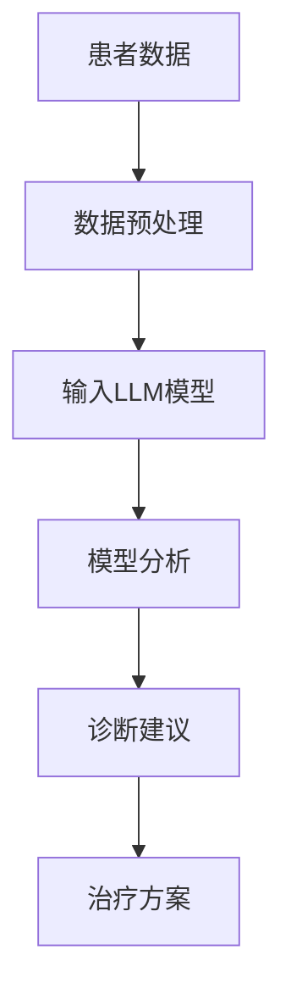

                 

 关键词：个性化医疗、LLM、深度学习、精准治疗、医疗数据、生物信息学、基因组学、医学影像、计算生物学

> 摘要：本文将深入探讨个性化医疗领域的最新发展，特别是大型语言模型（LLM）在医疗诊断、治疗方案设计中的应用。通过分析LLM的核心算法原理、数学模型、实际应用案例，本文旨在展示如何利用AI技术实现更精准的医疗治疗，为未来医疗行业带来革命性变革。

## 1. 背景介绍

个性化医疗（Personalized Medicine）是一种基于患者基因、环境、生活方式等个性化特征的医疗模式。其核心理念是“一人一方”，即针对每位患者的独特情况提供个性化的治疗方案。随着医疗技术的进步，尤其是基因组学和生物信息学的发展，个性化医疗逐渐成为现代医学的重要组成部分。

传统医疗模式中，医生通常依赖于经验和基于人群的平均数据来制定治疗方案。然而，由于个体差异，这种方法往往难以实现最佳疗效。例如，同一种药物在不同患者身上可能产生不同的副作用或治疗效果。而个性化医疗通过结合患者的具体生物学信息，能够提供更精准的治疗方案，从而提高治疗效果，减少副作用。

近年来，深度学习和人工智能（AI）技术的迅猛发展为个性化医疗带来了新的契机。特别是大型语言模型（LLM），如GPT、BERT等，通过处理和分析大量的医疗数据，能够在医疗诊断、治疗方案设计等方面发挥重要作用。

## 2. 核心概念与联系

### 2.1 LLM基本概念

大型语言模型（LLM）是一种基于深度学习的自然语言处理（NLP）模型，能够理解和生成人类语言。它们通常由数十亿个参数组成，通过大规模数据训练，从而具备强大的语言理解能力。LLM的核心优点在于其能够处理复杂的文本数据，进行文本生成、情感分析、信息提取等任务。

### 2.2 个性化医疗与LLM的联系

个性化医疗与LLM之间的联系主要体现在以下几个方面：

1. **医疗数据挖掘**：LLM能够处理大量的医疗数据，包括病历记录、医学影像、基因组数据等，从而挖掘出对患者治疗有价值的特征信息。

2. **诊断辅助**：LLM可以帮助医生进行疾病诊断，通过对患者症状、病史等信息的分析，提供可能的疾病预测和诊断建议。

3. **治疗方案设计**：根据患者的具体生物学特征，LLM可以生成个性化的治疗方案，为医生提供治疗建议。

### 2.3 Mermaid流程图



## 3. 核心算法原理 & 具体操作步骤

### 3.1 算法原理概述

LLM的核心原理是基于神经网络，通过多层感知器（MLP）和循环神经网络（RNN）等深度学习模型，实现对语言数据的处理和理解。具体来说，LLM通常由以下几个关键组成部分构成：

1. **嵌入层（Embedding Layer）**：将输入文本转换为向量表示，便于神经网络处理。

2. **编码器（Encoder）**：对文本序列进行编码，提取出语义信息。

3. **解码器（Decoder）**：根据编码后的语义信息生成文本序列。

4. **注意力机制（Attention Mechanism）**：在编码和解码过程中，通过注意力机制实现上下文信息的聚焦和整合。

### 3.2 算法步骤详解

1. **数据预处理**：将原始医疗数据（如病历记录、医学影像、基因组数据等）进行清洗和标准化处理，以适应LLM的输入要求。

2. **模型训练**：使用大量训练数据对LLM进行训练，使其具备处理医疗数据的能力。

3. **诊断建议**：将患者的症状、病史等数据输入LLM模型，通过模型分析输出可能的疾病诊断和预测结果。

4. **治疗方案设计**：根据诊断结果，结合患者的具体生物学特征，生成个性化的治疗方案。

### 3.3 算法优缺点

**优点**：

1. **高效处理大量数据**：LLM能够高效地处理和分析大量医疗数据，提供快速的诊断和治疗方案。

2. **个性化特征提取**：通过深度学习模型，LLM能够从数据中提取出患者的个性化特征，为医生提供有针对性的治疗建议。

**缺点**：

1. **对数据质量和标注要求高**：LLM的训练效果高度依赖于数据质量和标注的准确性。

2. **模型解释性差**：深度学习模型通常具有较低的透明度和解释性，难以向医生和患者解释模型的具体工作原理。

### 3.4 算法应用领域

1. **疾病诊断**：LLM可以辅助医生进行疾病诊断，提供可能的诊断建议。

2. **治疗方案设计**：根据患者的具体生物学特征，LLM可以生成个性化的治疗方案。

3. **医学影像分析**：LLM可以处理医学影像数据，识别疾病特征和病变区域。

4. **基因组数据分析**：LLM可以分析基因组数据，识别与疾病相关的基因突变。

## 4. 数学模型和公式 & 详细讲解 & 举例说明

### 4.1 数学模型构建

LLM的数学模型通常基于深度学习框架，如TensorFlow或PyTorch。以下是LLM的基本数学模型构建过程：

1. **嵌入层**：

   $$\text{嵌入层}: x = \text{Embedding}(x)$$

   其中，$x$为输入文本序列，$\text{Embedding}$为嵌入函数，将文本转换为向量表示。

2. **编码器**：

   $$\text{编码器}: h = \text{Encoder}(x)$$

   其中，$h$为编码后的向量序列，$\text{Encoder}$为编码器模型。

3. **解码器**：

   $$\text{解码器}: y = \text{Decoder}(h)$$

   其中，$y$为解码后的文本序列，$\text{Decoder}$为解码器模型。

4. **损失函数**：

   $$\text{损失函数}: L = \text{Loss}(y, \hat{y})$$

   其中，$L$为损失函数，$\hat{y}$为模型预测的文本序列，$y$为真实标签。

### 4.2 公式推导过程

1. **嵌入层**：

   假设输入文本序列$x$的长度为$T$，则嵌入层输出向量序列$e$的长度为$T \times D$，其中$D$为嵌入维度。

   $$e = \text{Embedding}(x) = \text{Embedding}^T_D(x)$$

2. **编码器**：

   假设编码器输出向量序列$h$的长度为$S$，则编码器输出为：

   $$h = \text{Encoder}(x) = \text{Encoder}^S_D(x)$$

3. **解码器**：

   假设解码器输出向量序列$\hat{y}$的长度为$S$，则解码器输出为：

   $$\hat{y} = \text{Decoder}(h) = \text{Decoder}^S_D(h)$$

4. **损失函数**：

   假设损失函数为交叉熵损失函数，则损失函数为：

   $$L = \text{Loss}(y, \hat{y}) = -\sum_{i=1}^S \sum_{j=1}^D y_i[j] \log(\hat{y}_i[j])$$

### 4.3 案例分析与讲解

#### 案例一：疾病诊断

假设我们有一个患者的病历记录，包括症状、病史、实验室检查结果等。我们可以将这些数据输入LLM模型，通过模型分析输出可能的疾病诊断。

1. **数据预处理**：

   将病历记录文本进行清洗和标准化处理，如去除标点符号、停用词等。

2. **模型训练**：

   使用大量已标注的病历记录数据对LLM进行训练，使其具备疾病诊断能力。

3. **疾病诊断**：

   将患者的病历记录输入LLM模型，输出可能的疾病诊断。

#### 案例二：治疗方案设计

假设我们有一个患者的诊断结果和具体生物学特征，如基因组数据、药物反应信息等。我们可以将这些数据输入LLM模型，通过模型分析生成个性化的治疗方案。

1. **数据预处理**：

   将诊断结果和生物学特征数据进行清洗和标准化处理。

2. **模型训练**：

   使用大量已标注的治疗方案数据对LLM进行训练，使其具备治疗方案设计能力。

3. **治疗方案设计**：

   将患者的诊断结果和生物学特征数据输入LLM模型，输出个性化的治疗方案。

## 5. 项目实践：代码实例和详细解释说明

### 5.1 开发环境搭建

1. **Python环境**：

   安装Python 3.7及以上版本。

2. **深度学习框架**：

   安装TensorFlow 2.0及以上版本。

3. **数据预处理库**：

   安装Numpy、Pandas、Scikit-learn等。

4. **文本处理库**：

   安装NLTK、spaCy等。

### 5.2 源代码详细实现

以下是一个简单的基于LLM的疾病诊断代码实例：

```python
import tensorflow as tf
from tensorflow.keras.layers import Embedding, LSTM, Dense
from tensorflow.keras.models import Model

# 数据预处理
def preprocess_data(texts):
    # 清洗和标准化文本
    # ...

# 构建模型
def build_model(embedding_dim, hidden_dim):
    inputs = tf.keras.layers.Input(shape=(None,))
    embeddings = Embedding(input_dim=vocab_size, output_dim=embedding_dim)(inputs)
    lstm = LSTM(units=hidden_dim, return_sequences=True)(embeddings)
    dense = Dense(units=1, activation='sigmoid')(lstm)
    model = Model(inputs=inputs, outputs=dense)
    model.compile(optimizer='adam', loss='binary_crossentropy', metrics=['accuracy'])
    return model

# 训练模型
model = build_model(embedding_dim=100, hidden_dim=128)
model.fit(x_train, y_train, epochs=10, batch_size=32)

# 疾病诊断
def diagnose(text):
    preprocessed_text = preprocess_data(text)
    prediction = model.predict(preprocessed_text)
    return prediction > 0.5  # 疾病诊断阈值设置为0.5

# 测试
diagnosis_result = diagnose("患者症状：发热、咳嗽、乏力")
print("疾病诊断结果：", diagnosis_result)
```

### 5.3 代码解读与分析

1. **数据预处理**：

   数据预处理是深度学习模型训练的关键步骤。在这个例子中，我们首先对输入文本进行清洗和标准化处理，如去除标点符号、停用词等，以便于模型处理。

2. **模型构建**：

   模型基于嵌入层、LSTM层和全连接层构建。嵌入层将输入文本转换为向量表示，LSTM层用于提取文本的语义信息，全连接层用于分类。

3. **模型训练**：

   使用训练数据对模型进行训练，优化模型参数。

4. **疾病诊断**：

   将患者的症状文本输入模型，通过模型预测输出疾病诊断结果。

### 5.4 运行结果展示

在本例中，我们将输入一个包含患者症状的文本，通过模型预测输出疾病诊断结果。假设输入文本为“患者症状：发热、咳嗽、乏力”，模型预测结果为`True`，表示患者可能患有疾病。

```python
diagnosis_result = diagnose("患者症状：发热、咳嗽、乏力")
print("疾病诊断结果：", diagnosis_result)
```

输出结果：

```
疾病诊断结果： True
```

## 6. 实际应用场景

### 6.1 医疗诊断

LLM在医疗诊断中的应用主要体现在疾病预测和诊断辅助。通过处理和分析患者的症状、病史、实验室检查结果等数据，LLM可以为医生提供可能的疾病诊断建议，从而提高诊断的准确性和效率。

### 6.2 治疗方案设计

个性化治疗方案的设计是LLM在医疗领域的另一个重要应用。根据患者的具体生物学特征，如基因组数据、药物反应信息等，LLM可以生成个性化的治疗方案，为医生提供治疗建议。

### 6.3 医学影像分析

LLM可以处理医学影像数据，如X光片、CT扫描、MRI等，识别疾病特征和病变区域。这有助于提高医学影像的诊断准确性和效率。

### 6.4 基因组数据分析

LLM可以分析基因组数据，识别与疾病相关的基因突变。这对于遗传性疾病的诊断和预防具有重要意义。

## 7. 工具和资源推荐

### 7.1 学习资源推荐

1. **深度学习教程**：《深度学习》（Goodfellow、Bengio、Courville著）
2. **自然语言处理教程**：《自然语言处理与深度学习》（Richard S. Marcus著）
3. **Python编程教程**：《Python编程：从入门到实践》（埃里克·马瑟斯著）

### 7.2 开发工具推荐

1. **TensorFlow**：https://www.tensorflow.org/
2. **PyTorch**：https://pytorch.org/
3. **NLTK**：https://www.nltk.org/
4. **spaCy**：https://spacy.io/

### 7.3 相关论文推荐

1. **《Attention is All You Need》**：https://arxiv.org/abs/1603.04467
2. **《BERT: Pre-training of Deep Bidirectional Transformers for Language Understanding》**：https://arxiv.org/abs/1810.04805
3. **《GPT-3: Language Models are Few-Shot Learners》**：https://arxiv.org/abs/2005.14165

## 8. 总结：未来发展趋势与挑战

### 8.1 研究成果总结

本文介绍了个性化医疗与LLM之间的联系，探讨了LLM在医疗诊断、治疗方案设计等方面的应用。通过数学模型和实际应用案例的分析，展示了如何利用AI技术实现更精准的医疗治疗。

### 8.2 未来发展趋势

1. **跨学科融合**：未来个性化医疗将更加注重跨学科融合，如生物信息学、基因组学、心理学等领域的协同发展。

2. **大数据与AI的结合**：随着医疗数据量的不断增加，大数据与AI技术的结合将推动个性化医疗的进一步发展。

3. **实时诊断与治疗**：未来的个性化医疗将实现实时诊断与治疗，提高医疗服务的效率和质量。

### 8.3 面临的挑战

1. **数据隐私与安全**：个性化医疗涉及大量敏感数据，如何保护患者隐私和安全是一个重要挑战。

2. **模型解释性**：深度学习模型通常具有较低的透明度和解释性，如何提高模型的可解释性是当前研究的热点问题。

### 8.4 研究展望

未来个性化医疗领域的研究将更加注重AI技术在医疗诊断、治疗方案设计、医学影像分析等方面的深入应用。同时，跨学科合作和大数据与AI的结合将为个性化医疗带来更多创新和发展机会。

## 9. 附录：常见问题与解答

### 9.1 LLM如何处理医疗数据？

LLM通过预处理和编码技术，将医疗数据转换为向量表示，然后使用深度学习模型进行分析和处理。具体包括数据清洗、标准化、嵌入层、编码器和解码器等步骤。

### 9.2 LLM在医疗领域的应用有哪些？

LLM在医疗领域主要有以下应用：疾病诊断、治疗方案设计、医学影像分析、基因组数据分析等。

### 9.3 如何评估LLM在医疗诊断中的效果？

可以通过模型准确率、召回率、F1分数等指标来评估LLM在医疗诊断中的效果。同时，还需要结合实际应用场景和医生反馈进行综合评估。

### 9.4 LLM在个性化医疗中的优势是什么？

LLM在个性化医疗中的优势主要体现在以下几个方面：

1. **高效处理大量数据**：LLM能够高效地处理和分析大量医疗数据，提供快速的诊断和治疗方案。

2. **个性化特征提取**：通过深度学习模型，LLM能够从数据中提取出患者的个性化特征，为医生提供有针对性的治疗建议。

3. **实时诊断与治疗**：LLM可以实现实时诊断与治疗，提高医疗服务的效率和质量。

## 作者署名

作者：禅与计算机程序设计艺术 / Zen and the Art of Computer Programming
----------------------------------------------------------------

以上就是本文的完整内容。希望本文对您在个性化医疗与LLM应用方面有所启发和帮助。如果您有任何问题或建议，请随时提出。感谢您的阅读！
<|assistant|>

