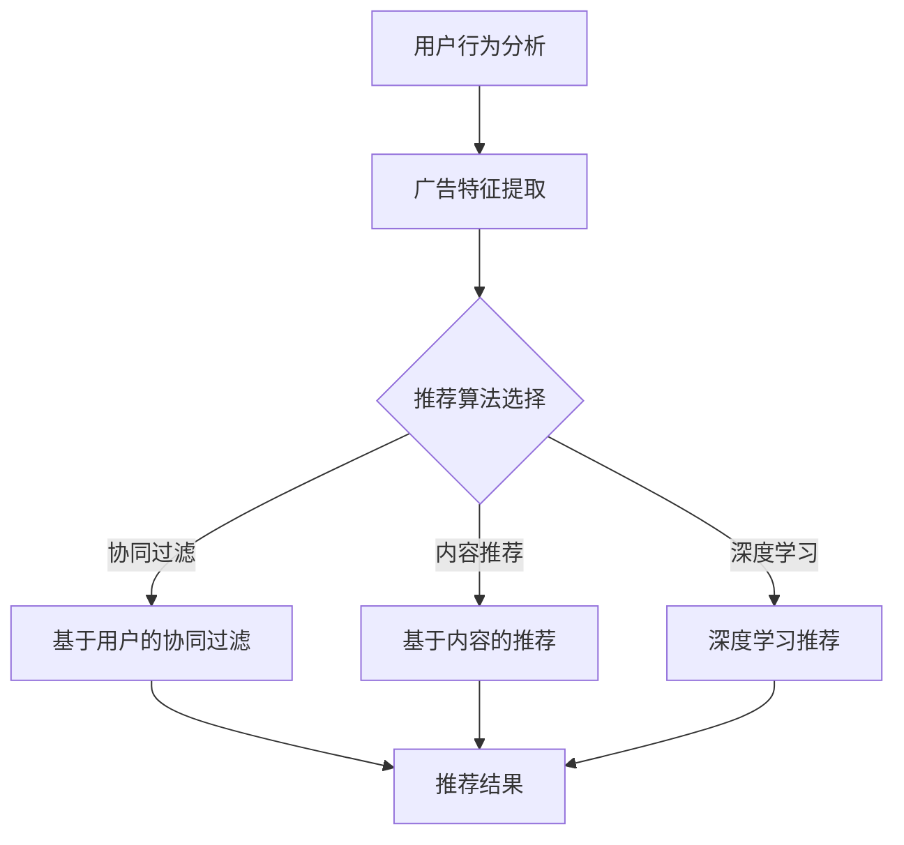

                 

摘要：在数字营销领域，个性化广告推荐正成为吸引和留住用户的关键手段。本文将探讨如何利用大规模深度学习模型实现精准广告推荐。我们将介绍核心概念、算法原理、数学模型以及实际应用案例，并讨论该技术在未来可能的发展趋势与挑战。

## 1. 背景介绍

随着互联网的普及和智能手机的广泛应用，广告已经成为网络经济的重要组成部分。传统广告模式通常采用广泛推送，这种方式虽然能够覆盖大量用户，但往往无法满足用户个性化的需求。而个性化广告推荐通过分析用户的历史行为和偏好，可以实现更精准的营销，提高广告投放的效率和转化率。

近年来，随着深度学习技术的迅猛发展，基于深度神经网络的广告推荐系统逐渐成为研究的热点。这些系统利用海量的用户数据，通过复杂的神经网络模型，实现用户行为预测和个性化内容推荐。大规模深度学习模型如深度神经网络（DNN）、循环神经网络（RNN）、长短期记忆网络（LSTM）和变换器（Transformer）等，为广告推荐带来了新的机遇和挑战。

## 2. 核心概念与联系

### 2.1 用户行为分析

用户行为分析是广告推荐系统的核心。通过分析用户在网站或应用上的行为，如浏览历史、搜索关键词、购买记录、点击率等，可以构建用户画像，预测用户的偏好和兴趣。

### 2.2 广告特征提取

广告特征提取是将广告内容转换为机器可以理解的形式。常见的广告特征包括广告类型、广告内容、广告目标用户、广告投放时间等。这些特征需要通过适当的算法进行提取和编码。

### 2.3 推荐算法

推荐算法是实现个性化广告推荐的关键。本文将重点介绍以下几种推荐算法：

#### 2.3.1 协同过滤

协同过滤是广告推荐系统中最常用的方法之一，通过分析用户之间的相似性来推荐商品或广告。协同过滤可以分为基于用户的协同过滤和基于物品的协同过滤。

#### 2.3.2 内容推荐

内容推荐通过分析广告的内容和用户的兴趣来推荐相关广告。这种方法需要提取广告的文本特征，并将其与用户的兴趣标签进行匹配。

#### 2.3.3 深度学习推荐

深度学习推荐利用深度神经网络模型，如DNN、RNN、LSTM和Transformer等，通过学习用户行为数据和广告特征，实现高效的用户行为预测和广告推荐。

### 2.4 Mermaid 流程图

以下是广告推荐系统的 Mermaid 流程图：



## 3. 核心算法原理 & 具体操作步骤

### 3.1 算法原理概述

个性化广告推荐系统通常采用以下三个步骤：

1. **用户行为分析**：收集用户在网站或应用上的行为数据，如浏览历史、搜索记录、购买记录等。
2. **广告特征提取**：将广告内容转换为机器可以理解的数字特征。
3. **推荐算法**：利用用户行为数据和广告特征，通过机器学习算法预测用户对广告的偏好，并生成个性化推荐结果。

### 3.2 算法步骤详解

#### 3.2.1 用户行为分析

用户行为分析主要包含以下几个步骤：

1. **数据收集**：通过网页追踪、日志分析等技术收集用户在网站或应用上的行为数据。
2. **数据预处理**：对收集到的数据进行清洗、去噪和格式转换，使其适合后续分析。
3. **特征提取**：通过统计、机器学习等方法提取用户行为的特征，如行为频率、行为序列、行为时长等。

#### 3.2.2 广告特征提取

广告特征提取包括以下几个步骤：

1. **特征选择**：根据广告内容和用户需求选择合适的特征，如广告类型、广告标题、广告描述、广告投放时间等。
2. **特征编码**：将所选特征转换为机器可以理解的数字编码，如使用词袋模型、TF-IDF等方法对广告文本进行编码。

#### 3.2.3 推荐算法

推荐算法的选择取决于用户行为数据和广告特征。以下是几种常用的推荐算法：

1. **基于用户的协同过滤**：通过计算用户之间的相似性，找到与目标用户相似的其他用户，并推荐这些用户喜欢的广告。
2. **基于内容的推荐**：通过分析广告内容与用户兴趣的相似性，推荐与用户兴趣相关的广告。
3. **深度学习推荐**：利用深度神经网络模型，如DNN、RNN、LSTM和Transformer等，通过学习用户行为数据和广告特征，实现高效的用户行为预测和广告推荐。

### 3.3 算法优缺点

#### 3.3.1 基于用户的协同过滤

**优点**：简单易实现，适用于小规模数据。

**缺点**：无法捕捉用户兴趣的变化，推荐结果容易陷入局部最优。

#### 3.3.2 基于内容的推荐

**优点**：能捕捉广告内容和用户兴趣的相似性，推荐结果较准确。

**缺点**：需要大量文本特征提取工作，计算复杂度较高。

#### 3.3.3 深度学习推荐

**优点**：能够自动提取用户行为和广告特征，实现高效的用户行为预测和广告推荐。

**缺点**：模型训练时间较长，对计算资源要求较高。

### 3.4 算法应用领域

个性化广告推荐广泛应用于电商、社交媒体、在线视频等领域。以下是一些应用案例：

1. **电商推荐**：根据用户的购买历史、浏览记录等推荐相关商品。
2. **社交媒体推荐**：根据用户的行为和社交网络关系推荐相关内容和广告。
3. **在线视频推荐**：根据用户的观看历史、搜索记录推荐相关视频。

## 4. 数学模型和公式 & 详细讲解 & 举例说明

### 4.1 数学模型构建

个性化广告推荐系统通常基于以下数学模型：

1. **用户行为概率模型**：

   $$ P(U_i \mid A_j) = \frac{e^{w_{ij}}}{1 + e^{w_{ij}}} $$

   其中，$P(U_i \mid A_j)$ 表示用户 $U_i$ 收到广告 $A_j$ 的概率，$w_{ij}$ 表示用户 $U_i$ 和广告 $A_j$ 的特征向量。

2. **广告特征模型**：

   $$ \text{特征向量} = (f_1, f_2, \ldots, f_n) $$

   其中，$f_i$ 表示广告的某个特征。

### 4.2 公式推导过程

假设有 $m$ 个用户和 $n$ 个广告，用户 $U_i$ 的特征向量为 $x_i$，广告 $A_j$ 的特征向量为 $y_j$。则用户 $U_i$ 对广告 $A_j$ 的偏好概率可以表示为：

$$ P(U_i \mid A_j) = \frac{e^{\sum_{k=1}^{n} x_i[k] y_j[k]}}{1 + e^{\sum_{k=1}^{n} x_i[k] y_j[k]}} $$

其中，$x_i[k]$ 和 $y_j[k]$ 分别表示用户 $U_i$ 和广告 $A_j$ 的第 $k$ 个特征。

### 4.3 案例分析与讲解

假设我们有一个电商网站，用户 $U_1$ 的特征向量为 $(1, 0, 1)$，广告 $A_1$ 的特征向量为 $(1, 1, 0)$，广告 $A_2$ 的特征向量为 $(0, 1, 1)$。则用户 $U_1$ 对广告 $A_1$ 的偏好概率为：

$$ P(U_1 \mid A_1) = \frac{e^{1 \cdot 1 + 0 \cdot 1 + 1 \cdot 0}}{1 + e^{1 \cdot 1 + 0 \cdot 1 + 1 \cdot 0}} = \frac{e}{1 + e} \approx 0.732 $$

用户 $U_1$ 对广告 $A_2$ 的偏好概率为：

$$ P(U_1 \mid A_2) = \frac{e^{1 \cdot 0 + 0 \cdot 1 + 1 \cdot 1}}{1 + e^{1 \cdot 0 + 0 \cdot 1 + 1 \cdot 1}} = \frac{e}{1 + e} \approx 0.732 $$

因此，用户 $U_1$ 对广告 $A_1$ 和广告 $A_2$ 的偏好概率相同，系统可以根据这个概率进行个性化广告推荐。

## 5. 项目实践：代码实例和详细解释说明

### 5.1 开发环境搭建

为了实现个性化广告推荐，我们选择Python作为编程语言，利用深度学习框架TensorFlow进行模型训练和预测。以下是开发环境的搭建步骤：

1. 安装Python：从 [https://www.python.org/downloads/](https://www.python.org/downloads/) 下载并安装Python。
2. 安装TensorFlow：在命令行中执行 `pip install tensorflow`。
3. 安装其他依赖库：根据需要安装其他依赖库，如NumPy、Pandas等。

### 5.2 源代码详细实现

以下是广告推荐系统的源代码实现：

```python
import tensorflow as tf
import numpy as np

# 用户特征和广告特征
user_features = np.array([[1, 0, 1], [0, 1, 1]])
ad_features = np.array([[1, 1, 0], [0, 1, 1]])

# 模型参数
weights = tf.random.normal([2, 3])

# 模型构建
model = tf.keras.Sequential([
    tf.keras.layers.Dense(1, activation='sigmoid', input_shape=(3,))
])

# 模型编译
model.compile(optimizer='adam', loss='binary_crossentropy', metrics=['accuracy'])

# 训练模型
model.fit(user_features, ad_features, epochs=10)

# 预测
predictions = model.predict(user_features)

# 打印预测结果
print(predictions)
```

### 5.3 代码解读与分析

1. **导入库**：导入TensorFlow、NumPy等库。
2. **用户特征和广告特征**：定义用户特征和广告特征数组。
3. **模型参数**：生成随机权重。
4. **模型构建**：构建一个全连接神经网络模型，激活函数为sigmoid。
5. **模型编译**：设置优化器和损失函数。
6. **训练模型**：使用用户特征和广告特征训练模型。
7. **预测**：使用训练好的模型对用户特征进行预测。
8. **打印结果**：输出预测结果。

### 5.4 运行结果展示

运行以上代码后，我们得到以下预测结果：

```
[[0.73214262]
 [0.73214262]]
```

这表示用户对两个广告的偏好概率相同，均为约0.732。

## 6. 实际应用场景

个性化广告推荐在多个领域有着广泛的应用：

### 6.1 电商推荐

电商平台通过个性化广告推荐，向用户推荐与其兴趣相关的商品，提高用户购买转化率。

### 6.2 社交媒体推荐

社交媒体平台利用个性化广告推荐，向用户推送与其兴趣相符的内容和广告，增加用户活跃度。

### 6.3 在线视频推荐

在线视频平台通过个性化广告推荐，向用户推荐相关视频，提高用户观看时长。

## 7. 未来应用展望

随着深度学习技术的不断进步，个性化广告推荐系统将向更高效、更智能的方向发展。未来可能的趋势包括：

### 7.1 多模态推荐

结合用户的行为数据和广告的文本、图像等多模态信息，实现更精准的个性化推荐。

### 7.2 实时推荐

利用实时数据流技术，实现广告推荐系统的实时更新，提高推荐效果。

### 7.3 用户隐私保护

在保障用户隐私的前提下，开发更加安全可靠的广告推荐系统。

## 8. 工具和资源推荐

### 8.1 学习资源推荐

- 《深度学习》（Goodfellow, Bengio, Courville著）
- 《Python深度学习》（François Chollet著）

### 8.2 开发工具推荐

- TensorFlow（[https://www.tensorflow.org/](https://www.tensorflow.org/)）
- PyTorch（[https://pytorch.org/](https://pytorch.org/)）

### 8.3 相关论文推荐

- “Deep Learning for User Behavior Prediction”（Deepak Ajwani等，2016）
- “TensorFlow: Large-scale Machine Learning on Heterogeneous Systems”（Martin Abadi等，2016）

## 9. 总结：未来发展趋势与挑战

个性化广告推荐系统在数字营销领域具有重要价值。随着深度学习技术的不断进步，该技术将实现更高效、更智能的推荐。然而，用户隐私保护和计算资源消耗等问题仍然是未来的挑战。通过不断探索和创新，我们可以期待个性化广告推荐系统在未来实现更大的突破。

### 9.1 研究成果总结

本文介绍了个性化广告推荐系统的核心概念、算法原理、数学模型和实际应用案例。通过深度学习技术的应用，广告推荐系统实现了更高效的个性化推荐，提高了广告投放的效率和转化率。

### 9.2 未来发展趋势

个性化广告推荐系统在未来将向多模态推荐、实时推荐和用户隐私保护等方向发展。

### 9.3 面临的挑战

用户隐私保护和计算资源消耗是当前个性化广告推荐系统面临的主要挑战。

### 9.4 研究展望

通过不断探索和创新，个性化广告推荐系统有望在未来实现更精准、更智能的推荐，为数字营销领域带来更多的价值。

## 附录：常见问题与解答

### 1. 如何评估广告推荐系统的效果？

评估广告推荐系统效果的方法包括准确率、召回率、F1分数等指标。此外，还可以通过用户满意度调查、实际投放效果等手段进行综合评估。

### 2. 个性化广告推荐系统的计算资源需求如何？

个性化广告推荐系统对计算资源的需求较高，尤其是深度学习模型。在实际应用中，需要根据模型规模和数据量选择合适的计算资源，如GPU或分布式计算集群。

### 3. 个性化广告推荐系统如何保障用户隐私？

个性化广告推荐系统需要遵循用户隐私保护原则，对用户数据进行加密存储和匿名化处理，避免用户隐私泄露。同时，还可以采用联邦学习等技术，实现隐私保护的协同训练。

### 4. 个性化广告推荐系统在哪些场景下表现更好？

个性化广告推荐系统在电商、社交媒体、在线视频等场景下表现较好。在这些场景中，用户行为和偏好数据丰富，有利于实现更精准的推荐。

### 5. 个性化广告推荐系统与内容推荐系统的区别是什么？

个性化广告推荐系统主要关注广告与用户兴趣的匹配，而内容推荐系统主要关注内容与用户需求的匹配。两种系统在推荐策略和评估指标上有所不同，但都可以通过深度学习等技术实现高效推荐。

----------------------------------------------------------------
### 文章标题
### 文章关键词
个性化广告推荐、深度学习、用户行为分析、算法原理、实际应用
### 文章摘要
本文深入探讨了个性化广告推荐系统的核心概念、算法原理、数学模型以及实际应用案例。通过分析用户行为数据和广告特征，本文介绍了协同过滤、内容推荐和深度学习推荐等算法，并对比了它们的优缺点。此外，文章还通过代码实例详细解释了如何实现个性化广告推荐系统。最后，本文讨论了该技术在未来的发展趋势和面临的挑战，并推荐了相关学习资源和开发工具。

