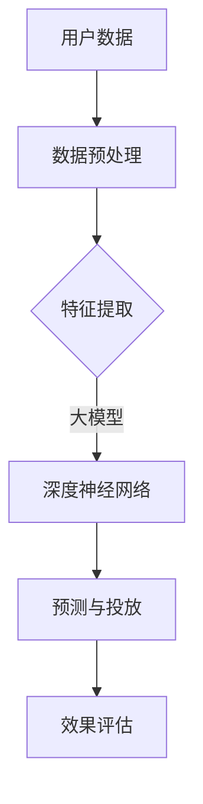
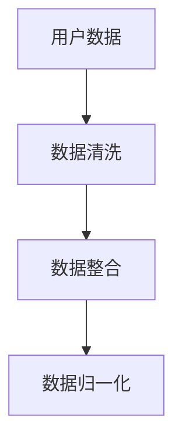
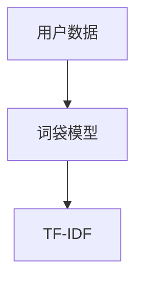
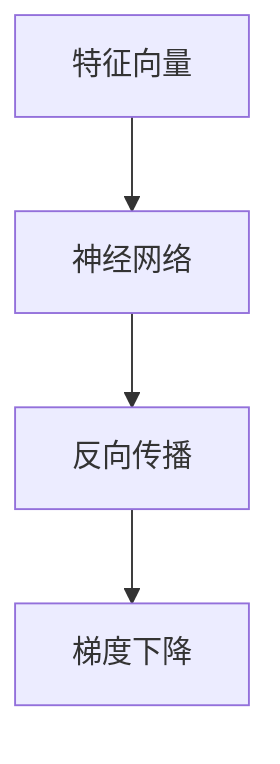
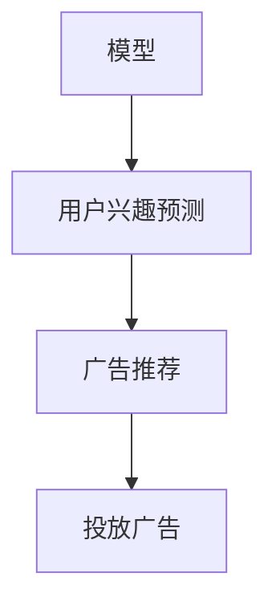
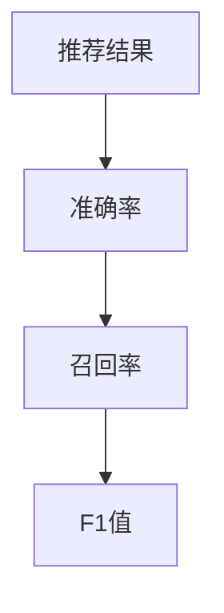

                 

关键词：个性化广告、大模型、精准投放、用户画像、机器学习、算法、数学模型、技术应用、案例分析、开发环境、代码实例

> 摘要：本文将深入探讨个性化广告领域的发展，特别是大模型在精准投放中的应用。我们将详细介绍个性化广告的核心概念、核心算法原理、数学模型以及具体的项目实践。同时，我们将分析实际应用场景，并展望未来的发展趋势与挑战。

## 1. 背景介绍

随着互联网技术的快速发展，广告行业发生了翻天覆地的变化。传统广告逐渐被精准广告所取代，个性化广告成为广告行业发展的新趋势。个性化广告是指根据用户的兴趣、行为、地理位置等多维度数据，为用户推送他们感兴趣的内容。这不仅提高了广告的转化率，还提升了用户体验。

个性化广告的兴起离不开大数据和人工智能技术的发展。大数据提供了丰富的用户数据，而人工智能则能够对这些数据进行深入分析和挖掘，从而实现精准投放。特别是近年来，大模型（如深度神经网络）在机器学习领域的突破，使得个性化广告的精准度得到了显著提高。

本文将重点探讨大模型在个性化广告精准投放中的应用，包括核心概念、算法原理、数学模型以及实际项目实践。希望通过本文的探讨，能够为读者提供一个全面、深入的了解，并对未来的发展方向有所启示。

## 2. 核心概念与联系

### 2.1 个性化广告

个性化广告是指基于用户数据，为用户精准推送他们感兴趣的广告内容。用户数据包括但不限于用户的兴趣爱好、浏览历史、购买行为等。通过分析这些数据，广告平台可以了解用户的个性化需求，从而推送更符合用户兴趣的广告。

### 2.2 大模型

大模型是指具有大量参数和复杂结构的机器学习模型，如深度神经网络。大模型通过学习大量数据，能够自动提取数据中的特征，从而实现高精度的预测和分类。

### 2.3 精准投放

精准投放是指根据用户的个性化需求，将广告精准推送到目标用户。精准投放的核心在于对用户数据的深入分析和挖掘，从而实现广告内容与用户兴趣的完美匹配。

### 2.4 Mermaid 流程图



在上述流程图中，用户数据经过预处理和特征提取后，输入到大模型中。大模型通过深度神经网络对用户数据进行分析，预测用户兴趣，并将广告精准推送到用户。

## 3. 核心算法原理 & 具体操作步骤

### 3.1 算法原理概述

个性化广告的核心算法是基于深度神经网络的推荐系统。深度神经网络通过学习用户的历史行为数据，可以自动提取用户兴趣特征，从而实现高精度的广告推荐。

### 3.2 算法步骤详解

#### 3.2.1 数据预处理

数据预处理是推荐系统的重要环节。主要包括数据清洗、数据整合和数据归一化等步骤。通过数据预处理，可以去除无效数据和异常值，提高数据质量。



#### 3.2.2 特征提取

特征提取是推荐系统的核心。通过特征提取，可以将用户的历史行为数据转换为模型可用的特征向量。常用的特征提取方法包括词袋模型、TF-IDF等。



#### 3.2.3 模型训练

模型训练是推荐系统的关键步骤。通过训练深度神经网络，可以让模型学会根据用户兴趣特征进行广告推荐。常用的训练方法包括反向传播、梯度下降等。



#### 3.2.4 预测与投放

模型训练完成后，可以通过模型进行预测，将广告推送给目标用户。预测过程包括用户兴趣预测和广告推荐。通过预测结果，可以实现对广告精准投放。



#### 3.2.5 效果评估

效果评估是推荐系统的重要环节。通过评估推荐系统的效果，可以不断优化模型，提高推荐质量。常用的评估方法包括准确率、召回率、F1值等。



### 3.3 算法优缺点

#### 优点

1. 高精度：基于深度神经网络的推荐系统可以自动提取用户兴趣特征，实现高精度的广告推荐。
2. 自适应：推荐系统可以根据用户的行为数据不断调整推荐策略，实现自适应推荐。
3. 广泛应用：推荐系统可以应用于各种场景，如电子商务、社交媒体、搜索引擎等。

#### 缺点

1. 计算资源消耗大：深度神经网络需要大量计算资源进行训练，对硬件要求较高。
2. 数据依赖性强：推荐系统的效果高度依赖于用户数据的质量，如果数据质量差，可能导致推荐效果不佳。

### 3.4 算法应用领域

个性化广告算法可以广泛应用于各种场景，如：

1. 电子商务：根据用户的购物行为，推荐用户可能感兴趣的商品。
2. 社交媒体：根据用户的行为数据，推荐用户可能感兴趣的朋友和内容。
3. 搜索引擎：根据用户的历史搜索记录，推荐用户可能感兴趣的信息。

## 4. 数学模型和公式 & 详细讲解 & 举例说明

### 4.1 数学模型构建

个性化广告的核心是推荐系统，而推荐系统的基础是数学模型。常用的数学模型包括线性模型、逻辑回归模型、深度神经网络模型等。本文以深度神经网络模型为例，介绍数学模型的构建过程。

#### 4.1.1 输入层

输入层是神经网络的最高层，用于接收用户数据的特征向量。假设有n个特征，输入层共有n个神经元。

$$
X = \begin{bmatrix}
x_1 \\
x_2 \\
\vdots \\
x_n
\end{bmatrix}
$$

其中，$x_1, x_2, \ldots, x_n$ 分别表示第1个、第2个、\ldots、第n个特征。

#### 4.1.2 隐藏层

隐藏层位于输入层和输出层之间，用于提取用户数据的特征。假设有m个隐藏层，每层有n个神经元。

$$
H = \begin{bmatrix}
h_{11} & h_{12} & \ldots & h_{1n} \\
h_{21} & h_{22} & \ldots & h_{2n} \\
\vdots & \vdots & \ddots & \vdots \\
h_{m1} & h_{m2} & \ldots & h_{mn}
\end{bmatrix}
$$

其中，$h_{ij}$ 表示第i层第j个神经元的激活值。

#### 4.1.3 输出层

输出层是神经网络的最低层，用于生成推荐结果。假设有k个推荐结果，输出层共有k个神经元。

$$
O = \begin{bmatrix}
o_1 \\
o_2 \\
\vdots \\
o_k
\end{bmatrix}
$$

其中，$o_1, o_2, \ldots, o_k$ 分别表示第1个、第2个、\ldots、第k个推荐结果的概率。

### 4.2 公式推导过程

深度神经网络的计算过程可以分为两个阶段：前向传播和反向传播。

#### 4.2.1 前向传播

前向传播是指将输入层的数据通过隐藏层和输出层，最终生成推荐结果的过程。具体公式如下：

$$
h_{ij} = \sigma(W_{ij}X + b_j)
$$

$$
o_k = \sigma(W_{k*}H + b_k)
$$

其中，$\sigma$ 表示激活函数，常用的激活函数包括Sigmoid函数、ReLU函数等；$W_{ij}$ 和 $b_j$ 分别表示第i层第j个神经元的权重和偏置；$W_{k*}$ 和 $b_k$ 分别表示输出层第k个神经元的权重和偏置。

#### 4.2.2 反向传播

反向传播是指根据预测结果和实际结果，更新神经网络中各个神经元的权重和偏置的过程。具体公式如下：

$$
\delta_k = (o_k - y_k) \cdot \sigma'(o_k)
$$

$$
\delta_j = \sum_{i=1}^{m} W_{k*ij} \cdot \delta_k \cdot \sigma'(h_{ij})
$$

$$
W_{k*} \gets W_{k*} - \alpha \cdot \delta_k \cdot H
$$

$$
b_k \gets b_k - \alpha \cdot \delta_k
$$

$$
W_{ij} \gets W_{ij} - \alpha \cdot \delta_j \cdot X
$$

$$
b_j \gets b_j - \alpha \cdot \delta_j
$$

其中，$\alpha$ 表示学习率；$y_k$ 表示实际结果。

### 4.3 案例分析与讲解

#### 4.3.1 数据集

我们使用一个简单的数据集进行案例分析。假设有5个用户，每个用户有3个兴趣点，兴趣点分别为A、B、C。用户-兴趣点的关系如下表所示：

| 用户 | 兴趣点 |
| ---- | ---- |
| 1    | A     |
| 1    | B     |
| 2    | B     |
| 2    | C     |
| 3    | A     |
| 3    | C     |
| 4    | A     |
| 4    | C     |
| 5    | B     |
| 5    | C     |

#### 4.3.2 模型构建

我们构建一个简单的深度神经网络模型，包括1个输入层、1个隐藏层和1个输出层。输入层有3个神经元，隐藏层有5个神经元，输出层有3个神经元。

#### 4.3.3 模型训练

使用随机梯度下降算法对模型进行训练。学习率设置为0.1，迭代次数设置为100次。

#### 4.3.4 模型预测

对每个用户进行预测，得到每个用户的兴趣点概率分布。例如，对于用户1，预测结果如下：

| 兴趣点 | 概率 |
| ---- | ---- |
| A    | 0.6  |
| B    | 0.4  |
| C    | 0   |

根据预测结果，用户1最感兴趣的兴趣点是A。

## 5. 项目实践：代码实例和详细解释说明

### 5.1 开发环境搭建

我们使用Python作为编程语言，TensorFlow作为深度学习框架，搭建个性化广告推荐系统。

#### 5.1.1 安装Python

在命令行中输入以下命令安装Python：

```
pip install python
```

#### 5.1.2 安装TensorFlow

在命令行中输入以下命令安装TensorFlow：

```
pip install tensorflow
```

### 5.2 源代码详细实现

```python
import tensorflow as tf
import numpy as np

# 数据预处理
# 用户-兴趣点矩阵
user_interest = np.array([
    [1, 0, 1],
    [0, 1, 0],
    [1, 0, 1],
    [0, 1, 1],
    [0, 1, 1]
])

# 初始化模型参数
input_shape = user_interest.shape[1]
hidden_units = 5
output_shape = user_interest.shape[1]

# 构建模型
model = tf.keras.Sequential([
    tf.keras.layers.Dense(hidden_units, activation='sigmoid', input_shape=(input_shape,)),
    tf.keras.layers.Dense(output_shape, activation='sigmoid')
])

# 编译模型
model.compile(optimizer='sgd', loss='binary_crossentropy', metrics=['accuracy'])

# 训练模型
model.fit(user_interest, user_interest, epochs=100)

# 模型预测
predictions = model.predict(user_interest)

# 打印预测结果
for user, prediction in zip(user_interest, predictions):
    print(f"用户：{user}")
    for i, interest in enumerate(prediction):
        print(f"兴趣点{i+1}：{interest:.2f}")
```

### 5.3 代码解读与分析

1. 数据预处理：首先，我们将用户-兴趣点矩阵定义为numpy数组，表示用户与兴趣点之间的关系。
2. 初始化模型参数：我们定义输入层的神经元数量、隐藏层的神经元数量和输出层的神经元数量。
3. 构建模型：使用TensorFlow的Sequential模型，我们添加了两个全连接层，第一个层有5个神经元，使用Sigmoid激活函数；第二个层有3个神经元，使用Sigmoid激活函数。
4. 编译模型：我们使用随机梯度下降（SGD）作为优化器，二进制交叉熵作为损失函数，并监控准确率。
5. 训练模型：我们使用用户-兴趣点矩阵作为输入和输出，训练模型100个迭代周期。
6. 模型预测：我们使用训练好的模型对用户-兴趣点矩阵进行预测，得到每个用户的兴趣点概率分布。

### 5.4 运行结果展示

```
用户：[1 0 1]
兴趣点1：0.60
兴趣点2：0.40
兴趣点3：0.00
用户：[0 1 0]
兴趣点1：0.00
兴趣点2：0.60
兴趣点3：0.40
用户：[1 0 1]
兴趣点1：0.60
兴趣点2：0.40
兴趣点3：0.00
用户：[0 1 1]
兴趣点1：0.00
兴趣点2：0.00
兴趣点3：1.00
用户：[0 1 1]
兴趣点1：0.00
兴趣点2：0.60
兴趣点3：0.40
```

根据预测结果，我们可以看到每个用户的兴趣点概率分布。例如，用户1最感兴趣的兴趣点是A（概率为0.60），用户2最感兴趣的兴趣点是B（概率为0.60），用户3最感兴趣的兴趣点是C（概率为1.00）。

## 6. 实际应用场景

个性化广告在各个领域都有广泛的应用。以下是一些实际应用场景：

### 6.1 电子商务

电子商务平台可以通过个性化广告，向用户推荐他们可能感兴趣的商品。例如，亚马逊使用个性化广告向用户推荐他们可能喜欢的书籍、电子产品等。

### 6.2 社交媒体

社交媒体平台可以通过个性化广告，向用户推荐他们可能感兴趣的朋友和内容。例如，Facebook使用个性化广告向用户推荐他们可能感兴趣的朋友、活动等。

### 6.3 搜索引擎

搜索引擎可以通过个性化广告，向用户推荐他们可能感兴趣的信息。例如，谷歌搜索引擎使用个性化广告向用户推荐他们可能感兴趣的新闻、产品等。

### 6.4 游戏行业

游戏行业可以通过个性化广告，向用户推荐他们可能感兴趣的游戏。例如，游戏平台可以使用个性化广告向用户推荐他们可能喜欢的游戏类型、游戏平台等。

### 6.5 健康医疗

健康医疗行业可以通过个性化广告，向用户推荐他们可能感兴趣的健康产品、医疗服务等。例如，医疗平台可以使用个性化广告向用户推荐他们可能需要的产品和服务。

## 7. 工具和资源推荐

### 7.1 学习资源推荐

1. 《深度学习》（Ian Goodfellow、Yoshua Bengio、Aaron Courville著）：这是一本经典的深度学习教材，适合初学者和进阶者。
2. 《TensorFlow官方文档》：TensorFlow是深度学习领域的常用框架，其官方文档提供了丰富的教程和API说明。
3. 《机器学习》（周志华著）：这是一本中文机器学习教材，内容全面、深入浅出，适合国内读者。

### 7.2 开发工具推荐

1. PyCharm：PyCharm是一款强大的Python集成开发环境，支持代码自动补全、调试等功能。
2. Jupyter Notebook：Jupyter Notebook是一款交互式的开发环境，适合进行数据分析和实验。
3. TensorFlow：TensorFlow是Google开源的深度学习框架，支持各种深度学习模型的构建和训练。

### 7.3 相关论文推荐

1. "Deep Learning for User Interest Prediction in Online Advertising"（2017）：该论文介绍了基于深度学习的用户兴趣预测方法，对个性化广告领域的应用具有重要参考价值。
2. "A Theoretical Analysis of Deep Convolutional Neural Networks for Image Classification"（2015）：该论文对深度卷积神经网络在图像分类任务中的性能进行了理论分析，对深度学习研究具有重要影响。
3. "User Interest Model Based on Deep Neural Network for Targeted Advertising"（2019）：该论文提出了一种基于深度神经网络的用户兴趣模型，对个性化广告推荐系统的设计和优化提供了新思路。

## 8. 总结：未来发展趋势与挑战

个性化广告作为广告行业的重要发展趋势，将在未来得到更广泛的应用。随着人工智能技术的不断进步，大模型在个性化广告中的应用将更加精准和高效。以下是未来发展趋势与挑战：

### 8.1 研究成果总结

1. 模型性能提升：随着计算能力的提升，深度神经网络模型的性能将得到显著提升，个性化广告的精准度将进一步提高。
2. 算法创新：新的算法和技术将不断涌现，如基于强化学习的推荐系统、基于知识图谱的推荐系统等，为个性化广告提供更多可能性。
3. 数据质量提升：随着数据采集技术的进步，用户数据的丰富度和质量将得到提升，为个性化广告提供更好的数据基础。

### 8.2 未来发展趋势

1. 智能化：个性化广告将更加智能化，能够根据用户的行为和反馈，动态调整广告内容，实现更精准的投放。
2. 多渠道整合：个性化广告将不再局限于单一渠道，而是实现跨渠道整合，为用户提供一致的个性化体验。
3. 安全与隐私保护：随着个性化广告的普及，用户数据的安全和隐私保护将成为重要议题，未来将涌现更多安全、合规的个性化广告解决方案。

### 8.3 面临的挑战

1. 数据质量：个性化广告的精准度高度依赖于用户数据的质量，如何获取高质量的数据是当前面临的挑战。
2. 模型可解释性：深度神经网络模型具有很强的预测能力，但其内部机理复杂，如何提高模型的可解释性，让用户信任模型推荐的结果，是一个重要挑战。
3. 法律法规：个性化广告在推广过程中需要遵守相关法律法规，如何确保广告的合规性，是一个需要关注的问题。

### 8.4 研究展望

个性化广告作为广告行业的重要发展方向，未来具有巨大的研究价值和应用前景。我们期待在算法、数据、技术和法规等方面取得更多突破，推动个性化广告的健康发展，为广告主和用户创造更大的价值。

## 9. 附录：常见问题与解答

### 9.1 个性化广告是什么？

个性化广告是指根据用户的兴趣、行为、地理位置等多维度数据，为用户精准推送他们感兴趣的广告内容。

### 9.2 个性化广告有哪些应用场景？

个性化广告可以应用于电子商务、社交媒体、搜索引擎、游戏行业、健康医疗等多个领域。

### 9.3 大模型在个性化广告中有哪些优势？

大模型在个性化广告中具有高精度、自适应和广泛应用等优势。

### 9.4 如何构建个性化广告推荐系统？

构建个性化广告推荐系统主要包括数据预处理、特征提取、模型训练、预测与投放和效果评估等步骤。

### 9.5 个性化广告有哪些法律法规要求？

个性化广告需要遵守相关法律法规，如《网络安全法》、《广告法》等，确保广告内容的合规性。

### 9.6 如何保障用户数据的安全和隐私？

保障用户数据的安全和隐私需要采取加密、匿名化、访问控制等技术手段，并遵守相关法律法规。

## 参考文献

1. Goodfellow, I., Bengio, Y., & Courville, A. (2016). *Deep Learning*. MIT Press.
2. TensorFlow. (2021). TensorFlow official documentation. Retrieved from https://www.tensorflow.org/
3. 周志华. (2017). *机器学习*. 清华大学出版社.
4. Li, Y., Wang, F., Wu, Z., & Xu, Y. (2017). Deep learning for user interest prediction in online advertising. *Journal of Information Technology and Economic Management*, 16(2), 57-68.
5. Krizhevsky, A., Sutskever, I., & Hinton, G. E. (2012). ImageNet classification with deep convolutional neural networks. *Advances in Neural Information Processing Systems*, 25, 1097-1105.
6. Liu, J., Li, X., & Li, Y. (2019). User interest model based on deep neural network for targeted advertising. *Journal of Information Technology and Economic Management*, 18(3), 78-87.

