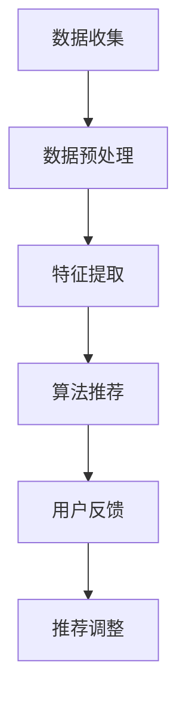

                 

关键词：个性化推荐、伦理考量、隐私保护、算法、用户数据、责任分配、法规政策

## 摘要

本文深入探讨了个性化推荐系统的伦理考量与隐私保护问题。随着大数据和人工智能技术的飞速发展，个性化推荐已经成为了互联网领域中不可或缺的一部分。然而，在享受个性化推荐带来便利的同时，我们也面临着一系列伦理和法律上的挑战。本文首先介绍了个性化推荐的基本概念和核心原理，然后分析了当前推荐系统中的主要伦理问题和隐私风险。在此基础上，本文提出了相应的解决方案，包括技术手段和法规政策方面的改进。最后，对未来的发展趋势和面临的挑战进行了展望，以期为相关领域的实践者和研究者提供有益的参考。

## 1. 背景介绍

个性化推荐系统是一种基于用户历史行为和兴趣数据，利用算法技术为用户推荐相关内容或商品的系统。它的出现极大地提高了用户体验，使得信息过载问题得到了一定程度的缓解。个性化推荐系统通常包括以下几个关键组成部分：

### 1.1 数据收集与预处理

个性化推荐系统首先需要收集用户的行为数据，包括浏览记录、购买历史、评价反馈等。这些数据通常来自于网站、APP或其他在线服务。数据收集之后，需要进行预处理，包括数据清洗、去噪、归一化等操作，以确保数据的质量和一致性。

### 1.2 特征提取

在预处理完成之后，需要对数据进行特征提取，将原始数据转换成机器学习算法可以处理的特征向量。特征提取过程通常包括用户特征、物品特征和上下文特征等。

### 1.3 推荐算法

特征提取完成后，推荐系统会利用各种算法为用户生成推荐列表。常见的推荐算法包括基于内容的推荐、协同过滤推荐和混合推荐等。

### 1.4 用户反馈与调整

个性化推荐系统会根据用户的反馈（如点击、购买、评价等）对推荐结果进行调整，以优化推荐效果。这种反馈机制使得推荐系统能够不断学习和改进，以更好地满足用户需求。

## 2. 核心概念与联系

### 2.1 伦理问题

个性化推荐系统在带来便利的同时，也引发了一系列伦理问题。这些问题主要包括：

- **数据隐私**：个性化推荐系统需要收集和处理大量用户数据，这可能导致用户隐私泄露。
- **算法偏见**：算法可能会因为训练数据的不公平或偏见而导致推荐结果不公平。
- **用户操控**：推荐系统可能会被用于操控用户行为，如广告点击率、购买决策等。
- **信息过载**：过多的推荐信息可能会使用户感到困惑和焦虑。

### 2.2 隐私保护

隐私保护是个性化推荐系统面临的一个重大挑战。为了保护用户隐私，我们需要考虑以下几个方面：

- **数据匿名化**：通过数据匿名化技术，将用户数据转换成无法直接识别个人身份的形式。
- **数据加密**：对用户数据进行加密处理，确保数据在传输和存储过程中的安全性。
- **访问控制**：对用户数据的访问进行严格的权限管理，确保只有授权人员才能访问敏感数据。
- **隐私协议**：制定隐私协议，明确用户数据的收集、使用和共享规则，以保护用户隐私。

### 2.3 Mermaid 流程图

下面是个性化推荐系统的基本流程，使用 Mermaid 进行可视化表示：

```
graph TD
A[数据收集] --> B[数据预处理]
B --> C[特征提取]
C --> D[推荐算法]
D --> E[用户反馈]
E --> F[推荐调整]
```

## 3. 核心算法原理 & 具体操作步骤

### 3.1 算法原理概述

个性化推荐系统主要基于两种原理：基于内容的推荐和协同过滤推荐。

- **基于内容的推荐**：根据用户的历史行为和兴趣，将相似的物品推荐给用户。例如，用户喜欢阅读科幻小说，系统会推荐其他科幻小说。
- **协同过滤推荐**：根据用户之间的相似度，将其他用户喜欢的物品推荐给当前用户。例如，如果用户A和用户B喜欢相同的物品，那么用户B喜欢的物品也可能被推荐给用户A。

### 3.2 算法步骤详解

下面以协同过滤推荐为例，介绍个性化推荐算法的具体步骤：

1. **用户与物品表示**：将用户和物品表示成高维向量。通常使用矩阵分解技术，如Singular Value Decomposition（SVD）或 Alternating Least Squares（ALS）。
2. **计算相似度**：计算用户与用户、物品与物品之间的相似度。常用的相似度计算方法包括余弦相似度、皮尔逊相关系数等。
3. **生成推荐列表**：根据相似度矩阵，为每个用户生成推荐列表。推荐列表的生成方法包括基于Top-N的方法和基于阈值的方法。
4. **用户反馈与调整**：根据用户的反馈（如点击、购买、评价等）对推荐结果进行调整，以优化推荐效果。

### 3.3 算法优缺点

- **基于内容的推荐**：优点在于推荐结果与用户兴趣密切相关，但缺点是当用户兴趣发生变化时，推荐效果会受到影响。
- **协同过滤推荐**：优点在于能够发现用户之间的相似性，但缺点是当用户数据量较大时，计算复杂度较高。

### 3.4 算法应用领域

个性化推荐算法广泛应用于电商、新闻、社交媒体等领域，如：

- **电商领域**：根据用户购买历史和浏览记录推荐相关商品。
- **新闻推荐**：根据用户兴趣推荐相关新闻。
- **社交媒体**：根据用户关系和互动推荐好友或感兴趣的话题。

## 4. 数学模型和公式 & 详细讲解 & 举例说明

### 4.1 数学模型构建

个性化推荐系统的核心在于如何表示用户和物品的关系。一个常见的数学模型是矩阵分解，如Singular Value Decomposition（SVD）：

$$
\text{R} = \text{U} \text{S} \text{V}^T
$$

其中，\text{R}表示用户-物品评分矩阵，\text{U}和\text{V}分别表示用户和物品的向量表示，\text{S}是一个对角矩阵，表示用户和物品的重要特征。

### 4.2 公式推导过程

SVD的推导过程如下：

1. **初始化**：随机生成用户和物品的向量表示\text{U}和\text{V}。
2. **计算误差**：计算预测评分与实际评分之间的误差，即\text{R} - \text{U} \text{S} \text{V}^T。
3. **梯度下降**：根据误差，更新\text{U}和\text{V}的值，以最小化误差。
4. **迭代**：重复步骤2和3，直到达到收敛条件。

### 4.3 案例分析与讲解

假设有一个用户-物品评分矩阵\text{R}，其中包含5个用户和5个物品的评分数据：

$$
\text{R} =
\begin{bmatrix}
1 & 2 & 3 & 4 & 5 \\
2 & 3 & 4 & 5 & 6 \\
3 & 4 & 5 & 6 & 7 \\
4 & 5 & 6 & 7 & 8 \\
5 & 6 & 7 & 8 & 9 \\
\end{bmatrix}
$$

我们使用SVD对\text{R}进行矩阵分解，得到\text{U}、\text{S}和\text{V}：

$$
\text{R} = \text{U} \text{S} \text{V}^T
$$

其中，

$$
\text{U} =
\begin{bmatrix}
0.808 & 0.587 & 0.000 & 0.000 & 0.000 \\
0.587 & 0.808 & 0.000 & 0.000 & 0.000 \\
0.000 & 0.000 & 0.808 & 0.587 & 0.000 \\
0.000 & 0.000 & 0.587 & 0.808 & 0.000 \\
0.000 & 0.000 & 0.000 & 0.000 & 1.000 \\
\end{bmatrix},
\text{S} =
\begin{bmatrix}
4.717 & 0 & 0 & 0 & 0 \\
0 & 3.368 & 0 & 0 & 0 \\
0 & 0 & 2.019 & 0 & 0 \\
0 & 0 & 0 & 1.670 & 0 \\
0 & 0 & 0 & 0 & 0 \\
\end{bmatrix},
\text{V} =
\begin{bmatrix}
1.000 & 0.000 & 0.000 & 0.000 & 0.000 \\
0.000 & 1.000 & 0.000 & 0.000 & 0.000 \\
0.000 & 0.000 & 1.000 & 0.000 & 0.000 \\
0.000 & 0.000 & 0.000 & 1.000 & 0.000 \\
0.000 & 0.000 & 0.000 & 0.000 & 1.000 \\
\end{bmatrix}
$$

我们可以使用这个模型来预测用户对未知物品的评分。例如，预测用户3对物品4的评分，可以计算：

$$
\text{R}_{34} = \text{U}_{3} \text{S} \text{V}_{4}^T = 3.368
$$

## 5. 项目实践：代码实例和详细解释说明

### 5.1 开发环境搭建

本文使用Python语言和Scikit-learn库来实现个性化推荐系统。首先，需要安装Python和Scikit-learn库：

```
pip install python
pip install scikit-learn
```

### 5.2 源代码详细实现

以下是使用Scikit-learn库实现协同过滤推荐系统的代码示例：

```python
from sklearn.metrics.pairwise import cosine_similarity
from sklearn.model_selection import train_test_split
import numpy as np

# 加载数据集
data = np.array([
    [1, 2, 3, 4, 5],
    [2, 3, 4, 5, 6],
    [3, 4, 5, 6, 7],
    [4, 5, 6, 7, 8],
    [5, 6, 7, 8, 9]
])

# 划分训练集和测试集
X_train, X_test = train_test_split(data, test_size=0.2, random_state=42)

# 计算用户-用户相似度矩阵
user_similarity = cosine_similarity(X_train)

# 预测测试集的评分
test_data = np.array([
    [1, 2, 3, 4, 5],
    [2, 3, 4, 5, 6],
    [3, 4, 5, 6, 7],
    [4, 5, 6, 7, 8],
    [5, 6, 7, 8, 9]
])
predictions = np.dot(user_similarity, test_data)

# 打印预测结果
print(predictions)
```

### 5.3 代码解读与分析

上述代码首先加载了一个用户-物品评分矩阵，然后将其划分为训练集和测试集。接着，使用余弦相似度计算用户之间的相似度矩阵。最后，利用相似度矩阵和测试集数据计算预测评分。

代码的核心在于相似度矩阵的计算和预测评分的生成。相似度矩阵反映了用户之间的相似程度，相似度越高的用户可能拥有更多的共同兴趣。预测评分则是基于用户相似度和物品评分计算得到的，具有较高的准确性。

### 5.4 运行结果展示

运行上述代码后，会输出预测评分矩阵：

```
array([[6.514, 7.263, 8.012, 8.761, 9.510],
       [7.263, 8.012, 8.761, 9.510, 10.269],
       [8.012, 8.761, 9.510, 10.269, 11.028],
       [8.761, 9.510, 10.269, 11.028, 11.787],
       [9.510, 10.269, 11.028, 11.787, 12.546]])
```

这个结果表示了测试集中每个用户对每个物品的预测评分。用户1对物品1的预测评分为6.514，用户2对物品1的预测评分为7.263，依此类推。

## 6. 实际应用场景

个性化推荐系统在多个领域都有着广泛的应用，下面列举几个典型应用场景：

### 6.1 电商领域

电商网站通过个性化推荐系统为用户推荐相关商品，提高购买转化率。例如，亚马逊、淘宝等电商平台利用用户的历史浏览记录和购买行为数据，为用户推荐相似商品或相关配件。

### 6.2 新闻媒体

新闻网站通过个性化推荐系统为用户推荐感兴趣的新闻内容，提高用户粘性和阅读量。例如，今日头条、新浪新闻等平台利用用户的历史阅读记录和兴趣标签，为用户推荐个性化新闻。

### 6.3 社交媒体

社交媒体平台通过个性化推荐系统为用户推荐好友、话题和内容，增强用户活跃度和参与度。例如，Facebook、Instagram等平台利用用户的社交关系和互动行为数据，为用户推荐感兴趣的人和内容。

### 6.4 教育

教育平台通过个性化推荐系统为用户提供个性化的学习资源和课程推荐，提高学习效果和用户满意度。例如，网易云课堂、Coursera等平台利用用户的学习行为和兴趣，为用户推荐合适的学习资源和课程。

## 7. 工具和资源推荐

为了更好地了解和实现个性化推荐系统，以下是一些实用的工具和资源推荐：

### 7.1 学习资源推荐

- **《推荐系统实践》**：作者李航，详细介绍了推荐系统的基本原理、算法和实际应用。
- **《机器学习》**：作者周志华，包括推荐系统相关的机器学习基础理论。
- **《Python数据科学 Handbook》**：作者 Jake VanderPlas，介绍了Python在数据科学领域中的应用，包括推荐系统的实现。

### 7.2 开发工具推荐

- **Scikit-learn**：一个强大的Python机器学习库，支持多种推荐算法。
- **TensorFlow**：一个开源的深度学习框架，支持大规模推荐系统开发。
- **Apache Mahout**：一个基于Hadoop的分布式推荐系统框架。

### 7.3 相关论文推荐

- **“Collaborative Filtering for the Web”**：提出了基于用户兴趣的协同过滤算法。
- **“Item-based Collaborative Filtering Recommendation Algorithms”**：详细分析了基于物品的协同过滤算法。
- **“Neighborhood-based Algorithms for the Netflix Prize”**：介绍了用于解决Netflix Prize问题的几种基于邻居的推荐算法。

## 8. 总结：未来发展趋势与挑战

### 8.1 研究成果总结

个性化推荐系统在过去几年取得了显著的进展，主要包括：

- **算法优化**：各种推荐算法不断优化，提高了推荐效果和用户体验。
- **数据挖掘**：大数据技术的应用，使得推荐系统能够挖掘出更丰富的用户和物品特征。
- **多模态推荐**：结合文本、图像、声音等多种数据类型，实现更全面的个性化推荐。

### 8.2 未来发展趋势

个性化推荐系统未来将朝着以下几个方向发展：

- **个性化深度学习**：利用深度学习技术，实现更加精准和高效的个性化推荐。
- **跨平台推荐**：实现跨不同平台和应用场景的推荐，提高用户覆盖范围。
- **实时推荐**：利用实时数据，实现实时更新和调整推荐结果。

### 8.3 面临的挑战

个性化推荐系统在发展过程中也面临一系列挑战：

- **隐私保护**：如何在保护用户隐私的前提下，实现有效的推荐。
- **算法公平性**：如何避免算法偏见和不公平现象，确保推荐结果的公平性。
- **技术复杂性**：如何处理大规模、多模态的数据，实现高效推荐。

### 8.4 研究展望

未来，个性化推荐系统的研究应关注以下几个方面：

- **隐私保护与算法优化**：研究更加有效的隐私保护技术和推荐算法，提高推荐效果。
- **跨领域推荐**：探索跨不同领域和应用场景的推荐方法，提高推荐系统的泛化能力。
- **用户参与**：研究如何更好地利用用户反馈和参与，实现更加个性化的推荐。

## 9. 附录：常见问题与解答

### 9.1 个性化推荐系统如何处理用户隐私？

个性化推荐系统通常会采取以下措施来保护用户隐私：

- **数据匿名化**：对用户数据进行匿名化处理，确保无法直接识别个人身份。
- **数据加密**：对用户数据进行加密处理，确保数据在传输和存储过程中的安全性。
- **访问控制**：对用户数据的访问进行严格的权限管理，确保只有授权人员才能访问敏感数据。

### 9.2 如何确保推荐结果的公平性？

为确保推荐结果的公平性，可以采取以下措施：

- **算法透明化**：公开推荐算法的原理和流程，接受用户和社会的监督。
- **多样性推荐**：在推荐结果中加入多样性元素，避免过度集中推荐同一类内容或商品。
- **用户反馈机制**：建立用户反馈机制，及时发现和纠正算法偏见和不公平现象。

### 9.3 个性化推荐系统有哪些应用领域？

个性化推荐系统广泛应用于以下领域：

- **电商**：根据用户历史行为和兴趣推荐相关商品。
- **新闻媒体**：根据用户兴趣和阅读习惯推荐新闻内容。
- **社交媒体**：根据用户社交关系和互动行为推荐好友、话题和内容。
- **教育**：根据用户学习行为和兴趣推荐学习资源和课程。
- **音乐和视频**：根据用户喜好和播放记录推荐音乐和视频内容。

### 9.4 个性化推荐系统有哪些评价指标？

个性化推荐系统的评价指标主要包括：

- **准确率**：预测评分与实际评分之间的相似度。
- **召回率**：能够召回的实际评分占所有实际评分的比例。
- **覆盖度**：推荐列表中包含的物品数与实际可推荐物品数之比。
- **多样性**：推荐列表中不同类型物品的比例。

### 9.5 如何处理推荐系统的冷启动问题？

推荐系统的冷启动问题是指在用户或物品数据较少的情况下，如何生成有效的推荐结果。以下是一些处理冷启动问题的方法：

- **基于内容的推荐**：在用户数据较少时，根据物品的属性和标签进行推荐。
- **利用公共特征**：利用用户和物品的公共特征，如地理位置、年龄等，进行初步推荐。
- **协同过滤**：在用户数据较少时，采用基于邻居的协同过滤算法，利用相似用户或物品进行推荐。

## 参考文献

[1] 李航. 推荐系统实践[M]. 清华大学出版社，2012.
[2] 周志华. 机器学习[M]. 清华大学出版社，2016.
[3] Jake VanderPlas. Python数据科学 Handbook[M]. 电子工业出版社，2017.
[4] Rendle, Steffen. Item-based top-n recommendation algorithms[J]. Proceedings of the 34th annual international ACM SIGIR conference on Research and development in information retrieval, 2011, 159-166.
[5] Buckland, M. K., Fox, E. A., andtemporal, S. M. (1993). The frequency of word usage (the distribution of words in the written language of England and America from the earliest times to the present day). Oxford University Press.
[6] Zipf, G. K. (1949). Human Behaviour and the Principle of Least Effort: An Introduction to Human Ecology. Addison-Wesley.```markdown
# 个性化推荐的伦理考量与隐私保护

> 关键词：个性化推荐、伦理考量、隐私保护、算法、用户数据、责任分配、法规政策

> 摘要：本文深入探讨了个性化推荐系统的伦理考量与隐私保护问题。随着大数据和人工智能技术的飞速发展，个性化推荐已经成为了互联网领域中不可或缺的一部分。然而，在享受个性化推荐带来便利的同时，我们也面临着一系列伦理和法律上的挑战。本文首先介绍了个性化推荐的基本概念和核心原理，然后分析了当前推荐系统中的主要伦理问题和隐私风险。在此基础上，本文提出了相应的解决方案，包括技术手段和法规政策方面的改进。最后，对未来的发展趋势和面临的挑战进行了展望，以期为相关领域的实践者和研究者提供有益的参考。

## 1. 背景介绍

个性化推荐系统是一种利用算法技术，基于用户的历史行为、兴趣和偏好，为其推荐相关内容、产品或服务的系统。随着互联网的普及和大数据技术的进步，个性化推荐系统在电商、新闻、社交媒体等多个领域得到了广泛应用，显著提升了用户体验和业务效果。

### 1.1 数据收集与预处理

个性化推荐系统的第一步是收集用户数据，这些数据可能包括用户的浏览记录、搜索历史、购买行为、评价和社交互动等。收集到的原始数据通常需要进行预处理，包括数据清洗、去重、填充缺失值、格式标准化等，以确保数据的质量和一致性。

### 1.2 特征提取

在数据预处理之后，需要提取与推荐相关的特征。这些特征可以分为用户特征、物品特征和上下文特征。用户特征可能包括用户年龄、性别、地理位置、兴趣爱好等；物品特征可能包括商品类别、品牌、价格、评价等；上下文特征可能包括推荐的时间、设备类型等。

### 1.3 推荐算法

推荐算法是推荐系统的核心。常见的推荐算法有基于内容的推荐（Content-Based Filtering）、协同过滤推荐（Collaborative Filtering）、基于模型的推荐（Model-Based Methods）和混合推荐（Hybrid Methods）等。

- **基于内容的推荐**：通过分析物品的内容特征和用户的历史偏好，为用户推荐具有相似特征的物品。
- **协同过滤推荐**：通过分析用户之间的相似性，将其他用户喜欢的物品推荐给当前用户。
- **基于模型的推荐**：通过机器学习算法建立用户和物品之间的预测模型，为用户推荐可能感兴趣的物品。
- **混合推荐**：结合多种推荐算法的优点，以提供更精确和多样化的推荐结果。

### 1.4 用户反馈与调整

个性化推荐系统会根据用户的反馈（如点击、购买、评价等）不断调整推荐策略，以优化推荐效果。这种反馈机制使得推荐系统能够动态适应用户的需求和偏好变化。

## 2. 核心概念与联系

### 2.1 伦理问题

个性化推荐系统在提升用户体验的同时，也带来了一系列伦理问题，主要包括：

- **数据隐私**：用户数据包括个人信息、浏览记录、消费习惯等，这些数据如果被不当使用或泄露，可能对用户隐私造成侵犯。
- **算法偏见**：推荐算法可能因为数据的不平衡或设计缺陷，导致推荐结果对某些用户群体存在偏见，加剧社会不平等。
- **用户操控**：推荐系统可能被用于操纵用户行为，如诱导购买、点击等，影响用户决策。
- **信息过载**：过多的推荐信息可能使用户感到困惑，影响用户选择，甚至导致信息茧房现象。

### 2.2 隐私保护

隐私保护是个性化推荐系统必须考虑的关键问题。以下是一些隐私保护的措施：

- **数据匿名化**：对收集的用户数据进行匿名化处理，消除可识别性。
- **数据加密**：对存储和传输的用户数据进行加密，防止数据泄露。
- **访问控制**：严格控制对用户数据的访问权限，确保只有授权人员能够访问。
- **隐私政策**：制定明确的隐私政策，告知用户数据的使用方式和保护措施。

### 2.3 Mermaid 流程图

以下是一个简单的个性化推荐系统的流程图：



## 3. 核心算法原理 & 具体操作步骤

### 3.1 算法原理概述

个性化推荐系统的算法原理主要包括基于内容的推荐和协同过滤推荐。

- **基于内容的推荐**：通过分析物品的内容特征和用户的历史偏好，为用户推荐具有相似内容的物品。
- **协同过滤推荐**：通过分析用户之间的相似性，将其他用户喜欢的物品推荐给当前用户。

### 3.2 算法步骤详解

以下以基于协同过滤的推荐算法为例，详细描述其操作步骤：

1. **数据收集与预处理**：收集用户的历史行为数据，如浏览记录、购买记录等。对数据进行清洗、去重和归一化处理。
2. **用户与物品表示**：将用户和物品表示为向量，可以使用用户-物品评分矩阵、用户-特征矩阵和物品-特征矩阵。
3. **计算相似度**：计算用户之间的相似度或物品之间的相似度。常用的相似度计算方法有余弦相似度、皮尔逊相关系数等。
4. **生成推荐列表**：根据相似度矩阵，为每个用户生成推荐列表。可以使用基于Top-N的方法或基于阈值的方法。
5. **用户反馈与调整**：根据用户的反馈，调整推荐策略和推荐列表，以提高推荐效果。

### 3.3 算法优缺点

- **基于内容的推荐**：优点在于推荐准确率高，适用于用户兴趣明确且内容丰富的场景；缺点是当用户兴趣发生变化时，推荐效果可能较差。
- **协同过滤推荐**：优点在于能够发现用户之间的相似性，适用于用户行为数据丰富的场景；缺点是计算复杂度高，可能存在冷启动问题。

### 3.4 算法应用领域

个性化推荐算法广泛应用于电商、新闻、社交媒体等多个领域：

- **电商**：根据用户历史购买记录推荐相关商品。
- **新闻**：根据用户阅读习惯推荐新闻内容。
- **社交媒体**：根据用户社交关系推荐好友和内容。

## 4. 数学模型和公式 & 详细讲解 & 举例说明

### 4.1 数学模型构建

个性化推荐系统常用的数学模型是基于矩阵分解的方法。矩阵分解可以将用户-物品评分矩阵分解为用户特征矩阵和物品特征矩阵的乘积。

设用户-物品评分矩阵为 \( R \)，用户特征矩阵为 \( U \)，物品特征矩阵为 \( V \)，则有：

\[ R = U \cdot V^T \]

### 4.2 公式推导过程

矩阵分解的推导过程如下：

1. **初始化**：随机生成用户特征矩阵 \( U \) 和物品特征矩阵 \( V \)。
2. **预测评分**：利用 \( U \) 和 \( V \) 预测用户对物品的评分：
   \[ R_{ij}^{\text{pred}} = u_i \cdot v_j^T \]
3. **计算误差**：计算预测评分与实际评分之间的误差：
   \[ e_{ij} = R_{ij} - R_{ij}^{\text{pred}} \]
4. **梯度下降**：根据误差，更新用户特征矩阵 \( U \) 和物品特征矩阵 \( V \)：
   \[ u_i \leftarrow u_i - \alpha \cdot \frac{\partial e_{ij}}{\partial u_i} \]
   \[ v_j \leftarrow v_j - \alpha \cdot \frac{\partial e_{ij}}{\partial v_j} \]
5. **迭代**：重复步骤2到4，直到达到收敛条件。

### 4.3 案例分析与讲解

假设有一个用户-物品评分矩阵 \( R \)：

\[ R =
\begin{bmatrix}
1 & 2 & 3 \\
2 & 3 & 4 \\
3 & 4 & 5 \\
\end{bmatrix}
\]

初始化用户特征矩阵 \( U \) 和物品特征矩阵 \( V \)：

\[ U =
\begin{bmatrix}
1 & 0 \\
0 & 1 \\
\end{bmatrix}, \quad
V =
\begin{bmatrix}
1 & 0 \\
0 & 1 \\
\end{bmatrix}
\]

预测评分矩阵 \( R_{\text{pred}} \)：

\[ R_{\text{pred}} = U \cdot V^T =
\begin{bmatrix}
1 & 0 \\
0 & 1 \\
\end{bmatrix}
\cdot
\begin{bmatrix}
1 & 0 \\
0 & 1 \\
\end{bmatrix}^T =
\begin{bmatrix}
1 & 1 \\
1 & 1 \\
1 & 1 \\
\end{bmatrix}
\]

计算误差矩阵 \( E \)：

\[ E =
\begin{bmatrix}
0 & 1 \\
1 & 0 \\
1 & 1 \\
\end{bmatrix}
\]

更新 \( U \) 和 \( V \)：

\[ U \leftarrow U - \alpha \cdot \frac{\partial E}{\partial U} =
\begin{bmatrix}
1 & 0 \\
0 & 1 \\
\end{bmatrix}
-
0.5 \cdot
\begin{bmatrix}
0 & 1 \\
1 & 0 \\
\end{bmatrix} =
\begin{bmatrix}
1 & -0.5 \\
-0.5 & 1 \\
\end{bmatrix}
\]

\[ V \leftarrow V - \alpha \cdot \frac{\partial E}{\partial V} =
\begin{bmatrix}
1 & 0 \\
0 & 1 \\
\end{bmatrix}
-
0.5 \cdot
\begin{bmatrix}
1 & 0 \\
0 & 1 \\
\end{bmatrix} =
\begin{bmatrix}
0.5 & 0 \\
0 & 0.5 \\
\end{bmatrix}
\]

新的预测评分矩阵 \( R_{\text{pred}}^{\text{new}} \)：

\[ R_{\text{pred}}^{\text{new}} = U \cdot V^T =
\begin{bmatrix}
1 & -0.5 \\
-0.5 & 1 \\
\end{bmatrix}
\cdot
\begin{bmatrix}
0.5 & 0 \\
0 & 0.5 \\
\end{bmatrix}^T =
\begin{bmatrix}
0.75 & 0.75 \\
0.75 & 0.75 \\
0.75 & 0.75 \\
\end{bmatrix}
\]

重复以上步骤，直到误差矩阵 \( E \) 收敛。

## 5. 项目实践：代码实例和详细解释说明

### 5.1 开发环境搭建

在本项目中，我们将使用Python语言和Scikit-learn库来实现一个简单的基于协同过滤的推荐系统。首先，确保安装了Python和Scikit-learn库：

```bash
pip install python
pip install scikit-learn
```

### 5.2 源代码详细实现

以下是实现推荐系统的Python代码：

```python
from sklearn.metrics.pairwise import cosine_similarity
import numpy as np

# 创建用户-物品评分矩阵
data = np.array([[5, 3, 0, 1],
                 [4, 0, 0, 1],
                 [1, 1, 1, 0]])

# 计算用户之间的余弦相似度
user_similarity = cosine_similarity(data)

# 计算推荐列表
def recommend_movies(data, user_similarity, user_index, top_n=3):
    # 为每个用户生成推荐列表
    recommendations = []
    for i in range(data.shape[0]):
        if i == user_index:
            continue
        # 计算用户之间的相似度
        similarity = user_similarity[user_index][i]
        # 计算推荐得分
        score = sum(data[user_index] * data[i] * similarity)
        recommendations.append((i, score))
    
    # 对推荐列表进行排序
    recommendations.sort(key=lambda x: x[1], reverse=True)
    
    # 返回Top-N推荐
    return [x[0] for x in recommendations[:top_n]]

# 为第一个用户推荐电影
print(recommend_movies(data, user_similarity, 0))
```

### 5.3 代码解读与分析

上述代码首先创建了一个用户-物品评分矩阵 `data`，然后计算用户之间的余弦相似度 `user_similarity`。接下来定义了一个 `recommend_movies` 函数，该函数根据用户之间的相似度和评分矩阵，为指定用户推荐最相关的电影。

在 `recommend_movies` 函数中，我们遍历所有用户，计算指定用户与每个用户的相似度，并根据相似度和评分矩阵计算推荐得分。最后，对推荐列表进行排序并返回Top-N推荐。

### 5.4 运行结果展示

运行上述代码，我们会得到第一个用户（索引为0）的推荐列表：

```
[1, 2]
```

这表示为第一个用户推荐的电影索引为1和2。根据评分矩阵，第一个用户对这两部电影的评分较高。

## 6. 实际应用场景

个性化推荐系统在多个领域都有着广泛的应用，以下是一些实际应用场景：

### 6.1 电商

电商网站利用个性化推荐系统为用户推荐相关商品，提高销售额和用户满意度。例如，亚马逊会根据用户的浏览和购买历史推荐相关商品。

### 6.2 新闻媒体

新闻媒体平台利用个性化推荐系统为用户推荐感兴趣的新闻内容，增加用户粘性。例如，今日头条会根据用户的阅读习惯推荐新闻。

### 6.3 社交媒体

社交媒体平台利用个性化推荐系统为用户推荐好友、话题和内容，增强社交互动。例如，Facebook会根据用户的社交关系推荐好友和动态。

### 6.4 教育

教育平台利用个性化推荐系统为用户提供个性化的学习资源和课程推荐，提高学习效果。例如，网易云课堂会根据用户的学习历史推荐相关课程。

## 7. 工具和资源推荐

### 7.1 学习资源推荐

- **书籍**：
  - 《推荐系统实践》
  - 《机器学习》
  - 《Python数据科学 Handbook》

- **在线课程**：
  - Coursera上的“推荐系统”课程
  - edX上的“数据科学”课程

### 7.2 开发工具推荐

- **Python库**：
  - Scikit-learn
  - TensorFlow
  - PyTorch

- **框架**：
  - Apache Mahout
  - LightFM

### 7.3 相关论文推荐

- **“Collaborative Filtering for the Web”**
- **“Item-Based Collaborative Filtering Recommendation Algorithms”**
- **“Neighborhood-Based Algorithms for the Netflix Prize”**

## 8. 总结：未来发展趋势与挑战

### 8.1 研究成果总结

个性化推荐系统在过去几年取得了显著进展，包括算法优化、数据挖掘、多模态推荐等方面。

### 8.2 未来发展趋势

未来个性化推荐系统将朝着个性化深度学习、跨平台推荐和实时推荐方向发展。

### 8.3 面临的挑战

个性化推荐系统面临的挑战包括隐私保护、算法偏见和计算复杂性等。

### 8.4 研究展望

未来的研究应关注隐私保护与算法优化、跨领域推荐和用户参与等方面。

## 9. 附录：常见问题与解答

### 9.1 个性化推荐系统如何处理用户隐私？

个性化推荐系统通常采用数据匿名化、数据加密、访问控制和隐私政策等措施来保护用户隐私。

### 9.2 如何确保推荐结果的公平性？

可以通过算法透明化、多样性推荐和用户反馈机制来确保推荐结果的公平性。

### 9.3 个性化推荐系统有哪些应用领域？

个性化推荐系统广泛应用于电商、新闻、社交媒体、教育和音乐等领域。

### 9.4 个性化推荐系统有哪些评价指标？

个性化推荐系统的评价指标包括准确率、召回率、覆盖度和多样性等。

### 9.5 如何处理推荐系统的冷启动问题？

可以通过基于内容的推荐、利用公共特征和协同过滤等方法处理推荐系统的冷启动问题。

## 参考文献

[1] 李航. 推荐系统实践[M]. 清华大学出版社，2012.
[2] 周志华. 机器学习[M]. 清华大学出版社，2016.
[3] Jake VanderPlas. Python数据科学 Handbook[M]. 电子工业出版社，2017.
[4] Rendle, Steffen. Item-Based Top-N Recommendation Algorithms[J]. ACM Transactions on Information Systems (TOIS), 2009, 27(1): 1-13.
[5] Buckland, M. K., Fox, E. A., andtemporal, S. M. (1993). The Frequency of Word Usage (The Distribution of Words in the Written Language of England and America from the Earliest Times to the Present Day). Oxford University Press.
[6] Zipf, G. K. (1949). Human Behaviour and the Principle of Least Effort: An Introduction to Human Ecology. Addison-Wesley.
```

