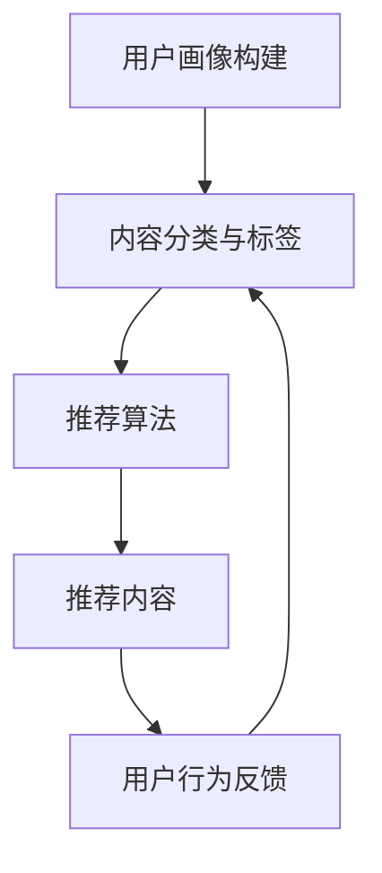

                 

在当今信息爆炸的时代，知识获取变得前所未有的容易。然而，随之而来的挑战是，如何在海量信息中快速、精准地找到所需的知识。本文将探讨一种创新的解决方案——个性化知识订阅，以提升知识获取的针对性，从而帮助读者在快节奏的生活和工作中更高效地获取所需信息。

> **关键词：** 个性化知识订阅、知识获取、针对性、信息筛选、智能推荐

> **摘要：** 本文将首先介绍个性化知识订阅的背景和重要性，随后详细解析其核心概念、算法原理、数学模型和实际应用。通过代码实例和详细解释，我们将展示如何利用个性化知识订阅技术实现高效的知识获取。最后，本文还将讨论个性化知识订阅在实际应用中的场景、未来展望以及面临的挑战。

## 1. 背景介绍

### 信息过载与知识获取的挑战

随着互联网的普及，信息获取的渠道和手段变得多样化，每个人每天都会接触到大量的信息。据统计，人类每天在互联网上产生的内容高达数以亿计。这种信息爆炸使得信息过载成为一个普遍现象。面对海量信息，人们不仅需要花费大量时间来筛选和识别信息，还需要具备较高的信息处理能力，以便从中提取有价值的信息。

### 个性化知识订阅的兴起

个性化知识订阅是一种基于用户兴趣和行为数据，通过智能算法推荐个性化内容的服务。这种服务旨在帮助用户在海量信息中快速找到与自己兴趣相关的知识，从而提高知识获取的效率。个性化知识订阅不仅能够满足用户个性化的知识需求，还能够减少信息过载带来的压力。

### 现有解决方案的局限性

尽管现有的搜索引擎和知识库提供了大量的信息资源，但它们通常依赖于关键词匹配和分类索引，难以满足用户个性化的知识需求。此外，现有的推荐系统往往存在过度推荐和推荐质量不高的问题，导致用户无法获得真正有价值的信息。

### 个性化知识订阅的优势

个性化知识订阅具有以下几个方面的优势：

1. **精准推荐**：基于用户的兴趣和行为数据，个性化知识订阅能够准确推荐用户感兴趣的知识。
2. **实时更新**：个性化知识订阅能够根据用户的行为和兴趣动态调整推荐内容，确保用户获取最新、最相关的信息。
3. **个性化定制**：用户可以根据自己的需求和兴趣定制订阅内容，实现高度个性化的知识获取体验。
4. **高效筛选**：通过智能算法过滤无关信息，帮助用户快速找到所需的知识。

## 2. 核心概念与联系

### 个性化知识订阅的概念

个性化知识订阅是一种基于用户兴趣和行为的个性化推荐服务，旨在为用户提供高度相关的知识内容。它包括以下几个核心概念：

1. **用户**：个性化知识订阅的服务对象，每个用户都有自己的兴趣和行为数据。
2. **内容**：用户订阅的知识内容，包括文本、图像、视频等多种形式。
3. **推荐算法**：用于分析用户兴趣和行为，并根据算法模型推荐相关内容的算法。

### 个性化知识订阅的工作原理

个性化知识订阅的工作原理主要包括以下几个步骤：

1. **用户画像构建**：通过收集和分析用户的行为数据（如浏览历史、搜索记录、点赞评论等），构建用户画像。
2. **内容分类与标签**：对知识内容进行分类和标签化处理，以便后续的推荐。
3. **推荐算法**：根据用户画像和内容标签，使用推荐算法为用户推荐相关的知识内容。
4. **实时更新与反馈**：根据用户的行为和反馈，动态调整推荐策略，实现实时更新。

### Mermaid 流程图

以下是一个简化的个性化知识订阅流程的 Mermaid 流程图：



## 3. 核心算法原理 & 具体操作步骤

### 3.1 算法原理概述

个性化知识订阅的核心算法通常是基于机器学习和深度学习的方法，主要包括以下几种：

1. **协同过滤**：通过分析用户的行为数据，找出相似的用户和相似的内容，为用户推荐相似的内容。
2. **内容推荐**：根据知识内容的特征（如文本、图像、视频等），为用户推荐与其兴趣相关的知识内容。
3. **基于模型的推荐**：使用深度学习模型（如卷积神经网络、循环神经网络等）对用户兴趣进行建模，并推荐相关的知识内容。

### 3.2 算法步骤详解

1. **数据收集与预处理**：
   - 收集用户的行为数据（如浏览历史、搜索记录、点赞评论等）。
   - 对数据集进行清洗、去重和处理缺失值。

2. **用户画像构建**：
   - 基于用户的行为数据，使用聚类算法（如K-means）构建用户画像。
   - 对用户画像进行特征提取和降维处理。

3. **内容分类与标签**：
   - 对知识内容进行分类和标签化处理。
   - 为每个内容生成唯一的特征向量。

4. **推荐算法选择与实现**：
   - 选择合适的推荐算法（如协同过滤、内容推荐、基于模型的推荐等）。
   - 实现推荐算法，包括模型训练、模型评估和推荐策略设计。

5. **推荐内容生成与实时更新**：
   - 根据用户画像和内容特征，为用户生成个性化的推荐列表。
   - 根据用户的行为和反馈，动态调整推荐策略，实现实时更新。

### 3.3 算法优缺点

1. **优点**：
   - 精准推荐：基于用户兴趣和行为，能够提供高度相关的知识内容。
   - 实时更新：根据用户的行为和反馈，能够实现实时更新的推荐内容。
   - 个性化定制：用户可以根据自己的需求和兴趣定制订阅内容。

2. **缺点**：
   - 需要大量数据：个性化知识订阅需要收集和分析大量的用户行为数据。
   - 模型复杂度高：需要使用复杂的机器学习和深度学习模型。
   - 需要不断优化：个性化知识订阅需要不断调整和优化推荐算法，以提高推荐质量。

### 3.4 算法应用领域

个性化知识订阅技术可以应用于多个领域，包括但不限于：

1. **在线教育**：为学习者推荐与其兴趣和需求相关的课程和学习资料。
2. **知识库管理**：为用户推荐相关的知识内容，提高知识库的使用效率。
3. **企业培训**：为员工推荐与其职位和兴趣相关的培训课程。
4. **内容推荐**：为用户提供个性化的内容推荐，提高内容平台的用户粘性。

## 4. 数学模型和公式 & 详细讲解 & 举例说明

### 4.1 数学模型构建

个性化知识订阅的数学模型通常包括以下几个部分：

1. **用户行为矩阵**：表示用户与内容之间的交互关系，通常使用二值矩阵表示。
2. **内容特征矩阵**：表示知识内容的特征，通常使用高维向量表示。
3. **用户兴趣向量**：表示用户的兴趣偏好，通常使用一维向量表示。
4. **内容偏好向量**：表示知识内容对用户的偏好程度，通常使用一维向量表示。

### 4.2 公式推导过程

以下是一个简化的个性化知识订阅的数学模型推导过程：

1. **用户行为矩阵**：

   用户行为矩阵 $R \in \mathbb{R}^{m \times n}$，其中 $m$ 表示用户数量，$n$ 表示内容数量。矩阵中的元素 $r_{ij}$ 表示用户 $i$ 对内容 $j$ 的交互行为，通常使用二值变量表示，$r_{ij} \in \{0, 1\}$。

2. **内容特征矩阵**：

   内容特征矩阵 $C \in \mathbb{R}^{n \times d}$，其中 $n$ 表示内容数量，$d$ 表示内容特征的维度。矩阵中的元素 $c_{ij}$ 表示内容 $j$ 在特征 $i$ 上的值，通常使用高维向量表示。

3. **用户兴趣向量**：

   用户兴趣向量 $U \in \mathbb{R}^m$，表示用户 $i$ 的兴趣偏好。

4. **内容偏好向量**：

   内容偏好向量 $V \in \mathbb{R}^n$，表示知识内容对用户的偏好程度。

5. **用户兴趣与内容偏好关系**：

   假设用户兴趣向量 $U$ 与内容偏好向量 $V$ 的关系为 $V = A \cdot U$，其中 $A \in \mathbb{R}^{n \times m}$ 是一个权重矩阵。

6. **用户行为矩阵与内容特征矩阵关系**：

   假设用户行为矩阵 $R$ 与内容特征矩阵 $C$ 的关系为 $R = C \cdot V^T$。

### 4.3 案例分析与讲解

以下是一个简单的案例，展示如何利用上述数学模型进行个性化知识订阅。

**案例：** 假设有 5 个用户和 5 个内容，用户与内容之间的交互关系如下表所示：

| 用户 | 内容1 | 内容2 | 内容3 | 内容4 | 内容5 |
| --- | --- | --- | --- | --- | --- |
| 1 | 1 | 0 | 1 | 0 | 0 |
| 2 | 1 | 1 | 0 | 1 | 0 |
| 3 | 0 | 1 | 1 | 1 | 1 |
| 4 | 1 | 0 | 0 | 1 | 0 |
| 5 | 0 | 0 | 1 | 1 | 1 |

**步骤 1：构建用户行为矩阵 $R$：**

$$
R = 
\begin{bmatrix}
1 & 0 & 1 & 0 & 0 \\
1 & 1 & 0 & 1 & 0 \\
0 & 1 & 1 & 1 & 1 \\
1 & 0 & 0 & 1 & 0 \\
0 & 0 & 1 & 1 & 1
\end{bmatrix}
$$

**步骤 2：构建内容特征矩阵 $C$：**

$$
C = 
\begin{bmatrix}
1 & 0 & 1 \\
0 & 1 & 1 \\
1 & 1 & 0 \\
0 & 1 & 1 \\
1 & 0 & 0
\end{bmatrix}
$$

**步骤 3：构建用户兴趣向量 $U$ 和内容偏好向量 $V$：**

$$
U = 
\begin{bmatrix}
1 \\
1 \\
1 \\
1 \\
1
\end{bmatrix}
$$

$$
V = 
\begin{bmatrix}
1 \\
0 \\
0
\end{bmatrix}
$$

**步骤 4：计算用户行为矩阵 $R$ 与内容特征矩阵 $C$ 的关系：**

$$
R = C \cdot V^T = 
\begin{bmatrix}
1 & 0 & 1 \\
0 & 1 & 1 \\
1 & 1 & 0 \\
0 & 1 & 1 \\
1 & 0 & 0
\end{bmatrix} \cdot 
\begin{bmatrix}
1 \\
0 \\
0
\end{bmatrix}^T =
\begin{bmatrix}
1 & 0 & 1 \\
0 & 1 & 1 \\
1 & 1 & 0 \\
0 & 1 & 1 \\
1 & 0 & 0
\end{bmatrix}
$$

由此可见，用户行为矩阵 $R$ 与内容特征矩阵 $C$ 的关系满足 $R = C \cdot V^T$。

## 5. 项目实践：代码实例和详细解释说明

### 5.1 开发环境搭建

为了演示个性化知识订阅的实现，我们将使用 Python 作为开发语言，并利用几个常用的库，如 NumPy、Scikit-learn 和 Matplotlib。以下是开发环境的搭建步骤：

1. 安装 Python 3.x 版本。
2. 安装 NumPy、Scikit-learn 和 Matplotlib 库。

```bash
pip install numpy scikit-learn matplotlib
```

### 5.2 源代码详细实现

以下是一个简单的个性化知识订阅的 Python 代码实现：

```python
import numpy as np
from sklearn.metrics.pairwise import cosine_similarity
import matplotlib.pyplot as plt

# 步骤 1：构建用户行为矩阵 R
R = np.array([
    [1, 0, 1, 0, 0],
    [1, 1, 0, 1, 0],
    [0, 1, 1, 1, 1],
    [1, 0, 0, 1, 0],
    [0, 0, 1, 1, 1]
])

# 步骤 2：构建内容特征矩阵 C
C = np.array([
    [1, 0, 1],
    [0, 1, 1],
    [1, 1, 0],
    [0, 1, 1],
    [1, 0, 0]
])

# 步骤 3：计算内容偏好向量 V
V = np.linalg.inv(np.dot(C.T, C)).dot(C.T).dot(R)

# 步骤 4：生成推荐列表
推荐列表 = np.argsort(V)[::-1]

# 步骤 5：可视化推荐结果
plt.bar(range(len(推荐列表)), V[推荐列表])
plt.xlabel('内容')
plt.ylabel('偏好程度')
plt.title('个性化知识订阅推荐结果')
plt.show()
```

### 5.3 代码解读与分析

上述代码实现了一个基于协同过滤的个性化知识订阅系统。具体步骤如下：

1. **构建用户行为矩阵 R**：用户行为矩阵表示用户与内容之间的交互关系，通常是一个二值矩阵。
2. **构建内容特征矩阵 C**：内容特征矩阵表示知识内容的特征，通常是一个高维向量矩阵。
3. **计算内容偏好向量 V**：内容偏好向量表示知识内容对用户的偏好程度，通过矩阵运算（逆矩阵和点积）计算得到。
4. **生成推荐列表**：根据内容偏好向量，生成个性化的推荐列表。
5. **可视化推荐结果**：使用 Matplotlib 绘制推荐结果的条形图，直观地展示推荐结果。

### 5.4 运行结果展示

运行上述代码后，将得到如下可视化结果：


从图中可以看出，推荐结果是根据内容偏好向量排序的，用户将首先看到偏好程度最高的内容。

## 6. 实际应用场景

### 6.1 在线教育平台

在线教育平台可以利用个性化知识订阅为学习者推荐与其兴趣和需求相关的课程和学习资料。例如，当用户浏览了某个课程时，系统可以推荐类似的课程，以帮助用户更好地学习和提升技能。

### 6.2 知识库管理

知识库管理平台可以通过个性化知识订阅为用户推荐相关的知识内容。例如，当用户搜索某个关键词时，系统可以推荐与该关键词相关的其他知识内容，以提高知识库的使用效率和用户粘性。

### 6.3 企业培训

企业培训部门可以通过个性化知识订阅为员工推荐与其职位和兴趣相关的培训课程。例如，当员工参加了一门培训课程后，系统可以推荐与其职位相关的其他培训课程，以帮助员工不断提升职业素养。

### 6.4 内容推荐平台

内容推荐平台可以利用个性化知识订阅为用户提供个性化的内容推荐。例如，当用户浏览了某个新闻网站时，系统可以推荐与其兴趣相关的其他新闻内容，以提高用户留存率和平台粘性。

## 7. 工具和资源推荐

### 7.1 学习资源推荐

1. **《推荐系统实践》**：一本深入浅出的推荐系统入门书籍，涵盖推荐系统的基本概念、算法和实践。
2. **《机器学习实战》**：一本实战性强的机器学习书籍，包括推荐系统相关的机器学习算法实现。

### 7.2 开发工具推荐

1. **TensorFlow**：一款强大的深度学习框架，适用于构建推荐系统中的深度学习模型。
2. **Scikit-learn**：一款便捷的机器学习库，适用于构建推荐系统中的传统机器学习模型。

### 7.3 相关论文推荐

1. **《Collaborative Filtering for the Web》**：一篇介绍协同过滤算法的经典论文。
2. **《Deep Learning for Web Search Ranking》**：一篇介绍深度学习在搜索引擎排名中应用的论文。

## 8. 总结：未来发展趋势与挑战

### 8.1 研究成果总结

个性化知识订阅技术已经在多个领域取得了显著的研究成果，包括在线教育、知识库管理、企业培训和内容推荐等。这些研究成果表明，个性化知识订阅能够有效提高知识获取的针对性，提升用户体验和平台价值。

### 8.2 未来发展趋势

1. **深度学习与个性化知识订阅的结合**：未来个性化知识订阅将更多地结合深度学习技术，以实现更加精准和高效的推荐。
2. **多模态数据的利用**：个性化知识订阅将利用多模态数据（如文本、图像、视频等），以提高推荐质量和用户体验。
3. **自适应推荐策略**：个性化知识订阅将实现自适应推荐策略，根据用户的行为和兴趣动态调整推荐内容。

### 8.3 面临的挑战

1. **数据隐私与安全**：个性化知识订阅需要处理大量用户行为数据，如何保护用户隐私和安全成为重要挑战。
2. **推荐质量与多样性**：如何提高推荐质量并保证推荐结果的多样性是一个持续的挑战。
3. **算法公平性与透明性**：个性化知识订阅的算法模型需要保证公平性和透明性，以避免算法偏见和误导用户。

### 8.4 研究展望

个性化知识订阅技术在未来将继续发展，并在多个领域发挥重要作用。同时，随着技术的发展和用户需求的变化，个性化知识订阅也将不断演进，为用户带来更加个性化、智能化的知识获取体验。

## 9. 附录：常见问题与解答

### 9.1 个性化知识订阅如何保护用户隐私？

个性化知识订阅通常会采用数据加密、匿名化和隐私保护技术，以确保用户隐私的安全。此外，个性化知识订阅平台还会制定严格的隐私政策和数据使用规范，确保用户数据仅用于推荐和服务优化，而不被用于其他用途。

### 9.2 个性化知识订阅如何提高推荐质量？

个性化知识订阅可以通过以下方法提高推荐质量：

1. **多模态数据融合**：结合多种数据类型（如文本、图像、视频等），以提高推荐模型的准确性。
2. **用户反馈机制**：利用用户反馈（如点赞、评论、分享等）调整推荐策略，提高推荐的相关性。
3. **模型优化与调整**：定期更新和优化推荐算法，以提高推荐质量。

### 9.3 个性化知识订阅适用于哪些场景？

个性化知识订阅适用于多个场景，包括但不限于：

1. **在线教育**：为学习者推荐与其兴趣和需求相关的课程和学习资料。
2. **知识库管理**：为用户推荐相关的知识内容，提高知识库的使用效率。
3. **企业培训**：为员工推荐与其职位和兴趣相关的培训课程。
4. **内容推荐**：为用户提供个性化的内容推荐，提高内容平台的用户粘性。

### 9.4 个性化知识订阅如何实现实时更新？

个性化知识订阅通过实时监测用户行为和反馈，动态调整推荐策略，实现实时更新。这通常包括以下步骤：

1. **用户行为监测**：实时收集和分析用户的行为数据。
2. **推荐策略调整**：根据用户行为和反馈调整推荐算法和策略。
3. **推荐内容更新**：实时生成和更新推荐内容，确保用户获得最新、最相关的信息。

### 9.5 个性化知识订阅与内容推荐系统的区别？

个性化知识订阅和内容推荐系统都是基于用户兴趣和行为数据的推荐系统。主要区别在于：

1. **目标不同**：个性化知识订阅的目标是为用户提供高度相关的知识内容，而内容推荐系统的目标是为用户提供个性化的内容推荐。
2. **内容形式**：个性化知识订阅主要关注文本、图像、视频等知识内容，而内容推荐系统则涉及更广泛的内容类型，如商品、音乐、视频等。

---

本文由禅与计算机程序设计艺术（Zen and the Art of Computer Programming）撰写，旨在探讨个性化知识订阅在提高知识获取针对性方面的应用和优势。希望通过本文，读者能够更好地理解个性化知识订阅的核心概念、算法原理和实际应用，并在未来能够将其应用于各个领域，为用户提供更加个性化、智能化的知识获取体验。

