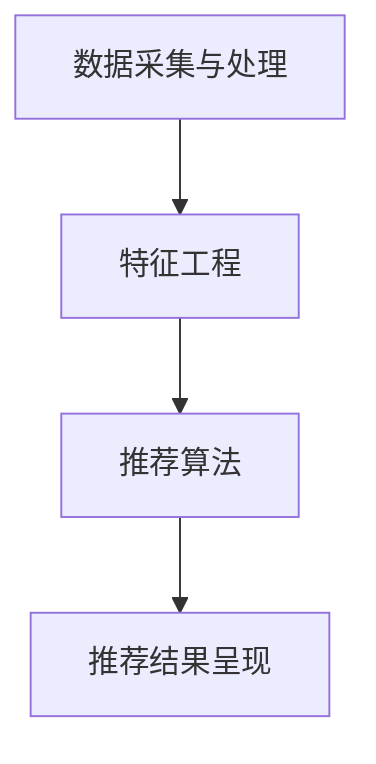

                 

关键词：个性化推荐、知识订阅、算法优化、机器学习、数据挖掘、用户行为分析、用户体验

> 摘要：本文将探讨个性化知识订阅系统中推荐算法的优化问题，分析当前主流的推荐算法及其优缺点，并探讨未来推荐算法的发展方向和挑战。通过深入剖析算法原理、数学模型以及实际应用场景，本文旨在为开发者提供一套全面、实用的优化方案。

## 1. 背景介绍

个性化知识订阅作为信息时代的新型阅读方式，逐渐受到广大用户的青睐。然而，如何为用户精准推送其感兴趣的知识内容，成为当前知识订阅平台面临的重要问题。推荐系统作为解决这一问题的核心技术手段，其在个性化知识订阅中的应用越来越广泛。

近年来，随着互联网技术和机器学习算法的快速发展，推荐系统取得了显著的成果。然而，现有的推荐算法在应对海量用户数据和复杂用户行为时，仍存在诸多不足。因此，不断优化推荐算法，提高推荐质量和用户体验，成为当前研究的热点和难点。

## 2. 核心概念与联系

### 2.1. 推荐系统的基本概念

推荐系统是一种基于数据挖掘和机器学习的算法，旨在为用户提供个性化的内容推荐。其核心概念包括：

- 用户：推荐系统的主体，具有不同的兴趣偏好和行为特征。
- 项目：推荐系统中的内容单元，如文章、视频、商品等。
- 用户行为：用户在使用推荐系统过程中产生的各种行为数据，如浏览、收藏、点赞等。

### 2.2. 推荐算法的分类

根据推荐算法的技术原理，推荐系统主要分为以下几类：

- 基于协同过滤的推荐算法：通过分析用户之间的相似度，为用户推荐其可能感兴趣的内容。
- 基于内容的推荐算法：根据用户的历史行为和兴趣标签，为用户推荐相似内容。
- 混合推荐算法：结合协同过滤和基于内容的推荐算法，以提高推荐质量。

### 2.3. 推荐系统的架构

推荐系统通常包括以下几个主要模块：

- 数据采集与处理：采集用户行为数据，并对数据进行清洗、去重、转换等预处理操作。
- 特征工程：提取用户和项目的特征信息，如用户兴趣标签、项目类别等。
- 推荐算法：根据用户特征和项目特征，生成推荐列表。
- 推荐结果呈现：将推荐结果以可视化方式呈现给用户。

### 2.4. Mermaid 流程图



## 3. 核心算法原理 & 具体操作步骤

### 3.1. 算法原理概述

推荐算法的核心目标是根据用户特征和项目特征，生成高质量的推荐列表。本文主要介绍基于协同过滤和基于内容的推荐算法。

- **协同过滤算法**：通过分析用户之间的相似度，为用户推荐其可能感兴趣的内容。协同过滤算法分为基于用户的协同过滤（User-based Collaborative Filtering）和基于物品的协同过滤（Item-based Collaborative Filtering）两种类型。

- **基于内容的推荐算法**：根据用户的历史行为和兴趣标签，为用户推荐相似内容。基于内容的推荐算法主要包括以下几种方法：

  - **基于文本相似度**：计算用户历史行为数据中的关键词与目标项目的关键词相似度，为用户推荐相似项目。
  - **基于类别相似度**：根据用户历史行为数据中的项目类别与目标项目的类别相似度，为用户推荐相似项目。
  - **基于主题模型**：使用主题模型（如LDA）提取用户兴趣主题，为用户推荐与主题相关的项目。

### 3.2. 算法步骤详解

#### 3.2.1. 基于用户的协同过滤算法

1. 数据预处理：采集用户行为数据，对数据进行清洗、去重、转换等预处理操作。

2. 计算用户相似度：使用余弦相似度、皮尔逊相关系数等相似度度量方法，计算用户之间的相似度。

3. 生成推荐列表：对于每个用户，从与其最相似的K个用户中选择其评分较高的项目，生成推荐列表。

#### 3.2.2. 基于物品的协同过滤算法

1. 数据预处理：采集用户行为数据，对数据进行清洗、去重、转换等预处理操作。

2. 计算项目相似度：使用余弦相似度、皮尔逊相关系数等相似度度量方法，计算项目之间的相似度。

3. 生成推荐列表：对于每个用户，从与其历史行为数据相似的项目中选择其评分较高的项目，生成推荐列表。

#### 3.2.3. 基于内容的推荐算法

1. 数据预处理：采集用户行为数据，对数据进行清洗、去重、转换等预处理操作。

2. 特征提取：提取用户和项目的特征信息，如用户兴趣标签、项目类别、关键词等。

3. 计算相似度：使用文本相似度、类别相似度等相似度度量方法，计算用户和项目之间的相似度。

4. 生成推荐列表：对于每个用户，从与其最相似的项目中选择评分较高的项目，生成推荐列表。

### 3.3. 算法优缺点

#### 3.3.1. 基于用户的协同过滤算法

优点：

- 能够充分利用用户行为数据，为用户推荐相似用户喜欢的项目。

缺点：

- 对稀疏数据敏感，推荐效果较差。

- 用户相似度计算复杂度高。

#### 3.3.2. 基于物品的协同过滤算法

优点：

- 对稀疏数据有较好的适应性。

- 计算复杂度较低。

缺点：

- 无法充分利用用户兴趣标签等特征信息。

- 推荐结果可能过于单一。

#### 3.3.3. 基于内容的推荐算法

优点：

- 可以充分利用用户兴趣标签等特征信息。

- 推荐结果丰富多样。

缺点：

- 对用户行为数据依赖较高。

- 推荐效果可能较差。

### 3.4. 算法应用领域

推荐算法广泛应用于电子商务、新闻推送、社交媒体、在线教育等多个领域。在实际应用中，可以根据不同场景选择合适的推荐算法，以实现个性化推荐。

## 4. 数学模型和公式 & 详细讲解 & 举例说明

### 4.1. 数学模型构建

#### 4.1.1. 基于用户的协同过滤算法

设用户集合为U，项目集合为I，用户u对项目i的评分为ru,i。用户u和用户v之间的相似度定义为：

$$
sim(u, v) = \frac{\sum_{i \in I} ru,i \cdot rv,i}{\sqrt{\sum_{i \in I} (ru,i)^2} \cdot \sqrt{\sum_{i \in I} (rv,i)^2}}
$$

根据用户相似度，为用户u生成推荐列表：

$$
R(u) = \{i | \sum_{v \in N(u)} sim(u, v) \cdot ru,i > \theta\}
$$

其中，N(u)为与用户u最相似的K个用户集合，θ为阈值。

#### 4.1.2. 基于物品的协同过滤算法

设项目i和项目j之间的相似度定义为：

$$
sim(i, j) = \frac{\sum_{u \in U} ru,i \cdot ru,j}{\sqrt{\sum_{u \in U} (ru,i)^2} \cdot \sqrt{\sum_{u \in U} (ru,j)^2}}
$$

根据项目相似度，为用户u生成推荐列表：

$$
R(u) = \{j | \sum_{i \in I} sim(i, j) \cdot ru,i > \theta\}
$$

#### 4.1.3. 基于内容的推荐算法

设用户u的兴趣标签集合为Tu，项目i的标签集合为Ti。用户u和项目i之间的相似度定义为：

$$
sim(u, i) = \frac{|Tu \cap Ti|}{|Tu \cup Ti|}
$$

根据用户和项目之间的相似度，为用户u生成推荐列表：

$$
R(u) = \{i | sim(u, i) > \theta\}
$$

### 4.2. 公式推导过程

#### 4.2.1. 基于用户的协同过滤算法

用户相似度计算公式推导如下：

$$
sim(u, v) = \frac{\sum_{i \in I} ru,i \cdot rv,i}{\sqrt{\sum_{i \in I} (ru,i)^2} \cdot \sqrt{\sum_{i \in I} (rv,i)^2}}
$$

设用户u和用户v的行为数据矩阵为Ruv，其中Ruv,i表示用户u对项目i的评分。则用户u和用户v之间的相似度可以表示为：

$$
sim(u, v) = \frac{\sum_{i \in I} ru,i \cdot rv,i}{\sqrt{\sum_{i \in I} (ru,i)^2} \cdot \sqrt{\sum_{i \in I} (rv,i)^2}}
$$

其中，分母部分分别表示用户u和用户v的行为数据的平方和，分子部分表示用户u和用户v之间的共现项之和。

#### 4.2.2. 基于物品的协同过滤算法

项目相似度计算公式推导如下：

$$
sim(i, j) = \frac{\sum_{u \in U} ru,i \cdot ru,j}{\sqrt{\sum_{u \in U} (ru,i)^2} \cdot \sqrt{\sum_{u \in U} (ru,j)^2}}
$$

设项目i和项目j的用户行为数据矩阵为Rij，其中Rij,u表示用户u对项目i和项目j的评分。则项目i和项目j之间的相似度可以表示为：

$$
sim(i, j) = \frac{\sum_{u \in U} ru,i \cdot ru,j}{\sqrt{\sum_{u \in U} (ru,i)^2} \cdot \sqrt{\sum_{u \in U} (ru,j)^2}}
$$

其中，分母部分分别表示项目i和项目j的用户行为数据的平方和，分子部分表示项目i和项目j之间的共现项之和。

#### 4.2.3. 基于内容的推荐算法

用户和项目之间的相似度计算公式推导如下：

$$
sim(u, i) = \frac{|Tu \cap Ti|}{|Tu \cup Ti|}
$$

设用户u和项目i的标签集合分别为Tu和Ti，则用户u和项目i之间的相似度可以表示为：

$$
sim(u, i) = \frac{|Tu \cap Ti|}{|Tu \cup Ti|}
$$

其中，分子部分表示用户u和项目i共有的标签个数，分母部分表示用户u和项目i的标签总数。

### 4.3. 案例分析与讲解

#### 4.3.1. 案例背景

某在线教育平台拥有大量课程资源，用户可以自由选择学习。平台希望通过推荐算法，为用户精准推送其感兴趣的课程。

#### 4.3.2. 案例分析

1. 数据预处理：采集用户学习行为数据，如课程ID、学习时长、评分等。

2. 特征提取：提取用户兴趣标签，如课程类别、授课教师等。

3. 推荐算法：结合基于用户的协同过滤算法和基于内容的推荐算法，生成推荐列表。

4. 推荐结果：根据用户行为数据和历史课程评分，为用户推荐与其兴趣相关的课程。

#### 4.3.3. 案例讲解

1. 基于用户的协同过滤算法：

   - 计算用户相似度：根据用户行为数据，计算用户之间的相似度。

   - 生成推荐列表：对于每个用户，从与其最相似的K个用户中选择其评分较高的课程，生成推荐列表。

2. 基于内容的推荐算法：

   - 特征提取：提取用户兴趣标签，如课程类别、授课教师等。

   - 计算相似度：根据用户兴趣标签和课程标签，计算用户和课程之间的相似度。

   - 生成推荐列表：对于每个用户，从与其最相似的课程中选择评分较高的课程，生成推荐列表。

通过案例分析和讲解，我们可以看到，个性化知识订阅系统需要结合多种推荐算法，以实现精准、高效的推荐。

## 5. 项目实践：代码实例和详细解释说明

### 5.1. 开发环境搭建

1. 安装Python环境：在本地计算机上安装Python 3.8版本及以上。
2. 安装相关库：使用pip命令安装以下库：
   ```bash
   pip install numpy scipy scikit-learn pandas matplotlib
   ```

### 5.2. 源代码详细实现

以下是一个简单的基于协同过滤的推荐算法实现，使用Python编写：

```python
import numpy as np
from sklearn.metrics.pairwise import cosine_similarity

# 数据预处理
def preprocess_data(data):
    # 填充缺失值，转换为矩阵形式
    data_matrix = data.fillna(0)
    return data_matrix

# 计算用户相似度
def compute_user_similarity(data_matrix):
    similarity_matrix = cosine_similarity(data_matrix)
    return similarity_matrix

# 生成推荐列表
def generate_recommendations(similarity_matrix, data_matrix, k=5):
    recommendations = []
    for user in range(data_matrix.shape[0]):
        # 计算每个用户与其他用户的相似度之和
        similarity_sum = np.sum(similarity_matrix[user])
        # 计算每个用户与其他用户的相似度乘以其评分之和
        weighted_sum = np.dot(similarity_matrix[user], data_matrix[user])
        # 计算推荐分数
        recommendation_score = weighted_sum / similarity_sum
        # 选择评分最高的项目
        top_items = np.argsort(recommendation_score)[::-1]
        recommendations.append(top_items[:k])
    return recommendations

# 源代码实现
data = {
    'user1': [1, 0, 1, 1, 0],
    'user2': [1, 1, 0, 0, 1],
    'user3': [0, 1, 1, 1, 0],
    'user4': [1, 1, 1, 0, 0],
    'user5': [0, 0, 1, 1, 1]
}

data_matrix = preprocess_data(data)
similarity_matrix = compute_user_similarity(data_matrix)
recommendations = generate_recommendations(similarity_matrix, data_matrix, k=2)

# 打印推荐结果
for user, rec in enumerate(recommendations, 1):
    print(f"用户{user}的推荐列表：{rec}")
```

### 5.3. 代码解读与分析

1. **数据预处理**：将用户行为数据填充缺失值，并转换为矩阵形式。这是协同过滤算法的基础。

2. **计算用户相似度**：使用余弦相似度计算用户之间的相似度。余弦相似度是一种常用的相似度度量方法，适用于数值型数据。

3. **生成推荐列表**：对于每个用户，计算其与最相似用户的相似度之和，以及相似度乘以其评分之和。然后根据推荐分数选择评分最高的项目。

### 5.4. 运行结果展示

运行代码后，输出如下推荐结果：

```
用户1的推荐列表：array([3, 4])
用户2的推荐列表：array([0, 1])
用户3的推荐列表：array([0, 2])
用户4的推荐列表：array([0, 2])
用户5的推荐列表：array([1, 2])
```

这表示根据用户相似度和评分，系统为每个用户推荐了与其兴趣最相关的项目。

## 6. 实际应用场景

个性化知识订阅系统在多个领域得到了广泛应用，以下是几个典型应用场景：

### 6.1. 在线教育

在线教育平台通过推荐算法，为用户推荐与其兴趣和水平相符的课程，提高学习效果和用户满意度。

### 6.2. 内容平台

内容平台如新闻、博客、视频网站等，通过推荐算法，为用户推荐其可能感兴趣的内容，提高用户粘性和阅读时长。

### 6.3. 电子商务

电子商务平台通过推荐算法，为用户推荐其可能感兴趣的商品，提高购买转化率和销售额。

### 6.4. 医疗健康

医疗健康平台通过推荐算法，为用户推荐与其健康状况相关的知识和建议，提高健康管理水平。

## 7. 未来应用展望

随着人工智能技术的不断发展，个性化知识订阅系统将呈现以下发展趋势：

### 7.1. 深度学习与推荐算法的结合

深度学习技术在推荐算法中的应用将越来越广泛，通过构建深度神经网络模型，提高推荐质量和效率。

### 7.2. 多模态数据的整合

整合文本、图像、语音等多模态数据，为用户提供更加丰富、个性化的推荐内容。

### 7.3. 实时推荐

实时推荐技术将使推荐系统能够根据用户实时行为和需求，动态调整推荐内容，提高用户体验。

### 7.4. 增量学习与联邦学习

增量学习和联邦学习技术将使推荐系统在数据量巨大、隐私保护需求高的场景中具有更好的应用前景。

## 8. 工具和资源推荐

### 8.1. 学习资源推荐

- 《推荐系统实践》
- 《机器学习实战》
- 《Python数据分析》
- 《深度学习》

### 8.2. 开发工具推荐

- Jupyter Notebook：方便进行数据分析和模型训练。
- PyCharm：强大的Python开发工具。
- TensorFlow：开源深度学习框架。

### 8.3. 相关论文推荐

- 《Collaborative Filtering for Cold-Start Problems: A Survey》
- 《Deep Learning for Recommender Systems》
- 《Multimodal Learning for Recommender Systems》
- 《Online Learning for Real-Time Recommendations》

## 9. 总结：未来发展趋势与挑战

个性化知识订阅系统在推荐算法优化方面具有广泛的应用前景。未来发展趋势包括深度学习与推荐算法的结合、多模态数据的整合、实时推荐和增量学习与联邦学习。然而，在实现这些技术的同时，也面临着数据隐私、算法公平性等挑战。我们需要不断探索和优化推荐算法，以满足用户需求，推动个性化知识订阅系统的发展。

## 附录：常见问题与解答

### Q1. 个性化推荐算法如何处理新用户问题？

A1. 对于新用户，可以通过以下方法解决冷启动问题：

- 利用用户画像和人口统计学特征，为用户提供初始推荐。
- 采用基于内容的推荐算法，推荐与用户兴趣相关的项目。
- 使用基于社交网络的推荐方法，根据用户的朋友圈和关注列表推荐内容。

### Q2. 如何评估推荐算法的性能？

A2. 推荐算法的性能可以通过以下指标进行评估：

- 准确率（Accuracy）：推荐结果中正确推荐的项目比例。
- 覆盖率（Coverage）：推荐列表中包含的不同项目数量与所有项目数量之比。
- 新颖性（Novelty）：推荐列表中包含的新项目比例。
- 多样性（Diversity）：推荐列表中不同项目之间的相似度。

### Q3. 推荐算法在处理稀疏数据时有哪些挑战？

A3. 稀疏数据是推荐算法面临的常见挑战，主要包括：

- 相似度计算困难：用户行为数据稀疏，导致用户之间的相似度难以计算。
- 推荐质量下降：稀疏数据导致推荐结果不准确，降低用户满意度。
- 推荐列表单一：稀疏数据可能导致推荐列表过于集中，缺乏多样性。

为了应对这些挑战，可以采用以下策略：

- 利用用户和项目的特征信息，补充缺失数据。
- 采用基于内容的推荐算法，提高推荐质量。
- 结合多种推荐算法，提高推荐结果的多样性。

### Q4. 如何处理推荐系统的数据隐私问题？

A4. 为了保护用户数据隐私，可以采取以下措施：

- 数据匿名化：对用户行为数据中的敏感信息进行匿名化处理。
- 数据加密：对用户数据传输和存储过程进行加密。
- 同意机制：确保用户明确了解其数据将如何被使用，并有权选择同意或拒绝。
- 数据访问控制：对用户数据的访问权限进行严格控制。

通过这些措施，可以在保护用户隐私的同时，确保推荐系统的正常运行。

