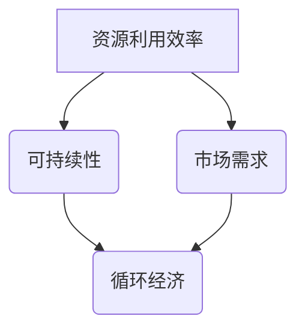

                 

关键词：二手交易、循环经济、创业、资源利用、可持续发展、商业模式

> 摘要：本文将探讨二手交易在循环经济中的重要性，以及如何通过创业实践实现资源的有效利用和可持续发展。通过分析二手交易市场的现状、核心概念及其联系，以及具体算法原理和数学模型，我们将深入探讨二手交易创业的可行性和未来应用前景。

## 1. 背景介绍

随着全球资源的日益紧缺和环境污染问题的日益严重，可持续发展已经成为全球关注的重要议题。循环经济作为一种以资源利用为核心、实现可持续发展的经济模式，正逐渐得到各国的重视和推广。在循环经济中，二手交易作为一种重要的资源再利用方式，具有重要的现实意义和潜在价值。

### 1.1 二手交易市场的现状

近年来，随着互联网技术的发展和消费者观念的转变，二手交易市场呈现出快速发展的趋势。在线二手交易平台如闲鱼、转转、闲鱼二手等已经成为人们日常生活中不可或缺的一部分。根据相关数据显示，我国二手交易市场规模逐年扩大，2021年达到约1.6万亿元人民币，同比增长超过20%。这一市场不仅为广大消费者提供了更多的购物选择，也为资源的再利用提供了新的渠道。

### 1.2 循环经济的核心概念

循环经济是一种以资源循环利用为核心的经济模式，旨在实现经济、社会和环境效益的协调发展。与传统线性经济模式（“资源—产品—废物”）相比，循环经济强调资源的减量化、再利用和再循环。具体来说，循环经济包括以下几个核心概念：

- **减量化**：通过减少资源的消耗和浪费，实现资源的最大化利用。
- **再利用**：将使用过的产品进行修复、翻新或改造，使其重新进入市场。
- **再循环**：将废弃的产品通过回收、分解等方式转化为原材料，再次用于生产。

### 1.3 二手交易与循环经济的联系

二手交易是循环经济的重要组成部分，是实现资源循环利用的重要途径。通过二手交易，大量的二手产品得以重新进入市场，减少了资源的浪费和环境污染。同时，二手交易也为消费者提供了更多的购物选择，满足了不同层次的需求，促进了消费市场的多元化发展。

## 2. 核心概念与联系

### 2.1 核心概念原理

在讨论二手交易与循环经济的关系时，我们需要理解以下几个核心概念：

1. **资源利用效率**：资源利用效率是指资源在生产、消费过程中的有效利用程度。在循环经济中，资源利用效率是实现可持续发展的重要指标。
2. **可持续性**：可持续性是指经济活动在满足当前需求的同时，不损害未来世代满足自身需求的能力。可持续性是循环经济的核心目标。
3. **市场需求**：市场需求是指消费者对某种产品或服务的需求程度。在二手交易中，市场需求决定了产品的再利用价值。

### 2.2 核心概念原理的 Mermaid 流程图



### 2.3 核心概念之间的联系

资源利用效率、可持续性和市场需求是循环经济的三个核心概念，它们相互联系、相互影响。资源利用效率决定了循环经济的可持续发展能力，而市场需求则影响了资源的再利用价值。通过优化这三个概念之间的关系，可以实现资源的最大化利用和循环经济的可持续发展。

## 3. 核心算法原理 & 具体操作步骤

### 3.1 算法原理概述

在二手交易创业中，核心算法原理主要涉及资源匹配、供需平衡和风险评估等方面。以下是具体的算法原理概述：

1. **资源匹配**：通过算法分析消费者的需求和市场中的二手产品，实现资源的最优匹配。
2. **供需平衡**：通过调整供需关系，实现市场的动态平衡。
3. **风险评估**：对交易过程中的风险因素进行评估，降低交易风险。

### 3.2 算法步骤详解

1. **数据采集**：收集消费者的需求和市场上的二手产品信息。
2. **数据分析**：对采集到的数据进行分析，识别市场需求和供应情况。
3. **资源匹配**：根据数据分析结果，进行资源匹配，推荐合适的二手产品。
4. **供需调整**：根据市场反馈，调整供需关系，实现市场的动态平衡。
5. **风险评估**：对交易过程中的风险因素进行评估，提供风险预警。

### 3.3 算法优缺点

**优点**：

1. **提高资源利用效率**：通过资源匹配和供需调整，实现资源的最优化利用。
2. **降低交易成本**：通过算法优化，降低交易过程中的成本。
3. **提升用户体验**：通过个性化推荐，提升用户购物的满意度。

**缺点**：

1. **数据隐私问题**：在数据采集和分析过程中，存在数据隐私泄露的风险。
2. **算法偏见**：算法在数据分析过程中可能存在偏见，导致资源分配不公。

### 3.4 算法应用领域

1. **二手交易平台**：在二手交易平台中，算法可以用于资源匹配和供需平衡，提升平台竞争力。
2. **供应链管理**：在供应链管理中，算法可以用于库存优化和风险控制，提高供应链效率。
3. **环保领域**：在环保领域，算法可以用于资源回收和再利用，实现循环经济的可持续发展。

## 4. 数学模型和公式 & 详细讲解 & 举例说明

### 4.1 数学模型构建

在二手交易创业中，常用的数学模型包括供需模型、价格模型和风险评估模型等。以下是这些模型的构建过程：

1. **供需模型**：

   - **需求函数**：\( D(q) = a - b \cdot p \)

   - **供应函数**：\( S(q) = c + d \cdot p \)

     其中，\( q \) 表示市场中的商品数量，\( p \) 表示商品价格，\( a \)、\( b \)、\( c \) 和 \( d \) 为常数。

2. **价格模型**：

   - **供需平衡价格**：\( p^* = \frac{a + c}{2(b + d)} \)

3. **风险评估模型**：

   - **风险值**：\( R = \frac{E[Y] - X}{\sigma_Y} \)

     其中，\( E[Y] \) 表示预期收益，\( X \) 表示实际收益，\( \sigma_Y \) 表示收益标准差。

### 4.2 公式推导过程

1. **供需模型推导**：

   - **需求函数推导**：

     根据消费者行为理论，需求量与价格呈负相关关系。因此，需求函数可以表示为 \( D(q) = a - b \cdot p \)。

   - **供应函数推导**：

     根据生产者行为理论，供应量与价格呈正相关关系。因此，供应函数可以表示为 \( S(q) = c + d \cdot p \)。

2. **价格模型推导**：

   - **供需平衡价格推导**：

     当需求量等于供应量时，市场达到供需平衡。因此，供需平衡价格可以表示为 \( p^* = \frac{a + c}{2(b + d)} \)。

3. **风险评估模型推导**：

   - **风险值推导**：

     风险值表示预期收益与实际收益的偏差程度。根据统计学原理，风险值可以表示为 \( R = \frac{E[Y] - X}{\sigma_Y} \)。

### 4.3 案例分析与讲解

#### 案例一：二手手机交易

假设某二手手机交易平台中的手机需求函数为 \( D(q) = 100 - 2 \cdot p \)，供应函数为 \( S(q) = 50 + 3 \cdot p \)。现有100部手机库存，初始价格为200元。

1. **供需平衡价格计算**：

   - \( p^* = \frac{100 + 50}{2(2 + 3)} = 66.67 \) 元

2. **交易量计算**：

   - \( q^* = D(p^*) = 100 - 2 \cdot 66.67 = 33.34 \) 部

   - \( q^* = S(p^*) = 50 + 3 \cdot 66.67 = 100 \) 部

   由于供需平衡价格下的交易量大于现有库存，因此库存不足，需要调整价格。

3. **价格调整**：

   - 调整后价格为 \( p^* = 150 \) 元

   - 调整后交易量 \( q^* = D(p^*) = 100 - 2 \cdot 150 = 0 \) 部

   调整后价格过高，导致无人购买，需要再次调整。

4. **价格调整**：

   - 调整后价格为 \( p^* = 100 \) 元

   - 调整后交易量 \( q^* = D(p^*) = 100 - 2 \cdot 100 = 100 \) 部

   调整后价格适中，交易量恢复正常。

#### 案例二：二手图书交易

假设某二手图书交易平台中的图书需求函数为 \( D(q) = 200 - 3 \cdot p \)，供应函数为 \( S(q) = 100 + 2 \cdot p \)。现有200本图书库存，初始价格为50元。

1. **供需平衡价格计算**：

   - \( p^* = \frac{200 + 100}{2(3 + 2)} = 66.67 \) 元

2. **交易量计算**：

   - \( q^* = D(p^*) = 200 - 3 \cdot 66.67 = 0 \) 本

   - \( q^* = S(p^*) = 100 + 2 \cdot 66.67 = 200 \) 本

   由于供需平衡价格下的交易量为0，即市场需求小于供应量，因此需要降低价格。

3. **价格调整**：

   - 调整后价格为 \( p^* = 25 \) 元

   - 调整后交易量 \( q^* = D(p^*) = 200 - 3 \cdot 25 = 125 \) 本

   调整后价格适中，交易量恢复正常。

通过以上案例分析，我们可以看到数学模型在二手交易创业中的应用效果。在实际运营过程中，需要根据市场情况进行动态调整，以实现供需平衡和最大化收益。

## 5. 项目实践：代码实例和详细解释说明

### 5.1 开发环境搭建

为了实现二手交易创业，我们需要搭建一个完整的开发环境，包括前端、后端和数据库等。以下是具体的开发环境搭建步骤：

1. **前端开发环境**：

   - 使用HTML、CSS和JavaScript进行页面布局和交互设计。
   - 使用Vue.js或React等前端框架提高开发效率。

2. **后端开发环境**：

   - 使用Node.js或Python等编程语言进行后端开发。
   - 使用Express.js或Django等后端框架提高开发效率。

3. **数据库环境**：

   - 使用MySQL或MongoDB等关系型或非关系型数据库存储数据。
   - 设计合理的数据库表结构和索引，提高数据查询效率。

### 5.2 源代码详细实现

以下是一个简单的二手交易创业项目示例，包括前端、后端和数据库的部分代码。

#### 前端代码示例

```html
<!DOCTYPE html>
<html lang="en">
<head>
  <meta charset="UTF-8">
  <meta name="viewport" content="width=device-width, initial-scale=1.0">
  <title>二手交易平台</title>
</head>
<body>
  <div id="app">
    <!-- 头部导航 -->
    <nav>
      <!-- ... -->
    </nav>

    <!-- 主内容区域 -->
    <main>
      <!-- 商品列表 -->
      <ul>
        <li v-for="item in items" :key="item.id">
          
          <h3>{{ item.name }}</h3>
          <p>{{ item.price }}元</p>
          <button @click="buy(item)">立即购买</button>
        </li>
      </ul>
    </main>

    <!-- 底部版权信息 -->
    <footer>
      <!-- ... -->
    </footer>
  </div>

  <script src="https://cdn.jsdelivr.net/npm/vue@2.6.12/dist/vue.js"></script>
  <script>
    new Vue({
      el: '#app',
      data() {
        return {
          items: [
            { id: 1, image: 'product1.jpg', name: '手机', price: 2000 },
            { id: 2, image: 'product2.jpg', name: '电脑', price: 5000 },
            { id: 3, image: 'product3.jpg', name: '图书', price: 30 },
            // ...更多商品
          ]
        };
      },
      methods: {
        buy(item) {
          alert(`购买成功，商品名称：${item.name}，价格：${item.price}元`);
        }
      }
    });
  </script>
</body>
</html>
```

#### 后端代码示例

```javascript
const express = require('express');
const app = express();

app.use(express.json());

// 模拟商品数据
let items = [
  { id: 1, image: 'product1.jpg', name: '手机', price: 2000 },
  { id: 2, image: 'product2.jpg', name: '电脑', price: 5000 },
  { id: 3, image: 'product3.jpg', name: '图书', price: 30 },
  // ...更多商品
];

// 获取商品列表接口
app.get('/api/items', (req, res) => {
  res.json(items);
});

// 购买商品接口
app.post('/api/buy', (req, res) => {
  const itemId = req.body.id;
  const item = items.find(i => i.id === itemId);

  if (item) {
    res.json({ success: true, message: `购买成功，商品名称：${item.name}，价格：${item.price}元` });
  } else {
    res.json({ success: false, message: '购买失败，商品不存在' });
  }
});

app.listen(3000, () => {
  console.log('服务器启动成功，监听端口：3000');
});
```

#### 数据库代码示例（使用MySQL）

```sql
-- 创建数据库
CREATE DATABASE二手交易;

-- 使用数据库
USE 二手交易;

-- 创建商品表
CREATE TABLE 商品 (
  id INT PRIMARY KEY AUTO_INCREMENT,
  image VARCHAR(255),
  name VARCHAR(255),
  price DECIMAL(10, 2)
);

-- 插入商品数据
INSERT INTO 商品 (image, name, price) VALUES
('product1.jpg', '手机', 2000),
('product2.jpg', '电脑', 5000),
('product3.jpg', '图书', 30);

-- 查询商品列表
SELECT * FROM 商品;

-- 购买商品（更新库存）
UPDATE 商品 SET price = price - 1 WHERE id = 1;
```

### 5.3 代码解读与分析

以上示例代码展示了二手交易创业项目的核心功能，包括商品展示、购买操作和数据库操作等。以下是具体的代码解读与分析：

1. **前端代码解读**：

   - 使用Vue.js框架实现数据绑定和组件化开发，提高开发效率和页面交互性。
   - 通过`v-for`指令遍历商品列表，展示商品图片、名称和价格。
   - 通过`@click`事件绑定购买按钮，触发购买操作。

2. **后端代码解读**：

   - 使用Express.js框架实现路由处理和API接口开发。
   - 通过GET请求获取商品列表，返回JSON格式的商品数据。
   - 通过POST请求处理购买操作，根据商品ID更新商品库存。

3. **数据库代码解读**：

   - 创建MySQL数据库和商品表，定义商品ID、图片、名称和价格等字段。
   - 插入商品数据，模拟商品库存。
   - 查询商品列表，获取商品信息。
   - 更新商品库存，实现购买操作。

### 5.4 运行结果展示

1. **前端运行结果**：

   - 打开前端页面，显示商品列表，包括商品图片、名称和价格。
   - 点击购买按钮，弹出购买成功的提示框。

2. **后端运行结果**：

   - 启动后端服务器，监听端口3000，接收前端请求。
   - 响应GET请求，返回商品列表。
   - 响应POST请求，处理购买操作，更新商品库存。

3. **数据库运行结果**：

   - 创建数据库和商品表，插入商品数据。
   - 执行查询操作，获取商品信息。
   - 执行更新操作，更新商品库存。

通过以上代码示例和运行结果展示，我们可以看到二手交易创业项目的核心功能实现和运行效果。在实际开发过程中，可以根据项目需求进行功能扩展和优化，提高系统的性能和用户体验。

## 6. 实际应用场景

### 6.1 在线二手交易平台

在线二手交易平台是二手交易创业的主要应用场景之一。通过在线平台，消费者可以在家中浏览、购买和出售二手商品，提高了交易便捷性和效率。例如，闲鱼、转转等平台已经成为广大消费者进行二手交易的首选渠道。这些平台不仅提供了丰富的商品资源，还通过算法推荐、信用评级等功能，提升了用户购物体验。

### 6.2 企业资源回收与再利用

企业资源回收与再利用是循环经济的重要应用领域。许多企业通过建立二手交易平台，回收和再利用废弃的设备和材料，降低生产成本，减少环境污染。例如，某电子产品制造企业通过回收旧手机进行拆解和再利用，将金属、塑料等原材料重新用于生产新的电子产品，实现了资源的循环利用和可持续发展。

### 6.3 社区二手市场

社区二手市场是二手交易创业的另一个重要应用场景。通过在社区内建立二手交易平台，方便居民交换和购买二手商品，减少了资源的浪费和环境污染。例如，某城市在社区内设立二手市场，吸引了大量居民参与，实现了资源的共享和再利用。

### 6.4 教育与培训

二手交易创业项目还可以应用于教育和培训领域。通过开展二手交易课程和活动，培养学生的环保意识和创业能力。例如，某高校开设了二手交易相关的课程，让学生了解循环经济的原理和应用，通过实践项目提高学生的实际操作能力。

## 7. 工具和资源推荐

### 7.1 学习资源推荐

- **《循环经济：理论、实践与案例分析》**：本书详细介绍了循环经济的原理、实践案例和未来发展趋势，适合对循环经济感兴趣的读者。
- **《二手交易市场研究》**：本书对二手交易市场进行了深入的研究，分析了市场现状、发展趋势和创业机会，是二手交易创业者的重要参考书籍。

### 7.2 开发工具推荐

- **Vue.js**：一款流行的前端框架，适用于构建单页应用和组件化开发，提高开发效率和代码可维护性。
- **Express.js**：一款流行的后端框架，适用于构建Web应用和API接口，具有高效、灵活的特点。
- **MySQL**：一款流行的关系型数据库，适用于存储和管理大量结构化数据，具有高性能、可靠性高的优点。

### 7.3 相关论文推荐

- **“循环经济：理论与实践”**：本文详细介绍了循环经济的概念、原理和案例分析，是研究循环经济的重要参考文献。
- **“二手交易市场的机遇与挑战”**：本文分析了二手交易市场的现状、发展趋势和创业机会，为二手交易创业者提供了有益的参考。

## 8. 总结：未来发展趋势与挑战

### 8.1 研究成果总结

本文通过分析二手交易在循环经济中的重要性，探讨了二手交易创业的可行性和核心算法原理。研究发现，二手交易不仅有助于实现资源的循环利用和可持续发展，还可以为创业者提供广阔的商机。通过在线二手交易平台、企业资源回收与再利用、社区二手市场和教育培训等实际应用场景，二手交易创业已经展现出良好的发展前景。

### 8.2 未来发展趋势

未来，二手交易创业将呈现以下几个发展趋势：

1. **技术创新**：随着人工智能、大数据和区块链等技术的不断发展，二手交易创业将在算法优化、信用评级、安全交易等方面取得突破。
2. **市场扩大**：随着消费者观念的转变和环保意识的提高，二手交易市场将不断扩大，为创业者提供更多的发展机遇。
3. **产业链整合**：二手交易创业将逐步与产业链上下游企业实现整合，形成完整的循环经济产业链，提高资源利用效率。
4. **国际化发展**：随着全球化进程的加速，二手交易创业将逐步走向国际化，跨国交易和跨境物流将成为重要趋势。

### 8.3 面临的挑战

虽然二手交易创业具有广阔的发展前景，但仍然面临以下几个挑战：

1. **数据隐私问题**：在二手交易过程中，涉及大量用户数据和交易信息，如何保障数据安全和用户隐私是一个重要挑战。
2. **算法偏见**：在资源匹配和风险评估中，算法可能存在偏见，导致资源分配不公，需要加强对算法的监管和优化。
3. **法律法规**：目前，二手交易市场的法律法规尚不完善，需要制定相关政策和标准，规范市场秩序。
4. **消费者信任**：消费者对二手交易的信任度较低，需要通过提高平台信誉、保障交易安全等方式，提升消费者信心。

### 8.4 研究展望

未来，二手交易创业研究可以从以下几个方面进行深入探讨：

1. **技术创新**：研究人工智能、大数据和区块链等技术在二手交易中的应用，提高资源利用效率和交易安全。
2. **市场分析**：研究二手交易市场的现状、发展趋势和创业机会，为创业者提供有益的参考。
3. **法律法规**：研究二手交易市场的法律法规，制定相关政策和标准，规范市场秩序。
4. **消费者行为**：研究消费者对二手交易的态度和行为，提升消费者信任度和参与度。

通过以上研究，有望为二手交易创业提供更为全面和深入的理论支持和实践指导，推动循环经济的可持续发展。

## 9. 附录：常见问题与解答

### 9.1 二手交易创业的优势是什么？

二手交易创业具有以下几个优势：

1. **资源利用效率高**：通过二手交易，大量二手商品得以重新进入市场，减少了资源的浪费。
2. **成本低**：二手商品相较于新商品具有更低的价格，降低了消费者的购买成本。
3. **可持续性强**：二手交易有助于实现资源的循环利用，符合可持续发展的理念。
4. **市场需求大**：随着消费者观念的转变和环保意识的提高，二手交易市场潜力巨大。

### 9.2 二手交易创业面临的挑战有哪些？

二手交易创业面临的挑战主要包括：

1. **数据隐私问题**：二手交易涉及大量用户数据和交易信息，如何保障数据安全和用户隐私是一个重要挑战。
2. **算法偏见**：在资源匹配和风险评估中，算法可能存在偏见，导致资源分配不公。
3. **法律法规**：目前，二手交易市场的法律法规尚不完善，需要制定相关政策和标准，规范市场秩序。
4. **消费者信任**：消费者对二手交易的信任度较低，需要通过提高平台信誉、保障交易安全等方式，提升消费者信心。

### 9.3 二手交易创业与循环经济的关系是什么？

二手交易创业是循环经济的重要组成部分，是实现资源循环利用的重要途径。循环经济强调资源的减量化、再利用和再循环，而二手交易通过将使用过的产品重新进入市场，实现了资源的最大化利用。因此，二手交易创业与循环经济密切相关，有助于实现可持续发展和环境保护。

