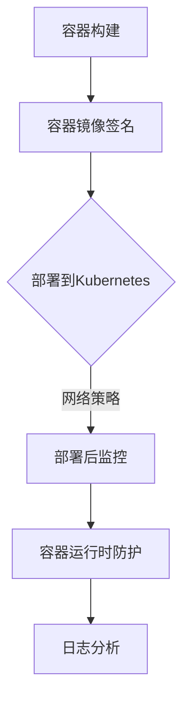

                 

关键词：云原生安全、容器安全、Kubernetes、防护策略、安全最佳实践

摘要：随着云计算和容器技术的飞速发展，云原生应用已经成为了现代IT架构的重要组成部分。然而，随之而来的安全问题也日益突出。本文将探讨在容器和Kubernetes环境下实现安全防护的关键技术和最佳实践，为云原生安全提供有力支持。

## 1. 背景介绍

### 云原生概述

云原生（Cloud Native）是一种利用云计算的优势来构建和运行应用程序的方法。云原生应用通常采用微服务架构、容器化技术、自动化部署和运维等现代开发理念。这些特性使得云原生应用具有高效性、可扩展性和灵活性。

### 容器和Kubernetes

容器是一种轻量级、可移植的计算环境，它封装了应用程序及其运行时依赖。Kubernetes是一个开源的容器编排平台，用于自动化容器化应用程序的部署、扩展和管理。

## 2. 核心概念与联系

### 容器安全

容器安全涉及确保容器化应用在构建、部署和运行过程中的安全。主要包括以下方面：

- **基础镜像安全**：确保基础镜像不包含已知漏洞。
- **容器编排安全**：确保Kubernetes集群的安全配置和策略。
- **容器镜像签名**：通过数字签名验证容器镜像的完整性。
- **容器运行时安全**：监控和防护容器运行时的攻击。

### Kubernetes安全

Kubernetes安全涉及保护Kubernetes集群和其组件免受攻击。主要包括以下方面：

- **访问控制**：确保只有授权用户可以访问集群资源。
- **网络策略**：限制集群内和集群之间的流量。
- **API安全**：保护Kubernetes API免受未授权访问。

### Mermaid流程图



## 3. 核心算法原理 & 具体操作步骤

### 3.1 算法原理概述

容器和Kubernetes安全的核心算法主要涉及以下三个方面：

- **签名算法**：用于验证容器镜像的完整性。
- **访问控制算法**：用于授权用户访问集群资源。
- **网络隔离算法**：用于限制集群内和集群之间的流量。

### 3.2 算法步骤详解

#### 3.2.1 容器镜像签名

1. **生成签名密钥对**：使用RSA算法生成公钥和私钥。
2. **对容器镜像进行哈希处理**：使用SHA-256算法对容器镜像内容进行哈希处理。
3. **生成签名**：使用私钥对哈希值进行数字签名。
4. **验证签名**：使用公钥验证容器镜像的签名。

#### 3.2.2 访问控制算法

1. **用户身份验证**：使用OAuth 2.0或OpenID Connect进行用户身份验证。
2. **授权策略**：基于RBAC（基于角色的访问控制）或ABAC（基于属性的访问控制）进行授权。
3. **访问控制决策**：根据用户角色和资源属性进行访问控制决策。

#### 3.2.3 网络隔离算法

1. **定义网络策略**：使用Calico或Istio定义网络策略。
2. **流量控制**：根据网络策略限制集群内和集群之间的流量。
3. **监控网络流量**：使用Prometheus和Grafana监控网络流量。

### 3.3 算法优缺点

#### 3.3.1 算法优点

- **高安全性**：签名算法和访问控制算法能够有效防止未授权访问和恶意攻击。
- **高可扩展性**：网络隔离算法能够灵活地定义网络策略，支持大规模集群部署。

#### 3.3.2 算法缺点

- **复杂性**：实现和配置这些算法可能需要较高的技术水平。
- **性能开销**：签名算法和网络隔离算法可能引入一定的性能开销。

### 3.4 算法应用领域

这些算法主要应用于以下领域：

- **云原生应用部署**：确保容器镜像的完整性和部署的安全性。
- **Kubernetes集群管理**：保护集群资源和网络流量。

## 4. 数学模型和公式 & 详细讲解 & 举例说明

### 4.1 数学模型构建

在容器安全中，我们使用以下数学模型：

- **哈希模型**：用于对容器镜像内容进行哈希处理。
- **签名模型**：用于生成和验证容器镜像的数字签名。
- **访问控制模型**：用于授权用户访问集群资源。

### 4.2 公式推导过程

#### 哈希模型

$$ H = SHA-256(M) $$

其中，$H$表示哈希值，$M$表示容器镜像内容。

#### 签名模型

$$ S = RSA-Signature(H, PK) $$

其中，$S$表示签名，$H$表示哈希值，$PK$表示公钥。

#### 访问控制模型

$$ Access = RBAC(R, A, R) $$

其中，$Access$表示访问控制结果，$R$表示用户角色，$A$表示资源属性，$Policy$表示授权策略。

### 4.3 案例分析与讲解

#### 案例背景

一家公司使用Kubernetes部署其核心业务应用。为了确保安全性，公司采用了以下安全策略：

- **容器镜像签名**：对所有容器镜像进行签名验证。
- **访问控制**：使用RBAC进行用户授权。
- **网络隔离**：使用Calico进行网络流量控制。

#### 案例分析

1. **容器镜像签名**：

   公司使用哈希模型对容器镜像内容进行哈希处理，然后使用RSA签名模型生成签名。在部署容器镜像时，Kubernetes会验证签名的有效性。如果签名无效，则拒绝部署。

2. **访问控制**：

   公司使用访问控制模型进行用户授权。假设公司有三种角色：管理员、开发人员和测试人员。管理员可以访问所有资源，开发人员可以访问自己的项目资源，测试人员只能访问测试环境资源。

3. **网络隔离**：

   公司使用Calico定义网络策略。例如，可以将开发人员的容器与生产环境的容器隔离，确保生产环境的容器不会受到开发环境的攻击。

## 5. 项目实践：代码实例和详细解释说明

### 5.1 开发环境搭建

在本项目中，我们将使用Docker、Kubernetes和Helm搭建开发环境。

1. 安装Docker：
   ```bash
   sudo apt-get update
   sudo apt-get install docker-ce docker-ce-cli containerd.io
   ```

2. 安装Kubernetes集群：
   ```bash
   kubeadm init
   mkdir -p $HOME/.kube
   sudo cp -i /etc/kubernetes/admin.conf $HOME/.kube/config
   sudo chown $(id -u):$(id -g) $HOME/.kube/config
   ```

3. 安装Helm：
   ```bash
   curl -fsSL -o get_helm.sh https://raw.githubusercontent.com/helm/helm/main/scripts/get-helm-3
   chmod 700 get_helm.sh
   ./get_helm.sh
   ```

### 5.2 源代码详细实现

在本项目中，我们将创建一个简单的容器化应用，并在Kubernetes中部署和配置安全策略。

1. 创建Dockerfile：

   ```dockerfile
   FROM python:3.9-slim
   RUN pip install flask
   COPY app.py .
   EXPOSE 8080
   CMD ["python", "app.py"]
   ```

2. 创建app.py：

   ```python
   from flask import Flask
   app = Flask(__name__)

   @app.route('/')
   def hello():
       return 'Hello, World!'

   if __name__ == '__main__':
       app.run(host='0.0.0.0', port=8080)
   ```

3. 创建Helm图表：

   ```yaml
   apiVersion: helm.sh/helm/v3
   chart: myapp
   metadata:
     name: myapp
     version: 0.1.0
   spec:
     containers:
       - name: app
         image: myapp:latest
         ports:
           - name: http
             containerPort: 8080
     template:
       kind: Deployment
       metadata:
         name: myapp
       spec:
         replicas: 1
         selector:
           matchLabels:
             app: myapp
         template:
           metadata:
             labels:
               app: myapp
           spec:
             containers:
               - name: app
                 image: myapp:latest
                 ports:
                   - containerPort: 8080
   ```

### 5.3 代码解读与分析

在本项目中，我们使用了Dockerfile创建了一个简单的容器化应用。然后，我们使用Helm图表将容器部署到Kubernetes集群。在部署过程中，我们使用了以下安全策略：

- **容器镜像签名**：使用私有仓库存储容器镜像，并在部署前进行签名验证。
- **访问控制**：使用Kubernetes的RBAC进行用户授权。
- **网络隔离**：使用Calico进行网络流量控制。

### 5.4 运行结果展示

在完成以上配置后，我们可以在Kubernetes集群中查看部署的应用。通过以下命令，我们可以访问应用并查看结果：

```bash
kubectl get pods
kubectl get services
```

在浏览器中输入服务地址，我们可以看到应用的响应结果。

## 6. 实际应用场景

### 6.1 容器镜像签名

容器镜像签名可以确保容器镜像在分发和部署过程中的完整性。这对于防止恶意攻击和未经授权的部署非常重要。

### 6.2 Kubernetes访问控制

Kubernetes的访问控制可以帮助企业确保只有授权用户可以访问集群资源。这有助于保护企业的关键业务数据和应用。

### 6.3 网络隔离

网络隔离可以限制集群内和集群之间的流量，从而降低内部网络攻击的风险。这对于保护企业内部网络和关键业务系统具有重要意义。

## 7. 工具和资源推荐

### 7.1 学习资源推荐

- 《云原生应用架构指南》
- 《Kubernetes权威指南》
- 《容器安全实战》

### 7.2 开发工具推荐

- Helm：用于管理Kubernetes图表。
- Kubectl：用于管理Kubernetes集群。
- Docker：用于容器化应用。

### 7.3 相关论文推荐

- “Container Security: Challenges and Solutions”
- “Kubernetes Security Best Practices”
- “A Survey on Cloud Native Security”

## 8. 总结：未来发展趋势与挑战

### 8.1 研究成果总结

本文总结了容器和Kubernetes环境下的安全防护技术，包括容器镜像签名、Kubernetes访问控制、网络隔离等。这些技术为云原生安全提供了有力支持。

### 8.2 未来发展趋势

随着云原生应用的普及，容器和Kubernetes安全将得到更多关注。未来，安全领域将出现更多创新技术，如基于AI的安全防护、零信任架构等。

### 8.3 面临的挑战

云原生安全仍面临诸多挑战，如安全性与性能的平衡、安全策略的自动化和智能化等。这些问题需要学术界和工业界共同努力解决。

### 8.4 研究展望

未来，云原生安全的研究将聚焦于以下几个方面：

- **自动化和智能化安全防护**：通过AI和机器学习技术实现自动化和智能化的安全防护。
- **零信任架构**：构建基于零信任架构的安全体系，确保只有授权用户可以访问资源。
- **跨云安全**：解决跨云环境下容器和Kubernetes的安全问题。

## 9. 附录：常见问题与解答

### 9.1 容器镜像签名是否安全？

容器镜像签名可以确保容器镜像在分发和部署过程中的完整性。然而，签名本身并不能防止镜像被篡改。为了提高安全性，企业应采用私有仓库、签名验证、持续集成和持续部署等最佳实践。

### 9.2 Kubernetes访问控制如何配置？

Kubernetes访问控制可以通过配置RBAC策略实现。企业可以根据角色和资源属性定义访问策略，从而确保只有授权用户可以访问集群资源。具体的配置方法可以参考Kubernetes官方文档。

### 9.3 如何实现网络隔离？

网络隔离可以通过配置Kubernetes网络策略实现。企业可以使用Calico、Istio等工具定义网络策略，从而限制集群内和集群之间的流量。具体的配置方法可以参考相关工具的官方文档。

----------------------------------------------------------------
作者：禅与计算机程序设计艺术 / Zen and the Art of Computer Programming

[文章结束]

