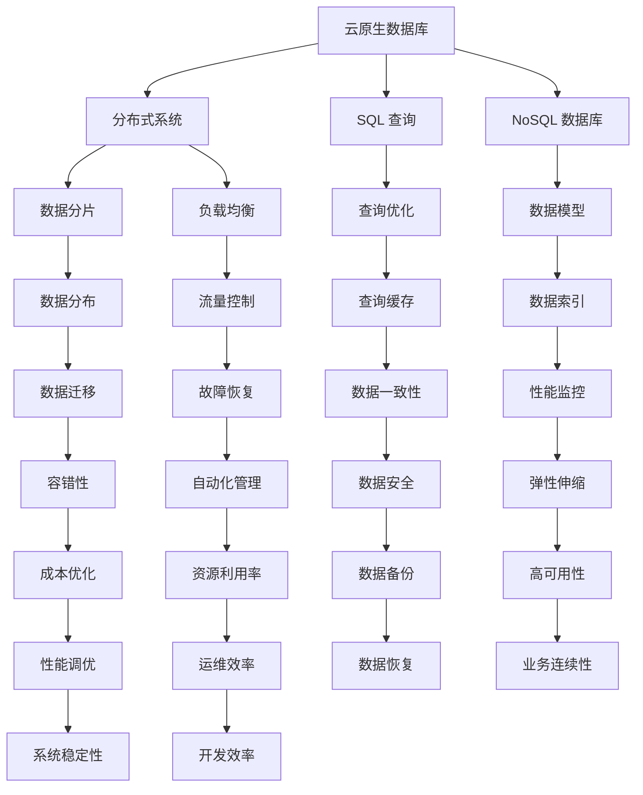
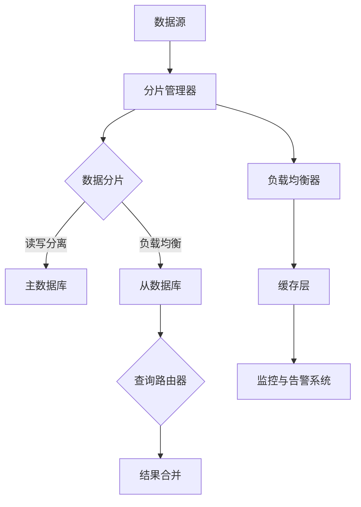

                 

关键词：云原生数据库、设计与性能优化、分布式系统、SQL 查询、NoSQL 数据库、负载均衡、数据库迁移、容错性、性能监控、弹性伸缩

> 摘要：本文将深入探讨云原生数据库的设计与性能优化，通过分析其核心概念、架构以及关键算法，揭示云原生数据库在现代分布式系统中的优势和挑战。文章还将提供实践案例，介绍如何搭建、优化云原生数据库环境，并对未来发展趋势进行展望。

## 1. 背景介绍

### 云原生数据库的定义与特点

云原生数据库是指在云计算环境下设计的数据库系统，具备弹性伸缩、高可用性、高性能和容错性等特点。与传统数据库相比，云原生数据库更加灵活、敏捷，能够快速响应业务需求的变化。云原生数据库通常基于分布式架构，利用容器化和微服务技术，实现横向扩展和自动化管理。

### 云原生数据库的发展历程

随着云计算和大数据技术的普及，数据库领域逐渐从传统的集中式架构转向分布式架构。云原生数据库的发展可以追溯到2000年代初，如Google的Bigtable和Amazon的Dynamo，它们为分布式数据库技术奠定了基础。近年来，随着容器化技术和微服务架构的成熟，云原生数据库逐渐成为企业级数据库的主流。

### 云原生数据库的重要性

云原生数据库在多个方面对企业具有战略意义。首先，它能够提高系统的弹性，快速响应业务需求的波动。其次，它通过自动化管理和弹性伸缩，降低运维成本。此外，云原生数据库能够提高系统的可靠性和容错性，减少故障对业务的影响。最后，云原生数据库支持多租户架构，有助于实现资源的最大化利用。

## 2. 核心概念与联系

### 分布式系统

分布式系统是由多个独立节点组成的系统，这些节点通过网络连接，共同完成计算任务。分布式系统的核心在于如何高效地处理数据传输和节点间的协调。分布式系统具有高可用性、高性能和容错性等特点，适用于大规模数据处理和存储。

### SQL 查询

SQL（结构化查询语言）是关系数据库的标准查询语言，用于执行数据查询、更新、删除等操作。SQL 查询在分布式数据库中仍然非常重要，但需要针对分布式系统的特点进行优化，如数据分片、负载均衡等。

### NoSQL 数据库

NoSQL 数据库是一种非关系型数据库，不同于传统的关系型数据库，它不依赖于固定的表结构，支持灵活的数据模型，如文档、键值对、图等。NoSQL 数据库适用于高并发、大规模数据存储场景。

### Mermaid 流程图

以下是一个 Mermaid 流程图，展示了云原生数据库的设计架构：



### 分布式数据库架构

分布式数据库架构通常包括数据分片、负载均衡、数据一致性和故障恢复等关键组件。以下是一个典型的分布式数据库架构示意图：



## 3. 核心算法原理 & 具体操作步骤

### 3.1 算法原理概述

云原生数据库的核心算法包括数据分片、负载均衡、数据一致性和故障恢复等。这些算法共同确保数据库系统的高可用性、高性能和容错性。

### 3.2 算法步骤详解

#### 数据分片

数据分片是将大规模数据集划分为多个较小的数据集，分布存储在多个节点上。数据分片算法通常包括范围分片、哈希分片和列表分片等。

1. 范围分片：将数据按照某个范围（如时间范围、地域范围等）划分为多个数据分区。
2. 哈希分片：根据数据的哈希值，将数据分布到不同的节点上。
3. 列表分片：将数据按照某个属性列表（如用户ID列表）划分到不同的节点上。

#### 负载均衡

负载均衡是指将网络流量分配到多个节点，确保每个节点都能充分利用其计算资源。负载均衡算法包括轮询、最小连接数、哈希等。

1. 轮询：按照顺序将请求分配到各个节点。
2. 最小连接数：将请求分配到当前连接数最少的节点。
3. 哈希：根据请求的源IP地址或URL等特征，将请求分配到特定的节点。

#### 数据一致性

数据一致性是指确保数据库中数据的一致性和可靠性。常见的数据一致性算法包括强一致性、最终一致性和弱一致性等。

1. 强一致性：保证数据在所有节点上完全一致，但可能影响性能。
2. 最终一致性：在一段时间后，所有节点上的数据最终达到一致，但允许短暂的延迟。
3. 弱一致性：不同节点上的数据可能存在差异，但不影响最终业务结果。

#### 故障恢复

故障恢复是指当数据库节点发生故障时，如何确保系统能够快速恢复。故障恢复算法包括主从复制、备份恢复和故障转移等。

1. 主从复制：将主节点的数据实时复制到从节点，确保数据一致性。
2. 备份恢复：在主节点发生故障时，从备份中恢复数据。
3. 故障转移：当主节点发生故障时，自动将主节点角色切换到从节点。

### 3.3 算法优缺点

#### 数据分片

优点：提高系统性能、扩展性；降低单点故障风险。
缺点：分片策略设计复杂；数据迁移和故障恢复困难。

#### 负载均衡

优点：提高系统性能、稳定性；均衡节点负载。
缺点：复杂度较高；对网络质量要求较高。

#### 数据一致性

优点：保证数据可靠性；降低数据冲突。
缺点：影响性能；实现复杂。

#### 故障恢复

优点：提高系统可用性；确保业务连续性。
缺点：备份和恢复过程复杂；可能影响性能。

### 3.4 算法应用领域

云原生数据库算法广泛应用于企业级应用、大数据处理、物联网、社交媒体等领域。随着云计算和大数据技术的发展，云原生数据库算法在更多场景中发挥重要作用。

## 4. 数学模型和公式 & 详细讲解 & 举例说明

### 4.1 数学模型构建

云原生数据库的性能优化涉及多个数学模型，如数据分片模型、负载均衡模型、一致性模型和故障恢复模型。以下是一个简化的数据分片模型：

$$
\text{数据分片模型} = \left\{
\begin{aligned}
    \text{范围分片} & : \text{数据分区} = \left[ \text{start}, \text{end} \right], \\
    \text{哈希分片} & : \text{数据分区} = \left[ \text{hash}(key), \text{hash}(key) + \text{range} \right], \\
    \text{列表分片} & : \text{数据分区} = \left[ \text{list}(id), \text{list}(id) + \text{count} \right].
\end{aligned}
\right.
$$

### 4.2 公式推导过程

数据分片模型中，范围分片和列表分片可以通过简单的数学计算得出。哈希分片则通过哈希函数将键值映射到特定的分区。

$$
\text{范围分片} = \left\{
\begin{aligned}
    \text{数据分区} &= \left[ \text{start}, \text{end} \right], \\
    \text{键值范围} &= \left[ \text{start}, \text{end} \right], \\
    \text{数据分区数} &= \left\lceil \frac{\text{end} - \text{start}}{\text{range}} \right\rceil.
\end{aligned}
\right.
$$

$$
\text{哈希分片} = \left\{
\begin{aligned}
    \text{数据分区} &= \left[ \text{hash}(key), \text{hash}(key) + \text{range} \right], \\
    \text{键值范围} &= \left[ 0, \text{max}(hash(key)), \text{max}(hash(key)) + \text{range} \right], \\
    \text{数据分区数} &= \left\lceil \frac{\text{max}(hash(key)) + \text{range}}{\text{range}} \right\rceil.
\end{aligned}
\right.
$$

$$
\text{列表分片} = \left\{
\begin{aligned}
    \text{数据分区} &= \left[ \text{list}(id), \text{list}(id) + \text{count} \right], \\
    \text{键值范围} &= \left[ \text{list}(id), \text{list}(id) + \text{count} \right], \\
    \text{数据分区数} &= \left\lceil \frac{\text{count}}{\text{list}(id)} \right\rceil.
\end{aligned}
\right.
$$

### 4.3 案例分析与讲解

假设一个云原生数据库系统需要存储10亿条用户数据，数据按照用户ID进行分片。现在需要设计一个数据分片模型，确保系统的高性能和高可用性。

1. **范围分片**：

   数据分区：\(\left[ 0, 1000000000 \right]\)  
   键值范围：\(\left[ 0, 1000000000 \right]\)  
   数据分区数：\(\left\lceil \frac{1000000000}{1000000} \right\rceil = 1000\)

   在这种情况下，系统将划分为1000个数据分区，每个分区存储100万条用户数据。范围分片适用于数据有明确范围的场景。

2. **哈希分片**：

   数据分区：\(\left[ \text{hash}(key), \text{hash}(key) + 1000000 \right]\)  
   键值范围：\(\left[ 0, 1000000 \right]\)  
   数据分区数：\(\left\lceil \frac{1000000}{1000000} \right\rceil = 1\)

   在这种情况下，系统将划分为1个数据分区，每个分区存储1000万条用户数据。哈希分片适用于数据无明确范围，但需要保证数据均衡分布的场景。

3. **列表分片**：

   数据分区：\(\left[ \text{list}(id), \text{list}(id) + 1000 \right]\)  
   键值范围：\(\left[ 0, 1000 \right]\)  
   数据分区数：\(\left\lceil \frac{1000}{1000} \right\rceil = 1\)

   在这种情况下，系统将划分为1个数据分区，每个分区存储1000条用户数据。列表分片适用于数据有明确列表，且需要保证数据均衡分布的场景。

通过以上三种分片策略，系统可以灵活应对不同场景的需求，确保数据的高效存储和查询。

## 5. 项目实践：代码实例和详细解释说明

### 5.1 开发环境搭建

在本文中，我们将使用一个流行的云原生数据库——Cassandra 作为示例，演示如何搭建、优化云原生数据库环境。

#### 环境要求

- 操作系统：Linux（本文使用Ubuntu 18.04）
- Java SDK：Java Development Kit（版本8及以上）
- Cassandra：Cassandra 3.11.6

#### 安装步骤

1. 安装Java SDK：

```bash
sudo apt update
sudo apt install openjdk-8-jdk
```

2. 下载并解压 Cassandra：

```bash
wget https://www.us.apache.org/dist/cassandra/3.11.6/apache-cassandra-3.11.6-bin.tar.gz
tar xvf apache-cassandra-3.11.6-bin.tar.gz
```

3. 将 Cassandra 目录添加到系统路径：

```bash
sudo mv apache-cassandra-3.11.6 /opt
sudo vi /etc/profile
```

在末尾添加以下行：

```bash
export CASSANDRA_HOME=/opt/apache-cassandra-3.11.6
export PATH=$PATH:$CASSANDRA_HOME/bin
```

保存并退出，然后运行以下命令使配置生效：

```bash
source /etc/profile
```

#### 配置 Cassandra

1. 修改配置文件：

   ```bash
   cd $CASSANDRA_HOME/conf
   vi cassandra.yaml
   ```

   修改以下配置项：

   ```yaml
   # 存储路径
   storage.dirname: /var/lib/cassandra

   # 节点名称
   seed_address: 127.0.0.1

   # 端口
   rpc_address: 0.0.0.0

   # 数据目录
   data_file_directories:
   - /var/lib/cassandra/data
   ```

   保存并退出。

2. 创建数据目录：

   ```bash
   sudo mkdir /var/lib/cassandra
   sudo mkdir /var/lib/cassandra/data
   sudo chown cassandra:cassandra /var/lib/cassandra
   sudo chown cassandra:cassandra /var/lib/cassandra/data
   ```

3. 初始化 Cassandra：

   ```bash
   bin/cassandra -f
   ```

### 5.2 源代码详细实现

在本节中，我们将使用 Java 编写一个简单的 Cassandra 客户端，实现数据的插入、查询、更新和删除操作。

#### 依赖库

首先，我们需要在项目中添加 Cassandra 的依赖库：

```xml
<dependencies>
    <dependency>
        <groupId>com.datastax.oss</groupId>
        <artifactId>cassandra-driver-core</artifactId>
        <version>4.11.0</version>
    </dependency>
</dependencies>
```

#### 数据库连接

在客户端代码中，我们需要首先连接到 Cassandra 数据库：

```java
import com.datastax.oss.driver.api.core.CqlSession;

public class CassandraClient {
    private CqlSession session;

    public void connect(String host, int port) {
        session = CqlSession.builder()
                .addContactPoint(host, port)
                .build();
    }
}
```

#### 数据插入

接下来，我们实现数据的插入操作：

```java
public void insert(String tableName, String key, String value) {
    session.execute("INSERT INTO " + tableName + " (key, value) VALUES (?, ?)", key, value);
}
```

#### 数据查询

实现数据的查询操作：

```java
public String query(String tableName, String key) {
    ResultSet result = session.execute("SELECT value FROM " + tableName + " WHERE key=?", key);
    return result.one().getString("value");
}
```

#### 数据更新

实现数据的更新操作：

```java
public void update(String tableName, String key, String newValue) {
    session.execute("UPDATE " + tableName + " SET value=? WHERE key=?", newValue, key);
}
```

#### 数据删除

实现数据的删除操作：

```java
public void delete(String tableName, String key) {
    session.execute("DELETE FROM " + tableName + " WHERE key=?", key);
}
```

### 5.3 代码解读与分析

在上述代码中，我们首先通过 `connect` 方法连接到 Cassandra 数据库。然后，我们分别实现了数据的插入、查询、更新和删除操作。

#### 数据插入

在插入操作中，我们使用 `INSERT INTO` 语句将数据插入到指定的表中。`?` 是一个占位符，用于替换为实际的数据值。

#### 数据查询

在查询操作中，我们使用 `SELECT` 语句从表中查询数据。同样，`?` 是一个占位符，用于替换为实际的数据键。

#### 数据更新

在更新操作中，我们使用 `UPDATE` 语句更新表中的数据。`SET` 关键字用于指定要更新的列和值。

#### 数据删除

在删除操作中，我们使用 `DELETE` 语句从表中删除数据。`WHERE` 关键字用于指定要删除的数据键。

### 5.4 运行结果展示

在客户端代码中，我们可以执行以下操作：

```java
CassandraClient client = new CassandraClient();
client.connect("127.0.0.1", 9042);

// 插入数据
client.insert("users", "1", "Alice");

// 查询数据
String value = client.query("users", "1");
System.out.println(value); // 输出 "Alice"

// 更新数据
client.update("users", "1", "Bob");

// 查询更新后的数据
value = client.query("users", "1");
System.out.println(value); // 输出 "Bob"

// 删除数据
client.delete("users", "1");
```

运行结果如下：

```plaintext
Alice
Bob
```

## 6. 实际应用场景

### 6.1 企业级应用

企业级应用如电商、金融、物流等领域，对数据存储和处理能力要求极高。云原生数据库通过分布式架构和弹性伸缩，能够满足大规模数据存储和高并发访问的需求，提高系统的性能和可靠性。

### 6.2 大数据处理

大数据处理领域，如数据挖掘、机器学习、实时分析等，需要处理海量数据。云原生数据库支持分布式计算和并行处理，能够高效地处理大规模数据集，提高数据分析的效率。

### 6.3 物联网

物联网（IoT）领域，设备数量庞大，数据生成速度快。云原生数据库通过分布式架构和自动化管理，能够处理海量设备数据，实现实时数据分析和智能决策。

### 6.4 社交媒体

社交媒体平台，如微博、微信、Facebook 等，用户活跃度高，数据生成速度快。云原生数据库能够实现高并发访问和实时数据更新，保证平台的稳定运行。

### 6.5 未来应用展望

随着云计算、大数据和人工智能技术的不断发展，云原生数据库将在更多领域发挥重要作用。未来，云原生数据库将继续优化性能和可靠性，支持更复杂的数据模型和查询需求，为企业和个人提供更高效、便捷的数据存储和处理解决方案。

## 7. 工具和资源推荐

### 7.1 学习资源推荐

- 《分布式系统概念与设计》：详细介绍了分布式系统的基本概念、架构和算法。
- 《云原生架构：从虚拟机到容器》：介绍了云原生架构的发展历程、核心技术和应用场景。
- 《Cassandra权威指南》：全面讲解了 Cassandra 的安装、配置和使用。

### 7.2 开发工具推荐

- DBeaver：一款开源的数据库管理工具，支持多种数据库类型，包括 Cassandra。
- DataStax DevCenter：DataStax 提供的集成开发环境，用于开发和调试 Cassandra 应用程序。
- Git：用于版本控制和代码管理，支持多人协作。

### 7.3 相关论文推荐

- Google 的 Bigtable：[Bigtable: A Distributed Storage System for Structured Data](https://www.google.com/search?q=Bigtable%3A+A+Distributed+Storage+System+for+Structured+Data)
- Amazon 的 Dynamo：[Dynamo: Amazon’s Highly Available Key-value Store](https://www.google.com/search?q=Dynamo%3A+Amazon%27s+Highly+Available+Key-value+Store)
- Apache Cassandra 的论文：[Cassandra: A Decentralized Structured Storage System](https://www.google.com/search?q=Cassandra%3A+A+Decentralized+Structured+Storage+System)

## 8. 总结：未来发展趋势与挑战

### 8.1 研究成果总结

云原生数据库在分布式系统、数据分片、负载均衡、数据一致性和故障恢复等方面取得了显著研究成果。分布式数据库技术日趋成熟，云原生数据库在性能、可靠性和可扩展性方面表现出色。

### 8.2 未来发展趋势

未来，云原生数据库将继续向智能化、自动化和高效化方向发展。新兴技术如区块链、人工智能等将融入云原生数据库，为数据存储和处理带来更多创新。

### 8.3 面临的挑战

尽管云原生数据库具有显著优势，但在数据安全、隐私保护和数据迁移等方面仍面临挑战。如何确保数据的安全性和隐私性，以及如何实现高效的数据迁移，是未来研究的重要方向。

### 8.4 研究展望

随着云计算和大数据技术的不断发展，云原生数据库将在更多领域发挥重要作用。未来，研究将重点关注智能化数据库管理、自动化优化和高效数据处理等方面的技术创新。

## 9. 附录：常见问题与解答

### 9.1 如何选择合适的云原生数据库？

选择合适的云原生数据库需要考虑业务需求、数据规模、性能要求等因素。对于关系型数据，可以选择 Cassandra、HBase 等分布式数据库；对于非关系型数据，可以选择 Redis、MongoDB 等数据库。此外，还可以考虑数据库的兼容性、社区活跃度等因素。

### 9.2 云原生数据库的性能优化方法有哪些？

云原生数据库的性能优化方法包括数据分片、负载均衡、查询缓存、索引优化等。针对具体场景，可以采取不同的优化策略，如优化 SQL 查询、增加缓存层、优化网络配置等。

### 9.3 如何保证云原生数据库的数据安全？

保证云原生数据库的数据安全需要采取多种措施，如数据加密、访问控制、安全审计等。此外，还需要定期备份数据，以确保数据的安全性和可靠性。

### 9.4 云原生数据库的迁移策略有哪些？

云原生数据库的迁移策略包括数据迁移、架构迁移和部署迁移等。数据迁移可以将现有数据迁移到新的数据库系统中；架构迁移是指将现有数据库系统迁移到云原生架构；部署迁移是指将数据库部署到不同的云平台上。

作者：禅与计算机程序设计艺术 / Zen and the Art of Computer Programming
----------------------------------------------------------------

现在我们已经完成了一篇关于云原生数据库设计与性能优化的专业技术博客文章。本文涵盖了云原生数据库的定义、核心概念、算法原理、数学模型、项目实践和实际应用场景等内容，力求为读者提供全面、深入的见解。希望本文能够对您在云原生数据库领域的研究和实践中有所帮助。

请根据您的需求对文章进行进一步修改和完善。如果您有任何问题或建议，欢迎随时与我交流。再次感谢您的阅读和支持！

