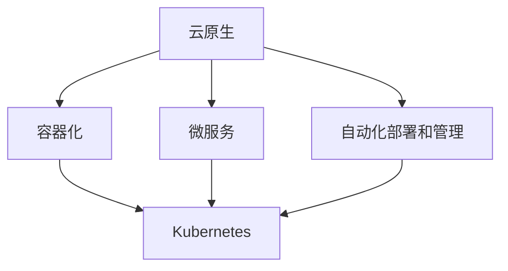

                 

关键词：云原生、可扩展性、云端应用程序、架构设计、微服务、容器化、Kubernetes

> 摘要：本文将深入探讨云原生架构的核心概念，阐述其在构建可扩展云端应用程序中的重要性，并通过实例分析，展示如何利用云原生技术实现高性能、高可靠性的应用程序。

## 1. 背景介绍

随着云计算技术的迅猛发展，企业对应用程序的可扩展性和灵活性提出了更高的要求。传统的单体架构难以满足这种需求，而云原生架构（Cloud Native Architecture）则提供了新的解决方案。云原生架构利用容器化、微服务、自动化部署和管理等先进技术，构建高度可扩展和弹性的应用程序。

云原生技术起源于互联网公司，如谷歌和亚马逊，它们通过大规模分布式系统实现了高可用性和弹性。如今，云原生架构已成为企业数字化转型的重要工具。

## 2. 核心概念与联系

### 2.1 核心概念

**云原生（Cloud Native）**：云原生是指构建和运行应用程序的一种方法，该方法利用云计算的可伸缩性和灵活性，构建出高度可扩展、高可用性和弹性强的应用程序。

**容器化（Containerization）**：容器化是将应用程序及其运行环境打包成一个独立的、轻量级的容器，以便在不同的计算环境中运行。

**微服务（Microservices）**：微服务是一种架构风格，将应用程序划分为一组小型、独立的、可相互协作的微服务，每个微服务实现一个特定的业务功能。

**自动化部署和管理（Automated Deployment and Management）**：自动化部署和管理是指使用工具和平台自动管理应用程序的部署、扩展和监控。

### 2.2 核心概念原理和架构的 Mermaid 流程图



## 3. 核心算法原理 & 具体操作步骤

### 3.1 算法原理概述

云原生架构的核心在于其灵活性和可扩展性。通过容器化技术，应用程序可以在不同的环境中快速部署和运行；通过微服务架构，应用程序可以划分为多个独立的服务模块，提高系统的可维护性和可扩展性；通过自动化部署和管理，应用程序可以快速响应业务需求的变化。

### 3.2 算法步骤详解

1. **容器化**：将应用程序及其依赖打包成一个容器镜像，以便在不同的环境中运行。
2. **微服务划分**：根据业务需求，将应用程序划分为多个微服务，每个微服务负责一个特定的业务功能。
3. **部署与管理**：使用Kubernetes等平台，自动化部署和管理微服务，实现高可用性和弹性。

### 3.3 算法优缺点

**优点**：

- 高度可扩展性：容器化技术使得应用程序可以在不同环境中快速部署和扩展。
- 高可用性：微服务架构可以提高系统的可靠性和可维护性。
- 弹性：自动化部署和管理技术可以快速响应业务需求的变化。

**缺点**：

- 复杂性：云原生架构涉及多种技术和工具，需要一定的学习成本。
- 维护成本：由于应用程序划分为多个微服务，维护成本可能会增加。

### 3.4 算法应用领域

云原生架构在以下领域有广泛的应用：

- **互联网公司**：互联网公司通常需要快速响应市场需求，云原生架构可以帮助它们实现这一点。
- **金融行业**：金融行业对系统的安全性和稳定性要求很高，云原生架构可以提高系统的可靠性和弹性。
- **制造业**：制造业企业可以通过云原生架构实现生产线的智能化和自动化。

## 4. 数学模型和公式 & 详细讲解 & 举例说明

### 4.1 数学模型构建

云原生架构的数学模型可以简化为：

$$
\text{云原生架构} = \text{容器化} + \text{微服务} + \text{自动化部署和管理}
$$

### 4.2 公式推导过程

容器化、微服务、自动化部署和管理是云原生架构的三个核心组成部分，它们共同作用，实现应用程序的高度可扩展性和弹性。

### 4.3 案例分析与讲解

假设一个电商平台，该平台需要处理海量的订单和用户请求。采用云原生架构，可以将订单处理、用户认证、商品管理等业务功能划分为多个微服务，每个微服务运行在一个容器中，使用Kubernetes进行自动化部署和管理。这样可以实现以下效果：

- **可扩展性**：随着订单量的增加，可以轻松扩展订单处理服务的容器数量，以满足业务需求。
- **高可用性**：如果一个容器出现故障，Kubernetes会自动将其替换，确保系统正常运行。
- **弹性**：根据订单量的波动，Kubernetes会自动调整容器数量，确保系统资源得到充分利用。

## 5. 项目实践：代码实例和详细解释说明

### 5.1 开发环境搭建

为了演示云原生架构的应用，我们使用Kubernetes作为容器编排工具，Docker作为容器化平台。以下是搭建开发环境的基本步骤：

1. **安装Docker**：在本地机器上安装Docker，以便创建和运行容器。
2. **安装Kubernetes**：在本地或虚拟机上安装Kubernetes集群，以便部署和管理容器。

### 5.2 源代码详细实现

我们以一个简单的微服务为例，实现用户认证功能。以下是用户认证服务的Dockerfile和Kubernetes部署文件：

**Dockerfile**：

```dockerfile
FROM node:12-alpine
WORKDIR /app
COPY package.json ./
COPY . .
RUN npm install
CMD ["npm", "start"]
```

**Kubernetes部署文件**：

```yaml
apiVersion: apps/v1
kind: Deployment
metadata:
  name: user-auth
spec:
  replicas: 3
  selector:
    matchLabels:
      app: user-auth
  template:
    metadata:
      labels:
        app: user-auth
    spec:
      containers:
      - name: user-auth
        image: user-auth:latest
        ports:
        - containerPort: 8080
```

### 5.3 代码解读与分析

**Dockerfile**：该文件用于创建用户认证服务的容器镜像。我们使用Node.js作为后端框架，将源代码打包成镜像，并设置默认启动命令。

**Kubernetes部署文件**：该文件用于部署用户认证服务。我们定义了Deployment资源，指定了副本数量、选择器和模板。容器使用用户认证服务的容器镜像，并暴露8080端口供外部访问。

### 5.4 运行结果展示

通过以下命令部署用户认证服务：

```bash
kubectl apply -f deployment.yaml
```

部署完成后，可以使用以下命令查看容器状态：

```bash
kubectl get pods
```

当容器运行正常后，可以使用浏览器访问用户认证服务的接口，验证服务是否正常运行。

## 6. 实际应用场景

云原生架构在以下场景中有广泛的应用：

- **互联网公司**：互联网公司通常需要快速响应市场需求，云原生架构可以帮助它们实现这一点。
- **金融行业**：金融行业对系统的安全性和稳定性要求很高，云原生架构可以提高系统的可靠性和弹性。
- **制造业**：制造业企业可以通过云原生架构实现生产线的智能化和自动化。

## 7. 工具和资源推荐

### 7.1 学习资源推荐

- **书籍**：《云原生应用架构》
- **在线课程**：Coursera上的《云原生架构》课程
- **博客**：云原生技术社区的博客文章

### 7.2 开发工具推荐

- **Docker**：用于容器化应用程序
- **Kubernetes**：用于容器编排和管理
- **Istio**：用于服务网格

### 7.3 相关论文推荐

- **论文**：《Docker: lightweight Linux containers for developing, shipping, and running applications》
- **论文**：《Kubernetes: Design and Implementation》

## 8. 总结：未来发展趋势与挑战

### 8.1 研究成果总结

云原生架构在互联网、金融、制造业等领域取得了显著的成果。通过容器化、微服务和自动化部署，云原生架构实现了应用程序的高度可扩展性、高可用性和弹性。

### 8.2 未来发展趋势

随着云计算技术的不断进步，云原生架构将在更多领域得到应用。未来，云原生架构将继续优化，以提供更高效、更安全的解决方案。

### 8.3 面临的挑战

尽管云原生架构具有许多优势，但也面临一些挑战：

- **复杂性**：云原生架构涉及多种技术和工具，需要一定的学习成本。
- **安全性**：在分布式系统中，安全性是一个重要问题。

### 8.4 研究展望

未来，云原生架构的研究将重点关注以下几个方面：

- **简化部署**：简化云原生架构的部署过程，降低学习成本。
- **增强安全性**：提高分布式系统的安全性，确保数据安全。

## 9. 附录：常见问题与解答

### 9.1 什么是云原生架构？

云原生架构是一种构建和运行应用程序的方法，利用云计算的可伸缩性和灵活性，构建高度可扩展、高可用性和弹性强的应用程序。

### 9.2 云原生架构有哪些优点？

云原生架构的优点包括：高度可扩展性、高可用性、弹性、简化部署等。

### 9.3 云原生架构在哪些领域有应用？

云原生架构在互联网、金融、制造业等领域有广泛的应用。

## 作者署名

作者：禅与计算机程序设计艺术 / Zen and the Art of Computer Programming
------------------------------------------------------------------

