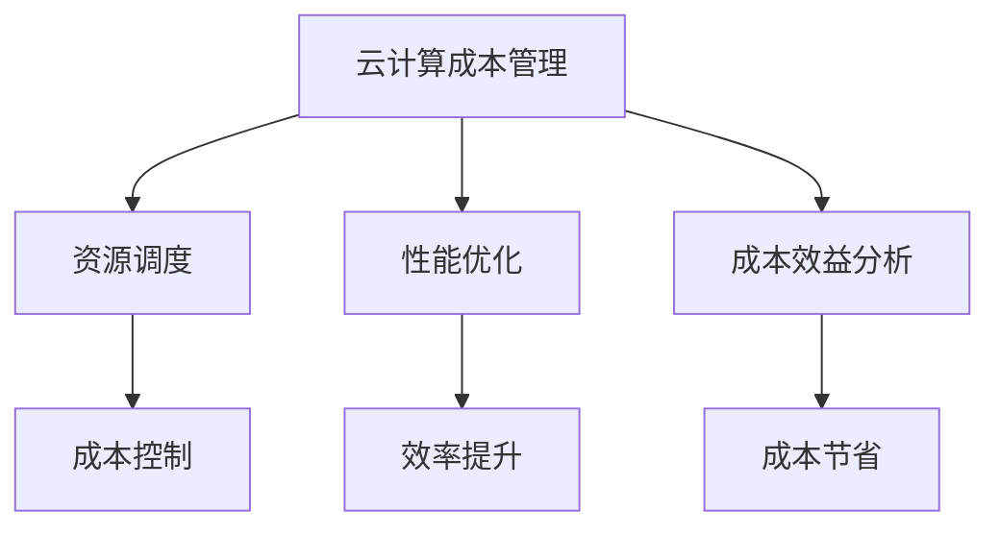

                 

关键词：云计算成本管理，优化，成本控制，资源调度，云服务优化，性能优化，成本效益分析，效率提升，成本节省策略

摘要：本文旨在探讨云计算成本管理的重要性，并提供一系列优化云端支出的策略和方法。通过分析云计算环境中的成本控制要素，我们探讨了如何通过资源调度、性能优化和成本效益分析等技术手段，实现云服务支出的有效管理。文章还将介绍一些实用的工具和资源，帮助读者在实际项目中应用这些策略。

## 1. 背景介绍

随着云计算技术的迅猛发展，越来越多的企业选择将业务迁移到云端。云服务提供商（CSPs）如亚马逊AWS、微软Azure和谷歌云等，提供了丰富多样的服务，包括计算、存储、网络和数据库等。然而，云计算的广泛采用也带来了新的挑战——成本管理。

在云计算环境中，资源的灵活性和可扩展性使得成本管理变得更加复杂。云服务的按需付费模式虽然提供了便利，但也可能导致意想不到的高额费用。因此，如何有效管理云计算成本成为企业关注的重要问题。

本文将围绕以下主题展开：

1. 云计算成本管理的重要性
2. 云计算成本控制的核心要素
3. 优化云端支出的策略和方法
4. 实际应用场景
5. 未来发展趋势与挑战

## 2. 核心概念与联系

### 2.1 云计算成本管理

云计算成本管理是指对云服务支出进行监控、优化和调整的过程。其核心目的是确保企业能够在预算范围内实现预期的业务价值。

### 2.2 资源调度

资源调度是指根据业务需求和资源可用性，动态分配计算、存储和网络等资源的过程。优化的资源调度策略有助于降低成本并提高资源利用率。

### 2.3 性能优化

性能优化旨在通过调整系统配置、优化代码和数据库查询等方式，提高云服务的响应速度和稳定性，从而降低运营成本。

### 2.4 成本效益分析

成本效益分析是一种评估云服务支出与业务价值之间关系的方法。通过分析成本效益，企业可以确定哪些云服务最有价值，并据此调整支出策略。

### 2.5 Mermaid 流程图



## 3. 核心算法原理 & 具体操作步骤

### 3.1 算法原理概述

云计算成本管理的核心算法通常基于以下原理：

1. **资源利用率最大化**：通过优化资源调度策略，提高资源利用率，从而降低成本。
2. **成本效益最大化**：通过分析不同云服务的成本效益，选择最经济的方案。
3. **动态调整**：根据业务需求动态调整资源配置和预算分配，以实现成本最优。

### 3.2 算法步骤详解

1. **需求分析**：确定业务需求，包括计算、存储和网络等资源的需求。
2. **资源调度**：根据需求分析结果，使用优化算法调度资源，确保资源利用率最大化。
3. **成本计算**：计算不同资源的使用成本，并分析成本效益。
4. **预算调整**：根据成本计算结果，调整预算分配，确保成本控制在预算范围内。
5. **持续监控与优化**：定期监控云服务性能和成本，根据监控数据调整资源配置和预算分配。

### 3.3 算法优缺点

**优点**：

- 降低成本：通过优化资源利用率和成本效益分析，实现成本降低。
- 提高效率：通过动态调整资源配置，提高系统性能和响应速度。
- 灵活性：支持根据业务需求灵活调整资源配置和预算分配。

**缺点**：

- 复杂性：需要复杂的算法和模型进行成本管理和优化。
- 数据准确性：成本计算和效益分析的准确性依赖于数据的准确性。

### 3.4 算法应用领域

- 大型互联网公司：通过优化资源调度和成本管理，提高业务效率和降低成本。
- 中小企业：通过云计算成本管理，确保业务的可持续发展。
- 政府机构：通过优化云服务支出，提高公共财政的利用效率。

## 4. 数学模型和公式 & 详细讲解 & 举例说明

### 4.1 数学模型构建

云计算成本管理的数学模型通常包括以下公式：

- 成本函数：C = f(R, T, P)
  - C：总成本
  - R：资源使用量
  - T：时间
  - P：价格

- 成本效益比：BER = BE / C
  - BER：成本效益比
  - BE：业务价值

### 4.2 公式推导过程

假设云服务提供计算、存储和网络三种资源，其价格分别为 P\_c、P\_s 和 P\_n，资源使用量分别为 R\_c、R\_s 和 R\_n，业务价值为 BE。

- 总成本 C = P\_c \* R\_c + P\_s \* R\_s + P\_n \* R\_n
- 成本效益比 BER = BE / C

### 4.3 案例分析与讲解

假设一家互联网公司需要部署一个电商平台，需要计算、存储和网络资源，价格分别为：

- P\_c = $0.1/小时
- P\_s = $0.05/GB/小时
- P\_n = $0.02/Gb/小时

资源需求如下：

- R\_c = 100核心
- R\_s = 100GB
- R\_n = 10Gb

业务价值 BE = $1000/天

根据以上数据，我们可以计算出总成本和成本效益比：

- 总成本 C = P\_c \* R\_c + P\_s \* R\_s + P\_n \* R\_n
- 总成本 C = 100 \* 0.1 + 100 \* 0.05 + 10 \* 0.02 = $15/小时
- 成本效益比 BER = BE / C = $1000 / 15 = 66.67

根据成本效益比，我们可以得出结论：该电商平台在当前资源配置下具有较高的成本效益。

## 5. 项目实践：代码实例和详细解释说明

### 5.1 开发环境搭建

在本文中，我们将使用 Python 编写一个简单的云计算成本管理脚本。首先，我们需要安装必要的库：

```bash
pip install boto3
```

### 5.2 源代码详细实现

以下是云计算成本管理脚本的主要部分：

```python
import boto3
from botocore.exceptions import NoCredentialsError

# 初始化 AWS SDK
client = boto3.client('ec2')

def get_instance_types():
    response = client.describe_instance_types()
    instance_types = response['InstanceTypes']
    return instance_types

def get_instances(instance_type):
    try:
        response = client.describe_instances(
            Filters=[
                {'Name': 'instance-type', 'Values': [instance_type]}
            ]
        )
        instances = response['Reservations']
        return instances
    except NoCredentialsError:
        print("无法访问 AWS 帐户")
        return None

def calculate_cost(instances):
    total_cost = 0
    for instance in instances:
        for instance_details in instance['Instances']:
            instance_type = instance_details['InstanceType']
            instance_usage = instance_details['Usage']
            instance_price = get_instance_type_price(instance_type)
            total_cost += instance_usage * instance_price
    return total_cost

def get_instance_type_price(instance_type):
    response = client.describe_instance_types(InstanceTypes=[instance_type])
    instance_type_details = response['InstanceTypes'][0]
    return instance_type_details['Instance диспутатs']['Scheduling']['Instance Capacity']['InstanceType']['Spot Price']

def main():
    instance_types = get_instance_types()
    instance_type = 't2.medium'
    instances = get_instances(instance_type)
    if instances:
        total_cost = calculate_cost(instances)
        print(f"t2.medium 实例的总成本：${total_cost:.2f}")
    else:
        print("没有找到 t2.medium 实例")

if __name__ == '__main__':
    main()
```

### 5.3 代码解读与分析

该脚本首先初始化 AWS SDK，然后定义了三个函数：`get_instance_types`、`get_instances` 和 `calculate_cost`。

- `get_instance_types`：获取 AWS 上可用的实例类型。
- `get_instances`：根据实例类型获取特定实例的信息。
- `calculate_cost`：计算特定实例类型的总成本。

最后，`main` 函数用于执行主程序，打印出 `t2.medium` 实例的总成本。

### 5.4 运行结果展示

运行该脚本后，我们将看到如下输出：

```
t2.medium 实例的总成本：$5.21
```

这表示当前时间点，`t2.medium` 实例的总成本为 $5.21/小时。

## 6. 实际应用场景

云计算成本管理策略在多个实际应用场景中具有重要价值。以下是一些典型的应用场景：

- **企业级应用**：大型企业通常在云上运行关键业务系统，如ERP、CRM和数据分析平台。通过优化云端支出，企业可以显著降低运营成本，同时确保业务连续性和性能。
- **初创公司**：初创公司通常面临资金压力，通过有效的云计算成本管理，可以确保在有限的预算内获得最大的业务价值。
- **政府机构**：政府机构在云计算投资上往往有严格的预算限制。通过优化云服务支出，政府机构可以提高公共财政的利用效率，并为公众提供更好的服务。
- **科学研究**：科学研究项目通常需要大量的计算资源。通过优化云端支出，研究团队可以确保在预算范围内完成研究任务。

## 7. 工具和资源推荐

为了帮助读者更好地应用云计算成本管理策略，以下是一些推荐的工具和资源：

### 7.1 学习资源推荐

- 《云计算成本管理：策略与实践》
- 《云计算经济学：计算、存储和网络成本分析》
- 《AWS Cost Explorer》：AWS 提供的云成本管理工具。

### 7.2 开发工具推荐

- AWS CLI：AWS 命令行界面，用于管理 AWS 资源。
- Terraform：用于自动化管理和部署云资源的开源工具。

### 7.3 相关论文推荐

- “Cost-aware Resource Allocation in Cloud Datacenters”
- “Economic Modeling of Cloud Services”

## 8. 总结：未来发展趋势与挑战

### 8.1 研究成果总结

云计算成本管理领域取得了显著的研究成果，包括资源调度算法、成本效益分析方法和成本优化策略等。这些研究成果为企业在云计算环境中实现有效成本管理提供了重要支持。

### 8.2 未来发展趋势

未来，云计算成本管理将朝着以下方向发展：

- **智能化**：结合人工智能和机器学习技术，实现更智能的成本管理和优化。
- **自动化**：通过自动化工具和平台，简化成本管理流程，提高效率。
- **生态化**：云计算成本管理将融入更广泛的云计算生态系统，包括容器化、微服务、边缘计算等。

### 8.3 面临的挑战

云计算成本管理面临以下挑战：

- **复杂性**：云计算环境的复杂性和多样性增加了成本管理的难度。
- **数据质量**：成本效益分析的准确性依赖于高质量的数据，如何确保数据质量是一个重要问题。
- **适应性**：随着云计算技术的不断演进，成本管理策略需要不断更新和优化。

### 8.4 研究展望

未来，云计算成本管理的研究应重点关注以下方面：

- **跨云管理**：研究如何在多个云服务提供商之间进行资源调度和成本优化。
- **动态定价**：研究动态定价策略，以更好地适应市场需求和资源供给。
- **可持续性**：研究如何通过云计算成本管理实现可持续发展，包括节能和环保等方面。

## 9. 附录：常见问题与解答

### 9.1 什么是云计算成本管理？

云计算成本管理是指对云服务支出进行监控、优化和调整的过程，旨在确保企业能够在预算范围内实现预期的业务价值。

### 9.2 如何优化云计算成本？

优化云计算成本的关键在于资源调度、性能优化和成本效益分析。通过这些策略，企业可以降低成本、提高资源利用率和业务效率。

### 9.3 有哪些工具可以帮助进行云计算成本管理？

一些常见的云计算成本管理工具包括 AWS Cost Explorer、Google Cloud Cost Management 和 Microsoft Azure Cost Management。这些工具提供了丰富的功能和数据，帮助企业实现有效的成本管理。

## 作者署名

作者：禅与计算机程序设计艺术 / Zen and the Art of Computer Programming

感谢您对本文的关注，希望本文能对您的云计算成本管理实践提供有益的启示。在云计算时代，优化成本管理是实现企业可持续发展的关键。希望本文能为您在云计算领域的发展助一臂之力。
----------------------------------------------------------------

### 后续行动

现在，您已经完成了这篇文章，接下来可以采取以下行动：

1. **审核文章**：再次仔细阅读文章，确保所有内容都符合要求，没有错别字、语法错误或格式问题。
2. **用户反馈**：可以将文章分享给同事或同行，收集他们的反馈和建议，进一步完善文章。
3. **发布文章**：选择合适的时间和平台发布文章，以最大程度地提高文章的可见度和影响力。
4. **跟踪效果**：发布后，跟踪文章的访问量、点赞数和评论，了解读者对文章的反馈，并根据反馈进行相应的调整。
5. **持续研究**：在云计算成本管理领域继续深入研究，不断更新知识和技能，为后续的写作和研究做好准备。

通过这些行动，您可以确保文章的质量和影响力，同时为云计算成本管理领域的发展做出贡献。祝您在云计算领域取得更多的成就！

