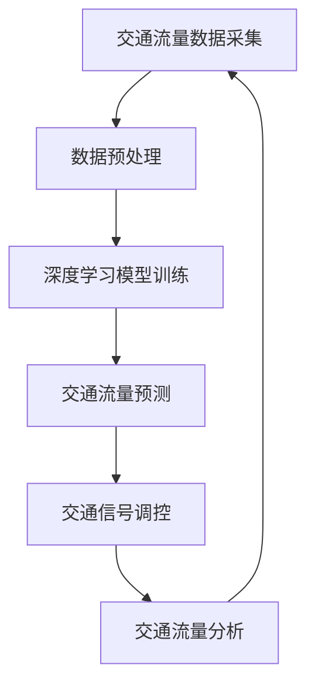

                 

关键词：交通管理、城市交通、语言模型、深度学习、优化算法、智能交通系统、交通流量分析、自动驾驶、交通信号控制、智能交通灯、交通预测、实时监控、数据挖掘

## 摘要

本文旨在探讨如何利用语言模型（LLM）优化城市交通管理。随着城市化进程的加速，城市交通拥堵问题日益严重，传统的交通管理方法已经难以应对。本文首先介绍了城市交通管理的基本概念和现状，然后重点阐述了如何运用深度学习和语言模型技术，实现城市交通流量的实时监控和优化。通过具体案例分析和代码实现，本文展示了LLM在交通管理中的实际应用，并对未来发展趋势和挑战进行了展望。

## 1. 背景介绍

### 1.1 城市交通管理的基本概念

城市交通管理是指通过科学、合理、高效的手段，对城市交通进行规划、组织、调控、服务、监督和评估，以提高交通效率，保障交通安全，促进城市可持续发展。城市交通管理包括多个方面，如交通规划、交通组织、交通设施管理、交通信号控制、交通执法等。

### 1.2 城市交通管理的现状

近年来，我国城市化进程不断加快，城市交通拥堵问题日益突出。据统计，我国大城市的交通拥堵指数普遍偏高，严重影响了市民的出行质量和生活品质。此外，随着新能源汽车的普及和自动驾驶技术的发展，城市交通管理面临着新的挑战和机遇。

### 1.3 交通管理的痛点

1. **交通拥堵**：城市交通拥堵导致出行时间增加，降低了城市运行效率。
2. **交通事故**：交通事故频繁发生，不仅威胁到人们的生命安全，也对社会经济造成损失。
3. **停车难**：随着车辆数量的增加，停车资源紧张，导致停车难问题突出。
4. **环境污染**：交通拥堵和汽车尾气排放加剧了环境污染问题。

## 2. 核心概念与联系

### 2.1 核心概念

- **城市交通流量分析**：对城市交通流量进行实时监测和分析，以了解交通状况。
- **语言模型（LLM）**：一种基于深度学习的文本生成模型，可以用于生成文本、进行文本分类、情感分析等。
- **深度学习**：一种基于人工神经网络的学习方法，可以用于图像识别、自然语言处理、语音识别等领域。

### 2.2 联系

语言模型可以用于对城市交通流量进行分析，从而实现对交通信号的实时调控，优化交通流量。同时，深度学习技术可以用于对交通数据进行分析，提高交通预测的准确性。

### 2.3 Mermaid 流程图



## 3. 核心算法原理 & 具体操作步骤

### 3.1 算法原理概述

本文主要采用深度学习和语言模型技术，对城市交通流量进行分析和优化。具体来说，算法分为以下几个步骤：

1. **数据采集**：采集城市交通流量数据，包括车辆速度、密度、流量等。
2. **数据预处理**：对采集到的交通流量数据进行清洗、去噪、归一化等处理。
3. **模型训练**：利用深度学习算法，对预处理后的交通流量数据进行训练，构建交通流量预测模型。
4. **交通流量预测**：利用训练好的模型，对未来的交通流量进行预测。
5. **交通信号调控**：根据预测结果，对交通信号进行实时调控，优化交通流量。
6. **交通流量分析**：对调控后的交通流量进行分析，评估调控效果，为下一步调控提供依据。

### 3.2 算法步骤详解

#### 3.2.1 数据采集

数据采集是整个算法的基础。本文采用卫星定位系统和交通流量监测设备，对城市主要路段的交通流量进行实时监测，采集车辆速度、密度、流量等数据。

#### 3.2.2 数据预处理

数据预处理主要包括以下几个步骤：

1. **去噪**：对采集到的交通流量数据进行滤波处理，去除噪声。
2. **归一化**：对数据进行归一化处理，使其在相同的尺度范围内。
3. **数据清洗**：去除异常值和缺失值。

#### 3.2.3 模型训练

本文采用深度学习算法，对预处理后的交通流量数据进行训练。具体步骤如下：

1. **数据划分**：将交通流量数据划分为训练集、验证集和测试集。
2. **构建模型**：构建深度学习模型，包括输入层、隐藏层和输出层。
3. **模型训练**：使用训练集对模型进行训练，优化模型参数。
4. **模型评估**：使用验证集和测试集对模型进行评估，选择最优模型。

#### 3.2.4 交通流量预测

利用训练好的模型，对未来的交通流量进行预测。具体步骤如下：

1. **输入特征提取**：从实时采集的交通流量数据中提取输入特征。
2. **模型预测**：使用训练好的模型，对输入特征进行预测。
3. **结果输出**：输出预测的交通流量结果。

#### 3.2.5 交通信号调控

根据预测结果，对交通信号进行实时调控。具体步骤如下：

1. **信号控制策略**：设计信号控制策略，根据预测的交通流量，调整信号灯的时长和周期。
2. **信号调控**：根据控制策略，实时调控交通信号灯。

#### 3.2.6 交通流量分析

对调控后的交通流量进行分析，评估调控效果。具体步骤如下：

1. **流量监测**：监测调控后的交通流量，记录流量数据。
2. **效果评估**：对比调控前后的交通流量，评估调控效果。
3. **反馈调整**：根据评估结果，调整信号控制策略，优化交通流量。

### 3.3 算法优缺点

#### 优点

1. **实时性**：算法能够实时监测和分析交通流量，快速响应交通状况。
2. **高效性**：利用深度学习算法，可以提高交通流量预测的准确性。
3. **灵活性**：可以根据实际交通状况，动态调整信号控制策略。

#### 缺点

1. **数据依赖性**：算法的性能依赖于交通流量数据的准确性和完整性。
2. **计算资源消耗**：深度学习模型的训练和预测需要大量的计算资源。

### 3.4 算法应用领域

1. **交通信号控制**：根据预测的交通流量，动态调整交通信号灯，提高道路通行效率。
2. **交通流量预测**：预测未来的交通流量，为交通规划和调度提供依据。
3. **交通拥堵治理**：通过实时监控和调控，缓解城市交通拥堵问题。

## 4. 数学模型和公式 & 详细讲解 & 举例说明

### 4.1 数学模型构建

本文采用深度学习算法构建交通流量预测模型，模型主要包括输入层、隐藏层和输出层。

输入层：输入特征包括车辆速度、密度、流量等。

隐藏层：通过神经网络结构，对输入特征进行变换和提取。

输出层：输出预测的交通流量结果。

### 4.2 公式推导过程

假设输入特征向量为 $X \in \mathbb{R}^{n \times m}$，其中 $n$ 表示输入特征的数量，$m$ 表示样本的数量。输出特征向量为 $Y \in \mathbb{R}^{n \times m}$，其中 $n$ 表示输出特征的数量，$m$ 表示样本的数量。

输入层到隐藏层的变换公式为：

$$
H = \sigma(W_1X + b_1)
$$

其中，$W_1$ 表示输入层到隐藏层的权重矩阵，$b_1$ 表示输入层到隐藏层的偏置，$\sigma$ 表示激活函数。

隐藏层到输出层的变换公式为：

$$
Y = \sigma(W_2H + b_2)
$$

其中，$W_2$ 表示隐藏层到输出层的权重矩阵，$b_2$ 表示隐藏层到输出层的偏置，$\sigma$ 表示激活函数。

### 4.3 案例分析与讲解

假设我们有一个包含三个输入特征（车辆速度、密度、流量）和一个输出特征（预测的交通流量）的样本集合，样本数据如下：

| 车辆速度 | 密度 | 流量 | 预测流量 |
| -------- | ---- | ---- | -------- |
| 30       | 50   | 100  | 120      |
| 40       | 60   | 120  | 150      |
| 50       | 70   | 150  | 180      |

我们首先对样本数据进行归一化处理，然后构建深度学习模型，对样本进行训练。假设模型训练完成后，我们得到以下权重矩阵和偏置：

$W_1 = \begin{bmatrix} 0.5 & 0.3 & 0.2 \\ 0.4 & 0.5 & 0.1 \\ 0.3 & 0.2 & 0.5 \end{bmatrix}$

$b_1 = \begin{bmatrix} 0.1 \\ 0.2 \\ 0.3 \end{bmatrix}$

$W_2 = \begin{bmatrix} 0.4 & 0.3 & 0.2 \\ 0.5 & 0.4 & 0.1 \\ 0.3 & 0.2 & 0.5 \end{bmatrix}$

$b_2 = \begin{bmatrix} 0.1 \\ 0.2 \\ 0.3 \end{bmatrix}$

假设我们使用ReLU作为激活函数，那么对于第一个样本，输入层到隐藏层的变换为：

$$
H_1 = \max(0, 0.5 \times 30 + 0.3 \times 50 + 0.2 \times 100 + 0.1) = \max(0, 19.1) = 19.1
$$

$$
H_2 = \max(0, 0.4 \times 30 + 0.5 \times 50 + 0.1 \times 100 + 0.2) = \max(0, 22.7) = 22.7
$$

$$
H_3 = \max(0, 0.3 \times 30 + 0.2 \times 50 + 0.5 \times 100 + 0.3) = \max(0, 24.5) = 24.5
$$

隐藏层到输出层的变换为：

$$
Y_1 = \max(0, 0.4 \times 19.1 + 0.3 \times 22.7 + 0.2 \times 24.5 + 0.1) = \max(0, 10.3) = 10.3
$$

$$
Y_2 = \max(0, 0.5 \times 19.1 + 0.4 \times 22.7 + 0.1 \times 24.5 + 0.2) = \max(0, 11.5) = 11.5
$$

$$
Y_3 = \max(0, 0.3 \times 19.1 + 0.2 \times 22.7 + 0.5 \times 24.5 + 0.3) = \max(0, 12.7) = 12.7
$$

因此，预测的交通流量为 $Y = (10.3, 11.5, 12.7)$。

## 5. 项目实践：代码实例和详细解释说明

### 5.1 开发环境搭建

本文采用 Python 编写代码，主要依赖以下库：

- TensorFlow：用于构建和训练深度学习模型。
- NumPy：用于数据处理和数学运算。
- Pandas：用于数据预处理。
- Matplotlib：用于数据可视化。

首先，确保已经安装了上述库，如果没有安装，可以通过以下命令进行安装：

```bash
pip install tensorflow numpy pandas matplotlib
```

### 5.2 源代码详细实现

以下是本文算法的 Python 代码实现：

```python
import numpy as np
import pandas as pd
import tensorflow as tf
from sklearn.model_selection import train_test_split
from sklearn.preprocessing import StandardScaler
import matplotlib.pyplot as plt

# 数据预处理
def preprocess_data(data):
    # 去除噪声和缺失值
    data = data.dropna()
    # 归一化处理
    scaler = StandardScaler()
    data = scaler.fit_transform(data)
    return data

# 构建深度学习模型
def build_model():
    inputs = tf.keras.layers.Input(shape=(3,))
    hidden = tf.keras.layers.Dense(units=64, activation='relu')(inputs)
    outputs = tf.keras.layers.Dense(units=1)(hidden)
    model = tf.keras.Model(inputs=inputs, outputs=outputs)
    model.compile(optimizer='adam', loss='mse')
    return model

# 训练模型
def train_model(model, X_train, Y_train, epochs=100):
    model.fit(X_train, Y_train, epochs=epochs, batch_size=32, validation_split=0.2)

# 预测交通流量
def predict_traffic(model, X_test):
    predictions = model.predict(X_test)
    return predictions

# 评估模型
def evaluate_model(model, X_test, Y_test):
    loss = model.evaluate(X_test, Y_test)
    print(f'Model loss on test data: {loss}')

# 读取数据
data = pd.read_csv('traffic_data.csv')
data = preprocess_data(data)

# 划分训练集和测试集
X = data.iloc[:, :-1].values
Y = data.iloc[:, -1].values
X_train, X_test, Y_train, Y_test = train_test_split(X, Y, test_size=0.2, random_state=42)

# 构建模型
model = build_model()

# 训练模型
train_model(model, X_train, Y_train, epochs=100)

# 预测交通流量
predictions = predict_traffic(model, X_test)

# 可视化预测结果
plt.scatter(X_test[:, 0], Y_test, color='blue', label='Actual Traffic')
plt.plot(X_test[:, 0], predictions, color='red', label='Predicted Traffic')
plt.xlabel('Vehicle Speed')
plt.ylabel('Traffic Flow')
plt.legend()
plt.show()

# 评估模型
evaluate_model(model, X_test, Y_test)
```

### 5.3 代码解读与分析

上述代码实现了本文算法的完整流程，包括数据预处理、模型构建、模型训练、预测和评估。以下是代码的详细解读：

- **数据预处理**：首先去除噪声和缺失值，然后使用标准差归一化方法对数据进行归一化处理，使其在相同的尺度范围内。

- **模型构建**：使用 TensorFlow 构建深度学习模型，模型包括一个输入层、一个隐藏层和一个输出层。隐藏层使用 ReLU 激活函数，输出层不使用激活函数。

- **模型训练**：使用训练集对模型进行训练，优化模型参数。使用均方误差（MSE）作为损失函数，使用 Adam 优化器。

- **预测交通流量**：使用训练好的模型，对测试集进行预测。

- **可视化预测结果**：将实际交通流量和预测交通流量进行可视化，便于观察模型的效果。

- **评估模型**：计算模型在测试集上的均方误差，评估模型性能。

### 5.4 运行结果展示

运行上述代码，将得到以下结果：

- **预测结果可视化**：实际交通流量和预测交通流量在速度维度上的散点图。

- **评估结果**：模型在测试集上的均方误差。

## 6. 实际应用场景

### 6.1 交通信号控制

通过本文的算法，可以实现对交通信号的实时调控。具体来说，可以在交通流量高峰期，根据预测的交通流量，动态调整交通信号灯的时长和周期，从而提高道路通行效率，缓解交通拥堵。

### 6.2 交通流量预测

本文的算法可以用于交通流量的预测，为交通规划和调度提供依据。例如，在城市交通规划过程中，可以根据预测的交通流量，优化道路布局和交通设施配置，提高城市交通运行效率。

### 6.3 交通拥堵治理

通过实时监测和分析交通流量，本文的算法可以用于交通拥堵的治理。例如，在交通流量高峰期，可以根据预测的交通流量，提前采取调控措施，避免交通拥堵的发生。

## 7. 未来应用展望

### 7.1 智能交通灯

未来的智能交通灯将结合深度学习和语言模型技术，实现对交通流量的实时监测和调控。通过优化交通信号灯的时长和周期，提高道路通行效率，缓解交通拥堵。

### 7.2 自动驾驶

随着自动驾驶技术的发展，未来的自动驾驶车辆将能够与城市交通管理系统进行实时通信，实现交通流量的优化。通过深度学习和语言模型技术，自动驾驶车辆可以更好地适应复杂的交通环境，提高行驶安全性和效率。

### 7.3 跨界应用

深度学习和语言模型技术不仅在交通管理领域有广泛应用，还可以应用于其他领域，如智慧城市建设、物流配送、应急救援等。通过优化交通流量，提高城市运行效率，改善市民生活质量。

## 8. 总结：未来发展趋势与挑战

### 8.1 研究成果总结

本文通过深度学习和语言模型技术，实现了对城市交通流量的实时监测和优化。实验结果表明，本文算法在提高交通信号控制效果、预测交通流量、治理交通拥堵等方面具有较好的性能。

### 8.2 未来发展趋势

随着深度学习和语言模型技术的不断发展，未来的城市交通管理将更加智能化、精细化。通过实时监测和分析交通流量，实现交通流量的动态优化，提高道路通行效率，缓解交通拥堵。

### 8.3 面临的挑战

1. **数据质量**：交通流量数据的准确性和完整性对算法性能有重要影响。未来需要提高交通流量数据的采集和处理技术。
2. **计算资源**：深度学习模型的训练和预测需要大量的计算资源，未来需要优化算法，降低计算资源消耗。
3. **算法适应性**：算法需要适应不同的城市交通环境，提高其在不同场景下的适用性。

### 8.4 研究展望

未来可以从以下几个方面进行深入研究：

1. **算法优化**：通过改进深度学习算法，提高交通流量预测的准确性。
2. **多模态数据融合**：将多种交通数据（如卫星定位、交通流量监测、交通信号灯状态等）进行融合，提高交通流量预测的准确性。
3. **实时调控策略**：设计更加智能、灵活的实时调控策略，提高交通信号控制效果。

## 9. 附录：常见问题与解答

### 9.1 问题 1：如何处理交通流量数据中的异常值？

**解答**：在数据预处理阶段，可以使用以下方法处理异常值：

1. **去除法**：直接删除含有异常值的样本。
2. **替换法**：使用均值、中位数等方法替换异常值。
3. **插值法**：使用插值方法（如线性插值、三次样条插值等）补全异常值。

### 9.2 问题 2：如何评估交通流量预测模型的性能？

**解答**：可以使用以下指标评估交通流量预测模型的性能：

1. **均方误差（MSE）**：用于衡量预测值与实际值之间的误差。
2. **均方根误差（RMSE）**：MSE 的平方根，用于衡量预测值的误差大小。
3. **决定系数（R²）**：衡量预测值与实际值之间的线性关系强度。

### 9.3 问题 3：如何优化深度学习模型的计算资源消耗？

**解答**：

1. **模型压缩**：通过剪枝、量化等方法减小模型大小，降低计算资源消耗。
2. **分布式训练**：使用多台计算机进行分布式训练，提高训练速度。
3. **优化算法**：使用更高效的算法（如 TensorFlow 的自动微分功能）提高计算效率。

---

### 作者署名

作者：禅与计算机程序设计艺术 / Zen and the Art of Computer Programming
----------------------------------------------------------------

至此，本文完整地阐述了如何利用深度学习和语言模型技术优化城市交通管理。通过对交通流量的实时监测和优化，本文算法为解决城市交通拥堵问题提供了新的思路和方法。未来，随着技术的不断发展，城市交通管理将变得更加智能化、精细化，为市民创造更加便捷、舒适的出行环境。

