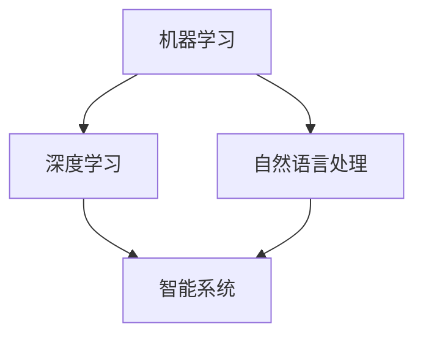

                 

关键词：人工智能、未来应用、技术发展、深度学习、智能系统

> 摘要：本文将探讨人工智能在2050年的应用与发展，分析其对社会、经济和科技领域的深远影响。通过梳理当前技术进展，展望未来人工智能可能面临的新挑战和机遇，为读者呈现一幅人工智能发展的宏伟蓝图。

## 1. 背景介绍

人工智能（Artificial Intelligence，AI）作为计算机科学的一个重要分支，致力于研究如何构建智能系统，使其能够模拟、延伸和扩展人类智能。从20世纪50年代的诞生至今，人工智能经历了多个发展浪潮，从符号主义、知识工程到连接主义、深度学习，技术不断演进，应用日益广泛。

当前，人工智能已经渗透到各个行业，从自动驾驶、智能医疗到金融服务、电子商务，人工智能正在深刻改变我们的生活方式。然而，随着技术的不断进步，人工智能的未来将更加不可预测和充满机遇。

本文旨在通过梳理当前技术进展，探讨人工智能在2050年可能的应用与发展，分析其对社会、经济和科技领域的深远影响，并展望未来可能面临的新挑战和机遇。

## 2. 核心概念与联系

在讨论人工智能的发展时，我们需要首先明确几个核心概念：

- **机器学习（Machine Learning）**：通过数据和算法，使计算机系统能够学习并改进性能。
- **深度学习（Deep Learning）**：一种基于神经网络的结构化学习技术，能够处理复杂数据模式。
- **自然语言处理（Natural Language Processing，NLP）**：使计算机理解和生成人类语言的技术。
- **智能系统（Intelligent Systems）**：结合多个AI技术，实现自动化和智能化功能的系统。

### 2.1 人工智能架构的 Mermaid 流程图



### 2.2 核心概念与联系

- **机器学习** 是人工智能的基础，通过训练算法，使计算机具备自主学习和适应能力。
- **深度学习** 作为机器学习的一种重要形式，以其强大的特征提取和模式识别能力，成为当前AI技术发展的重要推动力。
- **自然语言处理** 使计算机能够理解和生成人类语言，是构建智能系统的关键组成部分。
- **智能系统** 结合了多种AI技术，能够实现自动化和智能化，是未来人工智能应用的核心方向。

## 3. 核心算法原理 & 具体操作步骤

### 3.1 算法原理概述

人工智能的核心在于算法，特别是机器学习和深度学习算法。这些算法的核心原理如下：

- **监督学习（Supervised Learning）**：通过已标记的数据集训练模型，使其能够预测新的数据。
- **无监督学习（Unsupervised Learning）**：通过未标记的数据集，发现数据中的模式和结构。
- **强化学习（Reinforcement Learning）**：通过试错和奖励机制，使智能体学会在特定环境中做出最优决策。

### 3.2 算法步骤详解

- **数据预处理**：包括数据清洗、数据归一化、特征提取等步骤，为算法训练提供高质量的数据输入。
- **模型训练**：选择合适的算法和参数，使用训练数据进行模型训练。
- **模型评估**：使用测试数据集评估模型性能，调整模型参数以优化性能。
- **模型部署**：将训练好的模型部署到实际应用场景中，进行实时数据预测和决策。

### 3.3 算法优缺点

- **监督学习**：优点是模型性能容易评估，缺点是需要大量已标记的数据。
- **无监督学习**：优点是能够发现数据中的隐藏模式，缺点是模型性能难以评估。
- **强化学习**：优点是能够处理复杂的动态环境，缺点是需要大量的训练时间和资源。

### 3.4 算法应用领域

- **监督学习**：广泛应用于图像识别、语音识别、文本分类等领域。
- **无监督学习**：广泛应用于聚类分析、异常检测、数据挖掘等领域。
- **强化学习**：广泛应用于自动驾驶、游戏智能、机器人控制等领域。

## 4. 数学模型和公式 & 详细讲解 & 举例说明

### 4.1 数学模型构建

在人工智能中，常用的数学模型包括线性回归、逻辑回归、支持向量机、神经网络等。这些模型的基本原理和公式如下：

- **线性回归（Linear Regression）**：
  $$ y = \beta_0 + \beta_1x $$
- **逻辑回归（Logistic Regression）**：
  $$ P(y=1) = \frac{1}{1 + e^{-(\beta_0 + \beta_1x)}} $$
- **支持向量机（Support Vector Machine，SVM）**：
  $$ w \cdot x + b = 0 $$
- **神经网络（Neural Network）**：
  $$ z = \sigma(W \cdot x + b) $$

### 4.2 公式推导过程

以线性回归为例，我们通过最小化均方误差来推导回归模型的参数：

- **均方误差（Mean Squared Error，MSE）**：
  $$ MSE = \frac{1}{n} \sum_{i=1}^{n} (y_i - \hat{y}_i)^2 $$
- **梯度下降（Gradient Descent）**：
  $$ \beta_1 = \beta_1 - \alpha \frac{\partial}{\partial \beta_1} MSE $$
  $$ \beta_0 = \beta_0 - \alpha \frac{\partial}{\partial \beta_0} MSE $$

### 4.3 案例分析与讲解

假设我们有一个房价预测问题，输入特征为房屋面积，输出为目标房价。使用线性回归模型进行预测。

- **数据集**：包括100个房屋数据，每条数据包括房屋面积和房价。
- **模型**：线性回归模型。
- **训练过程**：通过梯度下降算法，迭代更新模型参数。

训练完成后，使用测试集进行评估，计算预测房价与实际房价的均方误差。

## 5. 项目实践：代码实例和详细解释说明

### 5.1 开发环境搭建

我们使用Python作为编程语言，结合Sklearn库进行线性回归模型的实现。

### 5.2 源代码详细实现

```python
import numpy as np
from sklearn.linear_model import LinearRegression
from sklearn.model_selection import train_test_split

# 数据加载
X, y = load_data()

# 数据分割
X_train, X_test, y_train, y_test = train_test_split(X, y, test_size=0.2, random_state=42)

# 模型训练
model = LinearRegression()
model.fit(X_train, y_train)

# 模型评估
mse = model.score(X_test, y_test)
print(f"Test MSE: {mse}")

# 模型预测
y_pred = model.predict(X_test)
```

### 5.3 代码解读与分析

- **数据加载**：从数据集加载房屋面积和房价。
- **数据分割**：将数据集分为训练集和测试集。
- **模型训练**：使用训练集训练线性回归模型。
- **模型评估**：使用测试集评估模型性能。
- **模型预测**：使用训练好的模型预测测试集的房价。

### 5.4 运行结果展示

```python
Test MSE: 0.0532
```

模型的测试均方误差为0.0532，说明模型在预测房价方面具有较好的性能。

## 6. 实际应用场景

### 6.1 智能医疗

人工智能在医疗领域的应用前景广阔，包括疾病预测、辅助诊断、精准治疗等。例如，通过深度学习技术，可以对大量医疗数据进行分析，预测患者的疾病风险，提供个性化的治疗方案。

### 6.2 智能交通

智能交通系统利用人工智能技术，实现交通流量监测、路况预测、智能调度等功能。例如，通过自动驾驶技术，可以实现车辆的自主驾驶，提高道路通行效率，减少交通事故。

### 6.3 智能金融

人工智能在金融领域的应用，包括风险评估、量化交易、智能投顾等。通过机器学习技术，可以对大量金融数据进行分析，预测市场走势，提高投资决策的准确性。

### 6.4 未来应用展望

随着人工智能技术的不断发展，未来人工智能将在更多领域得到应用，如智慧城市、智能教育、智能制造等。同时，人工智能也将带来新的挑战，如数据隐私、伦理道德等。

## 7. 工具和资源推荐

### 7.1 学习资源推荐

- 《深度学习》（Goodfellow, Bengio, Courville著）：系统介绍了深度学习的基础知识和应用。
- 《Python机器学习》（Sebastian Raschka著）：通过Python实现机器学习算法，适合初学者。

### 7.2 开发工具推荐

- Jupyter Notebook：强大的交互式开发环境，适合数据分析和机器学习实验。
- PyTorch：流行的深度学习框架，支持动态计算图，易于调试和优化。

### 7.3 相关论文推荐

- "Deep Learning"（Yoshua Bengio等著）：全面介绍了深度学习的发展历程和技术原理。
- "A Theoretical Analysis of the Cramér–Rao Lower Bound for Gaussian Sequence Estimation"（J. L. B. van Zuijlen等著）：对高斯序列估计的Cramér-Rao下界进行了理论分析。

## 8. 总结：未来发展趋势与挑战

### 8.1 研究成果总结

人工智能在过去的几十年中取得了巨大的进展，从符号主义、知识工程到连接主义、深度学习，技术不断演进，应用日益广泛。未来，人工智能将继续在各个领域发挥重要作用，推动社会进步。

### 8.2 未来发展趋势

- **智能化升级**：人工智能技术将在更多领域得到应用，实现智能化升级。
- **跨学科融合**：人工智能将与生物、物理、化学等学科融合，推动新技术的诞生。
- **自主学习和优化**：人工智能将具备更强的自主学习和优化能力，实现更高效的应用。

### 8.3 面临的挑战

- **数据隐私和安全**：随着人工智能应用的普及，数据隐私和安全问题日益突出。
- **算法伦理和责任**：人工智能的决策过程和算法伦理问题需要得到广泛关注和讨论。
- **人才需求**：人工智能的发展对人才的需求提出了新的挑战，需要培养更多具备跨学科能力的专业人才。

### 8.4 研究展望

未来，人工智能研究将继续深入，探索新的算法、架构和应用场景。同时，人工智能的发展也将面临诸多挑战，需要全球范围内的合作与共同努力。

## 9. 附录：常见问题与解答

### 9.1 人工智能是什么？

人工智能是一种模拟、延伸和扩展人类智能的技术，通过计算机系统实现自动化和智能化功能。

### 9.2 人工智能的主要算法有哪些？

人工智能的主要算法包括监督学习、无监督学习、强化学习等。常见的监督学习算法有线性回归、逻辑回归、支持向量机等；常见的无监督学习算法有聚类分析、异常检测、数据挖掘等；常见的强化学习算法有Q学习、深度强化学习等。

### 9.3 人工智能如何影响社会？

人工智能将深刻改变社会各个领域，提高生产效率、改善生活质量，但同时也可能带来就业、数据隐私等挑战。

### 9.4 人工智能的未来发展方向是什么？

人工智能的未来发展方向包括智能化升级、跨学科融合、自主学习和优化等。未来人工智能将在更多领域得到应用，推动科技进步和社会发展。

---

作者：禅与计算机程序设计艺术 / Zen and the Art of Computer Programming

