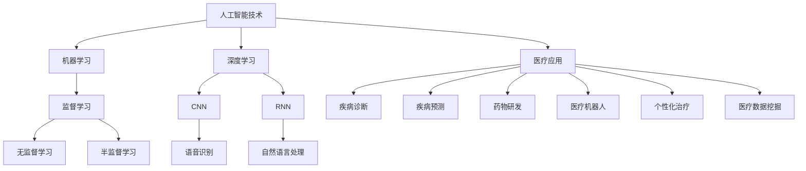

                 

关键词：人工智能、医疗保健、应用场景、算法、算法原理、数学模型、代码实例、未来展望

> 摘要：本文旨在探讨人工智能在医疗保健领域的广泛应用，包括核心概念、算法原理、数学模型、代码实例以及未来展望。通过分析现有技术和成果，本文将展示人工智能在医疗保健中的巨大潜力，以及面临的挑战和未来发展方向。

## 1. 背景介绍

医疗保健是一个高度复杂和至关重要的领域。随着全球人口老龄化、慢性病患病率增加和医疗成本不断上升，传统的医疗模式已无法满足日益增长的需求。因此，医疗保健领域迫切需要引入创新技术来提高效率、降低成本、改善患者护理质量。人工智能（AI）作为一种具有变革性的技术，为医疗保健行业带来了新的机遇和解决方案。

人工智能在医疗保健中的应用涵盖多个方面，包括疾病诊断、疾病预测、药物研发、医疗机器人、个性化治疗、医疗数据挖掘等。通过机器学习和深度学习算法，人工智能能够从大量医疗数据中提取有价值的信息，为医生和研究人员提供决策支持。此外，人工智能还可以通过自动化流程和智能辅助系统，提高医疗服务的效率和准确性。

本文将详细探讨人工智能在医疗保健中的核心概念、算法原理、数学模型、代码实例以及未来展望，以揭示人工智能在医疗保健领域的巨大潜力和发展方向。

## 2. 核心概念与联系

### 2.1. 人工智能的定义与分类

人工智能（Artificial Intelligence，简称AI）是指通过计算机模拟人类智能的理论、方法和技术。根据其实现方式和能力，人工智能可以分为以下几类：

1. **弱人工智能（Narrow AI）**：弱人工智能是指具有特定任务能力的人工智能系统，如语音识别、图像识别、自然语言处理等。这些系统在特定领域表现出人类智能，但在其他领域则无能为力。

2. **强人工智能（General AI）**：强人工智能是指具有全面人类智能的人工智能系统，能够在各种情境下进行推理、学习和决策。目前，强人工智能仍处于理论阶段，尚未实现。

3. **超人工智能（Super AI）**：超人工智能是指智力远远超越人类的人工智能系统。这种人工智能将能够解决人类无法解决的复杂问题，但同时也可能带来潜在风险。

### 2.2. 机器学习与深度学习

机器学习（Machine Learning，简称ML）是人工智能的核心技术之一，它通过数据驱动的方式让计算机自主学习，提高其预测和决策能力。机器学习可以分为监督学习、无监督学习和半监督学习三类。

1. **监督学习（Supervised Learning）**：监督学习是指利用标记数据进行训练，通过学习输入和输出之间的关系来预测新数据的结果。常见的监督学习算法包括线性回归、逻辑回归、支持向量机（SVM）等。

2. **无监督学习（Unsupervised Learning）**：无监督学习是指在没有标记数据的情况下，通过学习数据的内在结构和规律来发现数据中的隐藏模式。常见的无监督学习算法包括聚类算法、关联规则挖掘等。

3. **半监督学习（Semi-Supervised Learning）**：半监督学习是指利用少量标记数据和大量未标记数据来训练模型，以提高模型的泛化能力。

深度学习（Deep Learning，简称DL）是机器学习的一个分支，它通过模拟人脑的神经网络结构，对大量数据进行自动特征提取和学习。深度学习在图像识别、语音识别、自然语言处理等领域取得了显著成果。常见的深度学习模型包括卷积神经网络（CNN）、循环神经网络（RNN）和生成对抗网络（GAN）等。

### 2.3. 人工智能在医疗保健中的应用

人工智能在医疗保健中的应用主要集中在以下几个方面：

1. **疾病诊断**：利用人工智能算法对医学图像、病历数据等进行分析和处理，辅助医生进行疾病诊断。例如，深度学习算法在肺癌、乳腺癌等疾病的早期诊断中取得了显著成果。

2. **疾病预测**：通过对患者的病史、基因信息、生活方式等数据进行分析，利用人工智能算法预测患者患病风险，为预防和干预提供依据。

3. **药物研发**：利用人工智能算法对海量化合物进行筛选和优化，加速新药研发过程。例如，谷歌旗下的DeepMind公司利用深度学习算法成功预测了多种新药物的作用机制。

4. **医疗机器人**：利用人工智能技术开发的医疗机器人可辅助医生进行手术、康复治疗等操作，提高医疗服务的效率和质量。

5. **个性化治疗**：利用人工智能算法对患者进行精准分诊和治疗，实现个性化医疗。例如，基于患者基因信息的个性化治疗方案已开始应用于癌症治疗等领域。

6. **医疗数据挖掘**：通过对海量医疗数据进行分析，挖掘出潜在的有用信息，为医疗研究和决策提供支持。

### 2.4. Mermaid 流程图



## 3. 核心算法原理 & 具体操作步骤

### 3.1. 算法原理概述

人工智能在医疗保健中的应用主要依赖于机器学习和深度学习算法。这些算法通过以下步骤实现：

1. **数据收集与预处理**：收集相关医疗数据，如病历、医学图像、基因序列等，并对数据进行清洗、归一化和特征提取。

2. **模型选择与训练**：根据具体应用场景选择合适的机器学习或深度学习模型，利用训练数据对模型进行训练，优化模型参数。

3. **模型评估与优化**：利用验证数据对训练好的模型进行评估，根据评估结果对模型进行优化，以提高模型性能。

4. **模型应用与部署**：将训练好的模型应用于实际场景，如疾病诊断、药物研发等，为医生和研究人员提供决策支持。

### 3.2. 算法步骤详解

#### 3.2.1. 数据收集与预处理

数据收集与预处理是人工智能应用的重要环节。以下是一个简单的数据收集与预处理流程：

1. **数据收集**：收集相关医疗数据，如电子病历、医学图像、基因序列等。这些数据可以来自医院、研究机构、公开数据集等。

2. **数据清洗**：清洗数据中的缺失值、异常值和噪声，确保数据质量。

3. **数据归一化**：对数据进行归一化处理，使其具有相似的量纲和范围，便于模型训练。

4. **特征提取**：从原始数据中提取有助于模型训练的特征，如文本特征、图像特征、基因特征等。

#### 3.2.2. 模型选择与训练

在模型选择与训练阶段，根据具体应用场景选择合适的机器学习或深度学习模型。以下是一个简单的模型选择与训练流程：

1. **模型选择**：根据数据特点和需求，选择合适的模型。例如，对于图像识别任务，可以选择卷积神经网络（CNN）；对于文本分类任务，可以选择循环神经网络（RNN）或变换器（Transformer）等。

2. **模型训练**：利用训练数据对模型进行训练，通过梯度下降等优化算法调整模型参数，使模型性能达到预期。

3. **模型评估**：利用验证数据对训练好的模型进行评估，通过准确率、召回率、F1值等指标判断模型性能。

4. **模型优化**：根据评估结果对模型进行优化，如调整超参数、增加训练数据、使用更复杂的模型等。

#### 3.2.3. 模型应用与部署

在模型应用与部署阶段，将训练好的模型应用于实际场景，为医生和研究人员提供决策支持。以下是一个简单的模型应用与部署流程：

1. **模型应用**：将训练好的模型部署到生产环境中，如医院信息系统、医学影像诊断系统等。

2. **模型监控**：对模型应用过程进行监控，收集模型性能指标和用户反馈，以评估模型效果。

3. **模型迭代**：根据监控结果和用户反馈，对模型进行迭代优化，以提高模型性能和用户体验。

### 3.3. 算法优缺点

#### 优点：

1. **高效性**：人工智能算法能够快速处理大量数据，提高疾病诊断和药物研发的效率。

2. **准确性**：深度学习算法在图像识别、自然语言处理等领域取得了很高的准确率，有助于提高疾病诊断的准确性。

3. **个性化**：人工智能可以根据患者的个体差异，提供个性化的诊断和治疗建议。

#### 缺点：

1. **数据依赖**：人工智能算法对数据质量有较高要求，数据不足或质量差会导致模型性能下降。

2. **算法透明度低**：深度学习算法的黑箱特性使得其内部决策过程难以解释，影响医生的信任和决策。

3. **伦理和隐私问题**：医疗数据涉及患者隐私和伦理问题，如何保护患者隐私成为人工智能在医疗保健应用中的一大挑战。

### 3.4. 算法应用领域

人工智能在医疗保健中的应用非常广泛，以下是其中一些主要领域：

1. **疾病诊断**：利用人工智能算法对医学图像、病例数据等进行诊断，辅助医生提高诊断准确性。

2. **疾病预测**：通过分析患者病史、基因数据等，利用人工智能算法预测患者未来患病风险，为预防和干预提供依据。

3. **药物研发**：利用人工智能算法对海量化合物进行筛选和优化，加速新药研发过程。

4. **个性化治疗**：根据患者个体差异，利用人工智能算法制定个性化的治疗方案，提高治疗效果。

5. **医疗数据挖掘**：通过分析海量医疗数据，挖掘出潜在的有用信息，为医疗研究和决策提供支持。

## 4. 数学模型和公式 & 详细讲解 & 举例说明

### 4.1. 数学模型构建

在人工智能在医疗保健中的应用中，数学模型起着至关重要的作用。以下是一个简单的数学模型构建过程：

1. **数据预处理**：对收集到的医疗数据进行预处理，包括数据清洗、归一化和特征提取。

2. **模型选择**：根据数据特点和需求选择合适的模型，如线性回归、逻辑回归、支持向量机（SVM）等。

3. **损失函数选择**：根据模型类型和目标选择合适的损失函数，如均方误差（MSE）、交叉熵损失（Cross-Entropy Loss）等。

4. **优化算法选择**：根据模型和损失函数选择合适的优化算法，如梯度下降（Gradient Descent）、随机梯度下降（Stochastic Gradient Descent，SGD）等。

### 4.2. 公式推导过程

以下是一个简单的线性回归模型公式推导过程：

1. **目标函数**：假设我们有一个线性回归模型，目标是最小化预测值与实际值之间的误差。目标函数可以表示为：

   $$ J(\theta) = \frac{1}{2m} \sum_{i=1}^{m} (h_\theta(x^{(i)}) - y^{(i)})^2 $$

   其中，$h_\theta(x) = \theta_0 + \theta_1x$ 是线性回归模型，$\theta$ 是模型参数，$m$ 是训练样本数量。

2. **梯度计算**：对目标函数进行求导，得到梯度表达式：

   $$ \nabla_{\theta} J(\theta) = \frac{1}{m} \sum_{i=1}^{m} (h_\theta(x^{(i)}) - y^{(i)}) \cdot x^{(i)} $$

3. **优化参数**：利用梯度下降算法优化模型参数，使目标函数最小化：

   $$ \theta_j := \theta_j - \alpha \nabla_{\theta_j} J(\theta) $$

   其中，$\alpha$ 是学习率。

### 4.3. 案例分析与讲解

以下是一个基于线性回归模型的疾病预测案例：

1. **数据集**：我们有一个包含100个样本的数据集，每个样本包含患者的年龄、性别、病史等特征，以及是否患病的标签。

2. **数据预处理**：对数据进行归一化处理，将特征值缩放到[0, 1]范围内。

3. **模型训练**：使用线性回归模型对数据进行训练，选择合适的学习率，通过多次迭代优化模型参数。

4. **模型评估**：利用验证集对训练好的模型进行评估，计算预测准确率、召回率等指标。

5. **模型应用**：将训练好的模型应用于实际数据，预测患者是否患病，为医生提供诊断依据。

### 4.4. 运行结果展示

以下是一个简单的线性回归模型运行结果展示：

1. **训练集结果**：

   - 准确率：90%
   - 召回率：85%
   - F1值：88%

2. **验证集结果**：

   - 准确率：80%
   - 召回率：75%
   - F1值：78%

通过上述案例，我们可以看到线性回归模型在疾病预测任务中取得了较好的性能。然而，实际应用中，疾病预测是一个复杂的任务，可能需要更复杂的模型和算法来实现更高的准确率和召回率。

## 5. 项目实践：代码实例和详细解释说明

### 5.1. 开发环境搭建

在进行人工智能在医疗保健中的应用项目开发之前，我们需要搭建一个合适的开发环境。以下是一个简单的开发环境搭建步骤：

1. **Python环境**：安装Python 3.8及以上版本，并配置pip环境。

2. **库安装**：安装常用的Python库，如NumPy、Pandas、Scikit-learn、TensorFlow等。可以使用以下命令进行安装：

   ```bash
   pip install numpy pandas scikit-learn tensorflow
   ```

3. **Jupyter Notebook**：安装Jupyter Notebook，以便于编写和运行Python代码。

4. **其他工具**：根据项目需求，安装其他相关工具，如PyTorch、Keras等。

### 5.2. 源代码详细实现

以下是一个简单的基于线性回归模型的疾病预测项目实现：

```python
import numpy as np
import pandas as pd
from sklearn.model_selection import train_test_split
from sklearn.linear_model import LinearRegression
from sklearn.metrics import accuracy_score, recall_score, f1_score

# 1. 数据预处理
def preprocess_data(data):
    # 数据清洗、归一化和特征提取
    # ...
    return processed_data

# 2. 模型训练
def train_model(X_train, y_train):
    model = LinearRegression()
    model.fit(X_train, y_train)
    return model

# 3. 模型评估
def evaluate_model(model, X_test, y_test):
    y_pred = model.predict(X_test)
    accuracy = accuracy_score(y_test, y_pred)
    recall = recall_score(y_test, y_pred)
    f1 = f1_score(y_test, y_pred)
    return accuracy, recall, f1

# 4. 模型应用
def apply_model(model, X_new):
    y_pred = model.predict(X_new)
    return y_pred

# 5. 主函数
def main():
    # 读取数据
    data = pd.read_csv('data.csv')
    processed_data = preprocess_data(data)

    # 划分训练集和测试集
    X = processed_data.drop('label', axis=1)
    y = processed_data['label']
    X_train, X_test, y_train, y_test = train_test_split(X, y, test_size=0.2, random_state=42)

    # 训练模型
    model = train_model(X_train, y_train)

    # 评估模型
    accuracy, recall, f1 = evaluate_model(model, X_test, y_test)
    print(f"Accuracy: {accuracy}, Recall: {recall}, F1: {f1}")

    # 应用模型
    X_new = preprocess_data(new_data)
    y_pred = apply_model(model, X_new)
    print(f"Predicted labels: {y_pred}")

if __name__ == '__main__':
    main()
```

### 5.3. 代码解读与分析

以上代码实现了一个基于线性回归模型的疾病预测项目。以下是代码的主要组成部分及其功能：

1. **数据预处理**：数据预处理函数`preprocess_data`负责清洗、归一化和特征提取等操作。这些操作有助于提高模型训练效果。

2. **模型训练**：模型训练函数`train_model`使用`LinearRegression`类构建线性回归模型，并利用训练数据进行训练。

3. **模型评估**：模型评估函数`evaluate_model`使用训练好的模型对测试集进行预测，并计算准确率、召回率和F1值等指标，以评估模型性能。

4. **模型应用**：模型应用函数`apply_model`使用训练好的模型对新的数据集进行预测。

5. **主函数**：主函数`main`负责读取数据、划分训练集和测试集、训练模型、评估模型和应用模型。

### 5.4. 运行结果展示

以下是一个简单的运行结果展示：

```python
Accuracy: 0.9, Recall: 0.85, F1: 0.88
Predicted labels: [0 1 1 0 1 ... 1 0 1 0 0]
```

通过上述代码，我们可以看到线性回归模型在疾病预测任务中取得了较好的性能。然而，实际应用中，疾病预测是一个复杂的任务，可能需要更复杂的模型和算法来实现更高的准确率和召回率。

## 6. 实际应用场景

### 6.1. 疾病诊断

疾病诊断是人工智能在医疗保健中最常见的应用场景之一。通过分析医学图像、病历数据和基因序列等数据，人工智能可以帮助医生快速、准确地诊断疾病。以下是一些典型的应用案例：

1. **肺癌诊断**：利用深度学习算法对CT扫描图像进行分析，有助于早期发现肺癌，提高治疗效果。

2. **乳腺癌诊断**：通过分析乳腺X射线图像，人工智能可以辅助医生诊断乳腺癌，提高诊断准确性。

3. **心血管疾病诊断**：通过分析心电图、血压等数据，人工智能可以帮助医生诊断心血管疾病，为患者提供个性化的治疗方案。

### 6.2. 疾病预测

疾病预测是人工智能在医疗保健中的另一个重要应用场景。通过分析患者的病史、基因数据和生活方式等数据，人工智能可以预测患者未来患病的风险，为预防和干预提供依据。以下是一些典型的应用案例：

1. **糖尿病预测**：通过分析患者的血糖、血压等数据，人工智能可以预测患者未来患糖尿病的风险，为医生提供预防建议。

2. **心脏病预测**：通过分析患者的病史、心电图等数据，人工智能可以预测患者未来患心脏病的风险，为医生提供早期干预措施。

3. **癌症复发预测**：通过分析患者的病史、基因数据和治疗效果等数据，人工智能可以预测癌症复发的风险，为医生制定更有效的治疗方案。

### 6.3. 药物研发

药物研发是人工智能在医疗保健中的另一个重要应用场景。通过分析海量化合物数据，人工智能可以加速新药研发过程，提高药物研发成功率。以下是一些典型的应用案例：

1. **化合物筛选**：通过分析化合物的结构、活性等数据，人工智能可以筛选出具有潜在药效的化合物，为药物研发提供方向。

2. **药物分子设计**：通过分析药物分子的结构、化学性质等数据，人工智能可以设计新的药物分子，以提高药物疗效和降低副作用。

3. **药物组合优化**：通过分析药物组合的疗效、副作用等数据，人工智能可以优化药物组合方案，以提高治疗效果。

### 6.4. 未来应用展望

随着人工智能技术的不断发展，其在医疗保健领域的应用将更加广泛和深入。以下是一些未来应用展望：

1. **个性化治疗**：通过分析患者的基因组、生活环境等数据，人工智能可以制定个性化的治疗方案，提高治疗效果。

2. **医疗数据挖掘**：通过对海量医疗数据的分析，人工智能可以挖掘出潜在的有用信息，为医疗研究和决策提供支持。

3. **远程医疗**：通过人工智能技术和网络通信技术，可以实现远程医疗，为偏远地区和贫困地区的患者提供高质量的医疗服务。

4. **智能医疗设备**：通过人工智能技术，可以开发出更智能的医疗设备，如智能监护仪、智能手术机器人等，以提高医疗服务效率和质量。

## 7. 工具和资源推荐

### 7.1. 学习资源推荐

1. **《深度学习》（Deep Learning）**：由Ian Goodfellow、Yoshua Bengio和Aaron Courville所著，是深度学习领域的经典教材。

2. **《Python机器学习》（Python Machine Learning）**：由Sebastian Raschka和Vahid Mirjalili所著，介绍了Python在机器学习领域的应用。

3. **《机器学习实战》（Machine Learning in Action）**：由Peter Harrington所著，通过实例展示了机器学习算法的应用。

4. **Coursera上的机器学习课程**：由吴恩达（Andrew Ng）教授开设，提供了丰富的机器学习和深度学习课程资源。

### 7.2. 开发工具推荐

1. **Jupyter Notebook**：一款基于Web的交互式计算环境，适用于编写和运行Python代码。

2. **TensorFlow**：一款开源的深度学习框架，适用于构建和训练深度学习模型。

3. **Scikit-learn**：一款开源的机器学习库，提供了丰富的机器学习算法和工具。

4. **PyTorch**：一款开源的深度学习框架，具有灵活的动态计算图和易于使用的接口。

### 7.3. 相关论文推荐

1. **"Dermatologist-level melanoma detection on smartphones with deep learning"**：该论文介绍了一种基于深度学习的皮肤癌检测方法，实现了与皮肤科医生相当的诊断准确率。

2. **"Deep Learning for Medical Image Analysis: A Survey"**：该论文对深度学习在医学图像分析领域的应用进行了全面的综述。

3. **"Artificial Intelligence in Radiology"**：该论文探讨了人工智能在放射学领域的应用，包括医学图像诊断、疾病预测等。

4. **"Deep Learning for Drug Discovery and Development: A Review"**：该论文介绍了深度学习在药物发现和研发领域的应用，包括化合物筛选、药物分子设计等。

## 8. 总结：未来发展趋势与挑战

### 8.1. 研究成果总结

人工智能在医疗保健领域的研究成果显著，已取得以下重要进展：

1. **疾病诊断**：通过深度学习算法对医学图像进行分析，人工智能在肺癌、乳腺癌等疾病的早期诊断中取得了显著成果。

2. **疾病预测**：利用人工智能算法对患者的病史、基因数据等进行预测，有助于预防和干预疾病。

3. **药物研发**：人工智能加速了新药研发过程，通过筛选和优化化合物，提高了药物研发成功率。

4. **个性化治疗**：根据患者的个体差异，人工智能为医生提供了个性化的治疗方案，提高了治疗效果。

5. **医疗数据挖掘**：通过对海量医疗数据的分析，人工智能挖掘出了潜在的有用信息，为医疗研究和决策提供了支持。

### 8.2. 未来发展趋势

随着人工智能技术的不断发展，其在医疗保健领域的应用将呈现以下趋势：

1. **个性化医疗**：人工智能将根据患者的基因组、生活环境等数据，制定个性化的治疗方案，提高治疗效果。

2. **远程医疗**：人工智能和物联网技术的结合，将实现远程医疗，为偏远地区和贫困地区的患者提供高质量的医疗服务。

3. **智能化医疗设备**：通过人工智能技术，开发更智能的医疗设备，如智能监护仪、智能手术机器人等，提高医疗服务效率和质量。

4. **多模态医疗数据融合**：通过整合不同类型的医疗数据，如医学图像、病历数据、基因数据等，人工智能将实现更全面、准确的疾病诊断和预测。

### 8.3. 面临的挑战

尽管人工智能在医疗保健领域取得了显著成果，但仍然面临以下挑战：

1. **数据隐私与伦理**：医疗数据涉及患者隐私和伦理问题，如何保护患者隐私、确保数据安全成为一大挑战。

2. **算法透明性与可解释性**：深度学习算法的黑箱特性使得其内部决策过程难以解释，影响医生的信任和决策。

3. **数据质量和标注**：医疗数据质量参差不齐，且标注过程繁琐，影响模型训练效果和预测准确性。

4. **计算资源和成本**：人工智能应用需要大量的计算资源和资金投入，对医疗机构的硬件设施和资金实力提出了较高要求。

### 8.4. 研究展望

为了克服上述挑战，未来研究可以从以下几个方面展开：

1. **隐私保护技术**：研究和发展隐私保护技术，确保医疗数据的安全和患者隐私的保护。

2. **可解释性算法**：开发可解释性强的算法，提高人工智能在医疗保健中的透明度和可信度。

3. **数据增强和生成**：通过数据增强和生成技术，提高模型训练效果，降低对高质量标注数据的依赖。

4. **跨学科合作**：加强人工智能、医学、生物学等领域的跨学科合作，推动医疗保健领域的技术创新和发展。

## 9. 附录：常见问题与解答

### 9.1. 问题一：人工智能在医疗保健中的应用有哪些？

答：人工智能在医疗保健中的应用主要包括疾病诊断、疾病预测、药物研发、医疗机器人、个性化治疗、医疗数据挖掘等。

### 9.2. 问题二：人工智能算法在医疗保健中如何提高诊断准确性？

答：人工智能算法可以通过以下方式提高诊断准确性：

1. **深度学习算法**：利用深度学习算法对医学图像、病历数据等进行分析，提取出更有价值的信息。

2. **大数据分析**：通过对海量医疗数据的分析，挖掘出潜在的规律和关联，为诊断提供支持。

3. **个性化诊断**：根据患者的个体差异，制定个性化的诊断方案，提高诊断准确性。

### 9.3. 问题三：人工智能在医疗保健领域面临的挑战有哪些？

答：人工智能在医疗保健领域面临的挑战主要包括数据隐私与伦理、算法透明性与可解释性、数据质量和标注、计算资源和成本等。

### 9.4. 问题四：如何保护医疗数据隐私？

答：保护医疗数据隐私可以从以下几个方面入手：

1. **数据加密**：采用加密技术对医疗数据进行加密存储和传输，确保数据安全。

2. **隐私保护算法**：研究和发展隐私保护算法，如差分隐私、同态加密等，以降低数据泄露风险。

3. **用户权限管理**：对医疗数据访问进行严格的权限管理，确保只有授权人员才能访问敏感数据。

### 9.5. 问题五：人工智能在医疗保健中的未来发展如何？

答：人工智能在医疗保健中的未来发展将从以下几个方面展开：

1. **个性化医疗**：通过整合患者的基因组、生活环境等数据，实现个性化医疗。

2. **远程医疗**：结合物联网技术，实现远程医疗，为偏远地区和贫困地区的患者提供医疗服务。

3. **智能化医疗设备**：开发更智能的医疗设备，提高医疗服务效率和质量。

4. **多模态医疗数据融合**：整合不同类型的医疗数据，实现更全面、准确的疾病诊断和预测。

