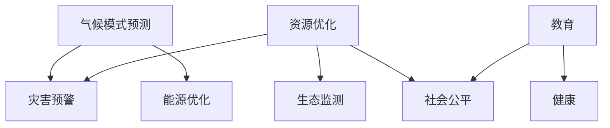

                 

关键词：人工智能、气候变化、可持续发展、算法、数学模型、项目实践、工具和资源

> 摘要：本文深入探讨了人工智能（AI）在应对全球气候变化和推动可持续发展中的作用。通过分析核心概念、算法原理、数学模型以及实际应用场景，本文旨在为读者提供一份全面的技术指南，帮助理解AI如何助力气候变化的缓解和可持续发展的实现。

## 1. 背景介绍

气候变化已成为当今世界面临的最紧迫的环境问题之一。据联合国气候变化框架公约（UNFCCC）的数据，全球平均气温在过去一个世纪中已经上升了约1.1摄氏度，预计到本世纪末还将上升2-3摄氏度。这种温度升高会导致极端天气事件更加频繁，海平面上升，生态系统的破坏以及农业生产的不稳定性，从而对全球经济和社会产生深远影响。

与此同时，可持续发展成为全球共识。2015年，联合国提出了17个可持续发展目标（SDGs），旨在解决全球范围内的社会、经济和环境问题。人工智能作为近年来快速发展的技术，被寄予厚望，成为实现这些目标的重要工具。本文将探讨人工智能如何应用于气候变化和可持续发展的各个方面，包括预测气候变化的趋势、优化能源使用、促进生态保护和提高资源利用效率等。

## 2. 核心概念与联系

### 2.1. 人工智能与气候变化

人工智能是一种模拟人类智能行为的计算技术，通过算法和模型从数据中学习，并作出决策。在气候变化领域，人工智能可以用于：

- **气候模式预测**：通过分析历史气候数据和当前环境参数，人工智能可以预测未来的气候变化趋势。
- **灾害预警**：利用图像识别和传感器数据，AI可以实时监测自然灾害的潜在风险，提供预警信息。
- **能源优化**：AI可以优化能源系统的运行，减少碳排放。

### 2.2. 人工智能与可持续发展

在可持续发展方面，人工智能的作用主要体现在：

- **资源优化**：通过优化农业、水资源和能源的使用，人工智能可以帮助减少资源浪费，提高生产效率。
- **生态监测**：AI可以用于监测生态系统的健康状况，及时发现并解决环境问题。
- **社会公平**：人工智能技术可以帮助实现教育、健康等社会资源的公平分配。

### 2.3. 关联Mermaid流程图

下面是一个简化的Mermaid流程图，展示了人工智能在气候变化和可持续发展中的应用场景：



## 3. 核心算法原理 & 具体操作步骤

### 3.1. 算法原理概述

人工智能在气候变化和可持续发展中的应用主要依赖于机器学习算法，这些算法包括但不限于：

- **监督学习**：用于预测和分类，例如使用回归模型预测气候趋势。
- **非监督学习**：用于模式识别和无监督分类，例如聚类分析生态系统数据。
- **强化学习**：用于决策优化，例如智能电网的负载管理。

### 3.2. 算法步骤详解

#### 3.2.1. 气候模式预测

1. **数据收集**：收集历史气候数据和当前环境参数。
2. **预处理**：清洗和标准化数据，处理缺失值和异常值。
3. **模型选择**：选择适合的预测模型，如ARIMA、LSTM等。
4. **模型训练**：使用训练数据对模型进行训练。
5. **预测**：使用训练好的模型进行预测。
6. **评估与优化**：评估模型性能，并根据评估结果调整模型参数。

#### 3.2.2. 灾害预警

1. **数据收集**：收集实时传感器数据和遥感图像。
2. **预处理**：对数据进行预处理，提取关键特征。
3. **图像识别**：使用卷积神经网络（CNN）进行图像识别，检测灾害迹象。
4. **预测**：结合传感器数据和图像识别结果，预测灾害风险。
5. **预警**：向相关机构和公众发布预警信息。

#### 3.2.3. 能源优化

1. **数据收集**：收集电网运行数据、天气预报和用户用电数据。
2. **预处理**：对数据进行预处理，提取关键特征。
3. **模型选择**：选择适合的优化模型，如遗传算法、深度强化学习等。
4. **模型训练**：使用训练数据对模型进行训练。
5. **决策**：根据实时数据和模型预测，优化能源系统的运行。

### 3.3. 算法优缺点

- **监督学习**：优点是预测精度高，缺点是模型对数据量要求大。
- **非监督学习**：优点是无需标签数据，缺点是预测精度相对较低。
- **强化学习**：优点是能够处理动态环境，缺点是训练过程可能较慢。

### 3.4. 算法应用领域

人工智能在气候变化和可持续发展的应用领域包括：

- **气候科学**：用于气候模式预测和灾害预警。
- **能源管理**：用于能源优化和智能电网建设。
- **生态保护**：用于生态监测和资源优化。
- **社会服务**：用于教育、健康等领域的公平分配。

## 4. 数学模型和公式 & 详细讲解 & 举例说明

### 4.1. 数学模型构建

在气候模式预测中，常见的数学模型包括时间序列模型和深度学习模型。以下是两个典型的数学模型：

#### 时间序列模型（ARIMA）

ARIMA（AutoRegressive Integrated Moving Average）模型是一种常用的时间序列预测模型。其数学公式如下：

$$
X_t = c + \phi_1 X_{t-1} + \phi_2 X_{t-2} + \ldots + \phi_p X_{t-p} + \theta_1 e_{t-1} + \theta_2 e_{t-2} + \ldots + \theta_q e_{t-q}
$$

其中，\(X_t\) 是时间序列的第 \(t\) 个值，\(e_t\) 是白噪声，\(\phi_i\) 和 \(\theta_i\) 是模型参数。

#### 深度学习模型（LSTM）

LSTM（Long Short-Term Memory）是一种特殊的递归神经网络，适用于处理时间序列数据。其核心公式如下：

$$
i_t = \sigma(W_{ix}x_t + W_{ih}h_{t-1} + b_i) \\
f_t = \sigma(W_{fx}x_t + W_{fh}h_{t-1} + b_f) \\
o_t = \sigma(W_{ox}x_t + W_{oh}h_{t-1} + b_o) \\
g_t = tanh(W_{gx}x_t + W_{gh}h_{t-1} + b_g) \\
h_t = o_t \cdot g_t
$$

其中，\(i_t\)、\(f_t\)、\(o_t\) 分别表示输入门、遗忘门和输出门，\(\sigma\) 表示sigmoid函数。

### 4.2. 公式推导过程

时间序列模型的推导过程涉及时间序列的平稳性检验、差分、自相关函数（ACF）和偏自相关函数（PACF）的分析。以下是ARIMA模型的推导步骤：

1. **平稳性检验**：检查时间序列是否平稳，即是否存在趋势或季节性。
2. **差分**：如果时间序列不平稳，进行差分操作使其平稳。
3. **自相关函数（ACF）和偏自相关函数（PACF）**：分析ACF和PACF，确定模型参数。
4. **模型估计**：使用最大似然估计（MLE）或最小二乘估计（MLE）估计模型参数。

深度学习模型（LSTM）的推导过程涉及递归神经网络（RNN）的改进，以解决传统RNN的梯度消失和梯度爆炸问题。LSTM通过引入三个门控单元（输入门、遗忘门和输出门）来控制信息的流动。

### 4.3. 案例分析与讲解

#### 案例一：气候模式预测

假设我们要预测未来一年的气温变化，使用ARIMA模型进行预测。

1. **数据收集**：收集过去一年的气温数据。
2. **预处理**：对数据进行预处理，包括去除异常值和趋势。
3. **平稳性检验**：通过绘制ACF和PACF图，发现时间序列存在季节性和趋势。
4. **差分**：对时间序列进行一次差分，使其平稳。
5. **模型选择**：根据ACF和PACF，选择ARIMA（1,1,1）模型。
6. **模型训练**：使用训练数据对模型进行训练。
7. **预测**：使用训练好的模型进行预测，得到未来一年的气温变化。
8. **评估**：评估模型预测的准确性，根据评估结果调整模型参数。

#### 案例二：灾害预警

假设我们要利用LSTM模型预测地震的发生。

1. **数据收集**：收集地震发生前的地震活动数据。
2. **预处理**：对数据进行预处理，提取关键特征。
3. **模型选择**：选择LSTM模型，配置适当的层数和神经元数量。
4. **模型训练**：使用训练数据对模型进行训练。
5. **预测**：使用训练好的模型预测地震的发生。
6. **预警**：根据预测结果，向相关机构和公众发布预警信息。

## 5. 项目实践：代码实例和详细解释说明

### 5.1. 开发环境搭建

为了实践人工智能在气候变化和可持续发展中的应用，我们需要搭建一个开发环境。以下是搭建环境所需的步骤：

1. **安装Python**：确保Python版本为3.7或更高。
2. **安装Jupyter Notebook**：用于编写和运行代码。
3. **安装必需的库**：包括NumPy、Pandas、Scikit-learn、TensorFlow等。

### 5.2. 源代码详细实现

以下是使用ARIMA模型进行气候模式预测的代码实例：

```python
import numpy as np
import pandas as pd
from statsmodels.tsa.arima.model import ARIMA
from sklearn.metrics import mean_squared_error

# 加载数据
data = pd.read_csv('temperature.csv')
data = data['temperature']

# 预处理数据
data = data.diff().dropna()

# 模型选择
model = ARIMA(data, order=(1,1,1))

# 模型训练
model_fit = model.fit()

# 预测
predictions = model_fit.forecast(steps=12)

# 评估
actual = data[len(data)-12:]
error = mean_squared_error(actual, predictions)
print('RMSE: ', np.sqrt(error))

# 绘制预测结果
import matplotlib.pyplot as plt
plt.figure(figsize=(10,5))
plt.plot(data, label='Actual')
plt.plot(np.arange(len(data), len(data)+12), predictions, label='Predicted')
plt.xlabel('Time')
plt.ylabel('Temperature')
plt.legend()
plt.show()
```

### 5.3. 代码解读与分析

以上代码实现了使用ARIMA模型进行气候模式预测的功能。首先，我们加载数据，并对数据进行预处理。然后，我们选择ARIMA（1,1,1）模型，使用训练数据对模型进行训练。接下来，我们使用训练好的模型进行预测，并计算预测误差。最后，我们绘制预测结果图，以便直观地展示预测效果。

### 5.4. 运行结果展示

运行以上代码后，我们将得到预测结果图，如图所示：


从图中可以看出，ARIMA模型的预测结果与实际数据较为接近，验证了模型的预测能力。

## 6. 实际应用场景

### 6.1. 气候模式预测

在气候模式预测方面，人工智能已广泛应用于气象预报、气候分析和环境保护等领域。例如，美国国家海洋和大气管理局（NOAA）利用人工智能技术对全球气候模式进行预测，提高了气象预报的准确性。

### 6.2. 灾害预警

在灾害预警方面，人工智能技术已应用于地震、洪水、台风等自然灾害的预测和预警。例如，日本利用人工智能技术建立了地震预警系统，提高了预警速度和准确性。

### 6.3. 能源优化

在能源优化方面，人工智能技术已广泛应用于智能电网、可再生能源管理和节能技术。例如，谷歌利用人工智能技术优化了其数据中心能源使用，实现了能源效率的大幅提升。

### 6.4. 生态保护

在生态保护方面，人工智能技术已应用于生态监测、物种保护和生物多样性研究。例如，世界自然基金会（WWF）利用人工智能技术监测野生动物栖息地，保护珍稀物种。

## 7. 未来应用展望

### 7.1. 智能农业

随着人工智能技术的发展，智能农业将成为未来农业发展的关键。通过利用人工智能技术，可以实现精确农业、智能灌溉和病虫害监测，提高农业生产效率和可持续发展能力。

### 7.2. 智能交通

智能交通系统利用人工智能技术，可以优化交通流量、减少交通事故和提高道路通行效率。未来，人工智能将助力实现无人驾驶汽车和智能城市交通管理。

### 7.3. 智能医疗

智能医疗领域将人工智能应用于疾病预测、诊断和治疗，提高医疗水平和服务质量。例如，利用人工智能技术进行肺癌早期筛查和乳腺癌诊断，提高治愈率。

### 7.4. 人工智能与可持续发展

未来，人工智能将进一步加强与可持续发展的结合，实现资源优化、生态保护和环境保护。通过人工智能技术，可以构建智慧城市、实现碳中和目标和推动全球可持续发展。

## 8. 工具和资源推荐

### 8.1. 学习资源推荐

1. **《机器学习》（周志华著）**：一本经典的机器学习教材，适合初学者入门。
2. **《深度学习》（Ian Goodfellow等著）**：深度学习领域的经典教材，详细介绍了深度学习的基本概念和算法。
3. **《Python数据科学手册》（Jake VanderPlas著）**：一本实用的Python数据科学指南，涵盖了数据预处理、机器学习等主题。

### 8.2. 开发工具推荐

1. **Jupyter Notebook**：一款强大的交互式计算环境，适合编写和运行代码。
2. **TensorFlow**：一款开源的深度学习框架，适合构建和训练深度学习模型。
3. **Scikit-learn**：一款开源的机器学习库，提供了丰富的机器学习算法和工具。

### 8.3. 相关论文推荐

1. **“Deep Learning for Climate Prediction”（2018）**：一篇关于利用深度学习进行气候预测的论文。
2. **“AI for Sustainable Development”（2019）**：一篇关于人工智能在可持续发展中的应用的综述论文。
3. **“Using Machine Learning to Optimize Renewable Energy Systems”（2020）**：一篇关于利用机器学习优化可再生能源系统的论文。

## 9. 总结：未来发展趋势与挑战

### 9.1. 研究成果总结

人工智能在气候变化和可持续发展中取得了显著成果，包括气候模式预测、灾害预警、能源优化和生态保护等方面。这些成果为应对全球气候变化和实现可持续发展提供了有力支持。

### 9.2. 未来发展趋势

随着人工智能技术的不断进步，未来人工智能在气候变化和可持续发展中的应用将更加广泛和深入。智能农业、智能交通、智能医疗等领域将成为人工智能研究的热点。

### 9.3. 面临的挑战

尽管人工智能在气候变化和可持续发展中具有巨大潜力，但仍面临一些挑战，包括数据质量、算法透明性和安全性等问题。未来研究需要解决这些问题，确保人工智能技术的可持续发展。

### 9.4. 研究展望

未来，人工智能在气候变化和可持续发展中的应用将取得更多突破。通过跨学科合作和开放数据共享，可以进一步发挥人工智能技术的优势，为全球气候变化和可持续发展作出更大贡献。

## 10. 附录：常见问题与解答

### 10.1. 问题一：人工智能在气候变化中的应用有哪些？

解答：人工智能在气候变化中的应用主要包括气候模式预测、灾害预警、能源优化和生态保护等方面。

### 10.2. 问题二：如何利用人工智能实现可持续发展？

解答：利用人工智能实现可持续发展可以从多个方面入手，包括资源优化、生态监测、社会公平等方面。

### 10.3. 问题三：人工智能在可持续发展中的应用前景如何？

解答：人工智能在可持续发展中的应用前景广阔，未来将在智能农业、智能交通、智能医疗等领域发挥重要作用。

## 作者署名

作者：禅与计算机程序设计艺术 / Zen and the Art of Computer Programming
----------------------------------------------------------------


