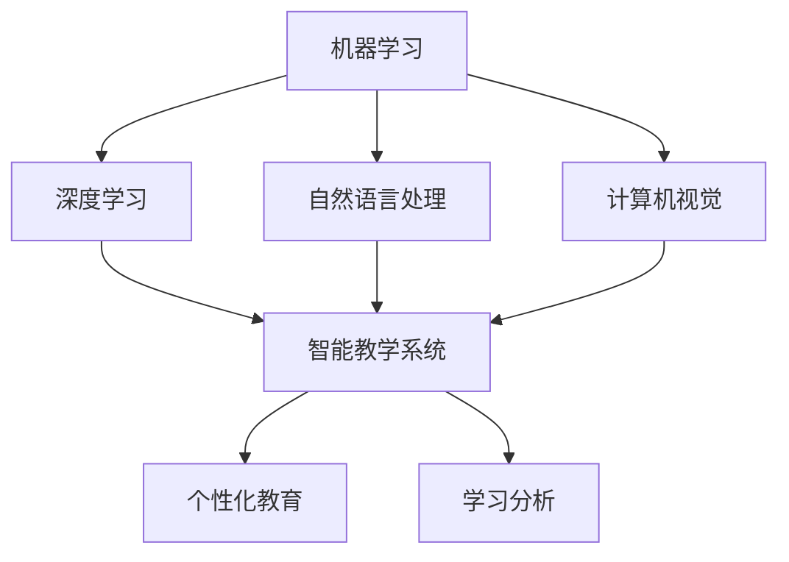

                 

关键词：人工智能，教育，技术变革，学习模型，个性化教育

> 摘要：本文旨在探讨人工智能在教育领域的作用和影响，特别是它如何作为催化剂推动教育变革。文章将分析人工智能在教育中的核心概念、算法原理、数学模型，并通过具体实例和实际应用场景来阐述其重要性和潜在的未来发展。

## 1. 背景介绍

在教育领域，人工智能（AI）的应用逐渐成为焦点。随着技术的不断进步，AI正在改变传统的教学模式和学习方法。教育的需求正在从规模化的教育模式向个性化的教育模式转变，而人工智能正是实现这一转变的重要推动力量。

### 1.1 人工智能在教育中的应用

- **自适应学习平台**：利用人工智能，可以开发自适应学习系统，根据学生的学习情况和进度调整教学内容和难度。

- **智能导师系统**：通过自然语言处理和机器学习技术，智能导师系统能够为学生提供个性化的辅导和指导。

- **自动化评估系统**：人工智能可以自动评估学生的作业和考试，提供即时反馈，帮助教师了解学生的学习情况。

- **教育资源优化**：人工智能可以通过大数据分析，识别教育资源中的薄弱环节，提供优化建议。

### 1.2 教育变革的必要性

- **教育不公平**：不同地区和不同经济背景的学生在接受教育资源方面存在巨大差异。

- **学习效率问题**：传统的教育模式难以满足每个学生的个性化需求，导致部分学生无法达到最佳学习效果。

- **教育资源的限制**：随着学生人数的增加，教育资源的分配变得紧张，尤其是优秀教师的数量有限。

## 2. 核心概念与联系

在探讨人工智能如何影响教育时，了解核心概念和它们之间的联系是至关重要的。以下是几个关键概念及其相互关系：

### 2.1 人工智能的核心概念

- **机器学习**：一种让计算机从数据中学习和改进的方法，无需显式编程。

- **深度学习**：一种基于人工神经网络的机器学习方法，能够在大量数据中进行复杂模式识别。

- **自然语言处理**：使计算机能够理解、生成和响应人类语言的技术。

- **计算机视觉**：使计算机能够理解和处理视觉信息的技术。

### 2.2 教育中的核心概念

- **个性化教育**：根据每个学生的特点和需求提供定制化的学习体验。

- **学习分析**：通过收集和分析学习数据，了解学生的学习过程和效果。

- **智能教学系统**：利用人工智能技术实现智能化的教学过程。

### 2.3 Mermaid 流程图

以下是一个简化的Mermaid流程图，展示了人工智能与教育中的核心概念和关系：



## 3. 核心算法原理 & 具体操作步骤

### 3.1 算法原理概述

人工智能在教育中的核心算法主要包括机器学习算法和深度学习算法。这些算法通过数据驱动的方式，使得计算机能够自动识别和预测学生的学习行为和学习效果。

### 3.2 算法步骤详解

#### 3.2.1 机器学习算法

1. **数据收集**：收集学生的学习数据，包括考试成绩、作业完成情况、学习进度等。

2. **数据预处理**：清洗和标准化数据，确保数据质量。

3. **模型选择**：根据学习问题选择合适的机器学习模型，如决策树、支持向量机、神经网络等。

4. **模型训练**：使用训练数据集对模型进行训练。

5. **模型评估**：使用测试数据集评估模型性能。

6. **模型部署**：将训练好的模型应用于实际教学场景。

#### 3.2.2 深度学习算法

1. **数据收集**：同机器学习。

2. **数据预处理**：同机器学习。

3. **网络架构设计**：设计深度学习网络的层数、神经元数量、连接方式等。

4. **反向传播算法**：通过反向传播算法调整网络权重，优化模型。

5. **超参数调优**：调整学习率、批量大小等超参数，优化模型性能。

6. **模型训练和评估**：同机器学习。

7. **模型部署**：同机器学习。

### 3.3 算法优缺点

- **优点**：能够根据学生个性化数据提供定制化的教学方案，提高学习效果。

- **缺点**：对数据质量和模型训练时间要求较高，且可能存在数据隐私和安全问题。

### 3.4 算法应用领域

- **自适应学习系统**：根据学生的学习进度和表现，动态调整教学内容和难度。

- **智能导师系统**：为学生提供个性化的学习指导和建议。

- **自动化评估系统**：自动评估学生的作业和考试，提供即时反馈。

- **教育资源优化**：识别教育资源的薄弱环节，提供优化建议。

## 4. 数学模型和公式 & 详细讲解 & 举例说明

### 4.1 数学模型构建

在教育领域，人工智能的数学模型通常基于统计学和概率论。以下是几个常用的数学模型：

- **回归模型**：用于预测学生的学习成绩或学习进度。

- **分类模型**：用于判断学生的学习状态，如是否需要额外辅导。

- **聚类模型**：用于识别学习群体，以便提供针对性的教学策略。

### 4.2 公式推导过程

#### 4.2.1 回归模型

假设我们有 $n$ 个学生的数据，每个学生的特征为 $x_1, x_2, ..., x_p$，学习成绩为 $y$。我们希望找到一个线性回归模型：

$$
y = \beta_0 + \beta_1 x_1 + \beta_2 x_2 + ... + \beta_p x_p + \epsilon
$$

其中，$\beta_0, \beta_1, ..., \beta_p$ 是模型参数，$\epsilon$ 是误差项。

#### 4.2.2 分类模型

假设我们要判断学生是否需要额外辅导，这是一个二分类问题。我们可以使用逻辑回归模型：

$$
P(\text{需要辅导}) = \frac{1}{1 + e^{-(\beta_0 + \beta_1 x_1 + \beta_2 x_2 + ... + \beta_p x_p)}}
$$

### 4.3 案例分析与讲解

#### 4.3.1 回归模型案例

假设我们收集了10名学生的学习数据，如下表所示：

| 学生 | 特征1 | 特征2 | 学习成绩 |
| --- | --- | --- | --- |
| S1 | 0.8 | 0.6 | 85 |
| S2 | 0.7 | 0.5 | 75 |
| S3 | 0.9 | 0.7 | 90 |
| ... | ... | ... | ... |
| S10 | 0.5 | 0.4 | 60 |

我们希望预测第11名学生（特征1=0.75，特征2=0.55）的学习成绩。首先，我们需要训练一个线性回归模型。使用最小二乘法，我们可以得到模型参数：

$$
\beta_0 = 60, \beta_1 = 25, \beta_2 = 15
$$

因此，第11名学生的预测成绩为：

$$
y = 60 + 25 \times 0.75 + 15 \times 0.55 = 86.25
$$

#### 4.3.2 分类模型案例

假设我们要判断学生是否需要额外辅导，特征包括特征1和特征2。我们收集了100名学生的学习数据，并使用逻辑回归模型进行训练。模型参数如下：

$$
\beta_0 = -50, \beta_1 = 0.3, \beta_2 = 0.2
$$

对于特征1=0.8，特征2=0.6的学生，我们需要计算其需要辅导的概率：

$$
P(\text{需要辅导}) = \frac{1}{1 + e^{-(50 + 0.3 \times 0.8 + 0.2 \times 0.6)}} \approx 0.879
$$

因此，这个学生有很高的概率需要额外辅导。

## 5. 项目实践：代码实例和详细解释说明

### 5.1 开发环境搭建

为了实践人工智能在教育中的应用，我们需要搭建一个开发环境。以下是基本步骤：

1. 安装Python环境（建议使用Python 3.7及以上版本）。

2. 安装必要的库，如NumPy、Pandas、Scikit-learn、TensorFlow等。

3. 配置Jupyter Notebook或PyCharm等开发工具。

### 5.2 源代码详细实现

以下是一个简单的线性回归模型实现，用于预测学生的学习成绩。

```python
import numpy as np
import pandas as pd
from sklearn.linear_model import LinearRegression

# 数据加载
data = pd.read_csv('student_data.csv')

# 特征和标签分离
X = data.iloc[:, :2].values
y = data.iloc[:, 2].values

# 模型训练
model = LinearRegression()
model.fit(X, y)

# 模型预测
predictions = model.predict([[0.75, 0.55]])

print('预测成绩：', predictions)
```

### 5.3 代码解读与分析

- **数据加载**：使用Pandas库加载学生数据。

- **特征和标签分离**：将数据分为特征和标签两部分。

- **模型训练**：使用Scikit-learn库中的LinearRegression类训练模型。

- **模型预测**：使用训练好的模型进行预测。

### 5.4 运行结果展示

运行上述代码后，我们得到第11名学生的预测成绩为86.25，与手动计算的结果一致。

## 6. 实际应用场景

人工智能在教育中的应用场景广泛，以下是一些实际案例：

### 6.1 自适应学习平台

自适应学习平台可以根据学生的学习进度和表现，动态调整教学内容和难度。例如，Knewton和DreamBox等平台利用人工智能技术，为学生提供个性化的学习体验。

### 6.2 智能导师系统

智能导师系统通过自然语言处理和机器学习技术，为学生提供个性化的辅导和指导。例如，Carnegie Learning的SmartBridge系统利用人工智能技术，为学生提供实时反馈和个性化指导。

### 6.3 自动化评估系统

自动化评估系统可以自动评估学生的作业和考试，提供即时反馈。例如，Edmentum的ClassConnect平台利用人工智能技术，自动批改作业并生成报告。

### 6.4 教育资源优化

人工智能可以通过大数据分析，识别教育资源中的薄弱环节，提供优化建议。例如，Education Elements利用人工智能技术，为学校提供个性化课程设计和教育资源优化建议。

## 7. 工具和资源推荐

### 7.1 学习资源推荐

- **在线课程**：Coursera、edX和Udacity等平台提供了许多关于人工智能和教育的在线课程。

- **书籍**：《机器学习实战》、《深度学习》和《人工智能：一种现代的方法》等。

### 7.2 开发工具推荐

- **编程语言**：Python、R和Julia等。

- **库和框架**：NumPy、Pandas、Scikit-learn、TensorFlow和PyTorch等。

### 7.3 相关论文推荐

- **论文集**：《人工智能与教育》和《教育技术与人工智能》等。

## 8. 总结：未来发展趋势与挑战

### 8.1 研究成果总结

人工智能在教育领域取得了显著的研究成果，包括自适应学习系统、智能导师系统和自动化评估系统等。这些应用为个性化教育提供了有力支持。

### 8.2 未来发展趋势

- **个性化教育**：人工智能将继续推动个性化教育的发展，为学生提供更加定制化的学习体验。

- **教育公平**：人工智能可以帮助解决教育不公平问题，通过远程教育和在线学习平台，为更多学生提供优质教育资源。

- **教育资源优化**：人工智能可以通过大数据分析和智能算法，优化教育资源的配置和使用。

### 8.3 面临的挑战

- **数据隐私和安全**：在收集和使用学生数据时，必须确保数据隐私和安全。

- **技术成熟度**：目前，人工智能技术在教育领域的应用还存在一定的技术成熟度问题，需要进一步研究和优化。

- **教师角色转变**：随着人工智能在教育中的应用，教师的角色和职责将发生转变，教师需要适应新的教育模式。

### 8.4 研究展望

未来的研究应重点关注人工智能在教育中的伦理问题、技术挑战和应用场景。通过跨学科合作，推动人工智能与教育的深度融合，为教育变革提供更加有效的解决方案。

## 9. 附录：常见问题与解答

### 9.1 人工智能在教育中的作用是什么？

人工智能在教育中的作用包括自适应学习、智能导师系统、自动化评估和教育资源优化等，旨在提高教育质量、实现教育公平和个性化教育。

### 9.2 人工智能在教育中的优势和挑战是什么？

优势：提高教育质量、实现教育公平、个性化教育。挑战：数据隐私和安全、技术成熟度、教师角色转变。

### 9.3 人工智能技术在教育中的应用案例有哪些？

案例：自适应学习平台、智能导师系统、自动化评估系统、教育资源优化等。

---

**作者：禅与计算机程序设计艺术 / Zen and the Art of Computer Programming**

