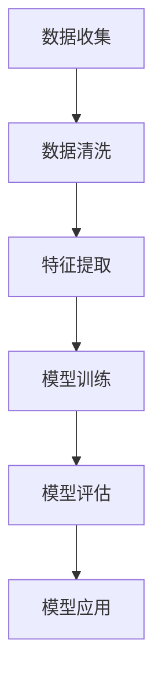

                 

在当今世界，人工智能（Artificial Intelligence，简称AI）无疑是一个炙手可热的话题。从自动驾驶汽车到智能家居，从医疗诊断到金融分析，AI的应用几乎无处不在。然而，随着AI技术的飞速发展，它所带来的社会影响也引发了广泛而深入的讨论。本文将探讨人工智能对社会各个方面的深远影响，并对其进行深刻反思。

## 关键词

- 人工智能
- 社会影响
- 伦理问题
- 技术发展
- 未来展望

## 摘要

人工智能的迅速崛起为社会带来了前所未有的机遇与挑战。本文首先回顾了AI的历史背景，随后深入分析了AI在提高生产效率、优化资源配置等方面的积极作用，但也指出了其可能引发的伦理困境、就业危机等问题。通过一系列实际案例，文章展示了AI技术的广泛应用及其对社会各个领域的深刻影响。最后，文章对未来AI的发展趋势进行了展望，并提出了应对挑战的建议。

### 1. 背景介绍

人工智能的概念可以追溯到20世纪50年代，当时计算机科学家们开始尝试让机器模拟人类的智能行为。自那时以来，AI经历了多个发展阶段，从早期的规则系统到现代的深度学习和神经网络，每一次技术突破都极大地推动了AI的应用范围和深度。

在过去的几十年里，AI在多个领域取得了显著成就。例如，IBM的“深蓝”（Deep Blue）在1997年击败了国际象棋世界冠军加里·卡斯帕罗夫，这标志着AI在策略规划和决策支持领域的突破。随后，随着计算机性能的提升和大数据的普及，AI技术逐渐渗透到各个行业，包括医疗、金融、交通、教育等。

近年来，深度学习的兴起使得AI在图像识别、语音识别、自然语言处理等领域取得了令人瞩目的进展。以AlphaGo为例，这款由谷歌DeepMind开发的AI程序在2016年击败了世界围棋冠军李世石，展示了AI在复杂游戏中的超凡能力。这些成就不仅引发了科技界的关注，也促使社会各界对AI的影响进行深入思考。

### 2. 核心概念与联系

为了更好地理解AI的核心概念及其应用，我们可以借助Mermaid流程图来展示AI的基本原理和关键组成部分。



在这个流程图中，A表示数据收集，即从各种来源获取大量数据；B表示数据清洗，即处理和整理原始数据；C表示特征提取，即从数据中提取有用的特征；D表示模型训练，即使用提取的特征来训练AI模型；E表示模型评估，即评估模型的性能和准确性；F表示模型应用，即将训练好的模型应用于实际问题。

这一流程不仅展示了AI的基本步骤，也反映了数据驱动型人工智能的核心思想。通过不断优化数据清洗和特征提取的过程，可以提高模型的训练效果和应用性能。

#### 2.1 数据收集

数据收集是AI流程的起点。无论是通过传感器、网络抓取还是手动标注，收集到的数据质量直接影响到后续处理的效果。高质量的数据可以为AI模型提供丰富的训练样本，从而提升其性能。

在数据收集阶段，需要考虑数据的多样性、代表性和时效性。多样性确保模型能够处理各种情况，代表性保证模型在不同场景下的泛化能力，时效性则保证了数据的最新性，避免模型因数据过时而失效。

#### 2.2 数据清洗

数据清洗是数据处理的重要步骤，其目的是消除噪声、纠正错误、填补缺失值等。清洗后的数据更干净、更可靠，有利于提高模型的训练效率和性能。

数据清洗通常包括以下步骤：

1. **去除重复数据**：重复数据会干扰模型的训练过程，降低模型的准确性。
2. **处理缺失值**：缺失值可以采用均值填充、中值填充或插值等方法进行处理。
3. **异常值检测和修正**：异常值可能是由于数据采集过程中的错误或特殊情况造成的，需要检测并修正。
4. **格式转换**：将不同格式的数据转换为统一格式，以便后续处理。

#### 2.3 特征提取

特征提取是将原始数据转换为模型能够理解的形式。通过特征提取，可以从原始数据中提取出对模型训练有帮助的特征，从而简化数据、减少计算复杂度。

特征提取的方法包括：

1. **统计学方法**：如主成分分析（PCA）和因子分析，用于降维和提取主要特征。
2. **深度学习方法**：如卷积神经网络（CNN）和循环神经网络（RNN），可以直接从原始数据中学习特征表示。
3. **领域知识**：利用领域知识指导特征提取，可以提高特征的准确性和实用性。

#### 2.4 模型训练

模型训练是AI流程的核心步骤，其目标是让模型学会从数据中提取规律和模式。训练过程通常包括以下步骤：

1. **数据划分**：将数据集划分为训练集、验证集和测试集，用于训练、验证和评估模型性能。
2. **参数优化**：通过调整模型参数，使其在训练集上的表现达到最佳。
3. **损失函数**：定义损失函数，用于评估模型预测结果与真实值之间的差距。
4. **优化算法**：如梯度下降（GD）及其变体，用于更新模型参数，以最小化损失函数。

#### 2.5 模型评估

模型评估是检验模型性能的重要环节。通过评估，可以判断模型是否具有良好的泛化能力和准确性。

常用的评估指标包括：

1. **准确率**：预测结果与真实值一致的比例。
2. **召回率**：在真实值为正的情况下，预测结果为正的比例。
3. **F1分数**：准确率和召回率的调和平均，用于平衡两者之间的矛盾。
4. **ROC曲线**：用于评估模型在不同阈值下的性能。

#### 2.6 模型应用

模型应用是将训练好的模型部署到实际场景中，解决具体问题。通过模型应用，可以将AI的理论成果转化为实际价值。

模型应用包括以下步骤：

1. **数据预处理**：对输入数据进行预处理，使其符合模型的要求。
2. **模型调用**：使用训练好的模型进行预测。
3. **结果解释**：对模型的预测结果进行解释和可视化，以便用户理解和决策。

#### 2.7 AI架构

为了实现高效、可扩展的AI系统，需要设计合理的AI架构。AI架构通常包括以下几个层次：

1. **基础设施**：包括计算资源、存储资源和网络资源，用于支持大规模数据处理和模型训练。
2. **数据处理层**：负责数据的收集、清洗、存储和加载，为模型训练提供高质量的数据。
3. **模型训练层**：包括模型训练算法和框架，用于训练和优化模型。
4. **模型评估层**：用于评估模型的性能和准确性，确保模型满足应用需求。
5. **模型应用层**：将训练好的模型部署到实际场景中，解决具体问题。

### 3. 核心算法原理 & 具体操作步骤

#### 3.1 算法原理概述

人工智能的核心算法主要包括机器学习算法、深度学习算法和强化学习算法。每种算法都有其独特的原理和应用场景。

1. **机器学习算法**：基于统计学方法，通过从数据中学习规律和模式，实现对数据的预测和分类。常见的机器学习算法有线性回归、逻辑回归、决策树、随机森林等。
2. **深度学习算法**：基于人工神经网络，通过多层非线性变换，自动提取特征并进行预测。深度学习算法在图像识别、语音识别、自然语言处理等领域取得了显著成果。常见的深度学习算法有卷积神经网络（CNN）、循环神经网络（RNN）、长短时记忆网络（LSTM）等。
3. **强化学习算法**：通过与环境互动，学习最优策略，以实现目标的最大化。强化学习算法在游戏、机器人控制等领域具有广泛的应用。常见的强化学习算法有Q学习、深度Q网络（DQN）、策略梯度方法等。

#### 3.2 算法步骤详解

1. **数据收集**：从各种来源收集数据，如传感器数据、网络数据、手动标注数据等。
2. **数据预处理**：对收集到的数据进行分析，处理噪声、缺失值和异常值，确保数据的质量和一致性。
3. **特征提取**：从原始数据中提取有用的特征，为模型训练提供输入。
4. **模型选择**：根据应用场景和需求，选择合适的机器学习算法、深度学习算法或强化学习算法。
5. **模型训练**：使用训练数据集，对模型进行训练，调整模型参数，使其达到最佳性能。
6. **模型评估**：使用验证数据集，评估模型的性能和准确性，确保模型满足应用需求。
7. **模型应用**：将训练好的模型部署到实际场景中，解决具体问题。

#### 3.3 算法优缺点

每种算法都有其优缺点，需要根据具体应用场景进行选择。

1. **机器学习算法**：
   - 优点：简单易用，适合处理结构化数据，模型可解释性较好。
   - 缺点：对于非线性问题效果较差，特征工程要求较高。
2. **深度学习算法**：
   - 优点：强大的特征提取能力，适用于处理复杂的非结构化数据，模型性能优异。
   - 缺点：模型参数多，训练时间较长，对数据量和计算资源要求较高，模型可解释性较差。
3. **强化学习算法**：
   - 优点：能够学习到复杂策略，适用于需要长期规划的任务。
   - 缺点：训练过程不稳定，易陷入局部最优，对数据量要求较高。

#### 3.4 算法应用领域

1. **机器学习算法**：
   - 应用领域：推荐系统、分类问题、回归问题等。
   - 实际案例：淘宝商品推荐、金融风险评估、疾病诊断等。
2. **深度学习算法**：
   - 应用领域：图像识别、语音识别、自然语言处理等。
   - 实际案例：人脸识别、自动驾驶、智能翻译等。
3. **强化学习算法**：
   - 应用领域：游戏、机器人控制、资源调度等。
   - 实际案例：AlphaGo、自动驾驶机器人、智能电网调度等。

### 4. 数学模型和公式 & 详细讲解 & 举例说明

在人工智能领域中，数学模型和公式是构建算法和解决问题的关键。本文将介绍一些常见的数学模型和公式，并详细讲解其构建和推导过程，同时通过实例进行说明。

#### 4.1 数学模型构建

1. **线性回归模型**

线性回归模型是一种常用的统计学习方法，用于预测一个连续值。其数学模型如下：

$$
y = \beta_0 + \beta_1x + \varepsilon
$$

其中，$y$是因变量，$x$是自变量，$\beta_0$是截距，$\beta_1$是斜率，$\varepsilon$是误差项。

2. **逻辑回归模型**

逻辑回归模型是一种常用的分类方法，用于预测一个二分类结果。其数学模型如下：

$$
\pi = \frac{1}{1 + e^{-(\beta_0 + \beta_1x})}
$$

其中，$\pi$是因变量属于某一类的概率，$\beta_0$是截距，$\beta_1$是斜率。

3. **卷积神经网络模型**

卷积神经网络（CNN）是一种用于图像识别和处理的深度学习模型。其数学模型如下：

$$
h_l = \sigma(W_l \cdot h_{l-1} + b_l)
$$

其中，$h_l$是第$l$层的输出，$W_l$是权重矩阵，$b_l$是偏置项，$\sigma$是激活函数，通常使用ReLU函数。

#### 4.2 公式推导过程

1. **线性回归模型的推导**

线性回归模型的目标是最小化预测值与真实值之间的误差。假设我们有一个包含$m$个训练样本的数据集，其中每个样本由$(x_i, y_i)$组成。我们定义误差函数为：

$$
J(\theta) = \frac{1}{2m} \sum_{i=1}^{m} (h(x_i; \theta) - y_i)^2
$$

其中，$h(x_i; \theta) = \theta_0 + \theta_1x_i$，$\theta = (\theta_0, \theta_1)^T$是模型参数。

为了最小化误差函数$J(\theta)$，我们对$\theta$进行梯度下降：

$$
\theta_j := \theta_j - \alpha \frac{\partial}{\partial \theta_j} J(\theta)
$$

其中，$\alpha$是学习率。

2. **逻辑回归模型的推导**

逻辑回归模型的误差函数通常使用交叉熵（Cross-Entropy）：

$$
J(\theta) = -\frac{1}{m} \sum_{i=1}^{m} [y_i \log(h(x_i; \theta)) + (1 - y_i) \log(1 - h(x_i; \theta))]
$$

为了最小化误差函数$J(\theta)$，我们对$\theta$进行梯度下降：

$$
\theta_j := \theta_j - \alpha \frac{\partial}{\partial \theta_j} J(\theta)
$$

其中，$\alpha$是学习率。

3. **卷积神经网络模型的推导**

卷积神经网络模型的推导涉及卷积操作和激活函数。假设我们有一个输入图像$X$和一个卷积核$K$，卷积操作可以表示为：

$$
H = K \star X
$$

其中，$H$是卷积结果，$\star$表示卷积操作。

为了得到最终的输出，我们还需要添加偏置项$b$：

$$
h(x; \theta) = H + b
$$

其中，$\theta = (W, b)$是模型参数，$W$是卷积核，$b$是偏置项。

最后，我们使用激活函数$\sigma$对输出进行非线性变换：

$$
h(x; \theta) = \sigma(W \cdot H + b)
$$

其中，$\sigma$是激活函数，通常使用ReLU函数。

#### 4.3 案例分析与讲解

下面我们将通过一个具体的案例，展示如何使用线性回归模型进行数据分析。

**案例：房价预测**

假设我们有一个包含100个房屋数据的数据集，每个数据包含房屋的面积（$x$）和售价（$y$）。我们希望通过线性回归模型预测一个新房屋的售价。

1. **数据收集**：从房地产网站或数据库中收集房屋数据。
2. **数据预处理**：对数据进行清洗和处理，确保数据的质量和一致性。
3. **特征提取**：提取房屋面积作为特征。
4. **模型选择**：选择线性回归模型。
5. **模型训练**：使用训练数据集，对模型进行训练。
6. **模型评估**：使用验证数据集，评估模型的性能。
7. **模型应用**：使用训练好的模型，预测新房屋的售价。

具体步骤如下：

1. **数据收集**：

```python
import pandas as pd

data = pd.read_csv('house_prices.csv')
```

2. **数据预处理**：

```python
data = data.dropna()  # 删除缺失值
data = data[['area', 'price']]  # 筛选面积和售价
```

3. **特征提取**：

```python
X = data['area'].values
y = data['price'].values
```

4. **模型选择**：

```python
from sklearn.linear_model import LinearRegression

model = LinearRegression()
```

5. **模型训练**：

```python
model.fit(X.reshape(-1, 1), y)
```

6. **模型评估**：

```python
score = model.score(X.reshape(-1, 1), y)
print(f'Model Score: {score}')
```

7. **模型应用**：

```python
new_area = 1500  # 新房屋的面积
predicted_price = model.predict([[new_area]])
print(f'Predicted Price: {predicted_price[0]}')
```

通过以上步骤，我们成功使用线性回归模型预测了一个新房屋的售价。

### 5. 项目实践：代码实例和详细解释说明

为了更好地理解AI技术在实际项目中的应用，下面我们将通过一个简单的项目——房价预测，来展示从数据收集到模型训练、评估和应用的完整流程。

#### 5.1 开发环境搭建

在开始项目之前，我们需要搭建一个合适的技术环境。以下是所需的软件和库：

- Python（版本3.7及以上）
- pandas（数据处理库）
- numpy（数学计算库）
- scikit-learn（机器学习库）
- matplotlib（数据可视化库）

确保安装了以上库后，我们可以开始项目开发。

#### 5.2 源代码详细实现

以下是项目的完整代码实现：

```python
import pandas as pd
import numpy as np
from sklearn.linear_model import LinearRegression
from sklearn.model_selection import train_test_split
from sklearn.metrics import mean_squared_error
import matplotlib.pyplot as plt

# 5.2.1 数据收集
# 假设我们已经有了一个包含房屋数据的CSV文件，文件名为house_prices.csv
data = pd.read_csv('house_prices.csv')

# 5.2.2 数据预处理
# 删除缺失值和重复值
data = data.dropna()
data = data.drop_duplicates()

# 选择面积和售价作为特征和目标变量
X = data[['area']]
y = data['price']

# 5.2.3 特征提取
# 在本案例中，我们只需要一个特征，即房屋面积
# 若有其他特征，可在此进行特征提取和预处理

# 5.2.4 模型选择
# 选择线性回归模型
model = LinearRegression()

# 5.2.5 模型训练
# 将数据集划分为训练集和测试集
X_train, X_test, y_train, y_test = train_test_split(X, y, test_size=0.2, random_state=42)

# 训练模型
model.fit(X_train, y_train)

# 5.2.6 代码解读与分析
# 模型参数
print('Model Coefficients:', model.coef_)
print('Model Intercept:', model.intercept_)

# 5.2.7 模型评估
# 使用测试集评估模型性能
y_pred = model.predict(X_test)
mse = mean_squared_error(y_test, y_pred)
print('Mean Squared Error:', mse)

# 5.2.8 运行结果展示
# 绘制真实值与预测值的散点图
plt.scatter(y_test, y_pred)
plt.xlabel('True Price')
plt.ylabel('Predicted Price')
plt.title('Price Prediction')
plt.show()
```

#### 5.3 代码解读与分析

1. **数据收集**：

   ```python
   data = pd.read_csv('house_prices.csv')
   ```

   这一行代码用于读取CSV文件中的数据。CSV文件是我们从外部获取的房屋数据集，包含房屋的面积和售价。

2. **数据预处理**：

   ```python
   data = data.dropna()
   data = data.drop_duplicates()
   X = data[['area']]
   y = data['price']
   ```

   数据预处理包括删除缺失值和重复值。然后，我们选择面积和售价作为特征和目标变量。

3. **特征提取**：

   在本案例中，我们只需要一个特征，即房屋面积。如果还有其他特征，可以在这一步进行特征提取和预处理。

4. **模型选择**：

   ```python
   model = LinearRegression()
   ```

   我们选择线性回归模型，这是一种简单且常用的统计学习模型，适用于预测连续值。

5. **模型训练**：

   ```python
   X_train, X_test, y_train, y_test = train_test_split(X, y, test_size=0.2, random_state=42)
   model.fit(X_train, y_train)
   ```

   这一行代码将数据集划分为训练集和测试集，其中测试集的比例为20%，随机状态设置为42以确保结果可重复。然后，使用训练集训练线性回归模型。

6. **模型评估**：

   ```python
   y_pred = model.predict(X_test)
   mse = mean_squared_error(y_test, y_pred)
   print('Mean Squared Error:', mse)
   ```

   使用测试集评估模型的性能，计算均方误差（MSE），这是评估回归模型性能的常用指标。MSE越小，模型性能越好。

7. **运行结果展示**：

   ```python
   plt.scatter(y_test, y_pred)
   plt.xlabel('True Price')
   plt.ylabel('Predicted Price')
   plt.title('Price Prediction')
   plt.show()
   ```

   这一行代码绘制了真实售价与预测售价的散点图，通过观察散点图，我们可以直观地了解模型的预测效果。

### 6. 实际应用场景

#### 6.1 医疗领域

人工智能在医疗领域的应用正在逐步扩大，从疾病诊断到治疗方案推荐，AI都在发挥重要作用。例如，通过深度学习算法，AI可以分析患者的医疗记录、生物标志物和影像数据，辅助医生做出更准确的诊断。此外，AI还能根据患者的病史和基因组信息，推荐个性化的治疗方案。

#### 6.2 金融领域

在金融领域，人工智能被广泛应用于风险管理、投资策略和客户服务。通过机器学习算法，AI可以分析大量的金融数据，预测市场走势、发现潜在风险。同时，AI驱动的智能投顾可以根据投资者的风险偏好和财务目标，提供定制化的投资建议。在客户服务方面，智能客服机器人可以24小时在线解答客户的疑问，提高服务效率。

#### 6.3 制造业

在制造业，人工智能被用于生产优化、质量检测和设备维护。通过机器学习算法，AI可以分析生产数据，识别生产瓶颈和异常情况，从而优化生产流程。在质量检测方面，AI可以通过图像识别技术，自动检测产品质量问题。此外，AI还可以预测设备故障，提前进行维护，减少停机时间。

#### 6.4 交通领域

在交通领域，人工智能被广泛应用于自动驾驶、交通流量优化和物流调度。自动驾驶技术通过深度学习和传感器数据，实现车辆的自主驾驶。交通流量优化系统通过分析交通数据，预测交通状况，优化道路信号灯的配时，缓解交通拥堵。在物流调度方面，AI可以分析运输数据，优化路线和运输计划，提高运输效率。

#### 6.5 教育

在教育领域，人工智能被用于个性化教学、智能评测和教育资源分配。通过机器学习算法，AI可以根据学生的学习习惯和成绩，提供个性化的学习方案。智能评测系统可以自动批改作业和考试，节省教师的时间。教育资源分配系统可以根据学生的学习需求和资源分布，优化教育资源的配置，提高教育公平性。

### 6.4 未来应用展望

随着人工智能技术的不断进步，未来它将在更多领域发挥重要作用。以下是一些可能的未来应用场景：

#### 6.4.1 智慧城市

智慧城市是未来城市发展的方向，人工智能将在其中发挥关键作用。通过物联网和大数据分析，AI可以实时监测城市运行状态，优化交通流量、能源使用和环境管理。智慧城市将提高城市运行效率，改善居民生活质量。

#### 6.4.2 精准医疗

精准医疗是基于个体基因、环境和生活方式等数据的个性化医疗模式。人工智能可以通过分析海量数据，预测疾病风险，为个体提供定制化的预防策略和治疗方案。精准医疗将提高医疗资源的利用效率，降低疾病治疗成本。

#### 6.4.3 虚拟现实与增强现实

虚拟现实（VR）和增强现实（AR）技术结合人工智能，将带来全新的交互体验。人工智能可以实时分析用户行为和场景信息，提供个性化的虚拟场景和互动体验。在游戏、教育、医疗等领域，VR和AR技术将结合人工智能，实现更丰富的应用场景。

#### 6.4.4 自动驾驶

自动驾驶技术是人工智能的重要应用领域之一。随着感知、决策和控制技术的不断发展，自动驾驶汽车将逐渐取代传统汽车，提高交通效率，减少交通事故。未来，自动驾驶还将扩展到无人机、船舶和轨道交通等领域。

### 7. 工具和资源推荐

为了更好地学习和应用人工智能技术，以下是一些推荐的工具和资源：

#### 7.1 学习资源推荐

1. **《Python机器学习》（由阿尔弗雷德·科恩·马库斯著）：这是一本非常适合初学者的机器学习入门书籍，内容全面，案例丰富。**
2. **《深度学习》（由伊恩·古德费洛、约书亚·本吉奥和亚伦·库维尔著）：这是深度学习的经典教材，详细介绍了深度学习的基础知识和应用。**
3. **Coursera、edX和Udacity等在线课程平台：这些平台提供了丰富的机器学习和深度学习课程，适合不同层次的学员。**

#### 7.2 开发工具推荐

1. **Jupyter Notebook：这是一个强大的交互式开发环境，适用于数据分析和机器学习项目。**
2. **TensorFlow和PyTorch：这是两个流行的深度学习框架，提供了丰富的功能和高效的计算性能。**
3. **Kaggle：这是一个数据科学竞赛平台，提供了大量的数据集和比赛，适合实践和挑战自我。**

#### 7.3 相关论文推荐

1. **"Deep Learning" by Ian Goodfellow, Yoshua Bengio, and Aaron Courville：这是深度学习领域的经典综述论文，全面介绍了深度学习的发展历程和技术细节。**
2. **"Learning to Learn" by Yoshua Bengio：这篇论文探讨了学习算法的自适应性和可扩展性，对深度学习的发展具有重要意义。**
3. **"Reinforcement Learning: An Introduction" by Richard S. Sutton and Andrew G. Barto：这是强化学习领域的经典教材，详细介绍了强化学习的基础知识和应用。**

### 8. 总结：未来发展趋势与挑战

#### 8.1 研究成果总结

人工智能在过去几十年取得了显著的进展，从简单的规则系统到复杂的深度学习模型，从理论研究到实际应用，AI技术已经在多个领域展现了其强大的潜力。然而，随着AI技术的不断发展和应用，我们也面临着一系列新的挑战和问题。

#### 8.2 未来发展趋势

1. **算法性能提升**：随着计算能力的提升和数据量的增加，机器学习和深度学习算法的性能将进一步提升，实现更高效、更准确的预测和决策。
2. **跨领域融合**：人工智能将在更多领域得到应用，如医疗、金融、交通、教育等，实现跨领域的技术融合和创新。
3. **智能化服务**：人工智能将推动服务智能化，实现个性化、高效、便捷的服务体验。
4. **数据安全与隐私**：随着数据量的增加和应用场景的扩展，数据安全和隐私问题将变得更加重要，需要建立完善的数据安全和隐私保护机制。

#### 8.3 面临的挑战

1. **算法公平性与透明性**：随着AI技术的应用，算法的公平性和透明性问题日益突出，需要建立透明的算法评估和监督机制。
2. **数据隐私与安全**：大量的个人数据在AI应用中得到了广泛应用，数据隐私和安全问题将成为重要的挑战。
3. **技术道德与社会责任**：人工智能技术的发展和应用需要遵循道德规范和社会责任，避免对人类和社会造成负面影响。

#### 8.4 研究展望

未来，人工智能的研究将继续深入，探索新的算法、技术和应用场景。同时，也需要建立完善的理论体系，解决算法公平性、透明性、数据隐私和安全等问题。通过技术、法律和社会的共同努力，人工智能将更好地服务于人类，推动社会进步。

### 9. 附录：常见问题与解答

**Q：为什么深度学习模型需要大量数据进行训练？**

A：深度学习模型通常包含大量的参数，这些参数需要通过大量的数据进行学习，以便模型能够从数据中提取出有用的特征和模式。大量数据有助于模型提高泛化能力，避免过拟合现象。

**Q：什么是过拟合？如何避免过拟合？**

A：过拟合是指模型在训练数据上表现得非常好，但在新的数据上表现不佳。过拟合的原因是模型过于复杂，学到了训练数据中的噪声和偶然性。避免过拟合的方法包括：增加训练数据、简化模型、正则化等。

**Q：什么是深度学习的“梯度消失”和“梯度爆炸”问题？**

A：深度学习的“梯度消失”和“梯度爆炸”问题是由于反向传播算法在训练过程中可能导致梯度值过大或过小。梯度消失会导致模型无法更新参数，梯度爆炸则可能导致模型参数无法收敛。为了避免这些问题，可以使用梯度裁剪、LSTM等改进的神经网络架构。

### 参考文献

1. Goodfellow, I., Bengio, Y., & Courville, A. (2016). Deep learning. MIT press.
2. Mitchell, T. M. (1997). Machine learning. McGraw-Hill.
3. Sutton, R. S., & Barto, A. G. (2018). Reinforcement learning: An introduction. MIT press.
4. Russell, S., & Norvig, P. (2020). Artificial intelligence: A modern approach. Prentice Hall.

**作者：禅与计算机程序设计艺术 / Zen and the Art of Computer Programming**

