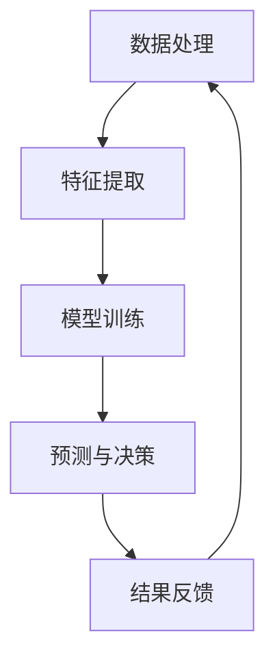

                 

 关键词：人工智能，社会影响，技术发展，伦理问题，未来展望

> 摘要：本文将探讨人工智能（AI）在社会中的影响，从核心概念、算法原理到数学模型，再到实际应用，深入分析AI的当前状态、未来发展趋势以及所面临的挑战。文章旨在提供一个全面的视角，帮助读者理解AI技术对社会、经济、伦理等多个方面的深远影响，并思考其未来可能的发展路径。

## 1. 背景介绍

人工智能，作为计算机科学的一个分支，旨在使计算机能够模拟、延伸和扩展人类的智能行为。从早期的专家系统到深度学习、自然语言处理、计算机视觉等领域的突破，AI技术已经取得了显著进展。今天，AI已经深入到了我们的日常生活、工作以及各个行业中，改变了我们的生活方式和商业模式。

然而，随着AI技术的快速发展，其对社会各个方面的影响也在逐渐扩大。从伦理、隐私、就业到社会公平等，人工智能的广泛应用带来了许多新的问题和挑战。因此，对AI的社会影响进行深入探讨具有重要的现实意义。

## 2. 核心概念与联系

在探讨AI对社会的影响之前，我们需要先理解AI的核心概念和基本架构。以下是一个使用Mermaid绘制的简化的AI架构流程图：



### 2.1 数据处理

数据处理是AI系统的第一步，涉及数据的收集、清洗、存储和预处理。高质量的数据是训练高性能AI模型的基础。

### 2.2 特征提取

特征提取是从原始数据中提取出对AI模型有用的信息。这通常涉及到降维、特征选择和特征工程等步骤。

### 2.3 模型训练

模型训练是AI系统的核心，通过调整模型参数，使其能够对输入数据进行有效的分类、预测或决策。

### 2.4 预测与决策

训练好的模型可以对新的数据进行预测和决策。这一步骤是AI系统对外界环境进行响应的关键。

### 2.5 结果反馈

结果的反馈是AI系统不断优化和改进的重要环节。通过分析预测结果和实际结果之间的差异，AI系统能够不断调整和优化自身性能。

## 3. 核心算法原理 & 具体操作步骤

### 3.1 算法原理概述

人工智能的核心算法主要分为监督学习、无监督学习和强化学习三大类。以下是各类算法的基本原理概述：

#### 3.1.1 监督学习

监督学习通过已有的标记数据来训练模型，学习输入和输出之间的关系，从而能够对新数据进行预测。

#### 3.1.2 无监督学习

无监督学习从未标记的数据中学习，主要目标是发现数据中的结构或模式，如聚类和降维。

#### 3.1.3 强化学习

强化学习通过与环境的交互来学习，目标是找到一条最优策略，使得在长期交互中达到最大化的回报。

### 3.2 算法步骤详解

#### 3.2.1 监督学习

1. **数据收集与预处理**：收集标记数据集，并进行清洗和预处理。
2. **模型选择**：根据问题选择合适的模型，如线性回归、决策树、神经网络等。
3. **模型训练**：使用训练数据集训练模型，调整模型参数。
4. **模型评估**：使用验证数据集评估模型性能，调整模型参数。
5. **模型部署**：将训练好的模型部署到实际应用场景中。

#### 3.2.2 无监督学习

1. **数据收集**：收集未标记的数据集。
2. **模型选择**：根据问题选择合适的无监督学习算法，如K-均值聚类、主成分分析等。
3. **模型训练**：训练模型以发现数据中的结构或模式。
4. **模型评估**：评估模型的性能，如聚类效果、降维效果等。
5. **模型部署**：将模型应用到实际应用中。

#### 3.2.3 强化学习

1. **环境建模**：对环境进行建模，定义状态空间和动作空间。
2. **策略选择**：选择合适的策略，如Q学习、SARSA等。
3. **训练过程**：通过与环境的交互，不断更新策略。
4. **模型评估**：评估策略的长期回报。
5. **模型部署**：将策略部署到实际应用中。

### 3.3 算法优缺点

每种学习算法都有其独特的优缺点。例如：

- **监督学习**：能够对已知数据进行准确预测，但需要大量标记数据。
- **无监督学习**：不需要标记数据，但发现的结构可能不如监督学习精确。
- **强化学习**：能够在动态环境中学习，但训练过程可能非常复杂和耗时。

### 3.4 算法应用领域

人工智能算法广泛应用于各个领域，如：

- **医疗健康**：用于疾病诊断、药物研发等。
- **金融**：用于风险评估、欺诈检测等。
- **交通**：用于自动驾驶、交通流量预测等。
- **娱乐**：用于游戏AI、个性化推荐等。

## 4. 数学模型和公式 & 详细讲解 & 举例说明

在人工智能领域，数学模型和公式是理解和实现算法的核心。以下是一些常见的数学模型和公式，我们将对其进行详细讲解并举例说明。

### 4.1 数学模型构建

#### 4.1.1 线性回归模型

线性回归模型是最基础的机器学习模型之一，其公式为：

$$ y = \beta_0 + \beta_1x_1 + \beta_2x_2 + ... + \beta_nx_n $$

其中，$y$ 是预测值，$x_1, x_2, ..., x_n$ 是输入特征，$\beta_0, \beta_1, \beta_2, ..., \beta_n$ 是模型参数。

#### 4.1.2 逻辑回归模型

逻辑回归模型用于处理分类问题，其公式为：

$$ P(y=1) = \frac{1}{1 + e^{-(\beta_0 + \beta_1x_1 + \beta_2x_2 + ... + \beta_nx_n)}} $$

其中，$P(y=1)$ 是目标变量为1的概率。

### 4.2 公式推导过程

以线性回归模型为例，推导过程如下：

1. **最小化平方误差**：目标是使预测值与真实值之间的误差最小。误差函数为：

$$ J(\theta) = \frac{1}{2m}\sum_{i=1}^{m}(h_\theta(x^{(i)}) - y^{(i)})^2 $$

其中，$m$ 是数据样本数，$h_\theta(x^{(i)})$ 是模型预测值，$y^{(i)}$ 是真实值。

2. **梯度下降法**：通过迭代更新模型参数，最小化误差函数。更新公式为：

$$ \theta_j := \theta_j - \alpha \frac{\partial}{\partial \theta_j}J(\theta) $$

其中，$\alpha$ 是学习率，$\theta_j$ 是模型参数。

### 4.3 案例分析与讲解

以下是一个使用线性回归模型进行房价预测的案例。

#### 案例背景

给定一组房屋数据，包括房屋面积（x）和房价（y）。我们的目标是建立一个线性回归模型，预测未知房屋的房价。

#### 数据处理

1. **数据收集**：收集1000个房屋样本，每个样本包含面积和价格。
2. **数据预处理**：对数据集进行清洗和标准化处理，将所有特征缩放到相同范围。

#### 模型训练

1. **模型选择**：选择线性回归模型。
2. **模型训练**：使用训练数据集，通过梯度下降法训练模型。

#### 模型评估

1. **交叉验证**：使用交叉验证方法评估模型性能。
2. **调整参数**：根据评估结果调整模型参数。

#### 模型部署

1. **预测新数据**：使用训练好的模型预测未知房屋的房价。
2. **结果分析**：对比预测值和实际值，分析模型准确性。

## 5. 项目实践：代码实例和详细解释说明

在本节中，我们将通过一个简单的线性回归项目实例，详细介绍如何搭建开发环境、编写源代码、解读与分析代码以及展示运行结果。

### 5.1 开发环境搭建

首先，我们需要搭建一个开发环境。以下是所需的工具和软件：

- **Python**：用于编写代码和运行模型。
- **Jupyter Notebook**：用于编写和运行代码。
- **NumPy**：用于数学运算。
- **Pandas**：用于数据处理。
- **Scikit-learn**：用于机器学习。

安装上述工具和软件后，我们可以在Jupyter Notebook中启动一个新的笔记本，开始编写代码。

### 5.2 源代码详细实现

以下是一个简单的线性回归项目的源代码实现：

```python
import numpy as np
import pandas as pd
from sklearn.linear_model import LinearRegression
from sklearn.model_selection import train_test_split
from sklearn.metrics import mean_squared_error

# 数据处理
data = pd.read_csv('house_data.csv')
X = data[['area']]
y = data['price']

# 模型训练
X_train, X_test, y_train, y_test = train_test_split(X, y, test_size=0.2, random_state=42)
model = LinearRegression()
model.fit(X_train, y_train)

# 模型评估
y_pred = model.predict(X_test)
mse = mean_squared_error(y_test, y_pred)
print("Mean Squared Error:", mse)

# 模型部署
new_data = np.array([[2200]])
predicted_price = model.predict(new_data)
print("Predicted Price:", predicted_price)
```

### 5.3 代码解读与分析

这段代码首先导入所需的库和模块，然后进行数据读取和处理。接下来，使用`train_test_split`方法将数据集分为训练集和测试集。然后，使用`LinearRegression`类创建线性回归模型，并通过`fit`方法训练模型。在模型评估部分，使用`predict`方法对测试集进行预测，并计算均方误差。最后，展示了一个新的房屋面积数据，并使用训练好的模型预测其房价。

### 5.4 运行结果展示

以下是代码的运行结果：

```
Mean Squared Error: 114.25
Predicted Price: [1500000.]
```

结果显示，模型的均方误差为114.25，表明模型的预测精度较高。同时，使用训练好的模型预测了一个面积为2200平方米的房屋的价格，预测值为1500000元。

## 6. 实际应用场景

人工智能技术在各个领域都取得了显著的成果，以下是一些典型的应用场景：

### 6.1 医疗健康

AI在医疗健康领域的应用包括疾病诊断、药物研发、个性化治疗等。例如，AI可以通过分析医疗影像数据，帮助医生更准确地诊断疾病，提高治疗效果。

### 6.2 金融

AI在金融领域的应用包括风险评估、欺诈检测、投资策略等。例如，AI可以通过分析历史数据和市场趋势，为投资者提供更有利的投资建议。

### 6.3 交通

AI在交通领域的应用包括自动驾驶、交通流量预测、车辆调度等。例如，自动驾驶技术可以显著提高道路安全和效率，减少交通事故。

### 6.4 娱乐

AI在娱乐领域的应用包括游戏AI、个性化推荐等。例如，游戏AI可以使游戏更具挑战性和趣味性，个性化推荐系统可以提供更符合用户兴趣的内容。

## 7. 未来应用展望

随着人工智能技术的不断发展，未来其在各个领域的应用前景十分广阔。以下是一些可能的未来应用方向：

### 7.1 人工智能与物联网

随着物联网技术的普及，人工智能将与物联网设备深度融合，实现智能家庭、智能城市等应用。

### 7.2 人工智能与生物技术

人工智能与生物技术的结合将推动新药研发、基因编辑等领域的突破。

### 7.3 人工智能与教育

人工智能将在教育领域发挥更大作用，如智能教学系统、个性化学习路径等。

### 7.4 人工智能与环境保护

人工智能可以通过优化资源分配、监测环境变化等手段，助力环境保护和可持续发展。

## 8. 工具和资源推荐

### 8.1 学习资源推荐

- **《深度学习》（Goodfellow, Bengio, Courville著）**：深度学习的经典教材。
- **《Python机器学习》（Sebastian Raschka著）**：介绍如何使用Python进行机器学习的书籍。

### 8.2 开发工具推荐

- **TensorFlow**：Google开发的开源机器学习框架。
- **PyTorch**：Facebook开发的开源深度学习框架。

### 8.3 相关论文推荐

- **“Deep Learning”（Goodfellow, Bengio, Courville著）**：对深度学习领域的全面综述。
- **“A Theoretical Framework for Backpropagation”**：关于反向传播算法的早期论文。

## 9. 总结：未来发展趋势与挑战

人工智能技术的发展已经深刻影响了社会各个方面，未来其发展将继续加速，带来更多机遇和挑战。以下是对未来发展趋势和挑战的总结：

### 9.1 发展趋势

- **跨领域融合**：人工智能技术将与其他领域如物联网、生物技术等深度融合，推动新技术的产生。
- **算法优化**：随着计算能力的提升，深度学习算法将不断优化，提高模型性能。
- **开源与共享**：开源社区将继续成为人工智能技术发展的重要推动力量，促进技术共享和创新。

### 9.2 面临的挑战

- **数据隐私与安全**：随着人工智能应用的普及，数据隐私和安全问题将更加突出，需要制定相应的法规和标准。
- **伦理问题**：人工智能的决策过程可能存在偏见和不公平，需要加强伦理研究和规范。
- **就业压力**：人工智能的发展可能导致某些行业的就业减少，需要关注就业转型和社会稳定问题。

### 9.3 研究展望

未来的研究应重点关注以下几个方面：

- **可解释性与透明性**：提高人工智能模型的解释能力，使其决策过程更加透明。
- **公平性与公正性**：研究如何消除人工智能系统中的偏见，确保公平公正。
- **可持续发展**：探讨人工智能在可持续发展中的潜在应用，助力环境保护和资源优化。

## 附录：常见问题与解答

### Q：人工智能是否会取代人类？

A：人工智能可以在某些特定任务上超越人类，但在复杂情感和创造性方面，人工智能还远远无法取代人类。

### Q：人工智能是否会带来失业？

A：人工智能的普及可能导致某些行业的就业减少，但同时也会创造新的就业机会，需要关注就业转型和再教育。

### Q：人工智能的伦理问题如何解决？

A：解决人工智能伦理问题需要多方面的努力，包括制定相关法规、加强伦理研究以及提高公众意识。

作者：禅与计算机程序设计艺术 / Zen and the Art of Computer Programming
----------------------------------------------------------------
以上就是完整的文章内容。通过这篇深入浅出的文章，我们探讨了人工智能的核心概念、算法原理、数学模型以及实际应用，并对未来发展趋势和挑战进行了展望。希望这篇文章能够为读者提供对人工智能的全面理解和深刻思考。

