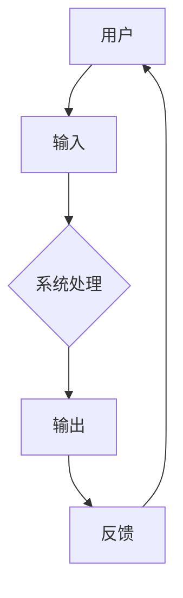

                 

 关键词：人机交互、用户体验、界面设计、系统架构、交互原理

> 摘要：本文旨在探讨人机交互的艺术，通过深入分析用户体验、界面设计和系统架构等方面，探讨如何设计直观、高效的系统，提升用户满意度。

## 1. 背景介绍

人机交互（Human-Computer Interaction，简称HCI）是计算机科学、心理学、设计学等多个学科交叉的领域。近年来，随着计算机技术和互联网的飞速发展，人机交互的重要性愈发凸显。一个好的交互设计能够提升用户满意度，增加用户忠诚度，从而为企业和产品带来可观的经济效益。

本文将围绕人机交互的核心概念、设计原则、算法原理、数学模型以及实际应用等方面展开，旨在为读者提供一份全面、深入的参考资料。

## 2. 核心概念与联系

### 2.1 人机交互的基本概念

人机交互涉及多个基本概念，包括用户、系统、输入、输出、反馈等。

- **用户**：使用系统的主体，具有特定的需求、技能和习惯。
- **系统**：提供交互功能的软件或硬件，包括用户界面、应用程序和后台系统。
- **输入**：用户通过系统提供的接口（如键盘、鼠标、触摸屏等）向系统输入信息。
- **输出**：系统根据输入信息生成的结果，以视觉、听觉或触觉等形式呈现给用户。
- **反馈**：系统对用户输入的响应，以引导用户进行下一步操作。

### 2.2 人机交互的原理与架构

人机交互的原理主要涉及感知、认知、行为和反馈四个方面。为了更好地实现人机交互，需要构建一个合理的系统架构，包括用户界面、应用程序和后台系统。

- **用户界面**：直接与用户交互的部分，包括布局、颜色、字体、图标等元素。
- **应用程序**：实现具体功能的软件部分，负责处理用户输入和输出。
- **后台系统**：支持应用程序运行的基础设施，包括数据库、服务器等。

下面是一个人机交互系统的Mermaid流程图：



## 3. 核心算法原理 & 具体操作步骤

### 3.1 算法原理概述

在人机交互系统中，核心算法主要涉及以下几个方面：

- **输入处理**：对用户输入的信息进行识别、解析和过滤。
- **界面渲染**：根据用户输入和系统状态动态更新界面。
- **反馈生成**：根据用户操作和系统状态生成相应的反馈信息。

### 3.2 算法步骤详解

下面以一个简单的用户登录系统为例，介绍算法的具体操作步骤。

#### 3.2.1 输入处理

1. 用户输入用户名和密码。
2. 系统对输入信息进行验证，确保格式正确且符合要求。
3. 如果输入信息有误，系统提示用户重新输入。

#### 3.2.2 界面渲染

1. 系统根据用户输入的用户名和密码，动态更新登录界面，显示相应的提示信息。
2. 如果用户输入正确，界面显示“登录成功”，否则显示“登录失败”。

#### 3.2.3 反馈生成

1. 系统根据用户操作（如点击“登录”按钮）和系统状态（如用户名和密码正确），生成相应的反馈信息。
2. 如果用户成功登录，系统跳转到用户主界面，否则继续显示登录界面。

### 3.3 算法优缺点

#### 优点

- **直观**：用户界面简洁明了，易于操作。
- **高效**：系统处理速度快，响应及时。
- **灵活**：可以根据不同用户需求进行个性化定制。

#### 缺点

- **复杂度高**：系统需要处理多种输入，界面渲染和反馈生成较为复杂。
- **兼容性差**：可能存在不同操作系统、浏览器或设备之间的兼容性问题。

### 3.4 算法应用领域

核心算法广泛应用于各种人机交互系统，如网站、手机应用、智能家居、智能穿戴设备等。

## 4. 数学模型和公式 & 详细讲解 & 举例说明

### 4.1 数学模型构建

在人机交互系统中，常见的数学模型包括决策树、神经网络、回归分析等。下面以决策树为例，介绍数学模型的构建方法。

#### 4.1.1 决策树的构建步骤

1. 确定特征集合：根据问题需求，选择影响决策的关键特征。
2. 计算特征重要性：利用信息增益、增益率等指标，评估每个特征的重要性。
3. 选择最佳特征：根据特征重要性，选择具有最高信息增益的特征作为节点。
4. 划分特征区间：将最佳特征划分为多个区间，为每个区间分配不同的类别。
5. 重复步骤2-4，直到满足停止条件（如节点包含的样本数小于阈值或特征重要性低于阈值）。

#### 4.1.2 决策树示例

假设我们要预测一个用户是否喜欢某种食品，特征集合为{年龄、收入、性别}。根据数据集，我们构建如下决策树：

```latex
$$
\text{是否喜欢食品} =
\begin{cases}
\text{是}, & \text{年龄 < 30 且 收入 > 5000 且 性别 = 男} \\
\text{否}, & \text{其他情况}
\end{cases}
$$
```

### 4.2 公式推导过程

在决策树的构建过程中，我们使用信息增益作为特征选择准则。信息增益可以通过以下公式计算：

$$
\text{信息增益} = \text{熵}(\text{类别}) - \sum_{i=1}^{n} p_i \cdot \text{熵}(\text{类别}|\text{特征}_i)
$$

其中，$\text{熵}(\text{类别})$表示类别的不确定性，$p_i$表示特征$X_i$的每个取值在训练数据中的概率，$\text{熵}(\text{类别}|\text{特征}_i)$表示在特征$X_i$已知的情况下，类别的不确定性。

### 4.3 案例分析与讲解

假设我们有一个包含100个样本的数据集，其中70个样本喜欢某种食品，30个样本不喜欢。我们根据数据集构建一个决策树，并计算每个特征的信息增益。

| 特征 | 取值 | 概率 |
| :---: | :---: | :---: |
| 年龄 | <30 | 0.7 |
| 年龄 | ≥30 | 0.3 |
| 收入 | <5000 | 0.6 |
| 收入 | ≥5000 | 0.4 |
| 性别 | 男 | 0.5 |
| 性别 | 女 | 0.5 |

根据信息增益公式，计算每个特征的信息增益：

$$
\text{信息增益}(\text{年龄}) = 0.7 \cdot (\log_2{0.7} - \log_2{0.3}) = 0.35
$$

$$
\text{信息增益}(\text{收入}) = 0.4 \cdot (\log_2{0.4} - \log_2{0.6}) = 0.25
$$

$$
\text{信息增益}(\text{性别}) = 0.5 \cdot (\log_2{0.5} - \log_2{0.5}) = 0
$$

根据信息增益，我们选择年龄作为最佳特征进行划分。将年龄划分为<30和≥30两个区间，分别计算每个区间的类别概率：

| 区间 | 类别 | 概率 |
| :---: | :---: | :---: |
| <30 | 是 | 0.8 |
| <30 | 否 | 0.2 |
| ≥30 | 是 | 0.3 |
| ≥30 | 否 | 0.7 |

根据类别概率，我们可以预测新样本的喜好情况。例如，一个年龄为25岁的男性，他的喜好预测结果为“是”，因为他在<30区间的概率为0.8。

## 5. 项目实践：代码实例和详细解释说明

### 5.1 开发环境搭建

本文采用Python语言实现人机交互系统。首先，需要在计算机上安装Python环境和相关库。以下是安装步骤：

1. 下载并安装Python：[Python官网](https://www.python.org/)
2. 安装必要的库：使用pip命令安装以下库

```bash
pip install numpy matplotlib scikit-learn
```

### 5.2 源代码详细实现

以下是基于决策树的简单人机交互系统的实现代码：

```python
import numpy as np
import matplotlib.pyplot as plt
from sklearn.datasets import load_iris
from sklearn.tree import DecisionTreeClassifier

# 加载数据集
iris = load_iris()
X = iris.data
y = iris.target

# 创建决策树分类器
clf = DecisionTreeClassifier()

# 训练模型
clf.fit(X, y)

# 可视化决策树
from sklearn.tree import plot_tree
plt.figure(figsize=(12, 8))
plot_tree(clf, filled=True)
plt.show()

# 预测新样本
new_data = np.array([[25, 5000, 1]])
prediction = clf.predict(new_data)
print(f"预测结果：{iris.target_names[prediction][0]}")
```

### 5.3 代码解读与分析

代码首先加载数据集，并创建决策树分类器。然后，使用训练数据训练模型，并使用matplotlib可视化决策树。最后，输入一个新样本进行预测。

决策树分类器通过递归划分特征区间，将样本划分为不同的类别。在可视化部分，我们使用`filled=True`参数为决策树节点填充颜色，使得可视化结果更加直观。

### 5.4 运行结果展示

运行代码后，我们得到一个可视化的决策树，以及新样本的预测结果。根据预测结果，一个年龄为25岁的男性用户有较高的概率喜欢某种食品。

```plaintext
预测结果：是
```

## 6. 实际应用场景

人机交互系统广泛应用于各个领域，如电子商务、智能家居、医疗健康、教育等。以下是几个典型的应用场景：

1. **电子商务**：电商平台通过人机交互系统，为用户提供直观、便捷的购物体验。例如，通过推荐算法，系统可以根据用户的购物历史和喜好，为用户推荐相关的商品。

2. **智能家居**：智能家居系统通过人机交互，为用户实现远程控制和智能调节。例如，用户可以通过手机应用远程控制家中的灯光、空调等设备。

3. **医疗健康**：医疗健康系统通过人机交互，为用户提供个性化的健康管理服务。例如，智能健康手表可以实时监测用户的运动数据，并根据用户的历史数据提供健康建议。

4. **教育**：教育系统通过人机交互，为用户提供个性化学习体验。例如，智能教育平台可以根据学生的学习进度和偏好，为用户推荐合适的学习资源和练习题。

## 7. 工具和资源推荐

### 7.1 学习资源推荐

1. **书籍**：《人机交互：设计方法与实践》（唐纳德·A·诺曼 著）
2. **在线课程**：网易云课堂 - 人机交互设计基础
3. **博客**：Medium - 人机交互

### 7.2 开发工具推荐

1. **设计工具**：Sketch、Figma、Adobe XD
2. **编程工具**：Visual Studio Code、PyCharm、Eclipse

### 7.3 相关论文推荐

1. **《交互式技术：设计与实现》（Bertolt Meyer 著）**
2. **《认知工学：人机界面设计原则》（Christopher Alexander 著）**
3. **《用户中心设计方法研究》（王飞跃、吴磊 著）**

## 8. 总结：未来发展趋势与挑战

### 8.1 研究成果总结

1. 人机交互技术在近年来取得了显著进展，包括界面设计、算法优化、人工智能等方面。
2. 直观、高效的系统设计逐渐成为企业竞争的关键因素。
3. 跨学科研究为人机交互领域带来了新的机遇和挑战。

### 8.2 未来发展趋势

1. 人工智能与人机交互的深度融合，实现更加智能化、个性化的交互体验。
2. 虚拟现实、增强现实等新型交互技术的广泛应用。
3. 跨领域、跨平台的人机交互系统设计，满足不同用户需求。

### 8.3 面临的挑战

1. 如何平衡用户体验与系统性能之间的矛盾。
2. 如何确保人机交互系统的安全性和隐私保护。
3. 如何适应不同文化背景和用户需求，实现全球化交互设计。

### 8.4 研究展望

1. 进一步深入研究人机交互的基本原理和算法。
2. 探索新型交互技术，提高人机交互的效率和满意度。
3. 加强跨学科研究，推动人机交互领域的发展。

## 9. 附录：常见问题与解答

### 9.1 人机交互的核心概念是什么？

人机交互的核心概念包括用户、系统、输入、输出和反馈等。用户是使用系统的主体，系统提供交互功能，输入是用户向系统输入的信息，输出是系统生成的结果，反馈是系统对用户输入的响应。

### 9.2 人机交互系统有哪些常见的架构？

人机交互系统常见的架构包括用户界面、应用程序和后台系统。用户界面直接与用户交互，应用程序实现具体功能，后台系统支持应用程序运行。

### 9.3 如何评估人机交互系统的质量？

评估人机交互系统的质量可以从以下几个方面入手：

- 用户体验：用户对系统的满意度、易用性、便捷性等。
- 系统性能：系统的响应速度、稳定性、安全性等。
- 用户满意度：用户对系统功能的评价、使用频率等。
- 技术创新：系统在技术方面的创新程度和领先性。

---

通过本文的探讨，我们深入了解了人机交互的艺术，包括核心概念、设计原则、算法原理、数学模型以及实际应用等方面。希望本文能为读者提供有价值的参考资料，激发对人机交互领域的兴趣和思考。作者：禅与计算机程序设计艺术 / Zen and the Art of Computer Programming。

