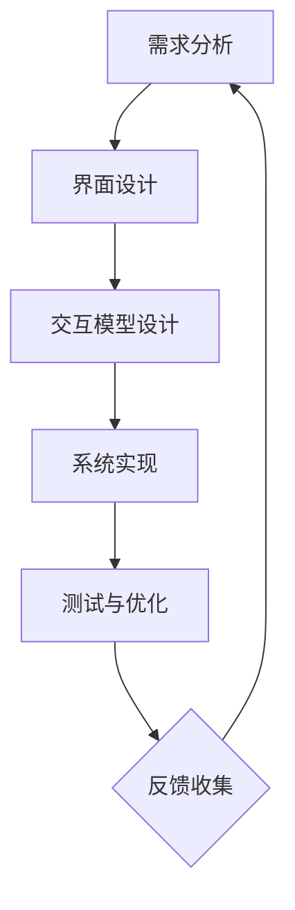

                 

关键词：人机交互，设计原则，用户体验，计算系统，交互模型，用户研究，技术趋势。

## 摘要

本文旨在探讨人机交互设计的核心原则和实际操作方法，以构建高效的人类计算系统。通过深入分析人机交互的基本理论，本文将介绍设计高效人机交互系统的关键要素，包括交互模型的构建、用户研究的重要性以及技术趋势对未来人机交互设计的潜在影响。文章将结合实际案例和具体操作步骤，帮助读者理解如何在实际项目中应用这些原则，并展望未来人机交互设计的发展方向和面临的挑战。

## 1. 背景介绍

在当今信息时代，人机交互（Human-Computer Interaction, HCI）已经成为计算机科学和技术发展的重要领域。随着智能设备的普及和互联网技术的迅猛发展，人机交互不仅局限于传统的桌面计算机和移动设备，还扩展到了智能手表、智能家居、智能汽车等新兴领域。这些技术的进步极大地改变了人们的生活方式和工作方式，同时也对人机交互设计提出了更高的要求。

高效的人机交互设计不仅仅是为了满足用户的操作需求，更重要的是要提供一种直观、自然、愉悦的用户体验。这种设计不仅要考虑技术实现的可能性，还要深入理解用户的心理和行为模式。因此，人机交互设计已经成为一种跨学科的研究领域，涉及心理学、设计学、计算机科学等多个学科的知识。

本文将从以下几个方面展开讨论：

1. **核心概念与联系**：介绍人机交互的基本概念和原理，并使用 Mermaid 流程图展示交互系统的构建过程。
2. **核心算法原理 & 具体操作步骤**：详细讲解设计高效人机交互系统的算法原理和操作步骤，分析其优缺点和应用领域。
3. **数学模型和公式 & 详细讲解 & 举例说明**：探讨人机交互中的数学模型和公式，结合实际案例进行详细讲解。
4. **项目实践：代码实例和详细解释说明**：通过具体的项目实践，展示如何将理论应用于实际开发中。
5. **实际应用场景**：讨论人机交互设计的实际应用场景，并展望未来的发展趋势。
6. **工具和资源推荐**：推荐相关学习资源和开发工具，帮助读者深入学习和实践人机交互设计。
7. **总结：未来发展趋势与挑战**：总结研究成果，探讨未来人机交互设计的发展趋势和面临的挑战。

通过本文的讨论，希望能够为从事人机交互设计和研究的读者提供一些有价值的参考和启示。

## 2. 核心概念与联系

### 2.1 人机交互的基本概念

人机交互（Human-Computer Interaction, HCI）是指人类与计算机系统之间的交互过程，它涉及人与计算机系统之间的信息交换、操作控制和反馈机制。人机交互的基本概念包括以下几个方面：

1. **用户**：用户是参与交互的人，他们通过操作计算机系统来完成特定的任务。
2. **界面**：界面是用户与计算机系统之间的交互界面，包括视觉、听觉、触觉等多种感官通道。
3. **交互模型**：交互模型描述了用户与系统之间的交互方式，包括命令式交互、事件驱动交互、对话式交互等。
4. **用户体验**：用户体验是用户在使用计算机系统的过程中所感受到的整体感受，包括易用性、效率、愉悦感等。

### 2.2 人机交互系统的构建过程

人机交互系统的构建过程可以分为以下几个阶段：

1. **需求分析**：了解用户需求，明确系统需要实现的功能和性能指标。
2. **界面设计**：设计用户界面，包括布局、颜色、字体、图标等元素，确保界面直观易用。
3. **交互模型设计**：选择合适的交互模型，设计用户与系统之间的交互流程。
4. **系统实现**：根据设计文档进行系统实现，开发用户界面和交互逻辑。
5. **测试与优化**：对系统进行测试，收集用户反馈，不断优化交互体验。

### 2.3 Mermaid 流程图展示

为了更直观地展示人机交互系统的构建过程，我们使用 Mermaid 流程图进行说明。以下是一个示例流程图：



在这个流程图中，A 表示需求分析阶段，B 表示界面设计阶段，C 表示交互模型设计阶段，D 表示系统实现阶段，E 表示测试与优化阶段，F 表示反馈收集阶段。这个流程图展示了人机交互系统构建的连续性和动态性，强调了每个阶段的相互依赖和反馈机制。

### 2.4 人机交互的设计原则

在人机交互设计中，需要遵循一些核心原则，以确保系统的易用性和用户体验：

1. **简洁性**：界面设计要简洁明了，避免冗余和复杂。
2. **一致性**：系统界面的一致性对于用户学习和使用至关重要。
3. **可见性**：系统的状态和操作结果要直观可见，用户可以快速理解系统当前的状态。
4. **可控性**：用户能够轻松控制系统的操作，感受到自己对系统的掌控。
5. **反馈**：系统要提供及时的反馈，帮助用户了解操作结果和系统的响应。
6. **适应性**：系统要能够适应不同用户的需求和偏好，提供个性化的体验。

通过遵循这些设计原则，可以构建出高效、易用的人机交互系统，提升用户的满意度和使用体验。

### 2.5 用户研究的重要性

用户研究是人机交互设计的关键环节，它帮助设计师深入了解用户的需求、行为和感受。通过用户研究，设计师可以获得以下重要信息：

1. **用户需求**：了解用户期望实现的功能和性能指标，指导系统设计。
2. **用户行为**：观察用户在使用系统时的行为模式，发现潜在的问题和改进点。
3. **用户体验**：收集用户对系统使用过程中的感受和评价，优化用户体验。

用户研究的常见方法包括问卷调查、用户访谈、用户测试和现场观察等。通过这些方法，设计师可以全面了解用户，确保系统设计符合用户的需求和期望。

### 2.6 技术趋势对未来人机交互设计的影响

随着技术的不断进步，人机交互设计也在发生深刻变革。以下是一些关键技术趋势对未来人机交互设计的影响：

1. **人工智能与机器学习**：人工智能技术可以帮助系统更好地理解用户需求和行为，提供个性化的交互体验。
2. **虚拟现实与增强现实**：虚拟现实和增强现实技术为用户提供了更加沉浸式的交互体验，拓宽了人机交互的边界。
3. **手势识别与语音控制**：手势识别和语音控制技术使得用户可以通过非传统的方式与系统进行交互，提高了交互的便利性和自然性。
4. **物联网与智能家居**：物联网技术将各种智能设备连接起来，形成一个统一的智能生态系统，用户可以通过单一界面控制多个设备。

这些技术趋势为未来人机交互设计带来了新的机遇和挑战，要求设计师不断更新知识，适应技术发展的步伐。

### 2.7 核心算法原理 & 具体操作步骤

#### 3.1 算法原理概述

在人机交互设计中，核心算法通常用于实现交互模型的逻辑和用户行为的预测与分析。以下是一个常见的人机交互算法原理概述：

- **交互模型算法**：用于定义用户与系统之间的交互逻辑，包括用户输入的处理、系统响应的生成等。
- **用户行为分析算法**：用于分析用户的操作行为，包括用户意图识别、用户偏好学习等。
- **个性化推荐算法**：根据用户行为和历史数据，为用户推荐合适的功能和内容。

#### 3.2 算法步骤详解

1. **交互模型构建**：
   - **用户输入处理**：接收用户的输入，如鼠标点击、键盘输入、手势等。
   - **系统响应生成**：根据用户输入，生成系统响应，如界面更新、提示信息等。

2. **用户行为分析**：
   - **用户意图识别**：通过分析用户输入和行为模式，识别用户的操作意图。
   - **用户偏好学习**：利用机器学习算法，从用户历史数据中学习用户偏好。

3. **个性化推荐**：
   - **数据预处理**：对用户行为数据进行清洗和转换，为推荐算法提供高质量的数据输入。
   - **推荐算法应用**：选择合适的推荐算法，如协同过滤、基于内容的推荐等，生成个性化推荐结果。

#### 3.3 算法优缺点

1. **交互模型算法**：
   - **优点**：能够灵活定义交互逻辑，提高用户体验的灵活性。
   - **缺点**：实现复杂，需要较高的技术水平。

2. **用户行为分析算法**：
   - **优点**：能够深入了解用户行为，提高系统的个性化和智能化水平。
   - **缺点**：数据隐私和安全问题，需要严格保护用户数据。

3. **个性化推荐算法**：
   - **优点**：能够为用户提供个性化的内容和服务，提高用户满意度和粘性。
   - **缺点**：推荐结果可能存在偏差，需要不断优化和调整。

#### 3.4 算法应用领域

1. **电子商务**：利用个性化推荐算法，为用户提供个性化的商品推荐，提高销售额。
2. **在线教育**：根据学生学习行为，提供个性化的学习内容和辅导，提高学习效果。
3. **智能医疗**：通过用户健康数据和行为分析，提供个性化的健康建议和医疗服务。

### 4. 数学模型和公式 & 详细讲解 & 举例说明

#### 4.1 数学模型构建

在人机交互设计中，数学模型用于描述用户行为和系统响应之间的关系。以下是一个简单的数学模型构建示例：

- **用户行为模型**：假设用户行为可以表示为 \( u(t) \)，其中 \( t \) 为时间，\( u(t) \) 表示用户在时间 \( t \) 的行为。
- **系统响应模型**：假设系统响应可以表示为 \( s(t) \)，其中 \( s(t) \) 表示系统在时间 \( t \) 的响应。

#### 4.2 公式推导过程

- **用户行为模型**：假设用户行为 \( u(t) \) 可以由以下公式描述：

  \[ u(t) = f(u(t-1), s(t-1)) \]

  其中，\( f \) 表示用户行为的转换函数，\( u(t-1) \) 表示用户在时间 \( t-1 \) 的行为，\( s(t-1) \) 表示系统在时间 \( t-1 \) 的响应。

- **系统响应模型**：假设系统响应 \( s(t) \) 可以由以下公式描述：

  \[ s(t) = g(u(t), s(t-1)) \]

  其中，\( g \) 表示系统响应的转换函数，\( u(t) \) 表示用户在时间 \( t \) 的行为，\( s(t-1) \) 表示系统在时间 \( t-1 \) 的响应。

#### 4.3 案例分析与讲解

假设一个简单的用户行为和系统响应案例：用户通过触摸屏幕滑动手指来控制屏幕上的图标移动。

1. **用户行为模型**：

   \[ u(t) = \begin{cases} 
   0 & \text{如果手指未触摸屏幕} \\
   1 & \text{如果手指触摸屏幕并滑动} \\
   \end{cases} \]

2. **系统响应模型**：

   \[ s(t) = \begin{cases} 
   \text{图标未移动} & \text{如果 } u(t) = 0 \\
   \text{图标跟随手指移动} & \text{如果 } u(t) = 1 \\
   \end{cases} \]

在这个案例中，用户行为 \( u(t) \) 和系统响应 \( s(t) \) 之间的关系非常直观。当用户手指触摸屏幕并滑动时，系统响应图标跟随手指移动；当用户手指未触摸屏幕时，系统响应图标保持静止。

### 5. 项目实践：代码实例和详细解释说明

#### 5.1 开发环境搭建

为了实践人机交互设计，我们需要搭建一个基本的开发环境。以下是一个简单的开发环境搭建步骤：

1. **安装Python环境**：Python是一个广泛用于人机交互开发的编程语言。首先，我们需要安装Python环境和相关的开发工具，如Jupyter Notebook。

2. **安装人机交互库**：为了方便进行人机交互，我们可以使用Python的`tkinter`库，这是一个适用于构建图形用户界面（GUI）的库。

3. **配置开发环境**：在安装了Python环境后，我们可以通过以下命令安装`tkinter`库：

   ```bash
   pip install tkinter
   ```

#### 5.2 源代码详细实现

以下是一个简单的人机交互程序实例，它使用`tkinter`库创建一个窗口，并在窗口上添加一个可拖动的按钮。

```python
import tkinter as tk

def on_drag_start(event):
    widget = event.widget
    widget.start_drag(event)

def on_drag_end(event):
    widget = event.widget
    widget.end_drag(event)

class DraggableButton(tk.Button):
    def __init__(self, master, text, command=None, **kwargs):
        super().__init__(master, text=text, command=command, **kwargs)
        self.bind('<Button-1>', on_drag_start)
        self.bind('<ButtonRelease-1>', on_drag_end)

if __name__ == "__main__":
    root = tk.Tk()
    root.title("Draggable Button Example")

    button = DraggableButton(root, text="Drag me!")
    button.pack()

    root.mainloop()
```

在这个实例中，我们定义了一个`DraggableButton`类，它继承自`tk.Button`。通过绑定鼠标事件，我们实现了按钮的拖动功能。

1. **初始化按钮**：在`__init__`方法中，我们初始化按钮的文本和命令，并绑定拖动事件。

2. **拖动开始事件**：在`on_drag_start`方法中，我们处理鼠标按下事件，开始拖动按钮。

3. **拖动结束事件**：在`on_drag_end`方法中，我们处理鼠标释放事件，结束拖动按钮。

4. **主程序**：在主程序中，我们创建一个窗口，并添加一个可拖动的按钮。

#### 5.3 代码解读与分析

在这个实例中，我们通过`DraggableButton`类实现了一个可拖动的按钮。以下是代码的详细解读：

- **类定义**：`DraggableButton`类继承自`tk.Button`类，扩展了按钮的功能。

- **事件绑定**：通过`bind`方法，我们绑定鼠标事件，使按钮具有拖动功能。

- **事件处理**：`on_drag_start`和`on_drag_end`方法分别处理拖动开始和结束事件，更新按钮的位置。

- **主程序**：在主程序中，我们创建窗口和按钮，并启动主循环。

#### 5.4 运行结果展示

运行上面的代码，我们将看到一个窗口，其中包含一个可拖动的按钮。当用户按下鼠标左键并拖动按钮时，按钮会跟随鼠标移动。当用户释放鼠标按钮时，拖动结束。

```bash
$ python draggable_button.py
```


### 6. 实际应用场景

人机交互设计在众多实际应用场景中发挥着关键作用，以下是一些典型应用场景及其特点：

#### 6.1 智能家居系统

智能家居系统通过人机交互设计，将用户与家居设备无缝连接，提供智能化的生活体验。例如，用户可以通过智能手机或语音助手控制家中的灯光、空调、安防设备等。智能家居系统的关键特点是：

- **个性化交互**：根据用户的生活习惯和偏好，提供个性化的交互体验。
- **跨平台支持**：支持多种设备平台，如智能手机、平板电脑、智能音箱等。
- **便捷性**：通过语音、触摸、手势等多种交互方式，提高用户操作便捷性。

#### 6.2 虚拟现实与增强现实

虚拟现实（VR）和增强现实（AR）技术为人机交互设计带来了全新的交互体验。用户通过VR头盔或AR眼镜，可以进入一个虚拟或增强的交互环境，实现沉浸式的体验。虚拟现实和增强现实的应用场景包括：

- **游戏娱乐**：提供沉浸式的游戏体验，增强游戏的趣味性和参与度。
- **教育培训**：通过虚拟现实技术，模拟实际场景，提供更加生动的教育体验。
- **远程协作**：在虚拟会议室中，实现异地团队的实时协作和交流。

#### 6.3 医疗健康

人机交互设计在医疗健康领域具有重要意义，通过智能医疗设备，医生和患者可以进行更加高效和准确的诊断和治疗。以下是一些典型应用场景：

- **远程医疗**：通过视频通话和智能医疗设备，实现远程医疗诊断和咨询。
- **智能监护**：通过智能穿戴设备和医疗传感器，实时监测患者的健康状态。
- **辅助治疗**：利用虚拟现实技术，为患者提供辅助治疗和康复训练。

#### 6.4 金融科技

金融科技（FinTech）领域的人机交互设计注重提高用户体验和操作效率。例如，通过智能投顾平台，用户可以根据自身财务状况和投资目标，获得个性化的投资建议。金融科技的应用场景包括：

- **在线银行**：提供便捷的在线交易、转账、理财等服务。
- **移动支付**：通过手机或智能手表等设备，实现快速支付和消费。
- **智能投顾**：利用大数据和人工智能技术，为用户提供个性化的投资建议。

#### 6.5 自动驾驶

自动驾驶技术是人机交互设计的前沿领域，通过智能算法和交互界面，实现人与自动驾驶车辆的协同工作。自动驾驶的应用场景包括：

- **自动驾驶汽车**：提供安全、便捷、智能的出行体验。
- **自动驾驶物流**：提高物流效率，降低运营成本。
- **自动驾驶无人机**：在农业、救援、快递等领域发挥重要作用。

### 6.5 未来应用展望

随着技术的不断进步，人机交互设计在未来的应用场景将更加广泛和深入。以下是一些未来应用展望：

- **脑机接口**：通过脑机接口技术，实现人类大脑与计算机系统的高效连接，为残疾人和健康人提供全新的交互方式。
- **智能代理**：智能代理将能够理解用户的需求和偏好，主动为用户提供服务和帮助，实现更加智能化的用户体验。
- **多模态交互**：结合多种交互方式，如语音、手势、触摸等，提供更加自然和丰富的交互体验。
- **自适应交互**：系统能够根据用户的行为和反馈，自动调整交互方式，提高用户体验和系统性能。

未来的人机交互设计将更加注重用户需求的理解和满足，实现更加智能、便捷、个性化的交互体验。

### 7. 工具和资源推荐

在人机交互设计领域，有许多优秀的工具和资源可供学习和实践。以下是一些建议：

#### 7.1 学习资源推荐

1. **《人机交互设计原理与实践》**：这本书详细介绍了人机交互设计的基本原理和实践方法，适合初学者和专业人士。
2. **《交互设计精髓》**：这是一本经典的交互设计教材，涵盖了交互设计的核心原则和实践技巧。
3. **《用户体验要素》**：作者设计思维大师Jared Spool分享了用户体验设计的核心要素和实际应用技巧。

#### 7.2 开发工具推荐

1. **Sketch**：一款流行的界面设计工具，支持矢量绘图和原型设计，适合设计师使用。
2. **Figma**：一款在线界面设计工具，支持多人协作和实时预览，方便设计师和开发人员协作。
3. **Adobe XD**：一款功能强大的界面设计工具，提供丰富的交互设计和原型设计功能。

#### 7.3 相关论文推荐

1. **"The Design of Sites: Patterns, Principles, and Processes for Crafting Digital Experiences"**：这篇文章详细探讨了网站设计的核心原则和方法。
2. **"Designing for Interaction"**：这篇文章讨论了人机交互设计的基本原则和实际应用。
3. **"The Design of Everyday Things"**：这篇文章详细分析了人机交互设计中的常见问题，并提出了改进方法。

通过这些工具和资源的推荐，可以帮助读者深入学习和实践人机交互设计。

### 8. 总结：未来发展趋势与挑战

#### 8.1 研究成果总结

在人机交互设计领域，近年来取得了显著的研究成果。通过人工智能、机器学习等技术的应用，交互系统逐渐实现了智能化和个性化。同时，虚拟现实、增强现实等新兴技术的融入，为人机交互提供了更加丰富和沉浸的体验。这些研究成果为未来人机交互设计奠定了坚实基础。

#### 8.2 未来发展趋势

未来人机交互设计将呈现以下几个发展趋势：

1. **智能化与个性化**：随着人工智能技术的发展，人机交互系统将更加智能，能够更好地理解用户需求和偏好，提供个性化的交互体验。
2. **多模态交互**：结合语音、手势、触摸等多种交互方式，实现更加自然和丰富的交互体验。
3. **脑机接口**：通过脑机接口技术，实现人类大脑与计算机系统的高效连接，为残疾人和健康人提供全新的交互方式。
4. **自适应交互**：交互系统能够根据用户的行为和反馈，自动调整交互方式，提高用户体验和系统性能。

#### 8.3 面临的挑战

尽管人机交互设计取得了显著进展，但仍面临一些挑战：

1. **数据隐私与安全**：随着用户数据量的增加，如何保护用户隐私和数据安全成为关键挑战。
2. **跨平台一致性**：实现不同平台和设备之间的交互一致性，提高用户体验。
3. **技术成熟度**：一些前沿技术如脑机接口等尚未成熟，需要进一步研究和开发。
4. **伦理与法律问题**：人机交互设计涉及到伦理和法律问题，如用户隐私、数据所有权等，需要制定相应的法律法规。

#### 8.4 研究展望

未来人机交互设计的研究应关注以下几个方面：

1. **用户研究**：深入理解用户需求和行为，为交互设计提供有力支持。
2. **技术创新**：推动前沿技术的应用和发展，如脑机接口、多模态交互等。
3. **跨学科融合**：整合心理学、设计学、计算机科学等学科的知识，实现交互设计的全面发展。
4. **标准化与规范化**：制定统一的标准和规范，提高人机交互设计的质量和可维护性。

通过持续的研究和实践，人机交互设计将不断进步，为人们提供更加智能、便捷、愉悦的交互体验。

### 9. 附录：常见问题与解答

#### 9.1 什么是人机交互？

人机交互（Human-Computer Interaction，简称HCI）是指人类与计算机系统之间的交互过程。它涉及用户与计算机之间的信息交换、操作控制和反馈机制，旨在提供直观、自然、愉悦的用户体验。

#### 9.2 人机交互设计的关键原则有哪些？

人机交互设计的关键原则包括简洁性、一致性、可见性、可控性和反馈。这些原则有助于确保系统设计的易用性和用户体验。

#### 9.3 如何进行用户研究？

用户研究是了解用户需求和行为的重要手段。常见的方法包括问卷调查、用户访谈、用户测试和现场观察。通过这些方法，设计师可以深入了解用户，为交互设计提供有力支持。

#### 9.4 什么是交互模型？

交互模型是描述用户与系统之间交互方式的框架。常见的交互模型包括命令式交互、事件驱动交互和对话式交互。交互模型有助于设计师构建高效的人机交互系统。

#### 9.5 人工智能如何影响人机交互设计？

人工智能（AI）为人机交互设计带来了智能化和个性化。通过AI技术，交互系统能够更好地理解用户需求、预测用户行为，并提供个性化的交互体验。

#### 9.6 如何选择合适的人机交互设计工具？

选择合适的人机交互设计工具需考虑项目需求和设计目标。常见的工具包括Sketch、Figma和Adobe XD，它们分别适用于不同类型的交互设计项目。

### 结束语

作者：禅与计算机程序设计艺术 / Zen and the Art of Computer Programming

在人机交互设计领域，我们见证了技术的飞速发展和用户需求的不断变化。通过本文的探讨，我们深入分析了人机交互设计的核心原则和实际操作方法，展示了如何构建高效的人类计算系统。在未来，随着人工智能、虚拟现实等技术的不断进步，人机交互设计将面临更多挑战和机遇。我们期待人机交互设计能够继续创新和发展，为用户提供更加智能、便捷、愉悦的交互体验。谢谢大家的阅读。

