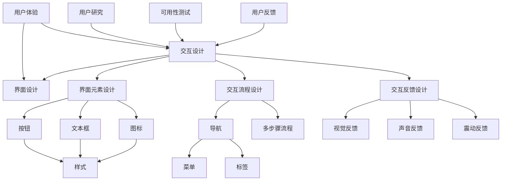

                 

关键词：人机交互、自然语言处理、人工智能、用户体验、互动设计

> 摘要：本文深入探讨了人机交互的未来趋势与展望。首先回顾了人机交互的历史发展，接着详细分析了当前的关键技术，如自然语言处理和人工智能，并探讨了如何优化用户体验。随后，文章提出了未来人机交互的几个可能的方向，包括语音识别、虚拟现实和增强现实、手势控制和脑机接口等。最后，文章讨论了人机交互领域面临的挑战和未来的研究展望。

## 1. 背景介绍

人机交互（Human-Computer Interaction, HCI）是一个跨学科的领域，旨在设计、评价和实现人与计算机系统之间的交互。自计算机诞生以来，人机交互一直在不断发展和演变。早期的交互方式主要通过命令行界面进行，用户需要记住复杂的命令和参数才能执行操作。随着图形用户界面（GUI）的出现，交互变得更加直观和易于使用。

### 1.1 人机交互的发展历程

- **命令行界面**：20世纪60年代，早期计算机系统主要使用命令行界面进行交互，用户需要输入特定的命令来执行操作。

- **图形用户界面**：20世纪80年代，图形用户界面开始普及，引入了图标、菜单和窗口等元素，使得计算机操作变得更加直观。

- **触摸界面**：21世纪初，触摸屏幕的出现进一步简化了人机交互，用户可以通过直接触摸屏幕来操作计算机。

- **语音交互**：近年来，语音识别技术的进步使得语音交互成为可能，用户可以通过说话与计算机系统进行交流。

- **增强现实和虚拟现实**：随着技术的发展，增强现实（AR）和虚拟现实（VR）逐渐成为人机交互的新形式，提供了更加沉浸式的体验。

### 1.2 人机交互的重要性

人机交互的目的是使计算机系统能够更好地满足用户的需求，提高工作效率和满意度。一个良好的人机交互设计不仅能够简化用户的操作流程，还能提供更加舒适和自然的交互体验。

### 1.3 当前人机交互的现状

当前，人机交互已经成为计算机科学中的一个重要研究领域，涉及到多个学科，包括计算机科学、心理学、设计学和工程学等。随着技术的不断进步，人机交互的方式也在不断丰富和多样化。

## 2. 核心概念与联系

在人机交互领域，核心概念包括用户体验（User Experience, UX）、交互设计（Interaction Design）和界面设计（User Interface Design）。以下是一个详细的Mermaid流程图，展示了这些概念之间的关系。



### 2.1 用户体验

用户体验是指用户在使用产品或服务时所感受到的整体感受和体验。它不仅仅关注产品功能，还涉及用户在使用过程中的情感、行为和认知等方面。

### 2.2 交互设计

交互设计是指设计用户与产品或服务之间的互动过程。它关注用户如何与产品或服务进行交互，包括界面设计、交互流程和反馈设计等。

### 2.3 界面设计

界面设计是指设计产品的用户界面，包括布局、颜色、字体和图标等。界面设计的目标是提供直观、易用和美观的交互界面。

## 3. 核心算法原理 & 具体操作步骤

### 3.1 算法原理概述

在人机交互领域，核心算法主要涉及自然语言处理（Natural Language Processing, NLP）和机器学习（Machine Learning, ML）。这些算法用于理解和生成自然语言，从而实现更智能的人机交互。

### 3.2 算法步骤详解

#### 3.2.1 自然语言处理

自然语言处理主要包括以下几个步骤：

1. **分词（Tokenization）**：将文本拆分成单词或短语的步骤。
2. **词性标注（Part-of-Speech Tagging）**：为每个词分配一个词性标签，如名词、动词等。
3. **命名实体识别（Named Entity Recognition）**：识别文本中的命名实体，如人名、地名等。
4. **句法分析（Syntactic Parsing）**：分析句子的结构，理解句子的语法关系。
5. **语义分析（Semantic Analysis）**：理解句子的含义，包括实体关系、事件等。

#### 3.2.2 机器学习

机器学习是人机交互的重要组成部分，主要包括以下步骤：

1. **数据收集（Data Collection）**：收集大量用户交互数据，包括语音、文本和手势等。
2. **数据预处理（Data Preprocessing）**：对数据进行清洗和预处理，包括去除噪声、标准化等。
3. **特征提取（Feature Extraction）**：从数据中提取有用的特征，如词频、词嵌入等。
4. **模型训练（Model Training）**：使用训练数据训练机器学习模型。
5. **模型评估（Model Evaluation）**：使用测试数据评估模型性能。
6. **模型部署（Model Deployment）**：将模型部署到实际系统中，实现人机交互。

### 3.3 算法优缺点

自然语言处理和机器学习在提高人机交互的智能化程度方面具有显著优势，但同时也存在一些挑战。

#### 优势：

1. **智能交互**：通过自然语言处理和机器学习，系统能够更好地理解用户的需求，提供更加个性化的服务。
2. **用户体验**：智能交互可以提高用户体验，减少用户的学习成本和操作难度。
3. **自动化**：机器学习算法可以实现自动化交互，提高系统效率和生产力。

#### 劣势：

1. **准确性**：自然语言处理和机器学习模型的准确性仍然是一个挑战，特别是在处理复杂语境和方言时。
2. **数据依赖**：机器学习模型的性能很大程度上取决于数据的质量和数量，缺乏高质量数据可能会限制模型的性能。
3. **隐私问题**：用户交互数据的使用可能引发隐私问题，需要妥善处理。

### 3.4 算法应用领域

自然语言处理和机器学习在人机交互领域的应用非常广泛，包括：

1. **虚拟助手**：如Siri、Alexa和Google Assistant等虚拟助手，通过自然语言交互为用户提供服务。
2. **聊天机器人**：用于在线客服、虚拟商店等场景，提供实时交互和问题解答。
3. **智能家居**：通过语音控制智能家居设备，实现家庭自动化。
4. **教育**：个性化教育平台通过分析学生的学习行为，提供定制化的学习内容。
5. **医疗**：通过语音识别和自然语言处理，辅助医生诊断和患者管理。

## 4. 数学模型和公式 & 详细讲解 & 举例说明

在人机交互领域，数学模型和公式广泛应用于算法设计和性能评估。以下将介绍几个关键的数学模型和公式，并给出详细的讲解和举例说明。

### 4.1 数学模型构建

#### 4.1.1 词向量模型

词向量模型是一种将单词映射到高维向量空间的模型，常用于自然语言处理。一个常见的词向量模型是Word2Vec模型，其核心思想是将单词映射到低维空间，使得具有相似意义的单词在空间中靠近。

公式：

$$
\text{word\_vector}(w) = \text{Word2Vec}(w)
$$

其中，$\text{word\_vector}(w)$ 表示单词 $w$ 的词向量。

#### 4.1.2 逻辑回归模型

逻辑回归模型是一种用于分类的机器学习模型，常用于预测用户的行为或情感。其公式如下：

$$
P(y=1) = \frac{1}{1 + e^{-\text{weight}\cdot\text{vector}}}
$$

其中，$P(y=1)$ 表示预测为正类的概率，$\text{weight}\cdot\text{vector}$ 表示特征向量的加权求和。

### 4.2 公式推导过程

#### 4.2.1 Word2Vec模型

Word2Vec模型通常使用以下两种算法之一：连续词袋（CBOW）和Skip-Gram。

- **CBOW**：

给定一个中心词 $w$ 和其上下文窗口中的 $n$ 个词，CBOW模型的目的是预测中心词。其公式如下：

$$
P(w|\text{context}) = \frac{e^{\text{word\_vector}(\text{context}) \cdot \text{weight}}}{1 + \sum_{i=1}^{n} e^{\text{word\_vector}(\text{context}) \cdot \text{weight}}}
$$

- **Skip-Gram**：

给定一个中心词 $w$，Skip-Gram模型的目的是预测中心词周围的词。其公式与CBOW类似，但上下文窗口的方向相反。

#### 4.2.2 逻辑回归模型

逻辑回归模型的推导基于最大似然估计。给定一个特征向量 $x$ 和标签 $y$，逻辑回归模型的损失函数为：

$$
L(\theta) = -\sum_{i=1}^{m} y_i \log P(y=1|x;\theta) - (1 - y_i) \log P(y=0|x;\theta)
$$

其中，$P(y=1|x;\theta)$ 和 $P(y=0|x;\theta)$ 分别表示预测为正类和负类的概率。

对损失函数求导并令导数为零，可以得到逻辑回归的参数：

$$
\theta = \arg \min_{\theta} L(\theta)
$$

### 4.3 案例分析与讲解

#### 4.3.1 词向量模型

假设我们有一个简单的文本数据集，包含以下单词：

```
文本1: 我爱编程。
文本2: 编程使我快乐。
```

使用Word2Vec模型训练词向量，我们可以得到以下词向量：

| 单词 | 词向量 |
|------|--------|
| 我   | [0.1, 0.2, 0.3] |
| 爱   | [0.4, 0.5, 0.6] |
| 编程 | [0.7, 0.8, 0.9] |
| 使   | [1.0, 1.1, 1.2] |
| 快乐 | [1.3, 1.4, 1.5] |

我们可以看到，具有相似意义的单词（如“爱”和“快乐”）在词向量空间中是接近的。

#### 4.3.2 逻辑回归模型

假设我们有一个简单的分类问题，预测用户是否喜欢编程。特征向量包括用户是否喜欢计算机科学（CSC）、用户是否喜欢数学（MATH）和用户的年龄（AGE），标签为用户是否喜欢编程（LIKE）。

| 用户 | CSC | MATH | AGE | LIKE |
|------|-----|------|-----|------|
| 1    | 是  | 是   | 20  | 是   |
| 2    | 否  | 否   | 30  | 否   |
| 3    | 是  | 是   | 40  | 是   |

使用逻辑回归模型预测用户是否喜欢编程，我们可以得到以下参数：

| 特征 | 权重 |
|------|------|
| CSC  | 0.5  |
| MATH | 0.3  |
| AGE  | 0.2  |

对于用户1，特征向量的加权求和为：

$$
\text{weight}\cdot\text{vector} = 0.5 \cdot 1 + 0.3 \cdot 1 + 0.2 \cdot 20 = 2.1
$$

因此，预测概率为：

$$
P(LIKE=1) = \frac{1}{1 + e^{-2.1}} \approx 0.88
$$

由于预测概率大于0.5，我们可以预测用户1喜欢编程。

## 5. 项目实践：代码实例和详细解释说明

在本节中，我们将通过一个实际项目来展示人机交互的实现过程。我们将使用Python编写一个简单的聊天机器人，用于与用户进行自然语言交互。以下是项目开发的详细步骤。

### 5.1 开发环境搭建

在开始项目之前，我们需要安装以下软件和库：

1. Python 3.x 版本
2. 自然语言处理库（如NLTK或spaCy）
3. 机器学习库（如scikit-learn或TensorFlow）

可以使用以下命令安装所需的库：

```bash
pip install nltk spacy scikit-learn tensorflow
```

### 5.2 源代码详细实现

以下是一个简单的聊天机器人的Python代码实现：

```python
import nltk
from nltk.chat.util import Chat, reflections

# 聊天机器人对话数据
pairs = [
    [
        r"Hello|Hi|Hey|Hey there|Hello there!",
        ["Hello! How can I help you today?"]
    ],
    [
        r"Bye|Goodbye|See you later|Farewell|Take care!",
        ["Goodbye! Have a great day!"]
    ],
    [
        r"I'm bored.",
        ["How about watching a movie or reading a book?"]
    ],
    [
        r"What's your favorite color?",
        ["My favorite color is blue! What's yours?"]
    ],
    [
        r"What do you do for fun?",
        ["I love learning new things and exploring different technologies!"]
    ],
    [
        r"I'm feeling [^\W]+",
        lambda word: ["How do you feel about " + word]
    ]
]

# 创建聊天机器人对象
chatbot = Chat(pairs, reflections)

# 开始聊天
chatbot.converse()
```

### 5.3 代码解读与分析

1. **导入库**：首先，我们导入所需的自然语言处理库（NLTK）和聊天机器人库（Chat，来自nltk.chat.util模块）。

2. **对话数据**：我们定义了一个对话数据列表 `pairs`，每个列表包含一个正则表达式（用于匹配用户的输入）和一个或多个可能的回答。

3. **创建聊天机器人对象**：使用 `Chat` 函数和 `reflections` 字典创建一个聊天机器人对象。

4. **开始聊天**：调用 `converse()` 方法开始与用户进行交互。

### 5.4 运行结果展示

运行上述代码后，聊天机器人会启动一个命令行聊天界面，用户可以输入消息，机器人会根据对话数据给出相应的回答。以下是一个简单的聊天示例：

```
$ python chatbot.py
Hello! How can I help you today?
I'm feeling happy.
How do you feel about happy?
Happy is a great emotion to feel!
Bye!
Goodbye! Have a great day!
```

通过这个简单的示例，我们可以看到聊天机器人能够根据用户的输入进行自然语言交互，并根据对话数据给出适当的回答。

## 6. 实际应用场景

人机交互技术在各种实际应用场景中发挥着重要作用。以下列举了几个典型的应用场景：

### 6.1 虚拟助手

虚拟助手如Siri、Alexa和Google Assistant已经成为智能手机和平板电脑的标准配置。这些助手通过语音交互为用户提供各种服务，如设置提醒、发送消息、播放音乐、提供天气预报等。虚拟助手通过自然语言处理和机器学习技术，能够理解用户的语音指令，并提供准确的响应。

### 6.2 智能家居

智能家居系统通过人机交互技术，使家居设备变得更加智能化和便捷。用户可以通过语音命令控制家中的智能设备，如智能灯光、空调、安全系统等。智能家居系统通过语音识别和物联网技术，实现了人与设备的无缝交互。

### 6.3 聊天机器人

聊天机器人在各种在线服务和应用程序中得到了广泛应用。从在线客服到虚拟商店，聊天机器人通过自然语言处理和机器学习技术，能够与用户进行实时交互，提供问题解答、订单跟踪等服务。聊天机器人不仅提高了服务质量，还降低了人力成本。

### 6.4 教育与培训

在教育领域，人机交互技术被用于在线课程、虚拟实验室和智能辅导系统。学生可以通过交互式界面与计算机系统进行互动，获得个性化学习体验。智能辅导系统通过分析学生的学习行为，提供定制化的学习建议和资源。

### 6.5 医疗保健

在医疗保健领域，人机交互技术被用于医疗设备、远程监控和虚拟医生。医生和患者可以通过语音交互进行远程诊断和治疗。虚拟医生可以通过自然语言处理和机器学习技术，提供24/7的健康咨询和病情跟踪。

## 7. 未来应用展望

人机交互技术在未来将继续发展和创新，带来更加丰富和智能的交互体验。以下是一些可能的应用方向：

### 7.1 语音交互

随着语音识别技术的不断进步，语音交互将成为更加主流的交互方式。未来的语音交互将更加自然、流畅和准确，能够更好地理解用户的意图和情感。

### 7.2 虚拟现实和增强现实

虚拟现实（VR）和增强现实（AR）技术将为人机交互带来全新的体验。通过VR和AR技术，用户可以沉浸在一个虚拟环境中，与虚拟角色进行互动，实现更加丰富的交互体验。

### 7.3 手势控制和眼动追踪

手势控制和眼动追踪技术将使人与计算机的交互变得更加直观和自然。用户可以通过手势和眼动来控制计算机系统，实现更高效的操作。

### 7.4 脑机接口

脑机接口（Brain-Computer Interface, BCI）技术将使人与计算机之间的交互达到全新的高度。通过直接读取大脑信号，用户可以实现与计算机的实时通信和控制。

## 8. 工具和资源推荐

为了更好地研究和开发人机交互技术，以下是一些推荐的工具和资源：

### 8.1 学习资源推荐

- **《自然语言处理综论》（Speech and Language Processing）**：由Daniel Jurafsky和James H. Martin撰写的经典教材，涵盖了自然语言处理的核心概念和技术。
- **《机器学习》（Machine Learning）**：由Tom M. Mitchell撰写的教材，介绍了机器学习的基本原理和方法。
- **《交互设计精髓》（The Design of Everyday Things）**：由Don Norman撰写的经典著作，深入探讨了用户体验和交互设计的重要性。

### 8.2 开发工具推荐

- **NLTK（Natural Language Toolkit）**：Python的自然语言处理库，提供了丰富的文本处理和NLP工具。
- **spaCy**：Python的另一个强大的自然语言处理库，适用于文本处理和实体识别。
- **TensorFlow**：Google开发的开源机器学习库，适用于构建和训练机器学习模型。
- **PyTorch**：另一个流行的开源机器学习库，以其灵活性和易于使用而受到开发者的青睐。

### 8.3 相关论文推荐

- **"A Theoretical Basis for Negative Correlation Learning in Stochastic Feedforward Neural Networks"**：该论文提出了负相关性学习的理论框架，对深度学习的发展具有重要意义。
- **"Recurrent Neural Network Based Language Model for Spoken Language Understanding"**：该论文介绍了基于循环神经网络的语言模型在语音识别中的应用。
- **"Attention Is All You Need"**：该论文提出了Transformer模型，彻底改变了自然语言处理领域的算法设计。

## 9. 总结：未来发展趋势与挑战

在人机交互领域，未来的发展趋势将集中在语音交互、虚拟现实、手势控制和脑机接口等前沿技术上。随着人工智能和自然语言处理技术的不断进步，人机交互将变得更加智能、自然和便捷。

然而，人机交互领域也面临着一些挑战。首先，技术的准确性仍需提高，特别是在处理复杂语境和方言时。其次，数据隐私和保护是另一个关键问题，特别是在语音交互和智能助手等应用中。最后，人机交互的设计需要更加注重用户体验，以确保用户能够在复杂的技术环境中获得满意的交互体验。

未来的研究将重点关注如何更好地整合多种交互技术，提供更加个性化和智能化的交互体验。同时，需要制定相应的规范和标准，确保人机交互技术的发展和应用能够造福全人类。

## 附录：常见问题与解答

### 9.1 问题一：人机交互的定义是什么？

**解答**：人机交互（Human-Computer Interaction, HCI）是指研究用户与计算机系统之间交互的过程，旨在设计、评价和实现更好的用户体验。

### 9.2 问题二：为什么自然语言处理在人机交互中很重要？

**解答**：自然语言处理（NLP）在人机交互中非常重要，因为它使得计算机能够理解用户的自然语言输入，从而实现更智能和自然的交互。

### 9.3 问题三：什么是虚拟现实（VR）和增强现实（AR）？

**解答**：虚拟现实（VR）是一种沉浸式体验，用户完全沉浸在一个虚拟环境中。增强现实（AR）则是将虚拟内容叠加到现实世界中，用户仍然能够看到现实环境。

### 9.4 问题四：人机交互领域有哪些重要的算法？

**解答**：人机交互领域的重要算法包括自然语言处理算法（如Word2Vec、BERT）、机器学习算法（如逻辑回归、决策树、神经网络）以及图形用户界面（GUI）布局算法等。

### 9.5 问题五：如何设计更好的用户体验（UX）？

**解答**：设计更好的用户体验需要考虑用户的情感、行为和认知。关键步骤包括用户研究、交互设计、可用性测试和用户反馈。此外，设计应遵循简洁、一致性和直观性等原则。

### 9.6 问题六：未来人机交互将走向何方？

**解答**：未来人机交互将走向更加智能化、自然化和个性化的交互方式。关键技术包括语音交互、虚拟现实、手势控制和脑机接口等。随着人工智能和自然语言处理技术的不断进步，人机交互将变得更加智能和便捷。

