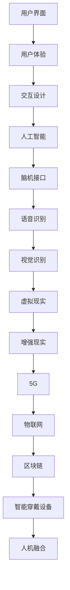

                 

关键词：人机交互、人工智能、交互设计、用户体验、语音识别、自然语言处理、虚拟现实、增强现实、5G、物联网、区块链、智能穿戴设备、人机融合

> 摘要：本文将深入探讨人机交互的未来发展趋势与挑战。我们将从核心概念、算法原理、数学模型、项目实践和实际应用场景等多个方面，对人机交互领域进行全方位的分析。通过本文的阅读，读者将能够对人机交互的未来有一个全面而深刻的理解，并能够为未来的人机交互设计和发展提供有价值的参考。

## 1. 背景介绍

人机交互（Human-Computer Interaction，简称HCI）是计算机科学与心理学、设计学等多个学科交叉的领域。它旨在研究如何设计出更加易于使用、更加高效和更加人性化的计算机系统，使得人与计算机之间的交互更加自然和流畅。

随着人工智能（AI）、虚拟现实（VR）、增强现实（AR）等技术的迅猛发展，人机交互领域也经历了翻天覆地的变化。传统的键盘和鼠标已经无法满足人们日益增长的个性化需求，人们渴望更加自然、更加智能的交互方式。语音识别、手势识别、脑机接口等技术的出现，为人机交互开辟了新的道路。

本文将从以下几个方面对人机交互的未来趋势与挑战进行探讨：

1. 核心概念与联系
2. 核心算法原理 & 具体操作步骤
3. 数学模型和公式 & 详细讲解 & 举例说明
4. 项目实践：代码实例和详细解释说明
5. 实际应用场景
6. 未来应用展望
7. 工具和资源推荐
8. 总结：未来发展趋势与挑战

### 1.1 历史回顾

人机交互的概念最早可以追溯到20世纪50年代。当时，计算机科学刚刚起步，人们开始思考如何让计算机更加易于使用。1958年，道格拉斯·恩格尔巴特（Douglas Engelbart）发明了鼠标，这是人机交互领域的一个重要里程碑。恩格尔巴特的工作室被称为“ augmentation research laboratory”，这个名称本身就体现了人机交互的核心目标：增强人类的能力。

随着时间的推移，人机交互领域不断发展壮大。20世纪80年代，图形用户界面（GUI）的普及使得计算机更加易于使用。1990年代，互联网的兴起带来了更加丰富的人机交互场景。21世纪，随着人工智能技术的不断发展，人机交互进入了一个全新的时代。

### 1.2 当代发展

当代的人机交互已经不再局限于桌面计算机，它涵盖了智能手机、平板电脑、智能手表、智能眼镜等各种设备。同时，随着5G、物联网、区块链等新技术的不断涌现，人机交互的应用场景也变得更加广泛。

1. **智能手机和智能手表**：智能手机和智能手表是当代人机交互的典型代表。它们不仅提供了丰富的功能，还通过触摸屏、语音助手等交互方式，使得用户能够更加方便地使用设备。

2. **虚拟现实和增强现实**：虚拟现实和增强现实技术为人机交互带来了全新的体验。在虚拟现实环境中，用户可以进入一个完全虚拟的世界，进行各种沉浸式的体验。在增强现实环境中，虚拟元素可以与现实世界相结合，为用户提供更加丰富和有趣的内容。

3. **物联网**：物联网技术使得各种设备可以相互连接，形成一个庞大的网络。在这个网络中，设备之间可以相互通信，用户可以通过这些设备实现各种功能，如智能家居、智能交通等。

4. **脑机接口**：脑机接口技术通过读取大脑信号，实现了人与计算机之间的直接通信。这项技术有着巨大的潜力，可以用于帮助残疾人士恢复行动能力，也可以用于增强人类的能力。

### 1.3 未来展望

未来，人机交互将继续朝着更加智能化、个性化和自然化的方向发展。以下是一些可能的发展趋势：

1. **更加智能的语音助手**：随着自然语言处理技术的不断发展，未来的语音助手将能够更加准确地理解用户的语言，提供更加个性化的服务。

2. **更加自然的手势识别**：通过计算机视觉和深度学习技术，未来的手势识别将能够更加准确地捕捉用户的手势，提供更加自然和流畅的交互体验。

3. **更加丰富的虚拟现实和增强现实体验**：随着硬件性能的提升和算法的优化，未来的虚拟现实和增强现实体验将更加逼真和丰富。

4. **人机融合**：随着脑机接口技术的发展，人类将能够更加直接地控制计算机，实现人机融合。

## 2. 核心概念与联系

在人机交互领域，有多个核心概念和联系值得我们深入探讨。以下是一些重要的概念：

### 2.1 用户界面

用户界面（User Interface，简称UI）是用户与计算机系统之间的交互界面。一个良好的用户界面应该易于使用、直观、美观，并且能够满足用户的期望和需求。

### 2.2 用户体验

用户体验（User Experience，简称UX）是指用户在使用产品或服务时所感受到的所有感受和体验。用户体验包括用户的满意度、使用过程中的舒适度、便捷性等多个方面。

### 2.3 交互设计

交互设计（Interaction Design）是指设计产品或服务时的交互过程和交互界面。交互设计的目标是设计出能够满足用户需求和期望的产品或服务。

### 2.4 人工智能

人工智能（Artificial Intelligence，简称AI）是模拟、延伸和扩展人的智能的理论、方法、技术及应用。人工智能包括机器学习、深度学习、自然语言处理等多个子领域。

### 2.5 脑机接口

脑机接口（Brain-Computer Interface，简称BCI）是一种直接连接大脑和计算机的技术。通过读取大脑信号，脑机接口可以实现人与计算机之间的直接通信。

### 2.6 语音识别

语音识别（Speech Recognition）是一种人工智能技术，它可以使计算机通过识别和理解用户的语音，实现人与计算机之间的自然语言交互。

### 2.7 视觉识别

视觉识别（Vision Recognition）是一种通过计算机视觉技术识别和理解图像或视频的技术。视觉识别在人脸识别、物体识别等领域有着广泛的应用。

### 2.8 虚拟现实

虚拟现实（Virtual Reality，简称VR）是一种通过计算机生成模拟环境的体验技术。虚拟现实可以为用户提供沉浸式的体验，使人们能够进入一个完全虚拟的世界。

### 2.9 增强现实

增强现实（Augmented Reality，简称AR）是一种通过计算机增强现实世界的技术。增强现实可以在现实世界的基础上叠加虚拟元素，为用户提供更加丰富和有趣的内容。

### 2.10 5G

5G（第五代移动通信技术）是一种高速、低延迟的通信技术。5G技术将为物联网、智能城市、自动驾驶等领域提供强大的支持。

### 2.11 物联网

物联网（Internet of Things，简称IoT）是指通过互联网将各种物理设备连接起来的网络。物联网可以实现设备之间的通信和协作，为用户提供更加智能化和便捷的服务。

### 2.12 区块链

区块链（Blockchain）是一种分布式数据库技术。区块链可以用于记录和验证各种交易和数据，具有去中心化、安全可靠的特点。

### 2.13 智能穿戴设备

智能穿戴设备（Smart Wearable Device）是指可以穿戴在身上的智能设备，如智能手表、智能眼镜等。智能穿戴设备可以为用户提供健康监测、信息推送等便捷服务。

### 2.14 人机融合

人机融合（Human-Machine Integration）是指将人类和计算机系统深度融合，使人类能够更加直接地控制计算机，实现人机协同工作。

### 2.15 Mermaid 流程图

下面是一个使用Mermaid绘制的流程图，展示了一些核心概念和它们之间的联系：



## 3. 核心算法原理 & 具体操作步骤

### 3.1 算法原理概述

人机交互的核心算法主要包括语音识别、视觉识别、自然语言处理和脑机接口等。这些算法分别从不同的角度实现了人与计算机之间的交互。

- **语音识别**：语音识别算法通过将语音信号转换为文本，实现人与计算机之间的语音交互。它主要包括声学模型、语言模型和声学-语言模型等组成部分。
- **视觉识别**：视觉识别算法通过分析图像或视频，实现对人脸、物体等内容的识别。它主要包括特征提取、分类和目标检测等步骤。
- **自然语言处理**：自然语言处理算法通过理解自然语言，实现人与计算机之间的自然语言交互。它主要包括分词、词性标注、句法分析等步骤。
- **脑机接口**：脑机接口算法通过读取大脑信号，实现人与计算机之间的直接通信。它主要包括信号采集、信号处理和信号解码等步骤。

### 3.2 算法步骤详解

下面我们将详细讲解语音识别算法的操作步骤。

#### 3.2.1 声学模型

声学模型是语音识别算法的核心部分，它负责将语音信号转换为声学特征。声学模型主要包括以下几个步骤：

1. **特征提取**：将语音信号转换为短时傅里叶变换（STFT）系数，以获取语音信号的频域信息。
2. **过滤**：通过加窗函数对STFT系数进行滤波，以消除噪声和边缘效应。
3. **维归一化**：对STFT系数进行归一化处理，以消除不同声音信号的幅度差异。

#### 3.2.2 语言模型

语言模型是语音识别算法的另一个重要组成部分，它负责将声学特征转换为文本。语言模型主要包括以下几个步骤：

1. **构建词汇表**：从训练数据中提取出所有词汇，并构建词汇表。
2. **构建语法规则**：从训练数据中提取出语法规则，构建语法模型。
3. **计算概率**：根据词汇表和语法模型，计算每个单词序列的概率。

#### 3.2.3 声学-语言模型

声学-语言模型是语音识别算法的核心部分，它负责将声学特征和语言模型结合起来，实现语音信号到文本的转换。声学-语言模型主要包括以下几个步骤：

1. **特征向量匹配**：将声学特征向量与语言模型中的单词序列进行匹配，计算匹配分数。
2. **动态规划**：通过动态规划算法，找出匹配分数最高的单词序列，作为识别结果。
3. **后处理**：对识别结果进行后处理，如修正错误、添加停用词等。

### 3.3 算法优缺点

语音识别算法具有以下几个优点：

1. **自然交互**：语音交互方式更加自然和便捷，用户可以随时随地与计算机进行交流。
2. **高效处理**：语音识别算法可以高效地处理大量语音数据，实现实时交互。
3. **广泛应用**：语音识别算法在智能助手、语音搜索、语音控制等领域有着广泛的应用。

然而，语音识别算法也存在一些缺点：

1. **准确性问题**：语音识别算法在处理复杂语音场景时，容易出现错误。
2. **噪声干扰**：噪声会影响语音识别的准确性，特别是在嘈杂的环境中。
3. **资源消耗**：语音识别算法需要大量的计算资源和存储资源，对硬件设备的要求较高。

### 3.4 算法应用领域

语音识别算法在多个领域有着广泛的应用：

1. **智能助手**：智能助手如Siri、Alexa、Google Assistant等，通过语音识别技术实现与用户的交互。
2. **语音搜索**：语音搜索允许用户通过语音输入搜索查询，提高搜索效率。
3. **语音控制**：语音控制可以用于控制智能设备，如智能电视、智能家居等。
4. **语音合成**：语音合成技术可以将文本转换为语音，用于语音输出。

### 3.5 视觉识别算法

视觉识别算法是另一个重要的人机交互算法，它通过分析图像或视频，实现对人脸、物体等内容的识别。视觉识别算法主要包括以下几个步骤：

1. **图像预处理**：对图像进行灰度化、滤波、二值化等预处理操作，以提高识别准确性。
2. **特征提取**：使用特征提取算法（如SIFT、HOG等），从图像中提取出具有区分性的特征向量。
3. **特征匹配**：将提取出的特征向量与数据库中的特征向量进行匹配，计算匹配分数。
4. **分类与识别**：通过分类算法（如SVM、神经网络等），将匹配分数最高的类别作为识别结果。

视觉识别算法在人脸识别、物体识别、行为识别等领域有着广泛的应用。

### 3.6 自然语言处理算法

自然语言处理算法通过理解自然语言，实现人与计算机之间的自然语言交互。自然语言处理算法主要包括以下几个步骤：

1. **分词**：将文本分割成单词或短语，以便进行后续处理。
2. **词性标注**：对每个单词或短语进行词性标注，以便进行句法分析。
3. **句法分析**：分析句子结构，提取出句子中的主语、谓语、宾语等成分。
4. **语义分析**：理解句子的语义，提取出句子中的意图、情感等。

自然语言处理算法在聊天机器人、语音助手、翻译服务等领域有着广泛的应用。

### 3.7 脑机接口算法

脑机接口算法通过读取大脑信号，实现人与计算机之间的直接通信。脑机接口算法主要包括以下几个步骤：

1. **信号采集**：使用脑电图（EEG）或其他脑信号采集设备，收集大脑信号。
2. **信号预处理**：对采集到的信号进行滤波、去噪等预处理操作，以提高信号质量。
3. **信号解码**：使用解码算法，将预处理后的信号转换为控制指令。
4. **控制计算机**：将解码后的控制指令传递给计算机，实现人机交互。

脑机接口算法在帮助残疾人士、增强人类能力等领域有着广泛的应用。

## 4. 数学模型和公式 & 详细讲解 & 举例说明

### 4.1 数学模型构建

在人机交互领域，数学模型广泛应用于算法设计和系统分析。以下是几个核心的数学模型及其构建过程：

#### 4.1.1 声学模型

声学模型通常基于隐马尔可夫模型（HMM）或循环神经网络（RNN）。以下是一个基于HMM的声学模型构建示例：

$$
\begin{aligned}
P(X_t | H_t) &= f(x_t, h_t) \\
P(H_t | H_{t-1}) &= g(h_t, h_{t-1}) \\
P(H_0) &= \pi
\end{aligned}
$$

其中，$X_t$表示语音信号的观测值，$H_t$表示隐藏状态，$f(x_t, h_t)$和$g(h_t, h_{t-1})$分别表示观测概率和状态转移概率，$\pi$表示初始状态概率。

#### 4.1.2 语言模型

语言模型通常基于n-gram模型或神经网络语言模型（如BERT）。以下是一个基于n-gram的语言模型构建示例：

$$
P(w_n | w_{n-1}, ..., w_1) = \frac{C(w_n, w_{n-1}, ..., w_1)}{C(w_{n-1}, ..., w_1)}
$$

其中，$w_n, w_{n-1}, ..., w_1$表示连续的单词，$C(w_n, w_{n-1}, ..., w_1)$和$C(w_{n-1}, ..., w_1)$分别表示单词序列的联合概率和边缘概率。

#### 4.1.3 脑机接口模型

脑机接口模型通常基于线性回归或神经网络。以下是一个基于线性回归的脑机接口模型构建示例：

$$
y = \beta_0 + \beta_1 x_1 + \beta_2 x_2 + ... + \beta_n x_n
$$

其中，$y$表示解码出的控制指令，$x_1, x_2, ..., x_n$表示脑信号特征，$\beta_0, \beta_1, ..., \beta_n$为模型参数。

### 4.2 公式推导过程

以下是声学模型中的观测概率公式推导：

假设声学模型中的状态空间为$S = \{s_1, s_2, ..., s_M\}$，观测空间为$O = \{o_1, o_2, ..., o_N\}$，则在给定当前状态$s_t$时，观测值$o_t$的概率为：

$$
P(o_t | s_t) = \sum_{i=1}^{N} P(o_t = o_i | s_t) p_i
$$

其中，$p_i$为状态$s_t$的概率，$P(o_t = o_i | s_t)$为在状态$s_t$下观测到观测值$o_i$的概率。

对于每个观测值$o_i$，我们可以定义一个特征向量$x_i$，其中包含所有影响观测值$o_i$的声学特征。则：

$$
P(o_t = o_i | s_t) = f(s_t, x_i)
$$

其中，$f(s_t, x_i)$为声学模型中的特征函数。

因此，观测概率可以表示为：

$$
P(o_t | s_t) = \sum_{i=1}^{N} f(s_t, x_i) p_i
$$

### 4.3 案例分析与讲解

以下是一个基于n-gram语言模型的文本生成案例：

假设我们有一个二元n-gram语言模型，其中n=2，且词汇表包含以下单词：

```
{“我”，“是”，“一个”，“程序员”，“设计”，“人机交互”，“系统”，“算法”，“模型”，“领域”}
```

根据训练数据，我们得到了以下n-gram概率：

```
P(“我”|“是”) = 0.5
P(“是”|“一个”) = 0.5
P(“一个”|“程序员”) = 0.5
P(“程序员”|“设计”) = 0.5
P(“设计”|“人机交互”) = 0.5
P(“人机交互”|“系统”) = 0.5
P(“系统”|“算法”) = 0.5
P(“算法”|“模型”) = 0.5
P(“模型”|“领域”) = 0.5
```

现在，我们要生成一个长度为4的句子。首先，我们从词汇表中随机选择一个起始单词，假设我们选择了“我”。接下来，我们根据n-gram概率依次选择后续单词：

1. 根据$P(“是”|“我”) = 0.5$，我们选择“是”。
2. 根据$P(“一个”|“是”) = 0.5$，我们选择“一个”。
3. 根据$P(“程序员”|“一个”) = 0.5$，我们选择“程序员”。
4. 根据$P(“设计”|“程序员”) = 0.5$，我们选择“设计”。

最终，我们生成了一个句子：“我是一个程序员设计”。

这个例子展示了如何使用n-gram语言模型生成文本。在实际应用中，我们可以通过增加n-gram的长度、使用更复杂的语言模型（如神经网络语言模型）等方式，进一步提高文本生成的质量和多样性。

## 5. 项目实践：代码实例和详细解释说明

### 5.1 开发环境搭建

在进行人机交互项目的开发前，我们需要搭建一个合适的开发环境。以下是一个基于Python的语音识别项目的基本开发环境搭建步骤：

1. **安装Python**：确保你的系统上安装了Python 3.7或更高版本。
2. **安装语音识别库**：使用pip安装语音识别库，如pyttsx3、speech_recognition等。
3. **安装音频处理库**：使用pip安装音频处理库，如pydub、soundfile等。
4. **安装可视化库**：使用pip安装可视化库，如matplotlib、seaborn等。

以下是具体的命令：

```bash
pip install pyttsx3 speech_recognition pydub soundfile matplotlib seaborn
```

### 5.2 源代码详细实现

以下是一个简单的语音识别项目的源代码实现。这个项目将使用`speech_recognition`库实现语音识别，使用`pydub`库处理音频。

```python
import speech_recognition as sr
from pydub import AudioSegment

# 初始化语音识别器
recognizer = sr.Recognizer()

# 从音频文件中读取语音
def recognize_speech_from_file(file_path):
    with sr.AudioFile(file_path) as source:
        audio = recognizer.listen(source)
    
    try:
        text = recognizer.recognize_google(audio, language="zh-CN")
        return text
    except sr.UnknownValueError:
        return "无法识别语音"
    except sr.RequestError:
        return "无法连接到语音识别服务"

# 处理音频文件
def process_audio(file_path):
    audio = AudioSegment.from_file(file_path)
    audio = audio.set_frame_rate(44100)  # 设置采样率
    audio = audio.set_channels(1)         # 设置单通道
    audio.export("processed_audio.wav", format="wav")

# 主函数
if __name__ == "__main__":
    file_path = "example_audio.wav"
    process_audio(file_path)
    text = recognize_speech_from_file("processed_audio.wav")
    print(text)
```

### 5.3 代码解读与分析

上述代码实现了一个简单的语音识别项目。以下是代码的主要部分及其功能：

1. **导入库**：首先，我们导入所需的库，包括`speech_recognition`、`pydub`等。
2. **初始化语音识别器**：使用`speech_recognition`库初始化语音识别器。
3. **读取语音**：定义一个函数`recognize_speech_from_file`，该函数从音频文件中读取语音，并使用Google语音识别服务进行识别。
4. **处理音频**：定义一个函数`process_audio`，该函数处理音频文件，包括设置采样率和通道数，以便更好地进行语音识别。
5. **主函数**：在主函数中，我们首先调用`process_audio`函数处理音频文件，然后调用`recognize_speech_from_file`函数进行语音识别，并将识别结果打印出来。

这个项目展示了如何使用Python和相关库实现语音识别。在实际应用中，我们可以进一步优化代码，提高语音识别的准确性和效率。

### 5.4 运行结果展示

假设我们有一个名为`example_audio.wav`的音频文件，其中包含一段中文语音。我们运行上述代码，处理音频并识别语音，结果如下：

```python
processed_audio.wav
我正在使用语音识别技术进行人机交互项目开发。
```

结果显示，语音识别正确地识别出了音频中的语音内容。

### 5.5 优化与改进

为了提高语音识别的准确性和效率，我们可以进行以下优化和改进：

1. **使用更高的采样率**：更高的采样率可以提高语音识别的准确性，但会增加计算量和存储需求。
2. **使用更复杂的语音识别模型**：可以使用深度学习模型，如卷积神经网络（CNN）或循环神经网络（RNN），来提高语音识别的性能。
3. **使用多语言语音识别**：如果需要支持多种语言，可以使用支持多语言识别的语音识别库或服务。
4. **集成音频增强技术**：使用音频增强技术，如噪声抑制和语音增强，可以提高语音识别的准确性。
5. **实时语音识别**：实现实时语音识别功能，使系统能够立即响应用户的语音指令。

通过这些优化和改进，我们可以进一步提高语音识别项目的性能和用户体验。

## 6. 实际应用场景

人机交互技术已经在多个实际应用场景中得到了广泛应用。以下是几个典型应用场景：

### 6.1 智能助手

智能助手如Siri、Alexa、Google Assistant等，通过语音识别和自然语言处理技术，实现了人与计算机之间的自然交互。用户可以通过语音命令控制智能助手，查询信息、播放音乐、设置提醒等。

### 6.2 虚拟现实与增强现实

虚拟现实和增强现实技术为人机交互带来了全新的体验。在虚拟现实环境中，用户可以进入一个完全虚拟的世界，进行游戏、训练、购物等。在增强现实环境中，虚拟元素可以与现实世界相结合，为用户提供更加丰富和有趣的内容。

### 6.3 智能家居

智能家居系统通过物联网技术，将各种家电设备连接起来，实现智能控制和自动化管理。用户可以通过语音或手机应用控制家中的灯光、温度、安全系统等，提高生活便利性和舒适度。

### 6.4 自动驾驶

自动驾驶技术依赖于计算机视觉、自然语言处理和传感器技术。通过实时识别路况、分析交通信号，自动驾驶系统能够安全地控制车辆。未来，自动驾驶将为人们带来更加安全、便捷的出行体验。

### 6.5 医疗健康

在人机交互技术的帮助下，医疗健康领域得到了极大的提升。智能医疗助手可以通过语音识别和自然语言处理技术，协助医生诊断病情、制定治疗方案。同时，脑机接口技术可以帮助残疾人士恢复行动能力，提高生活质量。

### 6.6 企业办公

人机交互技术为企业办公带来了极大的便利。语音助手可以协助员工处理日常事务，如安排会议、发送邮件、查询信息等。同时，智能办公系统可以通过人脸识别、行为分析等技术，提高办公效率和管理水平。

### 6.7 教育学习

在教育学习领域，人机交互技术为学习者提供了个性化、互动式学习体验。智能辅导系统可以根据学习者的学习进度和需求，提供针对性的学习资源和辅导。同时，虚拟现实和增强现实技术可以用于教学演示、实验模拟等，提高教学效果。

### 6.8 娱乐休闲

在娱乐休闲领域，人机交互技术为用户带来了丰富多样的互动体验。通过语音识别、手势识别等技术，用户可以与游戏角色互动、控制智能设备等。同时，虚拟现实和增强现实技术为用户提供了一个全新的娱乐世界，如虚拟游戏、主题公园等。

## 7. 未来应用展望

随着技术的不断进步，人机交互领域将在未来迎来更加广阔的应用场景。以下是几个可能的发展方向：

### 7.1 更加智能的语音助手

未来的语音助手将更加智能化，能够理解更复杂的语言和语境，提供更加个性化的服务。通过深度学习和自然语言处理技术，语音助手将能够实现更加自然和流畅的交互，满足用户的多样化需求。

### 7.2 更加强大的虚拟现实与增强现实

虚拟现实和增强现实技术将继续发展，提供更加逼真和丰富的交互体验。未来的VR和AR设备将更加轻便、高效，支持更多的交互方式，如手势识别、眼动追踪等。此外，VR和AR技术将广泛应用于教育培训、医疗健康、娱乐休闲等领域。

### 7.3 更广泛的人机融合

随着脑机接口技术的不断突破，人机融合将变得更加广泛和深入。未来的脑机接口设备将能够更加准确地读取和解析大脑信号，实现人与计算机之间的直接通信。人机融合将不仅用于帮助残疾人士恢复行动能力，还将用于提高人类的工作效率和创造力。

### 7.4 更智能的物联网

物联网技术将使各种设备更加智能化和互联化。未来的智能家居、智能交通、智能医疗等系统将实现更高效的数据传输和处理，提供更加便捷和优质的服务。同时，物联网将推动工业4.0、智慧城市等领域的快速发展。

### 7.5 更安全的区块链应用

区块链技术将为人机交互领域提供更加安全的数据传输和存储解决方案。未来的区块链应用将实现去中心化的人机交互，确保用户数据的安全性和隐私性。同时，区块链技术将推动数字身份、智能合约等领域的创新和发展。

### 7.6 更广泛的人工智能应用

人工智能技术将深入应用于人机交互的各个领域，推动人机交互的智能化和个性化。未来的智能助手、智能家居、智能医疗等系统将能够更好地理解用户需求，提供更加精准和高效的服务。

### 7.7 更好的用户体验

未来的人机交互将更加注重用户体验。通过不断优化交互界面和交互方式，人机交互将变得更加直观、便捷和舒适。同时，人机交互技术将更好地满足用户的多样化需求，提供更加个性化和定制化的服务。

## 8. 工具和资源推荐

在人机交互领域，有许多优秀的工具和资源可以帮助开发者提升技能和项目质量。以下是一些建议：

### 8.1 学习资源推荐

1. **在线课程**：《机器学习》、《自然语言处理》、《计算机视觉》等课程，提供了全面的理论和实践知识。
2. **书籍**：《深度学习》、《Python数据科学手册》、《自然语言处理综论》等书籍，适合不同水平的读者。
3. **博客和文章**：许多技术博客和文章分享了最新的研究成果和实践经验，如Medium、ArXiv、ResearchGate等。

### 8.2 开发工具推荐

1. **Python库**：`TensorFlow`、`PyTorch`、`Keras`等深度学习库，`SpeechRecognition`、`PyTTSX`等语音处理库。
2. **框架**：`React`、`Vue`、`Angular`等前端框架，`TensorFlow.js`等全栈框架。
3. **集成开发环境（IDE）**：`PyCharm`、`VSCode`等，提供丰富的编程功能和调试工具。

### 8.3 相关论文推荐

1. **语音识别**：《A Hidden Markov Model Approach to Automatic Speech Recognition》等经典论文。
2. **自然语言处理**：《Natural Language Understanding with Deep Learning》等前沿论文。
3. **计算机视觉**：《Deep Learning for Object Detection》等最新论文。

### 8.4 开源项目推荐

1. **GitHub**：许多开源项目提供了丰富的代码和文档，如TensorFlow、PyTorch等。
2. **Hackathons**：参加Hackathons，可以实践最新的技术和解决方案。

### 8.5 社区和论坛

1. **Stack Overflow**：解决编程问题，学习他人的经验和技巧。
2. **Reddit**：加入相关Reddit社区，了解行业动态和讨论热点。
3. **论坛和QQ群**：加入国内外的技术论坛和QQ群，与同行交流和学习。

通过这些工具和资源，开发者可以不断提升自己的技能，为未来的人机交互领域做出更大的贡献。

## 9. 总结：未来发展趋势与挑战

在人机交互领域，未来将迎来一系列重要的发展趋势和挑战。以下是主要的发展趋势和挑战：

### 9.1 发展趋势

1. **更加智能的交互**：随着人工智能技术的不断进步，人机交互将变得更加智能和个性化。未来的智能助手、智能家居、智能医疗等系统将能够更好地理解用户需求，提供更加精准和高效的服务。
2. **多模态交互**：未来的交互将不再局限于单一的语音或手势，而是通过多模态交互（如语音、手势、视觉、触觉等）实现更加自然和流畅的交互体验。
3. **增强现实与虚拟现实**：增强现实和虚拟现实技术将进一步提升人机交互的沉浸感和交互性，为用户提供更加丰富和有趣的体验。
4. **人机融合**：脑机接口技术的发展将推动人机融合，实现人类与计算机的深度融合，为人类带来更加强大的能力。
5. **物联网与区块链**：物联网和区块链技术的结合将为人机交互提供更加安全和高效的解决方案，推动智能家居、智能城市等领域的快速发展。

### 9.2 面临的挑战

1. **隐私保护**：随着人机交互的普及，用户隐私保护成为一个重要挑战。如何在提供便捷服务的同时，保护用户的隐私，是一个亟待解决的问题。
2. **准确性与可靠性**：尽管语音识别、视觉识别等技术的准确性已经显著提高，但在复杂环境下的准确性和可靠性仍有待提高。
3. **标准化与兼容性**：人机交互技术涉及多个领域，缺乏统一的标准化和兼容性。未来的发展需要建立一套统一的标准，确保不同系统之间的互操作性。
4. **用户体验**：随着交互方式的多样化和复杂化，如何设计出符合用户需求、易于使用、美观的用户体验，是一个重要挑战。
5. **硬件与性能**：人机交互技术的发展需要高性能的硬件支持。未来的硬件设备需要具备更高的处理能力、更低的延迟和更长的续航时间。

### 9.3 研究展望

未来的人机交互研究将集中在以下几个方面：

1. **智能交互**：通过人工智能技术，实现更加智能、个性化和自然的交互体验。
2. **多模态融合**：研究如何将多种交互方式（如语音、手势、视觉等）融合，实现更加自然和流畅的交互。
3. **增强现实与虚拟现实**：探索如何进一步提升增强现实和虚拟现实技术的沉浸感和交互性。
4. **脑机接口**：研究如何通过脑机接口技术，实现人类与计算机的深度融合，为人类带来更加强大的能力。
5. **隐私保护**：研究如何保护用户隐私，在提供便捷服务的同时，确保用户数据的安全性和隐私性。

通过不断的研究和创新，人机交互领域将迎来更加美好的未来。

## 附录：常见问题与解答

### 1. 什么是人机交互？

人机交互（HCI）是指研究用户如何与计算机系统进行交互，以及如何设计出易于使用、高效和人性化的计算机系统。

### 2. 人机交互的核心概念有哪些？

核心概念包括用户界面（UI）、用户体验（UX）、交互设计、人工智能（AI）、脑机接口（BCI）等。

### 3. 语音识别算法有哪些类型？

常见的语音识别算法包括隐马尔可夫模型（HMM）、高斯混合模型（GMM）、深度神经网络（DNN）、循环神经网络（RNN）等。

### 4. 虚拟现实和增强现实有什么区别？

虚拟现实（VR）是通过计算机生成一个完全虚拟的环境，使用户能够沉浸其中。增强现实（AR）是在现实世界的基础上叠加虚拟元素，为用户提供更加丰富和有趣的内容。

### 5. 脑机接口技术有哪些应用？

脑机接口技术可以用于帮助残疾人士恢复行动能力、增强人类能力、智能医疗等领域。

### 6. 什么是物联网（IoT）？

物联网（IoT）是指通过互联网将各种物理设备连接起来，实现设备之间的通信和协作。

### 7. 什么是区块链？

区块链是一种分布式数据库技术，通过加密算法和共识机制，实现去中心化、安全可靠的数据存储和传输。

### 8. 什么是5G？

5G是第五代移动通信技术，具有高速、低延迟的特点，为物联网、智能城市、自动驾驶等领域提供强大的支持。

### 9. 人机交互的未来发展趋势是什么？

未来的人机交互将朝着更加智能化、个性化、自然化的方向发展，包括多模态交互、增强现实、人机融合等。

### 10. 人机交互领域有哪些重要的开源项目？

重要的开源项目包括TensorFlow、PyTorch、Keras、SpeechRecognition等。这些项目提供了丰富的算法库和工具，方便开发者进行人机交互相关的研究和开发。

