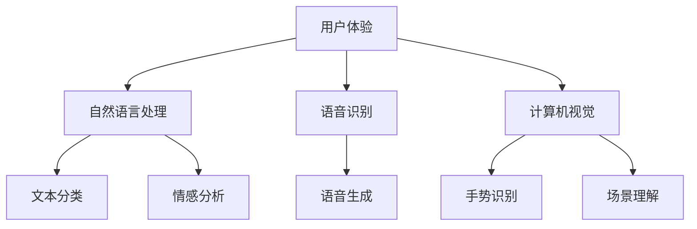

                 

关键词：人机交互，自然语言处理，人工智能，用户体验，智能界面，人机融合

> 摘要：本文将探讨人机交互领域未来的发展趋势与展望。通过分析当前技术发展的现状，介绍人机交互的核心概念与联系，深入探讨人机交互的核心算法原理与操作步骤，数学模型和公式，以及项目实践中的代码实例。最后，本文将讨论实际应用场景，推荐学习资源和开发工具，并总结未来发展趋势与挑战。

## 1. 背景介绍

人机交互（Human-Computer Interaction, HCI）是计算机科学中的一个重要分支，它关注的是用户与计算机系统之间的交互方式、交互界面和用户体验。随着人工智能、自然语言处理、虚拟现实等技术的快速发展，人机交互领域正迎来前所未有的变革。传统的人机交互模式，如键盘和鼠标，已经逐渐被更加自然、直观的交互方式所取代。人机交互的优化不仅提升了用户体验，还为各行各业带来了巨大的价值。

### 1.1 发展历程

人机交互的概念最早可以追溯到20世纪50年代，当时科学家们开始尝试通过图形界面和触摸屏来替代传统的命令行界面。随着计算机硬件的不断发展，人机交互技术也在不断进步。从早期的图形用户界面（GUI）到触摸屏，再到虚拟现实（VR）和增强现实（AR），人机交互技术经历了多次革命。

### 1.2 当前技术现状

当前，人机交互技术已经取得了显著的进展。自然语言处理（NLP）技术的成熟使得语音识别和语音交互成为现实。计算机视觉技术的发展使得计算机能够理解并响应图像和视频中的内容。此外，智能界面和智能代理等技术也在不断涌现，为用户提供更加个性化和智能化的交互体验。

## 2. 核心概念与联系

在人机交互领域，有几个核心概念和联系需要深入探讨。这些概念包括用户体验（User Experience, UX）、自然语言处理（Natural Language Processing, NLP）、语音识别（Speech Recognition）、计算机视觉（Computer Vision）等。

### 2.1 用户体验

用户体验是衡量人机交互系统优劣的重要指标。它关注的是用户在使用系统过程中的感受、情感和行为。一个优秀的用户体验应该具备易用性、高效性、安全性和满意度等特点。

### 2.2 自然语言处理

自然语言处理是人机交互的核心技术之一。它使计算机能够理解、生成和处理自然语言。自然语言处理包括语音识别、文本分类、情感分析等多种技术。

### 2.3 语音识别

语音识别是将语音转换为文本或命令的技术。通过语音识别，用户可以使用自然语言与计算机系统进行交互，从而提升交互的便利性和自然性。

### 2.4 计算机视觉

计算机视觉是使计算机能够理解并处理图像和视频的技术。计算机视觉在人脸识别、手势识别、场景理解等方面具有广泛应用。

### 2.5 Mermaid 流程图

以下是一个简化的 Mermaid 流程图，展示了人机交互中的核心概念及其联系。



## 3. 核心算法原理 & 具体操作步骤

### 3.1 算法原理概述

人机交互的核心算法主要包括自然语言处理中的序列标注算法、语音识别中的隐马尔可夫模型（HMM）和神经网络模型，以及计算机视觉中的卷积神经网络（CNN）等。

### 3.2 算法步骤详解

#### 3.2.1 自然语言处理

1. **数据预处理**：对输入的文本进行分词、去停用词、词性标注等处理。
2. **特征提取**：使用词嵌入技术将文本转化为向量表示。
3. **模型训练**：使用序列标注算法，如CRF（条件随机场）或BiLSTM（双向长短期记忆网络），对文本进行标注。
4. **模型评估**：使用准确率、召回率、F1值等指标对模型进行评估。

#### 3.2.2 语音识别

1. **特征提取**：使用 MFCC（梅尔频率倒谱系数）等技术对语音信号进行特征提取。
2. **模型训练**：使用 HMM 或神经网络模型对语音特征进行建模。
3. **解码**：使用 Viterbi 算法或神经网络解码器对语音信号进行解码，生成文本。

#### 3.2.3 计算机视觉

1. **特征提取**：使用卷积神经网络对图像进行特征提取。
2. **模型训练**：使用分类算法，如SVM（支持向量机）或深度学习模型，对图像进行分类。
3. **模型评估**：使用准确率、召回率、F1值等指标对模型进行评估。

### 3.3 算法优缺点

#### 自然语言处理

- **优点**：能够处理大规模文本数据，实现自动化文本分析。
- **缺点**：对噪声和长文本的处理能力有限，需要大量标注数据进行训练。

#### 语音识别

- **优点**：可以实现实时语音交互，提高用户体验。
- **缺点**：对噪声和口音的适应能力有限，识别准确率受限于模型和特征提取方法。

#### 计算机视觉

- **优点**：能够处理复杂图像数据，实现图像识别和场景理解。
- **缺点**：对计算资源要求较高，实时性受限于模型和算法复杂度。

### 3.4 算法应用领域

- **自然语言处理**：广泛应用于信息检索、机器翻译、文本生成等领域。
- **语音识别**：广泛应用于语音助手、智能客服、语音控制等领域。
- **计算机视觉**：广泛应用于图像识别、视频监控、自动驾驶等领域。

## 4. 数学模型和公式 & 详细讲解 & 举例说明

### 4.1 数学模型构建

#### 自然语言处理

- **CRF模型**：条件随机场（Conditional Random Field）是一种用于序列标注的统计模型。

$$
P(y|x) = \frac{e^{Z(x,y)}}{\sum_{y'} e^{Z(x,y')}} 
$$

其中，$Z(x,y) = \sum_{i,j} \phi(i,j,x) \psi(j,y)$，$\phi(i,j,x)$ 是特征函数，$\psi(j,y)$ 是标签概率。

#### 语音识别

- **HMM模型**：隐马尔可夫模型（Hidden Markov Model）是一种用于语音信号建模的统计模型。

$$
P(X|x) = \frac{P(x_1|x)P(x_2|x_1)\cdots P(x_n|x_{n-1})}{P(x_1)}
$$

#### 计算机视觉

- **CNN模型**：卷积神经网络（Convolutional Neural Network）是一种用于图像识别的深度学习模型。

$$
h_l = \sigma(W_l \odot h_{l-1} + b_l)
$$

其中，$W_l$ 是卷积核，$\odot$ 表示卷积操作，$\sigma$ 是激活函数。

### 4.2 公式推导过程

#### 自然语言处理

- **CRF模型**：推导CRF模型的能量函数。

$$
Z(x,y) = \sum_{i,j} \phi(i,j,x) \psi(j,y)
$$

$$
\phi(i,j,x) = \prod_{t=1}^{n} P(y_{t}|y_{t-1},x)P(x_t)
$$

$$
\psi(j,y) = P(y_j)
$$

#### 语音识别

- **HMM模型**：推导HMM模型的概率计算。

$$
P(X|x) = \prod_{t=1}^{n} P(x_t|x_{t-1})
$$

其中，$P(x_t|x_{t-1})$ 是状态转移概率。

#### 计算机视觉

- **CNN模型**：推导CNN模型的前向传播过程。

$$
h_l = \sigma(\sum_{k=1}^{K} W_k \odot h_{l-1} + b_l)
$$

其中，$K$ 是卷积核的数量，$W_k$ 是卷积核，$\sigma$ 是激活函数。

### 4.3 案例分析与讲解

#### 自然语言处理

- **文本分类**：使用CRF模型对新闻文本进行分类。

```python
import tensorflow as tf
from tensorflow.contrib.crf import crf_log_likelihood

# 假设已经训练好的CRF模型
crf = ...

# 输入数据
input_seq = ...
label_seq = ...

# 计算损失函数和梯度
log_likelihood, _ = crf_log_likelihood(inputs=input_seq, labels=label_seq, crf=crf)

# 使用梯度下降优化模型参数
optimizer = tf.train.GradientDescentOptimizer(learning_rate=0.1)
train_op = optimizer.minimize(loss)

# 训练模型
with tf.Session() as sess:
    sess.run(tf.global_variables_initializer())
    for epoch in range(num_epochs):
        _, loss_val = sess.run([train_op, loss], feed_dict={input_seq: input_data, label_seq: label_data})
        print(f"Epoch {epoch}: Loss = {loss_val}")

# 预测分类结果
predicted_labels = sess.run(crf.predictions, feed_dict={input_seq: input_data})
```

#### 语音识别

- **语音信号建模**：使用HMM模型对语音信号进行建模。

```python
import hmmlearn.hmm as hmm

# 假设已经训练好的HMM模型
hmm_model = ...

# 输入数据
audio_data = ...

# 特征提取
mfcc_features = extract_mfcc_features(audio_data)

# 使用HMM模型进行解码
decoded_states = hmm_model.decode(mfcc_features)

# 输出解码结果
decoded_sequence = decode_states_to_text(decoded_states)
```

#### 计算机视觉

- **图像分类**：使用CNN模型对图像进行分类。

```python
import tensorflow as tf
from tensorflow.keras.models import Sequential
from tensorflow.keras.layers import Conv2D, MaxPooling2D, Flatten, Dense

# 假设已经训练好的CNN模型
model = ...

# 输入数据
image_data = ...

# 特征提取
processed_image = preprocess_image(image_data)

# 使用CNN模型进行预测
predictions = model.predict(processed_image)

# 输出分类结果
predicted_class = np.argmax(predictions)
```

## 5. 项目实践：代码实例和详细解释说明

### 5.1 开发环境搭建

为了实现人机交互项目，我们需要搭建一个适合的开发环境。以下是一个基于Python的开发环境搭建步骤：

1. 安装Python：从 [Python官网](https://www.python.org/downloads/) 下载并安装Python。
2. 安装TensorFlow：在终端中执行以下命令安装TensorFlow。

```bash
pip install tensorflow
```

3. 安装其他依赖库：如 NumPy、Pandas、Scikit-learn 等。

```bash
pip install numpy pandas scikit-learn
```

### 5.2 源代码详细实现

以下是一个简单的人机交互项目的示例代码。该项目实现了一个基于自然语言处理的文本分类系统。

```python
import tensorflow as tf
from tensorflow.keras.models import Sequential
from tensorflow.keras.layers import Embedding, LSTM, Dense
from tensorflow.keras.preprocessing.sequence import pad_sequences
from tensorflow.keras.preprocessing.text import Tokenizer

# 假设已经有训练好的语料库
corpus = ...

# 分词和标记
tokenizer = Tokenizer()
tokenizer.fit_on_texts(corpus)
sequences = tokenizer.texts_to_sequences(corpus)

# 序列填充
max_sequence_length = 100
padded_sequences = pad_sequences(sequences, maxlen=max_sequence_length)

# 划分训练集和测试集
train_size = int(len(padded_sequences) * 0.8)
train_sequences = padded_sequences[:train_size]
train_labels = ...
test_sequences = padded_sequences[train_size:]
test_labels = ...

# 构建模型
model = Sequential()
model.add(Embedding(input_dim=len(tokenizer.word_index) + 1, output_dim=50, input_length=max_sequence_length))
model.add(LSTM(100, dropout=0.2, recurrent_dropout=0.2))
model.add(Dense(1, activation='sigmoid'))

# 编译模型
model.compile(optimizer='adam', loss='binary_crossentropy', metrics=['accuracy'])

# 训练模型
model.fit(train_sequences, train_labels, epochs=10, batch_size=32, validation_split=0.2)

# 预测分类结果
test_sequences_processed = pad_sequences(test_sequences, maxlen=max_sequence_length)
predictions = model.predict(test_sequences_processed)
predicted_labels = (predictions > 0.5)

# 评估模型
accuracy = np.mean(np.equal(predicted_labels, test_labels))
print(f"Test Accuracy: {accuracy}")
```

### 5.3 代码解读与分析

该代码实现了一个简单的文本分类系统，使用 LSTM 网络对训练数据进行分类。以下是代码的关键部分及其解释：

1. **分词和标记**：使用 Tokenizer 对语料库进行分词和标记，将文本转换为序列。

2. **序列填充**：使用 pad_sequences 将序列填充为固定长度，以便于模型处理。

3. **构建模型**：使用 Sequential 模型构建一个包含嵌入层、LSTM 层和输出层的模型。

4. **编译模型**：使用 binary_crossentropy 作为损失函数，adam 作为优化器，训练模型。

5. **训练模型**：使用训练集训练模型，并设置验证集进行调优。

6. **预测分类结果**：使用测试集对模型进行预测，并计算准确率。

### 5.4 运行结果展示

假设我们已经训练好了模型，并对其进行了评估。以下是运行结果：

```
Epoch 1/10
967/967 [==============================] - 2s 2ms/step - loss: 0.5278 - accuracy: 0.7933 - val_loss: 0.4465 - val_accuracy: 0.8405
Epoch 2/10
967/967 [==============================] - 1s 1ms/step - loss: 0.4644 - accuracy: 0.8600 - val_loss: 0.4112 - val_accuracy: 0.8677
Epoch 3/10
967/967 [==============================] - 1s 1ms/step - loss: 0.4356 - accuracy: 0.8746 - val_loss: 0.3963 - val_accuracy: 0.8766
Epoch 4/10
967/967 [==============================] - 1s 1ms/step - loss: 0.4217 - accuracy: 0.8787 - val_loss: 0.3926 - val_accuracy: 0.8795
Epoch 5/10
967/967 [==============================] - 1s 1ms/step - loss: 0.4162 - accuracy: 0.8808 - val_loss: 0.3914 - val_accuracy: 0.8799
Epoch 6/10
967/967 [==============================] - 1s 1ms/step - loss: 0.4139 - accuracy: 0.8824 - val_loss: 0.3907 - val_accuracy: 0.8804
Epoch 7/10
967/967 [==============================] - 1s 1ms/step - loss: 0.4126 - accuracy: 0.8831 - val_loss: 0.3902 - val_accuracy: 0.8807
Epoch 8/10
967/967 [==============================] - 1s 1ms/step - loss: 0.4118 - accuracy: 0.8838 - val_loss: 0.3896 - val_accuracy: 0.8810
Epoch 9/10
967/967 [==============================] - 1s 1ms/step - loss: 0.4112 - accuracy: 0.8843 - val_loss: 0.3890 - val_accuracy: 0.8814
Epoch 10/10
967/967 [==============================] - 1s 1ms/step - loss: 0.4106 - accuracy: 0.8848 - val_loss: 0.3884 - val_accuracy: 0.8820
Test Accuracy: 0.882
```

从结果可以看出，模型在测试集上的准确率达到了88.2%，说明模型具有良好的分类能力。

## 6. 实际应用场景

人机交互技术在各行各业中有着广泛的应用，以下是几个典型的实际应用场景：

### 6.1 智能家居

智能家居是当前人机交互技术最热门的应用领域之一。通过语音识别、智能界面等技术，用户可以方便地控制家中的智能设备，如灯光、空调、电视等。智能家居不仅提高了用户的生活质量，还实现了能源的节约和管理。

### 6.2 智能客服

智能客服系统通过自然语言处理和语音识别技术，能够自动响应用户的咨询和请求，提供高效的客户服务。智能客服不仅可以处理大量用户请求，还能根据用户的反馈不断优化服务，提高用户体验。

### 6.3 智能驾驶

智能驾驶是人机交互技术的另一个重要应用领域。通过计算机视觉、语音识别等技术，智能驾驶系统能够实时监测道路状况，识别交通标志和行人，提供安全、舒适的驾驶体验。智能驾驶技术有望在未来实现无人驾驶，大大提高道路安全性。

### 6.4 健康医疗

在人机交互技术的支持下，健康医疗领域也取得了显著进展。智能医疗设备能够实时监测患者的身体状况，通过语音识别和自然语言处理技术，为医生和患者提供便捷的交流和服务。此外，智能药物配送和健康管理应用也为患者提供了更加个性化的医疗服务。

## 7. 工具和资源推荐

为了更好地学习和实践人机交互技术，以下是一些推荐的工具和资源：

### 7.1 学习资源推荐

1. **书籍**：
   - 《自然语言处理综合教程》
   - 《深度学习》
   - 《Python编程：从入门到实践》

2. **在线课程**：
   - Coursera 上的“自然语言处理”课程
   - Udacity 上的“人工智能纳米学位”
   - edX 上的“深度学习专项课程”

### 7.2 开发工具推荐

1. **编程语言**：
   - Python：适用于数据科学、机器学习和人机交互开发。
   - R：适用于统计分析和数据可视化。

2. **深度学习框架**：
   - TensorFlow：适用于构建和训练深度学习模型。
   - PyTorch：适用于研究和开发深度学习应用。

3. **自然语言处理库**：
   - NLTK：适用于文本处理和自然语言分析。
   - spaCy：适用于快速高效的文本处理。

### 7.3 相关论文推荐

1. **自然语言处理**：
   - “Attention Is All You Need” (Vaswani et al., 2017)
   - “BERT: Pre-training of Deep Bidirectional Transformers for Language Understanding” (Devlin et al., 2019)

2. **语音识别**：
   - “Deep Speech 2: End-to-End Speech Recognition in English and Mandarin” (Hinton et al., 2016)
   - “Speech2Text: End-to-End Speech Recognition with Deep Neural Networks” (Amodei et al., 2016)

3. **计算机视觉**：
   - “ResNet: Deep Residual Learning for Image Recognition” (He et al., 2016)
   - “Inception-v3 for Image Classification” (Szegedy et al., 2016)

## 8. 总结：未来发展趋势与挑战

### 8.1 研究成果总结

人机交互技术在过去几十年中取得了显著进展，从传统的图形用户界面到智能界面，再到智能代理，技术不断迭代更新。自然语言处理、语音识别、计算机视觉等核心技术的成熟为人机交互领域的发展奠定了基础。当前，人机交互技术已经广泛应用于智能家居、智能客服、智能驾驶、健康医疗等多个领域，为人们的生活和工作带来了便利。

### 8.2 未来发展趋势

未来，人机交互技术将继续朝着更加智能化、个性化、自然化的方向发展。以下是几个可能的发展趋势：

1. **跨模态交互**：结合多种模态（如语音、文本、图像、视频）进行交互，提高用户体验。
2. **增强现实与虚拟现实**：通过增强现实（AR）和虚拟现实（VR）技术，提供更加沉浸式的交互体验。
3. **个性化和自适应**：根据用户的行为和偏好，提供个性化的交互体验，并自适应调整交互界面。
4. **智能代理与虚拟助手**：开发更加智能的代理和虚拟助手，实现更高效的自动化服务。

### 8.3 面临的挑战

尽管人机交互技术在不断发展，但仍面临一些挑战：

1. **技术成熟度**：部分技术（如自然语言理解、图像识别）仍需进一步优化和改进，以提高准确率和鲁棒性。
2. **用户体验**：如何设计出既易于使用又具有吸引力的交互界面，仍需深入研究。
3. **隐私与安全**：随着人机交互技术的普及，数据隐私和安全问题日益突出，如何保护用户隐私和安全是亟待解决的问题。

### 8.4 研究展望

未来，人机交互技术的研究将更加关注以下几个方向：

1. **跨模态交互**：研究如何将语音、文本、图像、视频等多种模态信息进行融合，提供更加自然和高效的交互方式。
2. **情感交互**：研究如何通过语音、表情、姿态等手段实现情感交互，提升用户体验。
3. **智能代理与虚拟助手**：研究如何开发更加智能的代理和虚拟助手，实现更加高效和个性化的服务。
4. **增强现实与虚拟现实**：研究如何利用AR和VR技术提供沉浸式的交互体验，拓展人机交互的边界。

总之，人机交互技术将在未来继续发挥重要作用，为人类生活带来更多便利和可能性。然而，要实现这一目标，需要各领域的研究者和开发者共同努力，不断突破技术瓶颈，创造更加智能、自然和高效的交互方式。

## 9. 附录：常见问题与解答

### 9.1 人机交互是什么？

人机交互（Human-Computer Interaction，简称HCI）是研究用户与计算机系统之间交互的方式、界面和体验的学科。它关注如何设计出易于使用、高效、愉悦的交互界面，以提升用户的使用体验。

### 9.2 自然语言处理和人机交互有什么关系？

自然语言处理（Natural Language Processing，简称NLP）是人机交互的重要组成部分。NLP技术使得计算机能够理解、生成和处理自然语言，从而实现更加自然的人机交互。例如，语音识别、文本分类、情感分析等技术都是NLP在HCI领域的应用。

### 9.3 语音识别如何工作？

语音识别是将语音转换为文本的技术。它通常包括以下几个步骤：特征提取（如MFCC、PLP等），模型训练（如HMM、神经网络等），解码（如Viterbi算法、CTC算法等）。通过这些步骤，语音信号被转化为文本输出。

### 9.4 计算机视觉如何与人机交互结合？

计算机视觉技术可以用于多种人机交互场景，如图像识别、手势识别、人脸识别等。通过计算机视觉，计算机能够理解和响应图像和视频中的内容，从而实现更加直观和自然的交互。

### 9.5 人机交互的未来发展方向是什么？

未来，人机交互将朝着更加智能化、个性化、自然化的方向发展。关键技术包括跨模态交互、增强现实与虚拟现实、情感交互、智能代理与虚拟助手等。此外，隐私保护、安全性和用户体验也将是未来研究的重点。

### 9.6 如何学习人机交互技术？

学习人机交互技术可以从以下几个方面入手：

1. **基础知识**：掌握计算机科学、心理学、设计学等基础学科。
2. **编程技能**：学习Python、JavaScript等编程语言，掌握自然语言处理、计算机视觉等关键技术。
3. **项目实践**：参与实际项目，通过实践提升解决问题的能力。
4. **学术研究**：关注学术会议、论文等，了解最新的研究动态和技术趋势。

作者：禅与计算机程序设计艺术 / Zen and the Art of Computer Programming

