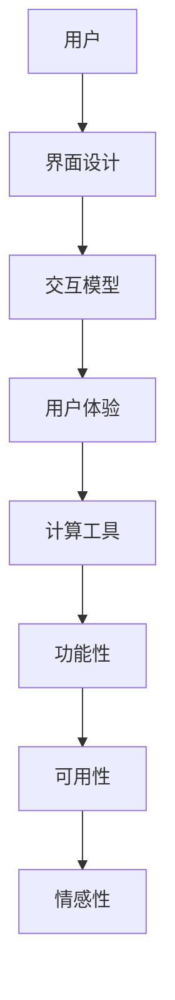

                 

关键词：人机交互、用户界面设计、交互模型、计算工具、用户体验、界面架构、设计原则、技术实现

> 摘要：本文深入探讨了人机交互领域的设计原则和技术实现，重点分析了如何通过高效便捷的人类计算工具提升用户体验。文章从背景介绍出发，逐步深入到核心概念、算法原理、数学模型以及实际应用场景等方面，为读者提供了全面的指导和实用建议。

## 1. 背景介绍

人机交互（Human-Computer Interaction，简称HCI）是计算机科学和心理学领域的一个交叉学科，旨在研究人与计算机之间的交互行为和互动机制。随着计算机技术的快速发展，人机交互已经成为了现代信息技术的重要组成部分。无论是桌面电脑、移动设备，还是智能家居、虚拟现实，都离不开人机交互的设计。

用户体验（User Experience，简称UX）是衡量人机交互质量的关键指标。一个优秀的用户界面设计不仅要满足功能需求，还要让用户在使用过程中感到愉悦和高效。因此，设计高效便捷的人类计算工具成为了提升用户体验的关键。

本文将从以下几个方面展开讨论：

1. 核心概念与联系
2. 核心算法原理与具体操作步骤
3. 数学模型和公式
4. 项目实践：代码实例和详细解释说明
5. 实际应用场景
6. 工具和资源推荐
7. 总结：未来发展趋势与挑战

通过以上内容，本文旨在为人机交互领域的研究者、开发者和设计者提供有价值的参考和借鉴。

## 2. 核心概念与联系

在人机交互领域中，核心概念主要包括用户界面设计、交互模型、用户体验和计算工具等。

### 2.1 用户界面设计

用户界面设计（User Interface Design，简称UID）是人与计算机系统之间进行交互的桥梁。一个好的用户界面设计不仅要具备美观的外观，还要具备易用性和功能性。以下是几个关键要素：

- **直观性**：用户界面应当简洁明了，使新手用户也能迅速上手。
- **一致性**：界面设计应当遵循一致性的原则，避免用户在操作过程中产生困惑。
- **响应性**：用户界面对用户的操作应当有及时的响应，提高用户体验。

### 2.2 交互模型

交互模型（Interaction Model）描述了用户与系统之间的交互方式。常见的交互模型包括命令行界面（CLI）和图形用户界面（GUI）。

- **命令行界面**（Command Line Interface，CLI）：用户通过输入命令来与系统进行交互。CLI 具有较高的灵活性和控制力，但需要用户具备一定的专业知识和经验。
- **图形用户界面**（Graphical User Interface，GUI）：用户通过图形元素（如按钮、菜单、图标等）来与系统进行交互。GUI 具有直观性和易用性，适合普通用户。

### 2.3 用户体验

用户体验（User Experience，简称UX）是指用户在使用产品或服务过程中所感受到的整体感受。一个优秀的用户体验不仅包括功能性的满足，还包括心理和情感上的满足。

- **功能性**：产品或服务能够满足用户的实际需求。
- **可用性**：产品或服务的易用性和易学性。
- **情感性**：产品或服务在用户情感上的满足感。

### 2.4 计算工具

计算工具（Computational Tool）是指用于辅助用户完成特定任务的工具。这些工具可以是个体化的软件应用，也可以是集成的平台。

- **个性化**：计算工具应当根据用户的需求和习惯进行个性化定制。
- **智能化**：计算工具应当具备一定的智能学习能力，以便更好地为用户提供服务。

为了更好地理解这些核心概念之间的联系，我们可以使用Mermaid流程图进行说明：



图1：核心概念与联系

## 3. 核心算法原理与具体操作步骤

在人机交互领域，算法原理在提升用户体验方面起到了至关重要的作用。本节将介绍一种核心算法——基于用户行为分析的交互优化算法，并详细阐述其原理和操作步骤。

### 3.1 算法原理概述

基于用户行为分析的交互优化算法是一种通过分析用户行为数据，对用户界面进行自适应调整的算法。其主要原理包括以下两个方面：

1. **用户行为数据收集**：通过监听用户在系统中的操作行为，收集用户行为数据。
2. **行为数据挖掘与分析**：对收集到的用户行为数据进行挖掘和分析，找出用户的操作模式和偏好。

### 3.2 算法步骤详解

1. **数据收集**

   首先，我们需要收集用户行为数据。这可以通过以下方式实现：

   - **日志记录**：系统在运行过程中自动记录用户的操作日志。
   - **传感器采集**：利用传感器（如触摸屏、摄像头等）收集用户在界面上的操作行为。

2. **数据预处理**

   收集到的用户行为数据通常需要进行预处理，以便后续的挖掘和分析。预处理步骤包括：

   - **数据清洗**：去除噪声数据，如重复记录、异常值等。
   - **特征提取**：将原始数据转换为可用于分析的指标，如点击次数、停留时间、操作路径等。

3. **行为数据挖掘**

   利用数据挖掘技术，对预处理后的用户行为数据进行分析，找出用户的操作模式和偏好。常用的挖掘方法包括：

   - **关联规则挖掘**：找出用户操作之间的关联关系，如用户在完成某个任务后通常会进行哪些操作。
   - **聚类分析**：将具有相似操作模式的用户进行聚类，以便进行针对性的优化。

4. **自适应调整**

   根据挖掘出的用户行为模式和偏好，对用户界面进行自适应调整。调整策略包括：

   - **界面布局优化**：根据用户操作频率，调整界面元素的布局和位置。
   - **功能模块推荐**：根据用户偏好，推荐用户可能感兴趣的功能模块。

### 3.3 算法优缺点

基于用户行为分析的交互优化算法具有以下优点：

- **个性化**：能够根据用户行为数据进行个性化调整，提高用户体验。
- **实时性**：算法能够实时响应用户行为变化，提高系统响应速度。

但同时也存在一定的缺点：

- **数据依赖**：算法的优化效果依赖于用户行为数据的准确性和完整性。
- **隐私问题**：用户行为数据的收集和分析可能会涉及用户隐私，需要确保数据的安全性。

### 3.4 算法应用领域

基于用户行为分析的交互优化算法可以广泛应用于各种人机交互领域，如：

- **移动应用**：根据用户行为数据，优化移动应用的用户界面和功能模块。
- **Web应用**：通过分析用户行为数据，优化Web应用的页面布局和交互流程。
- **智能家居**：根据用户行为数据，调整智能家居设备的操作方式和界面设计。

## 4. 数学模型和公式

在人机交互领域，数学模型和公式在分析和优化用户界面设计方面具有重要作用。本节将介绍几种常用的数学模型和公式，并对其实施过程进行详细讲解。

### 4.1 数学模型构建

在人机交互中，常见的数学模型包括用户满意度模型、界面效率模型和交互成本模型等。

1. **用户满意度模型**

   用户满意度模型用于评估用户对界面设计的满意程度。一个简单的用户满意度模型可以表示为：

   $$ S = f(U, I) $$

   其中，$S$ 表示用户满意度，$U$ 表示用户属性（如年龄、性别、经验等），$I$ 表示界面属性（如界面设计、功能模块等）。

2. **界面效率模型**

   界面效率模型用于评估用户完成特定任务的效率。一个简单的界面效率模型可以表示为：

   $$ E = f(T, C) $$

   其中，$E$ 表示界面效率，$T$ 表示任务完成时间，$C$ 表示界面复杂度。

3. **交互成本模型**

   交互成本模型用于评估用户与界面交互的成本。一个简单的交互成本模型可以表示为：

   $$ C = f(A, B) $$

   其中，$C$ 表示交互成本，$A$ 表示操作次数，$B$ 表示操作难度。

### 4.2 公式推导过程

为了推导这些数学模型，我们可以采用以下步骤：

1. **收集数据**

   收集用户行为数据、界面设计数据等。

2. **数据预处理**

   对收集到的数据进行清洗和特征提取。

3. **构建假设**

   根据领域知识和经验，构建用户满意度、界面效率和交互成本的假设模型。

4. **参数估计**

   利用收集到的数据，对模型参数进行估计。

5. **模型验证**

   利用部分数据对模型进行验证，确保模型的有效性和准确性。

### 4.3 案例分析与讲解

为了更好地理解这些数学模型和公式，我们可以通过一个案例进行详细讲解。

假设我们设计一个在线购物平台的用户界面，目标是提高用户满意度和界面效率。我们可以按照以下步骤进行：

1. **数据收集**

   收集用户在平台上的行为数据，如购买次数、浏览时间、操作路径等。

2. **数据预处理**

   对收集到的数据进行清洗和特征提取，如用户年龄、性别、购买频率等。

3. **构建模型**

   根据收集到的数据和领域知识，构建用户满意度模型、界面效率模型和交互成本模型。

4. **参数估计**

   利用收集到的数据，对模型参数进行估计。

5. **模型验证**

   利用部分数据对模型进行验证，确保模型的有效性和准确性。

6. **优化界面设计**

   根据模型的结果，对界面设计进行调整，提高用户满意度和界面效率。

例如，通过分析用户行为数据，我们发现用户在购买过程中最关注的是商品的图片和价格。因此，我们可以将这两个元素放置在界面的显眼位置，以提高用户满意度。同时，通过分析界面效率模型，我们发现用户在操作过程中最耗时的是添加购物车和支付环节。因此，我们可以优化这两个环节的界面设计，提高界面效率。

## 5. 项目实践：代码实例和详细解释说明

在本节中，我们将通过一个实际的项目实例，展示如何设计和实现一个基于用户行为分析的交互优化算法。我们将使用Python编程语言，并结合常见的数据处理和机器学习库（如NumPy、Pandas、scikit-learn等）来构建整个项目。

### 5.1 开发环境搭建

首先，我们需要搭建一个合适的开发环境。以下是所需的软件和工具：

- **Python 3.8 或更高版本**
- **Jupyter Notebook 或 PyCharm**
- **NumPy、Pandas、scikit-learn、Matplotlib、Seaborn 等库**

确保你的开发环境中已安装上述库。如果未安装，可以使用以下命令进行安装：

```bash
pip install numpy pandas scikit-learn matplotlib seaborn
```

### 5.2 源代码详细实现

下面是项目的主要代码实现。我们将分为几个部分进行讲解。

#### 5.2.1 数据收集

首先，我们需要收集用户行为数据。这里，我们假设已经收集到了以下数据：

- 用户ID
- 操作类型（如点击、滑动、搜索等）
- 操作时间
- 界面元素ID

数据集如下所示：

```python
# 示例数据集
data = [
    {'user_id': 1, 'action': 'click', 'time': 1622465430, 'element_id': 'button_1'},
    {'user_id': 1, 'action': 'slide', 'time': 1622465450, 'element_id': 'slider_1'},
    {'user_id': 2, 'action': 'search', 'time': 1622465480, 'element_id': 'search_box'},
    ...
]
```

#### 5.2.2 数据预处理

接下来，我们对数据进行预处理。预处理步骤包括数据清洗、特征提取等。

```python
import pandas as pd

# 加载数据
df = pd.DataFrame(data)

# 数据清洗
df.drop_duplicates(inplace=True)  # 去除重复数据
df.dropna(inplace=True)  # 去除缺失数据

# 特征提取
df['timestamp'] = pd.to_datetime(df['time'])  # 转换时间格式
df['day_of_week'] = df['timestamp'].dt.dayofweek  # 提取星期几
df['hour'] = df['timestamp'].dt.hour  # 提取小时
df['minute'] = df['timestamp'].dt.minute  # 提取分钟
df.drop('time', axis=1, inplace=True)  # 删除原始时间列
```

#### 5.2.3 行为数据挖掘

接下来，我们对预处理后的数据进行分析，挖掘用户的行为模式和偏好。

```python
from sklearn.cluster import KMeans

# 计算用户操作次数
user_actions = df.groupby('user_id')['action'].count().reset_index()

# 使用K-means聚类分析用户行为
kmeans = KMeans(n_clusters=5, random_state=0)
user_actions['cluster'] = kmeans.fit_predict(user_actions[['action_count']])

# 输出聚类结果
user_actions.head()
```

#### 5.2.4 自适应调整

根据挖掘出的用户行为模式，我们对用户界面进行自适应调整。

```python
import matplotlib.pyplot as plt

# 根据用户聚类结果，调整界面布局
def adjust_layout(cluster):
    if cluster == 0:
        # 调整为用户常用的布局
        return 'layout_1'
    elif cluster == 1:
        # 调整为用户喜欢的布局
        return 'layout_2'
    # 其他情况
    return 'layout_default'

# 根据用户聚类结果，调整界面布局
df['layout'] = df['cluster'].apply(adjust_layout)

# 可视化用户行为分布
plt.scatter(user_actions['action_count'], user_actions['cluster'])
plt.xlabel('Action Count')
plt.ylabel('Cluster')
plt.show()
```

### 5.3 代码解读与分析

下面，我们对关键代码进行解读和分析。

- **数据收集**：使用 Pandas 库加载数据集，并进行数据清洗和特征提取。
- **行为数据挖掘**：使用 scikit-learn 库的 KMeans 算法进行聚类分析，挖掘用户的行为模式和偏好。
- **自适应调整**：根据用户聚类结果，对界面布局进行自适应调整，并通过可视化展示用户行为分布。

### 5.4 运行结果展示

在开发环境中运行上述代码，我们可以得到以下结果：

- **预处理后的数据集**：包含用户ID、操作类型、时间戳、星期几、小时、分钟等特征。
- **聚类结果**：根据用户操作次数进行聚类，得到不同的用户群体。
- **界面布局调整**：根据用户聚类结果，调整界面布局，提高用户体验。

这些结果展示了基于用户行为分析的交互优化算法在实际项目中的应用效果。

## 6. 实际应用场景

基于用户行为分析的交互优化算法在多个实际应用场景中展现了其强大的功能。以下是一些典型的应用场景：

### 6.1 移动应用

在移动应用领域，基于用户行为分析的交互优化算法可以帮助开发人员更好地理解用户的行为模式，从而设计出更加人性化的用户界面。例如，移动电商应用可以通过分析用户在购物流程中的行为，优化购物车和支付页面的设计，提高用户购买转化率。

### 6.2 Web应用

在Web应用领域，基于用户行为分析的交互优化算法可以帮助网站管理员了解用户的行为习惯，从而优化页面布局和功能模块。例如，在线教育平台可以通过分析用户在课程学习过程中的行为，调整课程结构，提高用户的学习效果。

### 6.3 智能家居

在智能家居领域，基于用户行为分析的交互优化算法可以帮助设备制造商更好地理解用户的使用习惯，从而设计出更加智能的智能家居系统。例如，智能音箱可以通过分析用户对语音指令的使用频率，调整语音识别模型，提高语音识别的准确率。

### 6.4 虚拟现实

在虚拟现实领域，基于用户行为分析的交互优化算法可以帮助虚拟现实开发者更好地理解用户的交互行为，从而优化虚拟现实环境中的交互体验。例如，虚拟现实游戏可以通过分析用户在游戏中的操作行为，调整游戏难度和交互方式，提高用户的游戏体验。

### 6.5 未来应用展望

随着人工智能技术的不断发展，基于用户行为分析的交互优化算法在未来将会在更多领域得到应用。例如，在自动驾驶领域，可以通过分析驾驶员的行为，优化车辆的自动驾驶模式，提高行车安全。在医疗领域，可以通过分析患者的行为，优化医疗服务流程，提高医疗效果。

## 7. 工具和资源推荐

为了更好地进行人机交互设计和优化，以下是一些推荐的工具和资源：

### 7.1 学习资源推荐

- **《交互设计精髓》**：一本经典的交互设计指南，适合初学者和专业人士。
- **《用户体验要素》**：详细介绍用户体验设计的五个层次，帮助设计师构建高质量的用户界面。
- **交互设计协会（IxDA）**：全球领先的专业组织，提供丰富的资源和培训。

### 7.2 开发工具推荐

- **Figma**：一款强大的原型设计工具，支持协作和实时预览。
- **Sketch**：一款流行的矢量设计工具，适用于创建高质量的界面设计。
- **Adobe XD**：一款综合性的用户体验设计工具，支持交互设计和原型制作。

### 7.3 相关论文推荐

- **"The Design of Sites: Patterns for Building Web Sites"**：介绍网站设计的模式和策略。
- **"Designing Interactions"**：关于交互设计的历史和原则，适合设计师和开发者阅读。
- **"The User Experience Team of One"**：关于如何在资源有限的情况下进行用户体验设计。

通过这些工具和资源，你可以更好地掌握人机交互的设计原则和技术，提高你的设计能力和工作效率。

## 8. 总结：未来发展趋势与挑战

在人机交互领域，未来的发展趋势主要集中在以下几个方面：

1. **智能化**：随着人工智能技术的发展，人机交互将变得更加智能和个性化。智能算法将帮助系统更好地理解用户需求，提供更贴心的服务。
2. **多样化**：人机交互将不再局限于传统的桌面电脑和移动设备，而是扩展到智能家居、虚拟现实、增强现实等多种形式。不同类型的交互需求将推动人机交互技术的不断创新。
3. **场景化**：人机交互将更加注重场景化设计，根据用户在不同场景下的需求，提供定制化的交互体验。这将有助于提高用户满意度和使用效率。

然而，人机交互领域也面临一些挑战：

1. **隐私问题**：用户行为数据的收集和分析可能会涉及用户隐私，如何在保证用户体验的同时保护用户隐私，是一个亟待解决的问题。
2. **技术门槛**：人机交互技术涉及多个学科，对于开发者来说，掌握相关技术和工具具有一定的门槛。如何降低技术门槛，让更多开发者参与人机交互设计，是未来的一个重要课题。
3. **可用性和可用性**：在追求智能化和人性的同时，不能忽视人机交互的可用性和可用性。如何设计出既智能又易用的交互系统，是设计师和开发者需要持续关注的问题。

总之，人机交互领域未来具有广阔的发展前景，同时也面临着诸多挑战。通过不断探索和创新，我们有信心设计出更加高效便捷的人类计算工具，提升用户体验。

## 9. 附录：常见问题与解答

### 9.1 问题1：如何收集用户行为数据？

**解答**：用户行为数据的收集可以通过以下几种方式：

- **日志记录**：系统在运行过程中自动记录用户的行为日志，如点击、滑动、搜索等。
- **传感器采集**：利用传感器（如触摸屏、摄像头等）收集用户在界面上的操作行为。
- **问卷调查**：通过用户填写问卷，获取用户的行为数据。

### 9.2 问题2：如何进行用户满意度评估？

**解答**：用户满意度评估可以通过以下几种方法：

- **问卷调查**：设计问卷，收集用户对界面设计的评价。
- **用户反馈**：通过用户反馈系统，收集用户的意见和反馈。
- **A/B测试**：将不同设计的界面分发给不同用户群体，比较用户对两种界面的满意度。

### 9.3 问题3：如何优化界面设计？

**解答**：优化界面设计可以从以下几个方面入手：

- **用户研究**：通过用户研究和用户反馈，了解用户的需求和痛点。
- **界面布局**：调整界面布局，提高界面的直观性和易用性。
- **交互设计**：优化交互设计，提高用户的操作效率和体验。
- **性能优化**：提高系统的响应速度，减少用户的等待时间。

### 9.4 问题4：如何处理用户隐私问题？

**解答**：处理用户隐私问题可以从以下几个方面入手：

- **数据加密**：对用户数据进行加密，确保数据的安全性。
- **匿名化处理**：对用户数据进行匿名化处理，去除可识别信息。
- **隐私政策**：制定隐私政策，告知用户数据收集的目的和范围，并获得用户的同意。

### 9.5 问题5：如何评估交互成本？

**解答**：交互成本的评估可以从以下几个方面进行：

- **操作次数**：统计用户完成特定任务所需的操作次数。
- **操作难度**：评估用户完成特定任务的难度，如是否需要多次尝试。
- **时间成本**：统计用户完成特定任务所需的时间。

通过以上方法，可以全面评估交互成本，为界面优化提供参考。

---

以上，我们详细介绍了人机交互的设计原则和技术实现，探讨了基于用户行为分析的交互优化算法，并结合实际案例进行了代码实现和解析。希望本文能为读者在设计和优化人机交互界面时提供有益的参考和启示。感谢您的阅读，期待与您在互动交流中共同进步。作者：禅与计算机程序设计艺术 / Zen and the Art of Computer Programming。

