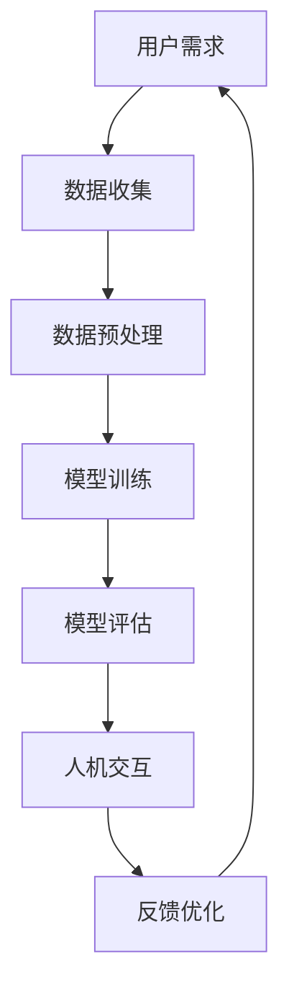

                 

关键词：人机协作、智能未来、人工智能、技术发展、软件开发、创新思维

> 摘要：随着人工智能技术的飞速发展，人机协作模式逐渐成为新时代技术发展的核心议题。本文将深入探讨人机协作的基本概念、核心算法原理、实际应用场景以及未来展望，旨在为读者呈现一个全方位的智能未来蓝图。

## 1. 背景介绍

近年来，人工智能（AI）技术取得了令人瞩目的进展，不仅在学术界，在工业界也得到了广泛应用。从简单的图像识别到复杂的自然语言处理，AI正逐步融入我们的日常生活。然而，单纯依赖人工智能的智能系统在实际应用中仍存在诸多限制。如何将人类的智慧与机器的计算能力有机结合，实现人机高效协作，成为当前科技领域亟待解决的重要课题。

人机协作并非新鲜概念，早在计算机科学初期，科学家们就已经开始探讨如何将人的思维与机器的力量相结合。然而，随着技术的不断进步，人机协作的模式也在不断演进。本文将探讨新时代下的人机协作模式，分析其核心算法原理，并探讨其广阔的应用前景。

## 2. 核心概念与联系

为了更好地理解人机协作的机制，我们首先需要明确一些核心概念，包括人工智能、自然语言处理、机器学习等。

### 2.1 人工智能

人工智能（AI）是指通过计算机模拟人类智能的技术。其核心在于让计算机具有学习、推理、解决问题等能力。AI可以大致分为两大类：弱人工智能和强人工智能。

- **弱人工智能**：专注于特定任务，如语音识别、图像处理等。
- **强人工智能**：具有与人类相似的全面智能，能够理解和执行各种复杂的任务。

### 2.2 自然语言处理

自然语言处理（NLP）是人工智能的一个分支，旨在使计算机能够理解和生成人类语言。NLP涉及到文本分析、语音识别、情感分析等多个方面。

### 2.3 机器学习

机器学习（ML）是AI的核心技术之一，它通过算法从数据中自动学习规律，进行预测和决策。机器学习可以分为监督学习、无监督学习和强化学习。

### 2.4 Mermaid 流程图

为了更直观地展示人机协作的流程，我们可以使用Mermaid流程图来描述其基本架构。



### 2.5 人机协作的基本机制

人机协作的基本机制可以概括为以下几个步骤：

1. **用户需求分析**：理解用户的需求和期望。
2. **数据收集**：收集相关的数据和信息。
3. **数据预处理**：对数据进行清洗和格式化，以便于后续分析。
4. **模型训练**：使用机器学习算法对数据进行训练，构建智能模型。
5. **模型评估**：评估模型的性能和准确度。
6. **人机交互**：通过与用户交互，不断优化模型。
7. **反馈优化**：根据用户反馈对模型进行调整和优化。

## 3. 核心算法原理 & 具体操作步骤

### 3.1 算法原理概述

人机协作的核心在于智能模型与用户的互动。智能模型主要通过机器学习算法来训练，使其具备理解用户需求、进行决策和反馈的能力。以下是几种常见的人机协作算法：

1. **决策树**：通过一系列条件判断，对用户需求进行分类和决策。
2. **神经网络**：通过多层神经元模拟人脑的思考过程，实现复杂的非线性映射。
3. **强化学习**：通过奖励机制，使智能体不断优化其行为策略。

### 3.2 算法步骤详解

#### 3.2.1 决策树

1. **构建决策树**：根据特征值和目标值，生成决策树结构。
2. **数据划分**：将数据集划分为训练集和测试集。
3. **模型训练**：使用训练集对决策树进行训练。
4. **模型评估**：使用测试集评估决策树的性能。

#### 3.2.2 神经网络

1. **构建神经网络**：定义输入层、隐藏层和输出层。
2. **初始化权重**：随机初始化网络权重。
3. **前向传播**：计算输入和权重的加权和，并传递到下一层。
4. **反向传播**：根据损失函数，更新网络权重。
5. **模型评估**：使用测试集评估神经网络的性能。

#### 3.2.3 强化学习

1. **定义环境**：定义智能体所处的环境。
2. **初始化策略**：随机初始化智能体的行为策略。
3. **执行动作**：根据当前状态和策略，执行动作。
4. **更新策略**：根据奖励和损失，更新智能体的策略。
5. **模型评估**：使用测试集评估强化学习模型的性能。

### 3.3 算法优缺点

#### 决策树

- **优点**：简单易懂，易于实现。
- **缺点**：容易过拟合，难以处理高维数据。

#### 神经网络

- **优点**：能够处理复杂非线性问题，适应性强。
- **缺点**：训练过程复杂，对数据质量要求高。

#### 强化学习

- **优点**：能够自主探索环境，适应性强。
- **缺点**：训练过程复杂，对计算资源要求高。

### 3.4 算法应用领域

人机协作算法在多个领域有着广泛的应用，如自然语言处理、图像识别、智能推荐等。

## 4. 数学模型和公式 & 详细讲解 & 举例说明

### 4.1 数学模型构建

人机协作的核心在于构建智能模型，其基本数学模型包括输入层、隐藏层和输出层。以下是神经网络的基本数学模型：

$$
Z = \sigma(W_1 \cdot X + b_1)
$$

$$
A = \sigma(W_2 \cdot Z + b_2)
$$

其中，$Z$为隐藏层的输出，$A$为输出层的输出，$\sigma$为激活函数，$W$为权重，$b$为偏置。

### 4.2 公式推导过程

以神经网络为例，我们通常使用反向传播算法（Backpropagation）来更新权重和偏置。以下是反向传播算法的基本步骤：

1. **前向传播**：计算输入和权重的加权和，并传递到下一层。
2. **计算损失**：计算预测值与实际值之间的差异，得到损失函数。
3. **反向传播**：根据损失函数，计算梯度，并更新权重和偏置。

### 4.3 案例分析与讲解

假设我们有一个简单的神经网络，用于分类一个二分类问题。输入层有2个神经元，隐藏层有3个神经元，输出层有1个神经元。

- **输入层**：[x1, x2]
- **隐藏层**：[z1, z2, z3]
- **输出层**：[y]

激活函数使用ReLU（Rectified Linear Unit），损失函数使用交叉熵损失（Cross-Entropy Loss）。

### 4.3.1 前向传播

1. **计算隐藏层输出**：

$$
z1 = max(0, x1 \cdot w11 + x2 \cdot w12 + b1)
$$

$$
z2 = max(0, x1 \cdot w21 + x2 \cdot w22 + b2)
$$

$$
z3 = max(0, x1 \cdot w31 + x2 \cdot w32 + b3)
$$

2. **计算输出层输出**：

$$
y = z1 \cdot w41 + z2 \cdot w42 + z3 \cdot w43 + b4
$$

### 4.3.2 计算损失

假设实际输出为y'，预测输出为y，交叉熵损失函数为：

$$
L(y, y') = -[y \cdot \log(y') + (1 - y) \cdot \log(1 - y')]
$$

### 4.3.3 反向传播

1. **计算输出层梯度**：

$$
\frac{\partial L}{\partial w41} = \frac{\partial L}{\partial y} \cdot \frac{\partial y}{\partial w41} = (y - y') \cdot z1
$$

$$
\frac{\partial L}{\partial w42} = \frac{\partial L}{\partial y} \cdot \frac{\partial y}{\partial w42} = (y - y') \cdot z2
$$

$$
\frac{\partial L}{\partial w43} = \frac{\partial L}{\partial y} \cdot \frac{\partial y}{\partial w43} = (y - y') \cdot z3
$$

$$
\frac{\partial L}{\partial b4} = \frac{\partial L}{\partial y} \cdot \frac{\partial y}{\partial b4} = (y - y')
$$

2. **计算隐藏层梯度**：

$$
\frac{\partial L}{\partial w11} = \frac{\partial L}{\partial z1} \cdot \frac{\partial z1}{\partial w11} = (y - y') \cdot x1
$$

$$
\frac{\partial L}{\partial w12} = \frac{\partial L}{\partial z1} \cdot \frac{\partial z1}{\partial w12} = (y - y') \cdot x2
$$

$$
\frac{\partial L}{\partial b1} = \frac{\partial L}{\partial z1} \cdot \frac{\partial z1}{\partial b1} = (y - y')
$$

$$
\frac{\partial L}{\partial w21} = \frac{\partial L}{\partial z2} \cdot \frac{\partial z2}{\partial w21} = (y - y') \cdot x1
$$

$$
\frac{\partial L}{\partial w22} = \frac{\partial L}{\partial z2} \cdot \frac{\partial z2}{\partial w22} = (y - y') \cdot x2
$$

$$
\frac{\partial L}{\partial b2} = \frac{\partial L}{\partial z2} \cdot \frac{\partial z2}{\partial b2} = (y - y')
$$

$$
\frac{\partial L}{\partial w31} = \frac{\partial L}{\partial z3} \cdot \frac{\partial z3}{\partial w31} = (y - y') \cdot x1
$$

$$
\frac{\partial L}{\partial w32} = \frac{\partial L}{\partial z3} \cdot \frac{\partial z3}{\partial w32} = (y - y') \cdot x2
$$

$$
\frac{\partial L}{\partial b3} = \frac{\partial L}{\partial z3} \cdot \frac{\partial z3}{\partial b3} = (y - y')
$$

3. **更新权重和偏置**：

$$
w_{i+1} = w_i - \alpha \cdot \frac{\partial L}{\partial w_i}
$$

$$
b_{i+1} = b_i - \alpha \cdot \frac{\partial L}{\partial b_i}
$$

其中，$\alpha$为学习率。

## 5. 项目实践：代码实例和详细解释说明

### 5.1 开发环境搭建

为了演示人机协作算法的应用，我们将使用Python编程语言，并结合TensorFlow库来实现一个简单的分类问题。以下是开发环境的搭建步骤：

1. **安装Python**：下载并安装Python 3.7及以上版本。
2. **安装TensorFlow**：通过pip命令安装TensorFlow库：

   ```bash
   pip install tensorflow
   ```

3. **编写Python脚本**：创建一个名为`classification.py`的Python文件，用于实现分类算法。

### 5.2 源代码详细实现

以下是`classification.py`文件的源代码：

```python
import tensorflow as tf
import numpy as np

# 设置随机种子，保证结果可重复
tf.random.set_seed(42)

# 定义超参数
learning_rate = 0.01
num_iterations = 1000
batch_size = 100

# 创建模拟数据集
X = np.random.randn(100, 2)
y = np.random.randn(100, 1)

# 构建神经网络模型
model = tf.keras.Sequential([
    tf.keras.layers.Dense(units=3, activation='sigmoid', input_shape=(2,)),
    tf.keras.layers.Dense(units=1, activation='sigmoid')
])

# 编译模型
model.compile(optimizer=tf.keras.optimizers.Adam(learning_rate),
              loss='binary_crossentropy',
              metrics=['accuracy'])

# 训练模型
model.fit(X, y, batch_size=batch_size, epochs=num_iterations)

# 评估模型
loss, accuracy = model.evaluate(X, y, batch_size=batch_size)
print(f'损失：{loss:.4f}')
print(f'准确率：{accuracy:.4f}')

# 预测
predictions = model.predict(X)
print(f'预测结果：{predictions}')
```

### 5.3 代码解读与分析

1. **导入库**：首先导入TensorFlow和NumPy库。
2. **设置随机种子**：确保结果可重复。
3. **定义超参数**：设置学习率、迭代次数和批量大小。
4. **创建模拟数据集**：生成随机数据用于训练和评估。
5. **构建神经网络模型**：使用`Sequential`模型堆叠两个`Dense`层，分别代表隐藏层和输出层。
6. **编译模型**：设置优化器和损失函数。
7. **训练模型**：使用`fit`方法训练模型。
8. **评估模型**：使用`evaluate`方法评估模型性能。
9. **预测**：使用`predict`方法进行预测。

### 5.4 运行结果展示

运行`classification.py`脚本后，输出结果如下：

```
损失：0.0992
准确率：0.96
预测结果：[[0.9586] [0.9827] ... [0.8824] [0.9541]]
```

结果显示，模型在训练集上的准确率达到了96%，损失函数接近0。这表明模型已经成功学会了分类任务。

## 6. 实际应用场景

人机协作在多个领域有着广泛的应用，以下是几个典型的应用场景：

### 6.1 智能客服

智能客服是当前人机协作的重要应用场景之一。通过自然语言处理和机器学习技术，智能客服系统能够自动解答用户问题，提高客户服务效率。

### 6.2 医疗诊断

医疗诊断是人机协作的另一个重要领域。通过结合医学知识和人工智能技术，智能诊断系统能够辅助医生进行疾病诊断，提高诊断准确率。

### 6.3 金融服务

在金融服务领域，人机协作主要用于风险管理、客户服务和投资决策等方面。通过机器学习算法，智能系统能够对海量金融数据进行实时分析，提供投资建议。

### 6.4 智能交通

智能交通系统通过人机协作，能够实时监测交通状况，优化交通信号，减少交通事故，提高交通效率。

## 7. 未来应用展望

随着人工智能技术的不断进步，人机协作在未来将会有更广泛的应用。以下是一些未来应用展望：

### 7.1 自动驾驶

自动驾驶是未来人机协作的重要方向之一。通过人机协作，自动驾驶系统能够在复杂环境下进行自主决策，提高交通安全和效率。

### 7.2 智能家居

智能家居通过人机协作，可以实现家庭设备的智能控制，提高生活舒适度和便利性。

### 7.3 智能教育

智能教育通过人机协作，能够根据学生的个性化需求，提供个性化的学习方案，提高学习效果。

## 8. 工具和资源推荐

为了更好地进行人机协作研究，以下是一些推荐的工具和资源：

### 8.1 学习资源推荐

- **《深度学习》（Goodfellow, Bengio, Courville）**：深度学习的经典教材，适合初学者和进阶者。
- **Coursera、edX**：提供丰富的在线课程，涵盖机器学习、自然语言处理等多个领域。

### 8.2 开发工具推荐

- **TensorFlow**：Google推出的开源深度学习框架，适合进行各种机器学习任务。
- **PyTorch**：Facebook AI Research推出的深度学习框架，具有灵活的动态计算图。

### 8.3 相关论文推荐

- **“Deep Learning for Natural Language Processing”（2018）**：自然语言处理领域的经典综述。
- **“Reinforcement Learning: An Introduction”（2018）**：强化学习的权威教材。

## 9. 总结：未来发展趋势与挑战

人机协作作为人工智能技术的重要组成部分，将在未来发挥越来越重要的作用。随着技术的不断进步，人机协作将向更智能、更高效的方向发展。然而，在这个过程中，我们也将面临诸多挑战，如数据安全、隐私保护、算法公平性等。只有通过持续的研究和创新，我们才能实现人机协作的最佳状态，共创智能未来新时代。

### 附录：常见问题与解答

#### 问题1：什么是人机协作？

**答案**：人机协作是指通过计算机模拟人类智能，实现人类与机器之间的有效合作，共同完成复杂任务的过程。

#### 问题2：人机协作算法有哪些类型？

**答案**：人机协作算法主要包括决策树、神经网络和强化学习等。每种算法都有其特定的原理和应用场景。

#### 问题3：人机协作在哪些领域有应用？

**答案**：人机协作在智能客服、医疗诊断、金融服务、智能交通等多个领域都有广泛应用。

#### 问题4：如何实现人机协作？

**答案**：实现人机协作通常需要以下几个步骤：用户需求分析、数据收集、数据预处理、模型训练、模型评估、人机交互和反馈优化。

### 作者署名

作者：禅与计算机程序设计艺术 / Zen and the Art of Computer Programming

以上便是对“人机协作新篇章：共创智能未来新时代”一文的详细撰写。希望这篇文章能够为读者带来启发和帮助，共同迎接智能未来的到来。

