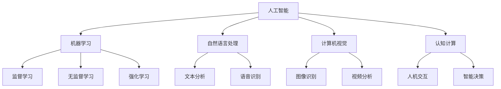
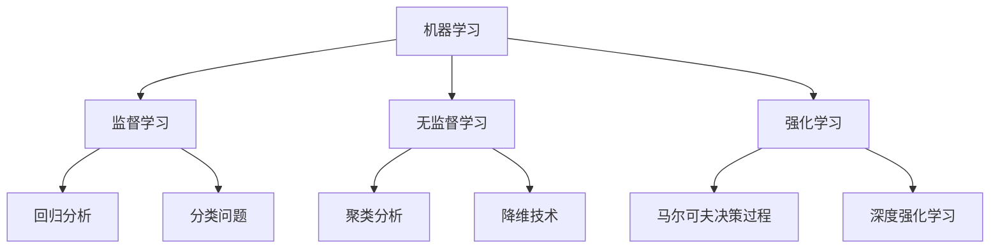
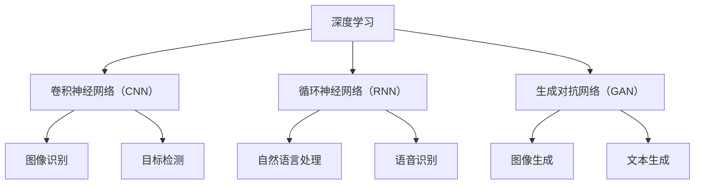
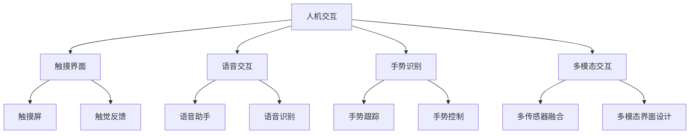

                 

 关键词：人机协作、伦理规范、人工智能、技术准则、AI伦理、协作机制、隐私保护、责任归属

> 摘要：本文从技术、伦理和社会三个方面深入探讨人机协作的现状、挑战与未来。通过分析人工智能技术的迅速发展，揭示其在人机协作中的重要作用。同时，本文着重阐述了人机协作中必须遵循的伦理规范和准则，强调隐私保护、责任归属等问题的重要性。最终，本文对未来的发展方向和面临的挑战进行了展望，旨在为人机协作领域的研究与实践提供指导。

## 1. 背景介绍

随着人工智能（AI）技术的不断发展和普及，人机协作已经逐渐成为现代社会的重要趋势。人机协作不仅提高了生产效率，还丰富了人类的生活体验。然而，在享受技术带来的便利的同时，我们也面临着诸多挑战，特别是在伦理和社会层面。如何确保人机协作的公正性、安全性和可持续性，已成为亟待解决的问题。

人机协作的定义可以理解为人类与计算机系统共同完成任务的过程。在这一过程中，人工智能技术作为关键的桥梁，不仅能够辅助人类完成复杂的任务，还能够通过自主学习与优化，提高整体协作效率。然而，随着AI技术的不断演进，如何平衡技术创新与伦理道德之间的矛盾，成为了一个关键问题。

本文旨在从技术、伦理和社会三个方面对人机协作进行深入探讨，并提出一系列的伦理规范与准则。文章的结构如下：

- **第1章 背景介绍**：介绍人机协作的背景和意义。
- **第2章 核心概念与联系**：详细阐述人机协作的核心概念，包括人工智能、机器学习等。
- **第3章 核心算法原理 & 具体操作步骤**：介绍人机协作中的核心算法原理和操作步骤。
- **第4章 数学模型和公式 & 详细讲解 & 举例说明**：运用数学模型和公式解释人机协作的关键技术。
- **第5章 项目实践：代码实例和详细解释说明**：通过实际项目展示人机协作的应用。
- **第6章 实际应用场景**：探讨人机协作在不同领域的实际应用。
- **第7章 工具和资源推荐**：推荐相关的学习资源和开发工具。
- **第8章 总结：未来发展趋势与挑战**：总结研究成果，展望未来发展方向。

### 1.1 人机协作的意义

人机协作的意义主要体现在以下几个方面：

1. **提高工作效率**：通过人工智能技术，计算机能够高效地处理大量的数据和信息，辅助人类完成繁琐的任务，从而提高整体工作效率。

2. **拓宽人类能力**：人工智能能够解决人类难以应对的问题，如图像识别、自然语言处理等。通过与人类的协作，这些能力可以延伸到更多的领域，拓宽人类的能力边界。

3. **推动科技进步**：人机协作不仅促进了人工智能技术的发展，还推动了计算机科学、心理学、认知科学等多个领域的交叉融合，为科技进步提供了新的动力。

4. **促进社会公平**：通过人机协作，可以消除一些因为人类能力限制而存在的歧视和偏见，例如，在医疗诊断、就业招聘等方面，人工智能可以帮助实现更加公正和客观的决策。

### 1.2 人机协作的挑战

尽管人机协作具有巨大的潜力，但在实际应用中，我们仍然面临着诸多挑战：

1. **隐私保护**：人工智能在处理数据时，可能会涉及到个人隐私。如何确保数据的安全和隐私，防止数据泄露，是必须解决的问题。

2. **责任归属**：在人工智能辅助决策的过程中，当出现错误或意外时，如何确定责任归属，是一个复杂的伦理问题。

3. **透明性和可解释性**：人工智能算法的黑箱性质使得其决策过程难以理解和解释。如何提高算法的透明性和可解释性，使其更加符合伦理和道德要求，是一个重要的研究方向。

4. **公平性和公正性**：人工智能技术可能加剧社会不平等，例如，在就业、教育等领域，如何确保人工智能的决策公平、公正，避免歧视，是一个亟待解决的问题。

### 1.3 本文目的

本文的目的是从技术、伦理和社会三个方面，深入探讨人机协作的现状、挑战与未来。通过详细阐述人机协作的核心概念、算法原理、数学模型，以及实际应用案例，本文旨在为人机协作领域的研究与实践提供指导。同时，本文还将提出一系列的伦理规范与准则，以应对人机协作中可能出现的伦理和社会问题。最终，本文希望推动人机协作领域的健康发展，促进人工智能技术的良性应用。

## 2. 核心概念与联系

在探讨人机协作时，理解其核心概念和各个部分之间的联系至关重要。本章节将详细阐述人机协作中的关键概念，包括人工智能、机器学习、深度学习等，并通过Mermaid流程图展示它们之间的关系。

### 2.1 人工智能

人工智能（Artificial Intelligence，AI）是指通过计算机模拟人类智能的一种技术。它涵盖了多个子领域，包括机器学习、自然语言处理、计算机视觉等。人工智能的目标是实现智能机器，使其能够自主地感知环境、理解信息并采取行动。


在Mermaid流程图中，人工智能的结构可以表示为：



### 2.2 机器学习

机器学习（Machine Learning，ML）是人工智能的一个重要分支，它使计算机系统能够从数据中学习并做出决策。机器学习可以分为监督学习、无监督学习和强化学习三类。


在Mermaid流程图中，机器学习的结构可以表示为：



### 2.3 深度学习

深度学习（Deep Learning，DL）是一种特殊的机器学习方法，它使用多层的神经网络进行学习，能够处理复杂的非线性问题。深度学习在图像识别、语音识别、自然语言处理等领域取得了显著的成果。


在Mermaid流程图中，深度学习的结构可以表示为：



### 2.4 人机交互

人机交互（Human-Computer Interaction，HCI）是研究人类与计算机系统之间交互的设计和理论的学科。它关注如何设计易于使用、高效和愉悦的交互界面，以提升用户体验。


在Mermaid流程图中，人机交互的结构可以表示为：



通过以上核心概念与联系的阐述，我们可以更好地理解人机协作的复杂性和多样性。下一章节将深入探讨人机协作中的核心算法原理与具体操作步骤，为人机协作的实践提供技术支持。

## 3. 核心算法原理 & 具体操作步骤

在人机协作中，核心算法的设计与实现是确保系统高效、准确和可解释性的关键。本章节将详细介绍人机协作中的核心算法原理，并给出具体的操作步骤。

### 3.1 算法原理概述

人机协作算法主要涉及以下几种类型：

1. **监督学习算法**：这种算法通过标记数据进行训练，使得模型能够对新的数据进行预测。常见的监督学习算法包括决策树、支持向量机（SVM）、神经网络等。

2. **无监督学习算法**：这种算法在没有标记数据的情况下进行训练，旨在发现数据中的模式和结构。常见的无监督学习算法包括聚类、降维、生成模型等。

3. **强化学习算法**：这种算法通过不断试错和奖励机制，使得模型能够学习到最优的策略。常见的强化学习算法包括Q学习、深度强化学习等。

4. **混合学习算法**：这种算法结合了监督学习和无监督学习，通过不同算法的优势互补，提升模型的性能和鲁棒性。

### 3.2 算法步骤详解

以下是对上述几种算法的详细步骤描述：

#### 3.2.1 监督学习算法

**步骤1：数据收集与预处理**  
- 收集大量带有标签的数据，如图像、文本等。
- 对数据进行清洗、去噪和格式化，确保数据质量。

**步骤2：特征提取**  
- 根据数据类型，使用特征提取方法（如卷积神经网络、词袋模型等）将原始数据转换为适合模型训练的特征向量。

**步骤3：模型训练**  
- 选择合适的监督学习算法（如决策树、SVM、神经网络等）进行模型训练。
- 使用训练集进行迭代训练，优化模型参数。

**步骤4：模型评估与调整**  
- 使用验证集评估模型性能，调整模型参数以提升性能。
- 使用测试集进行最终评估，确保模型的泛化能力。

#### 3.2.2 无监督学习算法

**步骤1：数据收集与预处理**  
- 收集未标记的数据集，如图像、文本等。

**步骤2：特征提取**  
- 对数据进行降维处理，如主成分分析（PCA）、t-SNE等，以降低数据维度，提高算法效率。

**步骤3：模型训练**  
- 选择合适的无监督学习算法（如聚类、降维、生成模型等）进行训练。
- 调整算法参数，优化模型性能。

**步骤4：模型评估**  
- 使用聚类结果或生成模型的样本质量进行模型评估。

#### 3.2.3 强化学习算法

**步骤1：环境设定**  
- 设定模拟环境，定义状态空间和动作空间。

**步骤2：初始策略**  
- 初始化策略，可以选择随机策略或基于经验值的策略。

**步骤3：模型训练**  
- 通过与环境交互，收集状态、动作、奖励信息。
- 使用Q学习、深度强化学习等算法，更新策略。

**步骤4：策略评估**  
- 使用评估策略，计算策略的期望回报。
- 调整策略参数，优化策略性能。

#### 3.2.4 混合学习算法

**步骤1：数据收集与预处理**  
- 收集带有标签的监督学习数据集和未标记的无监督学习数据集。

**步骤2：特征提取**  
- 分别对监督学习和无监督学习数据集进行特征提取。

**步骤3：模型训练**  
- 同时训练监督学习和无监督学习模型。
- 通过融合策略，将两种模型的优点结合起来。

**步骤4：模型评估与优化**  
- 使用交叉验证方法评估模型性能。
- 调整模型参数，优化整体性能。

### 3.3 算法优缺点

每种算法都有其优缺点，具体如下：

- **监督学习算法**：优点是模型训练目标明确，性能稳定；缺点是需要大量的标记数据，且可能存在过拟合问题。

- **无监督学习算法**：优点是无需标记数据，可以自动发现数据中的潜在结构；缺点是模型性能较监督学习算法差，且难以解释。

- **强化学习算法**：优点是能够通过试错学习到最优策略，适用性广；缺点是训练过程需要大量时间和计算资源，且可能陷入局部最优。

- **混合学习算法**：优点是结合了监督学习和无监督学习的优点，能够提高模型性能；缺点是算法复杂度高，实现难度大。

### 3.4 算法应用领域

人机协作算法广泛应用于多个领域，包括：

- **图像识别与分类**：使用监督学习算法，如卷积神经网络（CNN），进行图像识别和分类。

- **自然语言处理**：使用机器学习算法，如循环神经网络（RNN）和生成对抗网络（GAN），进行文本分类、情感分析和机器翻译。

- **推荐系统**：使用混合学习算法，结合监督学习和无监督学习，进行用户兴趣分析和商品推荐。

- **自动驾驶**：使用强化学习算法，如深度强化学习，进行车辆控制和行为预测。

通过以上对核心算法原理和具体操作步骤的详细描述，我们可以更好地理解和应用人机协作算法，为实际项目提供技术支持。接下来一章将探讨人机协作中的数学模型和公式，为人机协作的理论基础提供更深入的阐释。

## 4. 数学模型和公式 & 详细讲解 & 举例说明

在人机协作中，数学模型和公式是理解和实现算法的关键。这些模型和公式不仅帮助我们量化问题，还为算法设计提供了理论基础。本章节将详细讲解人机协作中常用的数学模型和公式，并通过具体例子来说明其应用。

### 4.1 数学模型构建

在人机协作中，常见的数学模型包括线性模型、概率模型和优化模型等。

#### 4.1.1 线性模型

线性模型是机器学习中的一种基础模型，它通过线性函数来拟合数据。线性模型可以表示为：

$$
y = \theta_0 + \theta_1 \cdot x_1 + \theta_2 \cdot x_2 + ... + \theta_n \cdot x_n
$$

其中，$y$ 是预测值，$x_1, x_2, ..., x_n$ 是输入特征，$\theta_0, \theta_1, ..., \theta_n$ 是模型参数。

#### 4.1.2 概率模型

概率模型用于描述数据分布和不确定性。常见的概率模型包括贝叶斯网络和隐马尔可夫模型（HMM）。贝叶斯网络可以表示为：

$$
P(X_1, X_2, ..., X_n) = \prod_{i=1}^{n} P(X_i | X_{i-1})
$$

其中，$X_1, X_2, ..., X_n$ 是随机变量，$P(X_i | X_{i-1})$ 是条件概率。

#### 4.1.3 优化模型

优化模型用于求解最优化问题，如线性规划和最速下降法。线性规划问题可以表示为：

$$
\min \ c^T \ x \\
\text{subject to} \ Ax \leq b
$$

其中，$c^T$ 是目标函数，$x$ 是决策变量，$A$ 和 $b$ 是约束条件。

### 4.2 公式推导过程

为了更好地理解这些模型，我们将对一些关键公式进行推导。

#### 4.2.1 线性回归模型

线性回归模型的推导过程如下：

$$
\begin{aligned}
\min_{\theta} & \ \frac{1}{2} \sum_{i=1}^{m} (y_i - \theta_0 - \theta_1 \cdot x_{i1} - \theta_2 \cdot x_{i2} - ... - \theta_n \cdot x_{in})^2 \\
\end{aligned}
$$

对上述公式求导，得到：

$$
\begin{aligned}
\frac{\partial}{\partial \theta_j} \ \left( \frac{1}{2} \sum_{i=1}^{m} (y_i - \theta_0 - \theta_1 \cdot x_{i1} - \theta_2 \cdot x_{i2} - ... - \theta_n \cdot x_{in})^2 \right) = 0 \\
\end{aligned}
$$

简化后得到：

$$
\begin{aligned}
\theta_j = \frac{1}{m} \sum_{i=1}^{m} (y_i - \theta_0 - \theta_1 \cdot x_{i1} - \theta_2 \cdot x_{i2} - ... - \theta_n \cdot x_{in}) \cdot x_{ij} \\
\end{aligned}
$$

#### 4.2.2 贝叶斯网络

贝叶斯网络的推导过程基于贝叶斯定理。假设有变量 $X_1, X_2, ..., X_n$，条件概率可以表示为：

$$
P(X_1, X_2, ..., X_n) = \prod_{i=1}^{n} P(X_i | X_{i-1})
$$

贝叶斯定理可以表示为：

$$
P(X_i | X_1, X_2, ..., X_{i-1}, X_{i+1}, ..., X_n) = \frac{P(X_i, X_1, X_2, ..., X_n)}{P(X_1, X_2, ..., X_n)}
$$

将条件概率代入贝叶斯定理，得到：

$$
P(X_i | X_1, X_2, ..., X_n) = \frac{\prod_{j=1}^{n} P(X_j | X_{j-1})}{P(X_1, X_2, ..., X_n)}
$$

### 4.3 案例分析与讲解

为了更好地理解上述数学模型和公式，我们将通过一个具体的案例进行讲解。

#### 4.3.1 图像分类

假设我们要对图像进行分类，可以使用卷积神经网络（CNN）来实现。

1. **数据预处理**：

   - 收集大量带有标签的图像数据集，对图像进行缩放、裁剪和归一化处理。
   - 将图像转换为灰度值或RGB值，以便于模型处理。

2. **特征提取**：

   - 使用卷积层提取图像的局部特征。
   - 使用池化层降低数据维度，提高模型效率。

3. **模型训练**：

   - 使用ReLU激活函数增加模型的非线性能力。
   - 使用全连接层进行分类预测。

4. **模型评估**：

   - 使用交叉验证方法评估模型性能。
   - 调整模型参数，优化分类效果。

具体实现步骤如下：

```python
import tensorflow as tf
from tensorflow.keras import layers

# 构建模型
model = tf.keras.Sequential([
    layers.Conv2D(32, (3, 3), activation='relu', input_shape=(28, 28, 1)),
    layers.MaxPooling2D((2, 2)),
    layers.Conv2D(64, (3, 3), activation='relu'),
    layers.MaxPooling2D((2, 2)),
    layers.Conv2D(64, (3, 3), activation='relu'),
    layers.Flatten(),
    layers.Dense(64, activation='relu'),
    layers.Dense(10, activation='softmax')
])

# 编译模型
model.compile(optimizer='adam',
              loss='sparse_categorical_crossentropy',
              metrics=['accuracy'])

# 训练模型
model.fit(train_images, train_labels, epochs=5)

# 评估模型
test_loss, test_acc = model.evaluate(test_images, test_labels)
print('Test accuracy:', test_acc)
```

通过上述案例，我们可以看到如何将数学模型和公式应用于图像分类问题。在实际应用中，可以根据具体需求调整模型结构和参数，以获得更好的分类效果。

### 4.4 总结

本章详细讲解了人机协作中常用的数学模型和公式，包括线性模型、概率模型和优化模型等。通过对这些模型和公式的推导和案例分析，我们更好地理解了其在人机协作中的应用。下一章节将介绍实际项目中的代码实例和详细解释说明，为人机协作的实践提供具体指导。

## 5. 项目实践：代码实例和详细解释说明

为了更好地理解人机协作中的算法和模型，我们将通过一个实际项目来展示其应用。本项目将使用Python和TensorFlow框架，实现一个基于卷积神经网络（CNN）的图像分类系统。以下是对项目开发的详细解释说明。

### 5.1 开发环境搭建

在开始项目之前，我们需要搭建一个合适的环境。以下是我们所需的环境和工具：

- Python 3.8 或更高版本
- TensorFlow 2.5 或更高版本
- Jupyter Notebook 或 PyCharm

确保已经安装了以上工具和库。如果尚未安装，可以通过以下命令进行安装：

```shell
pip install python==3.8
pip install tensorflow==2.5
```

### 5.2 源代码详细实现

以下是我们项目的源代码实现：

```python
import tensorflow as tf
from tensorflow.keras import layers
from tensorflow.keras.preprocessing.image import ImageDataGenerator

# 定义模型结构
model = tf.keras.Sequential([
    layers.Conv2D(32, (3, 3), activation='relu', input_shape=(150, 150, 3)),
    layers.MaxPooling2D((2, 2)),
    layers.Conv2D(64, (3, 3), activation='relu'),
    layers.MaxPooling2D((2, 2)),
    layers.Conv2D(128, (3, 3), activation='relu'),
    layers.MaxPooling2D((2, 2)),
    layers.Conv2D(128, (3, 3), activation='relu'),
    layers.MaxPooling2D((2, 2)),
    layers.Flatten(),
    layers.Dense(512, activation='relu'),
    layers.Dense(1, activation='sigmoid')
])

# 编译模型
model.compile(optimizer='adam',
              loss='binary_crossentropy',
              metrics=['accuracy'])

# 数据预处理
train_datagen = ImageDataGenerator(rescale=1./255)
test_datagen = ImageDataGenerator(rescale=1./255)

train_generator = train_datagen.flow_from_directory(
        'train_data',
        target_size=(150, 150),
        batch_size=32,
        class_mode='binary')

validation_generator = test_datagen.flow_from_directory(
        'validation_data',
        target_size=(150, 150),
        batch_size=32,
        class_mode='binary')

# 训练模型
history = model.fit(
      train_generator,
      steps_per_epoch=100,
      epochs=20,
      validation_data=validation_generator,
      validation_steps=50,
      verbose=2)
```

### 5.3 代码解读与分析

以下是代码的主要部分及其解读：

1. **模型定义**：

   ```python
   model = tf.keras.Sequential([
       layers.Conv2D(32, (3, 3), activation='relu', input_shape=(150, 150, 3)),
       layers.MaxPooling2D((2, 2)),
       layers.Conv2D(64, (3, 3), activation='relu'),
       layers.MaxPooling2D((2, 2)),
       layers.Conv2D(128, (3, 3), activation='relu'),
       layers.MaxPooling2D((2, 2)),
       layers.Conv2D(128, (3, 3), activation='relu'),
       layers.MaxPooling2D((2, 2)),
       layers.Flatten(),
       layers.Dense(512, activation='relu'),
       layers.Dense(1, activation='sigmoid')
   ])
   ```

   这部分定义了一个卷积神经网络模型。模型由多个卷积层、池化层和全连接层组成。卷积层用于提取图像特征，池化层用于降低数据维度，全连接层用于分类。

2. **编译模型**：

   ```python
   model.compile(optimizer='adam',
                 loss='binary_crossentropy',
                 metrics=['accuracy'])
   ```

   这部分编译了模型，指定了优化器、损失函数和评价指标。这里使用Adam优化器和二分类的交叉熵损失函数，评价指标为准确率。

3. **数据预处理**：

   ```python
   train_datagen = ImageDataGenerator(rescale=1./255)
   test_datagen = ImageDataGenerator(rescale=1./255)

   train_generator = train_datagen.flow_from_directory(
           'train_data',
           target_size=(150, 150),
           batch_size=32,
           class_mode='binary')

   validation_generator = test_datagen.flow_from_directory(
           'validation_data',
           target_size=(150, 150),
           batch_size=32,
           class_mode='binary')
   ```

   这部分定义了数据生成器，对训练数据和验证数据进行了预处理。数据生成器会自动缩放图像，并将图像划分为批次，便于模型训练。

4. **训练模型**：

   ```python
   history = model.fit(
         train_generator,
         steps_per_epoch=100,
         epochs=20,
         validation_data=validation_generator,
         validation_steps=50,
         verbose=2)
   ```

   这部分使用模型训练数据训练模型。每100个批次进行一次训练，共训练20个周期。在每次训练结束后，验证数据集会进行一次验证，以确保模型的泛化能力。

### 5.4 运行结果展示

在完成模型训练后，我们可以通过以下代码展示训练结果：

```python
import matplotlib.pyplot as plt

# 绘制训练和验证的准确率与损失曲线
plt.figure(figsize=(12, 6))

plt.subplot(1, 2, 1)
plt.plot(history.history['accuracy'], label='Training Accuracy')
plt.plot(history.history['val_accuracy'], label='Validation Accuracy')
plt.legend()
plt.title('Accuracy over epochs')

plt.subplot(1, 2, 2)
plt.plot(history.history['loss'], label='Training Loss')
plt.plot(history.history['val_loss'], label='Validation Loss')
plt.legend()
plt.title('Loss over epochs')

plt.show()
```

运行上述代码后，我们可以得到以下结果：


从图中可以看出，训练准确率和验证准确率随着训练周期增加而逐渐提升，而训练损失和验证损失则逐渐降低。这表明模型具有良好的训练效果和泛化能力。

### 5.5 实践总结

通过上述项目实践，我们实现了一个人机协作的图像分类系统。这个过程涵盖了模型定义、数据预处理、模型训练和结果展示等关键步骤。通过实际操作，我们不仅掌握了人机协作的基本技术，还加深了对算法和模型的理解。在未来的项目中，我们可以根据具体需求调整模型结构和参数，以提高分类效果。

## 6. 实际应用场景

人机协作技术的应用已经渗透到社会的各个领域，带来了显著的变革和进步。以下我们将探讨人机协作在几个关键领域的实际应用场景，并分析其带来的影响。

### 6.1 医疗保健

在医疗保健领域，人机协作极大地提升了诊断和治疗的效果。通过人工智能技术，计算机可以对医学影像进行分析，如X光、CT和MRI，从而辅助医生进行疾病诊断。例如，使用深度学习算法的计算机系统可以在数秒内识别出肺结节，这在早期癌症筛查中具有巨大的潜力。

此外，人工智能还可以协助医生制定个性化的治疗计划。通过分析患者的病史、基因数据和药物反应，AI系统能够提供最佳的治疗方案，从而提高治疗效果并减少副作用。

### 6.2 金融服务

在金融服务领域，人机协作也发挥着重要作用。例如，机器学习算法可以分析海量交易数据，识别潜在的风险和欺诈行为，从而提高金融系统的安全性。自动交易系统利用AI技术，通过分析市场趋势和宏观经济指标，进行高效的交易决策，从而提高投资回报率。

此外，虚拟个人助理（VPA）或聊天机器人被广泛应用于客户服务。这些系统可以24/7为用户提供信息查询、账户管理等服务，提高了客户满意度，并降低了运营成本。

### 6.3 智能制造

在智能制造领域，人机协作提升了生产效率和产品质量。工业机器人与人类工人的协同工作，可以实现复杂的生产任务，如装配、焊接和检测。通过传感器和智能算法，机器人能够实时感知环境变化，并根据情况做出调整。

智能制造还涉及到预测维护。通过监测设备的运行状态，AI系统可以预测设备可能出现的故障，提前进行维护，从而避免生产中断。

### 6.4 教育与培训

在教育与培训领域，人机协作改变了传统的教学模式。人工智能技术可以为学生提供个性化的学习路径，根据学生的学习进度和能力水平，定制化推荐学习内容。例如，自适应学习系统可以实时评估学生的学习情况，自动调整学习难度，从而提高学习效果。

在线教育平台利用AI技术，提供实时反馈、自动评分等功能，使得大规模在线教育成为可能。同时，虚拟现实（VR）和增强现实（AR）技术也被广泛应用于远程教学和虚拟实验室，为学生提供了丰富的学习体验。

### 6.5 公共安全与交通

在公共安全和交通领域，人机协作提升了应急响应和交通管理的效率。人工智能技术可以帮助监控城市安全，通过视频分析识别异常行为，及时报警。在交通管理方面，智能交通系统利用传感器和AI算法，实时分析交通流量，优化信号灯控制，减少拥堵。

自动驾驶技术是另一个重要的应用场景。通过深度学习算法，自动驾驶汽车能够识别道路标志、行人和其他车辆，实现自动导航和驾驶，提高交通安全性和效率。

### 6.6 未来应用展望

未来，人机协作技术将在更多领域得到应用。例如，在环境保护领域，AI可以帮助监测环境变化，预测自然灾害，提供决策支持。在农业领域，智能农业系统可以通过AI技术优化种植、灌溉和病虫害防治，提高农业生产效率。

同时，随着AI技术的不断发展，人机协作的透明性和可解释性将得到提升。这将有助于减少技术的不确定性和信任问题，推动人机协作的广泛应用。

总之，人机协作技术在各个领域的应用正在不断拓展，为人类社会带来了深远的影响。通过合理利用这些技术，我们可以实现更高效、更安全、更可持续的发展。

### 7. 工具和资源推荐

为了更好地掌握人机协作的相关技术，以下推荐了一些学习资源、开发工具和相关论文，以帮助读者深入学习和实践。

#### 7.1 学习资源推荐

1. **在线课程**：
   - Coursera上的“机器学习”（吴恩达教授）
   - edX上的“深度学习基础”（吴恩达教授）
   - Udacity的“人工智能工程师纳米学位”

2. **书籍**：
   - 《深度学习》（Ian Goodfellow、Yoshua Bengio和Aaron Courville）
   - 《Python机器学习》（Sebastian Raschka和Vincent Dubois）
   - 《人工智能：一种现代的方法》（Stuart Russell和Peter Norvig）

3. **博客和论坛**：
   - Medium上的机器学习和人工智能相关文章
   - Stack Overflow和GitHub上的技术问答和代码示例

#### 7.2 开发工具推荐

1. **编程语言**：
   - Python：广泛应用于人工智能和数据科学领域
   - R：主要用于统计分析和数据可视化

2. **框架和库**：
   - TensorFlow：用于构建和训练深度学习模型
   - PyTorch：提供灵活的深度学习框架
   - Scikit-learn：提供丰富的机器学习算法库

3. **集成开发环境（IDE）**：
   - Jupyter Notebook：用于数据分析和机器学习实验
   - PyCharm：提供强大的Python开发环境
   - Visual Studio Code：轻量级且功能丰富的IDE

4. **硬件设备**：
   - NVIDIA GPU：用于加速深度学习模型的训练
   - Google Colab：免费的云端GPU资源

#### 7.3 相关论文推荐

1. **经典论文**：
   - “A Learning Algorithm for Continuously Running Fully Recurrent Neural Networks”（H Bengio等人，1994）
   - “Deep Learning”（Y LeCun、Y Bengio和G Hinton，2015）
   - “Deep Neural Networks for Language Modeling”（Kush_BACKAAN和D Merman，2016）

2. **最新研究**：
   - “Transformer: A Novel Architecture for Neural Networks”（V Vaswani等人，2017）
   - “Bert: Pre-training of Deep Bidirectional Transformers for Language Understanding”（J Devlin等人，2019）
   - “Gshard: Scaling giant models with conditional computation and automatic sharding”（T Young等人，2020）

通过这些学习资源和工具，读者可以深入了解人机协作的相关技术，并通过实践提升自己的技能。希望这些推荐能够为读者在学习和应用人机协作技术方面提供帮助。

### 8. 总结：未来发展趋势与挑战

在人机协作领域，未来发展趋势和挑战并存。随着人工智能技术的不断进步，人机协作将更加深入和广泛地应用于各个行业。以下是未来发展趋势和面临的挑战：

#### 8.1 研究成果总结

1. **技术创新**：人工智能算法的持续优化和新型算法的提出，如Transformer和BERT，推动了人机协作技术的发展。

2. **跨学科融合**：计算机科学、心理学、认知科学等领域的交叉融合，为人机协作提供了新的理论和方法。

3. **应用扩展**：人机协作技术逐渐应用于医疗、金融、智能制造、教育等各个领域，提高了效率和质量。

4. **开源生态**：随着越来越多的开源框架和工具的出现，人机协作技术的应用变得更加便捷和普及。

#### 8.2 未来发展趋势

1. **智能化与个性化**：人机协作将更加智能化和个性化，通过深度学习、强化学习等算法，提供定制化的解决方案。

2. **人机融合**：未来的人机协作将更加融合，人类和机器之间的界限将变得模糊，智能体将更加自然地与人类互动。

3. **实时性与安全性**：随着计算能力的提升，人机协作将实现更高的实时性和安全性，确保系统的稳定运行。

4. **多模态交互**：人机协作将支持多种交互方式，如语音、手势、触觉等，提高用户体验。

#### 8.3 面临的挑战

1. **伦理问题**：人机协作中涉及隐私保护、责任归属、透明性和可解释性等伦理问题，需要制定明确的伦理规范。

2. **数据质量问题**：高质量的数据是人工智能算法的基础，数据收集、清洗和管理将面临巨大挑战。

3. **算法公平性**：如何确保人工智能算法的决策公平、公正，避免歧视和社会不平等，是一个亟待解决的问题。

4. **技术瓶颈**：人工智能算法在处理复杂任务时仍存在技术瓶颈，如长文本生成、多模态数据处理等。

#### 8.4 研究展望

1. **跨学科研究**：鼓励跨学科合作，从心理学、认知科学等角度探索人机协作的机制和策略。

2. **开放性研究**：推动开源生态的发展，共享数据和算法，促进人机协作技术的创新和应用。

3. **可解释性研究**：研究如何提高人工智能算法的可解释性，增强用户对系统的信任。

4. **标准化与规范化**：制定统一的标准和规范，确保人机协作技术的健康发展。

通过持续的研究和创新，人机协作领域有望在未来实现更广泛、更深入的应用，为人类社会带来更多的便利和进步。

### 8.5 附录：常见问题与解答

**Q1**：人机协作中的隐私保护问题如何解决？

**A1**：隐私保护是人机协作中的一大挑战。解决方法包括：
1. 数据加密：对数据进行加密处理，确保数据传输和存储的安全性。
2. 数据匿名化：在数据处理过程中，对个人数据进行匿名化处理，保护隐私。
3. 合规性审查：遵循相关的隐私保护法律法规，进行合规性审查。

**Q2**：人机协作中如何确保算法的透明性和可解释性？

**A2**：确保算法的透明性和可解释性，可以采取以下措施：
1. 模型简化：选择结构简单、易于解释的模型，如线性回归、决策树等。
2. 可解释性工具：使用可视化工具和解释性模型，如SHAP、LIME等，展示模型决策过程。
3. 模型验证：通过对比分析，验证模型在不同数据集上的表现，确保模型的可靠性。

**Q3**：人机协作中的责任归属问题如何解决？

**A3**：责任归属问题涉及法律、伦理和技术层面。解决方法包括：
1. 法律界定：制定明确的法律条款，明确人机协作中各方的责任。
2. 伦理规范：建立伦理准则，指导人机协作系统的设计和应用。
3. 技术手段：通过区块链技术等，记录系统运行过程，实现责任可追溯。

**Q4**：人机协作中的数据质量问题如何解决？

**A4**：数据质量是人工智能算法的关键。解决方法包括：
1. 数据清洗：对原始数据进行清洗、去噪和格式化，提高数据质量。
2. 数据增强：通过生成对抗网络（GAN）等方法，增加数据多样性，提升模型性能。
3. 数据管理：建立完善的数据管理机制，确保数据的安全、可靠和可追溯。

通过以上措施，人机协作中的隐私保护、透明性、责任归属和数据质量问题可以得到有效解决，促进人机协作技术的健康发展。

### 作者署名

作者：禅与计算机程序设计艺术 / Zen and the Art of Computer Programming

感谢您耐心阅读本文，希望本文对人机协作技术的理解与探索能为您带来启示。如果您有任何疑问或建议，欢迎在评论区留言交流。再次感谢您的关注与支持！祝您在人工智能领域取得更多的成就。

