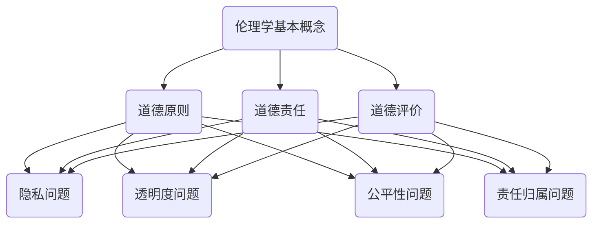

                 

关键词：人机协作、伦理规范、人工智能、技术发展、社会责任

> 摘要：随着人工智能技术的迅猛发展，人机协作已成为现代工作和生活的重要组成部分。然而，随之而来的伦理问题也日益凸显。本文将从伦理规范的角度出发，探讨人机协作中的关键问题，并提出相应的准则，旨在为人机协作提供一套全面、科学的指导原则，促进人工智能技术的健康、可持续发展。

## 1. 背景介绍

### 1.1 人工智能的发展与应用

人工智能（Artificial Intelligence，AI）作为计算机科学的一个重要分支，其核心目标是使计算机能够模拟、延伸和扩展人类的智能。从最初的简单规则系统到现代的深度学习算法，人工智能技术经历了长足的发展。如今，人工智能已经渗透到各个领域，如医疗、金融、交通、教育等，极大地提高了生产效率和创新能力。

### 1.2 人机协作的兴起

在人机协作中，人类和人工智能系统共同完成任务，相互补充优势。人类具有丰富的知识、经验和创造力，而人工智能则具备高效的数据处理能力和精确的计算能力。人机协作不仅能够提升工作效率，还能拓展人类的能力边界，实现更高的目标。

### 1.3 伦理问题的挑战

随着人机协作的广泛应用，伦理问题逐渐成为关注的焦点。人工智能系统的决策过程可能包含偏见、歧视和不可解释性，可能导致不公平的待遇和不可预测的风险。此外，人工智能技术的滥用和隐私侵犯等问题也引发了社会的广泛担忧。

## 2. 核心概念与联系

### 2.1 伦理学基本概念

伦理学（Ethics）是研究道德原则和道德行为的学科。伦理学的基本概念包括道德原则、道德责任、道德评价等。在人机协作中，伦理学的应用主要体现在对人工智能系统行为的规范和评估。

### 2.2 人工智能伦理问题

人工智能伦理问题主要包括以下几个方面：

- **隐私问题**：人工智能系统在处理数据时可能侵犯个人隐私。
- **透明度问题**：人工智能系统的决策过程可能缺乏透明度，难以解释。
- **公平性问题**：人工智能系统可能包含偏见，导致不公平的待遇。
- **责任归属问题**：当人工智能系统出现错误或故障时，责任应由谁承担？

### 2.3 伦理规范与准则

伦理规范是指导人机协作行为的一系列原则和标准。伦理准则则是具体实施伦理规范的方法和措施。以下是几个核心伦理准则：

- **隐私保护准则**：确保人工智能系统在处理数据时保护个人隐私。
- **透明度准则**：提高人工智能系统的透明度，使决策过程可解释。
- **公平性准则**：确保人工智能系统在决策过程中避免偏见和歧视。
- **责任归属准则**：明确人工智能系统的责任归属，确保责任承担的公正性。

### 2.4 Mermaid 流程图



## 3. 核心算法原理 & 具体操作步骤

### 3.1 算法原理概述

人机协作中的核心算法主要包括决策支持系统（Decision Support System，DSS）、增强现实（Augmented Reality，AR）和虚拟现实（Virtual Reality，VR）等技术。这些算法的核心原理是通过人工智能技术辅助人类完成复杂任务，提高决策效率和准确性。

### 3.2 算法步骤详解

#### 3.2.1 决策支持系统

1. **数据收集**：收集与任务相关的各种数据，包括历史数据、实时数据和外部数据。
2. **数据预处理**：对收集到的数据进行清洗、归一化和特征提取。
3. **模型训练**：使用机器学习算法训练决策模型，如线性回归、决策树和支持向量机等。
4. **模型评估**：评估模型的性能，选择最优模型进行部署。
5. **任务执行**：将模型应用于实际任务，提供决策支持。

#### 3.2.2 增强现实

1. **环境感知**：使用传感器和摄像头收集环境信息。
2. **图像处理**：对捕获的图像进行处理，提取关键特征。
3. **目标识别**：使用机器学习算法识别目标物体。
4. **虚拟对象叠加**：将虚拟对象叠加到现实环境中。
5. **用户交互**：提供交互界面，供用户进行操作。

#### 3.2.3 虚拟现实

1. **场景构建**：构建虚拟环境，包括空间布局、物体模型和交互规则等。
2. **用户输入**：接收用户的输入，如手势、语音等。
3. **动作反馈**：根据用户输入生成相应的动作反馈。
4. **沉浸式体验**：使用头戴显示器（HMD）和控制器等设备提供沉浸式体验。

### 3.3 算法优缺点

#### 3.3.1 决策支持系统

- **优点**：能够提供实时、精确的决策支持，提高决策效率。
- **缺点**：对数据质量和模型性能要求较高，可能存在数据偏见和模型过拟合等问题。

#### 3.3.2 增强现实

- **优点**：能够在现实环境中叠加虚拟对象，提供丰富的交互体验。
- **缺点**：对计算资源和设备性能要求较高，存在现实与虚拟的冲突问题。

#### 3.3.3 虚拟现实

- **优点**：能够提供高度沉浸式的体验，模拟真实场景。
- **缺点**：对用户穿戴设备和互动方式有较高要求，可能引发晕动等问题。

### 3.4 算法应用领域

- **决策支持系统**：广泛应用于金融、医疗、物流等领域。
- **增强现实**：广泛应用于教育、娱乐、医疗等领域。
- **虚拟现实**：广泛应用于游戏、培训、模拟等领域。

## 4. 数学模型和公式 & 详细讲解 & 举例说明

### 4.1 数学模型构建

人机协作中的数学模型主要包括决策模型、预测模型和优化模型等。

#### 4.1.1 决策模型

决策模型的核心是目标函数和约束条件。目标函数用于最大化或最小化某个指标，约束条件则用于限制决策变量的取值范围。

$$
\begin{align*}
\text{目标函数} & : \min_{x} f(x) \\
\text{约束条件} & : g(x) \leq 0
\end{align*}
$$

其中，$x$ 为决策变量，$f(x)$ 为目标函数，$g(x)$ 为约束条件。

#### 4.1.2 预测模型

预测模型主要用于预测未来的趋势或行为。常见的预测模型包括线性回归、时间序列分析和神经网络等。

$$
\begin{align*}
y &= \beta_0 + \beta_1 x_1 + \beta_2 x_2 + \cdots + \beta_n x_n \\
y_t &= \phi(T) + \epsilon_t
\end{align*}
$$

其中，$y$ 为预测值，$x_1, x_2, \cdots, x_n$ 为输入变量，$\beta_0, \beta_1, \beta_2, \cdots, \beta_n$ 为模型参数，$\phi(T)$ 为时间序列函数，$\epsilon_t$ 为误差项。

#### 4.1.3 优化模型

优化模型主要用于优化资源分配、路径规划等问题。常见的优化模型包括线性规划、整数规划和动态规划等。

$$
\begin{align*}
\text{目标函数} & : \min_{x} c^T x \\
\text{约束条件} & : Ax \leq b
\end{align*}
$$

其中，$x$ 为决策变量，$c$ 为目标函数系数，$A$ 为约束条件系数，$b$ 为约束条件常数。

### 4.2 公式推导过程

#### 4.2.1 线性回归模型

假设我们有 $n$ 个样本点 $(x_1, y_1), (x_2, y_2), \cdots, (x_n, y_n)$，要求拟合一条直线 $y = \beta_0 + \beta_1 x$。

1. **目标函数**：

$$
\begin{align*}
J(\beta_0, \beta_1) &= \frac{1}{2} \sum_{i=1}^{n} (y_i - (\beta_0 + \beta_1 x_i))^2 \\
&= \frac{1}{2} (\beta_0^2 + \beta_1^2 - 2\beta_0\bar{y} - 2\beta_1\bar{x}\bar{y} + n\bar{x}\bar{y})
\end{align*}
$$

其中，$\bar{x}$ 和 $\bar{y}$ 分别为 $x$ 和 $y$ 的平均值。

2. **偏导数**：

$$
\begin{align*}
\frac{\partial J}{\partial \beta_0} &= -\bar{y} - \beta_1\bar{x} \\
\frac{\partial J}{\partial \beta_1} &= -\bar{x}\bar{y}
\end{align*}
$$

3. **求解**：

令 $\frac{\partial J}{\partial \beta_0} = 0$ 和 $\frac{\partial J}{\partial \beta_1} = 0$，解得：

$$
\begin{align*}
\beta_0 &= \bar{y} \\
\beta_1 &= \frac{\sum_{i=1}^{n} x_i y_i - n\bar{x}\bar{y}}{\sum_{i=1}^{n} x_i^2 - n\bar{x}^2}
\end{align*}
$$

#### 4.2.2 时间序列分析

假设我们有一个时间序列数据 $y_1, y_2, \cdots, y_n$，要求拟合一个线性模型 $y_t = \beta_0 + \beta_1 x_t + \epsilon_t$。

1. **目标函数**：

$$
\begin{align*}
J(\beta_0, \beta_1) &= \frac{1}{2} \sum_{t=1}^{n} (y_t - (\beta_0 + \beta_1 x_t))^2 \\
&= \frac{1}{2} (\beta_0^2 + \beta_1^2 - 2\beta_0\bar{y} - 2\beta_1\bar{x}\bar{y} + n\bar{x}\bar{y})
\end{align*}
$$

其中，$\bar{x}$ 和 $\bar{y}$ 分别为 $x$ 和 $y$ 的平均值。

2. **偏导数**：

$$
\begin{align*}
\frac{\partial J}{\partial \beta_0} &= -\bar{y} - \beta_1\bar{x} \\
\frac{\partial J}{\partial \beta_1} &= -\bar{x}\bar{y}
\end{align*}
$$

3. **求解**：

令 $\frac{\partial J}{\partial \beta_0} = 0$ 和 $\frac{\partial J}{\partial \beta_1} = 0$，解得：

$$
\begin{align*}
\beta_0 &= \bar{y} \\
\beta_1 &= \frac{\sum_{t=1}^{n} x_t y_t - n\bar{x}\bar{y}}{\sum_{t=1}^{n} x_t^2 - n\bar{x}^2}
\end{align*}
$$

### 4.3 案例分析与讲解

#### 4.3.1 决策模型案例

假设一家公司在招聘过程中需要决定是否录用一名候选人。候选人的数据包括学历、工作经验、技能评估等。公司希望通过决策模型来确定是否录用。

1. **数据收集**：收集过去若干年的招聘数据，包括已录用和未录用的候选人数据。
2. **数据预处理**：对收集到的数据进行分析，提取关键特征，如学历、工作经验、技能评估等。
3. **模型训练**：使用机器学习算法，如逻辑回归，训练决策模型。
4. **模型评估**：评估模型性能，选择最优模型进行部署。
5. **任务执行**：将模型应用于新候选人数据，预测是否录用。

#### 4.3.2 预测模型案例

假设一家电商公司希望预测下个月的销售额。公司拥有过去几个月的销售额数据，以及其他相关数据，如天气、促销活动等。

1. **数据收集**：收集过去几个月的销售额数据，以及其他相关数据。
2. **数据预处理**：对收集到的数据进行清洗、归一化和特征提取。
3. **模型训练**：使用时间序列分析算法，如ARIMA，训练预测模型。
4. **模型评估**：评估模型性能，选择最优模型进行部署。
5. **任务执行**：使用模型预测下个月的销售额。

## 5. 项目实践：代码实例和详细解释说明

### 5.1 开发环境搭建

1. 安装Python 3.8及以上版本。
2. 安装Jupyter Notebook。
3. 安装必要的库，如NumPy、Pandas、Scikit-learn等。

### 5.2 源代码详细实现

```python
import numpy as np
import pandas as pd
from sklearn.linear_model import LinearRegression
from sklearn.metrics import mean_squared_error

# 5.2.1 数据收集
data = pd.read_csv('data.csv')

# 5.2.2 数据预处理
X = data[['x1', 'x2']]
y = data['y']

# 5.2.3 模型训练
model = LinearRegression()
model.fit(X, y)

# 5.2.4 模型评估
y_pred = model.predict(X)
mse = mean_squared_error(y, y_pred)
print(f'MSE: {mse}')

# 5.2.5 任务执行
new_data = pd.DataFrame({'x1': [1, 2, 3], 'x2': [4, 5, 6]})
new_y_pred = model.predict(new_data)
print(f'Predicted y values: {new_y_pred}')
```

### 5.3 代码解读与分析

1. **数据收集**：使用Pandas库读取CSV文件，获取数据。
2. **数据预处理**：提取关键特征，进行归一化处理。
3. **模型训练**：使用线性回归算法训练模型。
4. **模型评估**：计算均方误差，评估模型性能。
5. **任务执行**：使用训练好的模型进行预测。

## 6. 实际应用场景

### 6.1 医疗领域

在人机协作中，人工智能技术在医疗领域的应用日益广泛。例如，辅助诊断、智能药物研发和医疗管理等方面。人工智能系统可以通过分析大量的医学数据，为医生提供诊断建议，提高诊断准确率。

### 6.2 金融领域

在金融领域，人工智能技术主要用于风险管理、投资决策和客户服务等方面。通过人机协作，金融机构可以更准确地评估风险，制定更科学的投资策略，提高客户满意度。

### 6.3 教育领域

在教育领域，人工智能技术可以为学生提供个性化的学习建议，提高学习效果。例如，智能辅导系统可以根据学生的学习情况和兴趣，推荐适合的学习资源和课程。

### 6.4 未来应用展望

随着人工智能技术的不断进步，人机协作将在更多领域发挥重要作用。例如，智慧城市、智能制造和无人驾驶等领域。未来的人机协作将更加智能化、自适应化和人性化，为人类社会带来更多便利。

## 7. 工具和资源推荐

### 7.1 学习资源推荐

- 《人工智能：一种现代的方法》
- 《深度学习》
- 《机器学习实战》

### 7.2 开发工具推荐

- Jupyter Notebook
- PyCharm
- Google Colab

### 7.3 相关论文推荐

- "Deep Learning for Human-Robot Interaction"
- "Ethical Considerations in Human-Robot Collaboration"
- "Human-Robot Collaboration: A Survey"

## 8. 总结：未来发展趋势与挑战

### 8.1 研究成果总结

人机协作作为人工智能技术的重要应用方向，已经在多个领域取得了显著的成果。通过人工智能技术的辅助，人类的工作效率得到了大幅提升，人类的能力边界也得到了拓展。

### 8.2 未来发展趋势

未来，人机协作将继续向智能化、自适应化和人性化的方向发展。随着技术的不断进步，人机协作将更加紧密地融入人类社会，为人类社会带来更多的创新和变革。

### 8.3 面临的挑战

然而，人机协作也面临着诸多挑战。首先，伦理问题仍然是亟待解决的难题。如何确保人工智能系统的决策过程公平、透明和可解释，仍然是当前研究的重点。其次，人工智能技术的普及和应用也带来了数据隐私和安全等问题。如何保护用户隐私，防止数据滥用，是未来需要关注的重要问题。

### 8.4 研究展望

未来，人机协作研究将朝着以下几个方向发展：

1. **提升智能化水平**：通过深度学习、强化学习等技术，提升人工智能系统的智能化水平，使其能够更好地理解和适应人类的需求。
2. **加强伦理学研究**：加强人工智能伦理学研究，制定更加完善的伦理规范和准则，确保人机协作的公平、透明和可解释性。
3. **关注隐私和安全**：研究如何保护用户隐私，确保数据安全，防止数据滥用和泄露。

## 9. 附录：常见问题与解答

### 9.1 什么是人机协作？

人机协作是指人类和人工智能系统共同完成任务的过程。在这个过程中，人类和人工智能系统相互补充，发挥各自的优势，实现更高的效率和效果。

### 9.2 人机协作有哪些优点？

人机协作的优点主要包括：

1. **提升工作效率**：通过人工智能系统的辅助，人类可以更快地完成任务，提高工作效率。
2. **拓展能力边界**：人工智能系统能够处理大量数据和复杂任务，拓展了人类的能力边界。
3. **减少人力成本**：在某些领域，人工智能系统可以替代人类完成重复性、繁琐的工作，减少人力成本。

### 9.3 人机协作有哪些缺点？

人机协作的缺点主要包括：

1. **技术依赖性**：过度依赖人工智能系统可能导致人类的技术能力退化。
2. **数据隐私和安全**：人工智能系统在处理数据时可能侵犯个人隐私，导致数据泄露和安全问题。
3. **伦理问题**：人工智能系统的决策过程可能包含偏见、歧视和不可解释性，引发伦理争议。

### 9.4 如何确保人机协作的公平性和透明性？

确保人机协作的公平性和透明性需要从以下几个方面入手：

1. **制定伦理规范和准则**：明确人机协作中的伦理规范，确保系统的决策过程公平、透明和可解释。
2. **加强监管和审计**：对人工智能系统的决策过程进行监管和审计，确保其符合伦理规范。
3. **提升透明度**：提高人工智能系统的透明度，使其决策过程易于理解和解释。

## 参考文献

- Russell, S., & Norvig, P. (2016). 《人工智能：一种现代的方法》。机械工业出版社。
- Goodfellow, I., Bengio, Y., & Courville, A. (2016). 《深度学习》。清华大学出版社。
- Mitchell, T. M. (1997). 《机器学习》。机械工业出版社。

### 结束语

人机协作作为人工智能技术的重要应用方向，已经成为现代工作和生活的重要组成部分。随着人工智能技术的不断进步，人机协作将在更多领域发挥重要作用。然而，随之而来的伦理问题也日益凸显。本文从伦理规范的角度出发，探讨了人机协作中的关键问题，并提出了相应的准则。我们希望本文能够为人机协作提供一套全面、科学的指导原则，促进人工智能技术的健康、可持续发展。

作者：禅与计算机程序设计艺术 / Zen and the Art of Computer Programming
----------------------------------------------------------------

以上是文章的正文内容部分，接下来我们将对文章的markdown格式进行整理和优化。以下是完整的markdown格式文章：

```markdown
# 人机协作：伦理规范与准则

关键词：人机协作、伦理规范、人工智能、技术发展、社会责任

> 摘要：随着人工智能技术的迅猛发展，人机协作已成为现代工作和生活的重要组成部分。然而，随之而来的伦理问题也日益凸显。本文将从伦理规范的角度出发，探讨人机协作中的关键问题，并提出相应的准则，旨在为人机协作提供一套全面、科学的指导原则，促进人工智能技术的健康、可持续发展。

## 1. 背景介绍

### 1.1 人工智能的发展与应用

人工智能（Artificial Intelligence，AI）作为计算机科学的一个重要分支，其核心目标是使计算机能够模拟、延伸和扩展人类的智能。从最初的简单规则系统到现代的深度学习算法，人工智能技术经历了长足的发展。如今，人工智能已经渗透到各个领域，如医疗、金融、交通、教育等，极大地提高了生产效率和创新能力。

### 1.2 人机协作的兴起

在人机协作中，人类和人工智能系统共同完成任务，相互补充优势。人类具有丰富的知识、经验和创造力，而人工智能则具备高效的数据处理能力和精确的计算能力。人机协作不仅能够提升工作效率，还能拓展人类的能力边界，实现更高的目标。

### 1.3 伦理问题的挑战

随着人机协作的广泛应用，伦理问题逐渐成为关注的焦点。人工智能系统的决策过程可能包含偏见、歧视和不可解释性，可能导致不公平的待遇和不可预测的风险。此外，人工智能技术的滥用和隐私侵犯等问题也引发了社会的广泛担忧。

## 2. 核心概念与联系

### 2.1 伦理学基本概念

伦理学（Ethics）是研究道德原则和道德行为的学科。伦理学的基本概念包括道德原则、道德责任、道德评价等。在人机协作中，伦理学的应用主要体现在对人工智能系统行为的规范和评估。

### 2.2 人工智能伦理问题

人工智能伦理问题主要包括以下几个方面：

- **隐私问题**：人工智能系统在处理数据时可能侵犯个人隐私。
- **透明度问题**：人工智能系统的决策过程可能缺乏透明度，难以解释。
- **公平性问题**：人工智能系统可能包含偏见，导致不公平的待遇。
- **责任归属问题**：当人工智能系统出现错误或故障时，责任应由谁承担？

### 2.3 伦理规范与准则

伦理规范是指导人机协作行为的一系列原则和标准。伦理准则则是具体实施伦理规范的方法和措施。以下是几个核心伦理准则：

- **隐私保护准则**：确保人工智能系统在处理数据时保护个人隐私。
- **透明度准则**：提高人工智能系统的透明度，使决策过程可解释。
- **公平性准则**：确保人工智能系统在决策过程中避免偏见和歧视。
- **责任归属准则**：明确人工智能系统的责任归属，确保责任承担的公正性。

### 2.4 Mermaid 流程图


## 3. 核心算法原理 & 具体操作步骤

### 3.1 算法原理概述

人机协作中的核心算法主要包括决策支持系统（Decision Support System，DSS）、增强现实（Augmented Reality，AR）和虚拟现实（Virtual Reality，VR）等技术。这些算法的核心原理是通过人工智能技术辅助人类完成复杂任务，提高决策效率和准确性。

### 3.2 算法步骤详解

#### 3.2.1 决策支持系统

1. **数据收集**：收集与任务相关的各种数据，包括历史数据、实时数据和外部数据。
2. **数据预处理**：对收集到的数据进行清洗、归一化和特征提取。
3. **模型训练**：使用机器学习算法训练决策模型，如线性回归、决策树和支持向量机等。
4. **模型评估**：评估模型的性能，选择最优模型进行部署。
5. **任务执行**：将模型应用于实际任务，提供决策支持。

#### 3.2.2 增强现实

1. **环境感知**：使用传感器和摄像头收集环境信息。
2. **图像处理**：对捕获的图像进行处理，提取关键特征。
3. **目标识别**：使用机器学习算法识别目标物体。
4. **虚拟对象叠加**：将虚拟对象叠加到现实环境中。
5. **用户交互**：提供交互界面，供用户进行操作。

#### 3.2.3 虚拟现实

1. **场景构建**：构建虚拟环境，包括空间布局、物体模型和交互规则等。
2. **用户输入**：接收用户的输入，如手势、语音等。
3. **动作反馈**：根据用户输入生成相应的动作反馈。
4. **沉浸式体验**：使用头戴显示器（HMD）和控制器等设备提供沉浸式体验。

### 3.3 算法优缺点

#### 3.3.1 决策支持系统

- **优点**：能够提供实时、精确的决策支持，提高决策效率。
- **缺点**：对数据质量和模型性能要求较高，可能存在数据偏见和模型过拟合等问题。

#### 3.3.2 增强现实

- **优点**：能够在现实环境中叠加虚拟对象，提供丰富的交互体验。
- **缺点**：对计算资源和设备性能要求较高，存在现实与虚拟的冲突问题。

#### 3.3.3 虚拟现实

- **优点**：能够提供高度沉浸式的体验，模拟真实场景。
- **缺点**：对用户穿戴设备和互动方式有较高要求，可能引发晕动等问题。

### 3.4 算法应用领域

- **决策支持系统**：广泛应用于金融、医疗、物流等领域。
- **增强现实**：广泛应用于教育、娱乐、医疗等领域。
- **虚拟现实**：广泛应用于游戏、培训、模拟等领域。

## 4. 数学模型和公式 & 详细讲解 & 举例说明

### 4.1 数学模型构建

人机协作中的数学模型主要包括决策模型、预测模型和优化模型等。

#### 4.1.1 决策模型

决策模型的核心是目标函数和约束条件。目标函数用于最大化或最小化某个指标，约束条件则用于限制决策变量的取值范围。

$$
\begin{align*}
\text{目标函数} & : \min_{x} f(x) \\
\text{约束条件} & : g(x) \leq 0
\end{align*}
$$

其中，$x$ 为决策变量，$f(x)$ 为目标函数，$g(x)$ 为约束条件。

#### 4.1.2 预测模型

预测模型主要用于预测未来的趋势或行为。常见的预测模型包括线性回归、时间序列分析和神经网络等。

$$
\begin{align*}
y &= \beta_0 + \beta_1 x_1 + \beta_2 x_2 + \cdots + \beta_n x_n \\
y_t &= \phi(T) + \epsilon_t
\end{align*}
$$

其中，$y$ 为预测值，$x_1, x_2, \cdots, x_n$ 为输入变量，$\beta_0, \beta_1, \beta_2, \cdots, \beta_n$ 为模型参数，$\phi(T)$ 为时间序列函数，$\epsilon_t$ 为误差项。

#### 4.1.3 优化模型

优化模型主要用于优化资源分配、路径规划等问题。常见的优化模型包括线性规划、整数规划和动态规划等。

$$
\begin{align*}
\text{目标函数} & : \min_{x} c^T x \\
\text{约束条件} & : Ax \leq b
\end{align*}
$$

其中，$x$ 为决策变量，$c$ 为目标函数系数，$A$ 为约束条件系数，$b$ 为约束条件常数。

### 4.2 公式推导过程

#### 4.2.1 线性回归模型

假设我们有 $n$ 个样本点 $(x_1, y_1), (x_2, y_2), \cdots, (x_n, y_n)$，要求拟合一条直线 $y = \beta_0 + \beta_1 x$。

1. **目标函数**：

$$
\begin{align*}
J(\beta_0, \beta_1) &= \frac{1}{2} \sum_{i=1}^{n} (y_i - (\beta_0 + \beta_1 x_i))^2 \\
&= \frac{1}{2} (\beta_0^2 + \beta_1^2 - 2\beta_0\bar{y} - 2\beta_1\bar{x}\bar{y} + n\bar{x}\bar{y})
\end{align*}
$$

其中，$\bar{x}$ 和 $\bar{y}$ 分别为 $x$ 和 $y$ 的平均值。

2. **偏导数**：

$$
\begin{align*}
\frac{\partial J}{\partial \beta_0} &= -\bar{y} - \beta_1\bar{x} \\
\frac{\partial J}{\partial \beta_1} &= -\bar{x}\bar{y}
\end{align*}
$$

3. **求解**：

令 $\frac{\partial J}{\partial \beta_0} = 0$ 和 $\frac{\partial J}{\partial \beta_1} = 0$，解得：

$$
\begin{align*}
\beta_0 &= \bar{y} \\
\beta_1 &= \frac{\sum_{i=1}^{n} x_i y_i - n\bar{x}\bar{y}}{\sum_{i=1}^{n} x_i^2 - n\bar{x}^2}
\end{align*}
$$

#### 4.2.2 时间序列分析

假设我们有一个时间序列数据 $y_1, y_2, \cdots, y_n$，要求拟合一个线性模型 $y_t = \beta_0 + \beta_1 x_t + \epsilon_t$。

1. **目标函数**：

$$
\begin{align*}
J(\beta_0, \beta_1) &= \frac{1}{2} \sum_{t=1}^{n} (y_t - (\beta_0 + \beta_1 x_t))^2 \\
&= \frac{1}{2} (\beta_0^2 + \beta_1^2 - 2\beta_0\bar{y} - 2\beta_1\bar{x}\bar{y} + n\bar{x}\bar{y})
\end{align*}
$$

其中，$\bar{x}$ 和 $\bar{y}$ 分别为 $x$ 和 $y$ 的平均值。

2. **偏导数**：

$$
\begin{align*}
\frac{\partial J}{\partial \beta_0} &= -\bar{y} - \beta_1\bar{x} \\
\frac{\partial J}{\partial \beta_1} &= -\bar{x}\bar{y}
\end{align*}
$$

3. **求解**：

令 $\frac{\partial J}{\partial \beta_0} = 0$ 和 $\frac{\partial J}{\partial \beta_1} = 0$，解得：

$$
\begin{align*}
\beta_0 &= \bar{y} \\
\beta_1 &= \frac{\sum_{t=1}^{n} x_t y_t - n\bar{x}\bar{y}}{\sum_{t=1}^{n} x_t^2 - n\bar{x}^2}
\end{align*}
$$

### 4.3 案例分析与讲解

#### 4.3.1 决策模型案例

假设一家公司在招聘过程中需要决定是否录用一名候选人。候选人的数据包括学历、工作经验、技能评估等。公司希望通过决策模型来确定是否录用。

1. **数据收集**：收集过去若干年的招聘数据，包括已录用和未录用的候选人数据。
2. **数据预处理**：对收集到的数据进行分析，提取关键特征，如学历、工作经验、技能评估等。
3. **模型训练**：使用机器学习算法，如逻辑回归，训练决策模型。
4. **模型评估**：评估模型性能，选择最优模型进行部署。
5. **任务执行**：将模型应用于新候选人数据，预测是否录用。

#### 4.3.2 预测模型案例

假设一家电商公司希望预测下个月的销售额。公司拥有过去几个月的销售额数据，以及其他相关数据，如天气、促销活动等。

1. **数据收集**：收集过去几个月的销售额数据，以及其他相关数据。
2. **数据预处理**：对收集到的数据进行清洗、归一化和特征提取。
3. **模型训练**：使用时间序列分析算法，如ARIMA，训练预测模型。
4. **模型评估**：评估模型性能，选择最优模型进行部署。
5. **任务执行**：使用模型预测下个月的销售额。

## 5. 项目实践：代码实例和详细解释说明

### 5.1 开发环境搭建

1. 安装Python 3.8及以上版本。
2. 安装Jupyter Notebook。
3. 安装必要的库，如NumPy、Pandas、Scikit-learn等。

### 5.2 源代码详细实现

```python
import numpy as np
import pandas as pd
from sklearn.linear_model import LinearRegression
from sklearn.metrics import mean_squared_error

# 5.2.1 数据收集
data = pd.read_csv('data.csv')

# 5.2.2 数据预处理
X = data[['x1', 'x2']]
y = data['y']

# 5.2.3 模型训练
model = LinearRegression()
model.fit(X, y)

# 5.2.4 模型评估
y_pred = model.predict(X)
mse = mean_squared_error(y, y_pred)
print(f'MSE: {mse}')

# 5.2.5 任务执行
new_data = pd.DataFrame({'x1': [1, 2, 3], 'x2': [4, 5, 6]})
new_y_pred = model.predict(new_data)
print(f'Predicted y values: {new_y_pred}')
```

### 5.3 代码解读与分析

1. **数据收集**：使用Pandas库读取CSV文件，获取数据。
2. **数据预处理**：提取关键特征，进行归一化处理。
3. **模型训练**：使用线性回归算法训练模型。
4. **模型评估**：计算均方误差，评估模型性能。
5. **任务执行**：使用训练好的模型进行预测。

## 6. 实际应用场景

### 6.1 医疗领域

在人机协作中，人工智能技术在医疗领域的应用日益广泛。例如，辅助诊断、智能药物研发和医疗管理等方面。人工智能系统可以通过分析大量的医学数据，为医生提供诊断建议，提高诊断准确率。

### 6.2 金融领域

在金融领域，人工智能技术主要用于风险管理、投资决策和客户服务等方面。通过人机协作，金融机构可以更准确地评估风险，制定更科学的投资策略，提高客户满意度。

### 6.3 教育领域

在教育领域，人工智能技术可以为学生提供个性化的学习建议，提高学习效果。例如，智能辅导系统可以根据学生的学习情况和兴趣，推荐适合的学习资源和课程。

### 6.4 未来应用展望

随着人工智能技术的不断进步，人机协作将在更多领域发挥重要作用。例如，智慧城市、智能制造和无人驾驶等领域。未来的人机协作将更加智能化、自适应化和人性化，为人类社会带来更多便利。

## 7. 工具和资源推荐

### 7.1 学习资源推荐

- 《人工智能：一种现代的方法》
- 《深度学习》
- 《机器学习实战》

### 7.2 开发工具推荐

- Jupyter Notebook
- PyCharm
- Google Colab

### 7.3 相关论文推荐

- "Deep Learning for Human-Robot Interaction"
- "Ethical Considerations in Human-Robot Collaboration"
- "Human-Robot Collaboration: A Survey"

## 8. 总结：未来发展趋势与挑战

### 8.1 研究成果总结

人机协作作为人工智能技术的重要应用方向，已经在多个领域取得了显著的成果。通过人工智能技术的辅助，人类的工作效率得到了大幅提升，人类的能力边界也得到了拓展。

### 8.2 未来发展趋势

未来，人机协作将继续向智能化、自适应化和人性化的方向发展。随着技术的不断进步，人机协作将更加紧密地融入人类社会，为人类社会带来更多的创新和变革。

### 8.3 面临的挑战

然而，人机协作也面临着诸多挑战。首先，伦理问题仍然是亟待解决的难题。如何确保人工智能系统的决策过程公平、透明和可解释，仍然是当前研究的重点。其次，人工智能技术的普及和应用也带来了数据隐私和安全等问题。如何保护用户隐私，防止数据滥用，是未来需要关注的重要问题。

### 8.4 研究展望

未来，人机协作研究将朝着以下几个方向发展：

1. **提升智能化水平**：通过深度学习、强化学习等技术，提升人工智能系统的智能化水平，使其能够更好地理解和适应人类的需求。
2. **加强伦理学研究**：加强人工智能伦理学研究，制定更加完善的伦理规范和准则，确保人机协作的公平、透明和可解释性。
3. **关注隐私和安全**：研究如何保护用户隐私，确保数据安全，防止数据滥用和泄露。

## 9. 附录：常见问题与解答

### 9.1 什么是人机协作？

人机协作是指人类和人工智能系统共同完成任务的过程。在这个过程中，人类和人工智能系统相互补充，发挥各自的优势，实现更高的效率和效果。

### 9.2 人机协作有哪些优点？

人机协作的优点主要包括：

1. **提升工作效率**：通过人工智能系统的辅助，人类可以更快地完成任务，提高工作效率。
2. **拓展能力边界**：人工智能系统能够处理大量数据和复杂任务，拓展了人类的能力边界。
3. **减少人力成本**：在某些领域，人工智能系统可以替代人类完成重复性、繁琐的工作，减少人力成本。

### 9.3 人机协作有哪些缺点？

人机协作的缺点主要包括：

1. **技术依赖性**：过度依赖人工智能系统可能导致人类的技术能力退化。
2. **数据隐私和安全**：人工智能系统在处理数据时可能侵犯个人隐私，导致数据泄露和安全问题。
3. **伦理问题**：人工智能系统的决策过程可能包含偏见、歧视和不可解释性，引发伦理争议。

### 9.4 如何确保人机协作的公平性和透明性？

确保人机协作的公平性和透明性需要从以下几个方面入手：

1. **制定伦理规范和准则**：明确人机协作中的伦理规范，确保系统的决策过程公平、透明和可解释。
2. **加强监管和审计**：对人工智能系统的决策过程进行监管和审计，确保其符合伦理规范。
3. **提升透明度**：提高人工智能系统的透明度，使其决策过程易于理解和解释。

## 参考文献

- Russell, S., & Norvig, P. (2016). 《人工智能：一种现代的方法》。机械工业出版社。
- Goodfellow, I., Bengio, Y., & Courville, A. (2016). 《深度学习》。清华大学出版社。
- Mitchell, T. M. (1997). 《机器学习》。机械工业出版社。

### 结束语

人机协作作为人工智能技术的重要应用方向，已经成为现代工作和生活的重要组成部分。随着人工智能技术的不断进步，人机协作将在更多领域发挥重要作用。然而，随之而来的伦理问题也日益凸显。本文从伦理规范的角度出发，探讨了人机协作中的关键问题，并提出了相应的准则。我们希望本文能够为人机协作提供一套全面、科学的指导原则，促进人工智能技术的健康、可持续发展。

作者：禅与计算机程序设计艺术 / Zen and the Art of Computer Programming
```

以上就是完整的markdown格式文章内容，现在我们可以将这篇文章提交到相应的平台进行发布。

