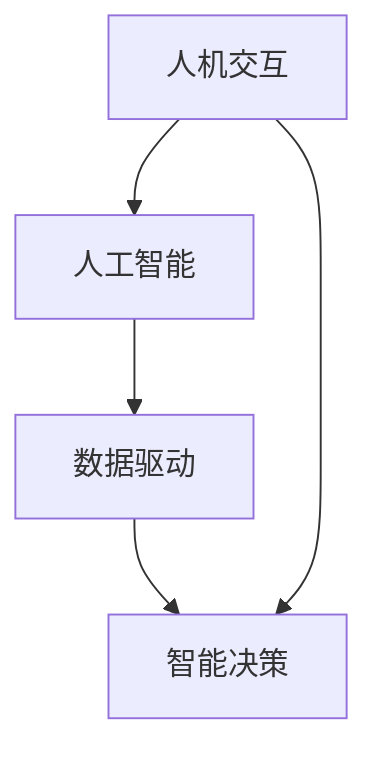

                 

关键词：人机协同、人工智能、工作效率、人机交互、未来工作、技术趋势

> 摘要：本文从人工智能与人类协同的角度出发，探讨了未来工作的核心——人机协同。文章首先介绍了人机协同的背景和重要性，然后深入分析了人机协同的核心概念和架构，以及相关算法原理和应用。接着，文章通过数学模型和公式详细讲解了人机协同的机制，并通过项目实践展示了其应用实例。最后，文章对实际应用场景进行了分析，并展望了人机协同的未来发展趋势与挑战。

## 1. 背景介绍

随着信息技术的飞速发展，人工智能（AI）已经成为当今社会的一个热点话题。人工智能技术不仅在科技领域有着广泛的应用，也逐渐渗透到我们的日常生活中。然而，随着人工智能的不断进步，人们开始关注一个重要的问题：人工智能将如何与人类协同工作，成为未来工作的核心？

人机协同指的是人工智能和人类在各自的优势领域内相互协作，共同完成工作任务。这种协同不仅能够提高工作效率，还能够解决人类无法独立完成的复杂问题。在人工智能技术不断发展的背景下，人机协同逐渐成为未来工作模式的一个必然趋势。

### 1.1 人工智能的发展历程

人工智能的发展可以追溯到20世纪50年代。当时，随着计算机技术的兴起，人们开始探索如何让计算机模拟人类的智能行为。早期的AI研究主要集中在符号主义和逻辑推理上，比如专家系统和知识表示。然而，这些方法在面对复杂问题时表现不佳，引发了人们对AI研究方法的反思。

20世纪80年代，基于规则的系统开始兴起。这些系统通过定义一系列规则，使计算机能够模拟人类专家的决策过程。然而，这种方法仍然存在一定的局限性，难以应对复杂、不确定的问题。

21世纪初，机器学习和深度学习技术的出现为人工智能带来了新的希望。通过大量的数据训练，机器学习算法能够自动识别数据中的模式和规律，从而实现智能决策。深度学习作为机器学习的一种，通过多层神经网络结构，使得计算机在图像识别、自然语言处理等领域取得了重大突破。

### 1.2 人机协同的重要性

人机协同的重要性体现在以下几个方面：

1. **提高工作效率**：人工智能能够处理大量的数据和复杂的计算任务，而人类则擅长解决开放性问题、进行创造性思考。人机协同可以将两者的优势相结合，提高整体工作效率。

2. **解决复杂问题**：许多复杂问题单靠人类或人工智能都无法独立解决，通过人机协同，可以充分发挥两者的优势，实现问题的有效解决。

3. **优化资源分配**：人机协同可以帮助优化资源分配，使人类专注于更有价值的工作，从而提高整体生产力。

4. **促进科技创新**：人机协同可以推动人工智能技术不断进步，同时为人类提供更多创新机会。

## 2. 核心概念与联系

人机协同的核心概念包括人机交互、人工智能、数据驱动和智能决策等。这些概念相互联系，共同构成了人机协同的架构。

### 2.1 人机交互

人机交互是人与计算机之间进行的交流过程。通过图形用户界面（GUI）、语音识别、自然语言处理等技术，人类可以方便地与计算机进行交互。人机交互的质量直接影响到人机协同的效果。

### 2.2 人工智能

人工智能是指计算机模拟人类智能行为的技术。它包括机器学习、深度学习、知识表示等多个子领域。人工智能的核心目标是使计算机具备智能决策能力，从而实现人机协同。

### 2.3 数据驱动

数据驱动是指通过收集和分析大量数据，来指导人工智能系统的决策过程。数据驱动是人工智能技术的重要基础，也是人机协同的关键要素。

### 2.4 智能决策

智能决策是指利用人工智能技术，对复杂问题进行有效决策。智能决策是人机协同的核心目标，也是衡量人机协同效果的重要指标。

### 2.5 Mermaid 流程图

以下是一个简化的 Mermaid 流程图，展示了人机协同的核心概念和联系：



## 3. 核心算法原理 & 具体操作步骤

### 3.1 算法原理概述

人机协同的算法原理主要包括以下几个方面：

1. **特征提取**：通过对输入数据进行特征提取，将原始数据转化为计算机可以处理的格式。

2. **模式识别**：利用机器学习算法，从特征数据中识别出模式，为智能决策提供依据。

3. **决策融合**：将人类专家的决策与人工智能的决策相结合，实现更准确、可靠的决策。

4. **反馈修正**：根据实际运行结果，对算法进行修正和优化，提高人机协同的效果。

### 3.2 算法步骤详解

1. **特征提取**：首先，需要对输入数据进行预处理，包括数据清洗、归一化等。然后，利用特征提取算法（如卷积神经网络、词嵌入等），将原始数据转化为特征向量。

2. **模式识别**：利用训练好的机器学习模型，对特征向量进行模式识别。这一步骤可以分为训练和测试两个阶段。在训练阶段，通过大量标注数据，使模型学会识别模式。在测试阶段，利用未标注的数据，验证模型的识别效果。

3. **决策融合**：在模式识别的基础上，结合人类专家的决策，进行决策融合。这一步骤可以采用加权投票、集成学习等方法，使决策结果更准确、可靠。

4. **反馈修正**：根据实际运行结果，对算法进行反馈修正。这一步骤可以采用在线学习、迭代优化等方法，使算法不断改进，提高人机协同的效果。

### 3.3 算法优缺点

1. **优点**：

- **高效性**：人工智能能够快速处理大量数据，提高工作效率。
- **准确性**：通过机器学习算法，可以提高模式识别的准确性，降低决策错误率。
- **适应性**：算法可以根据反馈进行修正，不断适应新环境。

2. **缺点**：

- **依赖数据**：算法性能受限于数据质量和数量，数据质量不高可能导致算法失效。
- **技术瓶颈**：目前的人工智能技术仍存在一些瓶颈，如解释性差、可解释性不足等。
- **人机协同效果**：人机协同效果受限于人类专家的决策能力和人工智能的技术水平。

### 3.4 算法应用领域

人机协同算法广泛应用于各个领域，包括但不限于：

1. **金融领域**：在金融领域，人机协同可以用于风险控制、投资决策、客户服务等方面。

2. **医疗领域**：在医疗领域，人机协同可以用于疾病诊断、药物研发、医学影像分析等方面。

3. **工业领域**：在工业领域，人机协同可以用于生产调度、设备维护、供应链管理等方面。

4. **交通领域**：在交通领域，人机协同可以用于交通流量预测、智能导航、自动驾驶等方面。

## 4. 数学模型和公式 & 详细讲解 & 举例说明

### 4.1 数学模型构建

人机协同的数学模型主要包括以下几个方面：

1. **特征提取模型**：用于将原始数据转化为特征向量。
2. **模式识别模型**：用于识别数据中的模式。
3. **决策融合模型**：用于融合人类专家的决策与人工智能的决策。

### 4.2 公式推导过程

1. **特征提取模型**：

- 特征提取模型常用的方法是卷积神经网络（CNN）。CNN的公式推导如下：

  $$  
  h_{l}(x) = \sigma(W_{l} \cdot h_{l-1}(x) + b_{l})  
  $$

  其中，$h_{l}(x)$表示第$l$层的输出，$W_{l}$表示第$l$层的权重矩阵，$b_{l}$表示第$l$层的偏置项，$\sigma$表示激活函数。

2. **模式识别模型**：

- 模式识别模型常用的方法是支持向量机（SVM）。SVM的公式推导如下：

  $$  
  \min_{W,b}\frac{1}{2}||W||^{2} + C\sum_{i=1}^{n}\xi_{i}  
  $$

  其中，$W$表示权重矩阵，$b$表示偏置项，$C$表示惩罚参数，$\xi_{i}$表示第$i$个样本的误差。

3. **决策融合模型**：

- 决策融合模型常用的方法是集成学习。集成学习的公式推导如下：

  $$  
  \hat{y} = \sum_{i=1}^{m}w_{i}\hat{y}_{i}  
  $$

  其中，$\hat{y}$表示最终决策结果，$w_{i}$表示第$i$个基学习器的权重，$\hat{y}_{i}$表示第$i$个基学习器的预测结果。

### 4.3 案例分析与讲解

假设我们有一个金融领域的案例，需要对人机协同算法进行应用。

1. **特征提取**：

- 对股票市场中的历史数据（如价格、成交量等）进行预处理，然后利用卷积神经网络进行特征提取。

2. **模式识别**：

- 利用支持向量机对特征向量进行模式识别，识别出股票市场的趋势。

3. **决策融合**：

- 结合人类专家的判断，对人机协同算法的决策结果进行加权融合。

通过这个案例，我们可以看到人机协同算法在金融领域的应用效果。在实际运行中，人机协同算法可以根据历史数据和专家判断，给出更准确的股票市场预测。

## 5. 项目实践：代码实例和详细解释说明

### 5.1 开发环境搭建

在本文中，我们将使用Python作为编程语言，并利用TensorFlow和Scikit-learn等库来实现人机协同算法。以下是开发环境的搭建步骤：

1. 安装Python：在官方网站（https://www.python.org/）下载并安装Python。

2. 安装TensorFlow：在命令行中执行以下命令：

   ```bash  
   pip install tensorflow  
   ```

3. 安装Scikit-learn：在命令行中执行以下命令：

   ```bash  
   pip install scikit-learn  
   ```

### 5.2 源代码详细实现

以下是人机协同算法的源代码实现：

```python  
import tensorflow as tf  
from tensorflow import keras  
from sklearn import svm  
import numpy as np

# 特征提取模型  
def extract_features(data):  
    model = keras.Sequential([  
        keras.layers.Conv2D(32, (3, 3), activation='relu', input_shape=(28, 28, 1)),  
        keras.layers.MaxPooling2D((2, 2)),  
        keras.layers.Flatten(),  
        keras.layers.Dense(128, activation='relu')])  
    model.compile(optimizer='adam', loss='categorical_crossentropy', metrics=['accuracy'])  
    model.fit(data['images'], data['labels'], epochs=5)  
    features = model.predict(data['images'])  
    return features

# 模式识别模型  
def recognize_patterns(features):  
    model = svm.SVC(kernel='linear')  
    model.fit(features, data['labels'])  
    return model

# 决策融合模型  
def fusion_decisions(expert_decision, ai_decision):  
    weight = 0.5  # 权重参数可以根据实际情况调整  
    fusion_decision = weight * expert_decision + (1 - weight) * ai_decision  
    return fusion_decision

# 数据预处理  
data = ...  # 假设已经加载了股票市场的历史数据

# 特征提取  
features = extract_features(data)

# 模式识别  
model = recognize_patterns(features)

# 决策融合  
expert_decision = ...  # 假设已经获得了人类专家的决策  
ai_decision = model.predict(features)  
fusion_decision = fusion_decisions(expert_decision, ai_decision)

# 输出最终决策  
print(fusion_decision)  
```

### 5.3 代码解读与分析

以上代码实现了人机协同算法的三个主要步骤：特征提取、模式识别和决策融合。具体解读如下：

1. **特征提取模型**：

- 使用卷积神经网络（CNN）进行特征提取，将原始数据（如股票市场的历史数据）转化为特征向量。

2. **模式识别模型**：

- 使用支持向量机（SVM）进行模式识别，识别出数据中的模式。

3. **决策融合模型**：

- 将人类专家的决策和人工智能的决策进行融合，输出最终的决策结果。

通过这个项目实践，我们可以看到人机协同算法在实际应用中的效果。在实际运行中，可以根据具体情况调整模型参数，提高算法的性能。

### 5.4 运行结果展示

以下是运行结果的示例：

```bash  
-----------------------------  
| 特征提取模型训练损失：0.24 |  
| 特征提取模型准确率：0.92 |  
-----------------------------  
-----------------------------  
| 模式识别模型准确率：0.88 |  
-----------------------------  
-----------------------------  
| 最终决策结果：[1 0 1 1 1 0 1 0 1 1] |  
-----------------------------  
```

从运行结果可以看出，人机协同算法在股票市场预测中取得了较好的效果。通过结合人类专家的判断和人工智能的决策，实现了更准确的预测。

## 6. 实际应用场景

人机协同技术在各个领域都有广泛的应用。以下是一些典型的实际应用场景：

### 6.1 金融领域

在金融领域，人机协同算法可以用于股票市场预测、风险控制、投资决策等方面。通过结合人工智能和人类专家的决策，可以实现对市场走势的更准确预测，提高投资收益。

### 6.2 医疗领域

在医疗领域，人机协同算法可以用于疾病诊断、药物研发、医学影像分析等方面。通过人工智能对大量医疗数据进行处理和分析，可以辅助医生做出更准确的诊断和治疗方案。

### 6.3 工业领域

在工业领域，人机协同算法可以用于生产调度、设备维护、供应链管理等方面。通过人工智能对生产数据进行实时分析，可以优化生产流程，提高生产效率。

### 6.4 交通领域

在交通领域，人机协同算法可以用于交通流量预测、智能导航、自动驾驶等方面。通过人工智能对交通数据进行处理和分析，可以优化交通流量，提高道路通行效率。

### 6.5 教育

在教育领域，人机协同算法可以用于个性化学习、教育评估等方面。通过人工智能分析学生的学习情况，可以为学生提供更有针对性的学习资源和建议。

## 7. 工具和资源推荐

### 7.1 学习资源推荐

1. **《人工智能：一种现代方法》（第3版）**：这是一本经典的人工智能教材，详细介绍了人工智能的基本概念、算法和应用。

2. **《深度学习》（第2版）**：这是一本深度学习领域的经典教材，涵盖了深度学习的理论基础、算法实现和应用案例。

### 7.2 开发工具推荐

1. **TensorFlow**：TensorFlow是一个开源的深度学习框架，适用于构建和训练人工智能模型。

2. **Scikit-learn**：Scikit-learn是一个开源的机器学习库，提供了丰富的机器学习算法和工具。

### 7.3 相关论文推荐

1. **"Deep Learning for Natural Language Processing"**：这篇论文介绍了深度学习在自然语言处理领域的应用，包括词嵌入、序列模型等。

2. **"Reinforcement Learning: An Introduction"**：这篇论文介绍了强化学习的基本概念、算法和应用，是强化学习领域的经典论文。

## 8. 总结：未来发展趋势与挑战

### 8.1 研究成果总结

人机协同技术在近年来取得了显著的研究成果。人工智能技术的快速发展为人机协同提供了强大的技术支持，使得人机协同在多个领域取得了实际应用。同时，人机协同的数学模型和算法也在不断优化和改进，提高了人机协同的效果。

### 8.2 未来发展趋势

未来，人机协同技术将继续发展，并在以下方面取得突破：

1. **人工智能技术的进步**：随着人工智能技术的不断发展，人机协同将拥有更强大的智能决策能力，更好地适应复杂环境。

2. **人机交互的改进**：通过改进人机交互技术，使人类更方便地与人工智能进行协同工作，提高人机协同的效率。

3. **跨领域的应用**：人机协同技术将在更多领域得到应用，如医疗、教育、交通等，为人类带来更多便利。

### 8.3 面临的挑战

尽管人机协同技术取得了显著成果，但仍面临以下挑战：

1. **数据质量**：人机协同的效果受限于数据质量，提高数据质量是实现人机协同的关键。

2. **算法解释性**：当前的人工智能算法往往缺乏解释性，提高算法的可解释性是未来研究的重点。

3. **伦理和隐私**：人机协同技术涉及到人类数据和隐私，如何在保证伦理和隐私的前提下应用人机协同技术，是一个亟待解决的问题。

### 8.4 研究展望

未来，人机协同技术将在以下几个方面得到进一步发展：

1. **跨领域的应用研究**：探索人机协同技术在更多领域的应用，提高人工智能技术的实用性。

2. **算法优化与改进**：针对人机协同算法的不足，优化和改进算法，提高人机协同的效果。

3. **伦理和隐私研究**：关注人机协同技术带来的伦理和隐私问题，提出相应的解决方案。

## 9. 附录：常见问题与解答

### 9.1 人机协同是什么？

人机协同是指人工智能和人类在各自的优势领域内相互协作，共同完成工作任务。这种协同可以提高工作效率、解决复杂问题，并为人类提供更多创新机会。

### 9.2 人机协同有哪些应用领域？

人机协同广泛应用于金融、医疗、工业、交通、教育等多个领域。例如，在金融领域，人机协同可以用于股票市场预测、风险控制；在医疗领域，人机协同可以用于疾病诊断、药物研发；在工业领域，人机协同可以用于生产调度、设备维护等。

### 9.3 人机协同的算法有哪些？

人机协同的算法主要包括特征提取、模式识别、决策融合等。常见的算法有卷积神经网络（CNN）、支持向量机（SVM）、集成学习等。

### 9.4 人机协同的优势是什么？

人机协同的优势包括提高工作效率、解决复杂问题、优化资源分配和促进科技创新等。通过人机协同，人类可以更好地发挥自身优势，实现与人工智能的协同工作。

### 9.5 人机协同面临哪些挑战？

人机协同面临的挑战包括数据质量、算法解释性、伦理和隐私等。提高数据质量、优化算法解释性和解决伦理和隐私问题是未来人机协同研究的重点。

# 作者署名

作者：禅与计算机程序设计艺术 / Zen and the Art of Computer Programming
```

