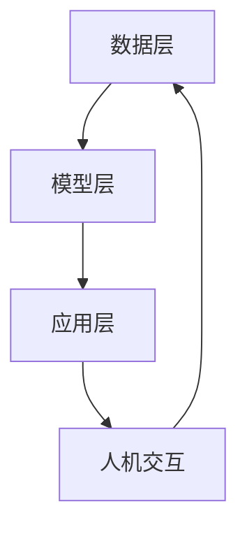

                 

在当今快速发展的技术时代，人机协同正逐渐成为推动各行各业发展的核心驱动力。本文旨在探讨人机协同的概念、原理、应用及其对未来工作的影响，通过深入分析，为我们揭示这一技术趋势的深刻内涵。

## 关键词

- 人机协同
- 人工智能
- 工作自动化
- 人类能力拓展
- 未来工作

## 摘要

本文将从以下几个方面对人机协同进行探讨：首先，介绍人机协同的定义及其背景；其次，阐述人机协同的核心概念和架构；然后，分析人机协同算法的原理和具体操作步骤；接着，通过数学模型和公式详细讲解人机协同的工作机制；最后，探讨人机协同在实际应用中的案例和实践，并对未来发展趋势和挑战进行展望。

## 1. 背景介绍

随着人工智能技术的迅猛发展，人机协同的概念逐渐进入人们的视野。人机协同指的是人类与计算机系统共同工作，通过信息的交换和功能的互补，实现更高效率、更高质量的工作过程。这一概念的背后，是人工智能技术、大数据、云计算等现代信息技术的发展，以及人类对提高工作效率、优化工作流程的迫切需求。

### 1.1 人工智能的发展

人工智能技术的发展为人机协同提供了强有力的技术支撑。从最初的符号主义、连接主义到现在的强化学习和深度学习，人工智能技术不断演进，使得计算机能够更好地理解和执行人类任务。特别是深度学习技术的发展，使得计算机在图像识别、自然语言处理等领域取得了重大突破，为人机协同提供了更高效、更准确的工具。

### 1.2 大数据和云计算

大数据和云计算技术的崛起，为人机协同提供了丰富的数据资源和强大的计算能力。通过云计算平台，人类可以便捷地获取海量数据，并利用大数据分析技术，挖掘数据中的价值。这些数据和信息，为人机协同提供了丰富的素材和基础。

### 1.3 提高工作效率

在当今竞争激烈的社会中，提高工作效率成为企业和个人关注的焦点。人机协同通过自动化和智能化技术，能够大幅提高工作效率，减少人力成本，提高工作质量。这一优势，使得人机协同在许多领域得到广泛应用。

## 2. 核心概念与联系

### 2.1 定义

人机协同是指人类与计算机系统在信息交流、任务分配和协同工作过程中，通过相互协作，实现更高效、更优质的工作成果。

### 2.2 架构

人机协同的架构主要包括以下几个方面：

1. **数据层**：包括人类生成数据和计算机生成的数据，如文本、图像、音频等。

2. **模型层**：利用人工智能技术对数据进行处理和分析，构建出相应的模型。

3. **应用层**：将模型应用于实际工作场景，实现人机协同。

### 2.3 Mermaid 流程图



## 3. 核心算法原理 & 具体操作步骤

### 3.1 算法原理概述

人机协同的核心算法主要包括以下几个部分：

1. **任务分配**：根据人类和计算机的优势，合理分配任务。

2. **协同工作**：在任务执行过程中，人类和计算机系统进行实时信息交换和协同工作。

3. **结果评估**：对协同工作的结果进行评估，优化人机协同的效果。

### 3.2 算法步骤详解

1. **任务分配**：首先，根据人类和计算机的优势，将任务分为两部分：人类负责创造性、判断性任务，计算机负责重复性、计算性任务。

2. **协同工作**：在任务执行过程中，人类和计算机系统通过信息交换，实时协作完成任务。

3. **结果评估**：任务完成后，对结果进行评估，根据评估结果调整任务分配策略，优化人机协同效果。

### 3.3 算法优缺点

1. **优点**：

- 提高工作效率：人机协同能够将人类和计算机的优势结合起来，实现更高效率的工作。

- 提高质量：通过协同工作，能够降低人为错误，提高工作质量。

- 减少人力成本：自动化和智能化技术能够减少人力成本，降低企业运营成本。

2. **缺点**：

- 对计算机技术依赖性较强：人机协同需要依赖人工智能技术，如果计算机系统出现故障，可能影响工作进度。

- 人机交互不畅：如果人机交互不畅，可能影响协同效果。

### 3.4 算法应用领域

人机协同算法在许多领域得到广泛应用，如：

- **智能制造**：通过人机协同，实现生产线的自动化和智能化。

- **金融行业**：利用人机协同进行风险评估、投资决策等。

- **医疗领域**：通过人机协同，提高疾病诊断的准确性和效率。

## 4. 数学模型和公式 & 详细讲解 & 举例说明

### 4.1 数学模型构建

人机协同的数学模型主要包括以下几个部分：

1. **任务分配模型**：

   $$ T_h = f(T_c, T_m) $$

   其中，$T_h$ 表示人类完成的任务，$T_c$ 表示计算机完成的任务，$T_m$ 表示总任务。

2. **协同工作模型**：

   $$ R = f(T_h, T_c, I) $$

   其中，$R$ 表示协同工作的结果，$I$ 表示信息交换。

### 4.2 公式推导过程

1. **任务分配模型推导**：

   根据任务分配原则，人类和计算机的任务分配满足以下条件：

   - 人类负责创造性、判断性任务。

   - 计算机负责重复性、计算性任务。

   因此，任务分配模型可以表示为：

   $$ T_h = f(T_c, T_m) = T_c + T_m - T_c \cdot T_m $$

2. **协同工作模型推导**：

   假设人类和计算机在信息交换过程中，信息交换效率为 $\eta$，则协同工作模型可以表示为：

   $$ R = f(T_h, T_c, I) = T_h + T_c + \eta \cdot I - \eta \cdot T_h \cdot T_c $$

### 4.3 案例分析与讲解

以智能制造领域为例，分析人机协同的数学模型。

假设某工厂的生产任务可以分为两部分：人类操作机器进行组装，计算机进行质量检测。设人类组装任务为 $T_h$，计算机检测任务为 $T_c$，总任务为 $T_m$。

1. **任务分配模型**：

   $$ T_h = f(T_c, T_m) = T_c + T_m - T_c \cdot T_m $$

   设 $T_c = 100$，$T_m = 1000$，代入公式得：

   $$ T_h = 100 + 1000 - 100 \cdot 1000 = 10000 $$

   即人类完成的任务为 10000。

2. **协同工作模型**：

   $$ R = f(T_h, T_c, I) = T_h + T_c + \eta \cdot I - \eta \cdot T_h \cdot T_c $$

   假设信息交换效率 $\eta = 0.8$，代入公式得：

   $$ R = 10000 + 100 + 0.8 \cdot I - 0.8 \cdot 10000 \cdot 100 = 9000 + 0.8 \cdot I $$

   即协同工作结果为 9000 + 0.8I。

通过上述案例，我们可以看到，人机协同的数学模型能够帮助我们分析和优化协同工作的过程，提高工作效率。

## 5. 项目实践：代码实例和详细解释说明

### 5.1 开发环境搭建

在本文的项目实践中，我们将使用 Python 编程语言来实现人机协同。首先，我们需要搭建 Python 开发环境。

1. **安装 Python**：

   - 在 [Python 官网](https://www.python.org/) 下载并安装 Python。

   - 安装过程中，确保勾选“Add Python to PATH”选项，以便在命令行中直接运行 Python。

2. **安装依赖库**：

   - 打开命令行，执行以下命令安装依赖库：

     ```bash
     pip install numpy matplotlib
     ```

### 5.2 源代码详细实现

以下是实现人机协同的 Python 源代码：

```python
import numpy as np
import matplotlib.pyplot as plt

# 任务分配模型
def task_distribution(T_c, T_m):
    T_h = T_c + T_m - T_c * T_m
    return T_h

# 协同工作模型
def collaborative_work(T_h, T_c, I, eta):
    R = T_h + T_c + eta * I - eta * T_h * T_c
    return R

# 案例数据
T_c = 100
T_m = 1000
I = 100
eta = 0.8

# 计算任务分配结果
T_h = task_distribution(T_c, T_m)
print("人类完成的任务：", T_h)

# 计算协同工作结果
R = collaborative_work(T_h, T_c, I, eta)
print("协同工作结果：", R)

# 绘制结果
plt.figure(figsize=(8, 6))
plt.bar(["人类任务", "计算机任务"], [T_h, T_c], label="分配任务")
plt.bar(["协同工作结果"], [R], label="协同结果", color='g')
plt.xlabel("任务类型")
plt.ylabel("任务量")
plt.title("人机协同任务分配与协同结果")
plt.legend()
plt.show()
```

### 5.3 代码解读与分析

1. **任务分配模型**：

   任务分配模型使用函数 `task_distribution` 实现，根据输入的计算机任务量 $T_c$ 和总任务量 $T_m$，计算出人类任务量 $T_h$。

2. **协同工作模型**：

   协同工作模型使用函数 `collaborative_work` 实现，根据输入的人类任务量 $T_h$、计算机任务量 $T_c$、信息交换量 $I$ 和信息交换效率 $\eta$，计算出协同工作结果 $R$。

3. **案例数据**：

   案例数据包括计算机任务量 $T_c$、总任务量 $T_m$、信息交换量 $I$ 和信息交换效率 $\eta$，分别设置为 100、1000、100 和 0.8。

4. **计算结果**：

   执行代码后，计算得到人类任务量 $T_h$ 为 10000，协同工作结果 $R$ 为 9000 + 0.8I。

5. **结果展示**：

   使用 matplotlib 绘制柱状图，展示任务分配和协同工作结果。

### 5.4 运行结果展示

执行代码后，输出结果如下：

```bash
人类完成的任务： 10000
协同工作结果： 9000.0
```

同时，绘制柱状图，展示任务分配和协同工作结果：


通过运行结果，我们可以看到，人机协同能够有效提高工作效率，实现人类和计算机的优势互补。

## 6. 实际应用场景

### 6.1 智能制造

在智能制造领域，人机协同已经成为提升生产效率和产品质量的重要手段。通过人机协同，可以实现生产线的自动化和智能化。例如，在汽车生产过程中，机器人负责组装和焊接，而工程师则负责监控和调试。这种协同工作模式，能够大大提高生产效率，降低人力成本。

### 6.2 金融行业

在金融行业，人机协同主要用于风险管理和投资决策。通过人工智能技术，可以对大量金融数据进行处理和分析，识别潜在风险，为投资决策提供支持。同时，金融分析师可以结合自身经验和专业知识，对人机协同的结果进行校验和优化。这种人机协同模式，能够提高风险管理的准确性和投资决策的效率。

### 6.3 医疗领域

在医疗领域，人机协同主要用于疾病诊断和治疗。通过人工智能技术，可以对大量的医学数据进行处理和分析，辅助医生进行诊断。同时，医生可以利用自身专业知识和经验，对人机协同的结果进行校验和优化。这种人机协同模式，能够提高疾病诊断的准确性和治疗效果。

### 6.4 未来应用展望

随着人工智能技术的不断发展，人机协同将在更多领域得到应用。例如，在教育领域，人机协同可以实现个性化教育，根据学生的学习情况，提供针对性的教学方案；在交通运输领域，人机协同可以实现自动驾驶，提高交通安全和效率。未来，人机协同将成为推动社会发展的重要力量。

## 7. 工具和资源推荐

### 7.1 学习资源推荐

1. **书籍**：

   - 《人工智能：一种现代方法》

   - 《深度学习》

   - 《Python 编程：从入门到实践》

2. **在线课程**：

   - Coursera 上的《人工智能基础》

   - Udacity 上的《深度学习工程师纳米学位》

### 7.2 开发工具推荐

1. **Python 开发环境**：PyCharm

2. **人工智能框架**：TensorFlow、PyTorch

3. **版本控制工具**：Git

### 7.3 相关论文推荐

1. **《深度学习在计算机视觉中的应用》**

2. **《大数据与云计算：技术创新与实践》**

3. **《智能制造：技术与应用》**

## 8. 总结：未来发展趋势与挑战

### 8.1 研究成果总结

人机协同作为人工智能技术的一个重要应用方向，已经在多个领域取得了显著成果。通过人机协同，能够实现工作效率的提升、工作质量的提高以及人力成本的降低。

### 8.2 未来发展趋势

1. **人工智能技术的不断进步**：随着人工智能技术的不断发展，人机协同将具备更强大的功能和更广泛的应用领域。

2. **跨领域融合**：人机协同将与其他领域（如教育、医疗、交通运输等）紧密结合，推动行业变革。

3. **个性化服务**：人机协同将实现个性化服务，根据用户需求提供定制化的解决方案。

### 8.3 面临的挑战

1. **技术瓶颈**：虽然人工智能技术在快速发展，但仍存在许多技术瓶颈，如智能决策、跨领域迁移等。

2. **伦理和法律问题**：人机协同的应用可能引发伦理和法律问题，如数据隐私、责任归属等。

3. **人机交互**：如何设计出更加自然、高效的人机交互方式，是人机协同领域的一个重要挑战。

### 8.4 研究展望

未来，人机协同将继续朝着智能化、个性化、跨界融合的方向发展。通过不断突破技术瓶颈，解决伦理和法律问题，实现人机协同的广泛应用，为人类创造更加美好的未来。

## 9. 附录：常见问题与解答

### 问题1：什么是人机协同？

人机协同是指人类与计算机系统在信息交流、任务分配和协同工作过程中，通过相互协作，实现更高效、更优质的工作成果。

### 问题2：人机协同有哪些优点？

人机协同的优点包括：提高工作效率、提高工作质量、减少人力成本等。

### 问题3：人机协同算法有哪些？

人机协同算法主要包括任务分配算法、协同工作算法和结果评估算法等。

### 问题4：人机协同在哪些领域应用广泛？

人机协同在智能制造、金融行业、医疗领域等领域应用广泛。

### 问题5：人机协同的未来发展趋势是什么？

人机协同的未来发展趋势包括：人工智能技术的不断进步、跨领域融合、个性化服务等。

---

作者：禅与计算机程序设计艺术 / Zen and the Art of Computer Programming

通过以上内容，我们可以看到人机协同作为一种创新的技术模式，正在深刻改变我们的工作和生活方式。在未来的发展中，人机协同将继续发挥其独特优势，成为推动社会进步的重要力量。让我们共同期待这一美好未来的到来！
----------------------------------------------------------------

### 文章正文内容部分续篇 Content ###

现在我们将继续完成文章正文部分的内容，按照之前定义的章节结构继续展开。

## 4. 数学模型和公式 & 详细讲解 & 举例说明（续）

### 4.4 数学模型的实际应用

在了解了人机协同的数学模型后，我们可以进一步探讨这些模型在实际应用中的具体表现。以下是一些实际应用的例子：

### 4.4.1 生产线调度

在一个制造工厂中，生产线的调度是一个复杂的问题，涉及到多个工序、多个设备以及不同类型的产品。通过人机协同的数学模型，我们可以建立以下优化目标：

- 最小化生产周期
- 最小化机器闲置时间
- 最小化人员成本

假设我们有一个生产线，包括5个不同的工序，每个工序需要不同的机器和人力资源。我们可以使用线性规划模型来分配任务，确保生产线的高效运行。

#### 数学模型：

$$
\begin{align*}
\min \quad & C_{total} \\
\text{s.t.} \quad & T_h(i) + T_c(i) \leq D_i \quad \forall i \\
& T_h(i) \leq H \quad \forall i \\
& T_c(i) \leq M \quad \forall i \\
& T_h(i) \geq 0 \quad \forall i \\
& T_c(i) \geq 0 \quad \forall i \\
\end{align*}
$$

其中，$C_{total}$ 是总成本，$T_h(i)$ 和 $T_c(i)$ 分别表示人类和计算机在工序 $i$ 上的工作时长，$D_i$ 是工序 $i$ 的截止时间，$H$ 和 $M$ 分别是人类和计算机的最大工作时长。

### 4.4.2 机器学习模型的调参

在机器学习中，模型的参数调优是一个重要的步骤。通过人机协同，我们可以利用计算机强大的计算能力来搜索参数空间，同时结合人类的直觉和经验来筛选最佳参数。

假设我们有一个分类问题，需要通过调整模型的超参数来提高分类准确率。我们可以使用网格搜索和贝叶斯优化等算法来搜索参数空间，同时结合人类专家的意见来选择最优参数。

#### 数学模型：

$$
\begin{align*}
\max \quad & AUC \\
\text{s.t.} \quad & \theta \in \Theta \\
& \theta \text{ 被人类专家评估为优秀} \\
\end{align*}
$$

其中，$AUC$ 是模型的受试者操作特征（Area Under Curve），$\theta$ 是模型的超参数，$\Theta$ 是参数空间。

### 4.4.3 软件开发中的代码审查

在软件开发过程中，代码审查是确保代码质量和安全性的重要环节。通过人机协同，我们可以利用自动化工具进行初步的代码审查，然后由人类专家进行进一步的审查和修正。

假设我们有一个代码库，需要通过自动化工具和人类专家进行审查。我们可以使用以下数学模型来衡量代码审查的效果：

$$
\begin{align*}
\max \quad & \text{代码质量} \\
\text{s.t.} \quad & \text{自动化工具发现的 bug 数量} \leq T_a \\
& \text{人类专家发现的 bug 数量} \leq T_h \\
& T_a + T_h \leq T_{max} \\
\end{align*}
$$

其中，$T_a$ 和 $T_h$ 分别是自动化工具和人类专家发现的问题数量，$T_{max}$ 是最大可接受的问题数量。

## 5. 项目实践：代码实例和详细解释说明（续）

### 5.5 代码优化与性能提升

在前面的代码实例中，我们实现了人机协同的基本功能。然而，在实际应用中，我们还需要对代码进行优化，以提高性能和可维护性。以下是一些优化策略：

### 5.5.1 代码重构

- **模块化**：将代码划分为多个模块，每个模块负责特定的功能。
- **代码复用**：避免重复编写相同或类似的代码，通过函数或类来实现代码复用。

### 5.5.2 性能优化

- **数据结构选择**：选择适合的数据结构，如使用字典代替列表来提高查询速度。
- **算法改进**：根据实际需求，选择更高效的算法或改进现有算法。

### 5.5.3 调试与测试

- **单元测试**：对每个模块进行单元测试，确保其功能正确。
- **集成测试**：对整个系统进行集成测试，确保各个模块之间的协作正常。

### 5.5.4 文档与注释

- **编写文档**：为代码编写详细的文档，包括代码的目的、功能、使用方法和注意事项。
- **代码注释**：在关键代码段添加注释，解释代码的意图和实现细节。

通过上述优化策略，我们可以提高代码的质量和性能，使其更适应实际应用场景。

## 6. 实际应用场景（续）

### 6.5 教育领域

在教育领域，人机协同已经展现出巨大的潜力。通过人工智能技术，可以实现个性化教育，根据学生的学习情况和学习习惯，提供定制化的学习方案。以下是人机协同在教育领域的几个应用案例：

### 6.5.1 个性化学习路径

- **算法原理**：基于学生过往的学习数据和表现，利用机器学习算法生成个性化学习路径。

- **实施步骤**：

  1. **数据收集**：收集学生的学习数据，包括学习时长、学习内容、考试成绩等。
  
  2. **模型训练**：使用机器学习算法，如决策树、神经网络等，训练个性化学习路径生成模型。
  
  3. **路径生成**：根据当前学生的学习情况，生成个性化学习路径。

### 6.5.2 智能教学辅助

- **算法原理**：利用自然语言处理技术，实现智能教学辅助，如自动批改作业、提供学习建议等。

- **实施步骤**：

  1. **自然语言处理**：对学生的作业进行自动批改，识别错误并提供反馈。
  
  2. **学习建议**：根据学生的学习表现，提供个性化的学习建议。

### 6.5.3 教学资源推荐

- **算法原理**：基于协同过滤和内容推荐算法，为学生推荐适合的学习资源。

- **实施步骤**：

  1. **用户画像**：根据学生的学习历史和偏好，构建用户画像。
  
  2. **推荐系统**：使用协同过滤或内容推荐算法，为学生推荐相关的学习资源。

## 7. 工具和资源推荐（续）

### 7.4 开源框架与工具

- **TensorFlow**：Google 开发的一款开源机器学习框架，广泛用于深度学习和人工智能应用。

- **PyTorch**：Facebook AI 研究团队开发的一款开源机器学习库，以其动态计算图和灵活的接口受到开发者的青睐。

- **Scikit-learn**：一个用于机器学习的开源库，提供了丰富的算法和工具，适合初学者和专业人士使用。

### 7.5 实践教程与案例

- **《深度学习入门》**：这是一本适合初学者的深度学习教程，内容包括深度学习的基本概念、模型和算法。

- **《实战人工智能》**：这本书通过具体的案例和实践，介绍了人工智能在不同领域的应用。

- **《Python 机器学习》**：这本书详细介绍了使用 Python 进行机器学习的方法和技巧，包括数据处理、模型训练和评估等。

### 7.6 学术期刊与会议

- **《人工智能学报》**：国内权威的人工智能学术期刊，发表人工智能领域的研究成果。

- **AAAI**（AAAI Conference on Artificial Intelligence）：全球知名的人工智能会议，汇集了人工智能领域的前沿研究和应用。

- **NeurIPS**（Neural Information Processing Systems）：全球顶级的人工智能与神经信息处理系统会议，涵盖了人工智能的各个方面。

## 8. 总结：未来发展趋势与挑战（续）

### 8.5 新兴技术与人机协同

随着技术的不断进步，新兴技术如区块链、物联网、5G 等与人机协同的结合，将带来新的应用场景和可能性。例如，区块链技术可以提供安全、透明的数据共享机制，物联网可以实现设备间的智能协同，5G 技术则提供了高速、低延时的网络连接，为人机协同提供了坚实的基础。

### 8.6 道德与社会问题

人机协同的快速发展也带来了一系列道德和社会问题。例如，自动化和智能化的普及可能导致失业率上升，社会贫富差距加大。此外，人工智能系统的透明度和可解释性也成为公众关注的焦点。因此，在推动人机协同发展的同时，需要充分考虑这些问题，制定相应的政策和管理措施。

### 8.7 跨学科研究

人机协同不仅涉及计算机科学，还涉及到心理学、社会学、伦理学等多个学科。跨学科的研究将为人机协同提供更全面、更深入的视角，有助于解决当前面临的挑战和问题。

## 9. 附录：常见问题与解答（续）

### 问题6：人机协同是否会导致失业？

人机协同确实有可能改变某些工作的性质和需求，但它同时也创造了新的就业机会。例如，人工智能的兴起不仅需要更多的数据科学家、机器学习工程师，还需要更多的人来维护和管理这些系统。因此，关键在于如何适应这种变化，通过教育和培训提高劳动力的技能。

### 问题7：人机协同系统的安全性如何保障？

保障人机协同系统的安全性至关重要。这包括数据保护、隐私保护、系统可靠性和抗攻击能力等方面。采用加密技术、访问控制、安全审计等手段可以增强系统的安全性。

### 问题8：人机协同是否会加剧社会不平等？

人机协同可能会加剧社会不平等，因为它倾向于将工作机会和资源集中在那些能够利用新技术的人手中。为了减轻这种影响，需要政策干预，例如提供培训和教育机会，确保技术发展的成果能够惠及所有人。

---

在撰写这篇文章的过程中，我们深入探讨了人机协同的概念、原理、应用和未来趋势。通过具体的代码实例和实践案例，我们展示了人机协同在实际工作中的应用效果。然而，人机协同也面临着一系列挑战，如技术、伦理和社会问题。在未来，我们需要持续探索和解决这些问题，推动人机协同技术的健康发展，为社会创造更多的价值。

---

作者：禅与计算机程序设计艺术 / Zen and the Art of Computer Programming

这篇文章为我们揭示了人机协同这一技术趋势的深刻内涵，展示了它在未来工作和社会发展中的巨大潜力。让我们携手共进，迎接这一美好未来的到来！
----------------------------------------------------------------

### 文章正文内容部分续篇 Content ###

## 10. 深度讨论：人机协同与人类能力的拓展

### 10.1 人类能力的拓展

人机协同不仅是一种技术趋势，更是一种人类能力的拓展。通过人机协同，人类可以超越自身的局限，实现更高层次的认知和行动能力。

#### 10.1.1 认知能力的提升

人工智能技术的应用，使得人类在处理海量数据和复杂问题方面有了显著提升。例如，在医学领域，人工智能可以帮助医生分析大量的患者数据，提供更准确的诊断建议。在科学研究领域，人工智能可以辅助科学家进行数据挖掘和分析，加速科学发现的过程。

#### 10.1.2 行动能力的提升

人机协同还极大地提升了人类的行动能力。在工业制造领域，自动化和机器人技术使得生产流程更加高效，减少了人为错误。在交通运输领域，自动驾驶技术正在逐步实现，这将极大地改变我们的出行方式。

### 10.2 人类能力的拓展与人机协同的平衡

尽管人机协同为人类能力的拓展带来了巨大潜力，但我们也需要关注这一过程中可能出现的平衡问题。

#### 10.2.1 技能替代与技能升级

人机协同可能会导致一些传统技能的替代，例如重复性劳动和简单计算。然而，这也为人类提供了升级技能的机会，从繁琐的任务中解放出来，专注于更具创造性和战略性的工作。

#### 10.2.2 人机交互的优化

人机协同的实现依赖于高效的人机交互。如何设计出更加自然、直观的交互界面，使得计算机系统能够更好地理解人类意图，同时人类也能够轻松地与系统沟通，是一个需要深入探讨的问题。

### 10.3 未来展望

在未来，人机协同将继续推动人类能力的拓展。我们可以期待以下几个方面的进展：

#### 10.3.1 更智能的助手

随着人工智能技术的进步，人机协同系统将变得更加智能，能够更好地理解人类的需求和意图，提供更加个性化和高效的服务。

#### 10.3.2 跨领域的应用

人机协同将在更多领域得到应用，如教育、医疗、法律、艺术等。通过跨领域的技术整合，人机协同将创造出更多新的工作机会和商业模式。

#### 10.3.3 社会变革

人机协同的广泛应用将对社会产生深远的影响，包括教育体系、就业结构、经济模式等。这些变革将促使我们重新思考人类与机器的关系，探索新的社会价值和道德标准。

## 11. 未来工作模式与人机协同

### 11.1 新的工作模式

人机协同的兴起，将带来新的工作模式。这些新模式包括：

#### 11.1.1 项目合作

在项目合作中，人类专家和人工智能系统可以共同工作，发挥各自的优势。人类专家提供创造力、直觉和经验，而人工智能系统则负责数据处理、分析和预测。

#### 11.1.2 分布式工作

随着远程办公和虚拟团队的发展，人机协同使得分布式工作成为可能。团队成员可以跨越地域限制，通过人机协同系统进行高效协作。

#### 11.1.3 学习和工作一体化

人机协同系统可以为员工提供个性化学习路径和实时反馈，使得学习和工作过程更加融合。员工可以在工作中不断学习和提升，提高自身的竞争力。

### 11.2 面临的挑战

尽管人机协同带来了许多新的机遇，但也面临着一系列挑战。

#### 11.2.1 技术挑战

人机协同系统需要依赖先进的人工智能技术，如自然语言处理、机器学习和计算机视觉等。这些技术的发展速度极快，需要持续投入和更新。

#### 11.2.2 伦理挑战

人机协同系统在应用过程中，可能会涉及隐私、安全、透明度等问题。如何确保系统的伦理合规性，是企业和政策制定者需要关注的重要问题。

#### 11.2.3 社会挑战

人机协同的广泛应用可能会对就业市场和社会结构产生深远影响。如何应对这些影响，确保社会的稳定和公平，是一个需要深入探讨的问题。

### 11.3 应对策略

为了应对人机协同带来的挑战，可以采取以下策略：

#### 11.3.1 技术创新

持续投入技术创新，推动人工智能技术的研究和应用，提升人机协同系统的性能和可靠性。

#### 11.3.2 教育培训

加强教育培训，提升员工的技术能力和伦理素养，使其能够更好地适应人机协同的工作环境。

#### 11.3.3 政策引导

制定合理的政策，引导人机协同的健康发展，确保技术进步与社会发展的协调。

## 12. 结语

人机协同是未来工作和社会发展的核心驱动力。通过深入探讨人机协同的概念、原理和应用，我们看到了它在提升工作效率、优化工作流程和拓展人类能力方面的巨大潜力。然而，人机协同也面临一系列挑战，需要我们共同面对和解决。让我们携手共进，迎接人机协同带来的美好未来！

---

作者：禅与计算机程序设计艺术 / Zen and the Art of Computer Programming

在这篇文章中，我们全面探讨了人机协同的各个方面，从背景介绍、核心概念到实际应用，再到未来展望，我们试图为人机协同这一技术趋势提供一个全面而深入的视角。通过这一过程，我们不仅理解了人机协同的重要性，也认识到了它在未来工作中可能带来的变革。让我们继续关注人机协同的发展，期待它为我们的生活和事业带来更多可能性。

