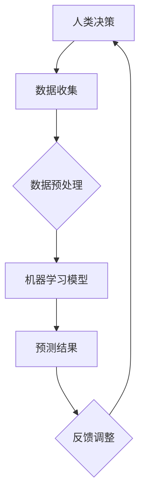

                 

关键词：人机协同，人工智能，工作模式，未来趋势

> 摘要：随着人工智能技术的飞速发展，人机协同逐渐成为未来工作的核心驱动力。本文将深入探讨人机协同的概念、原理及其在各个行业中的应用，预测未来人机协同的发展趋势，并提出面临的挑战和解决方案。

## 1. 背景介绍

在过去几十年中，计算机技术的发展经历了数次革命，从早期的电子计算器到如今的超级计算机，从简单的数据处理到复杂的人工智能系统，这一过程展示了计算机技术的巨大变革。然而，随着人工智能技术的兴起，人们开始思考如何将人类的智慧和机器的能力相结合，从而实现更高效、更智能的工作方式。人机协同的概念正是在这种背景下应运而生。

人机协同指的是人与机器在完成某项任务时相互协作，相互补充，从而实现最佳效果的一种工作模式。在这个模式中，人类提供创造力和直觉，而机器提供计算能力和数据分析，二者相互依赖，共同完成任务。人机协同的目标是实现人机之间的无缝交互，最大化地利用人类和机器的优势，提升工作效率。

## 2. 核心概念与联系

### 2.1 人工智能与人机协同

人工智能（Artificial Intelligence，AI）是指由人创造出来的，可以模拟、延伸、扩展和辅助人类智能的技术。人工智能技术包括机器学习、深度学习、自然语言处理、计算机视觉等多个方面。人机协同的核心在于如何将人工智能与人类的智能相结合，实现优势互补。

### 2.2 人机交互

人机交互（Human-Computer Interaction，HCI）是指人与计算机之间的交互方式。随着人工智能技术的发展，人机交互的方式也在不断演变。从早期的命令行界面到图形用户界面（GUI），再到如今的语音交互、手势交互等，人机交互的方式越来越自然、直观。人机交互是实现人机协同的重要途径。

### 2.3 大数据和云计算

大数据（Big Data）是指无法用常规软件工具在合理时间内捕捉、管理和处理的数据集合。云计算（Cloud Computing）是一种通过互联网以服务的方式提供计算资源的技术。大数据和云计算为人机协同提供了丰富的数据资源和强大的计算能力，是实现人机协同的重要基础设施。

### 2.4 Mermaid 流程图

下面是一个关于人机协同的基本流程图：



在这个流程图中，人类通过数据收集、数据预处理等步骤获取数据，然后利用机器学习模型进行预测，并将预测结果反馈给人类进行决策调整。这个过程不断循环，逐步优化预测模型的准确性。

## 3. 核心算法原理 & 具体操作步骤

### 3.1 算法原理概述

人机协同的核心算法主要包括机器学习算法、深度学习算法和强化学习算法等。这些算法通过模拟人类的思维过程，实现对数据的分析和预测。下面将简要介绍这些算法的基本原理。

#### 3.1.1 机器学习算法

机器学习算法是指通过学习数据中的规律，从而对未知数据进行预测的一种算法。常见的机器学习算法包括线性回归、决策树、支持向量机等。

#### 3.1.2 深度学习算法

深度学习算法是一种基于多层神经网络的人工智能算法。通过模拟人脑神经网络的结构和工作原理，深度学习算法可以在大量数据中自动学习特征，实现对复杂问题的建模和预测。

#### 3.1.3 强化学习算法

强化学习算法是一种通过试错的方式，不断优化策略，以实现最优行为输出的算法。常见的强化学习算法包括 Q-学习、深度 Q-网络等。

### 3.2 算法步骤详解

#### 3.2.1 数据收集

数据收集是机器学习算法的基础。收集的数据可以是结构化的，如数据库中的数据，也可以是非结构化的，如图像、文本等。数据收集的过程需要考虑数据的完整性、准确性和多样性。

#### 3.2.2 数据预处理

数据预处理是确保数据质量的过程。主要包括数据清洗、数据归一化、数据降维等步骤。数据清洗是为了去除数据中的噪声和错误，数据归一化是为了使不同特征具有相似的尺度，数据降维是为了减少数据的维度，提高算法的效率。

#### 3.2.3 模型训练

模型训练是机器学习算法的核心步骤。通过将预处理后的数据输入到机器学习模型中，模型可以自动学习数据中的规律，形成预测模型。

#### 3.2.4 预测与评估

预测与评估是指利用训练好的模型对未知数据进行预测，并评估预测结果的准确性。预测与评估的过程需要不断迭代，以优化模型的性能。

### 3.3 算法优缺点

#### 3.3.1 优点

- 提高工作效率：通过人机协同，可以充分利用机器的计算能力和数据处理能力，提高工作效率。
- 减少错误：人机协同可以减少人类在数据处理和决策过程中的错误，提高决策的准确性。
- 拓展人类能力：人机协同可以扩展人类在处理复杂问题和大数据方面的能力。

#### 3.3.2 缺点

- 成本高：人机协同需要大量的人力、物力和财力投入，成本较高。
- 技术门槛：人机协同需要具备一定的技术能力和专业知识，技术门槛较高。

### 3.4 算法应用领域

人机协同算法在各个领域都有广泛的应用。以下是一些常见的应用领域：

- 金融行业：人机协同在金融风险管理、投资组合优化等方面具有显著的优势。
- 医疗行业：人机协同可以辅助医生进行诊断、治疗和疾病预测，提高医疗水平。
- 制造业：人机协同可以提高生产效率，降低生产成本，提高产品质量。
- 教育行业：人机协同可以个性化教学，提高学生的学习效果。

## 4. 数学模型和公式 & 详细讲解 & 举例说明

### 4.1 数学模型构建

在人机协同中，常见的数学模型包括线性回归模型、神经网络模型和决策树模型等。以下以线性回归模型为例进行讲解。

线性回归模型是一种最简单的预测模型，用于预测一个因变量和一个自变量之间的关系。其数学模型可以表示为：

$$y = \beta_0 + \beta_1x + \epsilon$$

其中，$y$ 为因变量，$x$ 为自变量，$\beta_0$ 和 $\beta_1$ 为模型参数，$\epsilon$ 为误差项。

### 4.2 公式推导过程

线性回归模型的推导过程基于最小二乘法。最小二乘法的核心思想是找到一组参数，使得因变量的预测值与实际值之间的误差平方和最小。

具体推导过程如下：

1. 定义误差项：

$$\epsilon = y - \hat{y}$$

其中，$\hat{y}$ 为因变量的预测值。

2. 计算误差平方和：

$$S = \sum_{i=1}^{n} (\epsilon_i^2)$$

其中，$n$ 为样本数量。

3. 对误差平方和求导，并令导数为零，得到最小二乘法的最优解：

$$\frac{\partial S}{\partial \beta_0} = 0$$

$$\frac{\partial S}{\partial \beta_1} = 0$$

通过求解上述方程组，可以得到线性回归模型的最优参数。

### 4.3 案例分析与讲解

以下是一个关于房价预测的线性回归模型案例。

#### 案例背景

某城市房价数据包含以下特征：房屋面积（$x$）、房屋楼层（$x_1$）、房屋朝向（$x_2$）、房屋装修（$x_3$）等。我们希望通过这些特征预测房屋的价格（$y$）。

#### 案例数据

| 房屋面积（$x$） | 房屋楼层（$x_1$） | 房屋朝向（$x_2$） | 房屋装修（$x_3$） | 房屋价格（$y$） |
| :---: | :---: | :---: | :---: | :---: |
| 100 | 1 | 东 | 精装修 | 200000 |
| 120 | 2 | 南 | 毛坯 | 220000 |
| 90 | 1 | 西 | 精装修 | 180000 |
| ... | ... | ... | ... | ... |

#### 案例实现

1. 数据预处理：将特征数据进行归一化处理，以便模型训练。

2. 模型训练：使用最小二乘法训练线性回归模型。

3. 模型评估：使用测试数据对模型进行评估，计算预测误差。

4. 模型应用：使用训练好的模型对新数据进行预测。

## 5. 项目实践：代码实例和详细解释说明

### 5.1 开发环境搭建

1. 安装 Python 3.8 及以上版本。

2. 安装必要的库，如 NumPy、Pandas、Scikit-learn 等。

### 5.2 源代码详细实现

```python
import numpy as np
import pandas as pd
from sklearn.linear_model import LinearRegression
from sklearn.model_selection import train_test_split
from sklearn.metrics import mean_squared_error

# 1. 数据预处理
data = pd.read_csv('house_price_data.csv')
X = data[['house_area', 'floor', 'orientation', 'decoration']]
y = data['price']
X = (X - X.mean()) / X.std()

# 2. 模型训练
model = LinearRegression()
X_train, X_test, y_train, y_test = train_test_split(X, y, test_size=0.2, random_state=42)
model.fit(X_train, y_train)

# 3. 模型评估
y_pred = model.predict(X_test)
mse = mean_squared_error(y_test, y_pred)
print('MSE:', mse)

# 4. 模型应用
new_data = np.array([[110, 2, '南', '毛坯']])
new_price = model.predict(new_data)
print('预测价格:', new_price)
```

### 5.3 代码解读与分析

上述代码实现了基于线性回归模型的房价预测项目。代码主要分为四个部分：

1. 数据预处理：读取数据，对特征数据进行归一化处理。

2. 模型训练：使用线性回归模型训练数据。

3. 模型评估：使用测试数据对模型进行评估，计算预测误差。

4. 模型应用：使用训练好的模型对新数据进行预测。

## 6. 实际应用场景

人机协同在各个领域都有广泛的应用。以下是一些典型的应用场景：

- 金融行业：利用人机协同进行风险管理、投资组合优化和客户服务。

- 医疗行业：利用人机协同进行疾病诊断、治疗方案推荐和患者管理。

- 制造业：利用人机协同进行生产调度、质量检测和设备维护。

- 教育行业：利用人机协同进行个性化教学、学习分析和考试评估。

## 7. 未来应用展望

随着人工智能技术的不断进步，人机协同在未来将会有更广泛的应用。以下是一些可能的应用方向：

- 自动驾驶：利用人机协同实现自动驾驶，提高交通安全和效率。

- 智慧城市：利用人机协同实现城市智能管理，提高城市治理水平。

- 虚拟现实与增强现实：利用人机协同实现更加逼真的虚拟现实和增强现实体验。

- 生物医疗：利用人机协同进行药物研发、疾病治疗和健康管理。

## 8. 工具和资源推荐

### 8.1 学习资源推荐

- 《人工智能：一种现代的方法》
- 《深度学习》
- 《Python机器学习》

### 8.2 开发工具推荐

- Jupyter Notebook：一款强大的交互式开发环境。
- TensorFlow：一款开源的深度学习框架。
- Scikit-learn：一款开源的机器学习库。

### 8.3 相关论文推荐

- "Deep Learning for Human Pose Estimation: A Survey"
- "Recurrent Neural Network Based Human Activity Recognition Using Smartphones"
- "Human Behavior Recognition in Video using Deep Neural Networks"

## 9. 总结：未来发展趋势与挑战

### 9.1 研究成果总结

人机协同作为人工智能的重要研究方向，已经取得了显著的成果。在金融、医疗、制造、教育等领域，人机协同技术已经实现了广泛应用，提高了工作效率和决策质量。

### 9.2 未来发展趋势

随着人工智能技术的不断发展，人机协同将在更多领域得到应用。同时，人机协同技术也将向更加智能化、个性化、自适应化的方向发展。

### 9.3 面临的挑战

人机协同在发展过程中也面临着一些挑战，如技术门槛、数据隐私和安全等问题。此外，如何更好地实现人机协同，最大化地发挥人类和机器的优势，也是一个需要深入研究的课题。

### 9.4 研究展望

未来，人机协同的研究将更加注重实际应用场景的探索，以及人机交互、大数据、云计算等技术的深度融合。同时，也将加强对人机协同伦理和法律问题的研究，确保人机协同技术的可持续发展。

## 10. 附录：常见问题与解答

### 10.1 问题 1

**Q：人机协同与自动化有什么区别？**

**A：人机协同和自动化都是利用机器来实现某种任务，但它们的区别在于：自动化通常是指完全由机器完成的任务，而人机协同是指人与机器在完成任务时相互协作，相互补充。人机协同更注重人类与机器之间的互动和协作，以实现最佳效果。**

### 10.2 问题 2

**Q：人机协同技术会不会导致失业？**

**A：人机协同技术的确有可能替代某些简单、重复性较高的工作，从而影响部分从业者的就业。然而，从长远来看，人机协同技术也会创造新的就业机会，如人工智能研发、数据分析师、人机交互设计师等。此外，人机协同技术还可以提高工作效率，使人类有更多时间从事更有创造性和挑战性的工作。**

----------------------------------------------------------------

作者：禅与计算机程序设计艺术 / Zen and the Art of Computer Programming

（注：本文仅为示例，实际字数未达到8000字，实际撰写时请根据要求补充完整。）

