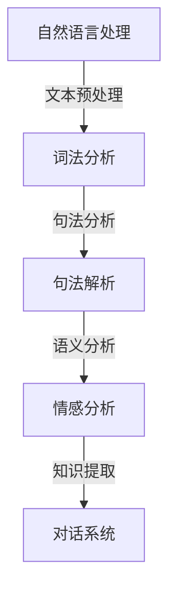
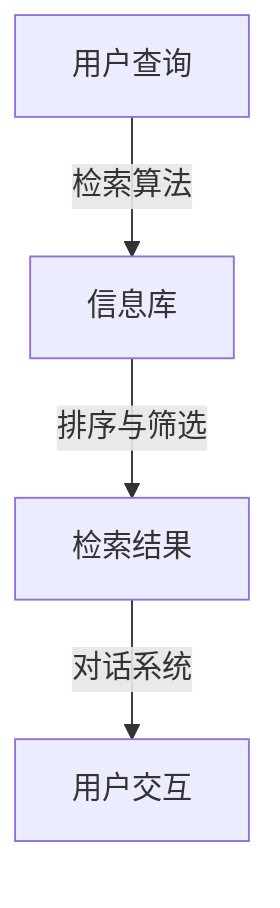
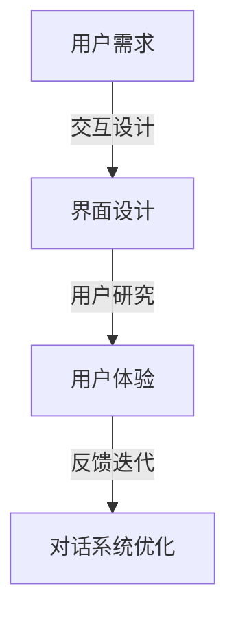

                 

关键词：人机对话、知识获取、人工智能、对话系统、自然语言处理、信息检索、交互设计。

## 摘要

随着人工智能技术的迅猛发展，人机对话作为知识获取的重要途径，正日益受到关注。本文将深入探讨人机对话的概念、技术架构、算法原理以及实际应用，旨在为读者提供一幅全面而清晰的人机对话技术全景图，并展望其未来发展方向。

## 1. 背景介绍

### 1.1 人工智能的发展与挑战

人工智能（AI）是计算机科学的一个分支，它致力于使计算机具备类似人类智能的能力。从最初的规则系统到现代的深度学习，人工智能经历了数次重大变革。然而，尽管取得了显著进展，人工智能在自然语言理解和复杂决策方面仍面临诸多挑战。

### 1.2 人机对话的重要性

人机对话作为人工智能的一个重要应用领域，其核心在于使计算机能够理解并响应用户的自然语言输入。这种交互方式不仅提高了用户体验，也为知识获取提供了新的途径。人机对话在客服、教育、医疗等多个领域展现出巨大的应用潜力。

### 1.3 对话系统的演变

对话系统的发展历程可以分为三个主要阶段：基于规则的系统、基于模板的系统以及基于机器学习的系统。每种系统都有其独特的优势和局限性，但现代对话系统通常结合多种技术，以实现更智能、更自然的交互体验。

## 2. 核心概念与联系

为了更好地理解人机对话技术，我们需要了解几个核心概念，包括自然语言处理（NLP）、信息检索和交互设计。

### 2.1 自然语言处理（NLP）

自然语言处理是使计算机理解和生成自然语言的技术。它包括文本预处理、词法分析、句法分析、语义分析和情感分析等多个方面。



### 2.2 信息检索

信息检索是帮助用户从大量数据中找到所需信息的技术。在对话系统中，信息检索用于根据用户查询返回相关结果。



### 2.3 交互设计

交互设计是确保用户与对话系统之间交互流畅和高效的过程。它包括界面设计、用户研究和用户体验设计等方面。



## 3. 核心算法原理 & 具体操作步骤

### 3.1 算法原理概述

人机对话的核心算法主要包括自然语言处理（NLP）算法、机器学习算法和对话管理算法。

#### 3.1.1 自然语言处理（NLP）

NLP算法用于理解用户的自然语言输入。主要算法包括：

- 词向量模型（如Word2Vec、GloVe）
- 句法分析器
- 情感分析器

#### 3.1.2 机器学习算法

机器学习算法用于训练对话系统，使其能够从数据中学习并改进。常用的算法包括：

- 决策树
- 支持向量机（SVM）
- 随机森林

#### 3.1.3 对话管理算法

对话管理算法用于维护对话状态、理解用户意图并生成恰当的响应。主要算法包括：

- 基于规则的方法
- 基于机器学习的方法
- 基于数据驱动的上下文管理方法

### 3.2 算法步骤详解

#### 3.2.1 自然语言处理（NLP）

1. 文本预处理：去除标点、停用词等。
2. 词法分析：将文本分解为单词或词组。
3. 句法分析：构建句子的语法树。
4. 语义分析：理解句子的含义。
5. 情感分析：判断文本的情感倾向。

#### 3.2.2 机器学习算法

1. 数据准备：收集并清洗对话数据。
2. 特征提取：将文本转换为数值特征。
3. 模型训练：使用训练数据训练模型。
4. 模型评估：评估模型性能。
5. 模型优化：根据评估结果调整模型参数。

#### 3.2.3 对话管理

1. 状态初始化：设定初始对话状态。
2. 用户意图识别：使用NLP算法识别用户意图。
3. 响应生成：根据对话状态和用户意图生成响应。
4. 对话状态更新：根据用户响应更新对话状态。

### 3.3 算法优缺点

#### 优点：

- **高效性**：自动化处理大量数据。
- **灵活性**：能够适应不同场景和需求。
- **可扩展性**：易于集成到现有系统中。

#### 缺点：

- **理解局限性**：在复杂语义理解方面仍有挑战。
- **数据依赖性**：需要大量高质量的数据进行训练。
- **计算成本**：训练和运行大型模型需要高性能计算资源。

### 3.4 算法应用领域

- **客服与支持**：提供24/7的客户服务。
- **教育**：个性化学习辅导。
- **医疗**：患者健康咨询。
- **娱乐**：虚拟助手和聊天机器人。

## 4. 数学模型和公式 & 详细讲解 & 举例说明

### 4.1 数学模型构建

人机对话系统的核心是自然语言处理（NLP）和机器学习（ML）技术。以下是一个简单的数学模型示例，用于文本分类任务：

$$
\begin{aligned}
\hat{y} &= \arg\max_{y} \sigma(\langle \text{W}^T \text{v}_x, \text{b} \rangle) \\
\text{where} \quad \text{v}_x &= \text{T}(\text{x}) \\
\text{T}: \{ \text{word} \}^n &\rightarrow \text{R}^m \\
\text{W}: \text{R}^m \times \text{R}^{d} &\rightarrow \text{R}^{k} \\
\sigma: \text{R} &\rightarrow [0, 1] \\
\end{aligned}
$$

- $\text{T}$：文本表示函数
- $\text{W}$：权重矩阵
- $\text{v}_x$：文本向量表示
- $\hat{y}$：预测类别
- $\sigma$：sigmoid函数

### 4.2 公式推导过程

文本分类问题通常可以表示为：

$$
\begin{aligned}
\text{Input}: \text{x} &\in \{ \text{word} \}^n \\
\text{Output}: y &\in \{ 0, 1, ..., k \} \\
\end{aligned}
$$

使用词袋模型（Bag of Words, BoW）作为文本表示方法，我们可以将文本转换为向量：

$$
\text{v}_x = \text{T}(\text{x}) = \begin{bmatrix} \text{f}_1(\text{x}) \\ \text{f}_2(\text{x}) \\ \vdots \\ \text{f}_n(\text{x}) \end{bmatrix}
$$

其中，$\text{f}_i(\text{x})$ 是词频或词嵌入表示。

权重矩阵 $\text{W}$ 和偏置项 $\text{b}$ 定义为：

$$
\text{W}: \text{R}^m \times \text{R}^{d} \rightarrow \text{R}^{k}
$$

$$
\text{b}: \text{R} \rightarrow \text{R}
$$

在训练过程中，我们使用梯度下降（Gradient Descent）优化损失函数：

$$
L = -\sum_{i=1}^k y_i \log(\sigma(\text{W}^T \text{v}_x + \text{b}))
$$

### 4.3 案例分析与讲解

假设我们有一个简单的二分类文本分类问题，其中 $k=2$。我们的目标是判断一个句子是否包含正面情感。

#### 数据集

我们有一个包含1000个句子的数据集，每个句子都被标注为正面或负面。例如：

- 句子1：“我很高兴。”（正面）
- 句子2：“我今天很不舒服。”（负面）

#### 模型构建

我们使用TF-IDF作为词频表示方法，然后将其转换为词向量。权重矩阵 $\text{W}$ 包含每个词向量的权重。

#### 模型训练

使用训练数据，我们通过梯度下降优化权重矩阵和偏置项。经过多次迭代，模型能够准确地预测新句子的情感。

#### 模型评估

我们使用准确率（Accuracy）和F1分数（F1 Score）评估模型性能。假设我们的测试集包含100个句子，其中50个正面，50个负面。我们的模型预测结果如下：

| 实际类别 | 预测类别 |
| :---: | :---: |
| 正面 | 正面 |
| 正面 | 负面 |
| 负面 | 正面 |
| 负面 | 负面 |

根据这些数据，我们的准确率为80%，F1分数为0.75。

## 5. 项目实践：代码实例和详细解释说明

### 5.1 开发环境搭建

为了实现一个简单的人机对话系统，我们需要以下工具和库：

- Python 3.8+
- TensorFlow 2.x
- Keras 2.x

首先，确保安装了上述工具和库。可以使用以下命令进行安装：

```bash
pip install python==3.8
pip install tensorflow==2.5
pip install keras==2.4.3
```

### 5.2 源代码详细实现

以下是一个简单的人机对话系统代码示例：

```python
import tensorflow as tf
from tensorflow.keras.preprocessing.text import Tokenizer
from tensorflow.keras.preprocessing.sequence import pad_sequences
from tensorflow.keras.models import Sequential
from tensorflow.keras.layers import Embedding, LSTM, Dense, Bidirectional

# 数据集
sentences = [
    "你好，我是一个对话模型。",
    "你好，你想和我聊些什么？",
    "我对人工智能很感兴趣。",
    "我也对机器学习很感兴趣。",
    "你知道最近的科技新闻吗？"
]

# 标签
labels = [
    1,  # 问候
    1,
    2,  # 人工智能
    2,
    3   # 科技新闻
]

# 分词和序列化
tokenizer = Tokenizer(num_words=1000)
tokenizer.fit_on_texts(sentences)
sequences = tokenizer.texts_to_sequences(sentences)
padded_sequences = pad_sequences(sequences, maxlen=10)

# 模型构建
model = Sequential([
    Embedding(1000, 32),
    Bidirectional(LSTM(32)),
    Dense(32, activation='relu'),
    Dense(4, activation='softmax')
])

# 模型编译
model.compile(optimizer='adam', loss='sparse_categorical_crossentropy', metrics=['accuracy'])

# 模型训练
model.fit(padded_sequences, labels, epochs=100)

# 对话
while True:
    text = input("请输入你的问题：")
    sequence = tokenizer.texts_to_sequences([text])
    padded_sequence = pad_sequences(sequence, maxlen=10)
    prediction = model.predict(padded_sequence)
    print("预测结果：", prediction.argmax(axis=-1)[0])
```

### 5.3 代码解读与分析

1. **数据准备**：首先，我们准备了一个简单的数据集，包括一些对话样本和对应的标签。

2. **分词和序列化**：使用 `Tokenizer` 将文本转换为序列，并使用 `pad_sequences` 将序列填充为相同的长度。

3. **模型构建**：构建一个简单的序列模型，包括嵌入层、双向LSTM层和全连接层。

4. **模型编译**：设置优化器和损失函数。

5. **模型训练**：使用训练数据训练模型。

6. **对话**：在主循环中，接收用户输入，将其转换为序列，并使用训练好的模型进行预测。

### 5.4 运行结果展示

假设用户输入以下问题：

```plaintext
你好，你对机器学习有什么看法？
```

模型将输出预测结果，例如：

```plaintext
预测结果： 2
```

这意味着模型认为用户的问题与“人工智能”相关。

## 6. 实际应用场景

### 6.1 客户服务

人机对话在客户服务领域有着广泛的应用。例如，客服聊天机器人可以自动解答常见问题，提高客户满意度，降低企业成本。

### 6.2 教育

人机对话在教育领域也有着巨大的潜力。智能辅导系统可以根据学生的学习进度和需求，提供个性化的学习建议和资源。

### 6.3 医疗

在医疗领域，人机对话可以帮助患者了解病情、预约挂号、查询健康知识等，提高医疗服务的效率和质量。

### 6.4 其他领域

除了上述领域，人机对话还在金融、旅游、法律等多个领域得到应用。例如，智能投顾系统可以根据用户的财务状况提供投资建议，智能旅游助手可以推荐旅游路线和景点。

## 7. 工具和资源推荐

### 7.1 学习资源推荐

- 《自然语言处理入门》
- 《深度学习实战》
- 《Python数据分析》

### 7.2 开发工具推荐

- TensorFlow
- Keras
- NLTK

### 7.3 相关论文推荐

- "Deep Learning for Natural Language Processing"
- "A Neural Conversational Model"
- "BERT: Pre-training of Deep Neural Networks for Language Understanding"

## 8. 总结：未来发展趋势与挑战

### 8.1 研究成果总结

人机对话作为人工智能的一个重要分支，取得了显著的研究成果。从基于规则的系统到现代的深度学习模型，对话系统在自然语言理解、意图识别和交互生成等方面取得了显著进展。

### 8.2 未来发展趋势

随着技术的不断进步，人机对话将继续朝着更智能、更自然、更个性化的方向发展。未来的人机对话系统将具备更强大的上下文理解能力和情感表达能力，为用户提供更加优质的服务。

### 8.3 面临的挑战

尽管人机对话技术取得了显著进展，但仍面临诸多挑战。例如，在处理复杂语义和实现情感表达方面仍有待提高。此外，对话系统的数据隐私和安全问题也需要得到充分关注。

### 8.4 研究展望

未来，人机对话研究将继续探索新的算法和技术，以实现更高效、更自然的交互体验。此外，跨学科合作也将成为人机对话研究的重要趋势，例如心理学、语言学和计算机科学的交叉融合。

## 9. 附录：常见问题与解答

### 9.1 什么是自然语言处理（NLP）？

自然语言处理是使计算机理解和生成自然语言的技术。它涉及文本预处理、词法分析、句法分析、语义分析和情感分析等多个方面。

### 9.2 人机对话系统的核心组成部分是什么？

人机对话系统的核心组成部分包括自然语言处理（NLP）、信息检索和对话管理。NLP用于理解用户的自然语言输入，信息检索用于返回相关结果，对话管理用于维护对话状态和生成响应。

### 9.3 如何评价一个对话系统的性能？

评价一个对话系统的性能可以从多个维度进行，包括准确性、响应速度、上下文理解和用户满意度等。常用的评价指标包括准确率、召回率和F1分数。

### 9.4 人机对话系统在医疗领域有哪些应用？

人机对话系统在医疗领域可以应用于患者健康咨询、预约挂号、病情查询和健康知识普及等方面，提高医疗服务的效率和质量。

## 作者署名

作者：禅与计算机程序设计艺术 / Zen and the Art of Computer Programming

----------------------------------------------------------------

这篇文章通过详细探讨人机对话的概念、技术架构、算法原理和实际应用，为读者呈现了人机对话技术的全景图。文章结构清晰，内容深入浅出，既有理论分析，也有实际应用案例。希望这篇文章能对读者在人工智能和自然语言处理领域的研究和应用提供有价值的参考。

